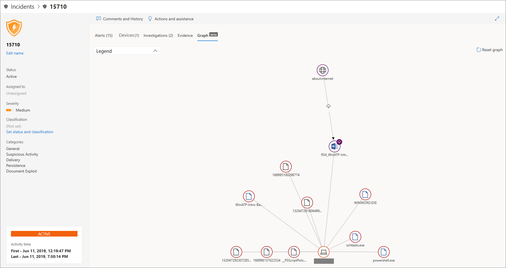

# Untersuchen von Vorfällen in Microsoft Defender for EndpointInvestigate incidents in Microsoft Defender for Endpoint

[!INCLUDE [Microsoft 365 Defender rebranding](../../includes/microsoft-defender.md)]

**Gilt für:****Applies to:**
- [Microsoft Defender für EndpunktMicrosoft Defender for Endpoint](https://go.microsoft.com/fwlink/p/?linkid=2154037)
- [Microsoft 365 DefenderMicrosoft 365 Defender](https://go.microsoft.com/fwlink/?linkid=2118804)

Untersuchen Sie Vorfälle, die Sich auf Ihr Netzwerk auswirken, verstehen Sie, was sie bedeuten, und ermitteln Sie Nachweise, um sie zu beheben.Investigate incidents that affect your network, understand what they mean, and collate evidence to resolve them. 

Wenn Sie einen Vorfall untersuchen, sehen Sie:When you investigate an incident, you'll see:
- VorfalldetailsIncident details
- Vorfallkommentare und -aktionenIncident comments and actions
- Registerkarten (Warnungen, Geräte, Untersuchungen, Nachweise, Graph)Tabs (alerts, devices, investigations, evidence, graph)

> [!VIDEO https://www.microsoft.com/en-us/videoplayer/embed/RE4qLUV]

## Analysieren von VorfalldetailsAnalyze incident details 
Klicken Sie auf einen Vorfall, um den Bereich **Vorfall anzuzeigen.**Click an incident to see the **Incident pane**. Wählen **Sie Seite Vorfall öffnen aus,** um die Vorfalldetails und zugehörige Informationen (Warnungen, Geräte, Untersuchungen, Nachweise, Diagramm) anzuzeigen.Select **Open incident page** to see the incident details and related information (alerts, devices, investigations, evidence, graph). 

### WarnungenAlerts
Sie können die Warnungen untersuchen und sehen, wie sie in einem Vorfall miteinander verknüpft wurden.You can investigate the alerts and see how they were linked together in an incident. Warnungen werden basierend auf den folgenden Gründen in Vorfälle eingeteilt:Alerts are grouped into incidents based on the following reasons:
- Automatisierte Untersuchung – Die automatisierte Untersuchung löste die verknüpfte Warnung während der Untersuchung der ursprünglichen Warnung aus.Automated investigation - The automated investigation triggered the linked alert while investigating the original alert 
- Dateimerkmale : Die dateien, die der Warnung zugeordnet sind, haben ähnliche Merkmale.File characteristics - The files associated with the alert have similar characteristics
- Manuelle Zuordnung : Ein Benutzer hat die Warnungen manuell verknüpft.Manual association - A user manually linked the alerts
- Proximatzeit – Die Warnungen wurden auf dem gleichen Gerät innerhalb eines bestimmten Zeitrahmens ausgelöst.Proximate time - The alerts were triggered on the same device within a certain timeframe
- Gleiche Datei : Die Dateien, die der Warnung zugeordnet sind, sind identisch.Same file - The files associated with the alert are exactly the same
- Gleiche URL – Die URL, die die Warnung ausgelöst hat, ist identisch.Same URL - The URL that triggered the alert is exactly the same

Sie können auch eine Warnung verwalten und Benachrichtigungsmetadaten zusammen mit anderen Informationen anzeigen.You can also manage an alert and see alert metadata along with other information. Weitere Informationen finden Sie unter [Untersuchen von Warnungen](investigate-alerts.md).For more information, see [Investigate alerts](investigate-alerts.md). 

### GeräteDevices
Sie können auch die Geräte untersuchen, die Teil oder im Zusammenhang mit einem bestimmten Vorfall sind.You can also investigate the devices that are part of, or related to, a given incident. Weitere Informationen finden Sie unter [Untersuchen von Geräten](investigate-machines.md).For more information, see [Investigate devices](investigate-machines.md).

### UntersuchungenInvestigations
Wählen **Sie Untersuchungen** aus, um alle automatischen Untersuchungen anzuzeigen, die vom System als Reaktion auf die Vorfallwarnungen gestartet wurden.Select **Investigations** to see all the automatic investigations launched by the system in response to the incident alerts.

## Durch die NachweiseGoing through the evidence
Microsoft Defender for Endpoint untersucht automatisch alle unterstützten Ereignisse und verdächtigen Entitäten in den Warnungen und stellt Ihnen Autoresponse und Informationen zu wichtigen Dateien, Prozessen, Diensten und mehr zur Verfügung.Microsoft Defender for Endpoint automatically investigates all the incidents' supported events and suspicious entities in the alerts, providing you with autoresponse and information about the important files, processes, services, and more. 

Jede der analysierten Entitäten wird als infiziert, behoben oder verdächtig gekennzeichnet.Each of the analyzed entities will be marked as infected, remediated, or suspicious. 

## Visualisieren zugeordneter CybersicherheitsbedrohungenVisualizing associated cybersecurity threats 
Microsoft Defender for Endpoint aggregiert die Bedrohungsinformationen in einem Vorfall, sodass Sie die Muster und Korrelationen aus verschiedenen Datenpunkten sehen können.Microsoft Defender for Endpoint aggregates the threat information into an incident so you can see the patterns and correlations coming in from various data points. Sie können diese Korrelation über das Vorfalldiagramm anzeigen.You can view such correlation through the incident graph.

### VorfalldiagrammIncident graph
Das **Graph** die Geschichte des Cybersicherheitsangriffs.The **Graph** tells the story of the cybersecurity attack. Beispielsweise wird gezeigt, was der Einstiegspunkt war, welcher Indikator für Einemeindung oder Aktivität auf welchem Gerät beobachtet wurde.For example, it shows you what was the entry point, which indicator of compromise or activity was observed on which device. usw.etc.

Sie können auf die Kreise im Vorfalldiagramm klicken, um die Details der schädlichen Dateien, die zugehörigen Dateierkennungen, die Anzahl der Instanzen weltweit anzuzeigen, ob sie in Ihrer Organisation beobachtet wurden, wenn ja, wie viele Instanzen.You can click the circles on the incident graph to view the details of the malicious files, associated file detections, how many instances have there been worldwide, whether it’s been observed in your organization, if so, how many instances.

## Verwandte ThemenRelated topics
- [VorfallswarteschlangeIncidents queue](https://docs.microsoft.com/microsoft-365/security/defender-endpoint/view-incidents-queue)
- [Untersuchen von Vorfällen in Microsoft Defender for EndpointInvestigate incidents in Microsoft Defender for Endpoint](https://docs.microsoft.com/microsoft-365/security/defender-endpoint/investigate-incidents)
- [Verwalten von Microsoft Defender for Endpoint-VorfällenManage Microsoft Defender for Endpoint incidents](https://docs.microsoft.com/microsoft-365/security/defender-endpoint/manage-incidents)
