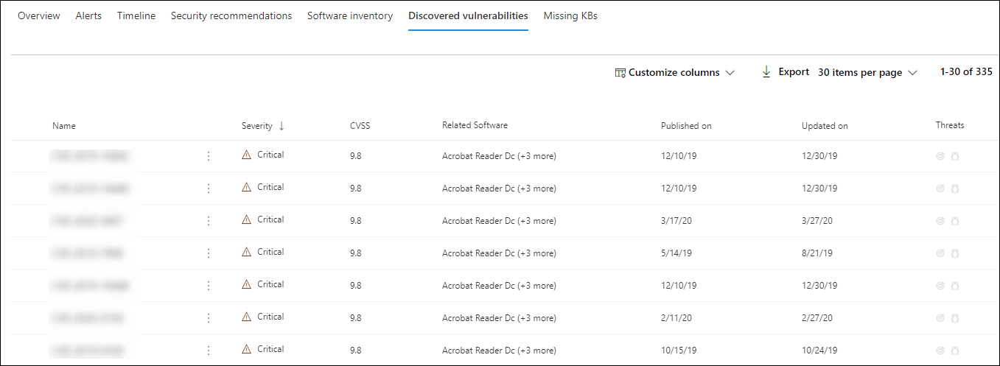
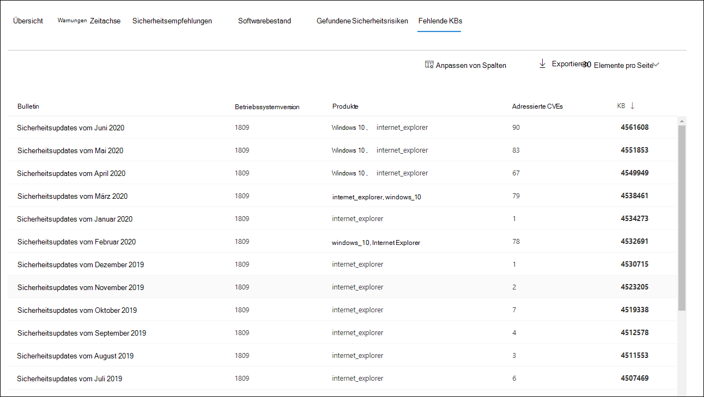
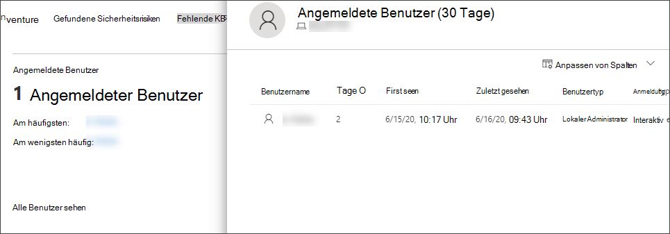

# Untersuchen von Geräten in der Microsoft Defender for Endpoint Devices-ListeInvestigate devices in the Microsoft Defender for Endpoint Devices list

[!INCLUDE [Microsoft 365 Defender rebranding](../../includes/microsoft-defender.md)]

**Gilt für:****Applies to:**
- [Microsoft Defender für EndpunktMicrosoft Defender for Endpoint](https://go.microsoft.com/fwlink/p/?linkid=2154037)
- [Microsoft 365 DefenderMicrosoft 365 Defender](https://go.microsoft.com/fwlink/?linkid=2118804)

>Möchten Sie Defender for Endpoint erleben?Want to experience Defender for Endpoint? [Registrieren Sie sich für eine kostenlose Testversion.Sign up for a free trial.](https://www.microsoft.com/microsoft-365/windows/microsoft-defender-atp?ocid=docs-wdatp-investigatemachines-abovefoldlink)

Untersuchen Sie die Details einer Warnung, die auf einem bestimmten Gerät ausgelöst wird, um andere Verhaltensweisen oder Ereignisse zu identifizieren, die im Zusammenhang mit der Warnung oder dem potenziellen Umfang der Verletzung stehen können.Investigate the details of an alert raised on a specific device to identify other behaviors or events that might be related to the alert or the potential scope of the breach.

> [!NOTE]
> Im Rahmen des Untersuchungs- oder Reaktionsprozesses können Sie ein Untersuchungspaket von einem Gerät erfassen.As part of the investigation or response process, you can collect an investigation package from a device. So geht's: [Erfassen des Untersuchungspakets von Geräten](https://docs.microsoft.com/microsoft-365/security/defender-endpoint/respond-machine-alerts#collect-investigation-package-from-devices).Here's how: [Collect investigation package from devices](https://docs.microsoft.com/microsoft-365/security/defender-endpoint/respond-machine-alerts#collect-investigation-package-from-devices).

Sie können auf betroffene Geräte klicken, wenn sie im Portal angezeigt werden, um einen detaillierten Bericht über dieses Gerät zu öffnen.You can click on affected devices whenever you see them in the portal to open a detailed report about that device. Betroffene Geräte werden in den folgenden Bereichen identifiziert:Affected devices are identified in the following areas:

- [GerätelisteDevices list](investigate-machines.md)
- [BenachrichtigungswarteschlangeAlerts queue](alerts-queue.md)
- [Dashboard für SicherheitsvorgängeSecurity operations dashboard](security-operations-dashboard.md)
- Jede einzelne WarnungAny individual alert
- Jede einzelne DateidetailseansichtAny individual file details view
- Ansicht mit allen IP-Adressen oder DomänendetailsAny IP address or domain details view

Wenn Sie ein bestimmtes Gerät untersuchen, sehen Sie:When you investigate a specific device, you'll see:

- GerätedetailsDevice details
- ReaktionsaktionenResponse actions
- Registerkarten (Übersicht, Warnungen, Zeitachse, Sicherheitsempfehlungen, Softwareinventar, ermittelte Sicherheitsrisiken, fehlende KBs)Tabs (overview, alerts, timeline, security recommendations, software inventory, discovered vulnerabilities, missing KBs)
- Karten (aktive Warnungen, angemeldete Benutzer, Sicherheitsbewertung)Cards (active alerts, logged on users, security assessment)

## GerätedetailsDevice details

Der Abschnitt Gerätedetails enthält Informationen wie die Domäne, das Betriebssystem und den Integritätsstatus des Geräts.The device details section provides information such as the domain, OS, and health state of the device. Wenn auf dem Gerät ein Untersuchungspaket verfügbar ist, wird ein Link angezeigt, über den Sie das Paket herunterladen können.If there's an investigation package available on the device, you'll see a link that allows you to download the package.

## ReaktionsaktionenResponse actions

Reaktionsaktionen werden am oberen Rand einer bestimmten Geräteseite ausgeführt und umfassen Folgendes:Response actions run along the top of a specific device page and include:

- Verwalten von KategorienManage tags
- Isolieren des GerätsIsolate device
- Einschränken der App-AusführungRestrict app execution
- Antivirusscan ausführenRun antivirus scan
- Untersuchungspaket sammelnCollect investigation package
- Initiieren der LiveantwortsitzungInitiate Live Response Session
- Initiieren einer automatisierten UntersuchungInitiate automated investigation
- Wenden Sie sich an einen BedrohungsexpertenConsult a threat expert
- Info-CenterAction center

Sie können Reaktionsaktionen im Aktionscenter, auf einer bestimmten Geräteseite oder auf einer bestimmten Dateiseite ausführen.You can take response actions in the Action center, in a specific device page, or in a specific file page.

Weitere Informationen zum Ergreifen von Aktionen auf einem Gerät finden Sie unter [Take response action on a device](respond-machine-alerts.md).For more information on how to take action on a device, see [Take response action on a device](respond-machine-alerts.md).

Weitere Informationen finden Sie unter [Untersuchen von Benutzerentitäten](investigate-user.md).For more information, see [Investigate user entities](investigate-user.md).

## RegisterkartenTabs

Die Registerkarten bieten relevante Sicherheits- und Bedrohungsschutzinformationen im Zusammenhang mit dem Gerät.The tabs provide relevant security and threat prevention information related to the device. Auf jeder Registerkarte können Sie die angezeigten  Spalten anpassen, indem Sie Spalten in der Leiste oberhalb der Spaltenüberschriften anpassen auswählen.In each tab, you can customize the columns that are shown by selecting **Customize columns** from the bar above the column headers.

### ÜbersichtOverview
Auf **der** Registerkarte Übersicht werden die [Karten für](#cards) aktive Warnungen, angemeldete Benutzer und Sicherheitsbewertung angezeigt.The **Overview** tab displays the [cards](#cards) for active alerts, logged on users, and security assessment.

### WarnungenAlerts

Die **Registerkarte Warnungen** enthält eine Liste der Warnungen, die dem Gerät zugeordnet sind.The **Alerts** tab provides a list of alerts that are associated with the device. Diese Liste ist eine gefilterte Version der Warnungswarteschlange [und](alerts-queue.md)zeigt eine kurze Beschreibung der Warnung, des Schweregrads (hoch, mittel, niedrig, informationsell), des Status in der Warteschlange (neu, in Bearbeitung, aufgelöst), der Klassifizierung (nicht festgelegt, falscher Alarm, wahrer Alarm), des Untersuchungsstatus, der Kategorie der Warnung, der Adressierung der Warnung und der letzten Aktivität.This list is a filtered version of the [Alerts queue](alerts-queue.md), and shows a short description of the alert, severity (high, medium, low, informational), status in the queue (new, in progress, resolved), classification (not set, false alert, true alert), investigation state, category of alert, who is addressing the alert, and last activity. Sie können die Warnungen auch filtern.You can also filter the alerts.

Wenn das Kreissymbol links neben einer Warnung ausgewählt ist, wird ein Fly-Out angezeigt.When the circle icon to the left of an alert is selected, a fly-out appears. In diesem Bereich können Sie die Warnung verwalten und weitere Details wie die Vorfallnummer und zugehörige Geräte anzeigen.From this panel you can manage the alert and view more details such as incident number and related devices. Mehrere Warnungen können gleichzeitig ausgewählt werden.Multiple alerts can be selected at a time.

Wählen Sie den Titel der Warnung aus, um eine vollständige Seitenansicht einer Warnung einschließlich eines Vorfalldiagramms und einer Prozessstruktur anzuzeigen.To see a full page view of an alert including incident graph and process tree, select the title of the alert.

### ZeitachseTimeline

Die **Registerkarte Zeitachse** bietet eine chronologische Ansicht der Ereignisse und zugeordneten Warnungen, die auf dem Gerät beobachtet wurden.The **Timeline** tab provides a chronological view of the events and associated alerts that have been observed on the device. Dadurch können Sie Ereignisse, Dateien und IP-Adressen in Bezug auf das Gerät korrelieren.This can help you correlate any events, files, and IP addresses in relation to the device.

Die Zeitachse ermöglicht es Ihnen auch, einen selektiven Drilldown auf Ereignisse zu erstellen, die innerhalb eines bestimmten Zeitraums aufgetreten sind.The timeline also enables you to selectively drill down into events that occurred within a given time period. Sie können die zeitliche Abfolge von Ereignissen anzeigen, die auf einem Gerät über einen ausgewählten Zeitraum aufgetreten sind.You can view the temporal sequence of events that occurred on a device over a selected time period. Um Ihre Ansicht weiter zu steuern, können Sie nach Ereignisgruppen filtern oder die Spalten anpassen.To further control your view, you can filter by event groups or customize the columns.

>[!NOTE]
> Damit Firewallereignisse angezeigt werden, müssen Sie die Überwachungsrichtlinie aktivieren, siehe [Überwachung filterplattformverbindung](https://docs.microsoft.com/windows/security/threat-protection/auditing/audit-filtering-platform-connection).For firewall events to be displayed, you'll need to enable the audit policy, see [Audit Filtering Platform connection](https://docs.microsoft.com/windows/security/threat-protection/auditing/audit-filtering-platform-connection).
>Firewall deckt die folgenden Ereignisse abFirewall covers the following events
>
>- [5025](https://docs.microsoft.com/windows/security/threat-protection/auditing/event-5025) – Firewalldienst beendet[5025](https://docs.microsoft.com/windows/security/threat-protection/auditing/event-5025) - firewall service stopped
>- [5031](https://docs.microsoft.com/windows/security/threat-protection/auditing/event-5031) – Anwendung blockiert, eingehende Verbindungen im Netzwerk zu akzeptieren[5031](https://docs.microsoft.com/windows/security/threat-protection/auditing/event-5031) - application blocked from accepting incoming connections on the network
>- [5157](https://docs.microsoft.com/windows/security/threat-protection/auditing/event-5157) – blockierte Verbindung[5157](https://docs.microsoft.com/windows/security/threat-protection/auditing/event-5157) - blocked connection

Zu den Funktionen gehören:Some of the functionality includes:

- Suchen nach bestimmten EreignissenSearch for specific events
  - Verwenden Sie die Suchleiste, um nach bestimmten Zeitachsenereignissen zu suchen.Use the search bar to look for specific timeline events.
- Filtern von Ereignissen aus einem bestimmten DatumFilter events from a specific date
  - Wählen Sie das Kalendersymbol in der oberen linken Ecke der Tabelle aus, um Ereignisse im vergangenen Tag, in der letzten Woche, in 30 Tagen oder im benutzerdefinierten Bereich anzuzeigen.Select the calendar icon in the upper left of the table to display events in the past day, week, 30 days, or custom range. Standardmäßig ist die Gerätezeitachse so festgelegt, dass die Ereignisse aus den letzten 30 Tagen angezeigt werden.By default, the device timeline is set to display the events from the past 30 days.
  - Verwenden Sie die Zeitachse, um zu einem bestimmten Zeitpunkt zu springen, indem Sie den Abschnitt hervorheben.Use the timeline to jump to a specific moment in time by highlighting the section. Die Pfeile auf der Zeitachse zeigen automatisierte Untersuchungen anThe arrows on the timeline pinpoint automated investigations
- Exportieren detaillierter GerätezeitachsenereignisseExport detailed device timeline events
  - Exportieren Sie die Gerätezeitachse für das aktuelle Datum oder einen angegebenen Datumsbereich bis zu sieben Tage.Export the device timeline for the current date or a specified date range up to seven days.

Weitere Informationen zu bestimmten Ereignissen finden Sie im **Abschnitt Zusätzliche** Informationen.More details about certain events are provided in the **Additional information** section. Diese Details variieren je nach Ereignistyp, z. B.:These details vary depending on the type of event, for example: 

- Von Application Guard enthalten – das Webbrowserereignis wurde durch einen isolierten Container eingeschränktContained by Application Guard - the web browser event was restricted by an isolated container
- Erkannte aktive Bedrohung – Die Bedrohungserkennung wurde während der Ausführung der Bedrohung erkannt.Active threat detected - the threat detection occurred while the threat was running
- Behebung nicht erfolgreich – Ein Versuch zur Behebung der erkannten Bedrohung wurde aufgerufen, aber fehlgeschlagenRemediation unsuccessful - an attempt to remediate the detected threat was invoked but failed
- Behebung erfolgreich – die erkannte Bedrohung wurde beendet und bereinigtRemediation successful - the detected threat was stopped and cleaned
- Vom Benutzer umgangene Warnung – die Windows Defender SmartScreen-Warnung wurde von einem Benutzer verworfen und überschrieben.Warning bypassed by user - the Windows Defender SmartScreen warning was dismissed and overridden by a user
- Verdächtiges Skript erkannt – Es wurde ein potenziell schädliches Skript gefunden, das ausgeführt wirdSuspicious script detected - a potentially malicious script was found running
- Die Warnungskategorie – wenn das Ereignis zur Generierung einer Warnung geführt hat, wird die Warnungskategorie ("Laterale Bewegung" z. B. ) bereitgestellt.The alert category - if the event led to the generation of an alert, the alert category  ("Lateral Movement", for example) is provided

#### EreignisdetailsEvent details
Wählen Sie ein Ereignis aus, um relevante Details zu diesem Ereignis anzuzeigen.Select an event to view relevant details about that event. Ein Bereich wird angezeigt, um allgemeine Ereignisinformationen zu zeigen.A panel displays to show general event information. Wenn zutreffend und Daten verfügbar sind, wird auch ein Diagramm mit verwandten Entitäten und deren Beziehungen angezeigt.When applicable and data is available, a graph showing related entities and their relationships are also shown.

Um das Ereignis und die zugehörigen Ereignisse  weiter zu untersuchen, können Sie schnell eine erweiterte Suchabfrage ausführen, indem **Sie Hunt für verwandte Ereignisse auswählen.**To further inspect the event and related events, you can quickly run an [advanced hunting](advanced-hunting-overview.md) query by selecting **Hunt for related events**. Die Abfrage gibt das ausgewählte Ereignis und die Liste der anderen Ereignisse zurück, die etwa zur gleichen Zeit auf demselben Endpunkt aufgetreten sind.The query will return the selected event and the list of other events that occurred around the same time on the same endpoint.

### SicherheitsempfehlungenSecurity recommendations

**Sicherheitsempfehlungen** werden aus der Bedrohungsverwaltungsfunktion von Microsoft Defender [& Endpoint](tvm-dashboard-insights.md) generiert.**Security recommendations** are generated from Microsoft Defender for Endpoint's [Threat & Vulnerability Management](tvm-dashboard-insights.md) capability. Wenn Sie eine Empfehlung auswählen, wird ein Panel angezeigt, in dem Sie relevante Details anzeigen können, z. B. die Beschreibung der Empfehlung und die potenziellen Risiken, die mit der nichten Umsetzung verbunden sind.Selecting a recommendation will show a panel where you can view relevant details such as description of the recommendation and the potential risks associated with not enacting it. Weitere [Informationen finden Sie unter Sicherheitsempfehlung.](tvm-security-recommendation.md)See [Security recommendation](tvm-security-recommendation.md) for details.

### SoftwarebestandSoftware inventory

Auf **der Registerkarte Softwareinventar** können Sie Software auf dem Gerät sowie alle Schwächen oder Bedrohungen anzeigen.The **Software inventory** tab lets you view software on the device, along with any weaknesses or threats. Wenn Sie den Namen der Software auswählen, gelangen Sie zur Seite mit den Softwaredetails, auf der Sie Sicherheitsempfehlungen, ermittelte Sicherheitsrisiken, installierte Geräte und Versionsverteilung anzeigen können.Selecting the name of the software will take you to the software details page where you can view security recommendations, discovered vulnerabilities, installed devices, and version distribution. Weitere [Informationen finden Sie unter Softwareinventar](tvm-software-inventory.md)See [Software inventory](tvm-software-inventory.md) for details

### Gefundene SicherheitsrisikenDiscovered vulnerabilities

Auf **der Registerkarte Ermittelte Sicherheitsrisiken** werden der Name, der Schweregrad und die Bedrohungseinblicke entdeckter Sicherheitsrisiken auf dem Gerät angezeigt.The **Discovered vulnerabilities** tab shows the name, severity, and threat insights of discovered vulnerabilities on the device. Wenn Sie bestimmte Sicherheitsrisiken auswählen, werden eine Beschreibung und Details angezeigt.Selecting specific vulnerabilities will show a description and details.

### Fehlende KBsMissing KBs
Auf der Registerkarte Fehlende **KBs** werden die fehlenden Sicherheitsupdates für das Gerät aufgeführt.The **Missing KBs** tab lists the missing security updates for the device.

## KartenCards

### Aktive WarnungenActive alerts

Die **Azure Advanced Threat Protection-Karte** zeigt eine übersicht über Warnungen im Zusammenhang mit dem Gerät und deren Risikostufe an, wenn Sie das Microsoft Defender for Identity-Feature aktiviert haben und aktive Warnungen verfügbar sind.The **Azure Advanced Threat Protection** card will display a high-level overview of alerts related to the device and their risk level, if you have enabled the Microsoft Defender for Identity feature, and there are any active alerts. Weitere Informationen finden Sie im Drilldown "Alerts".More information is available in the "Alerts" drill down.

>[!NOTE]
>Sie müssen die Integration in Microsoft Defender for Identity und Defender for Endpoint aktivieren, um dieses Feature verwenden zu können.You'll need to enable the integration on both Microsoft Defender for Identity and Defender for Endpoint to use this feature. In Defender for Endpoint können Sie dieses Feature in erweiterten Features aktivieren.In Defender for Endpoint, you can enable this feature in advanced features. Weitere Informationen zum Aktivieren erweiterter Features finden Sie unter [Turn on advanced features](advanced-features.md).For more information on how to enable advanced features, see [Turn on advanced features](advanced-features.md).

### Angemeldete BenutzerLogged on users

Die **Karte Angemeldete** Benutzer zeigt an, wie viele Benutzer sich in den letzten 30 Tagen angemeldet haben, zusammen mit den meisten und am wenigsten häufigen Benutzern.The **Logged on users** card shows how many users have logged on in the past 30 days, along with the most and least frequent users. Wenn Sie den Link "Alle Benutzer anzeigen" auswählen, wird der Detailbereich geöffnet, in dem Informationen wie Benutzertyp, Anmeldetyp und der erste und letzte Benutzer angezeigt werden.Selecting the "See all users" link opens the details pane, which displays information such as user type, log on type, and when the user was first and last seen. Weitere Informationen finden Sie unter [Untersuchen von Benutzerentitäten](investigate-user.md).For more information, see [Investigate user entities](investigate-user.md).

### SicherheitsbewertungenSecurity assessments

Die **Karte "Sicherheitsbewertungen"** zeigt die allgemeine Belichtungsstufe, Sicherheitsempfehlungen, installierte Software und ermittelte Sicherheitsrisiken an.The **Security assessments** card shows the overall exposure level, security recommendations, installed software, and discovered vulnerabilities. Die Belichtungsstufe eines Geräts wird durch die kumulierten Auswirkungen der ausstehenden Sicherheitsempfehlungen bestimmt.A device's exposure level is determined by the cumulative impact of its pending security recommendations.

## Verwandte ThemenRelated topics

- [Anzeigen und Organisieren der Microsoft Defender for Endpoint Alerts-WarteschlangeView and organize the Microsoft Defender for Endpoint Alerts queue](alerts-queue.md)
- [Verwalten von Microsoft Defender for Endpoint-WarnungenManage Microsoft Defender for Endpoint alerts](manage-alerts.md)
- [Untersuchen von Microsoft Defender for Endpoint-WarnungenInvestigate Microsoft Defender for Endpoint alerts](investigate-alerts.md)
- [Untersuchen einer Datei, die einer Defender for Endpoint-Warnung zugeordnet istInvestigate a file associated with a Defender for Endpoint alert](investigate-files.md)
- [Untersuchen einer einer Defender for Endpoint-Warnung zugeordneten IP-AdresseInvestigate an IP address associated with a Defender for Endpoint alert](investigate-ip.md)
- [Untersuchen einer Domäne, die einer Defender for Endpoint-Warnung zugeordnet istInvestigate a domain associated with a Defender for Endpoint alert](investigate-domain.md)
- [Untersuchen eines Benutzerkontos in Defender for EndpointInvestigate a user account in Defender for Endpoint](investigate-user.md)
- [SicherheitsempfehlungSecurity recommendation](tvm-security-recommendation.md)
- [SoftwarebestandSoftware inventory](tvm-software-inventory.md)
