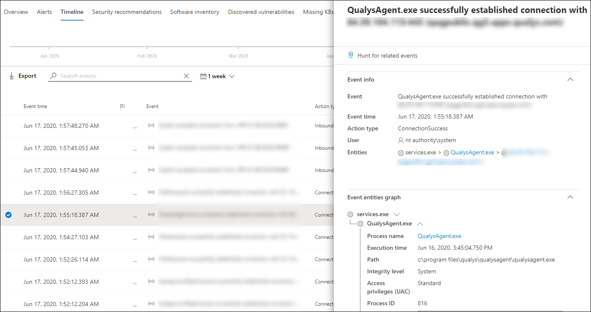
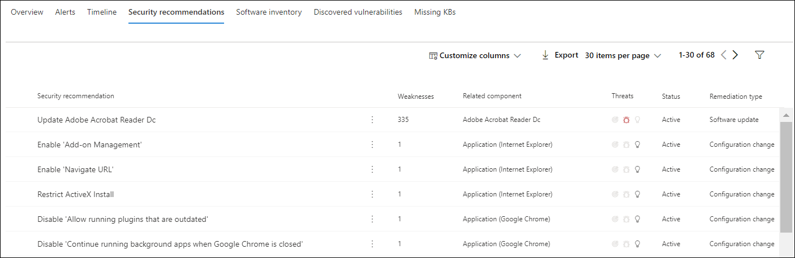

# Untersuchen von Geräten in der Microsoft Defender for Endpoint Devices-Liste

[!INCLUDE [Microsoft 365 Defender rebranding](../../includes/microsoft-defender.md)]

**Gilt für:**
- [Microsoft Defender für Endpunkt](https://go.microsoft.com/fwlink/p/?linkid=2154037)
- [Microsoft 365 Defender](https://go.microsoft.com/fwlink/?linkid=2118804)

>Möchten Sie Defender for Endpoint erleben? [Registrieren Sie sich für eine kostenlose Testversion.](https://www.microsoft.com/microsoft-365/windows/microsoft-defender-atp?ocid=docs-wdatp-investigatemachines-abovefoldlink)

Untersuchen Sie die Details einer Warnung, die auf einem bestimmten Gerät ausgelöst wird, um andere Verhaltensweisen oder Ereignisse zu identifizieren, die im Zusammenhang mit der Warnung oder dem potenziellen Umfang der Verletzung stehen können.

> [!NOTE]
> Im Rahmen des Untersuchungs- oder Reaktionsprozesses können Sie ein Untersuchungspaket von einem Gerät erfassen. So geht's: [Erfassen des Untersuchungspakets von Geräten](https://docs.microsoft.com/microsoft-365/security/defender-endpoint/respond-machine-alerts#collect-investigation-package-from-devices).

Sie können auf betroffene Geräte klicken, wenn sie im Portal angezeigt werden, um einen detaillierten Bericht über dieses Gerät zu öffnen. Betroffene Geräte werden in den folgenden Bereichen identifiziert:

- [Geräteliste](investigate-machines.md)
- [Benachrichtigungswarteschlange](alerts-queue.md)
- [Dashboard für Sicherheitsvorgänge](security-operations-dashboard.md)
- Jede einzelne Warnung
- Jede einzelne Dateidetailseansicht
- Ansicht mit allen IP-Adressen oder Domänendetails

Wenn Sie ein bestimmtes Gerät untersuchen, sehen Sie:

- Gerätedetails
- Reaktionsaktionen
- Registerkarten (Übersicht, Warnungen, Zeitachse, Sicherheitsempfehlungen, Softwareinventar, ermittelte Sicherheitsrisiken, fehlende KBs)
- Karten (aktive Warnungen, angemeldete Benutzer, Sicherheitsbewertung)

## Gerätedetails

Der Abschnitt Gerätedetails enthält Informationen wie die Domäne, das Betriebssystem und den Integritätsstatus des Geräts. Wenn auf dem Gerät ein Untersuchungspaket verfügbar ist, wird ein Link angezeigt, über den Sie das Paket herunterladen können.

## Reaktionsaktionen

Reaktionsaktionen werden am oberen Rand einer bestimmten Geräteseite ausgeführt und umfassen Folgendes:

- Verwalten von Tags
- Isolieren des Geräts
- Einschränken der App-Ausführung
- Ausführen der Antivirenscans
- Untersuchungspaket sammeln
- Initiieren der Liveantwortsitzung
- Initiieren einer automatisierten Untersuchung
- Konsultieren eines Bedrohungsexperten
- Info-Center

Sie können Reaktionsaktionen im Aktionscenter, auf einer bestimmten Geräteseite oder auf einer bestimmten Dateiseite ausführen.

Weitere Informationen zum Ergreifen von Aktionen auf einem Gerät finden Sie unter [Take response action on a device](respond-machine-alerts.md).

Weitere Informationen finden Sie unter [Untersuchen von Benutzerentitäten](investigate-user.md).

## Registerkarten

Die Registerkarten bieten relevante Sicherheits- und Bedrohungsschutzinformationen im Zusammenhang mit dem Gerät. Auf jeder Registerkarte können Sie die angezeigten  Spalten anpassen, indem Sie Spalten in der Leiste oberhalb der Spaltenüberschriften anpassen auswählen.

### Übersicht
Auf **der** Registerkarte Übersicht werden die [Karten für](#cards) aktive Warnungen, angemeldete Benutzer und Sicherheitsbewertung angezeigt.

### Warnungen

Die **Registerkarte Warnungen** enthält eine Liste der Warnungen, die dem Gerät zugeordnet sind. Diese Liste ist eine gefilterte Version der Warnungswarteschlange [und](alerts-queue.md)zeigt eine kurze Beschreibung der Warnung, des Schweregrads (hoch, mittel, niedrig, informationsell), des Status in der Warteschlange (neu, in Bearbeitung, aufgelöst), der Klassifizierung (nicht festgelegt, falscher Alarm, wahrer Alarm), des Untersuchungsstatus, der Kategorie der Warnung, der Adressierung der Warnung und der letzten Aktivität. Sie können die Warnungen auch filtern.

Wenn das Kreissymbol links neben einer Warnung ausgewählt ist, wird ein Fly-Out angezeigt. In diesem Bereich können Sie die Warnung verwalten und weitere Details wie die Vorfallnummer und zugehörige Geräte anzeigen. Mehrere Warnungen können gleichzeitig ausgewählt werden.

Wählen Sie den Titel der Warnung aus, um eine vollständige Seitenansicht einer Warnung einschließlich eines Vorfalldiagramms und einer Prozessstruktur anzuzeigen.

### Zeitachse

Die **Registerkarte Zeitachse** bietet eine chronologische Ansicht der Ereignisse und zugeordneten Warnungen, die auf dem Gerät beobachtet wurden. Dadurch können Sie Ereignisse, Dateien und IP-Adressen in Bezug auf das Gerät korrelieren.

Die Zeitachse ermöglicht es Ihnen auch, einen selektiven Drilldown auf Ereignisse zu erstellen, die innerhalb eines bestimmten Zeitraums aufgetreten sind. Sie können die zeitliche Abfolge von Ereignissen anzeigen, die auf einem Gerät über einen ausgewählten Zeitraum aufgetreten sind. Um Ihre Ansicht weiter zu steuern, können Sie nach Ereignisgruppen filtern oder die Spalten anpassen.

>[!NOTE]
> Damit Firewallereignisse angezeigt werden, müssen Sie die Überwachungsrichtlinie aktivieren, siehe [Überwachung filterplattformverbindung](https://docs.microsoft.com/windows/security/threat-protection/auditing/audit-filtering-platform-connection).
>Firewall deckt die folgenden Ereignisse ab
>
>- [5025](https://docs.microsoft.com/windows/security/threat-protection/auditing/event-5025) – Firewalldienst beendet
>- [5031](https://docs.microsoft.com/windows/security/threat-protection/auditing/event-5031) – Anwendung blockiert, eingehende Verbindungen im Netzwerk zu akzeptieren
>- [5157](https://docs.microsoft.com/windows/security/threat-protection/auditing/event-5157) – blockierte Verbindung

Zu den Funktionen gehören:

- Suchen nach bestimmten Ereignissen
  - Verwenden Sie die Suchleiste, um nach bestimmten Zeitachsenereignissen zu suchen.
- Filtern von Ereignissen aus einem bestimmten Datum
  - Wählen Sie das Kalendersymbol in der oberen linken Ecke der Tabelle aus, um Ereignisse im vergangenen Tag, in der letzten Woche, in 30 Tagen oder im benutzerdefinierten Bereich anzuzeigen. Standardmäßig ist die Gerätezeitachse so festgelegt, dass die Ereignisse aus den letzten 30 Tagen angezeigt werden.
  - Verwenden Sie die Zeitachse, um zu einem bestimmten Zeitpunkt zu springen, indem Sie den Abschnitt hervorheben. Die Pfeile auf der Zeitachse zeigen automatisierte Untersuchungen an
- Exportieren detaillierter Gerätezeitachsenereignisse
  - Exportieren Sie die Gerätezeitachse für das aktuelle Datum oder einen angegebenen Datumsbereich bis zu sieben Tage.

Weitere Informationen zu bestimmten Ereignissen finden Sie im **Abschnitt Zusätzliche** Informationen. Diese Details variieren je nach Ereignistyp, z. B.: 

- Von Application Guard enthalten – das Webbrowserereignis wurde durch einen isolierten Container eingeschränkt
- Erkannte aktive Bedrohung – Die Bedrohungserkennung wurde während der Ausführung der Bedrohung erkannt.
- Behebung nicht erfolgreich – Ein Versuch zur Behebung der erkannten Bedrohung wurde aufgerufen, aber fehlgeschlagen
- Behebung erfolgreich – die erkannte Bedrohung wurde beendet und bereinigt
- Vom Benutzer umgangene Warnung – die Windows Defender SmartScreen-Warnung wurde von einem Benutzer verworfen und außer Kraft gesetzt.
- Verdächtiges Skript erkannt – Es wurde ein potenziell schädliches Skript gefunden, das ausgeführt wird
- Die Warnungskategorie – wenn das Ereignis zur Generierung einer Warnung geführt hat, wird die Warnungskategorie ("Laterale Bewegung" z. B. ) bereitgestellt.

#### Ereignisdetails
Wählen Sie ein Ereignis aus, um relevante Details zu diesem Ereignis anzuzeigen. Ein Bereich wird angezeigt, um allgemeine Ereignisinformationen zu zeigen. Wenn zutreffend und Daten verfügbar sind, wird auch ein Diagramm mit verwandten Entitäten und deren Beziehungen angezeigt.

Um das Ereignis und die zugehörigen Ereignisse  weiter zu untersuchen, können Sie schnell eine erweiterte Suchabfrage ausführen, indem **Sie Hunt für verwandte Ereignisse auswählen.** Die Abfrage gibt das ausgewählte Ereignis und die Liste der anderen Ereignisse zurück, die etwa zur gleichen Zeit auf demselben Endpunkt aufgetreten sind.

### Sicherheitsempfehlungen

**Sicherheitsempfehlungen** werden aus der Bedrohungsverwaltungsfunktion von Microsoft Defender [& Endpoint](tvm-dashboard-insights.md) generiert. Wenn Sie eine Empfehlung auswählen, wird ein Panel angezeigt, in dem Sie relevante Details anzeigen können, z. B. die Beschreibung der Empfehlung und die potenziellen Risiken, die mit der nichten Umsetzung verbunden sind. Weitere [Informationen finden Sie unter Sicherheitsempfehlung.](tvm-security-recommendation.md)

### Softwarebestand

Auf **der Registerkarte Softwareinventar** können Sie Software auf dem Gerät sowie alle Schwächen oder Bedrohungen anzeigen. Wenn Sie den Namen der Software auswählen, gelangen Sie zur Seite mit den Softwaredetails, auf der Sie Sicherheitsempfehlungen, ermittelte Sicherheitsrisiken, installierte Geräte und Versionsverteilung anzeigen können. Weitere [Informationen finden Sie unter Softwareinventar](tvm-software-inventory.md)

### Gefundene Sicherheitsrisiken

Auf **der Registerkarte Ermittelte Sicherheitsrisiken** werden der Name, der Schweregrad und die Bedrohungseinblicke entdeckter Sicherheitsrisiken auf dem Gerät angezeigt. Wenn Sie bestimmte Sicherheitsrisiken auswählen, werden eine Beschreibung und Details angezeigt.

### Fehlende KBs
Auf der Registerkarte Fehlende **KBs** werden die fehlenden Sicherheitsupdates für das Gerät aufgeführt.

## Karten

### Aktive Warnungen

Die **Azure Advanced Threat Protection-Karte** zeigt eine übersicht über Warnungen im Zusammenhang mit dem Gerät und deren Risikostufe an, wenn Sie das Azure ATP-Feature aktiviert haben und aktive Warnungen verfügbar sind. Weitere Informationen finden Sie im Drilldown "Alerts".

>[!NOTE]
>Sie müssen die Integration in Azure ATP und Defender for Endpoint aktivieren, um dieses Feature verwenden zu können. In Defender for Endpoint können Sie dieses Feature in erweiterten Features aktivieren. Weitere Informationen zum Aktivieren erweiterter Features finden Sie unter [Turn on advanced features](advanced-features.md).

### Angemeldete Benutzer

Die **Karte Angemeldete** Benutzer zeigt an, wie viele Benutzer sich in den letzten 30 Tagen angemeldet haben, zusammen mit den meisten und am wenigsten häufigen Benutzern. Wenn Sie den Link "Alle Benutzer anzeigen" auswählen, wird der Detailbereich geöffnet, in dem Informationen wie Benutzertyp, Anmeldetyp und der erste und letzte Benutzer angezeigt werden. Weitere Informationen finden Sie unter [Untersuchen von Benutzerentitäten](investigate-user.md).

### Sicherheitsbewertungen

Die **Karte "Sicherheitsbewertungen"** zeigt die allgemeine Belichtungsstufe, Sicherheitsempfehlungen, installierte Software und ermittelte Sicherheitsrisiken an. Die Belichtungsstufe eines Geräts wird durch die kumulierten Auswirkungen der ausstehenden Sicherheitsempfehlungen bestimmt.

## Verwandte Themen

- [Anzeigen und Organisieren der Microsoft Defender for Endpoint Alerts-Warteschlange](alerts-queue.md)
- [Verwalten von Microsoft Defender for Endpoint-Warnungen](manage-alerts.md)
- [Untersuchen von Microsoft Defender for Endpoint-Warnungen](investigate-alerts.md)
- [Untersuchen einer Datei, die einer Defender for Endpoint-Warnung zugeordnet ist](investigate-files.md)
- [Untersuchen einer einer Defender for Endpoint-Warnung zugeordneten IP-Adresse](investigate-ip.md)
- [Untersuchen einer Domäne, die einer Defender for Endpoint-Warnung zugeordnet ist](investigate-domain.md)
- [Untersuchen eines Benutzerkontos in Defender for Endpoint](investigate-user.md)
- [Sicherheitsempfehlung](tvm-security-recommendation.md)
- [Softwarebestand](tvm-software-inventory.md)
