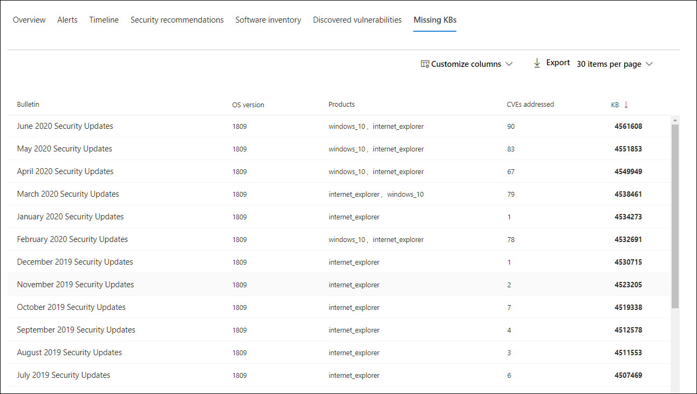

# Untersuchen von Geräten in der Liste "Microsoft Defender für Endpunktgeräte"Investigate devices in the Microsoft Defender for Endpoint Devices list

[!INCLUDE [Microsoft 365 Defender rebranding](../../includes/microsoft-defender.md)]

**Gilt für:****Applies to:**
- [Microsoft Defender für EndpunktMicrosoft Defender for Endpoint](https://go.microsoft.com/fwlink/p/?linkid=2154037)
- [Microsoft 365 DefenderMicrosoft 365 Defender](https://go.microsoft.com/fwlink/?linkid=2118804)

>Möchten Sie Defender für Endpunkt erfahren?Want to experience Defender for Endpoint? [Registrieren Sie sich für eine kostenlose TestversionSign up for a free trial.](https://www.microsoft.com/microsoft-365/windows/microsoft-defender-atp?ocid=docs-wdatp-investigatemachines-abovefoldlink)

Untersuchen Sie die Details einer Warnung, die auf einem bestimmten Gerät ausgelöst wird, um andere Verhaltensweisen oder Ereignisse zu identifizieren, die mit der Warnung oder dem potenziellen Umfang der Verletzung zusammenhängen könnten.Investigate the details of an alert raised on a specific device to identify other behaviors or events that might be related to the alert or the potential scope of the breach.

> [!NOTE]
> Im Rahmen des Untersuchungs- oder Reaktionsprozesses können Sie ein Untersuchungspaket von einem Gerät erfassen.As part of the investigation or response process, you can collect an investigation package from a device. Hier sehen Sie, wie: [Erfassen Sie untersuchungspaket von Geräten](/microsoft-365/security/defender-endpoint/respond-machine-alerts#collect-investigation-package-from-devices).Here's how: [Collect investigation package from devices](/microsoft-365/security/defender-endpoint/respond-machine-alerts#collect-investigation-package-from-devices).

Sie können auf betroffene Geräte klicken, wenn sie im Portal angezeigt werden, um einen detaillierten Bericht zu diesem Gerät zu öffnen.You can click on affected devices whenever you see them in the portal to open a detailed report about that device. Betroffene Geräte werden in den folgenden Bereichen identifiziert:Affected devices are identified in the following areas:

- [GerätelisteDevices list](investigate-machines.md)
- [BenachrichtigungswarteschlangeAlerts queue](alerts-queue.md)
- [Dashboard für SicherheitsvorgängeSecurity operations dashboard](security-operations-dashboard.md)
- Jede einzelne WarnungAny individual alert
- Jede einzelne DateidetailseansichtAny individual file details view
- Alle IP-Adressen oder DomänendetailsAny IP address or domain details view

Wenn Sie ein bestimmtes Gerät untersuchen, sehen Sie Folgendes:When you investigate a specific device, you'll see:

- GerätedetailsDevice details
- AntwortaktionenResponse actions
- Registerkarten (Übersicht, Warnungen, Zeitachse, Sicherheitsempfehlungen, Softwareinventarisierung, erkannte Sicherheitsrisiken, fehlende KBs)Tabs (overview, alerts, timeline, security recommendations, software inventory, discovered vulnerabilities, missing KBs)
- Karten (aktive Warnungen, angemeldete Benutzer, Sicherheitsbewertung)Cards (active alerts, logged on users, security assessment)

> [!NOTE]
> Aufgrund von Produkteinschränkungen berücksichtigt das Geräteprofil nicht alle Cyberbeweise bei der Bestimmung des Zeitrahmens "Zuletzt gesehen" (siehe auch auf der Geräteseite).Due to product constrains, the device profile does not consider all cyber evidence when determining the 'Last Seen' timeframe (as seen on the device page as well).
> Beispielsweise kann der Wert "Zuletzt gesehen" auf der Geräteseite einen älteren Zeitrahmen anzeigen, obwohl aktuellere Warnungen oder Daten auf der Zeitachse des Computers verfügbar sind.For example, the 'Last seen' value in the Device page may show an older time frame even though more recent alerts or data is available in the machine's timeline.

## GerätedetailsDevice details

Der Abschnitt "Gerätedetails" enthält Informationen wie Domäne, Betriebssystem und Integritätsstatus des Geräts.The device details section provides information such as the domain, OS, and health state of the device. Wenn ein Untersuchungspaket auf dem Gerät verfügbar ist, wird ein Link angezeigt, über den Sie das Paket herunterladen können.If there's an investigation package available on the device, you'll see a link that allows you to download the package.

## AntwortaktionenResponse actions

Antwortaktionen werden oben auf einer bestimmten Geräteseite ausgeführt und umfassen Folgendes:Response actions run along the top of a specific device page and include:

- Verwalten von KategorienManage tags
- Gerät isolierenIsolate device
- App-Ausführung einschränkenRestrict app execution
- Antivirusscan ausführenRun antivirus scan
- Untersuchungspaket sammelnCollect investigation package
- Initiieren einer LiveantwortsitzungInitiate Live Response Session
- Initiieren einer automatisierten UntersuchungInitiate automated investigation
- Wenden Sie sich an einen BedrohungsexpertenConsult a threat expert
- Info-CenterAction center

Sie können Reaktionsaktionen im Info-Center, auf einer bestimmten Geräteseite oder auf einer bestimmten Dateiseite ausführen.You can take response actions in the Action center, in a specific device page, or in a specific file page.

Weitere Informationen zum Ausführen von Maßnahmen auf einem Gerät finden Sie unter "Ergreifen von [Gegenmaßnahmen auf einem Gerät".](respond-machine-alerts.md)For more information on how to take action on a device, see [Take response action on a device](respond-machine-alerts.md).

Weitere Informationen finden Sie unter [Untersuchen von Benutzerentitäten.](investigate-user.md)For more information, see [Investigate user entities](investigate-user.md).

## RegisterkartenTabs

Die Registerkarten enthalten relevante Informationen zur Sicherheit und Bedrohungsverhütung im Zusammenhang mit dem Gerät.The tabs provide relevant security and threat prevention information related to the device. Auf jeder Registerkarte können Sie die angezeigten Spalten anpassen, indem Sie **Spalten** in der Leiste oberhalb der Spaltenüberschriften anpassen auswählen.In each tab, you can customize the columns that are shown by selecting **Customize columns** from the bar above the column headers.

### ÜbersichtOverview
Auf der Registerkarte **"Übersicht"** werden die [Karten](#cards) für aktive Warnungen, angemeldete Benutzer und Sicherheitsbewertungen angezeigt.The **Overview** tab displays the [cards](#cards) for active alerts, logged on users, and security assessment.

### WarnungenAlerts

Die Registerkarte **"Warnungen"** enthält eine Liste der Warnungen, die dem Gerät zugeordnet sind.The **Alerts** tab provides a list of alerts that are associated with the device. Diese Liste ist eine gefilterte Version der [Warnungswarteschlange](alerts-queue.md)und zeigt eine kurze Beschreibung der Warnung, des Schweregrads (hoch, mittel, niedrig, informational), des Status in der Warteschlange (neu, in Bearbeitung, aufgelöst), der Klassifizierung (nicht festgelegt, falsch, true alert), des Untersuchungsstatus, der Kategorie der Warnung, der Adressierung der Warnung und der letzten Aktivität.This list is a filtered version of the [Alerts queue](alerts-queue.md), and shows a short description of the alert, severity (high, medium, low, informational), status in the queue (new, in progress, resolved), classification (not set, false alert, true alert), investigation state, category of alert, who is addressing the alert, and last activity. Sie können die Warnungen auch filtern.You can also filter the alerts.

Wenn das Kreissymbol links neben einer Warnung ausgewählt ist, wird ein Flyout angezeigt.When the circle icon to the left of an alert is selected, a fly-out appears. In diesem Bereich können Sie die Warnung verwalten und weitere Details wie die Vorfallnummer und verwandte Geräte anzeigen.From this panel you can manage the alert and view more details such as incident number and related devices. Mehrere Warnungen können gleichzeitig ausgewählt werden.Multiple alerts can be selected at a time.

Um eine vollständige Seitenansicht einer Warnung einschließlich Vorfalldiagramm und Prozessstruktur anzuzeigen, wählen Sie den Titel der Warnung aus.To see a full page view of an alert including incident graph and process tree, select the title of the alert.

### ZeitachseTimeline

Die Registerkarte **"Zeitachse"** bietet eine chronologische Ansicht der Ereignisse und zugehörigen Warnungen, die auf dem Gerät beobachtet wurden.The **Timeline** tab provides a chronological view of the events and associated alerts that have been observed on the device. Dies kann Ihnen dabei helfen, ereignisse, Dateien und IP-Adressen in Bezug auf das Gerät zu korrelieren.This can help you correlate any events, files, and IP addresses in relation to the device.

Auf der Zeitachse können Sie auch selektiv Einen Drilldown zu Ereignissen ausführen, die innerhalb eines bestimmten Zeitraums aufgetreten sind.The timeline also enables you to selectively drill down into events that occurred within a given time period. Sie können die zeitliche Abfolge von Ereignissen anzeigen, die über einen ausgewählten Zeitraum auf einem Gerät aufgetreten sind.You can view the temporal sequence of events that occurred on a device over a selected time period. Um die Ansicht weiter zu steuern, können Sie nach Ereignisgruppen filtern oder die Spalten anpassen.To further control your view, you can filter by event groups or customize the columns.

>[!NOTE]
> Zum Anzeigen von Firewallereignissen müssen Sie die Überwachungsrichtlinie aktivieren. Weitere Informationen finden Sie unter ["Audit Filtering Platform connection".](/windows/security/threat-protection/auditing/audit-filtering-platform-connection)For firewall events to be displayed, you'll need to enable the audit policy, see [Audit Filtering Platform connection](/windows/security/threat-protection/auditing/audit-filtering-platform-connection).
>Firewall deckt die folgenden Ereignisse abFirewall covers the following events
>
>- [5025](/windows/security/threat-protection/auditing/event-5025) – Firewalldienst beendet[5025](/windows/security/threat-protection/auditing/event-5025) - firewall service stopped
>- [5031](/windows/security/threat-protection/auditing/event-5031) – Anwendung, die am Akzeptieren eingehender Verbindungen im Netzwerk gehindert wird[5031](/windows/security/threat-protection/auditing/event-5031) - application blocked from accepting incoming connections on the network
>- [5157 –](/windows/security/threat-protection/auditing/event-5157) blockierte Verbindung[5157](/windows/security/threat-protection/auditing/event-5157) - blocked connection

Einige der Funktionen umfassen:Some of the functionality includes:

- Suchen nach bestimmten EreignissenSearch for specific events
  - Verwenden Sie die Suchleiste, um nach bestimmten Zeitachsenereignissen zu suchen.Use the search bar to look for specific timeline events.
- Filtern von Ereignissen anhand eines bestimmten DatumsFilter events from a specific date
  - Wählen Sie oben links in der Tabelle das Kalendersymbol aus, um Ereignisse des letzten Tags, der letzten Woche, der 30 Tage oder des benutzerdefinierten Bereichs anzuzeigen.Select the calendar icon in the upper left of the table to display events in the past day, week, 30 days, or custom range. Standardmäßig ist die Gerätezeitachse so festgelegt, dass die Ereignisse aus den letzten 30 Tagen angezeigt werden.By default, the device timeline is set to display the events from the past 30 days.
  - Verwenden Sie die Zeitachse, um zu einem bestimmten Zeitpunkt zu springen, indem Sie den Abschnitt hervorheben.Use the timeline to jump to a specific moment in time by highlighting the section. Die Pfeile auf der Zeitachse zeigen automatisierte Untersuchungen an.The arrows on the timeline pinpoint automated investigations
- Exportieren detaillierter GerätezeitachsenereignisseExport detailed device timeline events
  - Exportieren Sie die Gerätezeitachse für das aktuelle Datum oder einen angegebenen Datumsbereich bis zu sieben Tage.Export the device timeline for the current date or a specified date range up to seven days.

Weitere Informationen zu bestimmten Ereignissen finden Sie im Abschnitt **"Zusätzliche Informationen".**More details about certain events are provided in the **Additional information** section. Diese Details variieren je nach Ereignistyp, z. B.:These details vary depending on the type of event, for example: 

- In Application Guard enthalten – das Webbrowserereignis wurde durch einen isolierten Container eingeschränkt.Contained by Application Guard - the web browser event was restricted by an isolated container
- Aktive Bedrohung erkannt – Die Bedrohungserkennung ist aufgetreten, während die Bedrohung ausgeführt wurdeActive threat detected - the threat detection occurred while the threat was running
- Problembehebung nicht erfolgreich : Ein Versuch, die erkannte Bedrohung zu beheben, wurde aufgerufen, aber fehlgeschlagen.Remediation unsuccessful - an attempt to remediate the detected threat was invoked but failed
- Behebung erfolgreich – die erkannte Bedrohung wurde beendet und bereinigt.Remediation successful - the detected threat was stopped and cleaned
- Warnung, die vom Benutzer umgangen wird – die Windows Defender SmartScreen-Warnung wurde von einem Benutzer geschlossen und überschrieben.Warning bypassed by user - the Windows Defender SmartScreen warning was dismissed and overridden by a user
- Verdächtiges Skript erkannt – es wurde ein potenziell schädliches Skript gefunden, das ausgeführt wurdeSuspicious script detected - a potentially malicious script was found running
- Die Warnungskategorie – wenn das Ereignis zur Generierung einer Warnung geführt hat, wird die Warnungskategorie ("Lateral Movement" (z. B. Lateral Movement) bereitgestellt.The alert category - if the event led to the generation of an alert, the alert category  ("Lateral Movement", for example) is provided

#### EreignisdetailsEvent details
Wählen Sie ein Ereignis aus, um relevante Details zu diesem Ereignis anzuzeigen.Select an event to view relevant details about that event. Ein Bereich wird angezeigt, um allgemeine Ereignisinformationen anzuzeigen.A panel displays to show general event information. Wenn zutreffend und Daten verfügbar sind, wird auch ein Diagramm mit verwandten Entitäten und deren Beziehungen angezeigt.When applicable and data is available, a graph showing related entities and their relationships are also shown.

Um das Ereignis und verwandte Ereignisse weiter zu untersuchen, können Sie schnell eine [erweiterte Suchabfrage](advanced-hunting-overview.md) ausführen, indem Sie **"Suche nach verwandten Ereignissen"** auswählen.To further inspect the event and related events, you can quickly run an [advanced hunting](advanced-hunting-overview.md) query by selecting **Hunt for related events**. Die Abfrage gibt das ausgewählte Ereignis und die Liste der anderen Ereignisse zurück, die ungefähr zur gleichen Zeit auf demselben Endpunkt aufgetreten sind.The query will return the selected event and the list of other events that occurred around the same time on the same endpoint.

### SicherheitsempfehlungenSecurity recommendations

**Sicherheitsempfehlungen** werden aus der [Funktion "Bedrohungs- & Sicherheitsrisikoverwaltung"](tvm-dashboard-insights.md) von Microsoft Defender für Endpunkt generiert.**Security recommendations** are generated from Microsoft Defender for Endpoint's [Threat & Vulnerability Management](tvm-dashboard-insights.md) capability. Wenn Sie eine Empfehlung auswählen, wird ein Panel angezeigt, in dem Sie relevante Details anzeigen können, z. B. eine Beschreibung der Empfehlung und die potenziellen Risiken, die mit der Nichtersetzung verbunden sind.Selecting a recommendation will show a panel where you can view relevant details such as description of the recommendation and the potential risks associated with not enacting it. Weitere Informationen finden Sie in der [Sicherheitsempfehlung.](tvm-security-recommendation.md)See [Security recommendation](tvm-security-recommendation.md) for details.

### SoftwarebestandSoftware inventory

Auf der Registerkarte **"Softwareinventur"** können Sie Software auf dem Gerät zusammen mit etwaigen Schwachstellen oder Bedrohungen anzeigen.The **Software inventory** tab lets you view software on the device, along with any weaknesses or threats. Wenn Sie den Namen der Software auswählen, gelangen Sie zur Seite "Softwaredetails", auf der Sie Sicherheitsempfehlungen, ermittelte Sicherheitsrisiken, installierte Geräte und Versionsverteilung anzeigen können.Selecting the name of the software will take you to the software details page where you can view security recommendations, discovered vulnerabilities, installed devices, and version distribution. Weitere Informationen finden Sie [unter "Softwareinventur"](tvm-software-inventory.md)See [Software inventory](tvm-software-inventory.md) for details

### Ermittelte SicherheitsrisikenDiscovered vulnerabilities

Auf der Registerkarte **"Ermittelte Sicherheitsrisiken" werden** der Name, der Schweregrad und die Bedrohungserkenntnisse der entdeckten Sicherheitsrisiken auf dem Gerät angezeigt.The **Discovered vulnerabilities** tab shows the name, severity, and threat insights of discovered vulnerabilities on the device. Wenn Sie bestimmte Sicherheitsrisiken auswählen, werden eine Beschreibung und Details angezeigt.Selecting specific vulnerabilities will show a description and details.

### Fehlende KBsMissing KBs
Auf der Registerkarte **"Fehlende KBs"** sind die fehlenden Sicherheitsupdates für das Gerät aufgeführt.The **Missing KBs** tab lists the missing security updates for the device.

## KartenCards

### Aktive WarnungenActive alerts

Die **Azure Advanced Threat Protection-Karte** zeigt eine allgemeine Übersicht über Warnungen im Zusammenhang mit dem Gerät und deren Risikostufe an, wenn Sie das Microsoft Defender for Identity-Feature aktiviert haben und aktive Warnungen vorhanden sind.The **Azure Advanced Threat Protection** card will display a high-level overview of alerts related to the device and their risk level, if you have enabled the Microsoft Defender for Identity feature, and there are any active alerts. Weitere Informationen finden Sie im Drilldown "Warnungen".More information is available in the "Alerts" drill down.

>[!NOTE]
>Sie müssen die Integration sowohl in Microsoft Defender for Identity als auch in Defender für Endpunkt aktivieren, um dieses Feature zu verwenden.You'll need to enable the integration on both Microsoft Defender for Identity and Defender for Endpoint to use this feature. In Defender für Endpunkt können Sie dieses Feature in erweiterten Features aktivieren.In Defender for Endpoint, you can enable this feature in advanced features. Weitere Informationen zum Aktivieren erweiterter Features finden Sie unter [Aktivieren erweiterter Features.](advanced-features.md)For more information on how to enable advanced features, see [Turn on advanced features](advanced-features.md).

### Angemeldete BenutzerLogged on users

Die Karte **"Angemeldete Benutzer"** zeigt, wie viele Benutzer sich in den letzten 30 Tagen angemeldet haben, zusammen mit den am häufigsten verwendeten Benutzern.The **Logged on users** card shows how many users have logged on in the past 30 days, along with the most and least frequent users. Durch Auswählen des Links "Alle Benutzer anzeigen" wird der Detailbereich geöffnet, in dem Informationen wie Benutzertyp, Anmeldetyp und Wann der Benutzer zum ersten und letzten Mal angezeigt wurde.Selecting the "See all users" link opens the details pane, which displays information such as user type, log on type, and when the user was first and last seen. Weitere Informationen finden Sie unter [Untersuchen von Benutzerentitäten.](investigate-user.md)For more information, see [Investigate user entities](investigate-user.md).

> [!NOTE]
> Der Wert "Häufigster" Benutzer wird nur auf der Grundlage von Nachweisen von Benutzern berechnet, die sich erfolgreich interaktiv angemeldet haben.The 'Most frequent' user value is calculated only based on evidence of users who successfully logged on interactively. Der Seitenbereich "Alle Benutzer" berechnet jedoch alle Arten von Benutzeranmeldungen, sodass erwartet wird, dass häufigere Benutzer im Seitenbereich angezeigt werden, da diese Benutzer möglicherweise nicht interaktiv sind.However, the "All users" side-pane calculates all sorts of user logons so it is expected to see more frequent users in the side-pane, given that those users may not be interactive.

### SicherheitsbewertungenSecurity assessments

Die **Karte "Sicherheitsbewertungen"** zeigt die Gesamtbelichtungsstufe, Sicherheitsempfehlungen, installierte Software und ermittelte Sicherheitsrisiken.The **Security assessments** card shows the overall exposure level, security recommendations, installed software, and discovered vulnerabilities. Die Belichtungsstufe eines Geräts wird durch die kumulativen Auswirkungen der ausstehenden Sicherheitsempfehlungen bestimmt.A device's exposure level is determined by the cumulative impact of its pending security recommendations.

## Verwandte ThemenRelated topics

- [Anzeigen und Organisieren der Warnungswarteschlange für Microsoft Defender für EndpunktView and organize the Microsoft Defender for Endpoint Alerts queue](alerts-queue.md)
- [Verwalten von Microsoft Defender für Endpunkt-WarnungenManage Microsoft Defender for Endpoint alerts](manage-alerts.md)
- [Untersuchen von Microsoft Defender für Endpunkt-WarnungenInvestigate Microsoft Defender for Endpoint alerts](investigate-alerts.md)
- [Untersuchen einer Datei, die einer Defender für Endpunkt-Warnung zugeordnet istInvestigate a file associated with a Defender for Endpoint alert](investigate-files.md)
- [Untersuchen einer IP-Adresse, die einer Defender für Endpunkt-Warnung zugeordnet istInvestigate an IP address associated with a Defender for Endpoint alert](investigate-ip.md)
- [Untersuchen einer Domäne, die einer Defender für Endpunkt-Warnung zugeordnet istInvestigate a domain associated with a Defender for Endpoint alert](investigate-domain.md)
- [Untersuchen eines Benutzerkontos in Defender für EndpunktInvestigate a user account in Defender for Endpoint](investigate-user.md)
- [SicherheitsempfehlungenSecurity recommendation](tvm-security-recommendation.md)
- [SoftwarebestandSoftware inventory](tvm-software-inventory.md)
