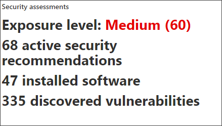

# Untersuchen von Geräten in der Liste "Microsoft Defender für Endpunktgeräte"

[!INCLUDE [Microsoft 365 Defender rebranding](../../includes/microsoft-defender.md)]

**Gilt für:**
- [Microsoft Defender für Endpunkt](https://go.microsoft.com/fwlink/p/?linkid=2154037)
- [Microsoft 365 Defender](https://go.microsoft.com/fwlink/?linkid=2118804)

>Möchten Sie Defender für Endpunkt erleben? [Registrieren Sie sich für eine kostenlose Testversion.](https://www.microsoft.com/microsoft-365/windows/microsoft-defender-atp?ocid=docs-wdatp-investigatemachines-abovefoldlink)

Untersuchen Sie die Details einer Warnung, die auf einem bestimmten Gerät ausgelöst wird, um andere Verhaltensweisen oder Ereignisse zu identifizieren, die mit der Warnung oder dem potenziellen Umfang der Verletzung zusammenhängen könnten.

> [!NOTE]
> Im Rahmen des Untersuchungs- oder Reaktionsprozesses können Sie ein Untersuchungspaket von einem Gerät erfassen. Hier sehen Sie, wie: [Erfassen Sie untersuchungspaket von Geräten](/microsoft-365/security/defender-endpoint/respond-machine-alerts#collect-investigation-package-from-devices).

Sie können auf betroffene Geräte klicken, wenn sie im Portal angezeigt werden, um einen detaillierten Bericht zu diesem Gerät zu öffnen. Betroffene Geräte werden in den folgenden Bereichen identifiziert:

- [Geräteliste](investigate-machines.md)
- [Benachrichtigungswarteschlange](alerts-queue.md)
- [Dashboard für Sicherheitsvorgänge](security-operations-dashboard.md)
- Jede einzelne Warnung
- Jede einzelne Dateidetailseansicht
- Alle IP-Adressen oder Domänendetails

Wenn Sie ein bestimmtes Gerät untersuchen, sehen Sie Folgendes:

- Gerätedetails
- Antwortaktionen
- Registerkarten (Übersicht, Warnungen, Zeitachse, Sicherheitsempfehlungen, Softwareinventarisierung, erkannte Sicherheitsrisiken, fehlende KBs)
- Karten (aktive Warnungen, angemeldete Benutzer, Sicherheitsbewertung)

## Gerätedetails

Der Abschnitt "Gerätedetails" enthält Informationen wie Domäne, Betriebssystem und Integritätsstatus des Geräts. Wenn ein Untersuchungspaket auf dem Gerät verfügbar ist, wird ein Link angezeigt, über den Sie das Paket herunterladen können.

## Antwortaktionen

Antwortaktionen werden oben auf einer bestimmten Geräteseite ausgeführt und umfassen Folgendes:

- Verwalten von Kategorien
- Gerät isolieren
- Einschränken der App-Ausführung
- Antivirusscan ausführen
- Untersuchungspaket sammeln
- Initiieren einer Liveantwortsitzung
- Initiieren einer automatisierten Untersuchung
- Wenden Sie sich an einen Bedrohungsexperten
- Info-Center

Sie können Reaktionsaktionen im Info-Center, auf einer bestimmten Geräteseite oder auf einer bestimmten Dateiseite ausführen.

Weitere Informationen zum Ausführen von Maßnahmen auf einem Gerät finden Sie unter "Ergreifen von [Gegenmaßnahmen auf einem Gerät".](respond-machine-alerts.md)

Weitere Informationen finden Sie unter [Untersuchen von Benutzerentitäten.](investigate-user.md)

## Registerkarten

Die Registerkarten enthalten relevante Informationen zur Sicherheit und Bedrohungsverhütung im Zusammenhang mit dem Gerät. Auf jeder Registerkarte können Sie die angezeigten Spalten anpassen, indem Sie **Spalten** auf der Leiste oberhalb der Spaltenüberschriften anpassen auswählen.

### Übersicht
Auf der Registerkarte **"Übersicht"** werden die [Karten](#cards) für aktive Warnungen, angemeldete Benutzer und Sicherheitsbewertungen angezeigt.

### Warnungen

Die Registerkarte **"Warnungen"** enthält eine Liste der Warnungen, die dem Gerät zugeordnet sind. Diese Liste ist eine gefilterte Version der [Warnungswarteschlange](alerts-queue.md)und zeigt eine kurze Beschreibung der Warnung, des Schweregrads (hoch, mittel, niedrig, informational), des Status in der Warteschlange (neu, in Bearbeitung, aufgelöst), der Klassifizierung (nicht festgelegt, falsch, true alert), des Untersuchungsstatus, der Kategorie der Warnung, der Adressierung der Warnung und der letzten Aktivität. Sie können die Warnungen auch filtern.

Wenn das Kreissymbol links neben einer Warnung ausgewählt ist, wird ein Flyout angezeigt. In diesem Bereich können Sie die Warnung verwalten und weitere Details wie die Vorfallnummer und verwandte Geräte anzeigen. Mehrere Warnungen können gleichzeitig ausgewählt werden.

Um eine vollständige Seitenansicht einer Warnung einschließlich Vorfalldiagramm und Prozessstruktur anzuzeigen, wählen Sie den Titel der Warnung aus.

### Zeitachse

Die Registerkarte **"Zeitachse"** bietet eine chronologische Ansicht der Ereignisse und zugehörigen Warnungen, die auf dem Gerät beobachtet wurden. Dies kann Ihnen dabei helfen, ereignisse, Dateien und IP-Adressen in Bezug auf das Gerät zu korrelieren.

Auf der Zeitachse können Sie auch selektiv Einen Drilldown zu Ereignissen ausführen, die innerhalb eines bestimmten Zeitraums aufgetreten sind. Sie können die zeitliche Abfolge von Ereignissen anzeigen, die über einen ausgewählten Zeitraum auf einem Gerät aufgetreten sind. Um die Ansicht weiter zu steuern, können Sie nach Ereignisgruppen filtern oder die Spalten anpassen.

>[!NOTE]
> Zum Anzeigen von Firewallereignissen müssen Sie die Überwachungsrichtlinie aktivieren. Weitere Informationen finden Sie unter ["Audit Filtering Platform connection".](/windows/security/threat-protection/auditing/audit-filtering-platform-connection)
>Firewall deckt die folgenden Ereignisse ab
>
>- [5025](/windows/security/threat-protection/auditing/event-5025) – Firewalldienst beendet
>- [5031](/windows/security/threat-protection/auditing/event-5031) – Anwendung, die am Akzeptieren eingehender Verbindungen im Netzwerk gehindert wird
>- [5157 –](/windows/security/threat-protection/auditing/event-5157) blockierte Verbindung

Einige der Funktionen umfassen:

- Suchen nach bestimmten Ereignissen
  - Verwenden Sie die Suchleiste, um nach bestimmten Zeitachsenereignissen zu suchen.
- Filtern von Ereignissen anhand eines bestimmten Datums
  - Wählen Sie oben links in der Tabelle das Kalendersymbol aus, um Ereignisse des letzten Tags, der letzten Woche, der 30 Tage oder des benutzerdefinierten Bereichs anzuzeigen. Standardmäßig ist die Gerätezeitachse so festgelegt, dass die Ereignisse aus den letzten 30 Tagen angezeigt werden.
  - Verwenden Sie die Zeitachse, um zu einem bestimmten Zeitpunkt zu springen, indem Sie den Abschnitt hervorheben. Die Pfeile auf der Zeitachse zeigen automatisierte Untersuchungen an.
- Exportieren detaillierter Gerätezeitachsenereignisse
  - Exportieren Sie die Gerätezeitachse für das aktuelle Datum oder einen angegebenen Datumsbereich bis zu sieben Tage.

Weitere Informationen zu bestimmten Ereignissen finden Sie im Abschnitt **"Zusätzliche Informationen".** Diese Details variieren je nach Ereignistyp, z. B.: 

- In Application Guard enthalten – das Webbrowserereignis wurde durch einen isolierten Container eingeschränkt.
- Aktive Bedrohung erkannt – Die Bedrohungserkennung ist aufgetreten, während die Bedrohung ausgeführt wurde
- Problembehebung nicht erfolgreich : Ein Versuch, die erkannte Bedrohung zu beheben, wurde aufgerufen, aber fehlgeschlagen.
- Behebung erfolgreich – die erkannte Bedrohung wurde beendet und bereinigt.
- Warnung, die vom Benutzer umgangen wird – die Windows Defender SmartScreen-Warnung wurde von einem Benutzer geschlossen und überschrieben.
- Verdächtiges Skript erkannt – es wurde ein potenziell schädliches Skript gefunden, das ausgeführt wurde
- Die Warnungskategorie – wenn das Ereignis zur Generierung einer Warnung geführt hat, wird die Warnungskategorie ("Lateral Movement" (z. B. Lateral Movement) bereitgestellt.

#### Ereignisdetails
Wählen Sie ein Ereignis aus, um relevante Details zu diesem Ereignis anzuzeigen. Ein Bereich wird angezeigt, um allgemeine Ereignisinformationen anzuzeigen. Wenn zutreffend und Daten verfügbar sind, wird auch ein Diagramm mit verwandten Entitäten und deren Beziehungen angezeigt.

Um das Ereignis und verwandte Ereignisse weiter zu untersuchen, können Sie schnell eine [erweiterte Suchabfrage](advanced-hunting-overview.md) ausführen, indem Sie **"Suche nach verwandten Ereignissen"** auswählen. Die Abfrage gibt das ausgewählte Ereignis und die Liste der anderen Ereignisse zurück, die ungefähr zur gleichen Zeit auf demselben Endpunkt aufgetreten sind.

### Sicherheitsempfehlungen

**Sicherheitsempfehlungen** werden aus der [Funktion "Bedrohungs- & Sicherheitsrisikoverwaltung"](tvm-dashboard-insights.md) von Microsoft Defender für Endpunkt generiert. Wenn Sie eine Empfehlung auswählen, wird ein Panel angezeigt, in dem Sie relevante Details anzeigen können, z. B. eine Beschreibung der Empfehlung und die potenziellen Risiken, die mit der Nichtersetzung verbunden sind. Weitere Informationen finden Sie in der [Sicherheitsempfehlung.](tvm-security-recommendation.md)

### Softwarebestand

Auf der Registerkarte **"Softwareinventur"** können Sie Software auf dem Gerät zusammen mit etwaigen Schwachstellen oder Bedrohungen anzeigen. Wenn Sie den Namen der Software auswählen, gelangen Sie zur Seite "Softwaredetails", auf der Sie Sicherheitsempfehlungen, ermittelte Sicherheitsrisiken, installierte Geräte und Versionsverteilung anzeigen können. Weitere Informationen finden Sie [unter "Softwareinventur"](tvm-software-inventory.md)

### Ermittelte Sicherheitsrisiken

Auf der Registerkarte **"Ermittelte Sicherheitsrisiken" werden** der Name, der Schweregrad und die Bedrohungserkenntnisse der entdeckten Sicherheitsrisiken auf dem Gerät angezeigt. Wenn Sie bestimmte Sicherheitsrisiken auswählen, werden eine Beschreibung und Details angezeigt.

### Fehlende KBs
Auf der Registerkarte **"Fehlende KBs"** sind die fehlenden Sicherheitsupdates für das Gerät aufgeführt.

## Karten

### Aktive Warnungen

Die **Azure Advanced Threat Protection-Karte** zeigt eine allgemeine Übersicht über Warnungen im Zusammenhang mit dem Gerät und deren Risikostufe an, wenn Sie das Microsoft Defender for Identity-Feature aktiviert haben und aktive Warnungen vorhanden sind. Weitere Informationen finden Sie im Drilldown "Warnungen".

>[!NOTE]
>Sie müssen die Integration sowohl in Microsoft Defender for Identity als auch in Defender für Endpunkt aktivieren, um dieses Feature zu verwenden. In Defender für Endpunkt können Sie dieses Feature in erweiterten Features aktivieren. Weitere Informationen zum Aktivieren erweiterter Features finden Sie unter [Aktivieren erweiterter Features.](advanced-features.md)

### Angemeldete Benutzer

Die Karte **"Angemeldete Benutzer"** zeigt, wie viele Benutzer sich in den letzten 30 Tagen angemeldet haben, zusammen mit den am häufigsten verwendeten Benutzern. Durch Auswählen des Links "Alle Benutzer anzeigen" wird der Detailbereich geöffnet, in dem Informationen wie Benutzertyp, Anmeldetyp und Wann der Benutzer zum ersten und letzten Mal angezeigt wurde. Weitere Informationen finden Sie unter [Untersuchen von Benutzerentitäten.](investigate-user.md)

### Sicherheitsbewertungen

Die **Karte "Sicherheitsbewertungen"** zeigt die Gesamtbelichtungsstufe, Sicherheitsempfehlungen, installierte Software und ermittelte Sicherheitsrisiken. Die Belichtungsstufe eines Geräts wird durch die kumulativen Auswirkungen der ausstehenden Sicherheitsempfehlungen bestimmt.

## Verwandte Themen

- [Anzeigen und Organisieren der Microsoft Defender für Endpunkt-Warnungswarteschlange](alerts-queue.md)
- [Verwalten von Microsoft Defender für Endpunkt-Warnungen](manage-alerts.md)
- [Untersuchen von Microsoft Defender für Endpunkt-Warnungen](investigate-alerts.md)
- [Untersuchen einer Datei, die einer Defender für Endpunkt-Warnung zugeordnet ist](investigate-files.md)
- [Untersuchen einer IP-Adresse, die einer Defender für Endpunkt-Warnung zugeordnet ist](investigate-ip.md)
- [Untersuchen einer Domäne, die einer Defender für Endpunkt-Warnung zugeordnet ist](investigate-domain.md)
- [Untersuchen eines Benutzerkontos in Defender für Endpunkt](investigate-user.md)
- [Sicherheitsempfehlungen](tvm-security-recommendation.md)
- [Softwarebestand](tvm-software-inventory.md)
