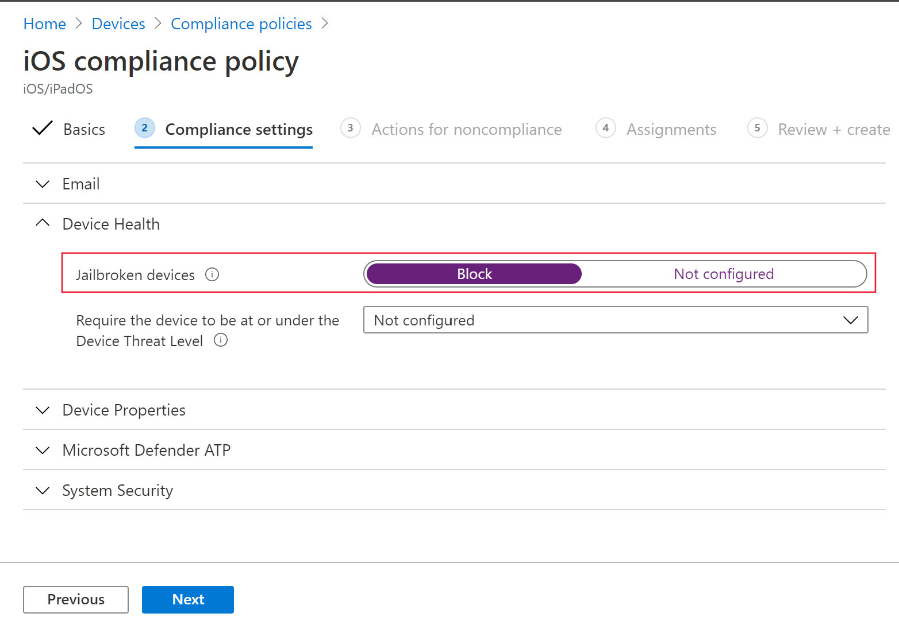
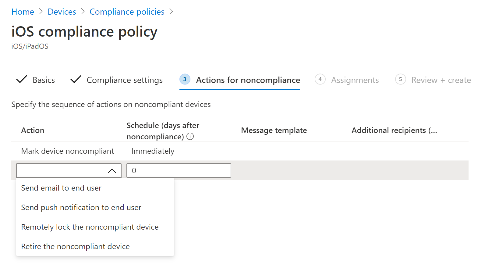

# Konfigurieren von Microsoft Defender für Endpunkt unter iOS-Features

[!INCLUDE [Microsoft 365 Defender rebranding](../../includes/microsoft-defender.md)]

**Gilt für:**
- [Microsoft Defender für Endpunkt](https://go.microsoft.com/fwlink/p/?linkid=2154037)
- [Microsoft 365 Defender](https://go.microsoft.com/fwlink/?linkid=2118804)

> Möchten Sie Defender für Endpunkt erleben? [Registrieren Sie sich für eine kostenlose Testversion.](https://www.microsoft.com/microsoft-365/windows/microsoft-defender-atp?ocid=docs-wdatp-exposedapis-abovefoldlink) 

> [!NOTE]
> Defender für Endpunkt unter iOS würde ein VPN verwenden, um das Webschutzfeature bereitzustellen. Dies ist kein reguläres VPN und ein lokales/selbstschleifendes VPN, das keinen Datenverkehr außerhalb des Geräts aufnimmt.

## Bedingter Zugriff mit Defender für Endpunkt unter iOS  
Microsoft Defender für Endpunkt unter iOS zusammen mit Microsoft Intune und Azure Active Directory ermöglicht das Erzwingen der Gerätekompatibilität und richtlinien für bedingten Zugriff basierend auf der Geräterisikobewertung. Defender für Endpunkt ist eine MTD-Lösung (Mobile Threat Defense), die Sie bereitstellen können, um diese Funktion über Intune zu nutzen.

Weitere Informationen zum Einrichten des bedingten Zugriffs mit Defender für Endpunkt unter iOS finden Sie unter [Defender für Endpunkt und Intune.](/mem/intune/protect/advanced-threat-protection)

### Jailbreak-Erkennung durch Microsoft Defender für Endpunkt
Microsoft Defender für Endpunkt verfügt über die Möglichkeit, nicht verwaltete und verwaltete Geräte zu erkennen, die ohne Jailbreak sind. Wenn festgestellt wird, dass ein Gerät im Jailbreak ist, wird eine Warnung mit **hohem** Risiko an das Security Center gemeldet. Wenn der bedingte Zugriff basierend auf der Geräterisikobewertung eingerichtet wird, wird das Gerät am Zugriff auf Unternehmensdaten gehindert.

## Webschutz und VPN

Standardmäßig enthält Defender für Endpunkt unter iOS das Webschutzfeature und aktiviert es. [Der Webschutz](web-protection-overview.md) hilft, Geräte vor Webbedrohungen zu schützen und Benutzer vor Phishingangriffen zu schützen. Defender für Endpunkt unter iOS verwendet ein VPN, um diesen Schutz bereitzustellen. Bitte beachten Sie, dass es sich um ein lokales VPN handelt und im Gegensatz zu herkömmlichem VPN kein Netzwerkdatenverkehr außerhalb des Geräts gesendet wird.

Obwohl sie standardmäßig aktiviert ist, kann es einige Fälle geben, in denen Sie VPN deaktivieren müssen. Sie möchten beispielsweise einige Apps ausführen, die nicht funktionieren, wenn ein VPN konfiguriert ist. In solchen Fällen können Sie vpn von der App auf dem Gerät deaktivieren, indem Sie die folgenden Schritte ausführen:

1. Öffnen Sie auf Ihrem iOS-Gerät die **Einstellungen** App, klicken oder tippen Sie auf **"Allgemein"** und dann auf **"VPN".**
1. Klicken oder tippen Sie auf die Schaltfläche "i" für Microsoft Defender für Endpunkt.
1. Deaktivieren Sie **Verbinden Bei Bedarf,** um VPN zu deaktivieren.

    > [!div class="mx-imgBorder"]
    > 

> [!NOTE]
> Webschutz ist nicht verfügbar, wenn VPN deaktiviert ist. Um Web Protection erneut zu aktivieren, öffnen Sie die Microsoft Defender für Endpunkt-App auf dem Gerät, und klicken oder tippen Sie auf **"VPN starten".**

## Koexistenz mehrerer VPN-Profile

Apple iOS unterstützt nicht, dass mehrere geräteweite VPNs gleichzeitig aktiv sind. Während mehrere VPN-Profile auf dem Gerät vorhanden sein können, kann jeweils nur ein VPN aktiv sein.

## Konfigurieren der Compliancerichtlinie für Geräte mit Jailbreak

Um den Zugriff auf Unternehmensdaten auf iOS-Geräten mit Jailbreak zu schützen, empfehlen wir, dass Sie die folgende Compliancerichtlinie in Intune einrichten.

> [!NOTE]
> Die Jailbreak-Erkennung ist eine Funktion, die von Microsoft Defender für Endpunkt unter iOS bereitgestellt wird. Es wird jedoch empfohlen, diese Richtlinie als zusätzliche Schutzebene gegen Jailbreak-Szenarien einzurichten.

Führen Sie die folgenden Schritte aus, um eine Compliancerichtlinie für Geräte mit Jailbreak zu erstellen.

1. Wechseln Sie [im Microsoft Endpoint Manager Admin Center](https://go.microsoft.com/fwlink/?linkid=2109431)zu **"Gerätecompliancerichtlinien**  ->    ->  **erstellen".** Wählen Sie "iOS/iPadOS" als Plattform aus, und klicken Sie auf **"Erstellen".**

    > [!div class="mx-imgBorder"]
    > 

2. Geben Sie einen Namen der Richtlinie an, z. B. "Compliancerichtlinie für Jailbreak".
3. Klicken Sie auf der Seite "Complianceeinstellungen" auf den Abschnitt **"Geräteintegrität",** und klicken Sie auf das Feld **"Für** **Jailbroken** blockieren".

    > [!div class="mx-imgBorder"]
    > 

4. Wählen Sie im Abschnitt *"Aktion für Nichtkonformität"* die Aktionen gemäß Ihren Anforderungen aus, und wählen Sie **"Weiter"** aus.

    > [!div class="mx-imgBorder"]
    > 

5. Wählen Sie im Abschnitt *"Aufgaben"* die Benutzergruppen aus, die Sie für diese Richtlinie einschließen möchten, und wählen Sie dann **"Weiter"** aus.
6. Überprüfen Sie im Abschnitt **"Überprüfen und Erstellen",** ob alle eingegebenen Informationen korrekt sind, und wählen Sie dann **"Erstellen"** aus.

## Konfigurieren von benutzerdefinierten Indikatoren

Mit Defender für Endpunkt unter iOS können Administratoren auch benutzerdefinierte Indikatoren auf iOS-Geräten konfigurieren. Weitere Informationen zum Konfigurieren von benutzerdefinierten Indikatoren finden Sie unter [Verwalten von Indikatoren.](/microsoft-365/security/defender-endpoint/manage-indicators)

> [!NOTE]
> Defender für Endpunkt unter iOS unterstützt das Erstellen benutzerdefinierter Indikatoren nur für IP-Adressen und URLs/Domänen.

## Unsichere Website melden

Phishing-Websites imitieren vertrauenswürdige Websites, um Ihre persönlichen oder finanziellen Informationen zu erhalten. Besuchen Sie die Seite ["Feedback zum Netzwerkschutz",](https://www.microsoft.com/wdsi/filesubmission/exploitguard/networkprotection) wenn Sie eine Website melden möchten, bei der es sich um eine Phishingwebsite handeln könnte.

