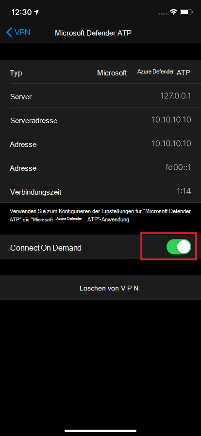

# Konfigurieren von Microsoft Defender for Endpoint für iOS-Features

[!INCLUDE [Microsoft 365 Defender rebranding](../../includes/microsoft-defender.md)]

**Gilt für:**
- [Microsoft Defender für Endpunkt](https://go.microsoft.com/fwlink/p/?linkid=2154037)
- [Microsoft 365 Defender](https://go.microsoft.com/fwlink/?linkid=2118804)

> Möchten Sie Defender for Endpoint erleben? [Registrieren Sie sich für eine kostenlose Testversion.](https://www.microsoft.com/microsoft-365/windows/microsoft-defender-atp?ocid=docs-wdatp-exposedapis-abovefoldlink) 

> [!NOTE]
> Defender for Endpoint für iOS würde ein VPN verwenden, um das Web Protection-Feature zur Verfügung zu stellen. Dies ist kein normales VPN und ein lokales VPN mit selbstschleifender Schleife, das keinen Datenverkehr außerhalb des Geräts verwendet.

## Bedingter Zugriff mit Defender for Endpoint für iOS  
Microsoft Defender for Endpoint für iOS ermöglicht zusammen mit Microsoft Intune und Azure Active Directory die Erzwingung der Gerätekonformität und Richtlinien für bedingten Zugriff basierend auf gerätebezogenen Risikostufen. Defender for Endpoint ist eine Mobile Threat Defense (MTD)-Lösung, die Sie bereitstellen können, um diese Funktion über Intune zu nutzen.

Weitere Informationen zum Einrichten des bedingten Zugriffs mit Defender for Endpoint für iOS finden Sie unter [Defender for Endpoint und Intune](https://docs.microsoft.com/mem/intune/protect/advanced-threat-protection).

## Web Protection und VPN

Standardmäßig enthält defender for Endpoint für iOS das Webschutzfeature und aktiviert es. [Webschutz trägt](web-protection-overview.md) dazu bei, Geräte vor Webbedrohungen zu schützen und Benutzer vor Phishingangriffen zu schützen. Defender for Endpoint für iOS verwendet ein VPN, um diesen Schutz zu gewährleisten. Beachten Sie, dass es sich um ein lokales VPN handelt und im Gegensatz zu herkömmlichem VPN kein Netzwerkdatenverkehr außerhalb des Geräts gesendet wird.

Obwohl standardmäßig aktiviert, kann es einige Fälle sein, in denen Sie VPN deaktivieren müssen. Beispielsweise möchten Sie einige Apps ausführen, die nicht funktionieren, wenn ein VPN konfiguriert ist. In solchen Fällen können Sie vpn von der App auf dem Gerät deaktivieren, indem Sie die folgenden Schritte ausführen:

1. Öffnen Sie auf Ihrem iOS-Gerät die **App Einstellungen,** klicken oder tippen Sie auf **Allgemein** und dann **auf VPN.**
1. Klicken oder tippen Sie auf die Schaltfläche "i" für Microsoft Defender ATP.
1. Schalten Sie **Connect On Demand aus, um** VPN zu deaktivieren.

    > [!div class="mx-imgBorder"]
    > 

> [!NOTE]
> Web Protection ist nicht verfügbar, wenn VPN deaktiviert ist. Öffnen Sie zum erneuten Aktivieren von Web Protection die Microsoft Defender for Endpoint-App auf dem Gerät, und klicken oder tippen **Sie auf VPN starten.**

## Koexistenz mehrerer VPN-Profile

Apple iOS unterstützt nicht mehrere geräteweite VPNs, um gleichzeitig aktiv zu sein. Auf dem Gerät können zwar mehrere VPN-Profile vorhanden sein, aber nur ein VPN kann gleichzeitig aktiv sein.

## Konfigurieren der Compliancerichtlinie für jailbrokene Geräte

Um den Zugriff auf Unternehmensdaten auf ins Jailbroken gebrokenen iOS-Geräten zu schützen, wird empfohlen, die folgende Compliancerichtlinie für Intune zu erstellen.

> [!NOTE]
> Derzeit bietet Microsoft Defender for Endpoint für iOS keinen Schutz vor Jailbreakszenarien. Wenn sie auf einem jailbroken Gerät verwendet werden, können in bestimmten Szenarien Daten, die von der Anwendung verwendet werden, wie z. B. Ihre Unternehmens-E-Mail-ID und das Unternehmensprofilbild (sofern verfügbar) lokal verfügbar gemacht werden.

Führen Sie die folgenden Schritte aus, um eine Compliancerichtlinie für jailbrokene Geräte zu erstellen.

1. Wechseln [Sie im Microsoft Endpoint Manager Admin Center](https://go.microsoft.com/fwlink/?linkid=2109431)zu Richtlinien zur **Gerätekonformität**  ->  **Erstellen** von  ->  **Richtlinien.** Wählen Sie "iOS/iPadOS" als Plattform aus, und klicken Sie auf **Erstellen**.

    > [!div class="mx-imgBorder"]
    > 

2. Geben Sie einen Namen der Richtlinie an, z. B. "Compliancerichtlinie für Jailbreak".
3. Klicken Sie auf der Seite Kompatibilitätseinstellungen auf , um den Abschnitt **Geräteintektion** zu erweitern, und klicken Sie auf **Block** for **Jailbroken devices** field.

    > [!div class="mx-imgBorder"]
    > 

4. Wählen Sie *im Abschnitt Aktion* für Nichtkompatibilität die Aktionen nach Ihren Anforderungen aus, und wählen Sie Weiter **aus.**

    > [!div class="mx-imgBorder"]
    > 

5. Wählen Sie *im Abschnitt Zuordnungen* die Benutzergruppen aus, die Sie für diese Richtlinie verwenden möchten, und wählen Sie dann **Weiter aus.**
6. Überprüfen Sie **im Abschnitt Überprüfen+Erstellen,** ob alle eingegebenen Informationen korrekt sind, und wählen Sie dann **Erstellen aus.**

## Konfigurieren benutzerdefinierter Indikatoren

Mit Defender for Endpoint für iOS können Administratoren auch benutzerdefinierte Indikatoren auf iOS-Geräten konfigurieren. Weitere Informationen zum Konfigurieren benutzerdefinierter Indikatoren finden Sie unter [Manage indicators](https://docs.microsoft.com/microsoft-365/security/defender-endpoint/manage-indicators).

> [!NOTE]
> Defender for Endpoint für iOS unterstützt das Erstellen benutzerdefinierter Indikatoren nur für IP-Adressen und URLs/Domänen.

## Unsichere Website melden

Phishingwebsites geben sich als vertrauenswürdige Websites aus, um Ihre persönlichen oder finanziellen Informationen zu erhalten. Besuchen Sie [die Seite Feedback zum Netzwerkschutz](https://www.microsoft.com/wdsi/filesubmission/exploitguard/networkprotection) bereitstellen, wenn Sie eine Website melden möchten, bei der es sich um eine Phishingwebsite handelt.

## Probleme mit dem Akkuverbrauch unter iOS bei der Installation von Microsoft Defender for Endpoint

Der Akkuverbrauch einer App wird von Apple basierend auf einer Vielzahl von Faktoren wie CPU- und Netzwerknutzung berechnet. Microsoft Defender for Endpoint verwendet ein lokales /Loop-Back-VPN im Hintergrund, um den Webdatenverkehr auf schädliche Websites oder Verbindungen zu überprüfen. Netzwerkpakete von jeder App durchgehen diese Prüfung, was dazu führt, dass der Akkuverbrauch von Microsoft Defender for Endpoint ungenau berechnet wird. Dies gibt dem Benutzer einen falschen Eindruck. Der tatsächliche Akkuverbrauch von Microsoft Defender for Endpoint ist geringer als der, der auf der Seite Akkueinstellungen auf dem Gerät angezeigt wird. Dies basiert auf durchgeführten Tests, die mit der Microsoft Defender for Endpoint-App durchgeführt wurden, um den Akkuverbrauch zu verstehen.

Auch das verwendete VPN ist ein lokales VPN und im Gegensatz zu herkömmlichen VPNs wird der Netzwerkdatenverkehr nicht außerhalb des Geräts gesendet.
