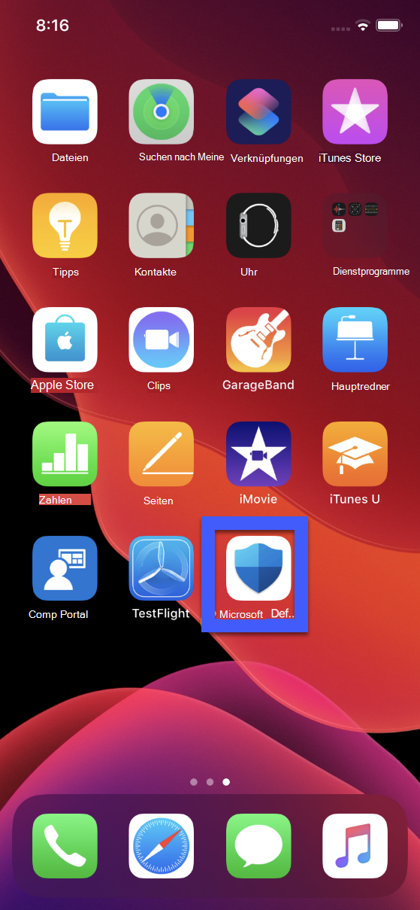
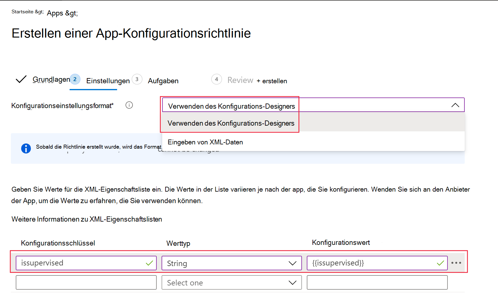

# Bereitstellen von Microsoft Defender for Endpoint für iOS

[!INCLUDE [Microsoft 365 Defender rebranding](../../includes/microsoft-defender.md)]

**Gilt für:**
- [Microsoft Defender für Endpunkt](https://go.microsoft.com/fwlink/p/?linkid=2146631)
- [Microsoft 365 Defender](https://go.microsoft.com/fwlink/?linkid=2118804)

> Möchten Sie Defender for Endpoint erleben? [Registrieren Sie sich für eine kostenlose Testversion.](https://www.microsoft.com/microsoft-365/windows/microsoft-defender-atp?ocid=docs-wdatp-investigateip-abovefoldlink)

In diesem Thema wird die Bereitstellung von Defender for Endpoint für iOS auf registrierten Geräten des Intune-Unternehmensportals beschrieben. Weitere Informationen zur Registrierung von Intune-Geräten finden Sie unter [Registrieren von iOS-/iPadOS-Geräten in Intune](https://docs.microsoft.com/mem/intune/enrollment/ios-enroll).

## Vorbereitung

- Stellen Sie sicher, dass Sie Zugriff auf [Microsoft Endpoint Manager Admin Center haben.](https://go.microsoft.com/fwlink/?linkid=2109431)

- Stellen Sie sicher, dass die iOS-Registrierung für Ihre Benutzer erfolgt. Benutzern muss eine Defender for Endpoint-Lizenz zugewiesen sein, um Defender for Endpoint für iOS verwenden zu können. Anweisungen zum [Zuweisen von](https://docs.microsoft.com/azure/active-directory/users-groups-roles/licensing-groups-assign) Lizenzen finden Sie unter Zuweisen von Lizenzen zu Benutzern.

> [!NOTE]
> Microsoft Defender ATP (Microsoft Defender for Endpoint) für iOS ist jetzt im [Apple App Store verfügbar.](https://aka.ms/mdatpiosappstore)

## Bereitstellungsschritte

Bereitstellen von Defender for Endpoint für iOS über das Intune-Unternehmensportal.

### Hinzufügen einer iOS-Store-App

1. Wechseln [Sie im Microsoft Endpoint Manager Admin Center](https://go.microsoft.com/fwlink/?linkid=2109431)zu **Apps**  ->  **iOS/iPadOS**  ->    ->  **iOS Store-App** hinzufügen, und klicken Sie auf **Auswählen**.

    > [!div class="mx-imgBorder"]
    > 

1. Klicken Sie auf der Seite App hinzufügen auf **Den App Store durchsuchen,** und geben Sie **Microsoft Defender ATP** in die Suchleiste ein. Klicken Sie im Abschnitt Suchergebnisse auf *Microsoft Defender ATP,* und klicken Sie auf **Auswählen**.

1. Wählen **Sie iOS 11.0 als** Mindestbetriebssystem aus. Überprüfen Sie die restlichen Informationen zur App, und klicken Sie auf **Weiter**.

1. Wechseln Sie *im Abschnitt Zuweisungen* zum Abschnitt **Erforderlich,** und wählen Sie **Gruppe hinzufügen aus.** Sie können dann die Benutzergruppen auswählen, für die Sie Defender for Endpoint für iOS-App verwenden möchten. Klicken **Sie auf Auswählen** und dann auf **Weiter**.

    > [!NOTE]
    > Die ausgewählte Benutzergruppe sollte aus in Intune registrierten Benutzern bestehen.

    > [!div class="mx-imgBorder"]
    > 

1. Überprüfen Sie *im Abschnitt Überprüfen +* Erstellen, ob alle eingegebenen Informationen korrekt sind, und wählen Sie dann Erstellen **aus.** In wenigen Momenten sollte die Defender for Endpoint-App erfolgreich erstellt werden, und in der oberen rechten Ecke der Seite sollte eine Benachrichtigung angezeigt werden.

1. Wählen Sie auf der angezeigten App-Informationsseite  im Abschnitt **Monitor** die Option Geräteinstallationsstatus aus, um sicherzustellen, dass die Geräteinstallation erfolgreich abgeschlossen wurde.

    > [!div class="mx-imgBorder"]
    > 

## Vollständiger Onboarding- und Überprüfungsstatus

1. Sobald Defender for Endpoint für iOS auf dem Gerät installiert wurde, wird das App-Symbol angezeigt.

    

2. Tippen Sie auf das Symbol der Defender for Endpoint-App, und befolgen Sie die Anweisungen auf dem Bildschirm, um die Onboardingschritte zu ausführen. Die Details umfassen die Endbenutzerakzeptanz der iOS-Berechtigungen, die von Defender for Endpoint für iOS erforderlich sind.

3. Nach dem erfolgreichen Onboarding wird das Gerät in der Liste Geräte im Microsoft Defender Security Center angezeigt.

    > [!div class="mx-imgBorder"]
    > 

## Konfigurieren von Microsoft Defender for Endpoint für den überwachten Modus

Die Microsoft Defender for Endpoint für iOS-App verfügt über spezielle Funktionen für überwachte iOS/iPadOS-Geräte, da die Plattform auf diesen Gerätetypen mehr Verwaltungsfunktionen bietet. Um diese Funktionen nutzen zu können, muss die Defender for Endpoint-App wissen, ob sich ein Gerät im überwachten Modus befindet.

### Konfigurieren des überwachten Modus über Intune

Mit Intune können Sie die Defender für iOS-App über eine App-Konfigurationsrichtlinie konfigurieren.

   > [!NOTE]
   > Diese App-Konfigurationsrichtlinie für überwachte Geräte gilt nur für verwaltete Geräte und sollte als bewährte Methode für alle verwalteten iOS-Geräte gelten.

1. Melden Sie sich beim [Microsoft Endpoint Manager Admin Center an,](https://go.microsoft.com/fwlink/?linkid=2109431) und wechseln Sie zu **Apps**  >  **App-Konfigurationsrichtlinien**  >  **Hinzufügen**. Klicken Sie auf **Verwaltete Geräte**.

    > [!div class="mx-imgBorder"]
    > 

1. Geben Sie *auf der Seite App-Konfigurationsrichtlinie erstellen* die folgenden Informationen an:
    - Policy Name
    - Plattform: Auswählen von iOS/iPadOS
    - Ziel-App: Wählen **Sie Microsoft Defender ATP** aus der Liste aus.

    > [!div class="mx-imgBorder"]
    > 

1. Wählen Sie im nächsten Bildschirm **Konfigurations-Designer als** Format verwenden aus. Geben Sie die folgende Eigenschaft an:
    - Konfigurationsschlüssel: issupervised
    - Werttyp: Zeichenfolge
    - Konfigurationswert: {{issupervised}}
    
    > [!div class="mx-imgBorder"]
    > 

1. Klicken **Sie auf Weiter,** um die **Seite Bereichstags zu** öffnen. Bereichstags sind optional. Klicken Sie auf **Weiter**, um den Vorgang fortzusetzen.

1. Wählen Sie **auf** der Seite Zuordnungen die Gruppen aus, die dieses Profil erhalten. Für dieses Szenario ist es bewährte Methode, alle **Geräte als Ziel zu verwenden.** Weitere Informationen zum Zuweisen von Profilen finden Sie unter [Assign user and device profiles](https://docs.microsoft.com/mem/intune/configuration/device-profile-assign).

   Bei der Bereitstellung in Benutzergruppen muss sich ein Benutzer bei einem Gerät anmelden, bevor die Richtlinie angewendet wird.

   Klicken Sie auf **Weiter**.

1. Wählen Sie auf der Seite Überprüfen **+** Erstellen die Option Erstellen aus, wenn Sie **fertig sind.** Das neue Profil wird in der Liste der Konfigurationsprofile angezeigt.

1. Als Nächstes können Sie für erweiterte Antiphishingfunktionen ein benutzerdefiniertes Profil auf den überwachten iOS-Geräten bereitstellen. Führen Sie die folgenden Schritte aus:
    - Laden Sie das Konfigurationsprofil von herunter. [https://aka.ms/mdatpiossupervisedprofile](https://aka.ms/mdatpiossupervisedprofile)
    - Navigieren Sie **zu**  ->  **Geräte iOS/iPadOS**  ->  **Konfigurationsprofile**  ->  **Profil erstellen**

    > [!div class="mx-imgBorder"]
    > 

    - Geben Sie einen Namen des Profils an. Wenn Sie aufgefordert werden, eine Konfigurationsprofildatei zu importieren, wählen Sie die oben heruntergeladene aus.
    - Wählen Sie **im Abschnitt Zuordnung** die Gerätegruppe aus, auf die Sie dieses Profil anwenden möchten. Dies sollte als bewährte Methode auf alle verwalteten iOS-Geräte angewendet werden. Klicken Sie auf **Weiter**.
    - Wählen Sie auf der Seite Überprüfen **+** Erstellen die Option Erstellen aus, wenn Sie **fertig sind.** Das neue Profil wird in der Liste der Konfigurationsprofile angezeigt.

## Nächste Schritte

[Konfigurieren von Defender for Endpoint für iOS-Features](ios-configure-features.md)
