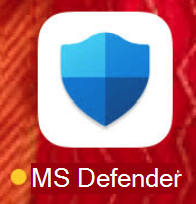

# Bereitstellen von Microsoft Defender für Endpunkt unter iOSDeploy Microsoft Defender for Endpoint on iOS

[!INCLUDE [Microsoft 365 Defender rebranding](../../includes/microsoft-defender.md)]

**Gilt für:****Applies to:**
- [Microsoft Defender für EndpunktMicrosoft Defender for Endpoint](https://go.microsoft.com/fwlink/p/?linkid=2154037)
- [Microsoft 365 DefenderMicrosoft 365 Defender](https://go.microsoft.com/fwlink/?linkid=2118804)

> Möchten Sie Defender für Endpunkt erleben?Want to experience Defender for Endpoint? [Registrieren Sie sich für eine kostenlose Testversion.Sign up for a free trial.](https://www.microsoft.com/microsoft-365/windows/microsoft-defender-atp?ocid=docs-wdatp-investigateip-abovefoldlink)

In diesem Thema wird die Bereitstellung von Defender für Endpunkt unter iOS auf Intune-Unternehmensportal registrierten Geräten beschrieben.This topic describes deploying Defender for Endpoint on iOS on Intune Company Portal enrolled devices. Weitere Informationen zur Intune-Geräteregistrierung finden Sie unter [Registrieren von iOS/iPadOS-Geräten in Intune.](/mem/intune/enrollment/ios-enroll)For more information about Intune device enrollment, see [Enroll iOS/iPadOS devices in Intune](/mem/intune/enrollment/ios-enroll).

## Bevor Sie beginnenBefore you begin

- Stellen Sie sicher, dass Sie Zugriff auf [das Microsoft Endpoint Manager Admin Center](https://go.microsoft.com/fwlink/?linkid=2109431)haben.Ensure you have access to [Microsoft Endpoint manager admin center](https://go.microsoft.com/fwlink/?linkid=2109431).

- Stellen Sie sicher, dass die iOS-Registrierung für Ihre Benutzer erfolgt.Ensure iOS enrollment is done for your users. Benutzern muss eine Defender für Endpunkt-Lizenz zugewiesen sein, um Defender für Endpunkt unter iOS verwenden zu können.Users need to have a Defender for Endpoint license assigned in order to use Defender for Endpoint on iOS. Anweisungen zum Zuweisen von Lizenzen finden Sie unter ["Zuweisen von Lizenzen an Benutzer".](/azure/active-directory/users-groups-roles/licensing-groups-assign)Refer to [Assign licenses to users](/azure/active-directory/users-groups-roles/licensing-groups-assign) for instructions on how to assign licenses.

> [!NOTE]
> Microsoft Defender für Endpunkt unter iOS ist in der [Apple-App Store](https://aka.ms/mdatpiosappstore)verfügbar.Microsoft Defender for Endpoint on iOS is available in the [Apple App Store](https://aka.ms/mdatpiosappstore).

## BereitstellungsschritteDeployment steps

Bereitstellen von Defender für Endpunkt unter iOS über Intune-Unternehmensportal.Deploy Defender for Endpoint on iOS via Intune Company Portal.

### Hinzufügen einer iOS Store-AppAdd iOS store app

1. Wechseln Sie [im Microsoft Endpoint Manager Admin Center](https://go.microsoft.com/fwlink/?linkid=2109431)zu **Apps**  ->  **iOS/iPadOS**  ->    ->  **Hinzufügen der iOS Store-App,** und klicken Sie auf **"Auswählen".**In [Microsoft Endpoint manager admin center](https://go.microsoft.com/fwlink/?linkid=2109431), go to **Apps** -> **iOS/iPadOS** -> **Add** -> **iOS store app** and click **Select**.

    > [!div class="mx-imgBorder"]
    > 

1. Klicken Sie auf der Seite "App hinzufügen" auf **"App Store durchsuchen",** und geben Sie **Microsoft Defender Endpoint** in der Suchleiste ein.On the Add app page, click on **Search the App Store** and type **Microsoft Defender Endpoint** in the search bar. Klicken Sie im Abschnitt mit den Suchergebnissen auf *Microsoft Defender Endpoint,* und klicken Sie auf **"Auswählen".**In the search results section, click on *Microsoft Defender Endpoint* and click **Select**.

1. Wählen Sie **iOS 11.0** als Mindestbetriebssystem aus.Select **iOS 11.0** as the Minimum operating system. Überprüfen Sie die restlichen Informationen zur App, und klicken Sie auf **"Weiter".**Review the rest of information about the app and click **Next**.

1. Wechseln Sie im Abschnitt *Aufgaben* zum Abschnitt **Erforderlich ,** und wählen Sie **Gruppe hinzufügen** aus.In the *Assignments* section, go to the **Required** section and select **Add group**. Sie können dann die Benutzergruppe(n) auswählen, für die Sie Defender für Endpunkt in der iOS-App als Ziel verwenden möchten.You can then choose the user group(s) that you would like to target Defender for Endpoint on iOS app. Klicken Sie auf **"Auswählen"** und dann auf **"Weiter".**Click **Select** and then **Next**.

    > [!NOTE]
    > Die ausgewählte Benutzergruppe sollte aus in Intune registrierten Benutzern bestehen.The selected user group should consist of Intune enrolled users.

    > [!div class="mx-imgBorder"]
    > 

1. Überprüfen Sie im Abschnitt *"Überprüfen + Erstellen",* ob alle eingegebenen Informationen korrekt sind, und wählen Sie dann **"Erstellen"** aus.In the *Review + Create* section, verify that all the information entered is correct and then select **Create**. In wenigen Momenten sollte die Defender für Endpunkt-App erfolgreich erstellt werden, und in der oberen rechten Ecke der Seite sollte eine Benachrichtigung angezeigt werden.In a few moments, the Defender for Endpoint app should be created successfully, and a notification should show up at the top-right corner of the page.

1. Wählen Sie auf der angezeigten Seite "App-Informationen" im Abschnitt **"Monitor"** den **Geräteinstallationsstatus** aus, um zu überprüfen, ob die Geräteinstallation erfolgreich abgeschlossen wurde.In the app information page that is displayed, in the **Monitor** section, select **Device install status** to verify that the device installation has completed successfully.

    > [!div class="mx-imgBorder"]
    > 

## Automatisches Onboarding des VPN-Profils (vereinfachtes Onboarding)Auto-Onboarding of VPN profile (Simplified Onboarding)

Administratoren können die automatische Einrichtung des VPN-Profils konfigurieren.Admins can configure auto-setup of VPN profile. Dadurch wird das Defender für Endpunkt-VPN-Profil automatisch eingerichtet, ohne dass der Benutzer dies während des Onboardings tun muss.This will automatically setup the Defender for Endpoint VPN profile without having the user to do so while onboarding. Beachten Sie, dass VPN verwendet wird, um das Webschutzfeature bereitzustellen.Note that VPN is used in order to provide the Web Protection feature. Dies ist kein reguläres VPN und ein lokales/selbstschleifendes VPN, das keinen Datenverkehr außerhalb des Geräts aufnimmt.This is not a regular VPN and is a local/self-looping VPN that does not take traffic outside the device.

1. Wechseln Sie [im Microsoft Endpoint Manager Admin Center](https://go.microsoft.com/fwlink/?linkid=2109431)zu   ->  **"Gerätekonfigurationsprofile**  ->  **erstellen"**.In [Microsoft Endpoint manager admin center](https://go.microsoft.com/fwlink/?linkid=2109431), go to **Devices** -> **Configuration Profiles** -> **Create Profile**.
1. Wählen Sie **Plattform** als **iOS/iPadOS** und **Profiltyp** als **VPN** aus.Choose **Platform** as **iOS/iPadOS** and **Profile type** as **VPN**. Klicken Sie auf **Erstellen**.Click **Create**.
1. Geben Sie einen Namen für das Profil ein, und klicken Sie auf **"Weiter".**Type a name for the profile and click **Next**.
1. Wählen Sie **"Benutzerdefiniertes VPN** für Verbindungstyp" aus, und geben Sie im Abschnitt **"Basis-VPN"** Folgendes ein:Select **Custom VPN** for Connection Type and in the **Base VPN** section, enter the following:
    - Verbindungsname = Microsoft Defender für EndpunktConnection Name = Microsoft Defender for Endpoint
    - VPN-Serveradresse = 127.0.0.1VPN server address = 127.0.0.1
    - Auth-Methode = "Benutzername und Kennwort"Auth method = "Username and password"
    - Split Tunneling = DeaktivierenSplit Tunneling = Disable
    - VPN-ID = com.microsoft.scmxVPN identifier = com.microsoft.scmx
    - Geben Sie in den Schlüssel-Wert-Paaren das **Schlüssel-AutoOnboard** ein, und legen Sie den Wert auf **"True"** fest.In the key-value pairs, enter the key **AutoOnboard** and set the value to **True**.
    - Typ des automatischen VPN = On-Demand-VPNType of Automatic VPN = On-demand VPN
    - Klicken Sie auf **"Regeln** bei **Bedarf hinzufügen",** und wählen **Sie "Ich möchte folgendermaßen vorgehen = VPN einrichten"** aus, **ich möchte dies auf = alle Domänen beschränken.**Click **Add** for **On Demand Rules** and select **I want to do the following = Establish VPN**, **I want to restrict to = All domains**.

    

1. Klicken Sie auf "Weiter", und weisen Sie das Profil den Zielbenutzern zu.Click Next and assign the profile to targeted users.
1. Überprüfen Sie im Abschnitt *"Überprüfen + Erstellen",* ob alle eingegebenen Informationen korrekt sind, und wählen Sie dann **"Erstellen"** aus.In the *Review + Create* section, verify that all the information entered is correct and then select **Create**.

## Abschließen des Onboardings und Überprüfen des StatusComplete onboarding and check status

1. Sobald Defender für Endpunkt unter iOS auf dem Gerät installiert wurde, wird das App-Symbol angezeigt.Once Defender for Endpoint on iOS has been installed on the device, you  will see the app icon.

    

2. Tippen Sie auf das Symbol der Defender für Endpunkt-App (MSDefender), und befolgen Sie die Anweisungen auf dem Bildschirm, um die Integrationsschritte abzuschließen.Tap the Defender for Endpoint app icon (MSDefender) and follow the on-screen instructions to complete the onboarding steps. Die Details umfassen die Akzeptanz von iOS-Berechtigungen durch Endbenutzer, die von Defender für Endpunkt unter iOS benötigt werden.The details include end-user acceptance of iOS permissions required by Defender for Endpoint on iOS.

3. Nach erfolgreichem Onboarding wird das Gerät in der Liste "Geräte" in Microsoft Defender Security Center angezeigt.Upon successful onboarding, the device will start showing up on the Devices list in Microsoft Defender Security Center.

    > [!div class="mx-imgBorder"]
    > 

## Konfigurieren von Microsoft Defender für Endpunkt für den überwachten ModusConfigure Microsoft Defender for Endpoint for Supervised Mode

Die Microsoft Defender für Endpunkt unter iOS-App verfügt aufgrund der erweiterten Verwaltungsfunktionen der Plattform auf diesen Gerätetypen über spezielle Fähigkeiten auf überwachten iOS/iPadOS-Geräten.The Microsoft Defender for Endpoint on iOS app has specialized ability on supervised iOS/iPadOS devices, given the increased management capabilities provided by the platform on these types of devices. Um diese Funktionen nutzen zu können, muss die Defender für Endpunkt-App wissen, ob sich ein Gerät im überwachten Modus befindet.To take advantage of these capabilities, the Defender for Endpoint app needs to know if a device is in Supervised Mode.

### Konfigurieren des überwachten Modus über IntuneConfigure Supervised Mode via Intune

Mit Intune können Sie die Defender für iOS-App über eine App-Konfigurationsrichtlinie konfigurieren.Intune allows you to configure the Defender for iOS app through an App Configuration policy.

   > [!NOTE]
   > Diese App-Konfigurationsrichtlinie für überwachte Geräte gilt nur für verwaltete Geräte und sollte als bewährte Methode für alle verwalteten iOS-Geräte vorgesehen sein.This app configuration policy for supervised devices is applicable only to managed devices and should be targeted for all managed iOS devices as a best practice.

1. Melden Sie sich beim [Microsoft Endpoint Manager Admin Center](https://go.microsoft.com/fwlink/?linkid=2109431) an, und wechseln Sie zu **App-Konfigurationsrichtlinien**  >    >  **hinzufügen.**Sign in to the [Microsoft Endpoint Manager admin center](https://go.microsoft.com/fwlink/?linkid=2109431) and go to **Apps** > **App configuration policies** > **Add**. Klicken Sie auf **verwaltete Geräte.**Click on **Managed devices**.

    > [!div class="mx-imgBorder"]
    > 

1. Geben Sie auf der Seite *"App-Konfigurationsrichtlinie erstellen"* die folgenden Informationen an:In the *Create app configuration policy* page, provide the following information:
    - Policy NamePolicy Name
    - Plattform: Auswählen von iOS/iPadOSPlatform: Select iOS/iPadOS
    - Ziel-App: Microsoft **Defender-Endpunkt** aus der Liste auswählenTargeted app: Select **Microsoft Defender Endpoint** from the list

    > [!div class="mx-imgBorder"]
    > 

1. Wählen Sie im nächsten Bildschirm **Konfigurations-Designer** als Format verwenden aus.In the next screen, select **Use configuration designer** as the format. Geben Sie die folgende Eigenschaft an:Specify the following property:
    - Konfigurationsschlüssel: issupervisedConfiguration Key: issupervised
    - Werttyp: ZeichenfolgeValue type: String
    - Konfigurationswert: {{issupervised}}Configuration Value: {{issupervised}}
    
    > [!div class="mx-imgBorder"]
    > 

1. Klicken Sie auf **"Weiter",** um die Seite **"Bereichstags"** zu öffnen.Click **Next** to open the **Scope tags** page. Bereichstags sind optional.Scope tags are optional. Klicken Sie auf **Weiter**, um den Vorgang fortzusetzen.Click **Next** to continue.

1. Wählen Sie auf der Seite **"Aufgaben"** die Gruppen aus, die dieses Profil erhalten.On the **Assignments** page, select the groups that will receive this profile. Für dieses Szenario empfiehlt es sich, alle Geräte als Ziel zu **verwenden.**For this scenario, it is best practice to target **All Devices**. Weitere Informationen zum Zuweisen von Profilen finden Sie unter [Zuweisen von Benutzer- und Geräteprofilen.](/mem/intune/configuration/device-profile-assign)For more information on assigning profiles, see [Assign user and device profiles](/mem/intune/configuration/device-profile-assign).

   Bei der Bereitstellung in Benutzergruppen muss sich ein Benutzer bei einem Gerät anmelden, bevor die Richtlinie angewendet wird.When deploying to user groups, a user must sign in to a device before the policy applies.

   Klicken Sie auf **Weiter**.Click **Next**.

1. Wenn Sie fertig sind, wählen Sie auf der Seite **"Überprüfen + Erstellen"** die Option **"Erstellen"** aus.On the **Review + create** page, when you're done, choose **Create**. Das neue Profil wird in der Liste der Konfigurationsprofile angezeigt.The new profile is displayed in the list of configuration profiles.

1. Als Nächstes können Sie für erweiterte Antiphishingfunktionen ein benutzerdefiniertes Profil auf den überwachten iOS-Geräten bereitstellen.Next, for enhanced Anti-phishing capabilities, you can deploy a custom profile on the supervised iOS devices. Führen Sie die folgenden Schritte aus:Follow the steps below:
    - Laden Sie das Konfigurationsprofil von [https://aka.ms/mdatpiossupervisedprofile](https://aka.ms/mdatpiossupervisedprofile)Download the config profile from [https://aka.ms/mdatpiossupervisedprofile](https://aka.ms/mdatpiossupervisedprofile)
    - Navigieren Sie zu  ->  **iOS-/iPadOS-Konfigurationsprofilen**  ->  **für**  ->  **Geräte– Profil erstellen**Navigate to **Devices** -> **iOS/iPadOS** -> **Configuration profiles** -> **Create Profile**

    > [!div class="mx-imgBorder"]
    > 

    - Geben Sie einen Namen des Profils an.Provide a name of the profile. Wenn Sie aufgefordert werden, eine Konfigurationsprofildatei zu importieren, wählen Sie die oben heruntergeladene aus.When prompted to import a Configuration profile file, select the one downloaded above.
    - Wählen Sie im Abschnitt **"Zuordnung"** die Gerätegruppe aus, auf die Sie dieses Profil anwenden möchten.In the **Assignment** section, select the device group to which you want to apply this profile. Als bewährte Methode sollte dies auf alle verwalteten iOS-Geräte angewendet werden.As a best practice, this should be applied to all managed iOS devices. Klicken Sie auf **Weiter**.Click **Next**.
    - Wenn Sie fertig sind, wählen Sie auf der Seite **"Überprüfen + Erstellen"** die Option **"Erstellen"** aus.On the **Review + create** page, when you're done, choose **Create**. Das neue Profil wird in der Liste der Konfigurationsprofile angezeigt.The new profile is displayed in the list of configuration profiles.

## Nächste SchritteNext Steps

[Konfigurieren von Defender für Endpunkt unter iOS-FeaturesConfigure Defender for Endpoint on iOS features](ios-configure-features.md)
