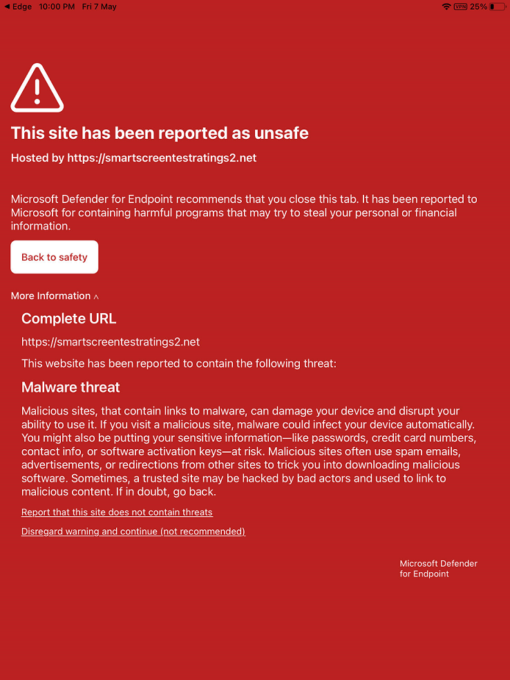

# Behandeln von Problemen und Finden von Antworten auf häufig gestellte Fragen zu Microsoft Defender for Endpoint unter iOSTroubleshoot issues and find answers to FAQs on Microsoft Defender for Endpoint on iOS

[!INCLUDE [Microsoft 365 Defender rebranding](../../includes/microsoft-defender.md)]

**Gilt für:****Applies to:**
- [Microsoft Defender für EndpunktMicrosoft Defender for Endpoint](https://go.microsoft.com/fwlink/p/?linkid=2154037)
- [Microsoft 365 DefenderMicrosoft 365 Defender](https://go.microsoft.com/fwlink/?linkid=2118804)

> Möchten Sie Defender for Endpoint erleben?Want to experience Defender for Endpoint? [Registrieren Sie sich für eine kostenlose Testversion.Sign up for a free trial.](https://www.microsoft.com/microsoft-365/windows/microsoft-defender-atp?ocid=docs-wdatp-exposedapis-abovefoldlink) 

Dieses Thema enthält Informationen zur Problembehandlung, mit deren Hilfe Sie Probleme beheben können, die bei der Verwendung von Microsoft Defender for Endpoint unter iOS auftreten können.This topic provides troubleshooting information to help you address issues that may arise as you use Microsoft Defender for Endpoint on iOS.

> [!NOTE]
> Defender for Endpoint unter iOS würde ein VPN verwenden, um das Web Protection-Feature zur Verfügung zu stellen.Defender for Endpoint on iOS would use a VPN in order to provide the Web Protection feature. Dies ist kein normales VPN und ein lokales VPN mit selbstschleifender Schleife, das keinen Datenverkehr außerhalb des Geräts verwendet.This is not a regular VPN and is a local/self-looping VPN that does not take traffic outside the device.

## Apps funktionieren nicht, wenn VPN aktiviert istApps don't work when VPN is turned on
Es gibt einige Apps, die nicht mehr funktionieren, wenn ein aktives VPN erkannt wird.There are some apps that stop functioning when an active VPN is detected. Sie können das VPN während der Verwendung solcher Apps deaktivieren.You can disable the VPN during the time you are using such apps. 

Standardmäßig enthält und aktiviert Defender for Endpoint unter iOS das Webschutzfeature.By default, Defender for Endpoint on iOS includes and enables the web protection feature. [Webschutz trägt](web-protection-overview.md) dazu bei, Geräte vor Webbedrohungen zu schützen und Benutzer vor Phishingangriffen zu schützen.[Web protection](web-protection-overview.md) helps to secure devices against web threats and protect users from phishing attacks. Defender for Endpoint unter iOS verwendet ein VPN, um diesen Schutz zu gewährleisten.Defender for Endpoint on iOS uses a VPN in order to provide this protection. Beachten Sie, dass es sich um ein lokales VPN handelt und im Gegensatz zu herkömmlichem VPN kein Netzwerkdatenverkehr außerhalb des Geräts gesendet wird.Please note this is a local VPN and unlike traditional VPN, network traffic is not sent outside the device.

Obwohl standardmäßig aktiviert, kann es einige Fälle sein, in denen Sie VPN deaktivieren müssen.While enabled by default, there might be some cases that require you to disable VPN. Beispielsweise möchten Sie einige Apps ausführen, die nicht funktionieren, wenn ein VPN konfiguriert ist.For example, you want to run some apps that do not work when a VPN is configured. In solchen Fällen können Sie vpn von der App auf dem Gerät deaktivieren, indem Sie die folgenden Schritte ausführen:In such cases, you can choose to disable VPN from the app on the device by following the steps below:

1. Öffnen Sie auf Ihrem **iOS-Gerät die Einstellungen** App, klicken oder tippen Sie auf **Allgemein** und dann **auf VPN.**On your iOS device, open the **Settings** app, click or tap **General** and then **VPN**.
1. Klicken oder tippen Sie auf die Schaltfläche "i" für Microsoft Defender for Endpoint.Click or tap the "i" button for Microsoft Defender for Endpoint.
1. Umschalten Verbinden **Bei Bedarf, um** VPN zu deaktivieren.Toggle off **Connect On Demand** to disable VPN.

    > [!div class="mx-imgBorder"]
    > 

> [!NOTE]
> Web Protection ist nicht verfügbar, wenn VPN deaktiviert ist.Web Protection will not be available when VPN is disabled. Öffnen Sie zum erneuten Aktivieren von Web Protection die Microsoft Defender for Endpoint-App auf dem Gerät, und klicken oder tippen **Sie auf VPN starten.**To re-enable Web Protection, open the Microsoft Defender for Endpoint app on the device and click or tap **Start VPN**.

## Probleme mit mehreren VPN-ProfilenIssues with multiple VPN profiles

Apple iOS unterstützt nicht mehrere **geräteweite** VPNs, um gleichzeitig aktiv zu sein.Apple iOS does not support multiple **device-wide** VPNs to be active simultaneously. Auf dem Gerät können zwar mehrere VPN-Profile vorhanden sein, aber nur ein VPN kann gleichzeitig aktiv sein.While multiple VPN profiles can exist on the device, only one VPN can be active at a time.

Microsoft Defender for Endpoint VPN kann mit anderen VPNs koexistent sein, die als pro *App* oder *"Persönlich" konfiguriert sind.*Microsoft Defender for Endpoint VPN can co-exist with other VPNs that are configured as *per-app* or *"Personal"*.

## AkkuverbrauchBattery consumption

In der Einstellungen zeigt iOS nur den Akkuverbrauch von Apps an, die für den Benutzer für einen bestimmten Zeitraum sichtbar sind.In the Settings app, iOS only shows battery usage of apps that are visible to the user for a specific duration of time. Der Akkuverbrauch von Apps, die auf dem Bildschirm angezeigt werden, gilt nur für diese Zeitdauer und wird von iOS basierend auf einer Vielzahl von Faktoren wie CPU- und Netzwerknutzung berechnet.The battery usage by apps shown on the screen are only for that time duration and is computed by iOS based on a multitude of factors including CPU and Network usage. Microsoft Defender for Endpoint verwendet ein lokales /Loop-Back-VPN im Hintergrund, um den Webdatenverkehr auf schädliche Websites oder Verbindungen zu überprüfen.Microsoft Defender for Endpoint uses a local/loop-back VPN in the background to check web traffic for any malicious websites or connections. Netzwerkpakete von jeder App durchgehen diese Prüfung, was dazu führt, dass der Akkuverbrauch von Microsoft Defender for Endpoint ungenau berechnet wird.Network packets from any app go through this check and that causes the battery usage of Microsoft Defender for Endpoint to be computed inaccurately. Der tatsächliche Akkuverbrauch von Microsoft Defender for Endpoint ist viel geringer als der, der auf der Seite Battery Einstellungen auf dem Gerät angezeigt wird.The actual battery consumption of Microsoft Defender for Endpoint is much less than what is shown on the Battery Settings page on the device.

Im Durchschnitt beträgt der Akkuverbrauch pro Tag von Microsoft Defender for Endpoint, der im Hintergrund ausgeführt wird, ca. **8,81 %** des gesamten Akkuverbrauchs an diesem Tag.On an average, per-day battery usage by Microsoft Defender for Endpoint running on the background is **approximately 8.81% of overall battery consumed in that day**. Diese Metrik wird von Apple basierend auf der tatsächlichen Verwendung von Microsoft Defender for Endpoint auf Endbenutzergeräten gemeldet und kann aus den oben genannten Gründen auch anderen Apps mit Netzwerkaktivität berücksichtigt werden.This metric is reported by Apple based on actual usage of Microsoft Defender for Endpoint on end-user devices and due to reasons mentioned above can also be accounted to other apps that have network activity.

Außerdem handelt es sich bei dem verwendeten VPN um ein lokales VPN, und im Gegensatz zu einem herkömmlichen VPN wird der Netzwerkdatenverkehr nicht außerhalb des Geräts gesendet.Also, the VPN used is a local VPN and unlike a traditional VPN, network traffic is not sent outside the device.

## DatenverwendungData usage

Microsoft Defender for Endpoint verwendet ein lokales /loopback-VPN, um den Webdatenverkehr auf schädliche Websites oder Verbindungen zu überprüfen.Microsoft Defender for Endpoint uses a local/loopback VPN to check web traffic for any malicious websites or connections. Aus diesem Grund kann die Datenverwendung von Microsoft Defender for Endpoint falsch berücksichtigt werden.Due to this reason, Microsoft Defender for Endpoint data usage can be inaccurately accounted for. Die tatsächliche Datenverwendung durch Microsoft Defender for Endpoint ist nicht signifikant und kleiner als die Datenverwendungs-Einstellungen auf dem Gerät.The actual data usage by Microsoft Defender for Endpoint is not significant and lesser than what is shown on the Data Usage Settings on the device.

## Unsichere Website meldenReport unsafe site

Phishingwebsites geben sich als vertrauenswürdige Websites aus, um Ihre persönlichen oder finanziellen Informationen zu erhalten.Phishing websites impersonate trustworthy websites for the purpose of obtaining your personal or financial information. Besuchen Sie [die Seite Feedback zum Netzwerkschutz](https://www.microsoft.com/wdsi/filesubmission/exploitguard/networkprotection) bereitstellen, um eine Website zu melden, bei der es sich um eine Phishingwebsite handelt.Visit the [Provide feedback about network protection](https://www.microsoft.com/wdsi/filesubmission/exploitguard/networkprotection) page to report a website that could be a phishing site.

## Schädliche Website erkanntMalicious site detected

Microsoft Defender for Endpoint schützt Sie vor Phishing oder anderen webbasierten Angriffen.Microsoft Defender for Endpoint protects you against phishing or other web-based attacks. Wenn eine schädliche Website erkannt wird, wird die Verbindung blockiert und eine Warnung an das Security Center-Portal der Organisation gesendet.If a malicious site is detected, the connection is blocked and an alert is sent to the organization's Security Center portal. Die Warnung enthält den Domänennamen der Verbindung, die Remote-IP-Adresse und die Gerätedetails.The alert includes the domain name of the connection, remote IP address and the device details.

Darüber hinaus wird auf dem iOS-Gerät eine Benachrichtigung angezeigt.In addition, a notification is shown on the iOS device. Durch Tippen auf die Benachrichtigung wird der folgende Bildschirm geöffnet, damit der Benutzer die Details überprüfen kann.Tapping on the notification opens the following screen for the user to review the details.

> [!div class="mx-imgBorder"]
> 

## Daten und DatenschutzData and Privacy

Weitere Informationen zu erfassten Daten und zum Datenschutz finden Sie unter [Datenschutzinformationen – Microsoft Defender for Endpoint unter iOS](ios-privacy.md).For details about data collected and privacy, see [Privacy Information - Microsoft Defender for Endpoint on iOS](ios-privacy.md).

