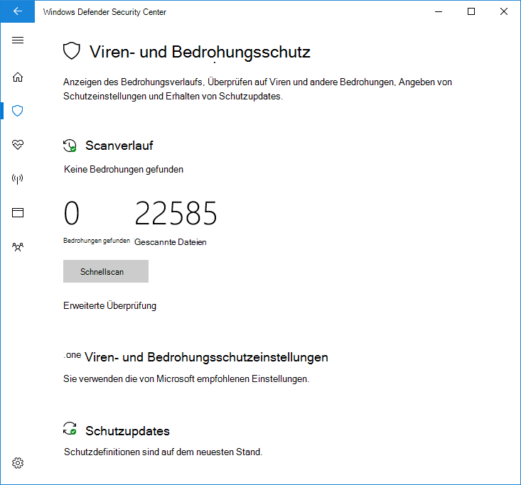

# Verwendung von eingeschränkten periodischen Scans in Microsoft Defender AntivirusUse limited periodic scanning in Microsoft Defender Antivirus

[!INCLUDE [Microsoft 365 Defender rebranding](../../includes/microsoft-defender.md)]

**Gilt für:****Applies to:**

- [Microsoft Defender für EndpunktMicrosoft Defender for Endpoint](/microsoft-365/security/defender-endpoint/)

Die eingeschränkte regelmäßige Überprüfung ist eine spezielle Art der Bedrohungserkennung und -behebung, die aktiviert werden kann, wenn Sie ein anderes Antivirenprodukt auf einem Windows 10 Gerät installiert haben.Limited periodic scanning is a special type of threat detection and remediation that can be enabled when you have installed another antivirus product on a Windows 10 device.

Sie kann nur in bestimmten Situationen aktiviert werden.It can only be enabled in certain situations. Weitere Informationen zur eingeschränkten regelmäßigen Überprüfung und zur Funktionsweise Microsoft Defender Antivirus mit anderen Antivirenprodukten finden Sie unter [Microsoft Defender Antivirus Kompatibilität.](microsoft-defender-antivirus-compatibility.md)For more information about limited periodic scanning and how Microsoft Defender Antivirus works with other antivirus products, see [Microsoft Defender Antivirus compatibility](microsoft-defender-antivirus-compatibility.md).

**Microsoft empfiehlt nicht die Verwendung dieses Features in Unternehmensumgebungen. Dies ist ein Feature, das in erster Linie für Verbraucher vorgesehen ist.****Microsoft does not recommend using this feature in enterprise environments. This is a feature primarily intended for consumers.** Dieses Feature verwendet nur eine begrenzte Teilmenge der Microsoft Defender Antivirus Funktionen, um Schadsoftware zu erkennen, und kann nicht die meisten Schadsoftware und potenziell unerwünschte Software erkennen.This feature only uses a limited subset of the Microsoft Defender Antivirus capabilities to detect malware, and will not be able to detect most malware and potentially unwanted software. Außerdem sind die Verwaltungs- und Berichtsfunktionen eingeschränkt.Also, management and reporting capabilities will be limited. Microsoft empfiehlt Unternehmen, ihre primäre Antivirenlösung auszuwählen und ausschließlich zu verwenden.Microsoft recommends enterprises choose their primary antivirus solution and use it exclusively.

## Aktivieren der eingeschränkten regelmäßigen ÜberprüfungHow to enable limited periodic scanning

Standardmäßig aktiviert sich Microsoft Defender Antivirus auf einem Windows 10 Gerät, wenn kein anderes Antivirenprodukt installiert ist oder wenn das andere Produkt veraltet, abgelaufen oder nicht ordnungsgemäß funktioniert.By default, Microsoft Defender Antivirus will enable itself on a Windows 10 device if there is no other antivirus product installed, or if the other product is out-of-date, expired, or not working correctly.

Wenn Microsoft Defender Antivirus aktiviert ist, werden die üblichen Optionen angezeigt, um es auf diesem Gerät zu konfigurieren:If Microsoft Defender Antivirus is enabled, the usual options will appear to configure it on that device:

Wenn ein anderes Antivirenprodukt installiert ist und ordnungsgemäß funktioniert, deaktiviert Microsoft Defender Antivirus sich selbst.If another antivirus product is installed and working correctly, Microsoft Defender Antivirus will disable itself. The Windows-Sicherheit app will change the **Virus & threat protection** section to show status about the AV product, and provide a link to the product's configuration options.The Windows Security app will change the **Virus & threat protection** section to show status about the AV product, and provide a link to the product's configuration options.

Unter allen AV-Produkten von Drittanbietern wird ein neuer Link als **Microsoft Defender Antivirus Optionen** angezeigt.Underneath any third party AV products, a new link will appear as **Microsoft Defender Antivirus options**. Durch Klicken auf diesen Link wird die Umschaltfläche angezeigt, die eine eingeschränkte regelmäßige Überprüfung ermöglicht.Clicking this link will expand to show the toggle that enables limited periodic scanning. Beachten Sie, dass die eingeschränkte regelmäßige Option eine Umschaltfläche zum Aktivieren oder Deaktivieren der regelmäßigen Überprüfung ist.Note that the limited periodic option is a toggle to enable or disable periodic scanning. 

Wenn Sie den Schalter auf **"Ein"** setzen, werden die standardmäßigen Microsoft Defender AV-Optionen unter dem AV-Produkt des Drittanbieters angezeigt.Sliding the switch to **On** will show the standard Microsoft Defender AV options underneath the third party AV product. Die eingeschränkte regelmäßige Überprüfungsoption wird am unteren Rand der Seite angezeigt.The limited periodic scanning option will appear at the bottom of the page.

## Verwandte ArtikelRelated articles

- [Konfigurieren von verhaltensbasiertem, heuristischem und EchtzeitschutzConfigure behavioral, heuristic, and real-time protection](configure-protection-features-microsoft-defender-antivirus.md)
- [Microsoft Defender Antivirus in Windows 10Microsoft Defender Antivirus in Windows 10](microsoft-defender-antivirus-in-windows-10.md)