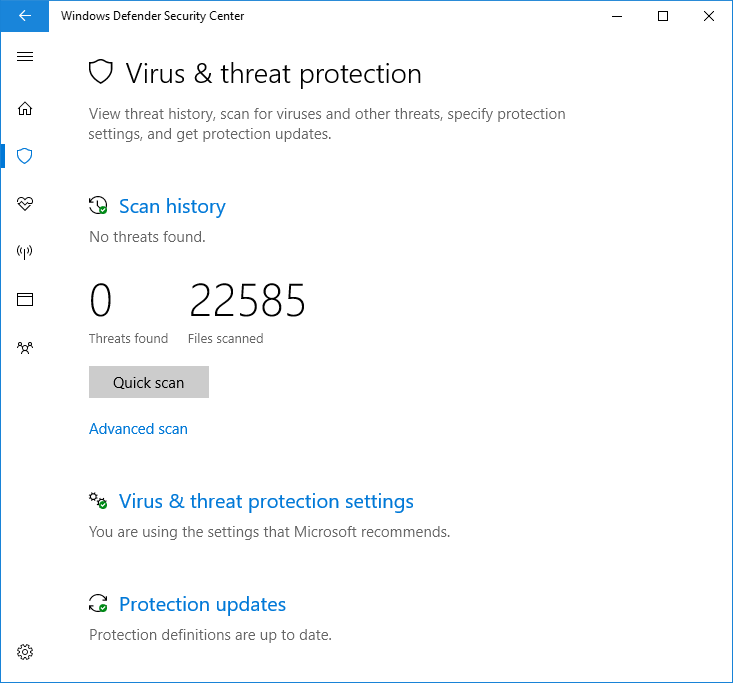

# Verwenden begrenzter regelmäßiger Überprüfungen in Microsoft Defender AntivirusUse limited periodic scanning in Microsoft Defender Antivirus

[!INCLUDE [Microsoft 365 Defender rebranding](../../includes/microsoft-defender.md)]

**Gilt für:****Applies to:**

- [Microsoft Defender für EndpunktMicrosoft Defender for Endpoint](/microsoft-365/security/defender-endpoint/)

Begrenzte regelmäßige Überprüfungen sind eine spezielle Art von Bedrohungserkennung und -behebung, die aktiviert werden können, wenn Sie ein anderes Antivirenprodukt auf einem Windows 10-Gerät installiert haben.Limited periodic scanning is a special type of threat detection and remediation that can be enabled when you have installed another antivirus product on a Windows 10 device.

Sie kann nur in bestimmten Situationen aktiviert werden.It can only be enabled in certain situations. Weitere Informationen zur begrenzten regelmäßigen Überprüfung und zur Funktionsweise von Microsoft Defender Antivirus mit anderen Antivirenprodukten finden Sie unter [Microsoft Defender Antivirus compatibility](microsoft-defender-antivirus-compatibility.md).For more information about limited periodic scanning and how Microsoft Defender Antivirus works with other antivirus products, see [Microsoft Defender Antivirus compatibility](microsoft-defender-antivirus-compatibility.md).

**Microsoft empfiehlt die Verwendung dieses Features in Unternehmensumgebungen nicht. Dies ist ein Feature, das in erster Linie für Verbraucher vorgesehen ist.****Microsoft does not recommend using this feature in enterprise environments. This is a feature primarily intended for consumers.** Dieses Feature verwendet nur eine begrenzte Teilmenge der Microsoft Defender Antivirus-Funktionen zum Erkennen von Schadsoftware und kann die meisten Schadsoftware und potenziell unerwünschte Software nicht erkennen.This feature only uses a limited subset of the Microsoft Defender Antivirus capabilities to detect malware, and will not be able to detect most malware and potentially unwanted software. Darüber hinaus sind die Verwaltungs- und Berichtsfunktionen eingeschränkt.Also, management and reporting capabilities will be limited. Microsoft empfiehlt Unternehmen, ihre primäre Antivirenlösung zu wählen und sie exklusiv zu verwenden.Microsoft recommends enterprises choose their primary antivirus solution and use it exclusively.

## Aktivieren begrenzter regelmäßiger ÜberprüfungenHow to enable limited periodic scanning

Microsoft Defender Antivirus aktiviert sich standardmäßig auf einem Windows 10-Gerät, wenn kein anderes Antivirenprodukt installiert ist oder das andere Produkt veraltet ist, abgelaufen ist oder nicht ordnungsgemäß funktioniert.By default, Microsoft Defender Antivirus will enable itself on a Windows 10 device if there is no other antivirus product installed, or if the other product is out-of-date, expired, or not working correctly.

Wenn Microsoft Defender Antivirus aktiviert ist, werden die üblichen Optionen angezeigt, um es auf diesem Gerät zu konfigurieren:If Microsoft Defender Antivirus is enabled, the usual options will appear to configure it on that device:

Wenn ein anderes Antivirenprodukt installiert ist und ordnungsgemäß funktioniert, deaktiviert Microsoft Defender Antivirus sich selbst.If another antivirus product is installed and working correctly, Microsoft Defender Antivirus will disable itself. Die Windows Security-App ändert den Abschnitt **Virenschutz &,** um den Status des AV-Produkts anzuzeigen, und stellt einen Link zu den Konfigurationsoptionen des Produkts zur Verfügung.The Windows Security app will change the **Virus & threat protection** section to show status about the AV product, and provide a link to the product's configuration options.

Unterhalb von AV-Produkten von Drittanbietern wird ein neuer Link als **Microsoft Defender Antivirus-Optionen angezeigt.**Underneath any third party AV products, a new link will appear as **Microsoft Defender Antivirus options**. Wenn Sie auf diesen Link klicken, wird der Umschalter, der eine eingeschränkte regelmäßige Überprüfung ermöglicht, erweitert.Clicking this link will expand to show the toggle that enables limited periodic scanning. Beachten Sie, dass die eingeschränkte periodische Option eine Umschalte ist, um die regelmäßige Überprüfung zu aktivieren oder zu deaktivieren.Note that the limited periodic option is a toggle to enable or disable periodic scanning. 

Wenn Sie den Schalter auf **Ein** verschieben, werden die standardmäßigen Microsoft Defender AV-Optionen unterhalb des Drittanbieter-AV-Produkts angezeigt.Sliding the switch to **On** will show the standard Microsoft Defender AV options underneath the third party AV product. Die eingeschränkte regelmäßige Überprüfungsoption wird am unteren Rand der Seite angezeigt.The limited periodic scanning option will appear at the bottom of the page.

## Verwandte ArtikelRelated articles

- [Konfigurieren von Verhaltens-, Heuristik- und EchtzeitschutzConfigure behavioral, heuristic, and real-time protection](configure-protection-features-microsoft-defender-antivirus.md)
- [Microsoft Defender Antivirus in Windows 10Microsoft Defender Antivirus in Windows 10](microsoft-defender-antivirus-in-windows-10.md)