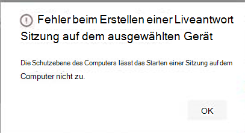

# <a name="investigate-entities-on-devices-using-live-response"></a>Untersuchen von Entitäten auf Geräten mithilfe von Liveantworten

[!INCLUDE [Microsoft 365 Defender rebranding](../../includes/microsoft-defender.md)]

**Gilt für:**
- [Microsoft Defender für Endpunkt](https://go.microsoft.com/fwlink/p/?linkid=2154037)
- [Microsoft 365 Defender](https://go.microsoft.com/fwlink/?linkid=2118804)


> Möchten Sie Defender for Endpoint erleben? [Registrieren Sie sich für eine kostenlose Testversion.](https://www.microsoft.com/microsoft-365/windows/microsoft-defender-atp?ocid=docs-wdatp-investigateip-abovefoldlink)

Die Liveantwort bietet Sicherheitsteams sofortigen Zugriff auf ein Gerät (auch als Computer bezeichnet) über eine Remoteshellverbindung. Dies gibt Ihnen die Macht, eingehende Ermittlungen zu machen und sofort Maßnahmen zur sofortigen Eindämmung identifizierter Bedrohungen zu ergreifen – in Echtzeit. 

Live response is designed to enhance investigations by enabling your security operations team to collect forensic data, run scripts, send suspicious entities for analysis, remediate threats, and proactively hunt for emerging threats.<br/><br/>

> [!VIDEO https://www.microsoft.com/videoplayer/embed/RE4qLUW]

Mit einer Liveantwort können Analysten alle folgenden Aufgaben ausführen:
- Führen Sie grundlegende und erweiterte Befehle aus, um Ermittlungsarbeit auf einem Gerät auszuführen.
- Laden Sie Dateien wie Schadsoftwarebeispiele und Ergebnisse von PowerShell-Skripts herunter.
- Laden Sie Dateien im Hintergrund herunter (neu!).
- Hochladen sie ein PowerShell-Skript oder eine ausführbare Datei in die Bibliothek ein, und führen Sie es auf einem Gerät auf Mandantenebene aus.
- Ausführen oder Rückgängig machen von Korrekturaktionen.

## <a name="before-you-begin"></a>Vorabinformationen

Bevor Sie eine Sitzung auf einem Gerät initiieren können, stellen Sie sicher, dass Sie die folgenden Anforderungen erfüllen:

- **Vergewissern Sie sich, dass Sie eine unterstützte Version von Windows.** <br/>
Auf Geräten muss eine der folgenden Versionen von Windows

  - **Windows 10**
    - [Version 1909](https://docs.microsoft.com/windows/whats-new/whats-new-windows-10-version-1909) oder höher  
    - [Version 1903](https://docs.microsoft.com/windows/whats-new/whats-new-windows-10-version-1903) mit [KB4515384](https://support.microsoft.com/en-us/help/4515384/windows-10-update-kb4515384)
    - [Version 1809 (RS 5)](https://docs.microsoft.com/windows/whats-new/whats-new-windows-10-version-1809) [mit KB4537818](https://support.microsoft.com/help/4537818/windows-10-update-kb4537818)
    - [Version 1803 (RS 4)](https://docs.microsoft.com/windows/whats-new/whats-new-windows-10-version-1803) mit [KB4537795](https://support.microsoft.com/help/4537795/windows-10-update-kb4537795)
    - [Version 1709 (RS 3)](https://docs.microsoft.com/windows/whats-new/whats-new-windows-10-version-1709) mit [KB4537816](https://support.microsoft.com/help/4537816/windows-10-update-kb4537816)
  
  - **Windows Server 2019 – Gilt nur für öffentliche Vorschau**
    - Version 1903 oder (mit [KB4515384](https://support.microsoft.com/en-us/help/4515384/windows-10-update-kb4515384)) später 
    - Version 1809 (mit [KB4537818](https://support.microsoft.com/en-us/help/4537818/windows-10-update-kb4537818))

- **Aktivieren Sie die Liveantwort über die Seite "Erweiterte Einstellungen".**<br>
Sie müssen die Liveantwortfunktion auf der Seite Erweiterte [Features-Einstellungen](advanced-features.md) aktivieren.

    >[!NOTE]
    >Diese Einstellungen können nur von Benutzern mit verwalteten Sicherheits- oder globalen Administratorrollen bearbeitet werden.

- **Aktivieren Sie die Liveantwort für Server über die Seite mit den erweiterten Einstellungen** (empfohlen).<br>

    >[!NOTE]
    >Diese Einstellungen können nur von Benutzern mit verwalteten Sicherheits- oder globalen Administratorrollen bearbeitet werden.
    
- **Stellen Sie sicher, dass dem Gerät eine Automatisierungsbehebungsstufe zugewiesen ist.**<br>
Sie müssen mindestens die Minimale Korrekturstufe für eine bestimmte Gerätegruppe aktivieren. Andernfalls können Sie keine Liveantwortsitzung für ein Mitglied dieser Gruppe einrichten.

    Sie erhalten den folgenden Fehler:

    

- **Aktivieren sie die Ausführung eines nicht signierten Skripts** für die Liveantwort (optional). <br>

    >[!WARNING]
    >Wenn Sie die Verwendung nicht signierter Skripts zulassen, kann die Bedrohungsbelastung erhöht werden.
 
  Das Ausführen nicht signierter Skripts wird nicht empfohlen, da dies die Bedrohungen erhöhen kann. Wenn Sie sie jedoch verwenden müssen, müssen Sie die Einstellung auf der Seite Erweiterte [Features-Einstellungen](advanced-features.md) aktivieren.
    
- **Stellen Sie sicher, dass Sie über die entsprechenden Berechtigungen verfügen.**<br>
    Nur Benutzer, die mit den entsprechenden Berechtigungen bereitgestellt wurden, können eine Sitzung initiieren. Weitere Informationen zu Rollenzuweisungen finden Sie unter [Erstellen und Verwalten von Rollen.](user-roles.md) 

    > [!IMPORTANT]
    > Die Option, eine Datei in die Bibliothek hochzuladen, ist nur für Personen verfügbar, die über die entsprechenden RbAC-Berechtigungen verfügen. Die Schaltfläche ist für Benutzer mit nur delegierten Berechtigungen ausgegraut.

    Je nachdem, welche Rolle Ihnen gewährt wurde, können Sie einfache oder erweiterte Liveantwortbefehle ausführen. Benutzerberechtigungen werden durch die benutzerdefinierte Rolle rbAC gesteuert. 

## <a name="live-response-dashboard-overview"></a>Übersicht über das Liveantwortdashboard
Wenn Sie eine Liveantwortsitzung auf einem Gerät initiieren, wird ein Dashboard geöffnet. Das Dashboard enthält Informationen zur Sitzung, z. B.: 

- Wer die Sitzung erstellt
- Beim Starten der Sitzung
- Die Dauer der Sitzung

Das Dashboard bietet Ihnen außerdem Zugriff auf:
- Trennen einer Sitzung
- Hochladen dateien in die Bibliothek 
- Befehlskonsole
- Befehlsprotokoll


## <a name="initiate-a-live-response-session-on-a-device"></a>Initiieren einer Liveantwortsitzung auf einem Gerät 

1. Melden Sie sich bei Microsoft Defender Security Center.

2. Navigieren Sie zur Seite Geräteliste, und wählen Sie ein gerät aus, das untersucht werden soll. Die Seite "Geräte" wird geöffnet.

3. Starten Sie die Liveantwortsitzung, indem Sie **Liveantwortsitzung initiieren auswählen.** Eine Befehlskonsole wird angezeigt. Warten Sie, während die Sitzung eine Verbindung mit dem Gerät herstellt.

4. Verwenden Sie die integrierten Befehle, um Ermittlungsarbeit auszuführen. Weitere Informationen finden Sie unter [Live-Antwortbefehle](#live-response-commands).

5. Wählen Sie nach Abschluss der Untersuchung die Option **Sitzung trennen** aus, und wählen Sie dann **Bestätigen aus.**

## <a name="live-response-commands"></a>Liveantwortbefehle

Je nachdem, welche Rolle Ihnen gewährt wurde, können Sie einfache oder erweiterte Liveantwortbefehle ausführen. Benutzerberechtigungen werden von benutzerdefinierten Rollen der RBAC gesteuert. Weitere Informationen zu Rollenzuweisungen finden Sie unter [Erstellen und Verwalten von Rollen.](user-roles.md) 


>[!NOTE]
>Liveantwort ist eine cloudbasierte interaktive Shell, da bestimmte Befehlserfahrungen je nach Netzwerkqualität und Systemlast zwischen Endbenutzer und Zielgerät je nach Antwortzeit variieren können.

### <a name="basic-commands"></a>Grundlegende Befehle

Die folgenden Befehle stehen für Benutzerrollen zur  Verfügung, für die grundlegende Liveantwortbefehle ausgeführt werden können. Weitere Informationen zu Rollenzuweisungen finden Sie unter [Erstellen und Verwalten von Rollen.](user-roles.md) 

| Befehl | Beschreibung |
|---|---|--- |
|`cd` | Ändert das aktuelle Verzeichnis. | 
|`cls` | Der Konsolenbildschirm wird geräumt.  |
|`connect` | Initiiert eine Liveantwortsitzung an das Gerät. |
|`connections` | Zeigt alle aktiven Verbindungen an. |
|`dir` | Zeigt eine Liste der Dateien und Unterverzeichnisse in einem Verzeichnis an. |
|`drivers` |  Zeigt alle auf dem Gerät installierten Treiber an. |
|`fg <command ID>` | Platzieren Sie den angegebenen Auftrag im Vordergrund, wodurch er zum aktuellen Auftrag wird. <br> HINWEIS: fg verwendet eine "Befehls-ID", die von Aufträgen und nicht von einer PID verfügbar ist. |
|`fileinfo` | Abrufen von Informationen zu einer Datei. |
|`findfile` | Sucht Dateien nach einem bestimmten Namen auf dem Gerät. |
|`getfile <file_path>` | Lädt eine Datei herunter. |
|`help` | Enthält Hilfeinformationen für Liveantwortbefehle. |
|`jobs` | Zeigt derzeit ausgeführte Aufträge, ihre ID und den Status an. |
|`persistence` | Zeigt alle bekannten Persistenzmethoden auf dem Gerät an. |
|`processes` | Zeigt alle auf dem Gerät ausgeführten Prozesse an. |
|`registry` | Zeigt Registrierungswerte an. |
|`scheduledtasks` | Zeigt alle geplanten Aufgaben auf dem Gerät an. |
|`services` | Zeigt alle Dienste auf dem Gerät an. |
|`trace` | Legt den Protokollierungsmodus des Terminal auf Debuggen fest. |

### <a name="advanced-commands"></a>Erweiterte Befehle
Die folgenden Befehle sind für Benutzerrollen verfügbar, für die erweiterte **Liveantwortbefehle** ausgeführt werden können. Weitere Informationen zu Rollenzuweisungen finden Sie unter [Erstellen und Verwalten von Rollen.](user-roles.md) 

| Befehl | Beschreibung |
|---|---|
| `analyze` | Analysiert die Entität mit verschiedenen Beschuldigungsmodule, um ein Urteil zu erreichen. |
| `run` | Führt ein PowerShell-Skript aus der Bibliothek auf dem Gerät aus. |
| `library` | Listet Dateien auf, die in die Liveantwortbibliothek hochgeladen wurden. |
| `putfile` | Legt eine Datei aus der Bibliothek auf das Gerät. Dateien werden in einem Arbeitsordner gespeichert und gelöscht, wenn das Gerät standardmäßig neu gestartet wird. |
| `remediate` | Eine Entität auf dem Gerät wird behoben. Die Korrekturaktion variiert je nach Entitätstyp:<br>- Datei: löschen<br>- Prozess: Beenden, Löschen der Bilddatei<br>- Dienst: Bilddatei beenden, löschen<br>- Registrierungseintrag: löschen<br>– Geplante Aufgabe: entfernen<br>- Element des Startordners: Datei löschen <br> HINWEIS: Dieser Befehl verfügt über einen erforderlichen Befehl. Sie können den Befehl `-auto` zusammen mit verwenden, `remediate` um den erforderlichen Befehl automatisch auszuführen. 
|`undo` | Stellt eine Entität wieder dar, die behoben wurde. |


## <a name="use-live-response-commands"></a>Verwenden von Liveantwortbefehlen

Die Befehle, die Sie in der Konsole verwenden können, folgen ähnlichen Prinzipien wie [Windows Befehle](https://docs.microsoft.com/windows-server/administration/windows-commands/windows-commands#BKMK_c).

Die erweiterten Befehle bieten eine stabilere Reihe von Aktionen, mit denen Sie leistungsstärkere Aktionen ausführen können, z. B. das Herunterladen und Hochladen einer Datei, das Ausführen von Skripts auf dem Gerät und das Ausführen von Korrekturaktionen für eine Entität.

### <a name="get-a-file-from-the-device"></a>Herunterladen einer Datei vom Gerät

In Szenarien, in denen Sie eine Datei von einem gerät, das Sie untersuchen möchten, erhalten möchten, können Sie den Befehl `getfile` verwenden. Auf diese Weise können Sie die Datei zur weiteren Untersuchung auf dem Gerät speichern.

>[!NOTE]
>Es gelten die folgenden Dateigrößenbeschränkungen:
>- `getfile` Grenzwert: 3 GB
>- `fileinfo` Grenzwert: 10 GB
>- `library` Grenzwert: 250 MB

### <a name="download-a-file-in-the-background"></a>Herunterladen einer Datei im Hintergrund

Damit Ihr Sicherheitsteam weiterhin ein betroffenes Gerät untersuchen kann, können Dateien jetzt im Hintergrund heruntergeladen werden.

- Geben Sie in der Liveantwortbefehlskonsole ein, um eine Datei im Hintergrund `download <file_path> &` herunterzuladen.
- Wenn Sie darauf warten, dass eine Datei heruntergeladen wird, können Sie sie mithilfe von STRG + Z in den Hintergrund verschieben.
- Geben Sie in der Liveantwortbefehlskonsole ein, um einen Dateidownload in den Vordergrund zu `fg <command_id>` bringen.

Im Folgenden finden Sie einige Beispiele:


|Befehl  |Funktion  |
|---------|---------|
|`getfile "C:\windows\some_file.exe" &`     |Startet das Herunterladen einer Datei *namenssome_file.exe* im Hintergrund.         |
|`fg 1234`     |Gibt einen Download mit der Befehls-ID *1234 in* den Vordergrund zurück.         |


### <a name="put-a-file-in-the-library"></a>Speichern einer Datei in der Bibliothek

Die Liveantwort verfügt über eine Bibliothek, in der Sie Dateien speichern können. In der Bibliothek werden Dateien (z. B. Skripts) gespeichert, die in einer Liveantwortsitzung auf Mandantenebene ausgeführt werden können.

Die Liveantwort ermöglicht die Ausführung von PowerShell-Skripts. Sie müssen die Dateien jedoch zuerst in die Bibliothek setzen, bevor Sie sie ausführen können. 

Sie können über eine Sammlung von PowerShell-Skripts verfügen, die auf Geräten ausgeführt werden können, mit der Sie Liveantwortsitzungen initiieren. 

#### <a name="to-upload-a-file-in-the-library"></a>So laden Sie eine Datei in die Bibliothek hoch

1. Klicken **Sie Hochladen datei in die Bibliothek**. 

2. Klicken **Sie auf Durchsuchen,** und wählen Sie die Datei aus.

3. Geben Sie eine kurze Beschreibung an.

4. Geben Sie an, ob Sie eine Datei mit demselben Namen überschreiben möchten.

5. Wenn Sie wissen möchten, welche Parameter für das Skript benötigt werden, aktivieren Sie das Kontrollkästchen Skriptparameter. Geben Sie im Textfeld ein Beispiel und eine Beschreibung ein.

6. Klicken Sie **auf Bestätigen**. 

7. (Optional) Führen Sie den Befehl aus, um zu überprüfen, ob die Datei in die Bibliothek hochgeladen `library` wurde.


### <a name="cancel-a-command"></a>Abbrechen eines Befehls
Jederzeit während einer Sitzung können Sie einen Befehl abbrechen, indem Sie STRG + C drücken.  

>[!WARNING]
>Wenn Sie diese Verknüpfung verwenden, wird der Befehl auf der Agentseite nicht beendet. Es wird nur der Befehl im Portal abgebrochen. Das Ändern von Vorgängen wie "Remediate" kann also fortgesetzt werden, während der Befehl abgebrochen wird. 

## <a name="run-a-powershell-script"></a>Ausführen eines PowerShell-Skripts 

Bevor Sie ein PowerShell-Skript ausführen können, müssen Sie es zunächst in die Bibliothek hochladen. 

Nachdem Sie das Skript in die Bibliothek hochgeladen haben, verwenden Sie den `run` Befehl, um das Skript auszuführen.

Wenn Sie ein nicht signiertes Skript in der Sitzung verwenden möchten, müssen Sie die Einstellung auf der Seite Erweiterte [Featureseinstellungen](advanced-features.md) aktivieren.

>[!WARNING]
>Wenn Sie die Verwendung nicht signierter Skripts zulassen, kann die Bedrohungsbelastung erhöht werden.

## <a name="apply-command-parameters"></a>Anwenden von Befehlsparametern

- Sehen Sie sich die Konsolenhilfe an, um mehr über Befehlsparameter zu erfahren. Führen Sie die folgenden Befehle aus, um mehr über einen einzelnen Befehl zu erfahren:
 
    `help <command name>`

- Beachten Sie beim Anwenden von Parametern auf Befehle, dass Parameter basierend auf einer festen Reihenfolge behandelt werden:
 
    `<command name> param1 param2` 

- Geben Sie beim Angeben von Parametern außerhalb der festen Reihenfolge den Namen des Parameters mit einem Bindestrich an, bevor Sie den Wert angeben:
 
    `<command name> -param2_name param2`

- Bei Der Verwendung von Befehlen mit erforderlichen Befehlen können Sie Kennzeichen verwenden:

    `<command name> -type file -id <file path> - auto` oder `remediate file <file path> - auto`.

## <a name="supported-output-types"></a>Unterstützte Ausgabetypen

Die Liveantwort unterstützt Ausgabetypen im Tabellen- und JSON-Format. Für jeden Befehl gibt es ein Standardausgabeverhalten. Sie können die Ausgabe in Ihrem bevorzugten Ausgabeformat mithilfe der folgenden Befehle ändern:

- `-output json`
- `-output table`

>[!NOTE]
>Aufgrund des begrenzten Speicherplatzes werden weniger Felder im Tabellenformat angezeigt. Um weitere Details in der Ausgabe anzuzeigen, können Sie den Befehl JSON-Ausgabe verwenden, damit weitere Details angezeigt werden.

## <a name="supported-output-pipes"></a>Unterstützte Ausgabepipes

Die Liveantwort unterstützt die Ausgabepipette an CLI und Datei. CLI ist das Standardausgabeverhalten. Sie können die Ausgabe mithilfe des folgenden Befehls an eine Datei umleitungsen: [Befehl] > [filename].txt.  

Beispiel:

```console
processes > output.txt
```

## <a name="view-the-command-log"></a>Anzeigen des Befehlsprotokolls

Wählen Sie **die Registerkarte Befehlsprotokoll** aus, um die Befehle anzuzeigen, die während einer Sitzung auf dem Gerät verwendet werden. Jeder Befehl wird mit vollständigen Details nachverfolgt, z. B.:
- ID
- Befehlszeile
- Dauer
- Status- und Eingabe- oder Ausgabeleiste

## <a name="limitations"></a>Einschränkungen

- Liveantwortsitzungen sind auf 25 Liveantwortsitzungen gleichzeitig beschränkt.
- Inaktiver Timeoutwert der Liveantwortsitzung beträgt 30 Minuten. 
- Ein Benutzer kann bis zu 10 gleichzeitige Sitzungen initiieren.
- Ein Gerät kann nur in einer Sitzung gleichzeitig sein.
- Es gelten die folgenden Dateigrößenbeschränkungen:
   - `getfile` Grenzwert: 3 GB
   - `fileinfo` Grenzwert: 10 GB
   - `library` Grenzwert: 250 MB

## <a name="related-article"></a>Verwandter Artikel
- [Kommandobeispiele für Liveantworten](live-response-command-examples.md)
