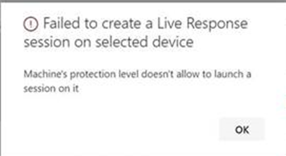

# <a name="investigate-entities-on-devices-using-live-response"></a><span data-ttu-id="588d5-104">Untersuchen von Entitäten auf Geräten mithilfe von Liveantworten</span><span class="sxs-lookup"><span data-stu-id="588d5-104">Investigate entities on devices using live response</span></span>

[!INCLUDE [Microsoft 365 Defender rebranding](../../includes/microsoft-defender.md)]

<span data-ttu-id="588d5-105">**Gilt für:**</span><span class="sxs-lookup"><span data-stu-id="588d5-105">**Applies to:**</span></span>
- [<span data-ttu-id="588d5-106">Microsoft Defender für Endpunkt</span><span class="sxs-lookup"><span data-stu-id="588d5-106">Microsoft Defender for Endpoint</span></span>](https://go.microsoft.com/fwlink/p/?linkid=2154037)
- [<span data-ttu-id="588d5-107">Microsoft 365 Defender</span><span class="sxs-lookup"><span data-stu-id="588d5-107">Microsoft 365 Defender</span></span>](https://go.microsoft.com/fwlink/?linkid=2118804)


> <span data-ttu-id="588d5-108">Möchten Sie Defender for Endpoint erleben?</span><span class="sxs-lookup"><span data-stu-id="588d5-108">Want to experience Defender for Endpoint?</span></span> [<span data-ttu-id="588d5-109">Registrieren Sie sich für eine kostenlose Testversion.</span><span class="sxs-lookup"><span data-stu-id="588d5-109">Sign up for a free trial.</span></span>](https://www.microsoft.com/microsoft-365/windows/microsoft-defender-atp?ocid=docs-wdatp-investigateip-abovefoldlink)

<span data-ttu-id="588d5-110">Die Liveantwort bietet Sicherheitsteams sofortigen Zugriff auf ein Gerät (auch als Computer bezeichnet) über eine Remoteshellverbindung.</span><span class="sxs-lookup"><span data-stu-id="588d5-110">Live response gives security operations teams instantaneous access to a device (also referred to as a machine) using a remote shell connection.</span></span> <span data-ttu-id="588d5-111">Dies gibt Ihnen die Macht, eingehende Ermittlungen zu machen und sofort Maßnahmen zur sofortigen Eindämmung identifizierter Bedrohungen zu ergreifen – in Echtzeit.</span><span class="sxs-lookup"><span data-stu-id="588d5-111">This gives you the power to do in-depth investigative work and take immediate response actions to promptly contain identified threats—in real time.</span></span> 

<span data-ttu-id="588d5-112">Live response is designed to enhance investigations by enabling your security operations team to collect forensic data, run scripts, send suspicious entities for analysis, remediate threats, and proactively hunt for emerging threats.</span><span class="sxs-lookup"><span data-stu-id="588d5-112">Live response is designed to enhance investigations by enabling your security operations team to collect forensic data, run scripts, send suspicious entities for analysis, remediate threats, and proactively hunt for emerging threats.</span></span><br/><br/>

> [!VIDEO https://www.microsoft.com/videoplayer/embed/RE4qLUW]

<span data-ttu-id="588d5-113">Mit einer Liveantwort können Analysten alle folgenden Aufgaben ausführen:</span><span class="sxs-lookup"><span data-stu-id="588d5-113">With live response, analysts can do all of the following tasks:</span></span>
- <span data-ttu-id="588d5-114">Führen Sie grundlegende und erweiterte Befehle aus, um Ermittlungsarbeit auf einem Gerät auszuführen.</span><span class="sxs-lookup"><span data-stu-id="588d5-114">Run basic and advanced commands to do investigative work on a device.</span></span>
- <span data-ttu-id="588d5-115">Laden Sie Dateien wie Schadsoftwarebeispiele und Ergebnisse von PowerShell-Skripts herunter.</span><span class="sxs-lookup"><span data-stu-id="588d5-115">Download files such as malware samples and outcomes of PowerShell scripts.</span></span>
- <span data-ttu-id="588d5-116">Laden Sie Dateien im Hintergrund herunter (neu!).</span><span class="sxs-lookup"><span data-stu-id="588d5-116">Download files in the background (new!).</span></span>
- <span data-ttu-id="588d5-117">Laden Sie ein PowerShell-Skript oder eine ausführbare Datei in die Bibliothek hoch, und führen Sie es auf einem Gerät auf Mandantenebene aus.</span><span class="sxs-lookup"><span data-stu-id="588d5-117">Upload a PowerShell script or executable to the library and run it on a device from a tenant level.</span></span>
- <span data-ttu-id="588d5-118">Ausführen oder Rückgängig machen von Korrekturaktionen.</span><span class="sxs-lookup"><span data-stu-id="588d5-118">Take or undo remediation actions.</span></span>

## <a name="before-you-begin"></a><span data-ttu-id="588d5-119">Vorbereitung</span><span class="sxs-lookup"><span data-stu-id="588d5-119">Before you begin</span></span>

<span data-ttu-id="588d5-120">Bevor Sie eine Sitzung auf einem Gerät initiieren können, stellen Sie sicher, dass Sie die folgenden Anforderungen erfüllen:</span><span class="sxs-lookup"><span data-stu-id="588d5-120">Before you can initiate a session on a device, make sure you fulfill the following requirements:</span></span>

- <span data-ttu-id="588d5-121">**Stellen Sie sicher, dass Sie eine unterstützte Version von Windows ausführen.**</span><span class="sxs-lookup"><span data-stu-id="588d5-121">**Verify that you're running a supported version of Windows**.</span></span> <br/>
<span data-ttu-id="588d5-122">Auf Geräten muss eine der folgenden Versionen von Windows ausgeführt werden</span><span class="sxs-lookup"><span data-stu-id="588d5-122">Devices must be running one of the following versions of Windows</span></span>

  - <span data-ttu-id="588d5-123">**Windows 10**</span><span class="sxs-lookup"><span data-stu-id="588d5-123">**Windows 10**</span></span>
    - <span data-ttu-id="588d5-124">[Version 1909](https://docs.microsoft.com/windows/whats-new/whats-new-windows-10-version-1909) oder höher</span><span class="sxs-lookup"><span data-stu-id="588d5-124">[Version 1909](https://docs.microsoft.com/windows/whats-new/whats-new-windows-10-version-1909) or later</span></span>  
    - <span data-ttu-id="588d5-125">[Version 1903](https://docs.microsoft.com/windows/whats-new/whats-new-windows-10-version-1903) mit [KB4515384](https://support.microsoft.com/en-us/help/4515384/windows-10-update-kb4515384)</span><span class="sxs-lookup"><span data-stu-id="588d5-125">[Version 1903](https://docs.microsoft.com/windows/whats-new/whats-new-windows-10-version-1903) with [KB4515384](https://support.microsoft.com/en-us/help/4515384/windows-10-update-kb4515384)</span></span>
    - <span data-ttu-id="588d5-126">[Version 1809 (RS 5)](https://docs.microsoft.com/windows/whats-new/whats-new-windows-10-version-1809) [mit KB4537818](https://support.microsoft.com/help/4537818/windows-10-update-kb4537818)</span><span class="sxs-lookup"><span data-stu-id="588d5-126">[Version 1809 (RS 5)](https://docs.microsoft.com/windows/whats-new/whats-new-windows-10-version-1809) with [with KB4537818](https://support.microsoft.com/help/4537818/windows-10-update-kb4537818)</span></span>
    - <span data-ttu-id="588d5-127">[Version 1803 (RS 4)](https://docs.microsoft.com/windows/whats-new/whats-new-windows-10-version-1803) mit [KB4537795](https://support.microsoft.com/help/4537795/windows-10-update-kb4537795)</span><span class="sxs-lookup"><span data-stu-id="588d5-127">[Version 1803 (RS 4)](https://docs.microsoft.com/windows/whats-new/whats-new-windows-10-version-1803) with [KB4537795](https://support.microsoft.com/help/4537795/windows-10-update-kb4537795)</span></span>
    - <span data-ttu-id="588d5-128">[Version 1709 (RS 3)](https://docs.microsoft.com/windows/whats-new/whats-new-windows-10-version-1709) mit [KB4537816](https://support.microsoft.com/help/4537816/windows-10-update-kb4537816)</span><span class="sxs-lookup"><span data-stu-id="588d5-128">[Version 1709 (RS 3)](https://docs.microsoft.com/windows/whats-new/whats-new-windows-10-version-1709) with [KB4537816](https://support.microsoft.com/help/4537816/windows-10-update-kb4537816)</span></span>
  
  - <span data-ttu-id="588d5-129">**Windows Server 2019 – Gilt nur für öffentliche Vorschau**</span><span class="sxs-lookup"><span data-stu-id="588d5-129">**Windows Server 2019 - Only applicable for Public preview**</span></span>
    - <span data-ttu-id="588d5-130">Version 1903 oder (mit [KB4515384](https://support.microsoft.com/en-us/help/4515384/windows-10-update-kb4515384)) später</span><span class="sxs-lookup"><span data-stu-id="588d5-130">Version 1903 or (with [KB4515384](https://support.microsoft.com/en-us/help/4515384/windows-10-update-kb4515384)) later</span></span> 
    - <span data-ttu-id="588d5-131">Version 1809 (mit [KB4537818](https://support.microsoft.com/en-us/help/4537818/windows-10-update-kb4537818))</span><span class="sxs-lookup"><span data-stu-id="588d5-131">Version 1809 (with [KB4537818](https://support.microsoft.com/en-us/help/4537818/windows-10-update-kb4537818))</span></span>

- <span data-ttu-id="588d5-132">**Aktivieren Sie die Liveantwort über die Seite "Erweiterte Einstellungen".**</span><span class="sxs-lookup"><span data-stu-id="588d5-132">**Enable live response from the advanced settings page**.</span></span><br>
<span data-ttu-id="588d5-133">Sie müssen die Liveantwortfunktion auf der Seite Erweiterte [Features-Einstellungen](advanced-features.md) aktivieren.</span><span class="sxs-lookup"><span data-stu-id="588d5-133">You'll need to enable the live response capability in the [Advanced features settings](advanced-features.md) page.</span></span>

    >[!NOTE]
    ><span data-ttu-id="588d5-134">Diese Einstellungen können nur von Benutzern mit verwalteten Sicherheits- oder globalen Administratorrollen bearbeitet werden.</span><span class="sxs-lookup"><span data-stu-id="588d5-134">Only users with manage security or global admin roles can edit these settings.</span></span>

- <span data-ttu-id="588d5-135">**Aktivieren Sie die Liveantwort für Server über die Seite mit den erweiterten Einstellungen** (empfohlen).</span><span class="sxs-lookup"><span data-stu-id="588d5-135">**Enable live response for servers from the advanced settings page** (recommended).</span></span><br>

    >[!NOTE]
    ><span data-ttu-id="588d5-136">Diese Einstellungen können nur von Benutzern mit verwalteten Sicherheits- oder globalen Administratorrollen bearbeitet werden.</span><span class="sxs-lookup"><span data-stu-id="588d5-136">Only users with manage security or global admin roles can edit these settings.</span></span>
    
- <span data-ttu-id="588d5-137">**Stellen Sie sicher, dass dem Gerät eine Automatisierungsbehebungsstufe zugewiesen ist.**</span><span class="sxs-lookup"><span data-stu-id="588d5-137">**Ensure that the device has an Automation Remediation level assigned to it**.</span></span><br>
<span data-ttu-id="588d5-138">Sie müssen mindestens die Minimale Korrekturstufe für eine bestimmte Gerätegruppe aktivieren.</span><span class="sxs-lookup"><span data-stu-id="588d5-138">You'll need to enable, at least, the minimum Remediation Level for a given Device Group.</span></span> <span data-ttu-id="588d5-139">Andernfalls können Sie keine Liveantwortsitzung für ein Mitglied dieser Gruppe einrichten.</span><span class="sxs-lookup"><span data-stu-id="588d5-139">Otherwise you won't be able to establish a Live Response session to a member of that group.</span></span>

    <span data-ttu-id="588d5-140">Sie erhalten den folgenden Fehler:</span><span class="sxs-lookup"><span data-stu-id="588d5-140">You'll receive the following error:</span></span>

    

- <span data-ttu-id="588d5-142">**Aktivieren sie die Ausführung eines nicht signierten Skripts** für die Liveantwort (optional).</span><span class="sxs-lookup"><span data-stu-id="588d5-142">**Enable live response unsigned script execution** (optional).</span></span> <br>

    >[!WARNING]
    ><span data-ttu-id="588d5-143">Wenn Sie die Verwendung nicht signierter Skripts zulassen, kann die Bedrohungsbelastung erhöht werden.</span><span class="sxs-lookup"><span data-stu-id="588d5-143">Allowing the use of unsigned scripts may increase your exposure to threats.</span></span>
 
  <span data-ttu-id="588d5-144">Das Ausführen nicht signierter Skripts wird nicht empfohlen, da dies die Bedrohungen erhöhen kann.</span><span class="sxs-lookup"><span data-stu-id="588d5-144">Running unsigned scripts is not recommended as it can increase your exposure to threats.</span></span> <span data-ttu-id="588d5-145">Wenn Sie sie jedoch verwenden müssen, müssen Sie die Einstellung auf der Seite Erweiterte [Features-Einstellungen](advanced-features.md) aktivieren.</span><span class="sxs-lookup"><span data-stu-id="588d5-145">If you must use them however, you'll need to enable the setting in the [Advanced features settings](advanced-features.md) page.</span></span>
    
- <span data-ttu-id="588d5-146">**Stellen Sie sicher, dass Sie über die entsprechenden Berechtigungen verfügen.**</span><span class="sxs-lookup"><span data-stu-id="588d5-146">**Ensure that you have the appropriate permissions**.</span></span><br>
    <span data-ttu-id="588d5-147">Nur Benutzer, die mit den entsprechenden Berechtigungen bereitgestellt wurden, können eine Sitzung initiieren.</span><span class="sxs-lookup"><span data-stu-id="588d5-147">Only users who have been provisioned with the appropriate permissions can initiate a session.</span></span> <span data-ttu-id="588d5-148">Weitere Informationen zu Rollenzuweisungen finden Sie unter [Erstellen und Verwalten von Rollen.](user-roles.md)</span><span class="sxs-lookup"><span data-stu-id="588d5-148">For more information on role assignments, see [Create and manage roles](user-roles.md).</span></span> 

    > [!IMPORTANT]
    > <span data-ttu-id="588d5-149">Die Option, eine Datei in die Bibliothek hochzuladen, ist nur für Personen verfügbar, die über die entsprechenden RbAC-Berechtigungen verfügen.</span><span class="sxs-lookup"><span data-stu-id="588d5-149">The option to upload a file to the library is only available to those with the appropriate RBAC permissions.</span></span> <span data-ttu-id="588d5-150">Die Schaltfläche ist für Benutzer mit nur delegierten Berechtigungen ausgegraut.</span><span class="sxs-lookup"><span data-stu-id="588d5-150">The button is greyed out for users with only delegated permissions.</span></span>

    <span data-ttu-id="588d5-151">Je nachdem, welche Rolle Ihnen gewährt wurde, können Sie einfache oder erweiterte Liveantwortbefehle ausführen.</span><span class="sxs-lookup"><span data-stu-id="588d5-151">Depending on the role that's been granted to you, you can run basic or advanced live response commands.</span></span> <span data-ttu-id="588d5-152">Benutzerberechtigungen werden durch die benutzerdefinierte Rolle rbAC gesteuert.</span><span class="sxs-lookup"><span data-stu-id="588d5-152">Users permissions are controlled by RBAC custom role.</span></span> 

## <a name="live-response-dashboard-overview"></a><span data-ttu-id="588d5-153">Übersicht über das Liveantwortdashboard</span><span class="sxs-lookup"><span data-stu-id="588d5-153">Live response dashboard overview</span></span>
<span data-ttu-id="588d5-154">Wenn Sie eine Liveantwortsitzung auf einem Gerät initiieren, wird ein Dashboard geöffnet.</span><span class="sxs-lookup"><span data-stu-id="588d5-154">When you initiate a live response session on a device, a dashboard opens.</span></span> <span data-ttu-id="588d5-155">Das Dashboard enthält Informationen zur Sitzung, z. B.:</span><span class="sxs-lookup"><span data-stu-id="588d5-155">The dashboard provides information about the session such as the following:</span></span> 

- <span data-ttu-id="588d5-156">Wer die Sitzung erstellt hat</span><span class="sxs-lookup"><span data-stu-id="588d5-156">Who created the session</span></span>
- <span data-ttu-id="588d5-157">Beim Starten der Sitzung</span><span class="sxs-lookup"><span data-stu-id="588d5-157">When the session started</span></span>
- <span data-ttu-id="588d5-158">Die Dauer der Sitzung</span><span class="sxs-lookup"><span data-stu-id="588d5-158">The duration of the session</span></span>

<span data-ttu-id="588d5-159">Das Dashboard bietet Ihnen außerdem Zugriff auf:</span><span class="sxs-lookup"><span data-stu-id="588d5-159">The dashboard also gives you access to:</span></span>
- <span data-ttu-id="588d5-160">Trennen einer Sitzung</span><span class="sxs-lookup"><span data-stu-id="588d5-160">Disconnect session</span></span>
- <span data-ttu-id="588d5-161">Hochladen von Dateien in die Bibliothek</span><span class="sxs-lookup"><span data-stu-id="588d5-161">Upload files to the library</span></span> 
- <span data-ttu-id="588d5-162">Befehlskonsole</span><span class="sxs-lookup"><span data-stu-id="588d5-162">Command console</span></span>
- <span data-ttu-id="588d5-163">Befehlsprotokoll</span><span class="sxs-lookup"><span data-stu-id="588d5-163">Command log</span></span>


## <a name="initiate-a-live-response-session-on-a-device"></a><span data-ttu-id="588d5-164">Initiieren einer Liveantwortsitzung auf einem Gerät</span><span class="sxs-lookup"><span data-stu-id="588d5-164">Initiate a live response session on a device</span></span> 

1. <span data-ttu-id="588d5-165">Melden Sie sich beim Microsoft Defender Security Center an.</span><span class="sxs-lookup"><span data-stu-id="588d5-165">Sign in to Microsoft Defender Security Center.</span></span>

2. <span data-ttu-id="588d5-166">Navigieren Sie zur Seite Geräteliste, und wählen Sie ein gerät aus, das untersucht werden soll.</span><span class="sxs-lookup"><span data-stu-id="588d5-166">Navigate to the devices list page and select a device to investigate.</span></span> <span data-ttu-id="588d5-167">Die Seite "Geräte" wird geöffnet.</span><span class="sxs-lookup"><span data-stu-id="588d5-167">The devices page opens.</span></span>

3. <span data-ttu-id="588d5-168">Starten Sie die Liveantwortsitzung, indem Sie **Liveantwortsitzung initiieren auswählen.**</span><span class="sxs-lookup"><span data-stu-id="588d5-168">Launch the live response session by selecting **Initiate live response session**.</span></span> <span data-ttu-id="588d5-169">Eine Befehlskonsole wird angezeigt.</span><span class="sxs-lookup"><span data-stu-id="588d5-169">A command console is displayed.</span></span> <span data-ttu-id="588d5-170">Warten Sie, während die Sitzung eine Verbindung mit dem Gerät herstellt.</span><span class="sxs-lookup"><span data-stu-id="588d5-170">Wait while the session connects to the device.</span></span>

4. <span data-ttu-id="588d5-171">Verwenden Sie die integrierten Befehle, um Ermittlungsarbeit auszuführen.</span><span class="sxs-lookup"><span data-stu-id="588d5-171">Use the built-in commands to do investigative work.</span></span> <span data-ttu-id="588d5-172">Weitere Informationen finden Sie unter [Live-Antwortbefehle](#live-response-commands).</span><span class="sxs-lookup"><span data-stu-id="588d5-172">For more information, see [Live response commands](#live-response-commands).</span></span>

5. <span data-ttu-id="588d5-173">Wählen Sie nach Abschluss der Untersuchung die Option **Sitzung trennen** aus, und wählen Sie dann **Bestätigen aus.**</span><span class="sxs-lookup"><span data-stu-id="588d5-173">After completing your investigation, select **Disconnect session**, then select **Confirm**.</span></span>

## <a name="live-response-commands"></a><span data-ttu-id="588d5-174">Liveantwortbefehle</span><span class="sxs-lookup"><span data-stu-id="588d5-174">Live response commands</span></span>

<span data-ttu-id="588d5-175">Je nachdem, welche Rolle Ihnen gewährt wurde, können Sie einfache oder erweiterte Liveantwortbefehle ausführen.</span><span class="sxs-lookup"><span data-stu-id="588d5-175">Depending on the role that's been granted to you, you can run basic or advanced live response commands.</span></span> <span data-ttu-id="588d5-176">Benutzerberechtigungen werden von benutzerdefinierten Rollen der RBAC gesteuert.</span><span class="sxs-lookup"><span data-stu-id="588d5-176">User permissions are controlled by RBAC custom roles.</span></span> <span data-ttu-id="588d5-177">Weitere Informationen zu Rollenzuweisungen finden Sie unter [Erstellen und Verwalten von Rollen.](user-roles.md)</span><span class="sxs-lookup"><span data-stu-id="588d5-177">For more information on role assignments, see [Create and manage roles](user-roles.md).</span></span> 


>[!NOTE]
><span data-ttu-id="588d5-178">Liveantwort ist eine cloudbasierte interaktive Shell, da bestimmte Befehlserfahrungen je nach Netzwerkqualität und Systemlast zwischen Endbenutzer und Zielgerät je nach Antwortzeit variieren können.</span><span class="sxs-lookup"><span data-stu-id="588d5-178">Live response is a cloud-based interactive shell, as such, specific command experience may vary in response time depending on network quality and system load between the end user and the target device.</span></span>

### <a name="basic-commands"></a><span data-ttu-id="588d5-179">Grundlegende Befehle</span><span class="sxs-lookup"><span data-stu-id="588d5-179">Basic commands</span></span>

<span data-ttu-id="588d5-180">Die folgenden Befehle stehen für Benutzerrollen zur  Verfügung, für die grundlegende Liveantwortbefehle ausgeführt werden können.</span><span class="sxs-lookup"><span data-stu-id="588d5-180">The following commands are available for user roles that are granted the ability to run **basic** live response commands.</span></span> <span data-ttu-id="588d5-181">Weitere Informationen zu Rollenzuweisungen finden Sie unter [Erstellen und Verwalten von Rollen.](user-roles.md)</span><span class="sxs-lookup"><span data-stu-id="588d5-181">For more information on role assignments, see [Create and manage roles](user-roles.md).</span></span> 

| <span data-ttu-id="588d5-182">Befehl</span><span class="sxs-lookup"><span data-stu-id="588d5-182">Command</span></span> | <span data-ttu-id="588d5-183">Beschreibung</span><span class="sxs-lookup"><span data-stu-id="588d5-183">Description</span></span> |
|---|---|--- |
|`cd` | <span data-ttu-id="588d5-184">Ändert das aktuelle Verzeichnis.</span><span class="sxs-lookup"><span data-stu-id="588d5-184">Changes the current directory.</span></span> | 
|`cls` | <span data-ttu-id="588d5-185">Der Konsolenbildschirm wird geräumt.</span><span class="sxs-lookup"><span data-stu-id="588d5-185">Clears the console screen.</span></span>  |
|`connect` | <span data-ttu-id="588d5-186">Initiiert eine Liveantwortsitzung an das Gerät.</span><span class="sxs-lookup"><span data-stu-id="588d5-186">Initiates a live response session to the device.</span></span> |
|`connections` | <span data-ttu-id="588d5-187">Zeigt alle aktiven Verbindungen an.</span><span class="sxs-lookup"><span data-stu-id="588d5-187">Shows all the active connections.</span></span> |
|`dir` | <span data-ttu-id="588d5-188">Zeigt eine Liste der Dateien und Unterverzeichnisse in einem Verzeichnis an.</span><span class="sxs-lookup"><span data-stu-id="588d5-188">Shows a list of files and subdirectories in a directory.</span></span> |
|`download <file_path> &` | <span data-ttu-id="588d5-189">Lädt eine Datei im Hintergrund herunter.</span><span class="sxs-lookup"><span data-stu-id="588d5-189">Downloads a file in the background.</span></span> |
|`drivers` |  <span data-ttu-id="588d5-190">Zeigt alle auf dem Gerät installierten Treiber an.</span><span class="sxs-lookup"><span data-stu-id="588d5-190">Shows all drivers installed on the device.</span></span> |
|`fg <command ID>` | <span data-ttu-id="588d5-191">Platzieren Sie den angegebenen Auftrag im Vordergrund, wodurch er zum aktuellen Auftrag wird.</span><span class="sxs-lookup"><span data-stu-id="588d5-191">Place the specified job in the foreground in the foreground, making it the current job.</span></span> <br> <span data-ttu-id="588d5-192">HINWEIS: fg verwendet eine "Befehls-ID", die von Aufträgen und nicht von einer PID verfügbar ist.</span><span class="sxs-lookup"><span data-stu-id="588d5-192">NOTE: fg takes a “command ID” available from jobs, not a PID</span></span> |
|`fileinfo` | <span data-ttu-id="588d5-193">Abrufen von Informationen zu einer Datei.</span><span class="sxs-lookup"><span data-stu-id="588d5-193">Get information about a file.</span></span> |
|`findfile` | <span data-ttu-id="588d5-194">Sucht Dateien nach einem bestimmten Namen auf dem Gerät.</span><span class="sxs-lookup"><span data-stu-id="588d5-194">Locates files by a given name on the device.</span></span> |
|`getfile <file_path>` | <span data-ttu-id="588d5-195">Lädt eine Datei herunter.</span><span class="sxs-lookup"><span data-stu-id="588d5-195">Downloads a file.</span></span> |
|`help` | <span data-ttu-id="588d5-196">Enthält Hilfeinformationen für Liveantwortbefehle.</span><span class="sxs-lookup"><span data-stu-id="588d5-196">Provides help information for live response commands.</span></span> |
|`jobs` | <span data-ttu-id="588d5-197">Zeigt derzeit ausgeführte Aufträge, ihre ID und den Status an.</span><span class="sxs-lookup"><span data-stu-id="588d5-197">Shows currently running jobs, their ID and status.</span></span> |
|`persistence` | <span data-ttu-id="588d5-198">Zeigt alle bekannten Persistenzmethoden auf dem Gerät an.</span><span class="sxs-lookup"><span data-stu-id="588d5-198">Shows all known persistence methods on the device.</span></span> |
|`processes` | <span data-ttu-id="588d5-199">Zeigt alle auf dem Gerät ausgeführten Prozesse an.</span><span class="sxs-lookup"><span data-stu-id="588d5-199">Shows all processes running on the device.</span></span> |
|`registry` | <span data-ttu-id="588d5-200">Zeigt Registrierungswerte an.</span><span class="sxs-lookup"><span data-stu-id="588d5-200">Shows registry values.</span></span> |
|`scheduledtasks` | <span data-ttu-id="588d5-201">Zeigt alle geplanten Aufgaben auf dem Gerät an.</span><span class="sxs-lookup"><span data-stu-id="588d5-201">Shows all scheduled tasks on the device.</span></span> |
|`services` | <span data-ttu-id="588d5-202">Zeigt alle Dienste auf dem Gerät an.</span><span class="sxs-lookup"><span data-stu-id="588d5-202">Shows all services on the device.</span></span> |
|`trace` | <span data-ttu-id="588d5-203">Legt den Protokollierungsmodus des Terminal auf Debuggen fest.</span><span class="sxs-lookup"><span data-stu-id="588d5-203">Sets the terminal's logging mode to debug.</span></span> |

### <a name="advanced-commands"></a><span data-ttu-id="588d5-204">Erweiterte Befehle</span><span class="sxs-lookup"><span data-stu-id="588d5-204">Advanced commands</span></span>
<span data-ttu-id="588d5-205">Die folgenden Befehle sind für Benutzerrollen verfügbar, für die erweiterte **Liveantwortbefehle** ausgeführt werden können.</span><span class="sxs-lookup"><span data-stu-id="588d5-205">The following commands are available for user roles that are granted the ability to run **advanced** live response commands.</span></span> <span data-ttu-id="588d5-206">Weitere Informationen zu Rollenzuweisungen finden Sie unter [Erstellen und Verwalten von Rollen.](user-roles.md)</span><span class="sxs-lookup"><span data-stu-id="588d5-206">For more information on role assignments, see [Create and manage roles](user-roles.md).</span></span> 

| <span data-ttu-id="588d5-207">Befehl</span><span class="sxs-lookup"><span data-stu-id="588d5-207">Command</span></span> | <span data-ttu-id="588d5-208">Beschreibung</span><span class="sxs-lookup"><span data-stu-id="588d5-208">Description</span></span> |
|---|---|
| `analyze` | <span data-ttu-id="588d5-209">Analysiert die Entität mit verschiedenen Beschuldigungsmodule, um ein Urteil zu erreichen.</span><span class="sxs-lookup"><span data-stu-id="588d5-209">Analyses the entity with various incrimination engines to reach a verdict.</span></span> |
| `run` | <span data-ttu-id="588d5-210">Führt ein PowerShell-Skript aus der Bibliothek auf dem Gerät aus.</span><span class="sxs-lookup"><span data-stu-id="588d5-210">Runs a PowerShell script from the library on the device.</span></span> |
| `library` | <span data-ttu-id="588d5-211">Listet Dateien auf, die in die Liveantwortbibliothek hochgeladen wurden.</span><span class="sxs-lookup"><span data-stu-id="588d5-211">Lists files that were uploaded to the live response library.</span></span> |
| `putfile` | <span data-ttu-id="588d5-212">Legt eine Datei aus der Bibliothek auf das Gerät.</span><span class="sxs-lookup"><span data-stu-id="588d5-212">Puts a file from the library to the device.</span></span> <span data-ttu-id="588d5-213">Dateien werden in einem Arbeitsordner gespeichert und gelöscht, wenn das Gerät standardmäßig neu gestartet wird.</span><span class="sxs-lookup"><span data-stu-id="588d5-213">Files are saved in a working folder and are deleted when the device restarts by default.</span></span> |
| `remediate` | <span data-ttu-id="588d5-214">Eine Entität auf dem Gerät wird behoben.</span><span class="sxs-lookup"><span data-stu-id="588d5-214">Remediates an entity on the device.</span></span> <span data-ttu-id="588d5-215">Die Korrekturaktion variiert je nach Entitätstyp:</span><span class="sxs-lookup"><span data-stu-id="588d5-215">The remediation action will vary depending on the entity type:</span></span><br><span data-ttu-id="588d5-216">- Datei: löschen</span><span class="sxs-lookup"><span data-stu-id="588d5-216">- File: delete</span></span><br><span data-ttu-id="588d5-217">- Prozess: Beenden, Löschen der Bilddatei</span><span class="sxs-lookup"><span data-stu-id="588d5-217">- Process: stop, delete image file</span></span><br><span data-ttu-id="588d5-218">- Dienst: Bilddatei beenden, löschen</span><span class="sxs-lookup"><span data-stu-id="588d5-218">- Service: stop, delete image file</span></span><br><span data-ttu-id="588d5-219">- Registrierungseintrag: löschen</span><span class="sxs-lookup"><span data-stu-id="588d5-219">- Registry entry: delete</span></span><br><span data-ttu-id="588d5-220">– Geplante Aufgabe: entfernen</span><span class="sxs-lookup"><span data-stu-id="588d5-220">- Scheduled task: remove</span></span><br><span data-ttu-id="588d5-221">- Element des Startordners: Datei löschen</span><span class="sxs-lookup"><span data-stu-id="588d5-221">- Startup folder item: delete file</span></span> <br> <span data-ttu-id="588d5-222">HINWEIS: Dieser Befehl verfügt über einen erforderlichen Befehl.</span><span class="sxs-lookup"><span data-stu-id="588d5-222">NOTE: This command has a prerequisite command.</span></span> <span data-ttu-id="588d5-223">Sie können den Befehl `-auto` zusammen mit verwenden, `remediate` um den erforderlichen Befehl automatisch auszuführen.</span><span class="sxs-lookup"><span data-stu-id="588d5-223">You can use the `-auto` command in conjunction with `remediate` to automatically run the prerequisite command.</span></span> 
|`undo` | <span data-ttu-id="588d5-224">Stellt eine Entität wieder dar, die behoben wurde.</span><span class="sxs-lookup"><span data-stu-id="588d5-224">Restores an entity that was remediated.</span></span> |


## <a name="use-live-response-commands"></a><span data-ttu-id="588d5-225">Verwenden von Liveantwortbefehlen</span><span class="sxs-lookup"><span data-stu-id="588d5-225">Use live response commands</span></span>

<span data-ttu-id="588d5-226">Die Befehle, die Sie in der Konsole verwenden können, folgen ähnlichen Prinzipien wie [Windows-Befehle](https://docs.microsoft.com/windows-server/administration/windows-commands/windows-commands#BKMK_c).</span><span class="sxs-lookup"><span data-stu-id="588d5-226">The commands that you can use in the console follow similar principles as [Windows Commands](https://docs.microsoft.com/windows-server/administration/windows-commands/windows-commands#BKMK_c).</span></span>

<span data-ttu-id="588d5-227">Die erweiterten Befehle bieten eine stabilere Reihe von Aktionen, mit denen Sie leistungsstärkere Aktionen ausführen können, z. B. das Herunterladen und Hochladen einer Datei, das Ausführen von Skripts auf dem Gerät und das Ausführen von Korrekturaktionen für eine Entität.</span><span class="sxs-lookup"><span data-stu-id="588d5-227">The advanced commands offer a more robust set of actions that allow you to take more powerful actions such as download and upload a file, run scripts on the device, and take remediation actions on an entity.</span></span>

### <a name="get-a-file-from-the-device"></a><span data-ttu-id="588d5-228">Herunterladen einer Datei vom Gerät</span><span class="sxs-lookup"><span data-stu-id="588d5-228">Get a file from the device</span></span>

<span data-ttu-id="588d5-229">In Szenarien, in denen Sie eine Datei von einem gerät, das Sie untersuchen möchten, erhalten möchten, können Sie den Befehl `getfile` verwenden.</span><span class="sxs-lookup"><span data-stu-id="588d5-229">For scenarios when you'd like get a file from a device you're investigating, you can use the `getfile` command.</span></span> <span data-ttu-id="588d5-230">Auf diese Weise können Sie die Datei zur weiteren Untersuchung auf dem Gerät speichern.</span><span class="sxs-lookup"><span data-stu-id="588d5-230">This allows you to save the file from the device for further investigation.</span></span>

>[!NOTE]
><span data-ttu-id="588d5-231">Es gelten die folgenden Dateigrößenbeschränkungen:</span><span class="sxs-lookup"><span data-stu-id="588d5-231">The following file size limits apply:</span></span>
>- <span data-ttu-id="588d5-232">`getfile` Grenzwert: 3 GB</span><span class="sxs-lookup"><span data-stu-id="588d5-232">`getfile` limit: 3 GB</span></span>
>- <span data-ttu-id="588d5-233">`fileinfo` Grenzwert: 10 GB</span><span class="sxs-lookup"><span data-stu-id="588d5-233">`fileinfo` limit: 10 GB</span></span>
>- <span data-ttu-id="588d5-234">`library` Grenzwert: 250 MB</span><span class="sxs-lookup"><span data-stu-id="588d5-234">`library` limit: 250 MB</span></span>

### <a name="download-a-file-in-the-background"></a><span data-ttu-id="588d5-235">Herunterladen einer Datei im Hintergrund</span><span class="sxs-lookup"><span data-stu-id="588d5-235">Download a file in the background</span></span>

<span data-ttu-id="588d5-236">Damit Ihr Sicherheitsteam weiterhin ein betroffenes Gerät untersuchen kann, können Dateien jetzt im Hintergrund heruntergeladen werden.</span><span class="sxs-lookup"><span data-stu-id="588d5-236">To enable your security operations team to continue investigating an impacted device, files can now be downloaded in the background.</span></span>

- <span data-ttu-id="588d5-237">Geben Sie in der Liveantwortbefehlskonsole ein, um eine Datei im Hintergrund `download <file_path> &` herunterzuladen.</span><span class="sxs-lookup"><span data-stu-id="588d5-237">To download a file in the background, in the live response command console, type `download <file_path> &`.</span></span>
- <span data-ttu-id="588d5-238">Wenn Sie darauf warten, dass eine Datei heruntergeladen wird, können Sie sie mithilfe von STRG + Z in den Hintergrund verschieben.</span><span class="sxs-lookup"><span data-stu-id="588d5-238">If you are waiting for a file to be downloaded, you can move it to the background by using Ctrl + Z.</span></span>
- <span data-ttu-id="588d5-239">Geben Sie in der Liveantwortbefehlskonsole ein, um einen Dateidownload in den Vordergrund zu `fg <command_id>` bringen.</span><span class="sxs-lookup"><span data-stu-id="588d5-239">To bring a file download to the foreground, in the live response command console, type `fg <command_id>`.</span></span>

<span data-ttu-id="588d5-240">Im Folgenden finden Sie einige Beispiele:</span><span class="sxs-lookup"><span data-stu-id="588d5-240">Here are some examples:</span></span>


|<span data-ttu-id="588d5-241">Befehl</span><span class="sxs-lookup"><span data-stu-id="588d5-241">Command</span></span>  |<span data-ttu-id="588d5-242">Funktion</span><span class="sxs-lookup"><span data-stu-id="588d5-242">What it does</span></span>  |
|---------|---------|
|`Download "C:\windows\some_file.exe" &`     |<span data-ttu-id="588d5-243">Startet das Herunterladen einer Datei *namenssome_file.exe* im Hintergrund.</span><span class="sxs-lookup"><span data-stu-id="588d5-243">Starts downloading a file named *some_file.exe* in the background.</span></span>         |
|`fg 1234`     |<span data-ttu-id="588d5-244">Gibt einen Download mit der Befehls-ID *1234 in* den Vordergrund zurück.</span><span class="sxs-lookup"><span data-stu-id="588d5-244">Returns a download with command ID *1234* to the foreground.</span></span>         |


### <a name="put-a-file-in-the-library"></a><span data-ttu-id="588d5-245">Speichern einer Datei in der Bibliothek</span><span class="sxs-lookup"><span data-stu-id="588d5-245">Put a file in the library</span></span>

<span data-ttu-id="588d5-246">Die Liveantwort verfügt über eine Bibliothek, in der Sie Dateien speichern können.</span><span class="sxs-lookup"><span data-stu-id="588d5-246">Live response has a library where you can put files into.</span></span> <span data-ttu-id="588d5-247">In der Bibliothek werden Dateien (z. B. Skripts) gespeichert, die in einer Liveantwortsitzung auf Mandantenebene ausgeführt werden können.</span><span class="sxs-lookup"><span data-stu-id="588d5-247">The library stores files (such as scripts) that can be run in a live response session at the tenant level.</span></span>

<span data-ttu-id="588d5-248">Die Liveantwort ermöglicht die Ausführung von PowerShell-Skripts. Sie müssen die Dateien jedoch zuerst in die Bibliothek setzen, bevor Sie sie ausführen können.</span><span class="sxs-lookup"><span data-stu-id="588d5-248">Live response allows PowerShell scripts to run, however you must first put the files into the library before you can run them.</span></span> 

<span data-ttu-id="588d5-249">Sie können über eine Sammlung von PowerShell-Skripts verfügen, die auf Geräten ausgeführt werden können, mit der Sie Liveantwortsitzungen initiieren.</span><span class="sxs-lookup"><span data-stu-id="588d5-249">You can have a collection of PowerShell scripts that can run on devices that you initiate live response sessions with.</span></span> 

#### <a name="to-upload-a-file-in-the-library"></a><span data-ttu-id="588d5-250">So laden Sie eine Datei in die Bibliothek hoch</span><span class="sxs-lookup"><span data-stu-id="588d5-250">To upload a file in the library</span></span>

1. <span data-ttu-id="588d5-251">Klicken **Sie auf Datei in Bibliothek hochladen.**</span><span class="sxs-lookup"><span data-stu-id="588d5-251">Click **Upload file to library**.</span></span> 

2. <span data-ttu-id="588d5-252">Klicken **Sie auf Durchsuchen,** und wählen Sie die Datei aus.</span><span class="sxs-lookup"><span data-stu-id="588d5-252">Click **Browse** and select the file.</span></span>

3. <span data-ttu-id="588d5-253">Geben Sie eine kurze Beschreibung an.</span><span class="sxs-lookup"><span data-stu-id="588d5-253">Provide a brief description.</span></span>

4. <span data-ttu-id="588d5-254">Geben Sie an, ob Sie eine Datei mit demselben Namen überschreiben möchten.</span><span class="sxs-lookup"><span data-stu-id="588d5-254">Specify if you'd like to overwrite a file with the same name.</span></span>

5. <span data-ttu-id="588d5-255">Wenn Sie wissen möchten, welche Parameter für das Skript benötigt werden, aktivieren Sie das Kontrollkästchen Skriptparameter.</span><span class="sxs-lookup"><span data-stu-id="588d5-255">If you'd like to be,  know what parameters are needed for the script, select the script parameters check box.</span></span> <span data-ttu-id="588d5-256">Geben Sie im Textfeld ein Beispiel und eine Beschreibung ein.</span><span class="sxs-lookup"><span data-stu-id="588d5-256">In the text field, enter an example and a description.</span></span>

6. <span data-ttu-id="588d5-257">Klicken Sie **auf Bestätigen**.</span><span class="sxs-lookup"><span data-stu-id="588d5-257">Click **Confirm**.</span></span> 

7. <span data-ttu-id="588d5-258">(Optional) Führen Sie den Befehl aus, um zu überprüfen, ob die Datei in die Bibliothek hochgeladen `library` wurde.</span><span class="sxs-lookup"><span data-stu-id="588d5-258">(Optional) To verify that the file was uploaded to the library, run the `library` command.</span></span>


### <a name="cancel-a-command"></a><span data-ttu-id="588d5-259">Abbrechen eines Befehls</span><span class="sxs-lookup"><span data-stu-id="588d5-259">Cancel a command</span></span>
<span data-ttu-id="588d5-260">Jederzeit während einer Sitzung können Sie einen Befehl abbrechen, indem Sie STRG + C drücken.</span><span class="sxs-lookup"><span data-stu-id="588d5-260">Anytime during a session, you can cancel a command by pressing CTRL + C.</span></span>  

>[!WARNING]
><span data-ttu-id="588d5-261">Wenn Sie diese Verknüpfung verwenden, wird der Befehl auf der Agentseite nicht beendet.</span><span class="sxs-lookup"><span data-stu-id="588d5-261">Using this shortcut will not stop the command in the agent side.</span></span> <span data-ttu-id="588d5-262">Es wird nur der Befehl im Portal abgebrochen.</span><span class="sxs-lookup"><span data-stu-id="588d5-262">It will only cancel the command in the portal.</span></span> <span data-ttu-id="588d5-263">Das Ändern von Vorgängen wie "Remediate" kann also fortgesetzt werden, während der Befehl abgebrochen wird.</span><span class="sxs-lookup"><span data-stu-id="588d5-263">So, changing operations such as "remediate" may continue, while the command is canceled.</span></span> 

### <a name="automatically-run-prerequisite-commands"></a><span data-ttu-id="588d5-264">Automatisches Ausführen von Befehlen für erforderliche Komponenten</span><span class="sxs-lookup"><span data-stu-id="588d5-264">Automatically run prerequisite commands</span></span>

<span data-ttu-id="588d5-265">Einige Befehle verfügen über erforderliche Befehle, die ausgeführt werden müssen.</span><span class="sxs-lookup"><span data-stu-id="588d5-265">Some commands have prerequisite commands to run.</span></span> <span data-ttu-id="588d5-266">Wenn Sie den Befehl "Voraussetzungen" nicht ausführen, wird ein Fehler angezeigt.</span><span class="sxs-lookup"><span data-stu-id="588d5-266">If you don't run the prerequisite command, you'll get an error.</span></span> <span data-ttu-id="588d5-267">Wenn Sie beispielsweise den Befehl `download` ohne `fileinfo` ausführen, wird ein Fehler zurückgegeben.</span><span class="sxs-lookup"><span data-stu-id="588d5-267">For example, running the `download` command without `fileinfo` will return an error.</span></span>

<span data-ttu-id="588d5-268">Sie können das automatische Flag verwenden, um erforderliche Befehle automatisch auszuführen, z. B.:</span><span class="sxs-lookup"><span data-stu-id="588d5-268">You can use the auto flag to automatically run prerequisite commands, for example:</span></span>

```console
getfile c:\Users\user\Desktop\work.txt -auto
```

## <a name="run-a-powershell-script"></a><span data-ttu-id="588d5-269">Ausführen eines PowerShell-Skripts</span><span class="sxs-lookup"><span data-stu-id="588d5-269">Run a PowerShell script</span></span> 

<span data-ttu-id="588d5-270">Bevor Sie ein PowerShell-Skript ausführen können, müssen Sie es zunächst in die Bibliothek hochladen.</span><span class="sxs-lookup"><span data-stu-id="588d5-270">Before you can run a PowerShell script, you must first upload it to the library.</span></span> 

<span data-ttu-id="588d5-271">Nachdem Sie das Skript in die Bibliothek hochgeladen haben, verwenden Sie den `run` Befehl, um das Skript auszuführen.</span><span class="sxs-lookup"><span data-stu-id="588d5-271">After uploading the script to the library, use the `run` command to run the script.</span></span>

<span data-ttu-id="588d5-272">Wenn Sie ein nicht signiertes Skript in der Sitzung verwenden möchten, müssen Sie die Einstellung auf der Seite Erweiterte [Featureseinstellungen](advanced-features.md) aktivieren.</span><span class="sxs-lookup"><span data-stu-id="588d5-272">If you plan to use an unsigned script in the session, you'll need to enable the setting in the [Advanced features settings](advanced-features.md) page.</span></span>

>[!WARNING]
><span data-ttu-id="588d5-273">Wenn Sie die Verwendung nicht signierter Skripts zulassen, kann die Bedrohungsbelastung erhöht werden.</span><span class="sxs-lookup"><span data-stu-id="588d5-273">Allowing the use of unsigned scripts may increase your exposure to threats.</span></span>

## <a name="apply-command-parameters"></a><span data-ttu-id="588d5-274">Anwenden von Befehlsparametern</span><span class="sxs-lookup"><span data-stu-id="588d5-274">Apply command parameters</span></span>

- <span data-ttu-id="588d5-275">Sehen Sie sich die Konsolenhilfe an, um mehr über Befehlsparameter zu erfahren.</span><span class="sxs-lookup"><span data-stu-id="588d5-275">View the console help to learn about command parameters.</span></span> <span data-ttu-id="588d5-276">Führen Sie die folgenden Befehle aus, um mehr über einen einzelnen Befehl zu erfahren:</span><span class="sxs-lookup"><span data-stu-id="588d5-276">To learn about an individual command, run:</span></span>
 
    `help <command name>`

- <span data-ttu-id="588d5-277">Beachten Sie beim Anwenden von Parametern auf Befehle, dass Parameter basierend auf einer festen Reihenfolge behandelt werden:</span><span class="sxs-lookup"><span data-stu-id="588d5-277">When applying parameters to commands, note that parameters are handled based on a fixed order:</span></span>
 
    `<command name> param1 param2` 

- <span data-ttu-id="588d5-278">Geben Sie beim Angeben von Parametern außerhalb der festen Reihenfolge den Namen des Parameters mit einem Bindestrich an, bevor Sie den Wert angeben:</span><span class="sxs-lookup"><span data-stu-id="588d5-278">When specifying parameters outside of the fixed order, specify the name of the parameter with a hyphen before providing the value:</span></span>
 
    `<command name> -param2_name param2`

- <span data-ttu-id="588d5-279">Bei Der Verwendung von Befehlen mit erforderlichen Befehlen können Sie Kennzeichen verwenden:</span><span class="sxs-lookup"><span data-stu-id="588d5-279">When using commands that have prerequisite commands, you can use flags:</span></span>

    <span data-ttu-id="588d5-280">`<command name> -type file -id <file path> - auto` oder `remediate file <file path> - auto`.</span><span class="sxs-lookup"><span data-stu-id="588d5-280">`<command name> -type file -id <file path> - auto` or `remediate file <file path> - auto`.</span></span>

## <a name="supported-output-types"></a><span data-ttu-id="588d5-281">Unterstützte Ausgabetypen</span><span class="sxs-lookup"><span data-stu-id="588d5-281">Supported output types</span></span>

<span data-ttu-id="588d5-282">Die Liveantwort unterstützt Ausgabetypen im Tabellen- und JSON-Format.</span><span class="sxs-lookup"><span data-stu-id="588d5-282">Live response supports table and JSON format output types.</span></span> <span data-ttu-id="588d5-283">Für jeden Befehl gibt es ein Standardausgabeverhalten.</span><span class="sxs-lookup"><span data-stu-id="588d5-283">For each command, there's a default output behavior.</span></span> <span data-ttu-id="588d5-284">Sie können die Ausgabe in Ihrem bevorzugten Ausgabeformat mithilfe der folgenden Befehle ändern:</span><span class="sxs-lookup"><span data-stu-id="588d5-284">You can modify the output in your preferred output format using the following commands:</span></span>

- `-output json`
- `-output table`

>[!NOTE]
><span data-ttu-id="588d5-285">Aufgrund des begrenzten Speicherplatzes werden weniger Felder im Tabellenformat angezeigt.</span><span class="sxs-lookup"><span data-stu-id="588d5-285">Fewer fields are shown in table format due to the limited space.</span></span> <span data-ttu-id="588d5-286">Um weitere Details in der Ausgabe anzuzeigen, können Sie den Befehl JSON-Ausgabe verwenden, damit weitere Details angezeigt werden.</span><span class="sxs-lookup"><span data-stu-id="588d5-286">To see more details in the output, you can use the JSON output command so that more details are shown.</span></span>

## <a name="supported-output-pipes"></a><span data-ttu-id="588d5-287">Unterstützte Ausgabepipes</span><span class="sxs-lookup"><span data-stu-id="588d5-287">Supported output pipes</span></span>

<span data-ttu-id="588d5-288">Die Liveantwort unterstützt die Ausgabepipette an CLI und Datei.</span><span class="sxs-lookup"><span data-stu-id="588d5-288">Live response supports output piping to CLI and file.</span></span> <span data-ttu-id="588d5-289">CLI ist das Standardausgabeverhalten.</span><span class="sxs-lookup"><span data-stu-id="588d5-289">CLI is the default output behavior.</span></span> <span data-ttu-id="588d5-290">Sie können die Ausgabe mithilfe des folgenden Befehls an eine Datei weitersingen: [Befehl] > [filename].txt.</span><span class="sxs-lookup"><span data-stu-id="588d5-290">You can pipe the output to a file using the following command: [command] > [filename].txt.</span></span>  

<span data-ttu-id="588d5-291">Beispiel:</span><span class="sxs-lookup"><span data-stu-id="588d5-291">Example:</span></span>

```console
processes > output.txt
```

## <a name="view-the-command-log"></a><span data-ttu-id="588d5-292">Anzeigen des Befehlsprotokolls</span><span class="sxs-lookup"><span data-stu-id="588d5-292">View the command log</span></span>

<span data-ttu-id="588d5-293">Wählen Sie **die Registerkarte Befehlsprotokoll** aus, um die Befehle anzuzeigen, die während einer Sitzung auf dem Gerät verwendet werden.</span><span class="sxs-lookup"><span data-stu-id="588d5-293">Select the **Command log** tab to see the commands used on the device during a session.</span></span> <span data-ttu-id="588d5-294">Jeder Befehl wird mit vollständigen Details nachverfolgt, z. B.:</span><span class="sxs-lookup"><span data-stu-id="588d5-294">Each command is tracked with full details such as:</span></span>
- <span data-ttu-id="588d5-295">ID</span><span class="sxs-lookup"><span data-stu-id="588d5-295">ID</span></span>
- <span data-ttu-id="588d5-296">Befehlszeile</span><span class="sxs-lookup"><span data-stu-id="588d5-296">Command line</span></span>
- <span data-ttu-id="588d5-297">Dauer</span><span class="sxs-lookup"><span data-stu-id="588d5-297">Duration</span></span>
- <span data-ttu-id="588d5-298">Status- und Eingabe- oder Ausgabeleiste</span><span class="sxs-lookup"><span data-stu-id="588d5-298">Status and input or output side bar</span></span>

## <a name="limitations"></a><span data-ttu-id="588d5-299">Begrenzungen</span><span class="sxs-lookup"><span data-stu-id="588d5-299">Limitations</span></span>

- <span data-ttu-id="588d5-300">Liveantwortsitzungen sind auf 25 Liveantwortsitzungen gleichzeitig beschränkt.</span><span class="sxs-lookup"><span data-stu-id="588d5-300">Live response sessions are limited to 25 live response sessions at a time.</span></span>
- <span data-ttu-id="588d5-301">Inaktiver Timeoutwert der Liveantwortsitzung beträgt 30 Minuten.</span><span class="sxs-lookup"><span data-stu-id="588d5-301">Live response session inactive timeout value is 30 minutes.</span></span> 
- <span data-ttu-id="588d5-302">Ein Benutzer kann bis zu 10 gleichzeitige Sitzungen initiieren.</span><span class="sxs-lookup"><span data-stu-id="588d5-302">A user can initiate up to 10 concurrent sessions.</span></span>
- <span data-ttu-id="588d5-303">Ein Gerät kann nur in einer Sitzung gleichzeitig sein.</span><span class="sxs-lookup"><span data-stu-id="588d5-303">A device can only be in one session at a time.</span></span>
- <span data-ttu-id="588d5-304">Es gelten die folgenden Dateigrößenbeschränkungen:</span><span class="sxs-lookup"><span data-stu-id="588d5-304">The following file size limits apply:</span></span>
   - <span data-ttu-id="588d5-305">`getfile` Grenzwert: 3 GB</span><span class="sxs-lookup"><span data-stu-id="588d5-305">`getfile` limit: 3 GB</span></span>
   - <span data-ttu-id="588d5-306">`fileinfo` Grenzwert: 10 GB</span><span class="sxs-lookup"><span data-stu-id="588d5-306">`fileinfo` limit: 10 GB</span></span>
   - <span data-ttu-id="588d5-307">`library` Grenzwert: 250 MB</span><span class="sxs-lookup"><span data-stu-id="588d5-307">`library` limit: 250 MB</span></span>

## <a name="related-article"></a><span data-ttu-id="588d5-308">Verwandter Artikel</span><span class="sxs-lookup"><span data-stu-id="588d5-308">Related article</span></span>
- [<span data-ttu-id="588d5-309">Kommandobeispiele für Liveantworten</span><span class="sxs-lookup"><span data-stu-id="588d5-309">Live response command examples</span></span>](live-response-command-examples.md)
