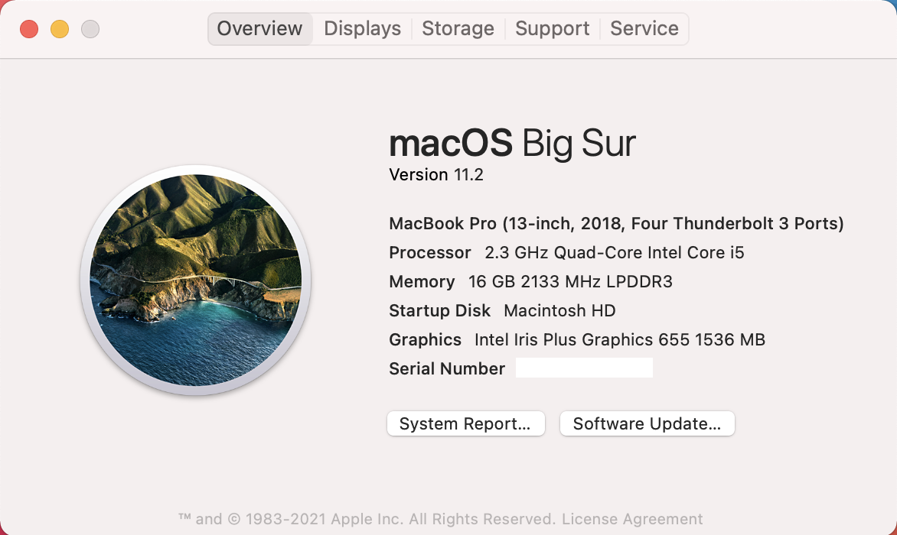

# <a name="device-control-for-macos"></a>Gerätesteuerung für macOS

[!INCLUDE [Microsoft 365 Defender rebranding](../../includes/microsoft-defender.md)]

**Gilt für:**
- [Microsoft Defender für Endpunkt](https://go.microsoft.com/fwlink/p/?linkid=2154037)
- [Microsoft 365 Defender](https://go.microsoft.com/fwlink/?linkid=2118804)

> Möchten Sie Microsoft Defender for Endpoint erleben? [Registrieren Sie sich für eine kostenlose Testversion.](https://www.microsoft.com/microsoft-365/windows/microsoft-defender-atp?ocid=docs-wdatp-exposedapis-abovefoldlink)

[!include[Prerelease information](../../includes/prerelease.md)]

## <a name="requirements"></a>Anforderungen

Die Gerätesteuerung für macOS verfügt über die folgenden Voraussetzungen:

>[!div class="checklist"]
> - Microsoft Defender for Endpoint-Berechtigung (kann Testversion sein)
> - Minimale Betriebssystemversion: macOS 10.15.4 oder höher
> - Minimale Produktversion: 101.24.59
> - Ihr Gerät muss mit Systemerweiterungen ausgeführt werden (dies ist die Standardeinstellung unter macOS 11 Big Sur). 
> 
>   Sie können überprüfen, ob Ihr Gerät auf Systemerweiterungen ausgeführt wird, indem Sie den folgenden Befehl ausführen und überprüfen, ob es auf `endpoint_security_extension` der Konsole gedruckt wird: 
> 
>   ```bash
>   mdatp health --field real_time_protection_subsystem 
>   ```
> - Ihr Gerät muss sich im `Beta` (zuvor `InsiderFast` als ) Microsoft AutoUpdate-Updatekanal bezeichneten Kanal für Updates. Weitere Informationen finden Sie unter [Deploy updates for Microsoft Defender for Endpoint for Mac](mac-updates.md).
> 
>   Sie können den Updatekanal mithilfe des folgenden Befehls überprüfen: 
> 
>    ```bash
>    mdatp health --field release_ring 
>    ```
>
>    Wenn der obige Befehl weder gedruckt noch `Beta` `InsiderFast` gedruckt wird, führen Sie den folgenden Befehl aus dem Terminal aus. Das Kanalupdate wird das nächste Mal wirksam, wenn das Produkt gestartet wird (wenn das nächste Produktupdate installiert ist oder das Gerät neu gestartet wird). 
> 
>    ```bash
>    defaults write com.microsoft.autoupdate2 ChannelName -string Beta
>    ```
>
>    Alternativ können Sie den Updatekanal remote konfigurieren, wenn Sie sich in einer verwalteten Umgebung (JAMF oder Intune) befinden. Weitere Informationen finden Sie unter [Deploy updates for Microsoft Defender for Endpoint for Mac](mac-updates.md). 

## <a name="device-control-policy"></a>Gerätesteuerungsrichtlinie

Zum Konfigurieren der Gerätesteuerung für macOS müssen Sie eine Richtlinie erstellen, in der die Einschränkungen beschrieben werden, die Sie in Ihrer Organisation setzen möchten.

Die Gerätesteuerungsrichtlinie ist im Konfigurationsprofil enthalten, das zum Konfigurieren aller anderen Produkteinstellungen verwendet wird. Weitere Informationen finden Sie unter [Konfigurationsprofilstruktur](mac-preferences.md#configuration-profile-structure).

Innerhalb des Konfigurationsprofils wird die Gerätesteuerungsrichtlinie im folgenden Abschnitt definiert:

|||
|:---|:---|
| **Domäne** | `com.microsoft.wdav` |
| **Schlüssel** | deviceControl |
| **Datentyp** | Wörterbuch (geschachtelte Einstellung) |
| **Comments** | Eine Beschreibung der Wörterbuchinhalte finden Sie in den folgenden Abschnitten. |

Die Gerätesteuerungsrichtlinie kann verwendet werden, um:

- [Anpassen des URL-Ziels für Benachrichtigungen, die vom Gerätesteuerelement ausgelöst werden](#customize-url-target-for-notifications-raised-by-device-control)
- [Zulassen oder Blockieren von Wechselmedien](#allow-or-block-removable-devices)

### <a name="customize-url-target-for-notifications-raised-by-device-control"></a>Anpassen des URL-Ziels für Benachrichtigungen, die vom Gerätesteuerelement ausgelöst werden

Wenn die von Ihnen installierte Gerätesteuerungsrichtlinie auf einem Gerät erzwungen wird (z. B. der Zugriff auf ein Wechselmediengerät ist eingeschränkt), wird dem Benutzer eine Benachrichtigung angezeigt.


Wenn Endbenutzer auf diese Benachrichtigung klicken, wird im Standardbrowser eine Webseite geöffnet. Sie können die URL konfigurieren, die geöffnet wird, wenn Endbenutzer auf die Benachrichtigung klicken.

|||
|:---|:---|
| **Domäne** | `com.microsoft.wdav` |
| **Schlüssel** | navigationTarget |
| **Datentyp** | String |
| **Comments** | Wenn das Produkt nicht definiert ist, verwendet es eine Standard-URL, die auf eine generische Seite verweist, auf der die vom Produkt ergriffene Aktion erläutert wird. |

### <a name="allow-or-block-removable-devices"></a>Zulassen oder Blockieren von Wechselmedien

Der Abschnitt Wechselmedien der Gerätesteuerungsrichtlinie wird verwendet, um den Zugriff auf Wechselmedien einzuschränken. 

> [!NOTE]
> Die folgenden Arten von Wechselmedien werden derzeit unterstützt und können in der Richtlinie enthalten sein: USB-Speichergeräte.

|||
|:---|:---|
| **Domäne** | `com.microsoft.wdav` |
| **Schlüssel** | removableMediaPolicy |
| **Datentyp** | Wörterbuch (geschachtelte Einstellung) |
| **Comments** | Eine Beschreibung der Wörterbuchinhalte finden Sie in den folgenden Abschnitten. |

Dieser Abschnitt der Richtlinie ist hierarchisch, ermöglicht maximale Flexibilität und deckt eine Vielzahl von Verwendungsfällen ab. Auf der obersten Ebene sind Lieferanten, die durch eine Anbieter-ID identifiziert werden. Für jeden Anbieter gibt es Produkte, die durch eine Produkt-ID identifiziert werden. Schließlich gibt es für jedes Produkt Seriennummern, die bestimmte Geräte enthalten.

```
|-- policy top level 
    |-- vendor 1 
        |-- product 1 
            |-- serial number 1 
            ...
            |-- serial number N 
        ...
        |-- product N 
    ...
    |-- vendor N
```

Informationen zum Suchen der Gerätebezeichner finden Sie unter [Look up device identifiers](#look-up-device-identifiers).

Die Richtlinie wird vom spezifischen Eintrag bis zum allgemeinsten ausgewertet. Wenn ein Gerät angeschlossen ist, versucht das Produkt, die spezifischeste Übereinstimmung in der Richtlinie für jedes Wechselmediengerät zu finden und die Berechtigungen auf dieser Ebene anzuwenden. Wenn keine Übereinstimmung vor liegt, wird die nächste optimale Übereinstimmung angewendet, bis zur berechtigung, die auf der obersten Ebene angegeben ist. Dies ist die Standardeinstellung, wenn ein Gerät keinem anderen Eintrag in der Richtlinie zu entsprechen hat.

#### <a name="policy-enforcement-level"></a>Durchsetzungsebene für Richtlinien

Im Abschnitt Wechselmedien gibt es eine Option zum Festlegen der Erzwingungsstufe, die einen der folgenden Werte verwenden kann:

- `audit` – Wenn unter dieser Erzwingungsstufe der Zugriff auf ein Gerät eingeschränkt ist, wird dem Benutzer eine Benachrichtigung angezeigt, das Gerät kann jedoch weiterhin verwendet werden. Diese Erzwingungsstufe kann hilfreich sein, um die Effektivität einer Richtlinie zu bewerten.
- `block` – Unter dieser Erzwingungsstufe sind die Vorgänge, die der Benutzer auf dem Gerät ausführen kann, auf das beschränkt, was in der Richtlinie definiert ist. Darüber hinaus wird eine Benachrichtigung an den Benutzer ausgelöst. 

|||
|:---|:---|
| **Domäne** | `com.microsoft.wdav` |
| **Schlüssel** | enforcementLevel |
| **Datentyp** | String |
| **Mögliche Werte** | Überwachung (Standard) <br/> block |

#### <a name="default-permission-level"></a>Standardberechtigungsstufe

Auf der obersten Ebene des Abschnitts Wechselmedien können Sie die Standardberechtigungsstufe für Geräte konfigurieren, die nicht mit anderen Richtlinien übereinstimmen.

Diese Einstellung kann auf festgelegt werden:

- `none` – Es können keine Vorgänge auf dem Gerät ausgeführt werden
- Eine Kombination der folgenden Werte:
    - `read` - Lesevorgänge sind auf dem Gerät zulässig
    - `write` - Schreibvorgänge sind auf dem Gerät zulässig
    - `execute` - Ausführungsvorgänge sind auf dem Gerät zulässig

> [!NOTE]
> Wenn `none` die Berechtigungsstufe vorhanden ist, werden alle anderen Berechtigungen ( `read` , oder ) `write` `execute` ignoriert.

> [!NOTE]
> Die `execute` Berechtigung bezieht sich nur auf die Ausführung von Mach-O-Binärdateien. Die Ausführung von Skripts oder anderen Nutzlasttypen ist nicht enthalten.

|||
|:---|:---|
| **Domäne** | `com.microsoft.wdav` |
| **Schlüssel** | permission |
| **Datentyp** | Array aus Zeichenfolgen |
| **Mögliche Werte** | keine <br/> Lesen <br/> Schreiben <br/> execute |

#### <a name="restrict-removable-media-by-vendor-product-and-serial-number"></a>Einschränken von Wechselmedien nach Hersteller, Produkt und Seriennummer

Wie unter [Wechselmedien](#allow-or-block-removable-devices)zulassen oder blockieren beschrieben, können Wechselmedien wie z. B. USB-Geräte anhand der Hersteller-ID, produkt-ID und Seriennummer identifiziert werden.

Auf der obersten Ebene der Richtlinie für Wechselmedien können Sie optional detailliertere Einschränkungen auf Anbieterebene definieren. 

Das `vendors` Wörterbuch enthält einen oder mehrere Einträge, bei dem jeder Eintrag durch die Anbieter-ID identifiziert wird.

|||
|:---|:---|
| **Domäne** | `com.microsoft.wdav` |
| **Schlüssel** | Anbieter |
| **Datentyp** | Wörterbuch (geschachtelte Einstellung) |

Für jeden Anbieter können Sie die gewünschte Berechtigungsstufe für Geräte von diesem Anbieter angeben.

|||
|:---|:---|
| **Domäne** | `com.microsoft.wdav` |
| **Schlüssel** | permission |
| **Datentyp** | Array aus Zeichenfolgen |
| **Mögliche Werte** | Identisch mit [Standardberechtigungsstufe](#default-permission-level) |

Darüber hinaus können Sie optional den Satz von Produkten angeben, die zu diesem Anbieter gehören, für die detailliertere Berechtigungen definiert sind. Das `products` Wörterbuch enthält einen oder mehrere Einträge, bei dem jeder Eintrag durch die Produkt-ID identifiziert wird. 

|||
|:---|:---|
| **Domäne** | `com.microsoft.wdav` |
| **Schlüssel** | produkte |
| **Datentyp** | Wörterbuch (geschachtelte Einstellung) |

Für jedes Produkt können Sie die gewünschte Berechtigungsstufe für dieses Produkt angeben.

|||
|:---|:---|
| **Domäne** | `com.microsoft.wdav` |
| **Schlüssel** | permission |
| **Datentyp** | Array aus Zeichenfolgen |
| **Mögliche Werte** | Identisch mit [Standardberechtigungsstufe](#default-permission-level) |

Darüber hinaus können Sie einen optionalen Satz von Seriennummern angeben, für die präzisere Berechtigungen definiert sind.

Das `serialNumbers` Wörterbuch enthält einen oder mehrere Einträge, bei dem jeder Eintrag durch die Seriennummer identifiziert wird.

|||
|:---|:---|
| **Domäne** | `com.microsoft.wdav` |
| **Schlüssel** | serialNumbers |
| **Datentyp** | Wörterbuch (geschachtelte Einstellung) |

Für jede Seriennummer können Sie die gewünschte Berechtigungsstufe angeben.

|||
|:---|:---|
| **Domäne** | `com.microsoft.wdav` |
| **Schlüssel** | permission |
| **Datentyp** | Array aus Zeichenfolgen |
| **Mögliche Werte** | Identisch mit [Standardberechtigungsstufe](#default-permission-level) |

#### <a name="example-device-control-policy"></a>Beispiel für Eine Gerätesteuerungsrichtlinie

Das folgende Beispiel zeigt, wie alle oben genannten Konzepte in einer Gerätesteuerungsrichtlinie kombiniert werden können. Beachten Sie im folgenden Beispiel den hierarchischen Charakter der Wechselmedienrichtlinie.

```xml
<?xml version="1.0" encoding="UTF-8"?> 
<!DOCTYPE plist PUBLIC "-//Apple//DTD PLIST 1.0//EN" "http://www.apple.com/DTDs/PropertyList-1.0.dtd"> 
<plist version="1.0"> 
<dict> 
    <key>deviceControl</key> 
    <dict> 
        <key>navigationTarget</key> 
        <string>[custom URL for notifications]</string> 
        <key>removableMediaPolicy</key> 
        <dict> 
            <key>enforcementLevel</key> 
            <string>[enforcement level]</string> <!-- audit / block --> 
            <key>permission</key> 
            <array> 
                <string>[permission]</string> <!-- none / read / write / execute --> 
                <!-- other permissions -->
            </array> 
            <key>vendors</key> 
            <dict> 
                <key>[vendor id]</key> 
                <dict>
                    <key>permission</key> 
                    <array> 
                        <string>[permission]</string> <!-- none / read / write / execute --> 
                        <!-- other permissions -->
                    </array> 
                    <key>products</key> 
                    <dict> 
                        <key>[product id]</key> 
                        <dict> 
                            <key>permission</key> 
                            <array> 
                                <string>[permission]</string> <!-- none / read / write / execute --> 
                                <!-- other permissions -->
                            </array> 
                            <key>serialNumbers</key> 
                            <dict> 
                                <key>[serial-number]</key> 
                                <array> 
                                    <string>[permission]</string> <!-- none / read / write / execute --> 
                                    <!-- other permissions -->
                                </array> 
                                <!-- other serial numbers --> 
                            </dict> 
                        </dict> 
                        <!-- other products --> 
                    </dict> 
                </dict> 
                <!-- other vendors --> 
            </dict> 
        </dict> 
    </dict> 
</dict> 
</plist> 
```

In den folgenden Dokumenten sind weitere Beispiele für Gerätesteuerungsrichtlinien enthalten:

- [Beispiele für Gerätesteuerungsrichtlinien für Intune](mac-device-control-intune.md)
- [Beispiele für Gerätesteuerungsrichtlinien für JAMF](mac-device-control-jamf.md)

#### <a name="look-up-device-identifiers"></a>Suchen nach Gerätebezeichnern

So suchen Sie die Hersteller-ID, Produkt-ID und Seriennummer eines USB-Geräts:

1. Melden Sie sich bei einem Mac-Gerät an.
1. Schließen Sie das USB-Gerät an, für das Sie die Bezeichner suchen möchten.
1. Wählen Sie im Menü der obersten Ebene von macOS **Informationen zu diesem Mac aus.**

    

1. Wählen Sie **Systembericht aus.**

    

1. Wählen Sie in der linken Spalte **USB aus.**

    

1. Navigieren **Sie unter USB-Gerätestruktur** zu dem ANGESCHLOSSENen USB-Gerät.

    

1. Die Hersteller-ID, die Produkt-ID und die Seriennummer werden angezeigt. Wenn Sie der Wechselmedienrichtlinie die Hersteller-ID und die Produkt-ID hinzufügen, müssen Sie den Teil nur nach `0x` hinzufügen. In der folgenden Abbildung ist beispielsweise die Hersteller-ID und `1000` die Produkt-ID `090c` .

#### <a name="discover-usb-devices-in-your-organization"></a>Entdecken von USB-Geräten in Ihrer Organisation

Sie können Bereitstellungs-, Unmount- und Volumenänderungsereignisse anzeigen, die von USB-Geräten in Microsoft Defender for Endpoint advanced hunting stammen. Diese Ereignisse können hilfreich sein, um verdächtige Nutzungsaktivitäten zu identifizieren oder interne Untersuchungen durchzuführen.

```
DeviceEvents 
    | where ActionType == "UsbDriveMount" or ActionType == "UsbDriveUnmount" or ActionType == "UsbDriveDriveLetterChanged"
    | where DeviceId == "<device ID>"
```

## <a name="device-control-policy-deployment"></a>Bereitstellung von Gerätesteuerungsrichtlinien

Die Gerätesteuerungsrichtlinie muss neben den anderen Produkteinstellungen enthalten sein, wie unter Festlegen von Einstellungen für [Microsoft Defender für Endpoint für Mac beschrieben.](mac-preferences.md)

Dieses Profil kann mithilfe der Unter Konfigurationsprofilbereitstellung aufgeführten [Anweisungen bereitgestellt werden.](mac-preferences.md#configuration-profile-deployment)

## <a name="troubleshooting-tips"></a>Tipps zur Problembehandlung

Nachdem Sie das Konfigurationsprofil über Intune oder JAMF geschubst haben, können Sie überprüfen, ob es vom Produkt erfolgreich aufgenommen wurde, indem Sie den folgenden Befehl über das Terminal ausführen:

```bash
mdatp device-control removable-media policy list
```

Mit diesem Befehl wird die vom Produkt verwendete Gerätesteuerungsrichtlinie in der Standardausgabe gedruckt. Stellen Sie für den Fall, dass dies gedruckt wird, sicher, dass (a) das Konfigurationsprofil tatsächlich von der Verwaltungskonsole an Ihr Gerät übertragen wurde, und (b) es sich um eine gültige Gerätesteuerungsrichtlinie handelt, wie in diesem Dokument `Policy is empty` beschrieben.

Auf einem Gerät, auf dem die Richtlinie erfolgreich zugestellt wurde und auf dem mindestens ein Gerät angeschlossen ist, können Sie den folgenden Befehl ausführen, um alle Geräte und die auf sie angewendeten effektiven Berechtigungen auflisten.

```bash
mdatp device-control removable-media devices list
```

Beispielausgabe:

```Output
.Device(s)
|-o Name: Untitled 1, Permission ["read", "execute"]
| |-o Vendor: General "fff0"
| |-o Product: USB Flash Disk "1000"
| |-o Serial number: "04ZSSMHI2O7WBVOA"
| |-o Mount point: "/Volumes/TESTUSB"
```

Im obigen Beispiel ist nur ein Wechselmediengerät angeschlossen, und es verfügt über berechtigungen gemäß der Gerätesteuerungsrichtlinie, die an `read` `execute` das Gerät übermittelt wurde.

## <a name="related-topics"></a>Verwandte Themen

- [Beispiele für Gerätesteuerungsrichtlinien für Intune](mac-device-control-intune.md)
- [Beispiele für Gerätesteuerungsrichtlinien für JAMF](mac-device-control-jamf.md)