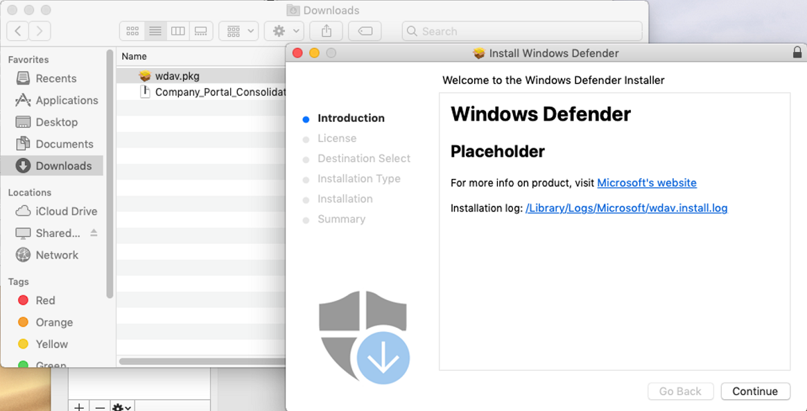
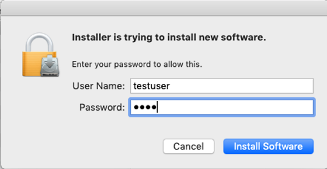

# <a name="manual-deployment-for-microsoft-defender-for-endpoint-on-macos"></a><span data-ttu-id="453a4-104">Manuelle Bereitstellung von Microsoft Defender für Endpunkt auf macOS</span><span class="sxs-lookup"><span data-stu-id="453a4-104">Manual deployment for Microsoft Defender for Endpoint on macOS</span></span>

[!INCLUDE [Microsoft 365 Defender rebranding](../../includes/microsoft-defender.md)]

<span data-ttu-id="453a4-105">**Gilt für:**</span><span class="sxs-lookup"><span data-stu-id="453a4-105">**Applies to:**</span></span>
- [<span data-ttu-id="453a4-106">Microsoft Defender für Endpunkt</span><span class="sxs-lookup"><span data-stu-id="453a4-106">Microsoft Defender for Endpoint</span></span>](https://go.microsoft.com/fwlink/p/?linkid=2154037)
- [<span data-ttu-id="453a4-107">Microsoft 365 Defender</span><span class="sxs-lookup"><span data-stu-id="453a4-107">Microsoft 365 Defender</span></span>](https://go.microsoft.com/fwlink/?linkid=2118804)

> <span data-ttu-id="453a4-108">Möchten Sie Defender für Endpunkt erfahren?</span><span class="sxs-lookup"><span data-stu-id="453a4-108">Want to experience Defender for Endpoint?</span></span> [<span data-ttu-id="453a4-109">Registrieren Sie sich für eine kostenlose Testversion</span><span class="sxs-lookup"><span data-stu-id="453a4-109">Sign up for a free trial.</span></span>](https://www.microsoft.com/microsoft-365/windows/microsoft-defender-atp?ocid=docs-wdatp-investigateip-abovefoldlink)

<span data-ttu-id="453a4-110">Dieses Thema beschreibt, wie Sie Microsoft Defender für Endpunkt auf macOS manuell bereitstellen.</span><span class="sxs-lookup"><span data-stu-id="453a4-110">This topic describes how to deploy Microsoft Defender for Endpoint on macOS manually.</span></span> <span data-ttu-id="453a4-111">Für eine erfolgreiche Bereitstellung müssen alle folgenden Schritte abgeschlossen sein:</span><span class="sxs-lookup"><span data-stu-id="453a4-111">A successful deployment requires the completion of all of the following steps:</span></span>
- [<span data-ttu-id="453a4-112">Herunterladen der Installations- und Onboarding-Pakete</span><span class="sxs-lookup"><span data-stu-id="453a4-112">Download installation and onboarding packages</span></span>](#download-installation-and-onboarding-packages)
- [<span data-ttu-id="453a4-113">Anwendungsinstallation (macOS 10.15 und ältere Versionen)</span><span class="sxs-lookup"><span data-stu-id="453a4-113">Application installation (macOS 10.15 and older versions)</span></span>](#application-installation-macos-1015-and-older-versions)
- [<span data-ttu-id="453a4-114">Anwendungsinstallation (macOS 11 und neuere Versionen)</span><span class="sxs-lookup"><span data-stu-id="453a4-114">Application installation (macOS 11 and newer versions)</span></span>](#application-installation-macos-11-and-newer-versions)
- [<span data-ttu-id="453a4-115">Clientkonfiguration</span><span class="sxs-lookup"><span data-stu-id="453a4-115">Client configuration</span></span>](#client-configuration)

## <a name="prerequisites-and-system-requirements"></a><span data-ttu-id="453a4-116">Voraussetzungen und Systemanforderungen</span><span class="sxs-lookup"><span data-stu-id="453a4-116">Prerequisites and system requirements</span></span>

<span data-ttu-id="453a4-117">Beachten Sie vor dem Start [die Hauptseite „Microsoft Defender für Endpunkt auf macOS“](microsoft-defender-endpoint-mac.md) für eine Beschreibung der Voraussetzungen und Systemanforderungen für die aktuelle Softwareversion.</span><span class="sxs-lookup"><span data-stu-id="453a4-117">Before you get started, see [the main Microsoft Defender for Endpoint on macOS page](microsoft-defender-endpoint-mac.md) for a description of prerequisites and system requirements for the current software version.</span></span>

## <a name="download-installation-and-onboarding-packages"></a><span data-ttu-id="453a4-118">Herunterladen der Installations- und Onboarding-Pakete</span><span class="sxs-lookup"><span data-stu-id="453a4-118">Download installation and onboarding packages</span></span>

<span data-ttu-id="453a4-119">Laden Sie die Installations- und Onboarding-Pakete vom Microsoft Defender Security Center herunter:</span><span class="sxs-lookup"><span data-stu-id="453a4-119">Download the installation and onboarding packages from Microsoft Defender Security Center:</span></span>

1. <span data-ttu-id="453a4-120">Gehen Sie im Microsoft Defender Security Center zu **Einstellungen > Geräteverwaltung > Onboarding**.</span><span class="sxs-lookup"><span data-stu-id="453a4-120">In Microsoft Defender Security Center, go to **Settings > Device Management > Onboarding**.</span></span>
2. <span data-ttu-id="453a4-121">Legen Sie das Betriebssystem im Abschnitt 1 der Seite auf **macOS** fest, und die Bereitstellungsmethode auf **Lokales Skript**.</span><span class="sxs-lookup"><span data-stu-id="453a4-121">In Section 1 of the page, set operating system to **macOS** and Deployment method to **Local script**.</span></span>
3. <span data-ttu-id="453a4-122">Wählen Sie im Abschnitt 2 der Seite die Option **Installationspaket herunterladen**.</span><span class="sxs-lookup"><span data-stu-id="453a4-122">In Section 2 of the page, select **Download installation package**.</span></span> <span data-ttu-id="453a4-123">Speichern Sie es in einem lokalen Verzeichnis unter „wdav.pkg“.</span><span class="sxs-lookup"><span data-stu-id="453a4-123">Save it as wdav.pkg to a local directory.</span></span>
4. <span data-ttu-id="453a4-124">Wählen Sie im Abschnitt 2 der Seite die Option **Onboarding-Paket herunterladen**.</span><span class="sxs-lookup"><span data-stu-id="453a4-124">In Section 2 of the page, select **Download onboarding package**.</span></span> <span data-ttu-id="453a4-125">Speichern Sie es im gleichen Verzeichnis als „WindowsDefenderATPOnboardingPackage.zip“.</span><span class="sxs-lookup"><span data-stu-id="453a4-125">Save it as WindowsDefenderATPOnboardingPackage.zip to the same directory.</span></span>

    

5. <span data-ttu-id="453a4-127">Bestätigen Sie in einer Eingabeaufforderung, dass Sie die zwei Dateien besitzen.</span><span class="sxs-lookup"><span data-stu-id="453a4-127">From a command prompt, verify that you have the two files.</span></span>
    
## <a name="application-installation-macos-1015-and-older-versions"></a><span data-ttu-id="453a4-128">Anwendungsinstallation (macOS 10.15 und ältere Versionen)</span><span class="sxs-lookup"><span data-stu-id="453a4-128">Application installation (macOS 10.15 and older versions)</span></span>

<span data-ttu-id="453a4-129">Um den Prozess abzuschließen, benötigen Sie Administratorberechtigungen auf dem Gerät.</span><span class="sxs-lookup"><span data-stu-id="453a4-129">To complete this process, you must have admin privileges on the device.</span></span>

1. <span data-ttu-id="453a4-130">Navigieren Sie in „Finder“ zur heruntergeladenen Datei „wdav.pkg“ und öffnen Sie diese.</span><span class="sxs-lookup"><span data-stu-id="453a4-130">Navigate to the downloaded wdav.pkg in Finder and open it.</span></span>

    

2. <span data-ttu-id="453a4-132">Wählen Sie **Fortfahren** aus, stimmen Sie den Lizenzbedingungen zu, und geben Sie das Kennwort ein, wenn Sie aufgefordert werden.</span><span class="sxs-lookup"><span data-stu-id="453a4-132">Select **Continue**, agree with the License terms, and enter the password when prompted.</span></span>

    

   > [!IMPORTANT]
   > <span data-ttu-id="453a4-134">Sie werden aufgefordert, der Installation eines Treibers von Microsoft zuzustimmen (entweder „Systemerweiterung blockiert“ oder „Installation ist am Warten“ oder beides.</span><span class="sxs-lookup"><span data-stu-id="453a4-134">You will be prompted to allow a driver from Microsoft to be installed (either "System Extension Blocked" or "Installation is on hold" or both.</span></span> <span data-ttu-id="453a4-135">Die Installation des Treibers muss erlaubt werden.</span><span class="sxs-lookup"><span data-stu-id="453a4-135">The driver must be allowed to be installed.</span></span>

   

3. <span data-ttu-id="453a4-137">Wählen Sie **Sicherheitseinstellungen öffnen** oder **Sicherheitseinstellungen öffnen > Sicherheit & Datenschutz** aus.</span><span class="sxs-lookup"><span data-stu-id="453a4-137">Select **Open Security Preferences** or **Open System Preferences > Security & Privacy**.</span></span> <span data-ttu-id="453a4-138">Wählen Sie **Zulassen** aus:</span><span class="sxs-lookup"><span data-stu-id="453a4-138">Select **Allow**:</span></span>

    

   <span data-ttu-id="453a4-140">Der Installationsvorgang wird fortgesetzt.</span><span class="sxs-lookup"><span data-stu-id="453a4-140">The installation proceeds.</span></span>

   > [!CAUTION]
   > <span data-ttu-id="453a4-141">Wenn Sie **Zulassen** nicht auswählen, wird die Installation nach 5 Minuten fortgesetzt.</span><span class="sxs-lookup"><span data-stu-id="453a4-141">If you don't select **Allow**, the installation will proceed after 5 minutes.</span></span> <span data-ttu-id="453a4-142">Microsoft Defender für Endpunkt wird geladen, aber einige Features, beispielsweise der Echtzeitschutz, werden deaktiviert sein.</span><span class="sxs-lookup"><span data-stu-id="453a4-142">Microsoft Defender for Endpoint will be loaded, but some features, such as real-time protection, will be disabled.</span></span> <span data-ttu-id="453a4-143">Weitere Informationen zur Behebung dieses Problems finden Sie unter [Problembehandlung von Kernel-Erweiterungsproblemen](mac-support-kext.md).</span><span class="sxs-lookup"><span data-stu-id="453a4-143">See [Troubleshoot kernel extension issues](mac-support-kext.md) for information on how to resolve this.</span></span>

> [!NOTE]
> <span data-ttu-id="453a4-144">MacOS kann bei der ersten Installation von Microsoft Defender für Endpunkt einen Neustart des Geräts anfordern.</span><span class="sxs-lookup"><span data-stu-id="453a4-144">macOS may request to reboot the device upon the first installation of Microsoft Defender for Endpoint.</span></span> <span data-ttu-id="453a4-145">Der Echtzeitschutz wird nicht verfügbar sein, bis das Gerät neu gestartet wurde.</span><span class="sxs-lookup"><span data-stu-id="453a4-145">Real-time protection will not be available until the device is rebooted.</span></span>

## <a name="application-installation-macos-11-and-newer-versions"></a><span data-ttu-id="453a4-146">Anwendungsinstallation (macOS 11 und neuere Versionen)</span><span class="sxs-lookup"><span data-stu-id="453a4-146">Application installation (macOS 11 and newer versions)</span></span>

<span data-ttu-id="453a4-147">Um den Prozess abzuschließen, benötigen Sie Administratorberechtigungen auf dem Gerät.</span><span class="sxs-lookup"><span data-stu-id="453a4-147">To complete this process, you must have admin privileges on the device.</span></span>

1. <span data-ttu-id="453a4-148">Navigieren Sie in „Finder“ zur heruntergeladenen Datei „wdav.pkg“ und öffnen Sie diese.</span><span class="sxs-lookup"><span data-stu-id="453a4-148">Navigate to the downloaded wdav.pkg in Finder and open it.</span></span>

    

2. <span data-ttu-id="453a4-150">Wählen Sie **Fortfahren** aus, stimmen Sie den Lizenzbedingungen zu, und geben Sie das Kennwort ein, wenn Sie aufgefordert werden.</span><span class="sxs-lookup"><span data-stu-id="453a4-150">Select **Continue**, agree with the License terms, and enter the password when prompted.</span></span>

3. <span data-ttu-id="453a4-151">Am Ende des Installationsvorgangs werden Sie aufgefordert, die vom Produkt verwendeten Systemerweiterungen zu genehmigen.</span><span class="sxs-lookup"><span data-stu-id="453a4-151">At the end of the installation process, you'll be promoted to approve the system extensions used by the product.</span></span> <span data-ttu-id="453a4-152">Wählen Sie **Sicherheitseinstellungen öffnen** aus.</span><span class="sxs-lookup"><span data-stu-id="453a4-152">Select **Open Security Preferences**.</span></span>

    

4. <span data-ttu-id="453a4-154">Wählen Sie im Fenster **Sicherheit & Datenschutz** die Option **Zulassen** aus.</span><span class="sxs-lookup"><span data-stu-id="453a4-154">From the **Security & Privacy** window, select **Allow**.</span></span>

    

5. <span data-ttu-id="453a4-156">Wiederholen Sie die Schritte 3 & 4 für alle Systemerweiterungen, die mit Microsoft Defender für Endpunkt auf Mac geliefert wurden.</span><span class="sxs-lookup"><span data-stu-id="453a4-156">Repeat steps 3 & 4 for all system extensions distributed with Microsoft Defender for Endpoint on Mac.</span></span>

6. <span data-ttu-id="453a4-157">Als Teil der Funktionen zur Endpunkterkennung und -reaktion untersucht Microsoft Defender für Endpunkt auf Mac den Socket-Datenverkehr und meldet diese Informationen an das Microsoft Defender Security Center-Portal.</span><span class="sxs-lookup"><span data-stu-id="453a4-157">As part of the Endpoint Detection and Response capabilities, Microsoft Defender for Endpoint on Mac inspects socket traffic and reports this information to the Microsoft Defender Security Center portal.</span></span> <span data-ttu-id="453a4-158">Wenn Sie aufgefordert werden, Microsoft Defender für Endpunkt die Berechtigungen für das Filtern des Netzwerkdatenverkehrs zu gewähren, wählen Sie **Zulassen** aus.</span><span class="sxs-lookup"><span data-stu-id="453a4-158">When prompted to grant Microsoft Defender for Endpoint permissions to filter network traffic, select **Allow**.</span></span>

    

7. <span data-ttu-id="453a4-160">Öffnen Sie **Systemeinstellungen** > **Sicherheit & Datenschutz** und navigieren Sie zur Registerkarte **Datenschutz**. Gewähren Sie die Berechtigung **Vollständiger Disk-Zugriff** für **Microsoft Defender ATP** und **Microsoft Defender ATP Endpunkt-Sicherheitserweiterung**.</span><span class="sxs-lookup"><span data-stu-id="453a4-160">Open **System Preferences** > **Security & Privacy** and navigate to the **Privacy** tab. Grant **Full Disk Access** permission to **Microsoft Defender ATP** and **Microsoft Defender ATP Endpoint Security Extension**.</span></span>

    

## <a name="client-configuration"></a><span data-ttu-id="453a4-162">Clientkonfiguration</span><span class="sxs-lookup"><span data-stu-id="453a4-162">Client configuration</span></span>

1. <span data-ttu-id="453a4-163">Kopieren Sie die Dateien „wdav.pkg“ und „MicrosoftDefenderATPOnboardingMacOs.py“ auf das Gerät, auf dem Sie Microsoft Defender für Endpunkt auf macOS bereitstellen.</span><span class="sxs-lookup"><span data-stu-id="453a4-163">Copy wdav.pkg and MicrosoftDefenderATPOnboardingMacOs.py to the device where you deploy Microsoft Defender for Endpoint on macOS.</span></span>

    <span data-ttu-id="453a4-164">Das Clientgerät ist nicht mit org_id verbunden.</span><span class="sxs-lookup"><span data-stu-id="453a4-164">The client device isn't associated with org_id.</span></span> <span data-ttu-id="453a4-165">Beachten Sie, dass das *org_id*-Attribut nur Leerzeichen enthält.</span><span class="sxs-lookup"><span data-stu-id="453a4-165">Note that the *org_id* attribute is blank.</span></span>

    ```bash
    mdatp health --field org_id
    ```

2. <span data-ttu-id="453a4-166">Führen Sie das Python-Skript aus, um die Konfigurationsdatei zu installieren:</span><span class="sxs-lookup"><span data-stu-id="453a4-166">Run the Python script to install the configuration file:</span></span>

    ```bash
    /usr/bin/python MicrosoftDefenderATPOnboardingMacOs.py
    ```

3. <span data-ttu-id="453a4-167">Bestätigen Sie, dass das Gerät jetzt mit Ihrer Organisation verbunden ist und eine gültige Organisations-ID meldet:</span><span class="sxs-lookup"><span data-stu-id="453a4-167">Verify that the device is now associated with your organization and reports a valid org ID:</span></span>

    ```bash
    mdatp health --field org_id
    ```

    <span data-ttu-id="453a4-168">Nach der Installation sehen Sie das Symbol von Microsoft Defender auf der Statusleiste von macOS in der oberen rechten Ecke.</span><span class="sxs-lookup"><span data-stu-id="453a4-168">After installation, you'll see the Microsoft Defender icon in the macOS status bar in the top-right corner.</span></span>
    
    > [!div class="mx-imgBorder"]
    > <span data-ttu-id="453a4-169"></span><span class="sxs-lookup"><span data-stu-id="453a4-169"></span></span>


## <a name="how-to-allow-full-disk-access"></a><span data-ttu-id="453a4-170">So erlauben Sie den vollständigen Disk-Zugriff</span><span class="sxs-lookup"><span data-stu-id="453a4-170">How to Allow Full Disk Access</span></span>

> [!CAUTION]
> <span data-ttu-id="453a4-171">macOS 10.15 (Catalina) enthält neue Sicherheits- und Datenschutzerweiterungen.</span><span class="sxs-lookup"><span data-stu-id="453a4-171">macOS 10.15 (Catalina) contains new security and privacy enhancements.</span></span> <span data-ttu-id="453a4-172">Ab dieser Version sind Anwendungen standardmäßig nicht in der Lage, ohne ausdrückliche Zustimmung auf bestimmte Speicherorte auf dem Disk zuzugreifen (wie Dokumente, Downloads, Desktop usw.).</span><span class="sxs-lookup"><span data-stu-id="453a4-172">Beginning with this version, by default, applications are not able to access certain locations on disk (such as Documents, Downloads, Desktop, etc.) without explicit consent.</span></span> <span data-ttu-id="453a4-173">Wenn diese Zustimmung nicht vorhanden ist, kann Microsoft Defender für Endpunkt Ihr Gerät nicht vollständig schützen.</span><span class="sxs-lookup"><span data-stu-id="453a4-173">In the absence of this consent, Microsoft Defender for Endpoint is not able to fully protect your device.</span></span>

1. <span data-ttu-id="453a4-174">Um die Zustimmung zu gewähren, öffnen Sie **Systemeinstellungen** > **Sicherheit & Datenschutz** > **Datenschutz** > **Vollständiger Disk-Zugriff**.</span><span class="sxs-lookup"><span data-stu-id="453a4-174">To grant consent, open **System Preferences** > **Security & Privacy** > **Privacy** > **Full Disk Access**.</span></span> <span data-ttu-id="453a4-175">Klicken Sie auf das Schlosssymbol, um die Änderungen vorzunehmen (unten im Dialogfeld).</span><span class="sxs-lookup"><span data-stu-id="453a4-175">Click the lock icon to make changes (bottom of the dialog box).</span></span> <span data-ttu-id="453a4-176">Wählen Sie Microsoft Defender für Endpunkt aus.</span><span class="sxs-lookup"><span data-stu-id="453a4-176">Select Microsoft Defender for Endpoint.</span></span>

2. <span data-ttu-id="453a4-177">Führen Sie einen AV-Erkennungstest durch, um zu überprüfen, ob das Gerät ordnungsgemäß eingebunden ist und dem Dienst Bericht erstattet.</span><span class="sxs-lookup"><span data-stu-id="453a4-177">Run an AV detection test to verify that the device is properly onboarded and reporting to the service.</span></span> <span data-ttu-id="453a4-178">Führen Sie die folgenden Schritte auf dem neu eingebundenen Gerät durch:</span><span class="sxs-lookup"><span data-stu-id="453a4-178">Perform the following steps on the newly onboarded device:</span></span>

    1. <span data-ttu-id="453a4-179">Stellen Sie sicher, dass der Echtzeitschutz aktiviert ist (gekennzeichnet durch ein Ergebnis von 1 beim Ausführen des folgenden Befehls):</span><span class="sxs-lookup"><span data-stu-id="453a4-179">Ensure that real-time protection is enabled (denoted by a result of 1 from running the following command):</span></span>

        ```bash
        mdatp health --field real_time_protection_enabled
        ```

    1. <span data-ttu-id="453a4-180">Öffnen Sie ein Terminal-Fenster.</span><span class="sxs-lookup"><span data-stu-id="453a4-180">Open a Terminal window.</span></span> <span data-ttu-id="453a4-181">Kopieren Sie den folgenden Befehl und führen Sie ihn aus:</span><span class="sxs-lookup"><span data-stu-id="453a4-181">Copy and execute the following command:</span></span>

        ```bash
        curl -o ~/Downloads/eicar.com.txt https://www.eicar.org/download/eicar.com.txt
        ```

    1. <span data-ttu-id="453a4-182">Die Datei sollte von Defender für Endpunkt auf Mac in Quarantäne gestellt worden sein.</span><span class="sxs-lookup"><span data-stu-id="453a4-182">The file should have been quarantined by Defender for Endpoint on Mac.</span></span> <span data-ttu-id="453a4-183">Verwenden Sie den folgenden Befehl, um alle entdeckten Bedrohungen aufzulisten:</span><span class="sxs-lookup"><span data-stu-id="453a4-183">Use the following command to list all the detected threats:</span></span>

        ```bash
        mdatp threat list
        ```

3. <span data-ttu-id="453a4-184">Führen Sie einen EDR-Erkennungstest durch, um zu überprüfen, ob das Gerät ordnungsgemäß eingebunden ist und dem Dienst Bericht erstattet.</span><span class="sxs-lookup"><span data-stu-id="453a4-184">Run an EDR detection test to verify that the device is properly onboarded and reporting to the service.</span></span> <span data-ttu-id="453a4-185">Führen Sie die folgenden Schritte auf dem neu eingebundenen Gerät durch:</span><span class="sxs-lookup"><span data-stu-id="453a4-185">Perform the following steps on the newly onboarded device:</span></span>

   1. <span data-ttu-id="453a4-186">In Ihrem Browser wie z. B. Microsoft Edge für Mac oder Safari.</span><span class="sxs-lookup"><span data-stu-id="453a4-186">In your browser such as Microsoft Edge for Mac or Safari.</span></span>

   1. <span data-ttu-id="453a4-187">Laden Sie MDATP MacOS DIY.zip von https://aka.ms/mdatpmacosdiy herunter und extrahieren Sie die Daten.</span><span class="sxs-lookup"><span data-stu-id="453a4-187">Download MDATP MacOS DIY.zip from https://aka.ms/mdatpmacosdiy and extract.</span></span>

      <span data-ttu-id="453a4-188">Möglicherweise werden Sie aufgefordert:</span><span class="sxs-lookup"><span data-stu-id="453a4-188">You may be prompted:</span></span>

      > <span data-ttu-id="453a4-189">Wollen Sie Downloads auf „mdatpclientanalyzer.blob.core.windows.net“ zulassen?</span><span class="sxs-lookup"><span data-stu-id="453a4-189">Do you want to allow downloads on "mdatpclientanalyzer.blob.core.windows.net"?</span></span><br/>
      > <span data-ttu-id="453a4-190">Sie können unter „Websites-Einstellungen“ ändern, welche Websites Dateien herunterladen dürfen.</span><span class="sxs-lookup"><span data-stu-id="453a4-190">You can change which websites can download files in Websites Preferences.</span></span>

4. <span data-ttu-id="453a4-191">Klicken Sie auf **Zulassen**.</span><span class="sxs-lookup"><span data-stu-id="453a4-191">Click **Allow**.</span></span>

5. <span data-ttu-id="453a4-192">Öffnen Sie **Downloads**.</span><span class="sxs-lookup"><span data-stu-id="453a4-192">Open **Downloads**.</span></span>

6. <span data-ttu-id="453a4-193">Sie sollten **MDATP MacOS DIY** sehen.</span><span class="sxs-lookup"><span data-stu-id="453a4-193">You should see **MDATP MacOS DIY**.</span></span>

   > [!TIP]
   > <span data-ttu-id="453a4-194">Wenn Sie dies doppelklicken, erhalten Sie die folgende Nachricht:</span><span class="sxs-lookup"><span data-stu-id="453a4-194">If you double-click, you will get the following message:</span></span>
   > 
   > > <span data-ttu-id="453a4-195">**„MDATP MacOS DIY“ kann nicht geöffnet werden, da der Entwickler nicht verifiziert werden kann.**</span><span class="sxs-lookup"><span data-stu-id="453a4-195">**"MDATP MacOS DIY" cannot be opened because the developer cannot be verifier.**</span></span><br/>
   > > <span data-ttu-id="453a4-196">MacOS kann nicht bestätigen, dass diese App frei von Schadsoftware ist.</span><span class="sxs-lookup"><span data-stu-id="453a4-196">macOS cannot verify that this app is free from malware.</span></span><br/>
   > > <span data-ttu-id="453a4-197">**\[In den Papierkorb verschieben\]** **\[Abbrechen\]**</span><span class="sxs-lookup"><span data-stu-id="453a4-197">**\[Move to Trash\]** **\[Cancel\]**</span></span> 
  
7. <span data-ttu-id="453a4-198">Klicken Sie auf **Abbrechen**.</span><span class="sxs-lookup"><span data-stu-id="453a4-198">Click **Cancel**.</span></span>

8. <span data-ttu-id="453a4-199">Klicken Sie mit der rechten Maustaste auf **MDATP MacOS DIY**, und klicken Sie dann auf **Öffnen**.</span><span class="sxs-lookup"><span data-stu-id="453a4-199">Right-click **MDATP MacOS DIY**, and then click **Open**.</span></span> 

    <span data-ttu-id="453a4-200">Das System sollte die folgende Nachricht anzeigen:</span><span class="sxs-lookup"><span data-stu-id="453a4-200">The system should display the following message:</span></span>

    > <span data-ttu-id="453a4-201">**macOS kann den Entwickler von **MDATP MacOS DIY** nicht verifizieren. Sind Sie sicher, dass Sie die Datei öffnen wollen?**</span><span class="sxs-lookup"><span data-stu-id="453a4-201">**macOS cannot verify the developer of **MDATP MacOS DIY**. Are you sure you want to open it?**</span></span><br/>
    > <span data-ttu-id="453a4-202">Wenn Sie diese App öffnen, überschreiben Sie die Systemsicherheit, was dazu führen kann, dass Ihr Computer und Ihre persönlichen Daten Schadsoftware ausgesetzt sind, die Ihren Mac beschädigen oder Ihre Privatsphäre gefährden können.</span><span class="sxs-lookup"><span data-stu-id="453a4-202">By opening this app, you will be overriding system security which can expose your computer and personal information to malware that may harm your Mac or compromise your privacy.</span></span>

10. <span data-ttu-id="453a4-203">Klicken Sie auf **Öffnen**.</span><span class="sxs-lookup"><span data-stu-id="453a4-203">Click **Open**.</span></span>

    <span data-ttu-id="453a4-204">Das System sollte die folgende Nachricht anzeigen:</span><span class="sxs-lookup"><span data-stu-id="453a4-204">The system should display the following message:</span></span>

    > <span data-ttu-id="453a4-205">Microsoft Defender für Endpunkt – macOS EDR DIY-Testdatei</span><span class="sxs-lookup"><span data-stu-id="453a4-205">Microsoft Defender for Endpoint - macOS EDR DIY test file</span></span><br/>
    > <span data-ttu-id="453a4-206">Die zugehörige Warnung wird im MDATP-Portal verfügbar sein.</span><span class="sxs-lookup"><span data-stu-id="453a4-206">Corresponding alert will be available in the MDATP portal.</span></span>

11. <span data-ttu-id="453a4-207">Klicken Sie auf **Öffnen**.</span><span class="sxs-lookup"><span data-stu-id="453a4-207">Click **Open**.</span></span>

    <span data-ttu-id="453a4-208">Nach einigen Minuten sollte eine Warnung mit Namen „macOS EDR-Testwarnung“ ausgelöst werden.</span><span class="sxs-lookup"><span data-stu-id="453a4-208">In a few minutes an alert named "macOS EDR Test Alert" should be raised.</span></span>

12. <span data-ttu-id="453a4-209">Wechseln Sie zum Microsoft Defender Security Center (https://SecurityCenter.microsoft.com).</span><span class="sxs-lookup"><span data-stu-id="453a4-209">Go to Microsoft Defender Security Center (https://SecurityCenter.microsoft.com).</span></span>

13. <span data-ttu-id="453a4-210">Gehen Sie zur Warteschlange der Warnungen.</span><span class="sxs-lookup"><span data-stu-id="453a4-210">Go to the Alert Queue.</span></span>

    :::image type="content" source="images/b8db76c2-c368-49ad-970f-dcb87534d9be.png" alt-text="Beispiel für eine macOS EDR-Testwarnung, die Schweregrad, Kategorie, Erkennungsquelle und ein eingeklapptes Aktionsmenü anzeigt.":::
    
    <span data-ttu-id="453a4-212">Schauen Sie sich die Warnungsdetails und die Gerätezeitachse an, und führen Sie die normalen Untersuchungsschritte durch.</span><span class="sxs-lookup"><span data-stu-id="453a4-212">Look at the alert details and the device timeline, and perform the regular investigation steps.</span></span>

## <a name="logging-installation-issues"></a><span data-ttu-id="453a4-213">Protokollierung von Installationsproblemen</span><span class="sxs-lookup"><span data-stu-id="453a4-213">Logging installation issues</span></span>

<span data-ttu-id="453a4-214">Weitere Informationen zum Auffinden des automatisch generierten Protokolls, das vom Installationsprogramm beim Auftreten eines Fehlers erstellt wird, finden Sie unter [Protokollierung von Installationsproblemen](mac-resources.md#logging-installation-issues).</span><span class="sxs-lookup"><span data-stu-id="453a4-214">See [Logging installation issues](mac-resources.md#logging-installation-issues) for more information on how to find the automatically generated log that is created by the installer when an error occurs.</span></span>

## <a name="uninstallation"></a><span data-ttu-id="453a4-215">Deinstallation</span><span class="sxs-lookup"><span data-stu-id="453a4-215">Uninstallation</span></span>

<span data-ttu-id="453a4-216">Details zum Entfernen von Microsoft Defender für Endpunkt auf macOS von Clientgeräten finden Sie unter [Deinstallation](mac-resources.md#uninstalling).</span><span class="sxs-lookup"><span data-stu-id="453a4-216">See [Uninstalling](mac-resources.md#uninstalling) for details on how to remove Microsoft Defender for Endpoint on macOS from client devices.</span></span>
