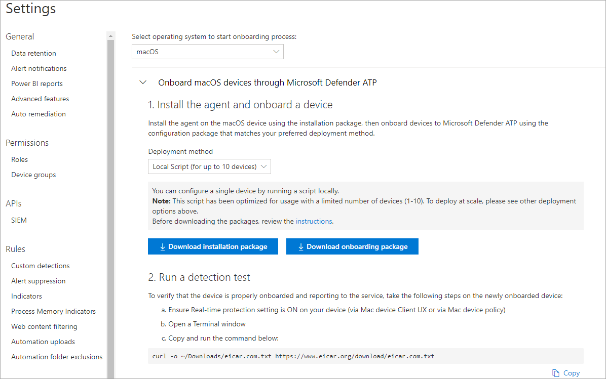

# <a name="manual-deployment-for-microsoft-defender-for-endpoint-for-macos"></a><span data-ttu-id="50246-104">Manuelle Bereitstellung für Microsoft Defender for Endpoint für macOS</span><span class="sxs-lookup"><span data-stu-id="50246-104">Manual deployment for Microsoft Defender for Endpoint for macOS</span></span>

[!INCLUDE [Microsoft 365 Defender rebranding](../../includes/microsoft-defender.md)]

<span data-ttu-id="50246-105">**Gilt für:**</span><span class="sxs-lookup"><span data-stu-id="50246-105">**Applies to:**</span></span>
- [<span data-ttu-id="50246-106">Microsoft Defender für Endpunkt</span><span class="sxs-lookup"><span data-stu-id="50246-106">Microsoft Defender for Endpoint</span></span>](https://go.microsoft.com/fwlink/p/?linkid=2146631)
- [<span data-ttu-id="50246-107">Microsoft 365 Defender</span><span class="sxs-lookup"><span data-stu-id="50246-107">Microsoft 365 Defender</span></span>](https://go.microsoft.com/fwlink/?linkid=2118804)

> <span data-ttu-id="50246-108">Möchten Sie Defender for Endpoint erleben?</span><span class="sxs-lookup"><span data-stu-id="50246-108">Want to experience Defender for Endpoint?</span></span> [<span data-ttu-id="50246-109">Registrieren Sie sich für eine kostenlose Testversion.</span><span class="sxs-lookup"><span data-stu-id="50246-109">Sign up for a free trial.</span></span>](https://www.microsoft.com/microsoft-365/windows/microsoft-defender-atp?ocid=docs-wdatp-investigateip-abovefoldlink)

<span data-ttu-id="50246-110">In diesem Thema wird beschrieben, wie Sie Microsoft Defender for Endpoint für macOS manuell bereitstellen.</span><span class="sxs-lookup"><span data-stu-id="50246-110">This topic describes how to deploy Microsoft Defender for Endpoint for macOS manually.</span></span> <span data-ttu-id="50246-111">Für eine erfolgreiche Bereitstellung sind alle folgenden Schritte erforderlich:</span><span class="sxs-lookup"><span data-stu-id="50246-111">A successful deployment requires the completion of all of the following steps:</span></span>
- [<span data-ttu-id="50246-112">Herunterladen von Installations- und Onboardingpaketen</span><span class="sxs-lookup"><span data-stu-id="50246-112">Download installation and onboarding packages</span></span>](#download-installation-and-onboarding-packages)
- [<span data-ttu-id="50246-113">Anwendungsinstallation (macOS 10.15 und ältere Versionen)</span><span class="sxs-lookup"><span data-stu-id="50246-113">Application installation (macOS 10.15 and older versions)</span></span>](#application-installation-macos-1015-and-older-versions)
- [<span data-ttu-id="50246-114">Anwendungsinstallation (macOS 11 und neuere Versionen)</span><span class="sxs-lookup"><span data-stu-id="50246-114">Application installation (macOS 11 and newer versions)</span></span>](#application-installation-macos-11-and-newer-versions)
- [<span data-ttu-id="50246-115">Clientkonfiguration</span><span class="sxs-lookup"><span data-stu-id="50246-115">Client configuration</span></span>](#client-configuration)

## <a name="prerequisites-and-system-requirements"></a><span data-ttu-id="50246-116">Voraussetzungen und Systemanforderungen</span><span class="sxs-lookup"><span data-stu-id="50246-116">Prerequisites and system requirements</span></span>

<span data-ttu-id="50246-117">Bevor Sie beginnen, finden Sie auf der Hauptseite [von Microsoft Defender for Endpoint für macOS](microsoft-defender-endpoint-mac.md) eine Beschreibung der Voraussetzungen und Systemanforderungen für die aktuelle Softwareversion.</span><span class="sxs-lookup"><span data-stu-id="50246-117">Before you get started, see [the main Microsoft Defender for Endpoint for macOS page](microsoft-defender-endpoint-mac.md) for a description of prerequisites and system requirements for the current software version.</span></span>

## <a name="download-installation-and-onboarding-packages"></a><span data-ttu-id="50246-118">Herunterladen von Installations- und Onboardingpaketen</span><span class="sxs-lookup"><span data-stu-id="50246-118">Download installation and onboarding packages</span></span>

<span data-ttu-id="50246-119">Laden Sie die Installations- und Onboardingpakete von Microsoft Defender Security Center herunter:</span><span class="sxs-lookup"><span data-stu-id="50246-119">Download the installation and onboarding packages from Microsoft Defender Security Center:</span></span>

1. <span data-ttu-id="50246-120">Wechseln Sie im Microsoft Defender Security Center zu **Einstellungen > Geräteverwaltung > Onboarding**.</span><span class="sxs-lookup"><span data-stu-id="50246-120">In Microsoft Defender Security Center, go to **Settings > Device Management > Onboarding**.</span></span>
2. <span data-ttu-id="50246-121">Legen Sie in Abschnitt 1 der Seite das Betriebssystem auf **macOS** und die Deployment-Methode auf **Lokales Skript .**</span><span class="sxs-lookup"><span data-stu-id="50246-121">In Section 1 of the page, set operating system to **macOS** and Deployment method to **Local script**.</span></span>
3. <span data-ttu-id="50246-122">Wählen Sie in Abschnitt 2 der Seite **Installationspaket herunterladen aus.**</span><span class="sxs-lookup"><span data-stu-id="50246-122">In Section 2 of the page, select **Download installation package**.</span></span> <span data-ttu-id="50246-123">Speichern Sie es als wdav.pkg in einem lokalen Verzeichnis.</span><span class="sxs-lookup"><span data-stu-id="50246-123">Save it as wdav.pkg to a local directory.</span></span>
4. <span data-ttu-id="50246-124">Wählen Sie in Abschnitt 2 der Seite Die Option **Onboardingpaket herunterladen aus.**</span><span class="sxs-lookup"><span data-stu-id="50246-124">In Section 2 of the page, select **Download onboarding package**.</span></span> <span data-ttu-id="50246-125">Speichern Sie es WindowsDefenderATPOnboardingPackage.zip im gleichen Verzeichnis.</span><span class="sxs-lookup"><span data-stu-id="50246-125">Save it as WindowsDefenderATPOnboardingPackage.zip to the same directory.</span></span>

    

5. <span data-ttu-id="50246-127">Überprüfen Sie an einer Eingabeaufforderung, ob Sie über die beiden Dateien verfügen.</span><span class="sxs-lookup"><span data-stu-id="50246-127">From a command prompt, verify that you have the two files.</span></span>
    
## <a name="application-installation-macos-1015-and-older-versions"></a><span data-ttu-id="50246-128">Anwendungsinstallation (macOS 10.15 und ältere Versionen)</span><span class="sxs-lookup"><span data-stu-id="50246-128">Application installation (macOS 10.15 and older versions)</span></span>

<span data-ttu-id="50246-129">Zum Abschließen dieses Vorgangs müssen Sie über Administratorrechte auf dem Gerät verfügen.</span><span class="sxs-lookup"><span data-stu-id="50246-129">To complete this process, you must have admin privileges on the device.</span></span>

1. <span data-ttu-id="50246-130">Navigieren Sie zum heruntergeladenen wdav.pkg in Finder, und öffnen Sie es.</span><span class="sxs-lookup"><span data-stu-id="50246-130">Navigate to the downloaded wdav.pkg in Finder and open it.</span></span>

    

2. <span data-ttu-id="50246-132">Wählen **Sie Weiter** aus, stimmen Sie den Lizenzbedingungen zu, und geben Sie das Kennwort ein, wenn Sie dazu aufgefordert werden.</span><span class="sxs-lookup"><span data-stu-id="50246-132">Select **Continue**, agree with the License terms, and enter the password when prompted.</span></span>

    

   > [!IMPORTANT]
   > <span data-ttu-id="50246-134">Sie werden aufgefordert, die Installation eines Treibers von Microsoft zu erlauben (entweder "Systemerweiterung blockiert" oder "Installation ist gesperrt" oder beides.</span><span class="sxs-lookup"><span data-stu-id="50246-134">You will be prompted to allow a driver from Microsoft to be installed (either "System Extension Blocked" or "Installation is on hold" or both.</span></span> <span data-ttu-id="50246-135">Der Treiber muss installiert werden dürfen.</span><span class="sxs-lookup"><span data-stu-id="50246-135">The driver must be allowed to be installed.</span></span>

   

3. <span data-ttu-id="50246-137">Wählen **Sie Open Security Preferences** oder Open System **Preferences > Security & Privacy aus.**</span><span class="sxs-lookup"><span data-stu-id="50246-137">Select **Open Security Preferences** or **Open System Preferences > Security & Privacy**.</span></span> <span data-ttu-id="50246-138">Wählen Sie **Zulassen** aus:</span><span class="sxs-lookup"><span data-stu-id="50246-138">Select **Allow**:</span></span>

    

   <span data-ttu-id="50246-140">Die Installation wird fortgesetzt.</span><span class="sxs-lookup"><span data-stu-id="50246-140">The installation proceeds.</span></span>

   > [!CAUTION]
   > <span data-ttu-id="50246-141">Wenn Sie nicht zulassen **auswählen,** wird die Installation nach 5 Minuten fortgesetzt.</span><span class="sxs-lookup"><span data-stu-id="50246-141">If you don't select **Allow**, the installation will proceed after 5 minutes.</span></span> <span data-ttu-id="50246-142">Microsoft Defender for Endpoint wird geladen, aber einige Features, z. B. der Echtzeitschutz, werden deaktiviert.</span><span class="sxs-lookup"><span data-stu-id="50246-142">Microsoft Defender for Endpoint will be loaded, but some features, such as real-time protection, will be disabled.</span></span> <span data-ttu-id="50246-143">Informationen [zur Lösung dieses Problems finden](mac-support-kext.md) Sie unter Problembehandlung bei Kernelerweiterungen.</span><span class="sxs-lookup"><span data-stu-id="50246-143">See [Troubleshoot kernel extension issues](mac-support-kext.md) for information on how to resolve this.</span></span>

> [!NOTE]
> <span data-ttu-id="50246-144">MacOS kann bei der ersten Installation von Microsoft Defender for Endpoint den Neustart des Geräts anfordern.</span><span class="sxs-lookup"><span data-stu-id="50246-144">macOS may request to reboot the device upon the first installation of Microsoft Defender for Endpoint.</span></span> <span data-ttu-id="50246-145">Echtzeitschutz ist erst verfügbar, wenn das Gerät neu gestartet wurde.</span><span class="sxs-lookup"><span data-stu-id="50246-145">Real-time protection will not be available until the device is rebooted.</span></span>

## <a name="application-installation-macos-11-and-newer-versions"></a><span data-ttu-id="50246-146">Anwendungsinstallation (macOS 11 und neuere Versionen)</span><span class="sxs-lookup"><span data-stu-id="50246-146">Application installation (macOS 11 and newer versions)</span></span>

<span data-ttu-id="50246-147">Zum Abschließen dieses Vorgangs müssen Sie über Administratorrechte auf dem Gerät verfügen.</span><span class="sxs-lookup"><span data-stu-id="50246-147">To complete this process, you must have admin privileges on the device.</span></span>

1. <span data-ttu-id="50246-148">Navigieren Sie zum heruntergeladenen wdav.pkg in Finder, und öffnen Sie es.</span><span class="sxs-lookup"><span data-stu-id="50246-148">Navigate to the downloaded wdav.pkg in Finder and open it.</span></span>

    

2. <span data-ttu-id="50246-150">Wählen **Sie Weiter** aus, stimmen Sie den Lizenzbedingungen zu, und geben Sie das Kennwort ein, wenn Sie dazu aufgefordert werden.</span><span class="sxs-lookup"><span data-stu-id="50246-150">Select **Continue**, agree with the License terms, and enter the password when prompted.</span></span>

3. <span data-ttu-id="50246-151">Am Ende des Installationsprozesses werden Sie zur Genehmigung der vom Produkt verwendeten Systemerweiterungen heraufgestuft.</span><span class="sxs-lookup"><span data-stu-id="50246-151">At the end of the installation process, you will be promoted to approve the system extensions used by the product.</span></span> <span data-ttu-id="50246-152">Wählen **Sie Sicherheitseinstellungen öffnen aus.**</span><span class="sxs-lookup"><span data-stu-id="50246-152">Select **Open Security Preferences**.</span></span>

    

4. <span data-ttu-id="50246-154">Wählen Sie **im Fenster & Datenschutz** die Option Zulassen **aus.**</span><span class="sxs-lookup"><span data-stu-id="50246-154">From the **Security & Privacy** window, select **Allow**.</span></span>

    

5. <span data-ttu-id="50246-156">Wiederholen Sie die Schritte 3 & 4 für alle Systemerweiterungen, die mit Microsoft Defender for Endpoint für Mac verteilt sind.</span><span class="sxs-lookup"><span data-stu-id="50246-156">Repeat steps 3 & 4 for all system extensions distributed with Microsoft Defender for Endpoint for Mac.</span></span>

6. <span data-ttu-id="50246-157">Im Rahmen der Endpunkterkennungs- und -reaktionsfunktionen prüft Microsoft Defender for Endpoint für Mac den Socketdatenverkehr und meldet diese Informationen an das Microsoft Defender Security Center-Portal.</span><span class="sxs-lookup"><span data-stu-id="50246-157">As part of the Endpoint Detection and Response capabilities, Microsoft Defender for Endpoint for Mac inspects socket traffic and reports this information to the Microsoft Defender Security Center portal.</span></span> <span data-ttu-id="50246-158">Wenn Sie aufgefordert werden, Microsoft Defender for Endpoint Berechtigungen zum Filtern von Netzwerkdatenverkehr zu erteilen, wählen Sie **Zulassen aus.**</span><span class="sxs-lookup"><span data-stu-id="50246-158">When prompted to grant Microsoft Defender for Endpoint permissions to filter network traffic, select **Allow**.</span></span>

    

7. <span data-ttu-id="50246-160">Öffnen **Sie Systemeinstellungen** Sicherheit & Datenschutz, und navigieren Sie zur Registerkarte Datenschutz. Erteilen Sie Microsoft Defender ATP und Microsoft Defender ATP Endpoint Security Extension die Berechtigung "Vollständiger  >   **Datenträgerzugriff".**   </span><span class="sxs-lookup"><span data-stu-id="50246-160">Open **System Preferences** > **Security & Privacy** and navigate to the **Privacy** tab. Grant **Full Disk Access** permission to **Microsoft Defender ATP** and **Microsoft Defender ATP Endpoint Security Extension**.</span></span>

    

## <a name="client-configuration"></a><span data-ttu-id="50246-162">Clientkonfiguration</span><span class="sxs-lookup"><span data-stu-id="50246-162">Client configuration</span></span>

1. <span data-ttu-id="50246-163">Kopieren Sie wdav.pkg und MicrosoftDefenderATPOnboardingMacOs.py auf das Gerät, auf dem Sie Microsoft Defender for Endpoint für macOS bereitstellen.</span><span class="sxs-lookup"><span data-stu-id="50246-163">Copy wdav.pkg and MicrosoftDefenderATPOnboardingMacOs.py to the device where you deploy Microsoft Defender for Endpoint for macOS.</span></span>

    <span data-ttu-id="50246-164">Das Clientgerät ist nicht orgId zugeordnet.</span><span class="sxs-lookup"><span data-stu-id="50246-164">The client device is not associated with orgId.</span></span> <span data-ttu-id="50246-165">Beachten Sie, dass *das orgId-Attribut* leer ist.</span><span class="sxs-lookup"><span data-stu-id="50246-165">Note that the *orgId* attribute is blank.</span></span>

    ```bash
    mdatp health --field org_id
    ```

2. <span data-ttu-id="50246-166">Führen Sie das Python-Skript aus, um die Konfigurationsdatei zu installieren:</span><span class="sxs-lookup"><span data-stu-id="50246-166">Run the Python script to install the configuration file:</span></span>

    ```bash
    /usr/bin/python MicrosoftDefenderATPOnboardingMacOs.py
    ```

3. <span data-ttu-id="50246-167">Stellen Sie sicher, dass das Gerät jetzt Ihrer Organisation zugeordnet ist, und meldet eine gültige *orgId*:</span><span class="sxs-lookup"><span data-stu-id="50246-167">Verify that the device is now associated with your organization and reports a valid *orgId*:</span></span>

    ```bash
    mdatp health --field org_id
    ```

<span data-ttu-id="50246-168">Nach der Installation wird das Microsoft Defender-Symbol in der macOS-Statusleiste in der oberen rechten Ecke angezeigt.</span><span class="sxs-lookup"><span data-stu-id="50246-168">After installation, you'll see the Microsoft Defender icon in the macOS status bar in the top-right corner.</span></span>

   
   

## <a name="how-to-allow-full-disk-access"></a><span data-ttu-id="50246-170">Zulassen des vollständigen Festplattenzugriffs</span><span class="sxs-lookup"><span data-stu-id="50246-170">How to Allow Full Disk Access</span></span>

> [!CAUTION]
> <span data-ttu-id="50246-171">macOS 10.15 (Catalina) enthält neue Sicherheits- und Datenschutzverbesserungen.</span><span class="sxs-lookup"><span data-stu-id="50246-171">macOS 10.15 (Catalina) contains new security and privacy enhancements.</span></span> <span data-ttu-id="50246-172">Ab dieser Version können Anwendungen standardmäßig ohne ausdrückliche Zustimmung nicht auf bestimmte Speicherorte auf dem Datenträger zugreifen (z. B. Dokumente, Downloads, Desktop usw.).</span><span class="sxs-lookup"><span data-stu-id="50246-172">Beginning with this version, by default, applications are not able to access certain locations on disk (such as Documents, Downloads, Desktop, etc.) without explicit consent.</span></span> <span data-ttu-id="50246-173">In Ermangelung dieser Zustimmung kann Microsoft Defender for Endpoint Ihr Gerät nicht vollständig schützen.</span><span class="sxs-lookup"><span data-stu-id="50246-173">In the absence of this consent, Microsoft Defender for Endpoint is not able to fully protect your device.</span></span>

<span data-ttu-id="50246-174">Um die Zustimmung zu erteilen, öffnen Sie system preferences -> Security & Privacy -> Privacy -> Full Disk Access.</span><span class="sxs-lookup"><span data-stu-id="50246-174">To grant consent, open System Preferences -> Security & Privacy -> Privacy -> Full Disk Access.</span></span> <span data-ttu-id="50246-175">Klicken Sie auf das Sperrsymbol, um Änderungen vorzunehmen (unten im Dialogfeld).</span><span class="sxs-lookup"><span data-stu-id="50246-175">Click the lock icon to make changes (bottom of the dialog box).</span></span> <span data-ttu-id="50246-176">Wählen Sie Microsoft Defender for Endpoint aus.</span><span class="sxs-lookup"><span data-stu-id="50246-176">Select Microsoft Defender for Endpoint.</span></span>

## <a name="logging-installation-issues"></a><span data-ttu-id="50246-177">Probleme bei der Protokollierung der Installation</span><span class="sxs-lookup"><span data-stu-id="50246-177">Logging installation issues</span></span>

<span data-ttu-id="50246-178">Weitere [Informationen zum](mac-resources.md#logging-installation-issues) Suchen des automatisch generierten Protokolls, das beim Auftreten eines Fehlers vom Installationsprogramm erstellt wird, finden Sie unter Protokollierungsinstallationsprobleme.</span><span class="sxs-lookup"><span data-stu-id="50246-178">See [Logging installation issues](mac-resources.md#logging-installation-issues) for more information on how to find the automatically generated log that is created by the installer when an error occurs.</span></span>

## <a name="uninstallation"></a><span data-ttu-id="50246-179">Deinstallation</span><span class="sxs-lookup"><span data-stu-id="50246-179">Uninstallation</span></span>

<span data-ttu-id="50246-180">Weitere Informationen zum Entfernen von Microsoft Defender for Endpoint für macOS von Clientgeräten finden Sie unter [Uninstalling.](mac-resources.md#uninstalling)</span><span class="sxs-lookup"><span data-stu-id="50246-180">See [Uninstalling](mac-resources.md#uninstalling) for details on how to remove Microsoft Defender for Endpoint for macOS from client devices.</span></span>
