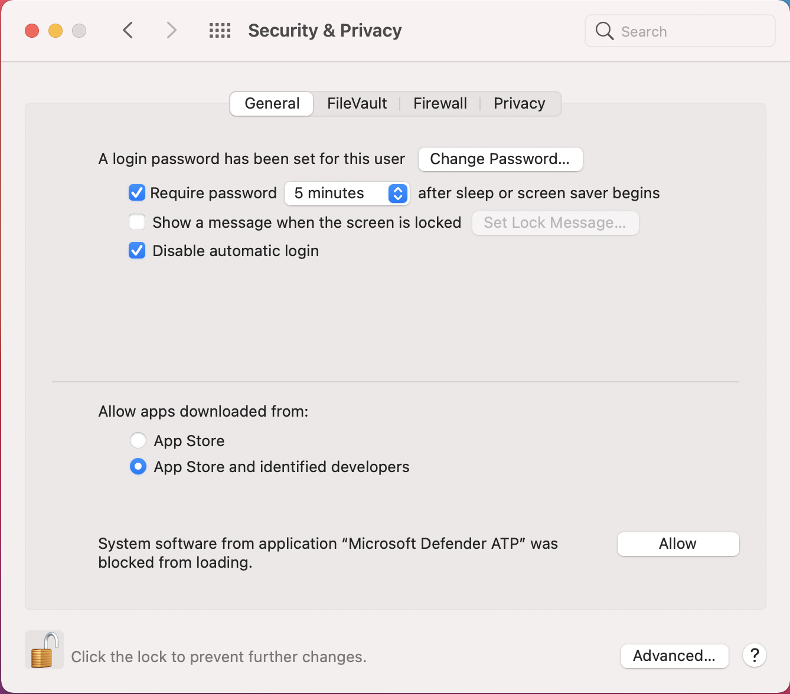

# <a name="manual-deployment-for-microsoft-defender-for-endpoint-for-macos"></a>Manuelle Bereitstellung für Microsoft Defender for Endpoint für macOS

[!INCLUDE [Microsoft 365 Defender rebranding](../../includes/microsoft-defender.md)]

**Gilt für:**
- [Microsoft Defender für Endpunkt](https://go.microsoft.com/fwlink/p/?linkid=2154037)
- [Microsoft 365 Defender](https://go.microsoft.com/fwlink/?linkid=2118804)

> Möchten Sie Defender for Endpoint erleben? [Registrieren Sie sich für eine kostenlose Testversion.](https://www.microsoft.com/microsoft-365/windows/microsoft-defender-atp?ocid=docs-wdatp-investigateip-abovefoldlink)

In diesem Thema wird beschrieben, wie Sie Microsoft Defender for Endpoint für macOS manuell bereitstellen. Für eine erfolgreiche Bereitstellung sind alle folgenden Schritte erforderlich:
- [Herunterladen von Installations- und Onboardingpaketen](#download-installation-and-onboarding-packages)
- [Anwendungsinstallation (macOS 10.15 und ältere Versionen)](#application-installation-macos-1015-and-older-versions)
- [Anwendungsinstallation (macOS 11 und neuere Versionen)](#application-installation-macos-11-and-newer-versions)
- [Clientkonfiguration](#client-configuration)

## <a name="prerequisites-and-system-requirements"></a>Voraussetzungen und Systemanforderungen

Bevor Sie beginnen, finden Sie auf der Hauptseite [von Microsoft Defender for Endpoint für macOS](microsoft-defender-endpoint-mac.md) eine Beschreibung der Voraussetzungen und Systemanforderungen für die aktuelle Softwareversion.

## <a name="download-installation-and-onboarding-packages"></a>Herunterladen von Installations- und Onboardingpaketen

Laden Sie die Installations- und Onboardingpakete von Microsoft Defender Security Center herunter:

1. Wechseln Sie im Microsoft Defender Security Center zu **Einstellungen > Geräteverwaltung > Onboarding**.
2. Legen Sie in Abschnitt 1 der Seite das Betriebssystem auf **macOS** und die Deployment-Methode auf **Lokales Skript .**
3. Wählen Sie in Abschnitt 2 der Seite **Installationspaket herunterladen aus.** Speichern Sie es als wdav.pkg in einem lokalen Verzeichnis.
4. Wählen Sie in Abschnitt 2 der Seite Die Option **Onboardingpaket herunterladen aus.** Speichern Sie es WindowsDefenderATPOnboardingPackage.zip im gleichen Verzeichnis.

    

5. Überprüfen Sie an einer Eingabeaufforderung, ob Sie über die beiden Dateien verfügen.
    
## <a name="application-installation-macos-1015-and-older-versions"></a>Anwendungsinstallation (macOS 10.15 und ältere Versionen)

Zum Abschließen dieses Vorgangs müssen Sie über Administratorrechte auf dem Gerät verfügen.

1. Navigieren Sie zum heruntergeladenen wdav.pkg in Finder, und öffnen Sie es.

    

2. Wählen **Sie Weiter** aus, stimmen Sie den Lizenzbedingungen zu, und geben Sie das Kennwort ein, wenn Sie dazu aufgefordert werden.

    

   > [!IMPORTANT]
   > Sie werden aufgefordert, die Installation eines Treibers von Microsoft zu erlauben (entweder "Systemerweiterung blockiert" oder "Installation ist gesperrt" oder beides. Der Treiber muss installiert werden dürfen.

   

3. Wählen **Sie Open Security Preferences** oder Open System **Preferences > Security & Privacy aus.** Wählen Sie **Zulassen** aus:

    

   Die Installation wird fortgesetzt.

   > [!CAUTION]
   > Wenn Sie nicht zulassen **auswählen,** wird die Installation nach 5 Minuten fortgesetzt. Microsoft Defender for Endpoint wird geladen, aber einige Features, z. B. der Echtzeitschutz, werden deaktiviert. Informationen [zur Lösung dieses Problems finden](mac-support-kext.md) Sie unter Problembehandlung bei Kernelerweiterungen.

> [!NOTE]
> MacOS kann bei der ersten Installation von Microsoft Defender for Endpoint den Neustart des Geräts anfordern. Echtzeitschutz ist erst verfügbar, wenn das Gerät neu gestartet wurde.

## <a name="application-installation-macos-11-and-newer-versions"></a>Anwendungsinstallation (macOS 11 und neuere Versionen)

Zum Abschließen dieses Vorgangs müssen Sie über Administratorrechte auf dem Gerät verfügen.

1. Navigieren Sie zum heruntergeladenen wdav.pkg in Finder, und öffnen Sie es.

    

2. Wählen **Sie Weiter** aus, stimmen Sie den Lizenzbedingungen zu, und geben Sie das Kennwort ein, wenn Sie dazu aufgefordert werden.

3. Am Ende des Installationsprozesses werden Sie zur Genehmigung der vom Produkt verwendeten Systemerweiterungen heraufgestuft. Wählen **Sie Sicherheitseinstellungen öffnen aus.**

    

4. Wählen Sie **im Fenster & Datenschutz** die Option Zulassen **aus.**

    

5. Wiederholen Sie die Schritte 3 & 4 für alle Systemerweiterungen, die mit Microsoft Defender for Endpoint für Mac verteilt sind.

6. Im Rahmen der Endpunkterkennungs- und -reaktionsfunktionen prüft Microsoft Defender for Endpoint für Mac den Socketdatenverkehr und meldet diese Informationen an das Microsoft Defender Security Center-Portal. Wenn Sie aufgefordert werden, Microsoft Defender for Endpoint Berechtigungen zum Filtern von Netzwerkdatenverkehr zu erteilen, wählen Sie **Zulassen aus.**

    

7. Öffnen **Sie Systemeinstellungen** Sicherheit & Datenschutz, und navigieren Sie zur Registerkarte Datenschutz. Erteilen Sie Microsoft Defender ATP und Microsoft Defender ATP Endpoint Security Extension die Berechtigung "Vollständiger  >   **Datenträgerzugriff".**   

    

## <a name="client-configuration"></a>Clientkonfiguration

1. Kopieren Sie wdav.pkg und MicrosoftDefenderATPOnboardingMacOs.py auf das Gerät, auf dem Sie Microsoft Defender for Endpoint für macOS bereitstellen.

    Das Clientgerät ist nicht orgId zugeordnet. Beachten Sie, dass *das orgId-Attribut* leer ist.

    ```bash
    mdatp health --field org_id
    ```

2. Führen Sie das Python-Skript aus, um die Konfigurationsdatei zu installieren:

    ```bash
    /usr/bin/python MicrosoftDefenderATPOnboardingMacOs.py
    ```

3. Stellen Sie sicher, dass das Gerät jetzt Ihrer Organisation zugeordnet ist, und meldet eine gültige *orgId*:

    ```bash
    mdatp health --field org_id
    ```

Nach der Installation wird das Microsoft Defender-Symbol in der macOS-Statusleiste in der oberen rechten Ecke angezeigt.

   
   

## <a name="how-to-allow-full-disk-access"></a>Zulassen des vollständigen Festplattenzugriffs

> [!CAUTION]
> macOS 10.15 (Catalina) enthält neue Sicherheits- und Datenschutzverbesserungen. Ab dieser Version können Anwendungen standardmäßig ohne ausdrückliche Zustimmung nicht auf bestimmte Speicherorte auf dem Datenträger zugreifen (z. B. Dokumente, Downloads, Desktop usw.). In Ermangelung dieser Zustimmung kann Microsoft Defender for Endpoint Ihr Gerät nicht vollständig schützen.

Um die Zustimmung zu erteilen, öffnen Sie system preferences -> Security & Privacy -> Privacy -> Full Disk Access. Klicken Sie auf das Sperrsymbol, um Änderungen vorzunehmen (unten im Dialogfeld). Wählen Sie Microsoft Defender for Endpoint aus.

## <a name="logging-installation-issues"></a>Probleme bei der Protokollierung der Installation

Weitere [Informationen zum](mac-resources.md#logging-installation-issues) Suchen des automatisch generierten Protokolls, das beim Auftreten eines Fehlers vom Installationsprogramm erstellt wird, finden Sie unter Protokollierungsinstallationsprobleme.

## <a name="uninstallation"></a>Deinstallation

Weitere Informationen zum Entfernen von Microsoft Defender for Endpoint für macOS von Clientgeräten finden Sie unter [Uninstalling.](mac-resources.md#uninstalling)
