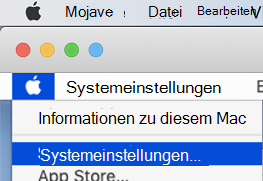

# <a name="intune-based-deployment-for-microsoft-defender-for-endpoint-on-macos"></a><span data-ttu-id="93709-104">Intune-basierte Bereitstellung für Microsoft Defender für Endpunkt unter macOS</span><span class="sxs-lookup"><span data-stu-id="93709-104">Intune-based deployment for Microsoft Defender for Endpoint on macOS</span></span>

[!INCLUDE [Microsoft 365 Defender rebranding](../../includes/microsoft-defender.md)]

<span data-ttu-id="93709-105">**Gilt für:**</span><span class="sxs-lookup"><span data-stu-id="93709-105">**Applies to:**</span></span>

- [<span data-ttu-id="93709-106">Microsoft Defender für Endpunkt unter Mac OS</span><span class="sxs-lookup"><span data-stu-id="93709-106">Microsoft Defender for Endpoint on macOS</span></span>](microsoft-defender-endpoint-mac.md)

<span data-ttu-id="93709-107">In diesem Thema wird beschrieben, wie Sie Microsoft Defender für Endpunkt unter macOS über Intune bereitstellen.</span><span class="sxs-lookup"><span data-stu-id="93709-107">This topic describes how to deploy Microsoft Defender for Endpoint on macOS through Intune.</span></span> <span data-ttu-id="93709-108">Für eine erfolgreiche Bereitstellung müssen alle folgenden Schritte abgeschlossen sein:</span><span class="sxs-lookup"><span data-stu-id="93709-108">A successful deployment requires the completion of all of the following steps:</span></span>

1. [<span data-ttu-id="93709-109">Herunterladen des Onboardingpakets</span><span class="sxs-lookup"><span data-stu-id="93709-109">Download the onboarding package</span></span>](#download-the-onboarding-package)
1. [<span data-ttu-id="93709-110">Setup des Clientgeräts</span><span class="sxs-lookup"><span data-stu-id="93709-110">Client device setup</span></span>](#client-device-setup)
1. [<span data-ttu-id="93709-111">Genehmigen von Systemerweiterungen</span><span class="sxs-lookup"><span data-stu-id="93709-111">Approve system extensions</span></span>](#approve-system-extensions)
1. [<span data-ttu-id="93709-112">Erstellen von Systemkonfigurationsprofilen</span><span class="sxs-lookup"><span data-stu-id="93709-112">Create System Configuration profiles</span></span>](#create-system-configuration-profiles)
1. [<span data-ttu-id="93709-113">Anwendung veröffentlichen</span><span class="sxs-lookup"><span data-stu-id="93709-113">Publish application</span></span>](#publish-application)

## <a name="prerequisites-and-system-requirements"></a><span data-ttu-id="93709-114">Voraussetzungen und Systemanforderungen</span><span class="sxs-lookup"><span data-stu-id="93709-114">Prerequisites and system requirements</span></span>

<span data-ttu-id="93709-115">Beachten Sie vor dem Start [die Hauptseite „Microsoft Defender für Endpunkt auf macOS“](microsoft-defender-endpoint-mac.md) für eine Beschreibung der Voraussetzungen und Systemanforderungen für die aktuelle Softwareversion.</span><span class="sxs-lookup"><span data-stu-id="93709-115">Before you get started, see [the main Microsoft Defender for Endpoint on macOS page](microsoft-defender-endpoint-mac.md) for a description of prerequisites and system requirements for the current software version.</span></span>

## <a name="overview"></a><span data-ttu-id="93709-116">Übersicht</span><span class="sxs-lookup"><span data-stu-id="93709-116">Overview</span></span>

<span data-ttu-id="93709-117">In der folgenden Tabelle sind die Schritte zusammengefasst, die Sie ausführen müssen, um Microsoft Defender für Endpunkt auf Macs über Intune bereitzustellen und zu verwalten.</span><span class="sxs-lookup"><span data-stu-id="93709-117">The following table summarizes the steps you would need to take to deploy and manage Microsoft Defender for Endpoint on Macs, via Intune.</span></span> <span data-ttu-id="93709-118">Ausführlichere Schritte finden Sie unten.</span><span class="sxs-lookup"><span data-stu-id="93709-118">More detailed steps are available below.</span></span>

| <span data-ttu-id="93709-119">Schritt</span><span class="sxs-lookup"><span data-stu-id="93709-119">Step</span></span> | <span data-ttu-id="93709-120">Beispieldateinamen</span><span class="sxs-lookup"><span data-stu-id="93709-120">Sample file names</span></span> | <span data-ttu-id="93709-121">BundleIdentifier</span><span class="sxs-lookup"><span data-stu-id="93709-121">BundleIdentifier</span></span> |
|-|-|-|
| [<span data-ttu-id="93709-122">Herunterladen des Onboardingpakets</span><span class="sxs-lookup"><span data-stu-id="93709-122">Download the onboarding package</span></span>](#download-the-onboarding-package) | <span data-ttu-id="93709-123">WindowsDefenderATPOnboarding__MDATP_wdav.atp.xml</span><span class="sxs-lookup"><span data-stu-id="93709-123">WindowsDefenderATPOnboarding__MDATP_wdav.atp.xml</span></span> | <span data-ttu-id="93709-124">com.microsoft.wdav.atp</span><span class="sxs-lookup"><span data-stu-id="93709-124">com.microsoft.wdav.atp</span></span> |
| [<span data-ttu-id="93709-125">Genehmigen der Systemerweiterung für Microsoft Defender für Endpunkt</span><span class="sxs-lookup"><span data-stu-id="93709-125">Approve System Extension for Microsoft Defender for Endpoint</span></span>](#approve-system-extensions) | <span data-ttu-id="93709-126">MDATP_SysExt.xml</span><span class="sxs-lookup"><span data-stu-id="93709-126">MDATP_SysExt.xml</span></span> | <span data-ttu-id="93709-127">Nicht zutreffend</span><span class="sxs-lookup"><span data-stu-id="93709-127">N/A</span></span> |
| [<span data-ttu-id="93709-128">Genehmigen der Kernelerweiterung für Microsoft Defender für Endpunkt</span><span class="sxs-lookup"><span data-stu-id="93709-128">Approve Kernel Extension for Microsoft Defender for Endpoint</span></span>](#download-the-onboarding-package) | <span data-ttu-id="93709-129">MDATP_KExt.xml</span><span class="sxs-lookup"><span data-stu-id="93709-129">MDATP_KExt.xml</span></span> | <span data-ttu-id="93709-130">Nicht zutreffend</span><span class="sxs-lookup"><span data-stu-id="93709-130">N/A</span></span> |
| [<span data-ttu-id="93709-131">Gewähren des vollständigen Datenträgerzugriffs auf Microsoft Defender für Endpunkt</span><span class="sxs-lookup"><span data-stu-id="93709-131">Grant full disk access to Microsoft Defender for Endpoint</span></span>](#full-disk-access) | <span data-ttu-id="93709-132">MDATP_tcc_Catalina_or_newer.xml</span><span class="sxs-lookup"><span data-stu-id="93709-132">MDATP_tcc_Catalina_or_newer.xml</span></span> | <span data-ttu-id="93709-133">com.microsoft.wdav.tcc</span><span class="sxs-lookup"><span data-stu-id="93709-133">com.microsoft.wdav.tcc</span></span> |
| [<span data-ttu-id="93709-134">Netzwerkerweiterungsrichtlinie</span><span class="sxs-lookup"><span data-stu-id="93709-134">Network Extension policy</span></span>](#network-filter) | <span data-ttu-id="93709-135">MDATP_NetExt.xml</span><span class="sxs-lookup"><span data-stu-id="93709-135">MDATP_NetExt.xml</span></span> | <span data-ttu-id="93709-136">Nicht zutreffend</span><span class="sxs-lookup"><span data-stu-id="93709-136">N/A</span></span> |
| [<span data-ttu-id="93709-137">Konfigurieren von Microsoft AutoUpdate (MAU)</span><span class="sxs-lookup"><span data-stu-id="93709-137">Configure Microsoft AutoUpdate (MAU)</span></span>](mac-updates.md#intune) | <span data-ttu-id="93709-138">MDATP_Microsoft_AutoUpdate.xml</span><span class="sxs-lookup"><span data-stu-id="93709-138">MDATP_Microsoft_AutoUpdate.xml</span></span> | <span data-ttu-id="93709-139">com.microsoft.autoupdate2</span><span class="sxs-lookup"><span data-stu-id="93709-139">com.microsoft.autoupdate2</span></span> |
| [<span data-ttu-id="93709-140">Konfigurationseinstellungen für Microsoft Defender für Endpunkt</span><span class="sxs-lookup"><span data-stu-id="93709-140">Microsoft Defender for Endpoint configuration settings</span></span>](mac-preferences.md#intune-profile-1)<br/><br/> <span data-ttu-id="93709-141">**Hinweis:** Wenn Sie planen, eine AV-Datei eines Drittanbieters für macOS auszuführen, legen Sie `passiveMode` dies auf `true` fest.</span><span class="sxs-lookup"><span data-stu-id="93709-141">**Note:** If you're planning to run a third-party AV for macOS, set `passiveMode` to `true`.</span></span> | <span data-ttu-id="93709-142">MDATP_WDAV_and_exclusion_settings_Preferences.xml</span><span class="sxs-lookup"><span data-stu-id="93709-142">MDATP_WDAV_and_exclusion_settings_Preferences.xml</span></span> | <span data-ttu-id="93709-143">com.microsoft.wdav</span><span class="sxs-lookup"><span data-stu-id="93709-143">com.microsoft.wdav</span></span> |
| [<span data-ttu-id="93709-144">Konfigurieren von Microsoft Defender für Endpunkt- und MS AutoUpdate (MAU)-Benachrichtigungen</span><span class="sxs-lookup"><span data-stu-id="93709-144">Configure Microsoft Defender for Endpoint and MS AutoUpdate (MAU) notifications</span></span>](mac-updates.md) | <span data-ttu-id="93709-145">MDATP_MDAV_Tray_and_AutoUpdate2.mobileconfig</span><span class="sxs-lookup"><span data-stu-id="93709-145">MDATP_MDAV_Tray_and_AutoUpdate2.mobileconfig</span></span> | <span data-ttu-id="93709-146">com.microsoft.autoupdate2 oder com.microsoft.wdav.tray</span><span class="sxs-lookup"><span data-stu-id="93709-146">com.microsoft.autoupdate2 or com.microsoft.wdav.tray</span></span> |


## <a name="download-the-onboarding-package"></a><span data-ttu-id="93709-147">Herunterladen des Onboardingpakets</span><span class="sxs-lookup"><span data-stu-id="93709-147">Download the onboarding package</span></span>

<span data-ttu-id="93709-148">Laden Sie die Onboardingpakete aus Microsoft Defender Security Center herunter:</span><span class="sxs-lookup"><span data-stu-id="93709-148">Download the onboarding packages from Microsoft Defender Security Center:</span></span>

1. <span data-ttu-id="93709-149">Wechseln Sie in Microsoft Defender Security Center zu **Einstellungen**  >  **Geräteverwaltungs-Onboarding.**  >  </span><span class="sxs-lookup"><span data-stu-id="93709-149">In Microsoft Defender Security Center, go to **Settings** > **Device Management** > **Onboarding**.</span></span>

2. <span data-ttu-id="93709-150">Legen Sie das Betriebssystem auf **macOS** und die Bereitstellungsmethode auf **Mobile Device Management/Microsoft Intune** fest.</span><span class="sxs-lookup"><span data-stu-id="93709-150">Set the operating system to **macOS** and the deployment method to **Mobile Device Management / Microsoft Intune**.</span></span>

    

3. <span data-ttu-id="93709-152">Wählen Sie **"Onboardingpaket herunterladen"** aus.</span><span class="sxs-lookup"><span data-stu-id="93709-152">Select **Download onboarding package**.</span></span> <span data-ttu-id="93709-153">Speichern Sie es als _WindowsDefenderATPOnboardingPackage.zip_ im selben Verzeichnis.</span><span class="sxs-lookup"><span data-stu-id="93709-153">Save it as _WindowsDefenderATPOnboardingPackage.zip_ to the same directory.</span></span>

4. <span data-ttu-id="93709-154">Extrahieren Sie den Inhalt der .zip Datei:</span><span class="sxs-lookup"><span data-stu-id="93709-154">Extract the contents of the .zip file:</span></span>

    ```bash
    unzip WindowsDefenderATPOnboardingPackage.zip
    ```
    ```Output
    Archive:  WindowsDefenderATPOnboardingPackage.zip
    warning:  WindowsDefenderATPOnboardingPackage.zip appears to use backslashes as path separators
      inflating: intune/kext.xml
      inflating: intune/WindowsDefenderATPOnboarding.xml
      inflating: jamf/WindowsDefenderATPOnboarding.plist
    ```

## <a name="create-system-configuration-profiles"></a><span data-ttu-id="93709-155">Erstellen von Systemkonfigurationsprofilen</span><span class="sxs-lookup"><span data-stu-id="93709-155">Create System Configuration profiles</span></span>

<span data-ttu-id="93709-156">Der nächste Schritt besteht darin, Systemkonfigurationsprofile zu erstellen, die Microsoft Defender für Endpunkt benötigt.</span><span class="sxs-lookup"><span data-stu-id="93709-156">The next step is to create system configuration profiles that Microsoft Defender for Endpoint needs.</span></span>
<span data-ttu-id="93709-157">Öffnen [Sie](https://endpoint.microsoft.com/)im Microsoft Endpoint Manager Admin Center die   >  **Gerätekonfigurationsprofile.**</span><span class="sxs-lookup"><span data-stu-id="93709-157">In the [Microsoft Endpoint Manager admin center](https://endpoint.microsoft.com/), open **Devices** > **Configuration profiles**.</span></span>

### <a name="onboarding-blob"></a><span data-ttu-id="93709-158">Onboarding-Blob</span><span class="sxs-lookup"><span data-stu-id="93709-158">Onboarding blob</span></span>

<span data-ttu-id="93709-159">Dieses Profil enthält eine Lizenzinformationen für Microsoft Defender für Endpunkt, ohne dass es meldet, dass es nicht lizenziert ist.</span><span class="sxs-lookup"><span data-stu-id="93709-159">This profile contains a license information for Microsoft Defender for Endpoint, without it it will report that it is not licensed.</span></span>

1. <span data-ttu-id="93709-160">Wählen Sie **"Profil erstellen"** unter **"Konfigurationsprofile" aus.**</span><span class="sxs-lookup"><span data-stu-id="93709-160">Select **Create Profile** under **Configuration Profiles**.</span></span>
1. <span data-ttu-id="93709-161">Wählen Sie **Plattform** = **macOS**, **Profiltypvorlagen** = .</span><span class="sxs-lookup"><span data-stu-id="93709-161">Select **Platform**=**macOS**, **Profile type**=**Templates**.</span></span> <span data-ttu-id="93709-162">**Vorlagenname** = **Benutzerdefinierte**.</span><span class="sxs-lookup"><span data-stu-id="93709-162">**Template name**=**Custom**.</span></span> <span data-ttu-id="93709-163">Klicken Sie auf **Erstellen**.</span><span class="sxs-lookup"><span data-stu-id="93709-163">Click **Create**.</span></span>

    > [!div class="mx-imgBorder"]
    > <span data-ttu-id="93709-164"></span><span class="sxs-lookup"><span data-stu-id="93709-164"></span></span>

1. <span data-ttu-id="93709-165">Wählen Sie einen Namen für das Profil aus, z. B. "Defender- oder Endpunkt-Onboarding für macOS".</span><span class="sxs-lookup"><span data-stu-id="93709-165">Choose a name for the profile, e.g., "Defender or Endpoint onboarding for macOS".</span></span> <span data-ttu-id="93709-166">Klicken Sie auf **Weiter**.</span><span class="sxs-lookup"><span data-stu-id="93709-166">Click **Next**.</span></span>

    > [!div class="mx-imgBorder"]
    > <span data-ttu-id="93709-167"></span><span class="sxs-lookup"><span data-stu-id="93709-167"></span></span>

1. <span data-ttu-id="93709-168">Wählen Sie einen Namen für den Konfigurationsprofilnamen aus, z. B. "Defender für Endpunkt-Onboarding für macOS".</span><span class="sxs-lookup"><span data-stu-id="93709-168">Choose a name for the configuration profile name, e.g., "Defender for Endpoint onboarding for macOS".</span></span>
1. <span data-ttu-id="93709-169">Wählen Sie Intune/WindowsDefenderATPOnboarding.xml aus, die Sie aus dem obigen Onboardingpaket als Konfigurationsprofildatei extrahiert haben.</span><span class="sxs-lookup"><span data-stu-id="93709-169">Select intune/WindowsDefenderATPOnboarding.xml that you extracted from the onboarding package above as configuration profile file.</span></span>

    > [!div class="mx-imgBorder"]
    > <span data-ttu-id="93709-170"></span><span class="sxs-lookup"><span data-stu-id="93709-170"></span></span>

1. <span data-ttu-id="93709-171">Klicken Sie auf **Weiter**.</span><span class="sxs-lookup"><span data-stu-id="93709-171">Click **Next**.</span></span>
1. <span data-ttu-id="93709-172">Weisen Sie Geräte auf der Registerkarte **"Zuordnung" zu.** Klicken Sie auf **"Weiter".**</span><span class="sxs-lookup"><span data-stu-id="93709-172">Assign devices on the **Assignment** tab. Click **Next**.</span></span>

    > [!div class="mx-imgBorder"]
    > <span data-ttu-id="93709-173"></span><span class="sxs-lookup"><span data-stu-id="93709-173"></span></span>

1. <span data-ttu-id="93709-174">Überprüfen und **Erstellen .**</span><span class="sxs-lookup"><span data-stu-id="93709-174">Review and **Create**.</span></span>
1. <span data-ttu-id="93709-175">Öffnen Sie  >  **Gerätekonfigurationsprofile,** dort können Sie Ihr erstelltes Profil sehen.</span><span class="sxs-lookup"><span data-stu-id="93709-175">Open **Devices** > **Configuration profiles**, you can see your created profile there.</span></span>

    > [!div class="mx-imgBorder"]
    > <span data-ttu-id="93709-176"></span><span class="sxs-lookup"><span data-stu-id="93709-176"></span></span>

### <a name="approve-system-extensions"></a><span data-ttu-id="93709-177">Genehmigen von Systemerweiterungen</span><span class="sxs-lookup"><span data-stu-id="93709-177">Approve System Extensions</span></span>

<span data-ttu-id="93709-178">Dieses Profil wird für macOS 10.15 (Gif) oder höher benötigt.</span><span class="sxs-lookup"><span data-stu-id="93709-178">This profile is needed for macOS 10.15 (Catalina) or newer.</span></span> <span data-ttu-id="93709-179">Sie wird unter älteren macOS ignoriert.</span><span class="sxs-lookup"><span data-stu-id="93709-179">It will be ignored on older macOS.</span></span>

1. <span data-ttu-id="93709-180">Wählen Sie **"Profil erstellen"** unter **"Konfigurationsprofile" aus.**</span><span class="sxs-lookup"><span data-stu-id="93709-180">Select **Create Profile** under **Configuration Profiles**.</span></span>
1. <span data-ttu-id="93709-181">Wählen Sie **Plattform** = **macOS**, **Profiltypvorlagen** = .</span><span class="sxs-lookup"><span data-stu-id="93709-181">Select **Platform**=**macOS**, **Profile type**=**Templates**.</span></span> <span data-ttu-id="93709-182">**Vorlagenname** = **Erweiterungen**.</span><span class="sxs-lookup"><span data-stu-id="93709-182">**Template name**=**Extensions**.</span></span> <span data-ttu-id="93709-183">Klicken Sie auf **Erstellen**.</span><span class="sxs-lookup"><span data-stu-id="93709-183">Click **Create**.</span></span>
1. <span data-ttu-id="93709-184">Geben Sie auf der Registerkarte **"Grundlagen"** diesem neuen Profil einen Namen.</span><span class="sxs-lookup"><span data-stu-id="93709-184">In the **Basics** tab, give a name to this new profile.</span></span>
1. <span data-ttu-id="93709-185">Erweitern Sie auf der Registerkarte **"Konfigurationseinstellungen"** **systemerweiterungen** die folgenden Einträge im Abschnitt **"Zugelassene Systemerweiterungen":**</span><span class="sxs-lookup"><span data-stu-id="93709-185">In the **Configuration settings** tab, expand **System Extensions** add the following entries in the **Allowed system extensions** section:</span></span>

    <span data-ttu-id="93709-186">Bündelbezeichner</span><span class="sxs-lookup"><span data-stu-id="93709-186">Bundle identifier</span></span>         | <span data-ttu-id="93709-187">Teambezeichner</span><span class="sxs-lookup"><span data-stu-id="93709-187">Team identifier</span></span>
    --------------------------|----------------
    <span data-ttu-id="93709-188">com.microsoft.wdav.epsext</span><span class="sxs-lookup"><span data-stu-id="93709-188">com.microsoft.wdav.epsext</span></span> | <span data-ttu-id="93709-189">UBF8T346G9</span><span class="sxs-lookup"><span data-stu-id="93709-189">UBF8T346G9</span></span>
    <span data-ttu-id="93709-190">com.microsoft.wdav.netext</span><span class="sxs-lookup"><span data-stu-id="93709-190">com.microsoft.wdav.netext</span></span> | <span data-ttu-id="93709-191">UBF8T346G9</span><span class="sxs-lookup"><span data-stu-id="93709-191">UBF8T346G9</span></span>

    > [!div class="mx-imgBorder"]
    > <span data-ttu-id="93709-192"></span><span class="sxs-lookup"><span data-stu-id="93709-192"></span></span>

1. <span data-ttu-id="93709-193">Weisen Sie dieses Profil auf der Registerkarte **Aufgaben** allen Benutzern & Allen **Geräten** zu.</span><span class="sxs-lookup"><span data-stu-id="93709-193">In the **Assignments** tab, assign this profile to **All Users & All devices**.</span></span>
1. <span data-ttu-id="93709-194">Überprüfen und erstellen Sie dieses Konfigurationsprofil.</span><span class="sxs-lookup"><span data-stu-id="93709-194">Review and create this configuration profile.</span></span>

### <a name="kernel-extensions"></a><span data-ttu-id="93709-195">Kernelerweiterungen</span><span class="sxs-lookup"><span data-stu-id="93709-195">Kernel Extensions</span></span>

<span data-ttu-id="93709-196">Dieses Profil wird für macOS 10.15 (Macintosh) oder älter benötigt.</span><span class="sxs-lookup"><span data-stu-id="93709-196">This profile is needed for macOS 10.15 (Catalina) or older.</span></span> <span data-ttu-id="93709-197">Sie wird unter neueren macOS ignoriert.</span><span class="sxs-lookup"><span data-stu-id="93709-197">It will be ignored on newer macOS.</span></span>

> [!CAUTION]
> <span data-ttu-id="93709-198">Apple Silicon (M1)-Geräte unterstützen KEXT nicht.</span><span class="sxs-lookup"><span data-stu-id="93709-198">Apple Silicon (M1) devices do not support KEXT.</span></span> <span data-ttu-id="93709-199">Die Installation eines Konfigurationsprofils, das aus KEXT-Richtlinien besteht, schlägt auf diesen Geräten fehl.</span><span class="sxs-lookup"><span data-stu-id="93709-199">Installation of a configuration profile consisting KEXT policies will fail on these devices.</span></span>

1. <span data-ttu-id="93709-200">Wählen Sie **"Profil erstellen"** unter **"Konfigurationsprofile" aus.**</span><span class="sxs-lookup"><span data-stu-id="93709-200">Select **Create Profile** under **Configuration Profiles**.</span></span>
1. <span data-ttu-id="93709-201">Wählen Sie **Plattform** = **macOS**, **Profiltypvorlagen** = .</span><span class="sxs-lookup"><span data-stu-id="93709-201">Select **Platform**=**macOS**, **Profile type**=**Templates**.</span></span> <span data-ttu-id="93709-202">**Vorlagenname** = **Erweiterungen**.</span><span class="sxs-lookup"><span data-stu-id="93709-202">**Template name**=**Extensions**.</span></span> <span data-ttu-id="93709-203">Klicken Sie auf **Erstellen**.</span><span class="sxs-lookup"><span data-stu-id="93709-203">Click **Create**.</span></span>
1. <span data-ttu-id="93709-204">Geben Sie auf der Registerkarte **"Grundlagen"** diesem neuen Profil einen Namen.</span><span class="sxs-lookup"><span data-stu-id="93709-204">In the **Basics** tab, give a name to this new profile.</span></span>
1. <span data-ttu-id="93709-205">Erweitern Sie auf der Registerkarte **"Konfigurationseinstellungen"** **die Kernelerweiterungen.**</span><span class="sxs-lookup"><span data-stu-id="93709-205">In the **Configuration settings** tab, expand **Kernel Extensions**.</span></span>
1. <span data-ttu-id="93709-206">Legen Sie **den Teambezeichner** auf **UBF8T346G9** fest, und klicken Sie auf **"Weiter".**</span><span class="sxs-lookup"><span data-stu-id="93709-206">Set **Team identifier** to **UBF8T346G9** and click **Next**.</span></span>

    > [!div class="mx-imgBorder"]
    > <span data-ttu-id="93709-207"></span><span class="sxs-lookup"><span data-stu-id="93709-207"></span></span>

1. <span data-ttu-id="93709-208">Weisen Sie dieses Profil auf der Registerkarte **"Zuordnungen"** **allen Benutzern & allen Geräten** zu.</span><span class="sxs-lookup"><span data-stu-id="93709-208">In the **Assignments** tab, assign this profile to **All Users & All devices**.</span></span>
1. <span data-ttu-id="93709-209">Überprüfen und erstellen Sie dieses Konfigurationsprofil.</span><span class="sxs-lookup"><span data-stu-id="93709-209">Review and create this configuration profile.</span></span>

### <a name="full-disk-access"></a><span data-ttu-id="93709-210">Vollzugriff auf Datenträger</span><span class="sxs-lookup"><span data-stu-id="93709-210">Full Disk Access</span></span>

   > [!CAUTION]
   > <span data-ttu-id="93709-211">macOS 10.15 (Catalina) enthält neue Sicherheits- und Datenschutzerweiterungen.</span><span class="sxs-lookup"><span data-stu-id="93709-211">macOS 10.15 (Catalina) contains new security and privacy enhancements.</span></span> <span data-ttu-id="93709-212">Ab dieser Version sind Anwendungen standardmäßig nicht in der Lage, ohne ausdrückliche Zustimmung auf bestimmte Speicherorte auf dem Disk zuzugreifen (wie Dokumente, Downloads, Desktop usw.).</span><span class="sxs-lookup"><span data-stu-id="93709-212">Beginning with this version, by default, applications are not able to access certain locations on disk (such as Documents, Downloads, Desktop, etc.) without explicit consent.</span></span> <span data-ttu-id="93709-213">Wenn diese Zustimmung nicht vorhanden ist, kann Microsoft Defender für Endpunkt Ihr Gerät nicht vollständig schützen.</span><span class="sxs-lookup"><span data-stu-id="93709-213">In the absence of this consent, Microsoft Defender for Endpoint is not able to fully protect your device.</span></span>
   >
   > <span data-ttu-id="93709-214">Dieses Konfigurationsprofil gewährt Volldatenträgerzugriff auf Microsoft Defender für Endpunkt.</span><span class="sxs-lookup"><span data-stu-id="93709-214">This configuration profile grants Full Disk Access to Microsoft Defender for Endpoint.</span></span> <span data-ttu-id="93709-215">Wenn Sie Zuvor Microsoft Defender für Endpunkt über Intune konfiguriert haben, empfehlen wir, die Bereitstellung mit diesem Konfigurationsprofil zu aktualisieren.</span><span class="sxs-lookup"><span data-stu-id="93709-215">If you previously configured Microsoft Defender for Endpoint through Intune, we recommend you update the deployment with this configuration profile.</span></span>

<span data-ttu-id="93709-216">Laden Sie [**fulldisk.mobileconfig**](https://raw.githubusercontent.com/microsoft/mdatp-xplat/master/macos/mobileconfig/profiles/fulldisk.mobileconfig) aus [unserem GitHub-Repository](https://github.com/microsoft/mdatp-xplat/tree/master/macos/mobileconfig/profiles)herunter.</span><span class="sxs-lookup"><span data-stu-id="93709-216">Download [**fulldisk.mobileconfig**](https://raw.githubusercontent.com/microsoft/mdatp-xplat/master/macos/mobileconfig/profiles/fulldisk.mobileconfig) from [our GitHub repository](https://github.com/microsoft/mdatp-xplat/tree/master/macos/mobileconfig/profiles).</span></span>

<span data-ttu-id="93709-217">Folgen Sie den Anweisungen für das [Onboarding](#onboarding-blob) von BLOB von oben, wobei Sie "Defender für Endpunkt Volldatenträgerzugriff" als Profilnamen verwenden und **"fulldisk.mobileconfig"** als Konfigurationsprofilnamen heruntergeladen haben.</span><span class="sxs-lookup"><span data-stu-id="93709-217">Follow the instructions for [Onboarding blob](#onboarding-blob) from above, using "Defender for Endpoint Full Disk Access" as profile name, and downloaded **fulldisk.mobileconfig** as Configuration profile name.</span></span>

### <a name="network-filter"></a><span data-ttu-id="93709-218">Netzwerkfilter</span><span class="sxs-lookup"><span data-stu-id="93709-218">Network Filter</span></span>

<span data-ttu-id="93709-219">Als Teil der Funktionen für Endpunkterkennung und -reaktion prüft Microsoft Defender für Endpunkt unter macOS Socketdatenverkehr und meldet diese Informationen an das Microsoft Defender Security Center Portal.</span><span class="sxs-lookup"><span data-stu-id="93709-219">As part of the Endpoint Detection and Response capabilities, Microsoft Defender for Endpoint on macOS inspects socket traffic and reports this information to the Microsoft Defender Security Center portal.</span></span> <span data-ttu-id="93709-220">Mit der folgenden Richtlinie kann die Netzwerkerweiterung diese Funktionalität ausführen.</span><span class="sxs-lookup"><span data-stu-id="93709-220">The following policy allows the network extension to perform this functionality.</span></span>

<span data-ttu-id="93709-221">Laden Sie [**"netfilter.mobileconfig"**](https://raw.githubusercontent.com/microsoft/mdatp-xplat/master/macos/mobileconfig/profiles/netfilter.mobileconfig) aus [unserem GitHub-Repository](https://github.com/microsoft/mdatp-xplat/tree/master/macos/mobileconfig/profiles)herunter.</span><span class="sxs-lookup"><span data-stu-id="93709-221">Download [**netfilter.mobileconfig**](https://raw.githubusercontent.com/microsoft/mdatp-xplat/master/macos/mobileconfig/profiles/netfilter.mobileconfig) from [our GitHub repository](https://github.com/microsoft/mdatp-xplat/tree/master/macos/mobileconfig/profiles).</span></span>

<span data-ttu-id="93709-222">Folgen Sie den Anweisungen für das [Onboarding](#onboarding-blob) von BLOB von oben, wobei Sie "Defender für Endpunkt-Netzwerkfilter" als Profilnamen und **"netfilter.mobileconfig"** als Konfigurationsprofilnamen heruntergeladen haben.</span><span class="sxs-lookup"><span data-stu-id="93709-222">Follow the instructions for [Onboarding blob](#onboarding-blob) from above, using "Defender for Endpoint Network Filter" as profile name, and downloaded **netfilter.mobileconfig** as Configuration profile name.</span></span>

### <a name="notifications"></a><span data-ttu-id="93709-223">Benachrichtigungen</span><span class="sxs-lookup"><span data-stu-id="93709-223">Notifications</span></span>

<span data-ttu-id="93709-224">Dieses Profil wird verwendet, damit Microsoft Defender für Endpunkt unter macOS und Microsoft Auto Update Benachrichtigungen auf der Benutzeroberfläche unter macOS 10.15 (Gif) oder höher anzeigen kann.</span><span class="sxs-lookup"><span data-stu-id="93709-224">This profile is used to allow Microsoft Defender for Endpoint on macOS and Microsoft Auto Update to display notifications in UI on macOS 10.15 (Catalina) or newer.</span></span>

<span data-ttu-id="93709-225">Laden Sie [**"notif.mobileconfig"**](https://raw.githubusercontent.com/microsoft/mdatp-xplat/master/macos/mobileconfig/profiles/notif.mobileconfig) aus [unserem GitHub-Repository](https://github.com/microsoft/mdatp-xplat/tree/master/macos/mobileconfig/profiles)herunter.</span><span class="sxs-lookup"><span data-stu-id="93709-225">Download [**notif.mobileconfig**](https://raw.githubusercontent.com/microsoft/mdatp-xplat/master/macos/mobileconfig/profiles/notif.mobileconfig) from [our GitHub repository](https://github.com/microsoft/mdatp-xplat/tree/master/macos/mobileconfig/profiles).</span></span>

<span data-ttu-id="93709-226">Folgen Sie den Anweisungen für das [Onboarding](#onboarding-blob) von BLOB von oben, wobei Sie "Defender für Endpunktbenachrichtigungen" als Profilnamen verwenden und **"notif.mobileconfig"** als Konfigurationsprofilnamen heruntergeladen haben.</span><span class="sxs-lookup"><span data-stu-id="93709-226">Follow the instructions for [Onboarding blob](#onboarding-blob) from above, using "Defender for Endpoint Notifications" as profile name, and downloaded **notif.mobileconfig** as Configuration profile name.</span></span>

### <a name="view-status"></a><span data-ttu-id="93709-227">Status anzeigen</span><span class="sxs-lookup"><span data-stu-id="93709-227">View Status</span></span>

<span data-ttu-id="93709-228">Sobald die Intune-Änderungen an die registrierten Geräte weitergegeben wurden, werden sie unter **"Gerätestatus überwachen"**  >  aufgeführt:</span><span class="sxs-lookup"><span data-stu-id="93709-228">Once the Intune changes are propagated to the enrolled devices, you can see them listed under **Monitor** > **Device status**:</span></span>

> [!div class="mx-imgBorder"]
> <span data-ttu-id="93709-229"></span><span class="sxs-lookup"><span data-stu-id="93709-229"></span></span>

## <a name="publish-application"></a><span data-ttu-id="93709-230">Anwendung veröffentlichen</span><span class="sxs-lookup"><span data-stu-id="93709-230">Publish application</span></span>

<span data-ttu-id="93709-231">Dieser Schritt ermöglicht die Bereitstellung von Microsoft Defender für Endpunkt auf registrierten Computern.</span><span class="sxs-lookup"><span data-stu-id="93709-231">This step enables deploying Microsoft Defender for Endpoint to enrolled machines.</span></span>

1. <span data-ttu-id="93709-232">Öffnen [Sie](https://endpoint.microsoft.com/)im Microsoft Endpoint Manager Admin Center **Apps**.</span><span class="sxs-lookup"><span data-stu-id="93709-232">In the [Microsoft Endpoint Manager admin center](https://endpoint.microsoft.com/), open **Apps**.</span></span>

    > [!div class="mx-imgBorder"]
    > <span data-ttu-id="93709-233"></span><span class="sxs-lookup"><span data-stu-id="93709-233"></span></span>

1. <span data-ttu-id="93709-234">Wählen Sie "Nach Plattform > macOS > Hinzufügen" aus.</span><span class="sxs-lookup"><span data-stu-id="93709-234">Select By platform > macOS > Add.</span></span>
1. <span data-ttu-id="93709-235">Wählen Sie **App-Typ** = **macOS** aus, klicken Sie auf **"Auswählen".**</span><span class="sxs-lookup"><span data-stu-id="93709-235">Choose **App type**=**macOS**, click **Select**.</span></span>

    > [!div class="mx-imgBorder"]
    > <span data-ttu-id="93709-236"></span><span class="sxs-lookup"><span data-stu-id="93709-236"></span></span>

1. <span data-ttu-id="93709-237">Behalten Sie die Standardwerte bei, und klicken Sie auf **"Weiter".**</span><span class="sxs-lookup"><span data-stu-id="93709-237">Keep default values, click **Next**.</span></span>

    > [!div class="mx-imgBorder"]
    > <span data-ttu-id="93709-238"></span><span class="sxs-lookup"><span data-stu-id="93709-238"></span></span>

1. <span data-ttu-id="93709-239">Fügen Sie Zuordnungen hinzu, klicken Sie auf **"Weiter".**</span><span class="sxs-lookup"><span data-stu-id="93709-239">Add assignments, click **Next**.</span></span>

    > [!div class="mx-imgBorder"]
    > <span data-ttu-id="93709-240"></span><span class="sxs-lookup"><span data-stu-id="93709-240"></span></span>

1. <span data-ttu-id="93709-241">Überprüfen und **Erstellen .**</span><span class="sxs-lookup"><span data-stu-id="93709-241">Review and **Create**.</span></span>
1. <span data-ttu-id="93709-242">Sie können **Apps**  >  **nach Plattform**  >  **macOS** besuchen, um es in der Liste aller Anwendungen anzuzeigen.</span><span class="sxs-lookup"><span data-stu-id="93709-242">You can visit **Apps** > **By platform** > **macOS** to see it on the list of all applications.</span></span>

    > [!div class="mx-imgBorder"]
    > <span data-ttu-id="93709-243"></span><span class="sxs-lookup"><span data-stu-id="93709-243"></span></span>

<span data-ttu-id="93709-244">(Ausführliche Informationen finden Sie auf der [Intune-Seite für die Defender-Bereitstellung.)](/mem/intune/apps/apps-advanced-threat-protection-macos)</span><span class="sxs-lookup"><span data-stu-id="93709-244">(You can find detailed information on the [Intune's page for Defender deployment](/mem/intune/apps/apps-advanced-threat-protection-macos).)</span></span>

   > [!CAUTION]
   > <span data-ttu-id="93709-245">Sie müssen alle erforderlichen Konfigurationsprofile erstellen und auf alle Computer übertragen, wie oben erläutert.</span><span class="sxs-lookup"><span data-stu-id="93709-245">You have to create all required configuration profiles and push them to all machines, as explained above.</span></span>

## <a name="client-device-setup"></a><span data-ttu-id="93709-246">Setup des Clientgeräts</span><span class="sxs-lookup"><span data-stu-id="93709-246">Client device setup</span></span>

<span data-ttu-id="93709-247">Sie benötigen keine spezielle Bereitstellung für ein Mac-Gerät, die über eine standard [Unternehmensportal Installation](/intune-user-help/enroll-your-device-in-intune-macos-cp)hinausgeht.</span><span class="sxs-lookup"><span data-stu-id="93709-247">You don't need any special provisioning for a Mac device beyond a standard [Company Portal installation](/intune-user-help/enroll-your-device-in-intune-macos-cp).</span></span>

1. <span data-ttu-id="93709-248">Bestätigen Sie die Geräteverwaltung.</span><span class="sxs-lookup"><span data-stu-id="93709-248">Confirm device management.</span></span>

    > [!div class="mx-imgBorder"]
    > <span data-ttu-id="93709-249"></span><span class="sxs-lookup"><span data-stu-id="93709-249"></span></span>

    <span data-ttu-id="93709-250">Wählen Sie **"Systemeinstellungen öffnen",** suchen Sie **"Verwaltungsprofil"** in der Liste, und wählen Sie **"Genehmigen" aus.** Ihr Verwaltungsprofil wird als **überprüft** angezeigt:</span><span class="sxs-lookup"><span data-stu-id="93709-250">Select **Open System Preferences**, locate **Management Profile** on the list, and select **Approve...**. Your Management Profile would be displayed as **Verified**:</span></span>

    

2. <span data-ttu-id="93709-252">Wählen Sie **"Weiter"** aus, und schließen Sie die Registrierung ab.</span><span class="sxs-lookup"><span data-stu-id="93709-252">Select **Continue** and complete the enrollment.</span></span>

   <span data-ttu-id="93709-253">Sie können jetzt weitere Geräte registrieren.</span><span class="sxs-lookup"><span data-stu-id="93709-253">You may now enroll more devices.</span></span> <span data-ttu-id="93709-254">Sie können sie auch später registrieren, nachdem Sie die Bereitstellung von Systemkonfigurations- und Anwendungspaketen abgeschlossen haben.</span><span class="sxs-lookup"><span data-stu-id="93709-254">You can also enroll them later, after you have finished provisioning system configuration and application packages.</span></span>

3. <span data-ttu-id="93709-255">Öffnen **Sie** in Intune alle  >    >  **Geräte** verwalten.</span><span class="sxs-lookup"><span data-stu-id="93709-255">In Intune, open **Manage** > **Devices** > **All devices**.</span></span> <span data-ttu-id="93709-256">Hier sehen Sie Ihr Gerät unter den aufgeführten:</span><span class="sxs-lookup"><span data-stu-id="93709-256">Here you can see your device among those listed:</span></span>

   > [!div class="mx-imgBorder"]
   > <span data-ttu-id="93709-257"></span><span class="sxs-lookup"><span data-stu-id="93709-257"></span></span>

## <a name="verify-client-device-state"></a><span data-ttu-id="93709-258">Überprüfen des Clientgerätestatus</span><span class="sxs-lookup"><span data-stu-id="93709-258">Verify client device state</span></span>

1. <span data-ttu-id="93709-259">Nachdem die Konfigurationsprofile auf Ihren Geräten bereitgestellt wurden, öffnen Sie **systemeinstellungsprofile**  >   auf Ihrem Mac-Gerät.</span><span class="sxs-lookup"><span data-stu-id="93709-259">After the configuration profiles are deployed to your devices, open **System Preferences** > **Profiles** on your Mac device.</span></span>

    > [!div class="mx-imgBorder"]
    > <span data-ttu-id="93709-260"></span><span class="sxs-lookup"><span data-stu-id="93709-260"></span></span>

    

2. <span data-ttu-id="93709-262">Stellen Sie sicher, dass die folgenden Konfigurationsprofile vorhanden und installiert sind.</span><span class="sxs-lookup"><span data-stu-id="93709-262">Verify that the following configuration profiles are present and installed.</span></span> <span data-ttu-id="93709-263">Das **Verwaltungsprofil** sollte das Intune-Systemprofil sein.</span><span class="sxs-lookup"><span data-stu-id="93709-263">The **Management Profile** should be the Intune system profile.</span></span> <span data-ttu-id="93709-264">_Wdav-config_ und _wdav-kext_ sind Systemkonfigurationsprofile, die in Intune hinzugefügt wurden:</span><span class="sxs-lookup"><span data-stu-id="93709-264">_Wdav-config_ and _wdav-kext_ are system configuration profiles that were added in Intune:</span></span>

    

3. <span data-ttu-id="93709-266">Außerdem sollte das Symbol "Microsoft Defender für Endpunkt" in der oberen rechten Ecke angezeigt werden:</span><span class="sxs-lookup"><span data-stu-id="93709-266">You should also see the Microsoft Defender for Endpoint icon in the top-right corner:</span></span>

    > [!div class="mx-imgBorder"]
    > <span data-ttu-id="93709-267"></span><span class="sxs-lookup"><span data-stu-id="93709-267"></span></span>

## <a name="troubleshooting"></a><span data-ttu-id="93709-268">Problembehandlung</span><span class="sxs-lookup"><span data-stu-id="93709-268">Troubleshooting</span></span>

<span data-ttu-id="93709-269">Problem: Es wurde keine Lizenz gefunden.</span><span class="sxs-lookup"><span data-stu-id="93709-269">Issue: No license found.</span></span>

<span data-ttu-id="93709-270">Lösung: Führen Sie die oben beschriebenen Schritte aus, um ein Geräteprofil mit WindowsDefenderATPOnboarding.xml zu erstellen.</span><span class="sxs-lookup"><span data-stu-id="93709-270">Solution: Follow the steps above to create a device profile using WindowsDefenderATPOnboarding.xml.</span></span>

## <a name="logging-installation-issues"></a><span data-ttu-id="93709-271">Protokollierung von Installationsproblemen</span><span class="sxs-lookup"><span data-stu-id="93709-271">Logging installation issues</span></span>

<span data-ttu-id="93709-272">Weitere Informationen zum Suchen des automatisch generierten Protokolls, das beim Auftreten eines Fehlers vom Installationsprogramm erstellt wird, finden Sie unter [Protokollieren von Installationsproblemen.](mac-resources.md#logging-installation-issues)</span><span class="sxs-lookup"><span data-stu-id="93709-272">For more information on how to find the automatically generated log that is created by the installer when an error occurs, see [Logging installation issues](mac-resources.md#logging-installation-issues).</span></span>

## <a name="uninstallation"></a><span data-ttu-id="93709-273">Deinstallation</span><span class="sxs-lookup"><span data-stu-id="93709-273">Uninstallation</span></span>

<span data-ttu-id="93709-274">Details zum Entfernen von Microsoft Defender für Endpunkt auf macOS von Clientgeräten finden Sie unter [Deinstallation](mac-resources.md#uninstalling).</span><span class="sxs-lookup"><span data-stu-id="93709-274">See [Uninstalling](mac-resources.md#uninstalling) for details on how to remove Microsoft Defender for Endpoint on macOS from client devices.</span></span>
