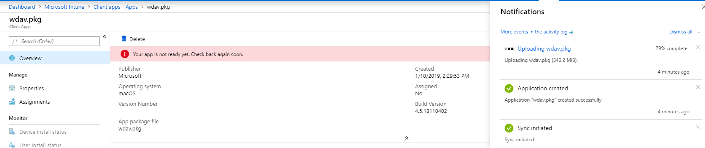

# <a name="intune-based-deployment-for-microsoft-defender-for-endpoint-on-macos"></a>Intune-basierte Bereitstellung für Microsoft Defender for Endpoint unter macOS


[!INCLUDE [Microsoft 365 Defender rebranding](../../includes/microsoft-defender.md)]


> [!NOTE]
> In dieser Dokumentation wird die ältere Methode zum Bereitstellen und Konfigurieren von Microsoft Defender for Endpoint auf macOS-Geräten erläutert. Die systemeigene Benutzererfahrung ist jetzt in der MEM-Konsole verfügbar. Die Veröffentlichung der systemeigenen Benutzeroberfläche in der MEM-Konsole bietet Administratoren eine wesentlich einfachere Möglichkeit, die Anwendung zu konfigurieren und zu bereitstellen und an macOS-Geräte zu senden. <br> <br>
>Der Blogbeitrag [MEM vereinfacht die Bereitstellung von Microsoft Defender for Endpoint für macOS](https://techcommunity.microsoft.com/t5/microsoft-endpoint-manager-blog/microsoft-endpoint-manager-simplifies-deployment-of-microsoft/ba-p/1322995) und erläutert die neuen Features. Um die App zu konfigurieren, wechseln Sie zu [Einstellungen für Microsoft Defender for Endpoint auf macOS in Microsoft InTune](https://docs.microsoft.com/mem/intune/protect/antivirus-microsoft-defender-settings-macos). Um die App bereitzustellen, wechseln Sie zu [Hinzufügen von Microsoft Defender for Endpoint zu macOS-Geräten mithilfe von Microsoft Intune](https://docs.microsoft.com/mem/intune/apps/apps-advanced-threat-protection-macos).

**Gilt für:**

- [Microsoft Defender for Endpoint unter macOS](microsoft-defender-endpoint-mac.md)

In diesem Thema wird beschrieben, wie Sie Microsoft Defender for Endpoint auf macOS über Intune bereitstellen. Für eine erfolgreiche Bereitstellung sind alle folgenden Schritte erforderlich:

1. [Herunterladen von Installations- und Onboardingpaketen](#download-installation-and-onboarding-packages)
1. [Setup des Clientgeräts](#client-device-setup)
1. [Genehmigen von Systemerweiterungen](#approve-system-extensions)
1. [Erstellen von Systemkonfigurationsprofilen](#create-system-configuration-profiles)
1. [Anwendung veröffentlichen](#publish-application)

## <a name="prerequisites-and-system-requirements"></a>Voraussetzungen und Systemanforderungen

Bevor Sie beginnen, finden Sie auf der [Hauptseite von Microsoft Defender for Endpoint auf macOS](microsoft-defender-endpoint-mac.md) eine Beschreibung der Voraussetzungen und Systemanforderungen für die aktuelle Softwareversion.


## <a name="overview"></a>Übersicht

In der folgenden Tabelle sind die Schritte zusammengefasst, die Sie zum Bereitstellen und Verwalten von Microsoft Defender for Endpoint auf Macs über Intune ausführen müssten. Ausführlichere Schritte finden Sie unten.

| Schritt | Beispieldateinamen | BundleIdentifier |
|-|-|-|
| [Herunterladen von Installations- und Onboardingpaketen](#download-installation-and-onboarding-packages) | WindowsDefenderATPOnboarding__MDATP_wdav.atp.xml | com.microsoft.wdav.atp |
| [Genehmigen der Systemerweiterung für Microsoft Defender for Endpoint](#approve-system-extensions) | MDATP_SysExt.xml | Nicht zutreffend |
| [Genehmigen der Kernelerweiterung für Microsoft Defender for Endpoint](#download-installation-and-onboarding-packages) | MDATP_KExt.xml | Nicht zutreffend |
| [Gewähren des vollständigen Datenträgerzugriffs auf Microsoft Defender for Endpoint](#create-system-configuration-profiles-step-8) | MDATP_tcc_Catalina_or_newer.xml | com.microsoft.wdav.tcc |
| [Netzwerkerweiterungsrichtlinie](#create-system-configuration-profiles-step-9) | MDATP_NetExt.xml | Nicht zutreffend |
| [Konfigurieren von Microsoft AutoUpdate (MAU)](https://docs.microsoft.com/microsoft-365/security/defender-endpoint/mac-updates#intune) | MDATP_Microsoft_AutoUpdate.xml | com.microsoft.autoupdate2 |
| [Konfigurationseinstellungen für Microsoft Defender for Endpoint](https://docs.microsoft.com/microsoft-365/security/defender-endpoint/mac-preferences#intune-profile-1)<br/><br/> **Hinweis:** Wenn Sie planen, einen Drittanbieter-AV für macOS ausführen zu können, legen Sie auf `passiveMode` `true` fest. | MDATP_WDAV_and_exclusion_settings_Preferences.xml | com.microsoft.wdav |
| [Konfigurieren von Microsoft Defender für Endpoint- und MS AutoUpdate (MAU)-Benachrichtigungen](#create-system-configuration-profiles-step-10) | MDATP_MDAV_Tray_and_AutoUpdate2.mobileconfig | com.microsoft.autoupdate2 oder com.microsoft.wdav.tray |

## <a name="download-installation-and-onboarding-packages"></a>Herunterladen von Installations- und Onboardingpaketen

Laden Sie die Installations- und Onboardingpakete von Microsoft Defender Security Center herunter:

1. Wechseln Sie im Microsoft Defender Security Center zu **Einstellungen**  >  **Geräteverwaltung**  >  **Onboarding**.

2. Legen Sie das Betriebssystem auf **macOS und** die Bereitstellungsmethode auf **Mobile Device Management /Microsoft Intune .**

    

3. Wählen **Sie Installationspaket herunterladen aus.** Speichern Sie es _als wdav.pkg_ in einem lokalen Verzeichnis.

4. Wählen **Sie Onboardingpaket herunterladen aus.** Speichern Sie es _WindowsDefenderATPOnboardingPackage.zip_ im gleichen Verzeichnis.

5. Laden **Sie IntuneAppUtil von** [https://docs.microsoft.com/intune/lob-apps-macos](https://docs.microsoft.com/intune/lob-apps-macos) herunter.

6. Überprüfen Sie an einer Eingabeaufforderung, ob Sie über die drei Dateien verfügen.
  

    ```bash
    ls -l
    ```

    ```Output
    total 721688
    -rw-r--r--  1 test  staff     269280 Mar 15 11:25 IntuneAppUtil
    -rw-r--r--  1 test  staff      11821 Mar 15 09:23 WindowsDefenderATPOnboardingPackage.zip
    -rw-r--r--  1 test  staff  354531845 Mar 13 08:57 wdav.pkg
    ```
7. Extrahieren Sie den Inhalt der ZIP-Dateien:

    ```bash
    unzip WindowsDefenderATPOnboardingPackage.zip
    ```
    ```Output
    Archive:  WindowsDefenderATPOnboardingPackage.zip
    warning:  WindowsDefenderATPOnboardingPackage.zip appears to use backslashes as path separators
      inflating: intune/kext.xml
      inflating: intune/WindowsDefenderATPOnboarding.xml
      inflating: jamf/WindowsDefenderATPOnboarding.plist
    ```

8. Machen Sie IntuneAppUtil zu einer ausführbaren Datei:

    ```bash
    chmod +x IntuneAppUtil
    ```

9. Erstellen Sie das wdav.pkg.intunemac-Paket aus wdav.pkg:

    ```bash
    ./IntuneAppUtil -c wdav.pkg -o . -i "com.microsoft.wdav" -n "1.0.0"
    ```
    ```Output
    Microsoft Intune Application Utility for Mac OS X
    Version: 1.0.0.0
    Copyright 2018 Microsoft Corporation

    Creating intunemac file for /Users/test/Downloads/wdav.pkg
    Composing the intunemac file output
    Output written to ./wdav.pkg.intunemac.

    IntuneAppUtil successfully processed "wdav.pkg",
    to deploy refer to the product documentation.
    ```

## <a name="client-device-setup"></a>Setup des Clientgeräts

Sie benötigen keine spezielle Bereitstellung für ein Mac-Gerät, das über eine standardmäßige Installation des [Unternehmensportals hinaus geht.](https://docs.microsoft.com/intune-user-help/enroll-your-device-in-intune-macos-cp)

1. Bestätigen Sie die Geräteverwaltung.

   

    Wählen **Sie Systemeinstellungen öffnen** aus, suchen Sie **in** der Liste nach Verwaltungsprofil, und wählen Sie **Genehmigen...** aus. Ihr Verwaltungsprofil wird als Überprüft **angezeigt:**

    

2. Wählen **Sie Weiter** aus, und schließen Sie die Registrierung ab.

   Sie können jetzt weitere Geräte registrieren. Sie können sie auch später registrieren, nachdem Sie die Bereitstellung von Systemkonfigurations- und Anwendungspaketen abgeschlossen haben.

3. Öffnen Sie in Intune **Geräte**  >  **verwalten**  >  **Alle Geräte**. Hier sehen Sie Ihr Gerät unter den aufgeführten:

   > [!div class="mx-imgBorder"]
   > 

## <a name="approve-system-extensions"></a>Genehmigen von Systemerweiterungen

So genehmigen Sie die Systemerweiterungen:

1. Öffnen Sie in Intune **Die**  >  **Gerätekonfiguration verwalten.** Wählen **Sie Profil** erstellen von  >    >  **Profilen verwalten aus.**

2. Wählen Sie einen Namen für das Profil aus. Ändern **Sie Platform=macOS** in **Profile type=Extensions**. Wählen Sie **Erstellen** aus.

3. Geben Sie **auf der Registerkarte** Grundlagen diesem neuen Profil einen Namen.

4. Fügen Sie **auf der** Registerkarte Konfigurationseinstellungen die folgenden Einträge im Abschnitt **Zulässige Systemerweiterungen** hinzu:

    Bundle-ID         | Team-ID
    --------------------------|----------------
    com.microsoft.wdav.epsext | UBF8T346G9
    com.microsoft.wdav.netext | UBF8T346G9

    > [!div class="mx-imgBorder"]
    > 

5. Weisen Sie **auf** der Registerkarte Zuweisungen dieses Profil allen Benutzern & **Allen Geräten zu.**

6. Überprüfen und erstellen Sie dieses Konfigurationsprofil.

## <a name="create-system-configuration-profiles"></a>Erstellen von Systemkonfigurationsprofilen

1. Öffnen Sie in Intune **Die**  >  **Gerätekonfiguration verwalten.** Wählen **Sie Profil** erstellen von  >    >  **Profilen verwalten aus.**

2. Wählen Sie einen Namen für das Profil aus. Ändern **sie Platform=macOS** in **Profile type=Custom**. Wählen Sie **Konfigurieren** aus.

3. Öffnen Sie das Konfigurationsprofil, und laden Sie intune/kext.xml. Diese Datei wurde in einem der vorherigen Abschnitte erstellt.

4. Wählen Sie **OK** aus.

    

5. Wählen **Sie**  >  **Zuordnungen verwalten aus.** Wählen Sie **auf** der Registerkarte Include die Option **Allen Benutzern & Alle Geräte zuweisen aus.**

6. Wiederholen Sie die Schritte 1 bis 5 für weitere Profile.

7. Erstellen Sie ein anderes Profil, geben Sie ihm einen Namen, und laden Sie die intune/WindowsDefenderATPOnboarding.xml hoch.

8. Laden **Sie fulldisk.mobileconfig** aus [unserem GitHub-Repository herunter,](https://raw.githubusercontent.com/microsoft/mdatp-xplat/master/macos/mobileconfig/profiles/fulldisk.mobileconfig) und speichern Sie es unter **tcc.xml**. Erstellen Sie ein anderes Profil, geben Sie ihm einen beliebigen Namen, und laden Sie diese Datei hoch.<a name="create-system-configuration-profiles-step-8" id = "create-system-configuration-profiles-step-8"></a>

   > [!CAUTION]
   > macOS 10.15 (Catalina) enthält neue Sicherheits- und Datenschutzverbesserungen. Ab dieser Version können Anwendungen standardmäßig ohne ausdrückliche Zustimmung nicht auf bestimmte Speicherorte auf dem Datenträger zugreifen (z. B. Dokumente, Downloads, Desktop usw.). In Ermangelung dieser Zustimmung kann Microsoft Defender for Endpoint Ihr Gerät nicht vollständig schützen.
   >
   > Dieses Konfigurationsprofil gewährt Volldatenträgerzugriff auf Microsoft Defender for Endpoint. Wenn Sie Microsoft Defender for Endpoint zuvor über Intune konfiguriert haben, wird empfohlen, die Bereitstellung mit diesem Konfigurationsprofil zu aktualisieren.

9. Im Rahmen der Endpunkterkennungs- und -reaktionsfunktionen prüft Microsoft Defender for Endpoint auf macOS den Socketdatenverkehr und meldet diese Informationen an das Microsoft Defender Security Center-Portal. Mit der folgenden Richtlinie kann die Netzwerkerweiterung diese Funktionalität ausführen. Laden **Sie netfilter.mobileconfig** aus unserem [GitHub-Repository](https://raw.githubusercontent.com/microsoft/mdatp-xplat/master/macos/mobileconfig/profiles/netfilter.mobileconfig)herunter, speichern Sie es unter netext.xml und stellen Sie es mithilfe der gleichen Schritte wie in den vorherigen Abschnitten bereit. <a name = "create-system-configuration-profiles-step-9" id = "create-system-configuration-profiles-step-9"></a>

10. Um Microsoft Defender for Endpoint unter macOS und Microsoft Auto Update das Anzeigen von Benachrichtigungen in der Benutzeroberfläche unter macOS 10.15 (Catalina) zu ermöglichen, laden Sie es aus unserem `notif.mobileconfig` [GitHub-Repository](https://raw.githubusercontent.com/microsoft/mdatp-xplat/master/macos/mobileconfig/profiles/notif.mobileconfig) herunter, und importieren Sie es als benutzerdefinierte Nutzlast. <a name = "create-system-configuration-profiles-step-10" id = "create-system-configuration-profiles-step-10"></a>

11. Wählen **Sie Verwalten > Zuordnungen aus.**  Wählen Sie **auf** der Registerkarte Include die Option **Allen Benutzern & Alle Geräte zuweisen aus.**

Sobald die Intune-Änderungen an die registrierten Geräte übertragen wurden, werden sie unter **Monitor**  >  **Device status aufgeführt:**

> [!div class="mx-imgBorder"]
> 

## <a name="publish-application"></a>Anwendung veröffentlichen

1. Öffnen Sie in Intune das **Blatt > Client-Apps verwalten.** Wählen **Sie Apps > Hinzufügen aus.**

2. Wählen **Sie App type=Other/Line-of-Business App aus.**

3. Wählen **Sie file=wdav.pkg.intunemac aus.** Wählen Sie **OK** aus, um es hochzuladen.

4. Wählen **Sie Konfigurieren** aus, und fügen Sie die erforderlichen Informationen hinzu.

5. Verwenden **Sie macOS High Sierra 10.14** als Mindestbetriebssystem.

6. Legen *Sie Die App-Version ignorieren auf* Ja **.** Andere Einstellungen können beliebige Werte sein.

    > [!CAUTION]
    > Festlegen *der App-Version ignorieren* auf **Keine** Auswirkung auf die Fähigkeit der Anwendung, Updates über Microsoft AutoUpdate zu erhalten. Weitere Informationen zur Produktaktualisierung finden Sie unter Bereitstellen von Updates für Microsoft Defender for Endpoint unter [macOS.](mac-updates.md)
    >
    > Wenn die von Intune hochgeladene Version niedriger als die Version auf dem Gerät ist, wird die niedrigere Version installiert, und Microsoft Defender for Endpoint wird degradiert. Dies kann zu einer nicht funktionsfähigen Anwendung führen. Weitere Informationen zur Produktaktualisierung finden Sie unter Bereitstellen von Updates für Microsoft Defender for Endpoint unter [macOS.](mac-updates.md) Wenn Sie Microsoft Defender for Endpoint mit *der App-Version Ignorieren* auf **Nein** bereitgestellt haben, ändern Sie sie bitte in **Ja**. Wenn Microsoft Defender for Endpoint weiterhin nicht auf einem Clientgerät installiert werden kann, deinstallieren Sie Microsoft Defender for Endpoint, und drücken Sie die aktualisierte Richtlinie.
     
    > [!div class="mx-imgBorder"]
    > 

7. Wählen **Sie OK** und Hinzufügen **aus.**

    > [!div class="mx-imgBorder"]
    > 

8. Es kann einige Minuten dauern, bis das Paket hochgeladen wird. Wählen Sie anschließend das Paket aus der Liste aus, und wechseln Sie zu **Zuordnungen** und **Gruppe hinzufügen.**

    > [!div class="mx-imgBorder"]
    > 

9. Ändern **des Zuweisungstyps** in **Erforderlich**.

10. Wählen **Sie Eingeschlossene Gruppen aus.** Wählen **Sie Diese App für alle Geräte erforderlich machen=Ja aus.** Wählen **Sie Gruppe auswählen aus, um eine** Gruppe hinzuzufügen und hinzuzufügen, die die Benutzer enthält, die Sie als Ziel auswählen möchten. Wählen Sie **OK** und **Speichern aus.**

    > [!div class="mx-imgBorder"]
    > 

11. Nach einiger Zeit wird die Anwendung auf allen registrierten Geräten veröffentlicht. Sie finden sie unter **Monitor**  >  **Device**, under **Device install status**:

    > [!div class="mx-imgBorder"]
    > 

## <a name="verify-client-device-state"></a>Überprüfen des Clientgerätestatus

1. Nachdem die Konfigurationsprofile auf Ihren Geräten bereitgestellt wurden, öffnen Sie **Systemeinstellungsprofile**  >  **auf** Ihrem Mac-Gerät.

    <br/>
    

2. Stellen Sie sicher, dass die folgenden Konfigurationsprofile vorhanden und installiert sind. Das **Verwaltungsprofil** sollte das Intune-Systemprofil sein. _Wdav-config_ und _wdav-kext_ sind Systemkonfigurationsprofile, die in Intune hinzugefügt 

3. Außerdem sollte das Microsoft Defender-Symbol in der oberen rechten Ecke angezeigt werden:

    > [!div class="mx-imgBorder"]
    > 

## <a name="troubleshooting"></a>Problembehandlung

Problem: Keine Lizenz gefunden

Lösung: Führen Sie die obigen Schritte aus, um ein Geräteprofil mithilfe von WindowsDefenderATPOnboarding.xml

## <a name="logging-installation-issues"></a>Probleme bei der Protokollierung der Installation

Weitere Informationen zum Suchen des automatisch generierten Protokolls, das beim Auftreten eines Fehlers vom Installationsprogramm erstellt wird, finden Sie unter [Logging installation issues](mac-resources.md#logging-installation-issues).

## <a name="uninstallation"></a>Deinstallation

Weitere [Informationen zum Entfernen](mac-resources.md#uninstalling) von Microsoft Defender for Endpoint auf macOS von Clientgeräten finden Sie unter Deinstallieren.
