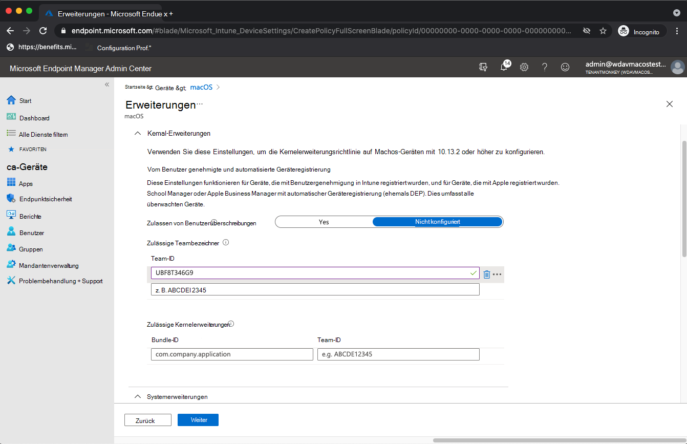
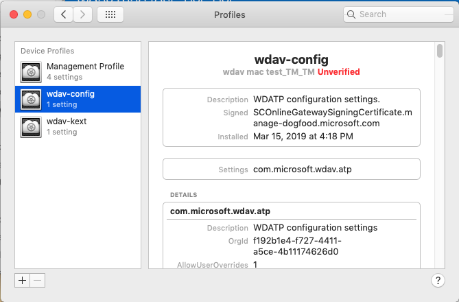

# <a name="intune-based-deployment-for-microsoft-defender-for-endpoint-on-macos"></a>Intune-basierte Bereitstellung für Microsoft Defender for Endpoint unter macOS

[!INCLUDE [Microsoft 365 Defender rebranding](../../includes/microsoft-defender.md)]

**Gilt für:**

- [Microsoft Defender für Endpunkt unter Mac OS](microsoft-defender-endpoint-mac.md)

In diesem Thema wird beschrieben, wie Sie Microsoft Defender for Endpoint auf macOS über Intune bereitstellen. Für eine erfolgreiche Bereitstellung sind alle folgenden Schritte erforderlich:

1. [Herunterladen des Onboardingpakets](#download-the-onboarding-package)
1. [Setup des Clientgeräts](#client-device-setup)
1. [Genehmigen von Systemerweiterungen](#approve-system-extensions)
1. [Erstellen von Systemkonfigurationsprofilen](#create-system-configuration-profiles)
1. [Anwendung veröffentlichen](#publish-application)

## <a name="prerequisites-and-system-requirements"></a>Voraussetzungen und Systemanforderungen

Bevor Sie beginnen, finden Sie auf der [Hauptseite von Microsoft Defender for Endpoint auf macOS](microsoft-defender-endpoint-mac.md) eine Beschreibung der Voraussetzungen und Systemanforderungen für die aktuelle Softwareversion.

## <a name="overview"></a>Übersicht

In der folgenden Tabelle sind die Schritte zusammengefasst, die Sie zum Bereitstellen und Verwalten von Microsoft Defender for Endpoint auf Macs über Intune ausführen müssten. Ausführlichere Schritte finden Sie unten.

| Schritt | Beispieldateinamen | BundleIdentifier |
|-|-|-|
| [Herunterladen des Onboardingpakets](#download-the-onboarding-package) | WindowsDefenderATPOnboarding__MDATP_wdav.atp.xml | com.microsoft.wdav.atp |
| [Genehmigen der Systemerweiterung für Microsoft Defender for Endpoint](#approve-system-extensions) | MDATP_SysExt.xml | Nicht zutreffend |
| [Genehmigen der Kernelerweiterung für Microsoft Defender for Endpoint](#download-the-onboarding-package) | MDATP_KExt.xml | Nicht zutreffend |
| [Gewähren des vollständigen Datenträgerzugriffs auf Microsoft Defender for Endpoint](#full-disk-access) | MDATP_tcc_Catalina_or_newer.xml | com.microsoft.wdav.tcc |
| [Netzwerkerweiterungsrichtlinie](#network-filter) | MDATP_NetExt.xml | Nicht zutreffend |
| [Konfigurieren von Microsoft AutoUpdate (MAU)](mac-updates.md#intune) | MDATP_Microsoft_AutoUpdate.xml | com.microsoft.autoupdate2 |
| [Konfigurationseinstellungen für Microsoft Defender for Endpoint](mac-preferences.md#intune-profile-1)<br/><br/> **Hinweis:** Wenn Sie planen, einen Drittanbieter-AV für macOS ausführen zu können, legen Sie auf `passiveMode` `true` fest. | MDATP_WDAV_and_exclusion_settings_Preferences.xml | com.microsoft.wdav |
| [Konfigurieren von Microsoft Defender für Endpoint- und MS AutoUpdate (MAU)-Benachrichtigungen](mac-updates.md) | MDATP_MDAV_Tray_and_AutoUpdate2.mobileconfig | com.microsoft.autoupdate2 oder com.microsoft.wdav.tray |


## <a name="download-the-onboarding-package"></a>Herunterladen des Onboardingpakets

Laden Sie die Onboardingpakete von Microsoft Defender Security Center:

1. In Microsoft Defender Security Center wechseln Sie zu **Einstellungen**  >  **Device Management**  >  **Onboarding**.

2. Legen Sie das Betriebssystem auf **macOS und** die Bereitstellungsmethode auf **Mobile Device Management /Microsoft Intune.**

    

3. Wählen **Sie Onboardingpaket herunterladen aus.** Speichern Sie es _WindowsDefenderATPOnboardingPackage.zip_ im gleichen Verzeichnis.

4. Extrahieren Sie den Inhalt der .zip Datei:

    ```bash
    unzip WindowsDefenderATPOnboardingPackage.zip
    ```
    ```Output
    Archive:  WindowsDefenderATPOnboardingPackage.zip
    warning:  WindowsDefenderATPOnboardingPackage.zip appears to use backslashes as path separators
      inflating: intune/kext.xml
      inflating: intune/WindowsDefenderATPOnboarding.xml
      inflating: jamf/WindowsDefenderATPOnboarding.plist
    ```

## <a name="create-system-configuration-profiles"></a>Erstellen von Systemkonfigurationsprofilen

Der nächste Schritt besteht im Erstellen von Systemkonfigurationsprofilen, die Microsoft Defender for Endpoint benötigt.
Öffnen Sie [Microsoft Endpoint Manager Admin Center](https://endpoint.microsoft.com/) **gerätekonfigurationsprofile**  >  .

### <a name="onboarding-blob"></a>Onboarding-Blob

Dieses Profil enthält lizenzinformationen für Microsoft Defender for Endpoint, ohne dass es darüber informiert wird, dass es nicht lizenziert ist.

1. Wählen **Sie Profil erstellen** unter **Konfigurationsprofile aus.**
1. Wählen **Sie Plattform** = **macOS**, **Profiltyp** = **Vorlagen aus.** **Vorlagenname** = **Benutzerdefinierte .** Klicken Sie auf **Erstellen**.

    > [!div class="mx-imgBorder"]
    > 

1. Wählen Sie einen Namen für das Profil aus, z. B. "MDATP Onboarding für macOS". Klicken Sie auf **Weiter**.

    > [!div class="mx-imgBorder"]
    > 

1. Wählen Sie einen Namen für den Konfigurationsprofilnamen aus, z. B. "MDATP für macOS".
1. Wählen Sie intune/WindowsDefenderATPOnboarding.xml, die Sie aus dem obigen Onboardingpaket als Konfigurationsprofildatei extrahiert haben.

    > [!div class="mx-imgBorder"]
    > 

1. Klicken Sie auf **Weiter**.
1. Zuweisen von Geräten auf der **Registerkarte Zuordnung.** Klicken Sie auf **Weiter**.

    > [!div class="mx-imgBorder"]
    > 

1. Überprüfen und **Erstellen** von .
1. Öffnen **Sie**  >  **GeräteKonfigurationsprofile,** sie können Ihr erstelltes Profil dort sehen.

    > [!div class="mx-imgBorder"]
    > 

### <a name="approve-system-extensions"></a>Genehmigen von Systemerweiterungen

Dieses Profil ist für macOS 10.15 (Catalina) oder neuer erforderlich. Er wird auf älteren macOS ignoriert.

1. Wählen **Sie Profil erstellen** unter **Konfigurationsprofile aus.**
1. Wählen **Sie Plattform** = **macOS**, **Profiltyp** = **Vorlagen aus.** **Vorlagenname** = **Erweiterungen**. Klicken Sie auf **Erstellen**.
1. Geben Sie **auf der Registerkarte** Grundlagen diesem neuen Profil einen Namen.
1. Erweitern Sie **auf der** Registerkarte Konfigurationseinstellungen **die Folgenden** Einträge im Abschnitt Zulässige **Systemerweiterungen:**

    Bundle-ID         | Team-ID
    --------------------------|----------------
    com.microsoft.wdav.epsext | UBF8T346G9
    com.microsoft.wdav.netext | UBF8T346G9

    > [!div class="mx-imgBorder"]
    > 

1. Weisen Sie **auf** der Registerkarte Zuweisungen dieses Profil allen Benutzern & **Allen Geräten zu.**
1. Überprüfen und erstellen Sie dieses Konfigurationsprofil.

### <a name="kernel-extensions"></a>Kernelerweiterungen

Dieses Profil ist für macOS 10.15 (Catalina) oder älter erforderlich. Sie wird unter neueren macOS ignoriert.

> [!CAUTION]
> Apple Silicon (M1)-Geräte unterstützen KEXT nicht. Bei der Installation eines Konfigurationsprofils, das aus KEXT-Richtlinien besteht, wird auf diesen Geräten ein Fehler angezeigt.

1. Wählen **Sie Profil erstellen** unter **Konfigurationsprofile aus.**
1. Wählen **Sie Plattform** = **macOS**, **Profiltyp** = **Vorlagen aus.** **Vorlagenname** = **Erweiterungen**. Klicken Sie auf **Erstellen**.
1. Geben Sie **auf der Registerkarte** Grundlagen diesem neuen Profil einen Namen.
1. Erweitern Sie **auf der Registerkarte** Konfigurationseinstellungen die Erweiterung **Kernelerweiterungen**.
1. Legen **Sie den Teambezeichner** **auf UBF8T346G9 und** klicken Sie auf **Weiter**.

    > [!div class="mx-imgBorder"]
    > 

1. Weisen Sie **auf** der Registerkarte Zuweisungen dieses Profil allen Benutzern & **Allen Geräten zu.**
1. Überprüfen und erstellen Sie dieses Konfigurationsprofil.

### <a name="full-disk-access"></a>Vollständiger Festplattenzugriff

   > [!CAUTION]
   > macOS 10.15 (Catalina) enthält neue Sicherheits- und Datenschutzverbesserungen. Ab dieser Version können Anwendungen standardmäßig ohne ausdrückliche Zustimmung nicht auf bestimmte Speicherorte auf dem Datenträger zugreifen (z. B. Dokumente, Downloads, Desktop usw.). In Ermangelung dieser Zustimmung kann Microsoft Defender for Endpoint Ihr Gerät nicht vollständig schützen.
   >
   > Dieses Konfigurationsprofil gewährt Volldatenträgerzugriff auf Microsoft Defender for Endpoint. Wenn Sie Microsoft Defender for Endpoint zuvor über Intune konfiguriert haben, wird empfohlen, die Bereitstellung mit diesem Konfigurationsprofil zu aktualisieren.

Laden [**Sie fulldisk.mobileconfig**](https://raw.githubusercontent.com/microsoft/mdatp-xplat/master/macos/mobileconfig/profiles/kext.mobileconfig) aus [unserem GitHub herunter.](https://github.com/microsoft/mdatp-xplat/tree/master/macos/mobileconfig/profiles)

Befolgen Sie die Anweisungen für [das Onboarding-Blob](#onboarding-blob) von oben, indem Sie "MDATP Full Disk Access" als Profilnamen verwenden und **fulldisk.mobileconfig** als Konfigurationsprofilnamen heruntergeladen haben.

### <a name="network-filter"></a>Netzwerkfilter

Im Rahmen der Funktionen für die Erkennung und Reaktion von Endpunkten prüft Microsoft Defender for Endpoint auf macOS den Socketdatenverkehr und meldet diese Informationen Microsoft Defender Security Center Portal. Mit der folgenden Richtlinie kann die Netzwerkerweiterung diese Funktionalität ausführen.

Laden [**Sie netfilter.mobileconfig**](https://raw.githubusercontent.com/microsoft/mdatp-xplat/master/macos/mobileconfig/profiles/kext.mobileconfig) aus [unserem GitHub herunter.](https://github.com/microsoft/mdatp-xplat/tree/master/macos/mobileconfig/profiles)

Befolgen Sie die Anweisungen für [das Onboarding-Blob](#onboarding-blob) von oben, indem Sie "MDATP Network Filter" als Profilnamen verwenden und **netfilter.mobileconfig** als Konfigurationsprofilnamen heruntergeladen haben.

### <a name="notifications"></a>Benachrichtigungen

Dieses Profil wird verwendet, um Microsoft Defender for Endpoint unter macOS und Microsoft Auto Update das Anzeigen von Benachrichtigungen in der Benutzeroberfläche unter macOS 10.15 (Catalina) oder neuer zu ermöglichen.

Laden [**Sie notif.mobileconfig**](https://raw.githubusercontent.com/microsoft/mdatp-xplat/master/macos/mobileconfig/profiles/kext.mobileconfig) aus [unserem GitHub herunter.](https://github.com/microsoft/mdatp-xplat/tree/master/macos/mobileconfig/profiles)

Befolgen Sie die Anweisungen für [das Onboarding-Blob](#onboarding-blob) von oben, indem Sie "MDATP Netzwerkfilter" als Profilnamen verwenden und **notif.mobileconfig** als Konfigurationsprofilnamen heruntergeladen haben.

### <a name="view-status"></a>Status anzeigen

Sobald die Intune-Änderungen an die registrierten Geräte übertragen wurden, werden sie unter **Monitor**  >  **Device status aufgeführt:**

> [!div class="mx-imgBorder"]
> 

## <a name="publish-application"></a>Anwendung veröffentlichen

Dieser Schritt ermöglicht die Bereitstellung von Microsoft Defender for Endpoint auf registrierten Computern.

1. Öffnen Sie [im Microsoft Endpoint Manager Admin Center](https://endpoint.microsoft.com/) **Apps**.

    > [!div class="mx-imgBorder"]
    > 

1. Wählen Sie Nach Plattform > macOS > Hinzufügen aus.
1. Wählen **Sie App-Typ** = **macOS** aus, klicken Sie auf **Auswählen**.

    > [!div class="mx-imgBorder"]
    > 

1. Halten Sie die Standardwerte bei, klicken Sie auf **Weiter**.

    > [!div class="mx-imgBorder"]
    > 

1. Fügen Sie Zuordnungen hinzu, klicken Sie auf **Weiter**.

    > [!div class="mx-imgBorder"]
    > 

1. Überprüfen und **Erstellen** von .
1. Sie können **Apps**  >  **nach Plattform**  >  **macOS besuchen,** um es in der Liste aller Anwendungen zu sehen.

    > [!div class="mx-imgBorder"]
    > 

(Ausführliche Informationen finden Sie auf der [Intune-Seite für die Defender-Bereitstellung.)](/mem/intune/apps/apps-advanced-threat-protection-macos)

   > [!CAUTION]
   > Sie müssen alle erforderlichen Konfigurationsprofile erstellen und wie oben erläutert auf allen Computern pushen.

## <a name="client-device-setup"></a>Setup des Clientgeräts

Sie benötigen keine spezielle Bereitstellung für ein Mac-Gerät, das über eine Standardinstallation [Unternehmensportal hinaus geht.](/intune-user-help/enroll-your-device-in-intune-macos-cp)

1. Bestätigen Sie die Geräteverwaltung.

    > [!div class="mx-imgBorder"]
    > 

    Wählen **Sie Systemeinstellungen öffnen** aus, suchen Sie **in** der Liste nach Verwaltungsprofil, und wählen Sie **Genehmigen...** aus. Ihr Verwaltungsprofil wird als Überprüft **angezeigt:**

    

2. Wählen **Sie Weiter** aus, und schließen Sie die Registrierung ab.

   Sie können jetzt weitere Geräte registrieren. Sie können sie auch später registrieren, nachdem Sie die Bereitstellung von Systemkonfigurations- und Anwendungspaketen abgeschlossen haben.

3. Öffnen Sie in Intune **Geräte**  >  **verwalten**  >  **Alle Geräte**. Hier sehen Sie Ihr Gerät unter den aufgeführten:

   > [!div class="mx-imgBorder"]
   > 

## <a name="verify-client-device-state"></a>Überprüfen des Clientgerätestatus

1. Nachdem die Konfigurationsprofile auf Ihren Geräten bereitgestellt wurden, öffnen Sie **Systemeinstellungsprofile**  >  **auf** Ihrem Mac-Gerät.

    > [!div class="mx-imgBorder"]
    > 

    

2. Stellen Sie sicher, dass die folgenden Konfigurationsprofile vorhanden und installiert sind. Das **Verwaltungsprofil** sollte das Intune-Systemprofil sein. _Wdav-config_ und _wdav-kext_ sind Systemkonfigurationsprofile, die in Intune hinzugefügt wurden:

    

3. Außerdem sollte das Microsoft Defender for Endpoint-Symbol in der oberen rechten Ecke angezeigt werden:

    > [!div class="mx-imgBorder"]
    > 

## <a name="troubleshooting"></a>Problembehandlung

Problem: Es wurde keine Lizenz gefunden.

Lösung: Führen Sie die obigen Schritte aus, um ein Geräteprofil mithilfe von WindowsDefenderATPOnboarding.xml.

## <a name="logging-installation-issues"></a>Probleme bei der Protokollierung der Installation

Weitere Informationen zum Suchen des automatisch generierten Protokolls, das beim Auftreten eines Fehlers vom Installationsprogramm erstellt wird, finden Sie unter [Logging installation issues](mac-resources.md#logging-installation-issues).

## <a name="uninstallation"></a>Deinstallation

Weitere [Informationen zum Entfernen](mac-resources.md#uninstalling) von Microsoft Defender for Endpoint auf macOS von Clientgeräten finden Sie unter Deinstallieren.
