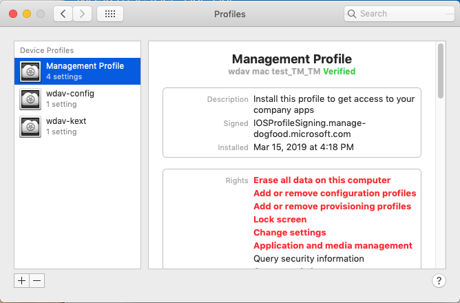

# <a name="intune-based-deployment-for-microsoft-defender-for-endpoint-on-macos"></a>Intune-basierte Bereitstellung für Microsoft Defender für Endpunkt unter macOS

[!INCLUDE [Microsoft 365 Defender rebranding](../../includes/microsoft-defender.md)]

**Gilt für:**

- [Microsoft Defender für Endpunkt unter Mac OS](microsoft-defender-endpoint-mac.md)

In diesem Thema wird beschrieben, wie Sie Microsoft Defender für Endpunkt unter macOS über Intune bereitstellen. Für eine erfolgreiche Bereitstellung müssen alle folgenden Schritte abgeschlossen sein:

1. [Herunterladen des Onboardingpakets](#download-the-onboarding-package)
1. [Setup des Clientgeräts](#client-device-setup)
1. [Genehmigen von Systemerweiterungen](#approve-system-extensions)
1. [Erstellen von Systemkonfigurationsprofilen](#create-system-configuration-profiles)
1. [Anwendung veröffentlichen](#publish-application)

## <a name="prerequisites-and-system-requirements"></a>Voraussetzungen und Systemanforderungen

Beachten Sie vor dem Start [die Hauptseite „Microsoft Defender für Endpunkt auf macOS“](microsoft-defender-endpoint-mac.md) für eine Beschreibung der Voraussetzungen und Systemanforderungen für die aktuelle Softwareversion.

## <a name="overview"></a>Überblick

In der folgenden Tabelle sind die Schritte zusammengefasst, die Sie ausführen müssen, um Microsoft Defender für Endpunkt auf Macs über Intune bereitzustellen und zu verwalten. Ausführlichere Schritte finden Sie unten.

| Schritt | Beispieldateinamen | BundleIdentifier |
|-|-|-|
| [Herunterladen des Onboardingpakets](#download-the-onboarding-package) | WindowsDefenderATPOnboarding__MDATP_wdav.atp.xml | com.microsoft.wdav.atp |
| [Genehmigen der Systemerweiterung für Microsoft Defender für Endpunkt](#approve-system-extensions) | MDATP_SysExt.xml | – |
| [Genehmigen der Kernelerweiterung für Microsoft Defender für Endpunkt](#download-the-onboarding-package) | MDATP_KExt.xml | – |
| [Gewähren des vollständigen Datenträgerzugriffs auf Microsoft Defender für Endpunkt](#full-disk-access) | MDATP_tcc_Catalina_or_newer.xml | com.microsoft.wdav.tcc |
| [Netzwerkerweiterungsrichtlinie](#network-filter) | MDATP_NetExt.xml | – |
| [Konfigurieren von Microsoft AutoUpdate (MAU)](mac-updates.md#intune) | MDATP_Microsoft_AutoUpdate.xml | com.microsoft.autoupdate2 |
| [Konfigurationseinstellungen für Microsoft Defender für Endpunkt](mac-preferences.md#intune-profile-1)<br/><br/> **Hinweis:** Wenn Sie planen, eine AV-Datei eines Drittanbieters für macOS auszuführen, legen Sie `passiveMode` dies auf `true` fest. | MDATP_WDAV_and_exclusion_settings_Preferences.xml | com.microsoft.wdav |
| [Konfigurieren von Microsoft Defender für Endpunkt- und MS AutoUpdate (MAU)-Benachrichtigungen](mac-updates.md) | MDATP_MDAV_Tray_and_AutoUpdate2.mobileconfig | com.microsoft.autoupdate2 oder com.microsoft.wdav.tray |


## <a name="download-the-onboarding-package"></a>Herunterladen des Onboardingpakets

Laden Sie die Onboardingpakete aus Microsoft Defender Security Center herunter:

1. Wechseln Sie in Microsoft Defender Security Center zu **Einstellungen**  >  **Geräteverwaltungs-Onboarding.**  >  

2. Legen Sie das Betriebssystem auf **macOS** und die Bereitstellungsmethode auf **Mobile Device Management/Microsoft Intune** fest.

    

3. Wählen Sie **"Onboardingpaket herunterladen"** aus. Speichern Sie es als _WindowsDefenderATPOnboardingPackage.zip_ im selben Verzeichnis.

4. Extrahieren Sie den Inhalt der .zip Datei:

    ```bash
    unzip WindowsDefenderATPOnboardingPackage.zip
    ```
    ```Output
    Archive:  WindowsDefenderATPOnboardingPackage.zip
    warning:  WindowsDefenderATPOnboardingPackage.zip appears to use backslashes as path separators
      inflating: intune/kext.xml
      inflating: intune/WindowsDefenderATPOnboarding.xml
      inflating: jamf/WindowsDefenderATPOnboarding.plist
    ```

## <a name="create-system-configuration-profiles"></a>Erstellen von Systemkonfigurationsprofilen

Der nächste Schritt besteht darin, Systemkonfigurationsprofile zu erstellen, die Microsoft Defender für Endpunkt benötigt.
Öffnen [Sie](https://endpoint.microsoft.com/)im Microsoft Endpoint Manager Admin Center die   >  **Gerätekonfigurationsprofile.**

### <a name="onboarding-blob"></a>Onboarding-Blob

Dieses Profil enthält eine Lizenzinformationen für Microsoft Defender für Endpunkt, ohne dass es meldet, dass es nicht lizenziert ist.

1. Wählen Sie **"Profil erstellen"** unter **"Konfigurationsprofile" aus.**
1. Wählen Sie **Plattform** = **macOS**, **Profiltypvorlagen** = . **Vorlagenname** = **Benutzerdefinierte**. Klicken Sie auf **Erstellen**.

    > [!div class="mx-imgBorder"]
    > 

1. Wählen Sie einen Namen für das Profil aus, z. B. "MDE-Onboarding für macOS". Klicken Sie auf **Weiter**.

    > [!div class="mx-imgBorder"]
    > 

1. Wählen Sie einen Namen für den Konfigurationsprofilnamen aus, z. B. "MDE-Onboarding für macOS".
1. Wählen Sie intune/WindowsDefenderATPOnboarding.xml aus, die Sie aus dem obigen Onboardingpaket als Konfigurationsprofildatei extrahiert haben.

    > [!div class="mx-imgBorder"]
    > 

1. Klicken Sie auf **Weiter**.
1. Weisen Sie Geräte auf der Registerkarte **"Zuordnung" zu.** Klicken Sie auf **"Weiter".**

    > [!div class="mx-imgBorder"]
    > 

1. Überprüfen und **Erstellen .**
1. Öffnen Sie  >  **Gerätekonfigurationsprofile,** dort können Sie Ihr erstelltes Profil sehen.

    > [!div class="mx-imgBorder"]
    > 

### <a name="approve-system-extensions"></a>Genehmigen von Systemerweiterungen

Dieses Profil wird für macOS 10.15 (Gif) oder höher benötigt. Sie wird unter älteren macOS ignoriert.

1. Wählen Sie **"Profil erstellen"** unter **"Konfigurationsprofile" aus.**
1. Wählen Sie **Plattform** = **macOS**, **Profiltypvorlagen** = . **Vorlagenname** = **Erweiterungen**. Klicken Sie auf **Erstellen**.
1. Geben Sie auf der Registerkarte **"Grundlagen"** diesem neuen Profil einen Namen.
1. Erweitern Sie auf der Registerkarte **"Konfigurationseinstellungen"** **systemerweiterungen** die folgenden Einträge im Abschnitt **"Zugelassene Systemerweiterungen":**

    Bündelbezeichner         | Teambezeichner
    --------------------------|----------------
    com.microsoft.wdav.epsext | UBF8T346G9
    com.microsoft.wdav.netext | UBF8T346G9

    > [!div class="mx-imgBorder"]
    > 

1. Weisen Sie dieses Profil auf der Registerkarte **Aufgaben** allen Benutzern & allen **Geräten** zu.
1. Überprüfen und erstellen Sie dieses Konfigurationsprofil.

### <a name="kernel-extensions"></a>Kernelerweiterungen

Dieses Profil wird für macOS 10.15 (Macintosh) oder älter benötigt. Sie wird unter neueren macOS ignoriert.

> [!CAUTION]
> Apple Silicon (M1)-Geräte unterstützen KEXT nicht. Die Installation eines Konfigurationsprofils, das aus KEXT-Richtlinien besteht, schlägt auf diesen Geräten fehl.

1. Wählen Sie **"Profil erstellen"** unter **"Konfigurationsprofile" aus.**
1. Wählen Sie **Plattform** = **macOS**, **Profiltypvorlagen** = . **Vorlagenname** = **Erweiterungen**. Klicken Sie auf **Erstellen**.
1. Geben Sie auf der Registerkarte **"Grundlagen"** diesem neuen Profil einen Namen.
1. Erweitern Sie auf der Registerkarte **"Konfigurationseinstellungen"** **die Kernelerweiterungen.**
1. Legen Sie **den Teambezeichner** auf **UBF8T346G9** fest, und klicken Sie auf **"Weiter".**

    > [!div class="mx-imgBorder"]
    > 

1. Weisen Sie dieses Profil auf der Registerkarte **Aufgaben** allen Benutzern & allen **Geräten** zu.
1. Überprüfen und erstellen Sie dieses Konfigurationsprofil.

### <a name="full-disk-access"></a>Vollzugriff auf Datenträger

   > [!CAUTION]
   > macOS 10.15 (Catalina) enthält neue Sicherheits- und Datenschutzerweiterungen. Ab dieser Version sind Anwendungen standardmäßig nicht in der Lage, ohne ausdrückliche Zustimmung auf bestimmte Speicherorte auf dem Disk zuzugreifen (wie Dokumente, Downloads, Desktop usw.). Wenn diese Zustimmung nicht vorhanden ist, kann Microsoft Defender für Endpunkt Ihr Gerät nicht vollständig schützen.
   >
   > Dieses Konfigurationsprofil gewährt Volldatenträgerzugriff auf Microsoft Defender für Endpunkt. Wenn Sie Zuvor Microsoft Defender für Endpunkt über Intune konfiguriert haben, empfehlen wir, die Bereitstellung mit diesem Konfigurationsprofil zu aktualisieren.

Laden Sie [**fulldisk.mobileconfig**](https://raw.githubusercontent.com/microsoft/mdatp-xplat/master/macos/mobileconfig/profiles/fulldisk.mobileconfig) aus [unserem GitHub-Repository](https://github.com/microsoft/mdatp-xplat/tree/master/macos/mobileconfig/profiles)herunter.

Folgen Sie den Anweisungen für das [Onboarding](#onboarding-blob) von BLOB von oben, wobei Sie "MDE Full Disk Access" als Profilnamen verwenden und **"fulldisk.mobileconfig"** als Konfigurationsprofilnamen heruntergeladen haben.

### <a name="network-filter"></a>Netzwerkfilter

Als Teil der Funktionen für Endpunkterkennung und -reaktion prüft Microsoft Defender für Endpunkt unter macOS socket-Datenverkehr und meldet diese Informationen an das Microsoft Defender Security Center Portal. Mit der folgenden Richtlinie kann die Netzwerkerweiterung diese Funktionalität ausführen.

Laden Sie [**"netfilter.mobileconfig"**](https://raw.githubusercontent.com/microsoft/mdatp-xplat/master/macos/mobileconfig/profiles/netfilter.mobileconfig) aus [unserem GitHub-Repository](https://github.com/microsoft/mdatp-xplat/tree/master/macos/mobileconfig/profiles)herunter.

Folgen Sie den Anweisungen für das [Onboarding](#onboarding-blob) von BLOB von oben, wobei Sie "MDE-Netzwerkfilter" als Profilnamen verwenden und **"netfilter.mobileconfig"** als Konfigurationsprofilnamen heruntergeladen haben.

### <a name="notifications"></a>Benachrichtigungen

Dieses Profil wird verwendet, damit Microsoft Defender für Endpunkt unter macOS und Microsoft Auto Update Benachrichtigungen auf der Benutzeroberfläche unter macOS 10.15 (Gif) oder höher anzeigen kann.

Laden Sie [**"notif.mobileconfig"**](https://raw.githubusercontent.com/microsoft/mdatp-xplat/master/macos/mobileconfig/profiles/notif.mobileconfig) aus [unserem GitHub-Repository herunter.](https://github.com/microsoft/mdatp-xplat/tree/master/macos/mobileconfig/profiles)

Folgen Sie den Anweisungen für das [Onboarding](#onboarding-blob) von BLOB von oben, wobei Sie "MDE-Benachrichtigungen" als Profilnamen verwenden und **"notif.mobileconfig"** als Konfigurationsprofilnamen heruntergeladen haben.

### <a name="view-status"></a>Status anzeigen

Sobald die Intune-Änderungen an die registrierten Geräte weitergegeben wurden, werden sie unter **"Gerätestatus überwachen"**  >  aufgeführt:

> [!div class="mx-imgBorder"]
> 

## <a name="publish-application"></a>Anwendung veröffentlichen

Dieser Schritt ermöglicht die Bereitstellung von Microsoft Defender für Endpunkt auf registrierten Computern.

1. Öffnen [Sie](https://endpoint.microsoft.com/)im Microsoft Endpoint Manager Admin Center **Apps**.

    > [!div class="mx-imgBorder"]
    > 

1. Wählen Sie "Nach Plattform > macOS > Hinzufügen" aus.
1. Wählen Sie **App-Typ** = **macOS** aus, klicken Sie auf **"Auswählen".**

    > [!div class="mx-imgBorder"]
    > 

1. Behalten Sie die Standardwerte bei, und klicken Sie auf **"Weiter".**

    > [!div class="mx-imgBorder"]
    > 

1. Fügen Sie Zuordnungen hinzu, klicken Sie auf **"Weiter".**

    > [!div class="mx-imgBorder"]
    > 

1. Überprüfen und **Erstellen .**
1. Sie können **Apps**  >  **nach Plattform**  >  **macOS** besuchen, um es in der Liste aller Anwendungen anzuzeigen.

    > [!div class="mx-imgBorder"]
    > 

(Ausführliche Informationen finden Sie auf der [Intune-Seite für die Defender-Bereitstellung.)](/mem/intune/apps/apps-advanced-threat-protection-macos)

   > [!CAUTION]
   > Sie müssen alle erforderlichen Konfigurationsprofile erstellen und auf alle Computer übertragen, wie oben erläutert.

## <a name="client-device-setup"></a>Setup des Clientgeräts

Sie benötigen keine spezielle Bereitstellung für ein Mac-Gerät, die über eine standard [Unternehmensportal Installation](/intune-user-help/enroll-your-device-in-intune-macos-cp)hinausgeht.

1. Bestätigen Sie die Geräteverwaltung.

    > [!div class="mx-imgBorder"]
    > 

    Wählen Sie **"Systemeinstellungen öffnen",** suchen Sie **"Verwaltungsprofil"** in der Liste, und wählen Sie **"Genehmigen" aus.** Ihr Verwaltungsprofil wird als **überprüft** angezeigt:

    

2. Wählen Sie **"Weiter"** aus, und schließen Sie die Registrierung ab.

   Sie können jetzt weitere Geräte registrieren. Sie können sie auch später registrieren, nachdem Sie die Bereitstellung der Systemkonfiguration und der Anwendungspakete abgeschlossen haben.

3. Öffnen **Sie** in Intune alle  >    >  **Geräte** verwalten. Hier sehen Sie Ihr Gerät unter den aufgeführten:

   > [!div class="mx-imgBorder"]
   > 

## <a name="verify-client-device-state"></a>Überprüfen des Clientgerätestatus

1. Nachdem die Konfigurationsprofile auf Ihren Geräten bereitgestellt wurden, öffnen Sie **systemeinstellungsprofile**  >   auf Ihrem Mac-Gerät.

    > [!div class="mx-imgBorder"]
    > 

    

2. Stellen Sie sicher, dass die folgenden Konfigurationsprofile vorhanden und installiert sind. Das **Verwaltungsprofil** sollte das Intune-Systemprofil sein. _Wdav-config_ und _wdav-kext_ sind Systemkonfigurationsprofile, die in Intune hinzugefügt wurden:

    

3. Außerdem sollte das Symbol "Microsoft Defender für Endpunkt" in der oberen rechten Ecke angezeigt werden:

    > [!div class="mx-imgBorder"]
    > 

## <a name="troubleshooting"></a>Problembehandlung

Problem: Es wurde keine Lizenz gefunden.

Lösung: Führen Sie die oben beschriebenen Schritte aus, um ein Geräteprofil mit WindowsDefenderATPOnboarding.xml zu erstellen.

## <a name="logging-installation-issues"></a>Protokollierung von Installationsproblemen

Weitere Informationen zum Suchen des automatisch generierten Protokolls, das beim Auftreten eines Fehlers vom Installationsprogramm erstellt wird, finden Sie unter [Protokollieren von Installationsproblemen.](mac-resources.md#logging-installation-issues)

## <a name="uninstallation"></a>Deinstallation

Details zum Entfernen von Microsoft Defender für Endpunkt auf macOS von Clientgeräten finden Sie unter [Deinstallation](mac-resources.md#uninstalling).
