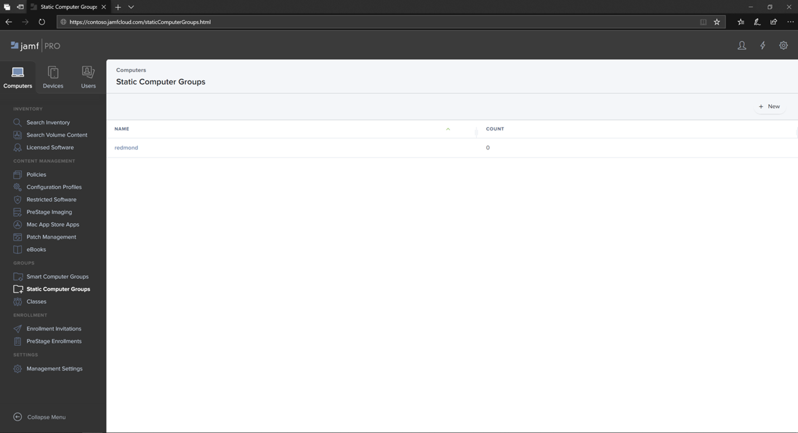

# Einrichten von Microsoft Defender for Endpoint auf macOS-Gerätegruppen in Jamf ProSet up Microsoft Defender for Endpoint on macOS device groups in Jamf Pro

[!INCLUDE [Microsoft 365 Defender rebranding](../../includes/microsoft-defender.md)]

**Gilt für:****Applies to:**
- [Microsoft Defender für EndpunktMicrosoft Defender for Endpoint](https://go.microsoft.com/fwlink/p/?linkid=2154037)
- [Microsoft 365 DefenderMicrosoft 365 Defender](https://go.microsoft.com/fwlink/?linkid=2118804)

> Möchten Sie Defender for Endpoint erleben?Want to experience Defender for Endpoint? [Registrieren Sie sich für eine kostenlose Testversion.Sign up for a free trial.](https://www.microsoft.com/microsoft-365/windows/microsoft-defender-atp?ocid=docs-wdatp-investigateip-abovefoldlink)

Richten Sie die Gerätegruppen ein, die gruppenrichtlinienorganisationseinheit (OUs), die Gerätesammlung von Microsoft Endpoint Configuration Manager und die Gerätegruppen von Intune ähneln.Set up the device groups similar to Group policy  organizational unite (OUs), Microsoft Endpoint Configuration Manager's device collection, and Intune's device groups.

1. Navigieren Sie zu **Statische Computergruppen**.Navigate to **Static Computer Groups**.

2. Wählen Sie **Neu** aus.Select **New**. 

    

3. Geben Sie einen Anzeigenamen an, und wählen Sie **Speichern aus.**Provide a display name and select **Save**.

    

4. Nun wird die **Computergruppe von Contoso unter** Statische **Computergruppen angezeigt.**Now you will see the **Contoso's Machine Group** under **Static Computer Groups**.

    

## Nächster SchrittNext step
- [Einrichten von Microsoft Defender for Endpoint für macOS-Richtlinien in Jamf ProSet up Microsoft Defender for Endpoint on macOS policies in Jamf Pro](mac-jamfpro-policies.md)
