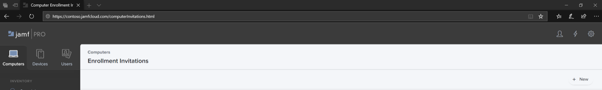

# Registrieren von Microsoft Defender for Endpoint für macOS-Geräte bei Jamf ProEnroll Microsoft Defender for Endpoint for macOS devices into Jamf Pro 

[!INCLUDE [Microsoft 365 Defender rebranding](../../includes/microsoft-defender.md)]

**Gilt für:****Applies to:**
- [Microsoft Defender für EndpunktMicrosoft Defender for Endpoint](https://go.microsoft.com/fwlink/p/?linkid=2154037)
- [Microsoft 365 DefenderMicrosoft 365 Defender](https://go.microsoft.com/fwlink/?linkid=2118804)

> Möchten Sie Defender for Endpoint erleben?Want to experience Defender for Endpoint? [Registrieren Sie sich für eine kostenlose Testversion.Sign up for a free trial.](https://www.microsoft.com/microsoft-365/windows/microsoft-defender-atp?ocid=docs-wdatp-investigateip-abovefoldlink)

## Registrieren von macOS-GerätenEnroll macOS devices

Es gibt mehrere Methoden zum Registrieren bei JamF.There are multiple methods of getting enrolled to JamF.

Dieser Artikel führt Sie zu zwei Methoden:This article will guide you on two methods:

- [Methode 1: RegistrierungseinladungenMethod 1:  Enrollment Invitations](#enrollment-method-1-enrollment-invitations)
- [Methode 2: VorabregistrierungenMethod 2:  Prestage Enrollments](#enrollment-method-2-prestage-enrollments)

Eine vollständige Liste finden Sie unter [Informationen zur Computerregistrierung](https://docs.jamf.com/9.9/casper-suite/administrator-guide/About_Computer_Enrollment.html).For a complete list, see [About Computer Enrollment](https://docs.jamf.com/9.9/casper-suite/administrator-guide/About_Computer_Enrollment.html).

## Registrierungsmethode 1: RegistrierungseinladungenEnrollment Method 1: Enrollment Invitations

1. Navigieren Sie im Jamf Pro-Dashboard zu **Registrierungseinladungen**.In the Jamf Pro dashboard, navigate to **Enrollment invitations**.

    

2. Wählen Sie **+ Neu aus.**Select **+ New**.

    

3. Geben **Sie unter Empfänger für die Einladung angeben >** unter **E-Mail-Adressen** die E-Mail-Adresse(n) der Empfänger ein.In **Specify Recipients for the Invitation** > under **Email Addresses** enter the e-mail address(es) of the recipients.

    

    

    Beispiel: janedoe@contoso.comFor example: janedoe@contoso.com

    

4. Konfigurieren Sie die Nachricht für die Einladung.Configure the message for the invitation.

    

    

    

    

## Registrierungsmethode 2: VorabregistrierungenEnrollment Method 2: Prestage Enrollments

1. Navigieren Sie im Jamf Pro-Dashboard zu **Prestage enrollments**.In the Jamf Pro dashboard, navigate to **Prestage enrollments**.

    

2. Befolgen Sie die Anweisungen unter [Computer PreStage Enrollments](https://docs.jamf.com/9.9/casper-suite/administrator-guide/Computer_PreStage_Enrollments.html).Follow the instructions in [Computer PreStage Enrollments](https://docs.jamf.com/9.9/casper-suite/administrator-guide/Computer_PreStage_Enrollments.html).

## Registrieren des macOS-GerätsEnroll macOS device

1. Wählen **Sie Weiter** aus, und installieren Sie das Zertifizierungsstellenzertifikat in einem **Systemeinstellungsfenster.**Select **Continue** and install the CA certificate from a **System Preferences** window.

    

2. Kehren Sie nach der Installation des Zertifizierungsstellenzertifikats zum Browserfenster zurück, und wählen Sie **Weiter aus,** und installieren Sie das MDM-Profil.Once CA certificate is installed, return to the browser window and select **Continue** and install the MDM profile. 

    

3. Wählen **Sie Downloads** von JAMF zulassen aus.Select **Allow** to downloads from JAMF.

    

4. Wählen **Sie Weiter** aus, um mit der INSTALLATION des MDM-Profils fortzufahren.Select **Continue** to proceed with the MDM Profile installation. 

    

5. Wählen **Sie Weiter** aus, um das MDM-Profil zu installieren.Select **Continue** to install the MDM Profile.

    

6. Wählen **Sie Weiter**  aus, um die Konfiguration zu vervollständigen.Select **Continue**  to complete the configuration. 

    
