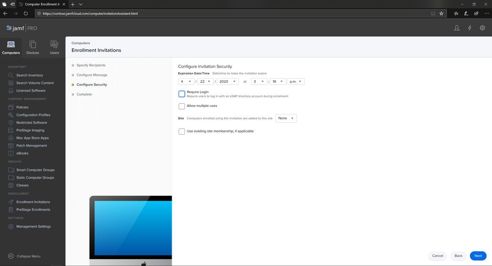
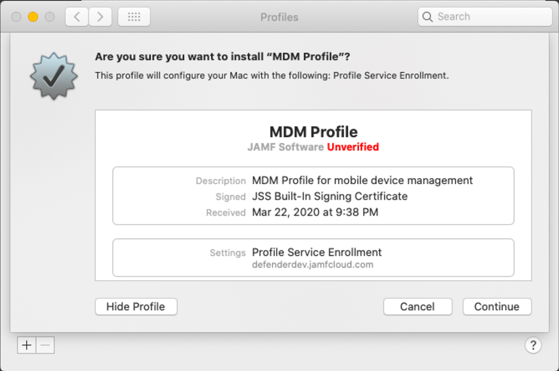

# Registrieren von Microsoft Defender for Endpoint auf macOS-Geräten bei Jamf Pro 

[!INCLUDE [Microsoft 365 Defender rebranding](../../includes/microsoft-defender.md)]

**Gilt für:**
- [Microsoft Defender für Endpunkt](https://go.microsoft.com/fwlink/p/?linkid=2154037)
- [Microsoft 365 Defender](https://go.microsoft.com/fwlink/?linkid=2118804)

> Möchten Sie Defender for Endpoint erleben? [Registrieren Sie sich für eine kostenlose Testversion.](https://www.microsoft.com/microsoft-365/windows/microsoft-defender-atp?ocid=docs-wdatp-investigateip-abovefoldlink)

## Registrieren von macOS-Geräten

Es gibt mehrere Methoden zum Registrieren bei JamF.

Dieser Artikel führt Sie zu zwei Methoden:

- [Methode 1: Registrierungseinladungen](#enrollment-method-1-enrollment-invitations)
- [Methode 2: Vorabregistrierungen](#enrollment-method-2-prestage-enrollments)

Eine vollständige Liste finden Sie unter [Informationen zur Computerregistrierung](https://docs.jamf.com/9.9/casper-suite/administrator-guide/About_Computer_Enrollment.html).

## Registrierungsmethode 1: Registrierungseinladungen

1. Navigieren Sie im Jamf Pro-Dashboard zu **Registrierungseinladungen**.

    

2. Wählen Sie **+ Neu aus.**

    

3. Geben **Sie unter Empfänger für die Einladung angeben >** unter **E-Mail-Adressen** die E-Mail-Adresse(n) der Empfänger ein.

    

    

    Beispiel: janedoe@contoso.com

    

4. Konfigurieren Sie die Nachricht für die Einladung.

    

    

    

    

## Registrierungsmethode 2: Vorabregistrierungen

1. Navigieren Sie im Jamf Pro-Dashboard zu **Prestage enrollments**.

    

2. Befolgen Sie die Anweisungen unter [Computer PreStage Enrollments](https://docs.jamf.com/9.9/casper-suite/administrator-guide/Computer_PreStage_Enrollments.html).

## Registrieren des macOS-Geräts

1. Wählen **Sie Weiter** aus, und installieren Sie das Zertifizierungsstellenzertifikat in einem **Systemeinstellungsfenster.**

    

2. Kehren Sie nach der Installation des Zertifizierungsstellenzertifikats zum Browserfenster zurück, und wählen Sie **Weiter aus,** und installieren Sie das MDM-Profil. 

    

3. Wählen **Sie Downloads** von JAMF zulassen aus.

    

4. Wählen **Sie Weiter** aus, um mit der INSTALLATION des MDM-Profils fortzufahren. 

    

5. Wählen **Sie Weiter** aus, um das MDM-Profil zu installieren.

    

6. Wählen **Sie Weiter**  aus, um die Konfiguration zu vervollständigen. 

    
