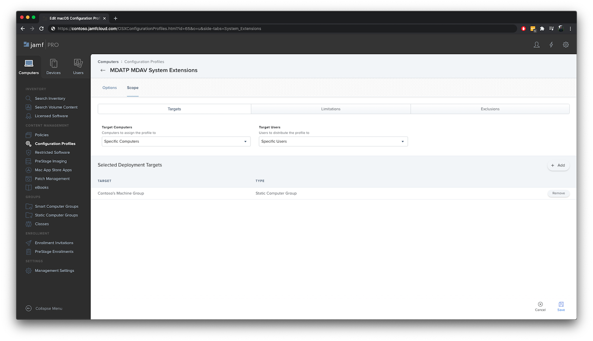

# <a name="set-up-the-microsoft-defender-for-endpoint-for-macos-policies-in-jamf-pro"></a><span data-ttu-id="daf71-104">Einrichten der Microsoft Defender for Endpoint für macOS-Richtlinien in Jamf Pro</span><span class="sxs-lookup"><span data-stu-id="daf71-104">Set up the Microsoft Defender for Endpoint for macOS policies in Jamf Pro</span></span>

[!INCLUDE [Microsoft 365 Defender rebranding](../../includes/microsoft-defender.md)]


<span data-ttu-id="daf71-105">**Gilt für:**</span><span class="sxs-lookup"><span data-stu-id="daf71-105">**Applies to:**</span></span>

- [<span data-ttu-id="daf71-106">Defender for Endpoint for Mac</span><span class="sxs-lookup"><span data-stu-id="daf71-106">Defender for Endpoint for Mac</span></span>](microsoft-defender-endpoint-mac.md)

<span data-ttu-id="daf71-107">Diese Seite führt Sie durch die Schritte, die Sie zum Einrichten von macOS-Richtlinien in Jamf Pro ausführen müssen.</span><span class="sxs-lookup"><span data-stu-id="daf71-107">This page will guide you through the steps you need to take to set up macOS policies in Jamf Pro.</span></span>

<span data-ttu-id="daf71-108">Sie müssen die folgenden Schritte ausführen:</span><span class="sxs-lookup"><span data-stu-id="daf71-108">You'll need to take the following steps:</span></span>

1. [<span data-ttu-id="daf71-109">Holen Sie sich das Microsoft Defender for Endpoint-Onboardingpaket</span><span class="sxs-lookup"><span data-stu-id="daf71-109">Get the Microsoft Defender for Endpoint onboarding package</span></span>](#step-1-get-the-microsoft-defender-for-endpoint-onboarding-package)

2. [<span data-ttu-id="daf71-110">Erstellen eines Konfigurationsprofils in Jamf Pro mithilfe des Onboardingpakets</span><span class="sxs-lookup"><span data-stu-id="daf71-110">Create a configuration profile in Jamf Pro using the onboarding package</span></span>](#step-2-create-a-configuration-profile-in-jamf-pro-using-the-onboarding-package)

3. [<span data-ttu-id="daf71-111">Konfigurieren von Microsoft Defender für Endpunkteinstellungen</span><span class="sxs-lookup"><span data-stu-id="daf71-111">Configure Microsoft Defender for Endpoint settings</span></span>](#step-3-configure-microsoft-defender-for-endpoint-settings)

4. [<span data-ttu-id="daf71-112">Konfigurieren von Microsoft Defender for Endpoint-Benachrichtigungseinstellungen</span><span class="sxs-lookup"><span data-stu-id="daf71-112">Configure Microsoft Defender for Endpoint notification settings</span></span>](#step-4-configure-notifications-settings)

5. [<span data-ttu-id="daf71-113">Konfigurieren von Microsoft AutoUpdate (MAU)</span><span class="sxs-lookup"><span data-stu-id="daf71-113">Configure Microsoft AutoUpdate (MAU)</span></span>](#step-5-configure-microsoft-autoupdate-mau)

6. [<span data-ttu-id="daf71-114">Gewähren des vollständigen Datenträgerzugriffs auf Microsoft Defender for Endpoint</span><span class="sxs-lookup"><span data-stu-id="daf71-114">Grant full disk access to Microsoft Defender for Endpoint</span></span>](#step-6-grant-full-disk-access-to-microsoft-defender-for-endpoint)

7. [<span data-ttu-id="daf71-115">Genehmigen der Kernelerweiterung für Microsoft Defender for Endpoint</span><span class="sxs-lookup"><span data-stu-id="daf71-115">Approve Kernel extension for Microsoft Defender for Endpoint</span></span>](#step-7-approve-kernel-extension-for-microsoft-defender-for-endpoint)

8. [<span data-ttu-id="daf71-116">Genehmigen von Systemerweiterungen für Microsoft Defender for Endpoint</span><span class="sxs-lookup"><span data-stu-id="daf71-116">Approve System extensions for Microsoft Defender for Endpoint</span></span>](#step-8-approve-system-extensions-for-microsoft-defender-for-endpoint)

9. [<span data-ttu-id="daf71-117">Konfigurieren der Netzwerkerweiterung</span><span class="sxs-lookup"><span data-stu-id="daf71-117">Configure Network Extension</span></span>](#step-9-configure-network-extension)

10. [<span data-ttu-id="daf71-118">Planen von Scans mit Microsoft Defender for Endpoint für Mac</span><span class="sxs-lookup"><span data-stu-id="daf71-118">Schedule scans with Microsoft Defender for Endpoint for Mac</span></span>](https://docs.microsoft.com/windows/security/threat-protection/microsoft-defender-atp/mac-schedule-scan-atp)

11. [<span data-ttu-id="daf71-119">Bereitstellen von Microsoft Defender for Endpoint für macOS</span><span class="sxs-lookup"><span data-stu-id="daf71-119">Deploy Microsoft Defender for Endpoint for macOS</span></span>](#step-11-deploy-microsoft-defender-for-endpoint-for-macos)


## <a name="step-1-get-the-microsoft-defender-for-endpoint-onboarding-package"></a><span data-ttu-id="daf71-120">Schritt 1: Erstellen des Microsoft Defender for Endpoint-Onboardingpakets</span><span class="sxs-lookup"><span data-stu-id="daf71-120">Step 1: Get the Microsoft Defender for Endpoint onboarding package</span></span>

1. <span data-ttu-id="daf71-121">Navigieren [Sie im Microsoft Defender Security Center](https://securitycenter.microsoft.com )zu Einstellungen > **Onboarding**.</span><span class="sxs-lookup"><span data-stu-id="daf71-121">In [Microsoft Defender Security Center](https://securitycenter.microsoft.com ), navigate to **Settings > Onboarding**.</span></span> 

2. <span data-ttu-id="daf71-122">Wählen Sie macOS als Betriebssystem und Mobile Device Management /Microsoft Intune als Bereitstellungsmethode aus.</span><span class="sxs-lookup"><span data-stu-id="daf71-122">Select macOS as the operating system and Mobile Device Management / Microsoft Intune as the deployment method.</span></span>

    

3. <span data-ttu-id="daf71-124">Wählen **Sie Onboardingpaket** herunterladen (WindowsDefenderATPOnboardingPackage.zip).</span><span class="sxs-lookup"><span data-stu-id="daf71-124">Select **Download onboarding package** (WindowsDefenderATPOnboardingPackage.zip).</span></span>

4. <span data-ttu-id="daf71-125">Extrahieren `WindowsDefenderATPOnboardingPackage.zip` .</span><span class="sxs-lookup"><span data-stu-id="daf71-125">Extract `WindowsDefenderATPOnboardingPackage.zip`.</span></span>

5. <span data-ttu-id="daf71-126">Kopieren Sie die Datei an Ihren bevorzugten Speicherort.</span><span class="sxs-lookup"><span data-stu-id="daf71-126">Copy the file to your preferred location.</span></span> <span data-ttu-id="daf71-127">Zum Beispiel: `C:\Users\JaneDoe_or_JohnDoe.contoso\Downloads\WindowsDefenderATPOnboardingPackage_macOS_MDM_contoso\jamf\WindowsDefenderATPOnboarding.plist`.</span><span class="sxs-lookup"><span data-stu-id="daf71-127">For example,  `C:\Users\JaneDoe_or_JohnDoe.contoso\Downloads\WindowsDefenderATPOnboardingPackage_macOS_MDM_contoso\jamf\WindowsDefenderATPOnboarding.plist`.</span></span>


## <a name="step-2-create-a-configuration-profile-in-jamf-pro-using-the-onboarding-package"></a><span data-ttu-id="daf71-128">Schritt 2: Erstellen eines Konfigurationsprofils in Jamf Pro mithilfe des Onboardingpakets</span><span class="sxs-lookup"><span data-stu-id="daf71-128">Step 2: Create a configuration profile in Jamf Pro using the onboarding package</span></span>

1. <span data-ttu-id="daf71-129">Suchen Sie die `WindowsDefenderATPOnboarding.plist` Datei aus dem vorherigen Abschnitt.</span><span class="sxs-lookup"><span data-stu-id="daf71-129">Locate the file `WindowsDefenderATPOnboarding.plist` from the previous section.</span></span>

   

 
2. <span data-ttu-id="daf71-131">Wählen Sie im Jamf Pro-Dashboard Neu **aus.**</span><span class="sxs-lookup"><span data-stu-id="daf71-131">In the Jamf Pro dashboard, select **New**.</span></span>

    

3. <span data-ttu-id="daf71-133">Geben Sie die folgenden Details ein:</span><span class="sxs-lookup"><span data-stu-id="daf71-133">Enter the following details:</span></span>

   <span data-ttu-id="daf71-134">**Allgemein**</span><span class="sxs-lookup"><span data-stu-id="daf71-134">**General**</span></span>
   - <span data-ttu-id="daf71-135">Name: MDATP-Onboarding für macOS</span><span class="sxs-lookup"><span data-stu-id="daf71-135">Name: MDATP onboarding for macOS</span></span>
   - <span data-ttu-id="daf71-136">Beschreibung: MDATP EDR-Onboarding für macOS</span><span class="sxs-lookup"><span data-stu-id="daf71-136">Description: MDATP EDR onboarding for macOS</span></span>
   - <span data-ttu-id="daf71-137">Kategorie: Keine</span><span class="sxs-lookup"><span data-stu-id="daf71-137">Category: None</span></span>
   - <span data-ttu-id="daf71-138">Verteilungsmethode: Automatisch installieren</span><span class="sxs-lookup"><span data-stu-id="daf71-138">Distribution Method: Install Automatically</span></span>
   - <span data-ttu-id="daf71-139">Ebene: Computerebene</span><span class="sxs-lookup"><span data-stu-id="daf71-139">Level: Computer Level</span></span>

4. <span data-ttu-id="daf71-140">Wählen **Sie unter & Benutzerdefinierte Einstellungen konfigurieren** **aus.**</span><span class="sxs-lookup"><span data-stu-id="daf71-140">In **Application & Custom Settings** select **Configure**.</span></span>

    

5. <span data-ttu-id="daf71-142">Wählen **Sie Datei hochladen (PLIST-Datei)** aus, und geben Sie dann unter Einstellung **Domäne** ein: `com.microsoft.wdav.atp` .</span><span class="sxs-lookup"><span data-stu-id="daf71-142">Select **Upload File (PLIST file)** then in **Preference Domain** enter: `com.microsoft.wdav.atp`.</span></span> 

    

    

7. <span data-ttu-id="daf71-145">Wählen **Sie Öffnen** aus, und wählen Sie die Onboardingdatei aus.</span><span class="sxs-lookup"><span data-stu-id="daf71-145">Select **Open** and select the onboarding file.</span></span>

    

8. <span data-ttu-id="daf71-147">Wählen Sie **Hochladen** aus.</span><span class="sxs-lookup"><span data-stu-id="daf71-147">Select **Upload**.</span></span> 

    


9. <span data-ttu-id="daf71-149">Wählen Sie die **Registerkarte Bereich** aus.</span><span class="sxs-lookup"><span data-stu-id="daf71-149">Select the **Scope** tab.</span></span>

    

10. <span data-ttu-id="daf71-151">Wählen Sie die Zielcomputer aus.</span><span class="sxs-lookup"><span data-stu-id="daf71-151">Select the target computers.</span></span>

    

     

11. <span data-ttu-id="daf71-154">Wählen Sie **Speichern** aus.</span><span class="sxs-lookup"><span data-stu-id="daf71-154">Select **Save**.</span></span>

    

    

12. <span data-ttu-id="daf71-157">Wählen Sie **Fertig** aus.</span><span class="sxs-lookup"><span data-stu-id="daf71-157">Select **Done**.</span></span>

    

    

## <a name="step-3-configure-microsoft-defender-for-endpoint-settings"></a><span data-ttu-id="daf71-160">Schritt 3: Konfigurieren von Microsoft Defender für Endpunkteinstellungen</span><span class="sxs-lookup"><span data-stu-id="daf71-160">Step 3: Configure Microsoft Defender for Endpoint settings</span></span>

1.  <span data-ttu-id="daf71-161">Verwenden Sie die folgenden Microsoft Defender for Endpoint-Konfigurationseinstellungen:</span><span class="sxs-lookup"><span data-stu-id="daf71-161">Use the following Microsoft Defender for Endpoint configuration settings:</span></span>

    - <span data-ttu-id="daf71-162">enableRealTimeProtection</span><span class="sxs-lookup"><span data-stu-id="daf71-162">enableRealTimeProtection</span></span>
    - <span data-ttu-id="daf71-163">passiveMode</span><span class="sxs-lookup"><span data-stu-id="daf71-163">passiveMode</span></span>
    
    >[!NOTE]
    ><span data-ttu-id="daf71-164">Nicht standardmäßig aktiviert, wenn Sie planen, einen Av eines Drittanbieters für macOS ausführen zu können, legen Sie ihn auf `true` fest.</span><span class="sxs-lookup"><span data-stu-id="daf71-164">Not turned on by default, if you are planning to run a third-party AV for macOS, set it to `true`.</span></span>

    - <span data-ttu-id="daf71-165">Ausschlüsse</span><span class="sxs-lookup"><span data-stu-id="daf71-165">exclusions</span></span>
    - <span data-ttu-id="daf71-166">excludedPath</span><span class="sxs-lookup"><span data-stu-id="daf71-166">excludedPath</span></span>
    - <span data-ttu-id="daf71-167">excludedFileExtension</span><span class="sxs-lookup"><span data-stu-id="daf71-167">excludedFileExtension</span></span>
    - <span data-ttu-id="daf71-168">excludedFileName</span><span class="sxs-lookup"><span data-stu-id="daf71-168">excludedFileName</span></span>
    - <span data-ttu-id="daf71-169">exclusionsMergePolicy</span><span class="sxs-lookup"><span data-stu-id="daf71-169">exclusionsMergePolicy</span></span>
    - <span data-ttu-id="daf71-170">allowedThreats</span><span class="sxs-lookup"><span data-stu-id="daf71-170">allowedThreats</span></span>
    
    >[!NOTE]
    ><span data-ttu-id="daf71-171">EICAR befindet sich im Beispiel, wenn Sie einen Proof-of-Concept durchprobieren, entfernen Sie es insbesondere, wenn Sie EICAR testen.</span><span class="sxs-lookup"><span data-stu-id="daf71-171">EICAR is on the sample, if you are going through a proof-of-concept, remove it especially if you are testing EICAR.</span></span>
        
    - <span data-ttu-id="daf71-172">disallowedThreatActions</span><span class="sxs-lookup"><span data-stu-id="daf71-172">disallowedThreatActions</span></span>
    - <span data-ttu-id="daf71-173">potentially_unwanted_application</span><span class="sxs-lookup"><span data-stu-id="daf71-173">potentially_unwanted_application</span></span>
    - <span data-ttu-id="daf71-174">archive_bomb</span><span class="sxs-lookup"><span data-stu-id="daf71-174">archive_bomb</span></span>
    - <span data-ttu-id="daf71-175">cloudService</span><span class="sxs-lookup"><span data-stu-id="daf71-175">cloudService</span></span>
    - <span data-ttu-id="daf71-176">automaticSampleSubmission</span><span class="sxs-lookup"><span data-stu-id="daf71-176">automaticSampleSubmission</span></span>
    - <span data-ttu-id="daf71-177">tags</span><span class="sxs-lookup"><span data-stu-id="daf71-177">tags</span></span>
    - <span data-ttu-id="daf71-178">hideStatusMenuIcon</span><span class="sxs-lookup"><span data-stu-id="daf71-178">hideStatusMenuIcon</span></span>
    
     <span data-ttu-id="daf71-179">Weitere Informationen finden Sie unter [Property list for Jamf configuration profile](mac-preferences.md#property-list-for-jamf-configuration-profile).</span><span class="sxs-lookup"><span data-stu-id="daf71-179">For information, see [Property list for Jamf configuration profile](mac-preferences.md#property-list-for-jamf-configuration-profile).</span></span>

     ```XML
     <?xml version="1.0" encoding="UTF-8"?>
     <!DOCTYPE plist PUBLIC "-//Apple//DTD PLIST 1.0//EN" "http://www.apple.com/DTDs/PropertyList-1.0.dtd">
     <plist version="1.0">
     <dict>
         <key>antivirusEngine</key>
         <dict>
             <key>enableRealTimeProtection</key>
             <true/>
             <key>passiveMode</key>
             <false/>
             <key>exclusions</key>
             <array>
                 <dict>
                     <key>$type</key>
                     <string>excludedPath</string>
                     <key>isDirectory</key>
                     <false/>
                     <key>path</key>
                     <string>/var/log/system.log</string>
                 </dict>
                 <dict>
                     <key>$type</key>
                     <string>excludedPath</string>
                     <key>isDirectory</key>
                     <true/>
                     <key>path</key>
                     <string>/home</string>
                 </dict>
                 <dict>
                     <key>$type</key>
                     <string>excludedFileExtension</string>
                     <key>extension</key>
                     <string>pdf</string>
                 </dict>
                 <dict>
                     <key>$type</key>
                     <string>excludedFileName</string>
                     <key>name</key>
                     <string>cat</string>
                 </dict>
             </array>
             <key>exclusionsMergePolicy</key>
             <string>merge</string>
             <key>allowedThreats</key>
             <array>
                 <string>EICAR-Test-File (not a virus)</string>
             </array>
             <key>disallowedThreatActions</key>
             <array>
                 <string>allow</string>
                 <string>restore</string>
             </array>
             <key>threatTypeSettings</key>
             <array>
                 <dict>
                     <key>key</key>
                     <string>potentially_unwanted_application</string>
                     <key>value</key>
                     <string>block</string>
                 </dict>
                 <dict>
                     <key>key</key>
                     <string>archive_bomb</string>
                     <key>value</key>
                     <string>audit</string>
                 </dict>
             </array>
             <key>threatTypeSettingsMergePolicy</key>
             <string>merge</string>
         </dict>
         <key>cloudService</key>
         <dict>
             <key>enabled</key>
             <true/>
             <key>diagnosticLevel</key>
             <string>optional</string>
             <key>automaticSampleSubmission</key>
             <true/>
         </dict>
         <key>edr</key>
         <dict>
             <key>tags</key>
             <array>
                 <dict>
                     <key>key</key>
                     <string>GROUP</string>
                     <key>value</key>
                     <string>ExampleTag</string>
                 </dict>
             </array>
         </dict>
         <key>userInterface</key>
         <dict>
             <key>hideStatusMenuIcon</key>
             <false/>
         </dict>
     </dict>
     </plist>
     ```

2. <span data-ttu-id="daf71-180">Speichern Sie die Datei unter `MDATP_MDAV_configuration_settings.plist` .</span><span class="sxs-lookup"><span data-stu-id="daf71-180">Save the file as `MDATP_MDAV_configuration_settings.plist`.</span></span>


3.  <span data-ttu-id="daf71-181">Wählen Sie im Jamf Pro-Dashboard Die Option **Allgemein aus.**</span><span class="sxs-lookup"><span data-stu-id="daf71-181">In the Jamf Pro dashboard, select **General**.</span></span>

    

4. <span data-ttu-id="daf71-183">Geben Sie die folgenden Details ein:</span><span class="sxs-lookup"><span data-stu-id="daf71-183">Enter the following details:</span></span>

    <span data-ttu-id="daf71-184">**Allgemein**</span><span class="sxs-lookup"><span data-stu-id="daf71-184">**General**</span></span>
    
    - <span data-ttu-id="daf71-185">Name: MDATP-MDAV-Konfigurationseinstellungen</span><span class="sxs-lookup"><span data-stu-id="daf71-185">Name: MDATP MDAV configuration settings</span></span>
    - <span data-ttu-id="daf71-186">Beschreibung:\<blank\></span><span class="sxs-lookup"><span data-stu-id="daf71-186">Description:\<blank\></span></span>
    - <span data-ttu-id="daf71-187">Kategorie: Keine (Standard)</span><span class="sxs-lookup"><span data-stu-id="daf71-187">Category: None (default)</span></span>
    - <span data-ttu-id="daf71-188">Verteilungsmethode: Automatisch installieren(Standard)</span><span class="sxs-lookup"><span data-stu-id="daf71-188">Distribution Method: Install Automatically(default)</span></span>
    - <span data-ttu-id="daf71-189">Ebene: Computerebene(Standard)</span><span class="sxs-lookup"><span data-stu-id="daf71-189">Level: Computer Level(default)</span></span>

    

5. <span data-ttu-id="daf71-191">Wählen **Sie unter & Benutzerdefinierte Einstellungen konfigurieren** **aus.**</span><span class="sxs-lookup"><span data-stu-id="daf71-191">In **Application & Custom Settings** select **Configure**.</span></span>

    

6. <span data-ttu-id="daf71-193">Wählen **Sie Datei hochladen (PLIST-Datei)** aus.</span><span class="sxs-lookup"><span data-stu-id="daf71-193">Select **Upload File (PLIST file)**.</span></span>

    

7. <span data-ttu-id="daf71-195">Geben **Sie unter Einstellungen Domäne** `com.microsoft.wdav` ein, und wählen Sie dann **PLIST-Datei hochladen aus.**</span><span class="sxs-lookup"><span data-stu-id="daf71-195">In **Preferences Domain**, enter `com.microsoft.wdav`, then select  **Upload PLIST File**.</span></span>

    

8. <span data-ttu-id="daf71-197">Wählen **Sie Datei auswählen aus.**</span><span class="sxs-lookup"><span data-stu-id="daf71-197">Select **Choose File**.</span></span>

    

9. <span data-ttu-id="daf71-199">Wählen Sie **MDATP_MDAV_configuration_settings.plist** aus, und wählen Sie dann **Öffnen aus.**</span><span class="sxs-lookup"><span data-stu-id="daf71-199">Select the **MDATP_MDAV_configuration_settings.plist**, then select **Open**.</span></span>

    

10. <span data-ttu-id="daf71-201">Wählen Sie **Hochladen** aus.</span><span class="sxs-lookup"><span data-stu-id="daf71-201">Select **Upload**.</span></span>

    

    

    >[!NOTE]
    ><span data-ttu-id="daf71-204">Wenn Sie die Intune-Datei hochladen, erhalten Sie den folgenden Fehler:</span><span class="sxs-lookup"><span data-stu-id="daf71-204">If you happen to upload the Intune file, you'll get the following error:</span></span><br>
    ><span data-ttu-id="daf71-205"></span><span class="sxs-lookup"><span data-stu-id="daf71-205"></span></span>


11. <span data-ttu-id="daf71-206">Wählen Sie **Speichern** aus.</span><span class="sxs-lookup"><span data-stu-id="daf71-206">Select **Save**.</span></span> 

    

12. <span data-ttu-id="daf71-208">Die Datei wird hochgeladen.</span><span class="sxs-lookup"><span data-stu-id="daf71-208">The file is uploaded.</span></span>

    

    

13. <span data-ttu-id="daf71-211">Wählen Sie die **Registerkarte Bereich** aus.</span><span class="sxs-lookup"><span data-stu-id="daf71-211">Select the **Scope** tab.</span></span>

    

14. <span data-ttu-id="daf71-213">Wählen **Sie Contosos Computergruppe aus.**</span><span class="sxs-lookup"><span data-stu-id="daf71-213">Select **Contoso's Machine Group**.</span></span> 

15. <span data-ttu-id="daf71-214">Wählen **Sie Hinzufügen** aus, und wählen Sie dann Speichern **aus.**</span><span class="sxs-lookup"><span data-stu-id="daf71-214">Select **Add**, then select **Save**.</span></span>

    

    

16. <span data-ttu-id="daf71-217">Wählen Sie **Fertig** aus.</span><span class="sxs-lookup"><span data-stu-id="daf71-217">Select **Done**.</span></span> <span data-ttu-id="daf71-218">Das neue Konfigurationsprofil **wird angezeigt.**</span><span class="sxs-lookup"><span data-stu-id="daf71-218">You'll see the new **Configuration profile**.</span></span>

    


## <a name="step-4-configure-notifications-settings"></a><span data-ttu-id="daf71-220">Schritt 4: Konfigurieren von Benachrichtigungseinstellungen</span><span class="sxs-lookup"><span data-stu-id="daf71-220">Step 4: Configure notifications settings</span></span>

<span data-ttu-id="daf71-221">Diese Schritte gelten für macOS 10.15 (Catalina) oder neuer.</span><span class="sxs-lookup"><span data-stu-id="daf71-221">These steps are applicable of macOS 10.15 (Catalina) or newer.</span></span>

1. <span data-ttu-id="daf71-222">Herunterladen `notif.mobileconfig` aus [unserem GitHub-Repository](https://raw.githubusercontent.com/microsoft/mdatp-xplat/master/macos/mobileconfig/profiles/notif.mobileconfig)</span><span class="sxs-lookup"><span data-stu-id="daf71-222">Download `notif.mobileconfig` from [our GitHub repository](https://raw.githubusercontent.com/microsoft/mdatp-xplat/master/macos/mobileconfig/profiles/notif.mobileconfig)</span></span>

2. <span data-ttu-id="daf71-223">Speichern Sie sie unter `MDATP_MDAV_notification_settings.plist` .</span><span class="sxs-lookup"><span data-stu-id="daf71-223">Save it as `MDATP_MDAV_notification_settings.plist`.</span></span>

3. <span data-ttu-id="daf71-224">Wählen Sie im Jamf Pro-Dashboard Die Option **Allgemein aus.**</span><span class="sxs-lookup"><span data-stu-id="daf71-224">In the Jamf Pro dashboard, select **General**.</span></span> 
       
4. <span data-ttu-id="daf71-225">Geben Sie die folgenden Details ein:</span><span class="sxs-lookup"><span data-stu-id="daf71-225">Enter the following details:</span></span>

    <span data-ttu-id="daf71-226">**Allgemein**</span><span class="sxs-lookup"><span data-stu-id="daf71-226">**General**</span></span> 
    
    - <span data-ttu-id="daf71-227">Name: MDATP MDAV-Benachrichtigungseinstellungen</span><span class="sxs-lookup"><span data-stu-id="daf71-227">Name: MDATP MDAV Notification settings</span></span>
    - <span data-ttu-id="daf71-228">Beschreibung: macOS 10.15 (Catalina) oder neuer</span><span class="sxs-lookup"><span data-stu-id="daf71-228">Description: macOS 10.15 (Catalina) or newer</span></span>
    - <span data-ttu-id="daf71-229">Kategorie: Keine (Standard)</span><span class="sxs-lookup"><span data-stu-id="daf71-229">Category: None (default)</span></span>
    - <span data-ttu-id="daf71-230">Verteilungsmethode: Automatisch installieren(Standard)</span><span class="sxs-lookup"><span data-stu-id="daf71-230">Distribution Method: Install Automatically(default)</span></span>
    - <span data-ttu-id="daf71-231">Ebene: Computerebene(Standard)</span><span class="sxs-lookup"><span data-stu-id="daf71-231">Level: Computer Level(default)</span></span>

    


5. <span data-ttu-id="daf71-233">Wählen **Sie Datei hochladen (PLIST-Datei)** aus.</span><span class="sxs-lookup"><span data-stu-id="daf71-233">Select **Upload File (PLIST file)**.</span></span>

    
 

6. <span data-ttu-id="daf71-235">Wählen **Sie Datei**  >  **MDATP_MDAV_Notification_Settings.plist auswählen aus.**</span><span class="sxs-lookup"><span data-stu-id="daf71-235">Select **Choose File** > **MDATP_MDAV_Notification_Settings.plist**.</span></span>


    


    

7. <span data-ttu-id="daf71-238">Wählen **Sie Hochladen** öffnen  >  **aus.**</span><span class="sxs-lookup"><span data-stu-id="daf71-238">Select **Open** > **Upload**.</span></span>

    


    

8. <span data-ttu-id="daf71-241">Wählen Sie die **Registerkarte** Bereich aus, und wählen Sie **dann Hinzufügen aus.**</span><span class="sxs-lookup"><span data-stu-id="daf71-241">Select the **Scope** tab, then select **Add**.</span></span>

    


9. <span data-ttu-id="daf71-243">Wählen **Sie Contosos Computergruppe aus.**</span><span class="sxs-lookup"><span data-stu-id="daf71-243">Select **Contoso's Machine Group**.</span></span> 

10. <span data-ttu-id="daf71-244">Wählen **Sie Hinzufügen** aus, und wählen Sie dann Speichern **aus.**</span><span class="sxs-lookup"><span data-stu-id="daf71-244">Select **Add**, then select **Save**.</span></span>
    
    

    
    

11. <span data-ttu-id="daf71-247">Wählen Sie **Fertig** aus.</span><span class="sxs-lookup"><span data-stu-id="daf71-247">Select **Done**.</span></span> <span data-ttu-id="daf71-248">Das neue Konfigurationsprofil **wird angezeigt.**</span><span class="sxs-lookup"><span data-stu-id="daf71-248">You'll see the new **Configuration profile**.</span></span>
    <span data-ttu-id="daf71-249"></span><span class="sxs-lookup"><span data-stu-id="daf71-249"></span></span>

## <a name="step-5-configure-microsoft-autoupdate-mau"></a><span data-ttu-id="daf71-250">Schritt 5: Konfigurieren von Microsoft AutoUpdate (MAU)</span><span class="sxs-lookup"><span data-stu-id="daf71-250">Step 5: Configure Microsoft AutoUpdate (MAU)</span></span>

1. <span data-ttu-id="daf71-251">Verwenden Sie die folgenden Microsoft Defender for Endpoint-Konfigurationseinstellungen:</span><span class="sxs-lookup"><span data-stu-id="daf71-251">Use the following Microsoft Defender for Endpoint configuration settings:</span></span>

      ```XML
   <?xml version="1.0" encoding="UTF-8"?>
   <!DOCTYPE plist PUBLIC "-//Apple//DTD PLIST 1.0//EN" "http://www.apple.com/DTDs/PropertyList-1.0.dtd">
   <plist version="1.0">
   <dict>
    <key>ChannelName</key>
    <string>Current</string>
    <key>HowToCheck</key>
    <string>AutomaticDownload</string>
    <key>EnableCheckForUpdatesButton</key>
    <true/>
    <key>DisableInsiderCheckbox</key>
    <false/>
    <key>SendAllTelemetryEnabled</key>
    <true/>
   </dict>
   </plist>
   ```

2. <span data-ttu-id="daf71-252">Speichern Sie sie unter `MDATP_MDAV_MAU_settings.plist` .</span><span class="sxs-lookup"><span data-stu-id="daf71-252">Save it as `MDATP_MDAV_MAU_settings.plist`.</span></span>

3. <span data-ttu-id="daf71-253">Wählen Sie im Jamf Pro-Dashboard Die Option **Allgemein aus.**</span><span class="sxs-lookup"><span data-stu-id="daf71-253">In the Jamf Pro dashboard, select **General**.</span></span> 

    

4. <span data-ttu-id="daf71-255">Geben Sie die folgenden Details ein:</span><span class="sxs-lookup"><span data-stu-id="daf71-255">Enter the following details:</span></span>

    <span data-ttu-id="daf71-256">**Allgemein**</span><span class="sxs-lookup"><span data-stu-id="daf71-256">**General**</span></span> 
    
    - <span data-ttu-id="daf71-257">Name: MDATP MDAV MAU-Einstellungen</span><span class="sxs-lookup"><span data-stu-id="daf71-257">Name: MDATP MDAV MAU settings</span></span>
    - <span data-ttu-id="daf71-258">Beschreibung: Microsoft AutoUpdate-Einstellungen für MDATP für macOS</span><span class="sxs-lookup"><span data-stu-id="daf71-258">Description: Microsoft AutoUpdate settings for MDATP for macOS</span></span>
    - <span data-ttu-id="daf71-259">Kategorie: Keine (Standard)</span><span class="sxs-lookup"><span data-stu-id="daf71-259">Category: None (default)</span></span>
    - <span data-ttu-id="daf71-260">Verteilungsmethode: Automatisch installieren(Standard)</span><span class="sxs-lookup"><span data-stu-id="daf71-260">Distribution Method: Install Automatically(default)</span></span>
    - <span data-ttu-id="daf71-261">Ebene: Computerebene(Standard)</span><span class="sxs-lookup"><span data-stu-id="daf71-261">Level: Computer Level(default)</span></span>

5. <span data-ttu-id="daf71-262">Wählen **Sie unter & Benutzerdefinierte Einstellungen konfigurieren** **aus.**</span><span class="sxs-lookup"><span data-stu-id="daf71-262">In **Application & Custom Settings** select **Configure**.</span></span>

    

6. <span data-ttu-id="daf71-264">Wählen **Sie Datei hochladen (PLIST-Datei)** aus.</span><span class="sxs-lookup"><span data-stu-id="daf71-264">Select **Upload File (PLIST file)**.</span></span>

      

7. <span data-ttu-id="daf71-266">Geben **Sie unter Einstellung Domäne:** `com.microsoft.autoupdate2` ein, und wählen Sie dann **PLIST-Datei hochladen aus.**</span><span class="sxs-lookup"><span data-stu-id="daf71-266">In **Preference Domain** enter: `com.microsoft.autoupdate2`, then select **Upload PLIST File**.</span></span>

    

8. <span data-ttu-id="daf71-268">Wählen **Sie Datei auswählen aus.**</span><span class="sxs-lookup"><span data-stu-id="daf71-268">Select **Choose File**.</span></span>

    

9. <span data-ttu-id="daf71-270">Wählen **MDATP_MDAV_MAU_settings.plist aus.**</span><span class="sxs-lookup"><span data-stu-id="daf71-270">Select **MDATP_MDAV_MAU_settings.plist**.</span></span>

    

10. <span data-ttu-id="daf71-272">Wählen Sie **Hochladen** aus.</span><span class="sxs-lookup"><span data-stu-id="daf71-272">Select **Upload**.</span></span>
    <span data-ttu-id="daf71-273"></span><span class="sxs-lookup"><span data-stu-id="daf71-273"></span></span>

    

11. <span data-ttu-id="daf71-275">Wählen Sie **Speichern** aus.</span><span class="sxs-lookup"><span data-stu-id="daf71-275">Select **Save**.</span></span>

    

12. <span data-ttu-id="daf71-277">Wählen Sie die **Registerkarte Bereich** aus.</span><span class="sxs-lookup"><span data-stu-id="daf71-277">Select the **Scope** tab.</span></span>
   
     

13. <span data-ttu-id="daf71-279">Klicken Sie auf **Hinzufügen**.</span><span class="sxs-lookup"><span data-stu-id="daf71-279">Select **Add**.</span></span>
    
    

    

    

14. <span data-ttu-id="daf71-283">Wählen Sie **Fertig** aus.</span><span class="sxs-lookup"><span data-stu-id="daf71-283">Select **Done**.</span></span>
    
    

## <a name="step-6-grant-full-disk-access-to-microsoft-defender-for-endpoint"></a><span data-ttu-id="daf71-285">Schritt 6: Gewähren des vollständigen Festplattenzugriffs auf Microsoft Defender for Endpoint</span><span class="sxs-lookup"><span data-stu-id="daf71-285">Step 6: Grant full disk access to Microsoft Defender for Endpoint</span></span>

1. <span data-ttu-id="daf71-286">Wählen Sie im Jamf Pro-Dashboard **Konfigurationsprofile aus.**</span><span class="sxs-lookup"><span data-stu-id="daf71-286">In the Jamf Pro dashboard, select **Configuration Profiles**.</span></span>

    

2. <span data-ttu-id="daf71-288">Wählen Sie **+ Neu aus.**</span><span class="sxs-lookup"><span data-stu-id="daf71-288">Select **+ New**.</span></span> 

3. <span data-ttu-id="daf71-289">Geben Sie die folgenden Details ein:</span><span class="sxs-lookup"><span data-stu-id="daf71-289">Enter the following details:</span></span>

    <span data-ttu-id="daf71-290">**Allgemein**</span><span class="sxs-lookup"><span data-stu-id="daf71-290">**General**</span></span> 
    - <span data-ttu-id="daf71-291">Name: MDATP MDAV – Gewähren des vollständigen Festplattenzugriffs auf EDR und AV</span><span class="sxs-lookup"><span data-stu-id="daf71-291">Name: MDATP MDAV - grant Full Disk Access to EDR and AV</span></span>
    - <span data-ttu-id="daf71-292">Beschreibung: Unter macOS Catalina oder neuer wird das neue Richtliniensteuerelement für Datenschutzeinstellungen</span><span class="sxs-lookup"><span data-stu-id="daf71-292">Description: On macOS Catalina or newer, the new Privacy Preferences Policy Control</span></span>
    - <span data-ttu-id="daf71-293">Kategorie: Keine</span><span class="sxs-lookup"><span data-stu-id="daf71-293">Category: None</span></span>
    - <span data-ttu-id="daf71-294">Verteilungsmethode: Automatisch installieren</span><span class="sxs-lookup"><span data-stu-id="daf71-294">Distribution method: Install Automatically</span></span>
    - <span data-ttu-id="daf71-295">Ebene: Computerebene</span><span class="sxs-lookup"><span data-stu-id="daf71-295">Level: Computer level</span></span>


    

4. <span data-ttu-id="daf71-297">Wählen **Sie unter Richtliniensteuerelement Datenschutzeinstellungen konfigurieren** die Option Konfigurieren **aus.**</span><span class="sxs-lookup"><span data-stu-id="daf71-297">In **Configure Privacy Preferences Policy Control** select **Configure**.</span></span>

    

5. <span data-ttu-id="daf71-299">Geben **Sie unter Datenschutzeinstellungsrichtliniensteuerung** die folgenden Details ein:</span><span class="sxs-lookup"><span data-stu-id="daf71-299">In **Privacy Preferences Policy Control**, enter the following details:</span></span>

    - <span data-ttu-id="daf71-300">Bezeichner: `com.microsoft.wdav`</span><span class="sxs-lookup"><span data-stu-id="daf71-300">Identifier: `com.microsoft.wdav`</span></span>
    - <span data-ttu-id="daf71-301">Bezeichnertyp: Bundle-ID</span><span class="sxs-lookup"><span data-stu-id="daf71-301">Identifier Type: Bundle ID</span></span>
    - <span data-ttu-id="daf71-302">Codeanforderung: `identifier "com.microsoft.wdav" and anchor apple generic and certificate 1[field.1.2.840.113635.100.6.2.6] /* exists */ and certificate leaf[field.1.2.840.113635.100.6.1.13] /* exists */ and certificate leaf[subject.OU] = UBF8T346G9`</span><span class="sxs-lookup"><span data-stu-id="daf71-302">Code Requirement: `identifier "com.microsoft.wdav" and anchor apple generic and certificate 1[field.1.2.840.113635.100.6.2.6] /* exists */ and certificate leaf[field.1.2.840.113635.100.6.1.13] /* exists */ and certificate leaf[subject.OU] = UBF8T346G9`</span></span>


    

6. <span data-ttu-id="daf71-304">Wählen Sie **+ Hinzufügen** aus.</span><span class="sxs-lookup"><span data-stu-id="daf71-304">Select **+ Add**.</span></span>

    

    - <span data-ttu-id="daf71-306">Unter App oder Dienst: Auf **SystemPolicyAllFiles festlegen**</span><span class="sxs-lookup"><span data-stu-id="daf71-306">Under App or service: Set to **SystemPolicyAllFiles**</span></span>

    - <span data-ttu-id="daf71-307">Unter "Zugriff": Auf Zulassen **festlegen**</span><span class="sxs-lookup"><span data-stu-id="daf71-307">Under "access": Set to **Allow**</span></span>

7. <span data-ttu-id="daf71-308">Wählen **Sie Speichern** aus (nicht unten rechts).</span><span class="sxs-lookup"><span data-stu-id="daf71-308">Select **Save** (not the one at the bottom right).</span></span>

    

8. <span data-ttu-id="daf71-310">Klicken Sie auf `+` das Zeichen neben App **Access,** um einen neuen Eintrag hinzuzufügen.</span><span class="sxs-lookup"><span data-stu-id="daf71-310">Click the `+` sign next to **App Access** to add a new entry.</span></span>

    

9. <span data-ttu-id="daf71-312">Geben Sie die folgenden Details ein:</span><span class="sxs-lookup"><span data-stu-id="daf71-312">Enter the following details:</span></span>

    - <span data-ttu-id="daf71-313">Bezeichner: `com.microsoft.wdav.epsext`</span><span class="sxs-lookup"><span data-stu-id="daf71-313">Identifier: `com.microsoft.wdav.epsext`</span></span>
    - <span data-ttu-id="daf71-314">Bezeichnertyp: Bundle-ID</span><span class="sxs-lookup"><span data-stu-id="daf71-314">Identifier Type: Bundle ID</span></span>
    - <span data-ttu-id="daf71-315">Codeanforderung: `identifier "com.microsoft.wdav.epsext" and anchor apple generic and certificate 1[field.1.2.840.113635.100.6.2.6] /* exists */ and certificate leaf[field.1.2.840.113635.100.6.1.13] /* exists */ and certificate leaf[subject.OU] = UBF8T346G9`</span><span class="sxs-lookup"><span data-stu-id="daf71-315">Code Requirement: `identifier "com.microsoft.wdav.epsext" and anchor apple generic and certificate 1[field.1.2.840.113635.100.6.2.6] /* exists */ and certificate leaf[field.1.2.840.113635.100.6.1.13] /* exists */ and certificate leaf[subject.OU] = UBF8T346G9`</span></span>

10. <span data-ttu-id="daf71-316">Wählen Sie **+ Hinzufügen** aus.</span><span class="sxs-lookup"><span data-stu-id="daf71-316">Select **+ Add**.</span></span>

    

    - <span data-ttu-id="daf71-318">Unter App oder Dienst: Auf **SystemPolicyAllFiles festlegen**</span><span class="sxs-lookup"><span data-stu-id="daf71-318">Under App or service: Set to **SystemPolicyAllFiles**</span></span>

    - <span data-ttu-id="daf71-319">Unter "Zugriff": Auf Zulassen **festlegen**</span><span class="sxs-lookup"><span data-stu-id="daf71-319">Under "access": Set to **Allow**</span></span>

11. <span data-ttu-id="daf71-320">Wählen **Sie Speichern** aus (nicht unten rechts).</span><span class="sxs-lookup"><span data-stu-id="daf71-320">Select **Save** (not the one at the bottom right).</span></span>

    

12. <span data-ttu-id="daf71-322">Wählen Sie die **Registerkarte Bereich** aus.</span><span class="sxs-lookup"><span data-stu-id="daf71-322">Select the **Scope** tab.</span></span>

    

13. <span data-ttu-id="daf71-324">Wählen Sie **+ Hinzufügen** aus.</span><span class="sxs-lookup"><span data-stu-id="daf71-324">Select **+ Add**.</span></span>

    

14. <span data-ttu-id="daf71-326">Wählen **Sie Computergruppen** > **unter Gruppenname >** Wählen Sie **Contosos MachineGroup aus.**</span><span class="sxs-lookup"><span data-stu-id="daf71-326">Select **Computer Groups** > under **Group Name** > select **Contoso's MachineGroup**.</span></span> 

    

15. <span data-ttu-id="daf71-328">Klicken Sie auf **Hinzufügen**.</span><span class="sxs-lookup"><span data-stu-id="daf71-328">Select **Add**.</span></span> 

16. <span data-ttu-id="daf71-329">Wählen Sie **Speichern** aus.</span><span class="sxs-lookup"><span data-stu-id="daf71-329">Select **Save**.</span></span> 
    
17. <span data-ttu-id="daf71-330">Wählen Sie **Fertig** aus.</span><span class="sxs-lookup"><span data-stu-id="daf71-330">Select **Done**.</span></span>
    
    
    
    


## <a name="step-7-approve-kernel-extension-for-microsoft-defender-for-endpoint"></a><span data-ttu-id="daf71-333">Schritt 7: Genehmigen der Kernelerweiterung für Microsoft Defender for Endpoint</span><span class="sxs-lookup"><span data-stu-id="daf71-333">Step 7: Approve Kernel extension for Microsoft Defender for Endpoint</span></span>

1. <span data-ttu-id="daf71-334">Wählen Sie **in den Konfigurationsprofilen** **+ Neu aus.**</span><span class="sxs-lookup"><span data-stu-id="daf71-334">In the **Configuration Profiles**, select **+ New**.</span></span>

    

2. <span data-ttu-id="daf71-336">Geben Sie die folgenden Details ein:</span><span class="sxs-lookup"><span data-stu-id="daf71-336">Enter the following details:</span></span>

    <span data-ttu-id="daf71-337">**Allgemein**</span><span class="sxs-lookup"><span data-stu-id="daf71-337">**General**</span></span> 
    
    - <span data-ttu-id="daf71-338">Name: MDATP MDAV Kernel Extension</span><span class="sxs-lookup"><span data-stu-id="daf71-338">Name: MDATP MDAV Kernel Extension</span></span>
    - <span data-ttu-id="daf71-339">Beschreibung: MDATP-Kernelerweiterung (kext)</span><span class="sxs-lookup"><span data-stu-id="daf71-339">Description: MDATP kernel extension (kext)</span></span>
    - <span data-ttu-id="daf71-340">Kategorie: Keine</span><span class="sxs-lookup"><span data-stu-id="daf71-340">Category: None</span></span>
    - <span data-ttu-id="daf71-341">Verteilungsmethode: Automatisch installieren</span><span class="sxs-lookup"><span data-stu-id="daf71-341">Distribution Method: Install Automatically</span></span>
    - <span data-ttu-id="daf71-342">Ebene: Computerebene</span><span class="sxs-lookup"><span data-stu-id="daf71-342">Level: Computer Level</span></span>

    

3. <span data-ttu-id="daf71-344">Wählen **Sie unter Configure Approved Kernel Extensions** die Option Configure **aus.**</span><span class="sxs-lookup"><span data-stu-id="daf71-344">In **Configure Approved Kernel Extensions** select **Configure**.</span></span>

    

   
4. <span data-ttu-id="daf71-346">Geben **Sie unter Genehmigte Kernelerweiterungen** die folgenden Details ein:</span><span class="sxs-lookup"><span data-stu-id="daf71-346">In **Approved Kernel Extensions** Enter the following details:</span></span>

    - <span data-ttu-id="daf71-347">Anzeigename: Microsoft Corp.</span><span class="sxs-lookup"><span data-stu-id="daf71-347">Display Name: Microsoft Corp.</span></span>
    - <span data-ttu-id="daf71-348">Team-ID: UBF8T346G9</span><span class="sxs-lookup"><span data-stu-id="daf71-348">Team ID: UBF8T346G9</span></span>

    

5. <span data-ttu-id="daf71-350">Wählen Sie die **Registerkarte Bereich** aus.</span><span class="sxs-lookup"><span data-stu-id="daf71-350">Select the **Scope** tab.</span></span>

    

6. <span data-ttu-id="daf71-352">Wählen Sie **+ Hinzufügen** aus.</span><span class="sxs-lookup"><span data-stu-id="daf71-352">Select **+ Add**.</span></span>

7. <span data-ttu-id="daf71-353">Wählen **Sie Computergruppen** > **unter Gruppenname >** Computergruppe von Contoso **aus.**</span><span class="sxs-lookup"><span data-stu-id="daf71-353">Select **Computer Groups** > under **Group Name** > select **Contoso's Machine Group**.</span></span>

8. <span data-ttu-id="daf71-354">Wählen Sie **+ Hinzufügen** aus.</span><span class="sxs-lookup"><span data-stu-id="daf71-354">Select **+ Add**.</span></span>

    

9. <span data-ttu-id="daf71-356">Wählen Sie **Speichern** aus.</span><span class="sxs-lookup"><span data-stu-id="daf71-356">Select **Save**.</span></span>

    

10. <span data-ttu-id="daf71-358">Wählen Sie **Fertig** aus.</span><span class="sxs-lookup"><span data-stu-id="daf71-358">Select **Done**.</span></span>

    


## <a name="step-8-approve-system-extensions-for-microsoft-defender-for-endpoint"></a><span data-ttu-id="daf71-360">Schritt 8: Genehmigen von Systemerweiterungen für Microsoft Defender for Endpoint</span><span class="sxs-lookup"><span data-stu-id="daf71-360">Step 8: Approve System extensions for Microsoft Defender for Endpoint</span></span>

1. <span data-ttu-id="daf71-361">Wählen Sie **in den Konfigurationsprofilen** **+ Neu aus.**</span><span class="sxs-lookup"><span data-stu-id="daf71-361">In the **Configuration Profiles**, select **+ New**.</span></span>

    

2. <span data-ttu-id="daf71-363">Geben Sie die folgenden Details ein:</span><span class="sxs-lookup"><span data-stu-id="daf71-363">Enter the following details:</span></span>

    <span data-ttu-id="daf71-364">**Allgemein**</span><span class="sxs-lookup"><span data-stu-id="daf71-364">**General**</span></span>
    
    - <span data-ttu-id="daf71-365">Name: MDATP MDAV System Extensions</span><span class="sxs-lookup"><span data-stu-id="daf71-365">Name: MDATP MDAV System Extensions</span></span>
    - <span data-ttu-id="daf71-366">Beschreibung: MDATP-Systemerweiterungen</span><span class="sxs-lookup"><span data-stu-id="daf71-366">Description: MDATP system extensions</span></span>
    - <span data-ttu-id="daf71-367">Kategorie: Keine</span><span class="sxs-lookup"><span data-stu-id="daf71-367">Category: None</span></span>
    - <span data-ttu-id="daf71-368">Verteilungsmethode: Automatisch installieren</span><span class="sxs-lookup"><span data-stu-id="daf71-368">Distribution Method: Install Automatically</span></span>
    - <span data-ttu-id="daf71-369">Ebene: Computerebene</span><span class="sxs-lookup"><span data-stu-id="daf71-369">Level: Computer Level</span></span>

    

3. <span data-ttu-id="daf71-371">Wählen **Sie in Systemerweiterungen** **Konfigurieren aus.**</span><span class="sxs-lookup"><span data-stu-id="daf71-371">In **System Extensions** select **Configure**.</span></span>

   

4. <span data-ttu-id="daf71-373">Geben **Sie unter Systemerweiterungen** die folgenden Details ein:</span><span class="sxs-lookup"><span data-stu-id="daf71-373">In **System Extensions** enter the following details:</span></span>

   - <span data-ttu-id="daf71-374">Anzeigename: Microsoft Corp. SystemErweiterungen</span><span class="sxs-lookup"><span data-stu-id="daf71-374">Display Name: Microsoft Corp. System Extensions</span></span>
   - <span data-ttu-id="daf71-375">Systemerweiterungstypen: Zulässige Systemerweiterungen</span><span class="sxs-lookup"><span data-stu-id="daf71-375">System Extension Types: Allowed System Extensions</span></span>
   - <span data-ttu-id="daf71-376">Teambezeichner: UBF8T346G9</span><span class="sxs-lookup"><span data-stu-id="daf71-376">Team Identifier: UBF8T346G9</span></span>
   - <span data-ttu-id="daf71-377">Zulässige Systemerweiterungen:</span><span class="sxs-lookup"><span data-stu-id="daf71-377">Allowed System Extensions:</span></span>
     - <span data-ttu-id="daf71-378">**com.microsoft.wdav.epsext**</span><span class="sxs-lookup"><span data-stu-id="daf71-378">**com.microsoft.wdav.epsext**</span></span>
     - <span data-ttu-id="daf71-379">**com.microsoft.wdav.netext**</span><span class="sxs-lookup"><span data-stu-id="daf71-379">**com.microsoft.wdav.netext**</span></span>

    

5. <span data-ttu-id="daf71-381">Wählen Sie die **Registerkarte Bereich** aus.</span><span class="sxs-lookup"><span data-stu-id="daf71-381">Select the **Scope** tab.</span></span>

    

6. <span data-ttu-id="daf71-383">Wählen Sie **+ Hinzufügen** aus.</span><span class="sxs-lookup"><span data-stu-id="daf71-383">Select **+ Add**.</span></span>

7. <span data-ttu-id="daf71-384">Wählen **Sie Computergruppen** > **unter Gruppenname >** Computergruppe von Contoso **aus.**</span><span class="sxs-lookup"><span data-stu-id="daf71-384">Select **Computer Groups** > under **Group Name** > select **Contoso's Machine Group**.</span></span>

8. <span data-ttu-id="daf71-385">Wählen Sie **+ Hinzufügen** aus.</span><span class="sxs-lookup"><span data-stu-id="daf71-385">Select **+ Add**.</span></span>

   

9. <span data-ttu-id="daf71-387">Wählen Sie **Speichern** aus.</span><span class="sxs-lookup"><span data-stu-id="daf71-387">Select **Save**.</span></span>

   

10. <span data-ttu-id="daf71-389">Wählen Sie **Fertig** aus.</span><span class="sxs-lookup"><span data-stu-id="daf71-389">Select **Done**.</span></span>

    

## <a name="step-9-configure-network-extension"></a><span data-ttu-id="daf71-391">Schritt 9: Konfigurieren der Netzwerkerweiterung</span><span class="sxs-lookup"><span data-stu-id="daf71-391">Step 9: Configure Network Extension</span></span>

<span data-ttu-id="daf71-392">Im Rahmen der Endpunkterkennungs- und -reaktionsfunktionen prüft Microsoft Defender for Endpoint für Mac den Socketdatenverkehr und meldet diese Informationen an das Microsoft Defender Security Center-Portal.</span><span class="sxs-lookup"><span data-stu-id="daf71-392">As part of the Endpoint Detection and Response capabilities, Microsoft Defender for Endpoint for Mac inspects socket traffic and reports this information to the Microsoft Defender Security Center portal.</span></span> <span data-ttu-id="daf71-393">Mit der folgenden Richtlinie kann die Netzwerkerweiterung diese Funktionalität ausführen.</span><span class="sxs-lookup"><span data-stu-id="daf71-393">The following policy allows the network extension to perform this functionality.</span></span>

>[!NOTE]
><span data-ttu-id="daf71-394">JAMF bietet keine integrierte Unterstützung für Inhaltsfilterrichtlinien, die eine Voraussetzung für die Aktivierung der Netzwerkerweiterungen sind, die Microsoft Defender for Endpoint für Mac auf dem Gerät installiert.</span><span class="sxs-lookup"><span data-stu-id="daf71-394">JAMF doesn’t have built-in support for content filtering policies, which are a pre-requisite for enabling the network extensions that Microsoft Defender for Endpoint for Mac installs on the device.</span></span> <span data-ttu-id="daf71-395">Darüber hinaus ändert JAMF manchmal den Inhalt der bereitgestellten Richtlinien.</span><span class="sxs-lookup"><span data-stu-id="daf71-395">Furthermore, JAMF sometimes changes the content of the policies being deployed.</span></span>
><span data-ttu-id="daf71-396">Daher bieten die folgenden Schritte eine Problemumgehung, bei der das Konfigurationsprofil signiert werden muss.</span><span class="sxs-lookup"><span data-stu-id="daf71-396">As such, the following steps provide a workaround that involve signing the configuration profile.</span></span>

1. <span data-ttu-id="daf71-397">Laden `netfilter.mobileconfig` Sie aus unserem [GitHub-Repository](https://raw.githubusercontent.com/microsoft/mdatp-xplat/master/macos/mobileconfig/profiles/netfilter.mobileconfig) auf Ihr Gerät herunter, und speichern Sie es unter `com.microsoft.network-extension.mobileconfig`</span><span class="sxs-lookup"><span data-stu-id="daf71-397">Download `netfilter.mobileconfig` from [our GitHub repository](https://raw.githubusercontent.com/microsoft/mdatp-xplat/master/macos/mobileconfig/profiles/netfilter.mobileconfig) to your device and save it as `com.microsoft.network-extension.mobileconfig`</span></span>

2. <span data-ttu-id="daf71-398">Befolgen Sie die Anweisungen [auf dieser Seite,](https://www.jamf.com/jamf-nation/articles/649/creating-a-signing-certificate-using-jamf-pro-s-built-in-certificate-authority) um ein Signaturzertifikat mithilfe der integrierten Zertifizierungsstelle von JAMF zu erstellen.</span><span class="sxs-lookup"><span data-stu-id="daf71-398">Follow the instructions on [this page](https://www.jamf.com/jamf-nation/articles/649/creating-a-signing-certificate-using-jamf-pro-s-built-in-certificate-authority) to create a signing certificate using JAMF’s built-in certificate authority</span></span>

3. <span data-ttu-id="daf71-399">Nachdem das Zertifikat erstellt und auf Ihrem Gerät installiert wurde, führen Sie den folgenden Befehl über das Terminal auf einem macOS-Gerät aus:</span><span class="sxs-lookup"><span data-stu-id="daf71-399">After the certificate is created and installed to your device, run the following command from the Terminal from a macOS device:</span></span>

   ```bash
   $ security cms -S -N "<certificate name>" -i com.microsoft.network-extension.mobileconfig -o com.microsoft.network-extension.signed.mobileconfig
   ```

   

4. <span data-ttu-id="daf71-401">Navigieren Sie im JAMF-Portal zu **Konfigurationsprofile,** und klicken Sie auf die **Schaltfläche Hochladen.**</span><span class="sxs-lookup"><span data-stu-id="daf71-401">From the JAMF portal, navigate to **Configuration Profiles** and click the **Upload** button.</span></span> 

   

5. <span data-ttu-id="daf71-403">Wählen **Sie Datei auswählen** aus, und wählen Sie `microsoft.network-extension.signed.mobileconfig` aus.</span><span class="sxs-lookup"><span data-stu-id="daf71-403">Select **Choose File** and select `microsoft.network-extension.signed.mobileconfig`.</span></span>

   

6. <span data-ttu-id="daf71-405">Wählen Sie **Hochladen** aus.</span><span class="sxs-lookup"><span data-stu-id="daf71-405">Select **Upload**.</span></span>

   

7. <span data-ttu-id="daf71-407">Nach dem Hochladen der Datei werden Sie zu einer neuen Seite umgeleitet, um die Erstellung dieses Profils zu finalisieren.</span><span class="sxs-lookup"><span data-stu-id="daf71-407">After uploading the file, you are redirected to a new page to finalize the creation of this profile.</span></span>

   

8. <span data-ttu-id="daf71-409">Wählen Sie die **Registerkarte Bereich** aus.</span><span class="sxs-lookup"><span data-stu-id="daf71-409">Select the **Scope** tab.</span></span>

   

9. <span data-ttu-id="daf71-411">Wählen Sie **+ Hinzufügen** aus.</span><span class="sxs-lookup"><span data-stu-id="daf71-411">Select **+ Add**.</span></span>

10. <span data-ttu-id="daf71-412">Wählen **Sie Computergruppen** > **unter Gruppenname >** Computergruppe von Contoso **aus.**</span><span class="sxs-lookup"><span data-stu-id="daf71-412">Select **Computer Groups** > under **Group Name** > select **Contoso's Machine Group**.</span></span>

11. <span data-ttu-id="daf71-413">Wählen Sie **+ Hinzufügen** aus.</span><span class="sxs-lookup"><span data-stu-id="daf71-413">Select **+ Add**.</span></span>

    

12. <span data-ttu-id="daf71-415">Wählen Sie **Speichern** aus.</span><span class="sxs-lookup"><span data-stu-id="daf71-415">Select **Save**.</span></span>

    

13. <span data-ttu-id="daf71-417">Wählen Sie **Fertig** aus.</span><span class="sxs-lookup"><span data-stu-id="daf71-417">Select **Done**.</span></span>

    

## <a name="step-10-schedule-scans-with-microsoft-defender-for-endpoint-for-mac"></a><span data-ttu-id="daf71-419">Schritt 10: Planen von Scans mit Microsoft Defender for Endpoint für Mac</span><span class="sxs-lookup"><span data-stu-id="daf71-419">Step 10: Schedule scans with Microsoft Defender for Endpoint for Mac</span></span>
<span data-ttu-id="daf71-420">Befolgen Sie die Anweisungen unter [Planen von Scans mit Microsoft Defender for Endpoint für Mac.](https://docs.microsoft.com/windows/security/threat-protection/microsoft-defender-atp/mac-schedule-scan-atp)</span><span class="sxs-lookup"><span data-stu-id="daf71-420">Follow the instructions on [Schedule scans with Microsoft Defender for Endpoint for Mac](https://docs.microsoft.com/windows/security/threat-protection/microsoft-defender-atp/mac-schedule-scan-atp).</span></span>

## <a name="step-11-deploy-microsoft-defender-for-endpoint-for-macos"></a><span data-ttu-id="daf71-421">Schritt 11: Bereitstellen von Microsoft Defender for Endpoint für macOS</span><span class="sxs-lookup"><span data-stu-id="daf71-421">Step 11: Deploy Microsoft Defender for Endpoint for macOS</span></span>

1. <span data-ttu-id="daf71-422">Navigieren Sie zu dem Ort, an dem Sie gespeichert `wdav.pkg` haben.</span><span class="sxs-lookup"><span data-stu-id="daf71-422">Navigate to where you saved `wdav.pkg`.</span></span>

    

2. <span data-ttu-id="daf71-424">Benennen Sie ihn in `wdav_MDM_Contoso_200329.pkg` um.</span><span class="sxs-lookup"><span data-stu-id="daf71-424">Rename it to `wdav_MDM_Contoso_200329.pkg`.</span></span>

    

3. <span data-ttu-id="daf71-426">Öffnen Sie das Jamf Pro-Dashboard.</span><span class="sxs-lookup"><span data-stu-id="daf71-426">Open the Jamf Pro dashboard.</span></span>

    

4. <span data-ttu-id="daf71-428">Wählen Sie Ihren Computer aus, und klicken Sie oben auf das Zahnradsymbol, und wählen Sie **dann Computerverwaltung aus.**</span><span class="sxs-lookup"><span data-stu-id="daf71-428">Select your computer and click the gear icon at the top, then select **Computer Management**.</span></span>

    

5. <span data-ttu-id="daf71-430">Wählen **Sie unter Pakete**+ Neu **aus.**</span><span class="sxs-lookup"><span data-stu-id="daf71-430">In **Packages**, select **+ New**.</span></span> 
    <span data-ttu-id="daf71-431"></span><span class="sxs-lookup"><span data-stu-id="daf71-431"></span></span>

6. <span data-ttu-id="daf71-432">Geben **Sie unter Neues Paket** die folgenden Details ein:</span><span class="sxs-lookup"><span data-stu-id="daf71-432">In **New Package** Enter the following details:</span></span>

    <span data-ttu-id="daf71-433">**Registerkarte Allgemein**</span><span class="sxs-lookup"><span data-stu-id="daf71-433">**General tab**</span></span>
    - <span data-ttu-id="daf71-434">Anzeigename: Lassen Sie ihn vorerm leer.</span><span class="sxs-lookup"><span data-stu-id="daf71-434">Display Name: Leave it blank for now.</span></span> <span data-ttu-id="daf71-435">Da es zurückgesetzt wird, wenn Sie Ihr pkg auswählen.</span><span class="sxs-lookup"><span data-stu-id="daf71-435">Because it will be reset when you choose your pkg.</span></span>
    - <span data-ttu-id="daf71-436">Kategorie: Keine (Standard)</span><span class="sxs-lookup"><span data-stu-id="daf71-436">Category: None (default)</span></span>
    - <span data-ttu-id="daf71-437">Filename: Choose File</span><span class="sxs-lookup"><span data-stu-id="daf71-437">Filename: Choose File</span></span>

    

    <span data-ttu-id="daf71-439">Öffnen Sie die Datei, und zeigen Sie sie auf `wdav.pkg` oder `wdav_MDM_Contoso_200329.pkg` .</span><span class="sxs-lookup"><span data-stu-id="daf71-439">Open the file and point it to `wdav.pkg` or `wdav_MDM_Contoso_200329.pkg`.</span></span>
    
    

7. <span data-ttu-id="daf71-441">Klicken Sie auf **Öffnen**.</span><span class="sxs-lookup"><span data-stu-id="daf71-441">Select **Open**.</span></span> <span data-ttu-id="daf71-442">Legen Sie **den Anzeigenamen** **auf Microsoft Defender Advanced Threat Protection und Microsoft Defender Antivirus .**</span><span class="sxs-lookup"><span data-stu-id="daf71-442">Set the **Display Name** to **Microsoft Defender Advanced Threat Protection and Microsoft Defender Antivirus**.</span></span>

    <span data-ttu-id="daf71-443">**Manifestdatei** ist nicht erforderlich.</span><span class="sxs-lookup"><span data-stu-id="daf71-443">**Manifest File** is not required.</span></span> <span data-ttu-id="daf71-444">Microsoft Defender Advanced Threat Protection funktioniert ohne Manifestdatei.</span><span class="sxs-lookup"><span data-stu-id="daf71-444">Microsoft Defender Advanced Threat Protection works without Manifest File.</span></span>
    
    <span data-ttu-id="daf71-445">**Registerkarte "Optionen"**</span><span class="sxs-lookup"><span data-stu-id="daf71-445">**Options tab**</span></span><br> <span data-ttu-id="daf71-446">Behalten Sie die Standardwerte bei.</span><span class="sxs-lookup"><span data-stu-id="daf71-446">Keep default values.</span></span>

    <span data-ttu-id="daf71-447">**Registerkarte "Einschränkungen"**</span><span class="sxs-lookup"><span data-stu-id="daf71-447">**Limitations tab**</span></span><br> <span data-ttu-id="daf71-448">Behalten Sie die Standardwerte bei.</span><span class="sxs-lookup"><span data-stu-id="daf71-448">Keep default values.</span></span>
    
     
   
8. <span data-ttu-id="daf71-450">Wählen Sie **Speichern** aus.</span><span class="sxs-lookup"><span data-stu-id="daf71-450">Select **Save**.</span></span> <span data-ttu-id="daf71-451">Das Paket wird in Jamf Pro hochgeladen.</span><span class="sxs-lookup"><span data-stu-id="daf71-451">The package is uploaded to Jamf Pro.</span></span> 

   

   <span data-ttu-id="daf71-453">Es kann einige Minuten dauern, bis das Paket für die Bereitstellung verfügbar ist.</span><span class="sxs-lookup"><span data-stu-id="daf71-453">It can take a few minutes for the package to be available for deployment.</span></span>
   
   

9. <span data-ttu-id="daf71-455">Navigieren Sie zur **Seite Richtlinien.**</span><span class="sxs-lookup"><span data-stu-id="daf71-455">Navigate to the **Policies** page.</span></span>

    

10. <span data-ttu-id="daf71-457">Wählen **Sie + Neu** aus, um eine neue Richtlinie zu erstellen.</span><span class="sxs-lookup"><span data-stu-id="daf71-457">Select **+ New** to create a new policy.</span></span>

    


11. <span data-ttu-id="daf71-459">Geben **Sie im Allgemeinen** die folgenden Details ein:</span><span class="sxs-lookup"><span data-stu-id="daf71-459">In **General** Enter the following details:</span></span>

    - <span data-ttu-id="daf71-460">Anzeigename: MDATP Onboarding Contoso 200329 v100.86.92 oder höher</span><span class="sxs-lookup"><span data-stu-id="daf71-460">Display name: MDATP Onboarding Contoso 200329 v100.86.92 or later</span></span>

    

12. <span data-ttu-id="daf71-462">Wählen **Sie Wiederkehrendes Einchecken aus.**</span><span class="sxs-lookup"><span data-stu-id="daf71-462">Select **Recurring Check-in**.</span></span> 
    
    

  
13. <span data-ttu-id="daf71-464">Wählen Sie **Speichern** aus.</span><span class="sxs-lookup"><span data-stu-id="daf71-464">Select **Save**.</span></span> 
 
14. <span data-ttu-id="daf71-465">Wählen **Sie Pakete > Konfigurieren aus.**</span><span class="sxs-lookup"><span data-stu-id="daf71-465">Select **Packages > Configure**.</span></span>
 
    

15. <span data-ttu-id="daf71-467">Wählen Sie **die Schaltfläche** Hinzufügen neben Microsoft Defender Advanced Threat Protection und Microsoft Defender **Antivirus aus.**</span><span class="sxs-lookup"><span data-stu-id="daf71-467">Select the **Add** button next to **Microsoft Defender Advanced Threat Protection and Microsoft Defender Antivirus**.</span></span>

    

16. <span data-ttu-id="daf71-469">Wählen Sie **Speichern** aus.</span><span class="sxs-lookup"><span data-stu-id="daf71-469">Select **Save**.</span></span>

    

17. <span data-ttu-id="daf71-471">Wählen Sie die **Registerkarte Bereich** aus.</span><span class="sxs-lookup"><span data-stu-id="daf71-471">Select the **Scope** tab.</span></span>  

    

18. <span data-ttu-id="daf71-473">Wählen Sie die Zielcomputer aus.</span><span class="sxs-lookup"><span data-stu-id="daf71-473">Select the target computers.</span></span>

    

    <span data-ttu-id="daf71-475">**Scope**</span><span class="sxs-lookup"><span data-stu-id="daf71-475">**Scope**</span></span>
    
    <span data-ttu-id="daf71-476">Klicken Sie auf **Hinzufügen**.</span><span class="sxs-lookup"><span data-stu-id="daf71-476">Select **Add**.</span></span>
    
    

    

    <span data-ttu-id="daf71-479">**Self-Service**</span><span class="sxs-lookup"><span data-stu-id="daf71-479">**Self-Service**</span></span>
    
    

19. <span data-ttu-id="daf71-481">Wählen Sie **Fertig** aus.</span><span class="sxs-lookup"><span data-stu-id="daf71-481">Select **Done**.</span></span> 

    

    


