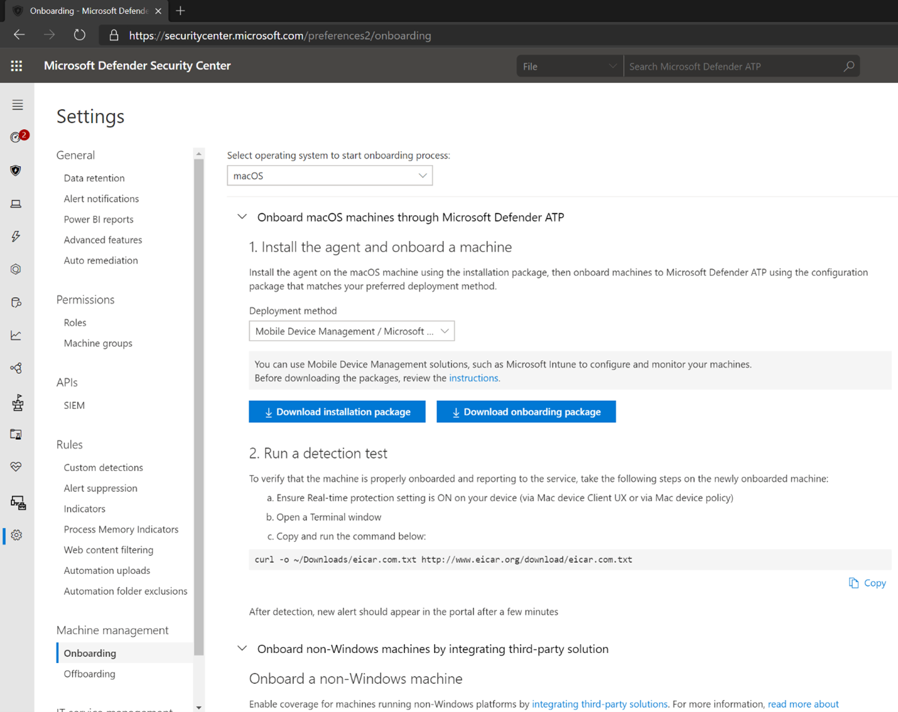
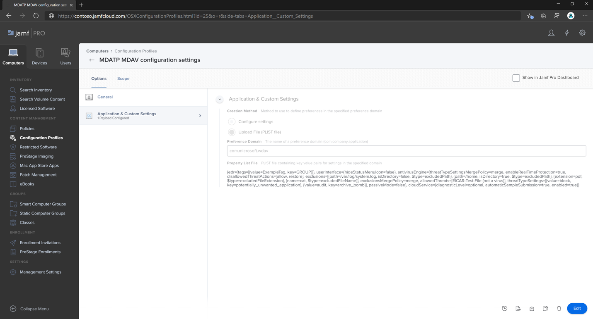
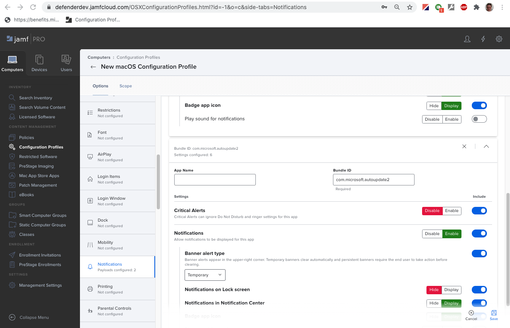
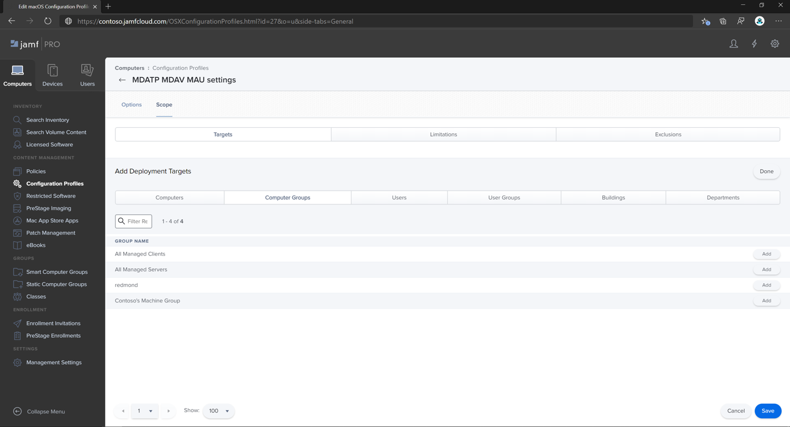
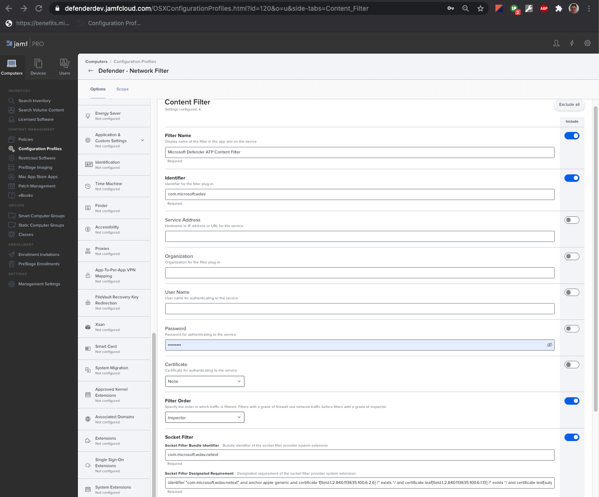

# <a name="set-up-the-microsoft-defender-for-endpoint-on-macos-policies-in-jamf-pro"></a><span data-ttu-id="ed651-104">Einrichten der Microsoft Defender für Endpunkt unter macOS-Richtlinien in Jamf Pro</span><span class="sxs-lookup"><span data-stu-id="ed651-104">Set up the Microsoft Defender for Endpoint on macOS policies in Jamf Pro</span></span>

[!INCLUDE [Microsoft 365 Defender rebranding](../../includes/microsoft-defender.md)]


<span data-ttu-id="ed651-105">**Gilt für:**</span><span class="sxs-lookup"><span data-stu-id="ed651-105">**Applies to:**</span></span>

- [<span data-ttu-id="ed651-106">Defender für Endpunkt auf dem Mac</span><span class="sxs-lookup"><span data-stu-id="ed651-106">Defender for Endpoint on Mac</span></span>](microsoft-defender-endpoint-mac.md)

<span data-ttu-id="ed651-107">Diese Seite führt Sie durch die Schritte, die Sie zum Einrichten von macOS-Richtlinien in Jamf Pro ausführen müssen.</span><span class="sxs-lookup"><span data-stu-id="ed651-107">This page will guide you through the steps you need to take to set up macOS policies in Jamf Pro.</span></span>

<span data-ttu-id="ed651-108">Sie müssen die folgenden Schritte ausführen:</span><span class="sxs-lookup"><span data-stu-id="ed651-108">You'll need to take the following steps:</span></span>

1. [<span data-ttu-id="ed651-109">Abrufen des Microsoft Defender für Endpunkt-Onboarding-Pakets</span><span class="sxs-lookup"><span data-stu-id="ed651-109">Get the Microsoft Defender for Endpoint onboarding package</span></span>](#step-1-get-the-microsoft-defender-for-endpoint-onboarding-package)

2. [<span data-ttu-id="ed651-110">Erstellen eines Konfigurationsprofils in Jamf Pro mithilfe des Onboardingpakets</span><span class="sxs-lookup"><span data-stu-id="ed651-110">Create a configuration profile in Jamf Pro using the onboarding package</span></span>](#step-2-create-a-configuration-profile-in-jamf-pro-using-the-onboarding-package)

3. [<span data-ttu-id="ed651-111">Konfigurieren von Microsoft Defender für Endpunkteinstellungen</span><span class="sxs-lookup"><span data-stu-id="ed651-111">Configure Microsoft Defender for Endpoint settings</span></span>](#step-3-configure-microsoft-defender-for-endpoint-settings)

4. [<span data-ttu-id="ed651-112">Konfigurieren von Microsoft Defender für Endpunkt-Benachrichtigungseinstellungen</span><span class="sxs-lookup"><span data-stu-id="ed651-112">Configure Microsoft Defender for Endpoint notification settings</span></span>](#step-4-configure-notifications-settings)

5. [<span data-ttu-id="ed651-113">Konfigurieren von Microsoft AutoUpdate (MAU)</span><span class="sxs-lookup"><span data-stu-id="ed651-113">Configure Microsoft AutoUpdate (MAU)</span></span>](#step-5-configure-microsoft-autoupdate-mau)

6. [<span data-ttu-id="ed651-114">Gewähren des vollständigen Datenträgerzugriffs auf Microsoft Defender für Endpunkt</span><span class="sxs-lookup"><span data-stu-id="ed651-114">Grant full disk access to Microsoft Defender for Endpoint</span></span>](#step-6-grant-full-disk-access-to-microsoft-defender-for-endpoint)

7. [<span data-ttu-id="ed651-115">Genehmigen der Kernelerweiterung für Microsoft Defender für Endpunkt</span><span class="sxs-lookup"><span data-stu-id="ed651-115">Approve Kernel extension for Microsoft Defender for Endpoint</span></span>](#step-7-approve-kernel-extension-for-microsoft-defender-for-endpoint)

8. [<span data-ttu-id="ed651-116">Genehmigen von Systemerweiterungen für Microsoft Defender für Endpunkt</span><span class="sxs-lookup"><span data-stu-id="ed651-116">Approve System extensions for Microsoft Defender for Endpoint</span></span>](#step-8-approve-system-extensions-for-microsoft-defender-for-endpoint)

9. [<span data-ttu-id="ed651-117">Konfigurieren der Netzwerkerweiterung</span><span class="sxs-lookup"><span data-stu-id="ed651-117">Configure Network Extension</span></span>](#step-9-configure-network-extension)

10. [<span data-ttu-id="ed651-118">Planen von Scans mit Microsoft Defender für Endpunkt unter macOS</span><span class="sxs-lookup"><span data-stu-id="ed651-118">Schedule scans with Microsoft Defender for Endpoint on macOS</span></span>](/windows/security/threat-protection/microsoft-defender-atp/mac-schedule-scan-atp)

11. [<span data-ttu-id="ed651-119">Bereitstellen von Microsoft Defender für Endpunkt unter macOS</span><span class="sxs-lookup"><span data-stu-id="ed651-119">Deploy Microsoft Defender for Endpoint on macOS</span></span>](#step-11-deploy-microsoft-defender-for-endpoint-on-macos)


## <a name="step-1-get-the-microsoft-defender-for-endpoint-onboarding-package"></a><span data-ttu-id="ed651-120">Schritt 1: Abrufen des Microsoft Defender für Endpunkt-Onboarding-Pakets</span><span class="sxs-lookup"><span data-stu-id="ed651-120">Step 1: Get the Microsoft Defender for Endpoint onboarding package</span></span>

1. <span data-ttu-id="ed651-121">Navigieren Sie [in Microsoft Defender Security Center](https://securitycenter.microsoft.com )zu **Einstellungen > Onboarding.**</span><span class="sxs-lookup"><span data-stu-id="ed651-121">In [Microsoft Defender Security Center](https://securitycenter.microsoft.com ), navigate to **Settings > Onboarding**.</span></span> 

2. <span data-ttu-id="ed651-122">Wählen Sie macOS als Betriebssystem und Verwaltung mobiler Geräte/Microsoft Intune als Bereitstellungsmethode aus.</span><span class="sxs-lookup"><span data-stu-id="ed651-122">Select macOS as the operating system and Mobile Device Management / Microsoft Intune as the deployment method.</span></span>

    

3. <span data-ttu-id="ed651-124">Wählen Sie **"Onboardingpaket herunterladen"** (WindowsDefenderATPOnboardingPackage.zip) aus.</span><span class="sxs-lookup"><span data-stu-id="ed651-124">Select **Download onboarding package** (WindowsDefenderATPOnboardingPackage.zip).</span></span>

4. <span data-ttu-id="ed651-125">Extrahieren `WindowsDefenderATPOnboardingPackage.zip` .</span><span class="sxs-lookup"><span data-stu-id="ed651-125">Extract `WindowsDefenderATPOnboardingPackage.zip`.</span></span>

5. <span data-ttu-id="ed651-126">Kopieren Sie die Datei an Ihren bevorzugten Speicherort.</span><span class="sxs-lookup"><span data-stu-id="ed651-126">Copy the file to your preferred location.</span></span> <span data-ttu-id="ed651-127">Zum Beispiel: `C:\Users\JaneDoe_or_JohnDoe.contoso\Downloads\WindowsDefenderATPOnboardingPackage_macOS_MDM_contoso\jamf\WindowsDefenderATPOnboarding.plist`.</span><span class="sxs-lookup"><span data-stu-id="ed651-127">For example,  `C:\Users\JaneDoe_or_JohnDoe.contoso\Downloads\WindowsDefenderATPOnboardingPackage_macOS_MDM_contoso\jamf\WindowsDefenderATPOnboarding.plist`.</span></span>


## <a name="step-2-create-a-configuration-profile-in-jamf-pro-using-the-onboarding-package"></a><span data-ttu-id="ed651-128">Schritt 2: Erstellen eines Konfigurationsprofils in Jamf Pro mithilfe des Onboardingpakets</span><span class="sxs-lookup"><span data-stu-id="ed651-128">Step 2: Create a configuration profile in Jamf Pro using the onboarding package</span></span>

1. <span data-ttu-id="ed651-129">Suchen Sie die Datei `WindowsDefenderATPOnboarding.plist` aus dem vorherigen Abschnitt.</span><span class="sxs-lookup"><span data-stu-id="ed651-129">Locate the file `WindowsDefenderATPOnboarding.plist` from the previous section.</span></span>

   

 
2. <span data-ttu-id="ed651-131">Wählen Sie im Jamf Pro-Dashboard **"Neu"** aus.</span><span class="sxs-lookup"><span data-stu-id="ed651-131">In the Jamf Pro dashboard, select **New**.</span></span>

    

3. <span data-ttu-id="ed651-133">Geben Sie die folgenden Details ein:</span><span class="sxs-lookup"><span data-stu-id="ed651-133">Enter the following details:</span></span>

   <span data-ttu-id="ed651-134">**Allgemein**</span><span class="sxs-lookup"><span data-stu-id="ed651-134">**General**</span></span>
   - <span data-ttu-id="ed651-135">Name: MDATP-Onboarding für macOS</span><span class="sxs-lookup"><span data-stu-id="ed651-135">Name: MDATP onboarding for macOS</span></span>
   - <span data-ttu-id="ed651-136">Beschreibung: MDATP EDR-Onboarding für macOS</span><span class="sxs-lookup"><span data-stu-id="ed651-136">Description: MDATP EDR onboarding for macOS</span></span>
   - <span data-ttu-id="ed651-137">Kategorie: Keine</span><span class="sxs-lookup"><span data-stu-id="ed651-137">Category: None</span></span>
   - <span data-ttu-id="ed651-138">Verteilungsmethode: Automatische Installation</span><span class="sxs-lookup"><span data-stu-id="ed651-138">Distribution Method: Install Automatically</span></span>
   - <span data-ttu-id="ed651-139">Stufe: Computerebene</span><span class="sxs-lookup"><span data-stu-id="ed651-139">Level: Computer Level</span></span>

4. <span data-ttu-id="ed651-140">**Wählen** Sie **in Application & Custom Einstellungen** configure aus.</span><span class="sxs-lookup"><span data-stu-id="ed651-140">In **Application & Custom Settings** select **Configure**.</span></span>

    

5. <span data-ttu-id="ed651-142">Wählen Sie **Hochladen Datei (PLIST-Datei)** aus, und geben Sie dann in der **Einstellungsdomäne** Folgendes ein: `com.microsoft.wdav.atp` .</span><span class="sxs-lookup"><span data-stu-id="ed651-142">Select **Upload File (PLIST file)** then in **Preference Domain** enter: `com.microsoft.wdav.atp`.</span></span> 

    

    

7. <span data-ttu-id="ed651-145">Wählen Sie **"Öffnen"** aus, und wählen Sie die Onboardingdatei aus.</span><span class="sxs-lookup"><span data-stu-id="ed651-145">Select **Open** and select the onboarding file.</span></span>

    

8. <span data-ttu-id="ed651-147">Wählen Sie **Hochladen** aus.</span><span class="sxs-lookup"><span data-stu-id="ed651-147">Select **Upload**.</span></span> 

    


9. <span data-ttu-id="ed651-149">Wählen Sie die Registerkarte **Bereich** aus.</span><span class="sxs-lookup"><span data-stu-id="ed651-149">Select the **Scope** tab.</span></span>

    

10. <span data-ttu-id="ed651-151">Wählen Sie die Zielcomputer aus.</span><span class="sxs-lookup"><span data-stu-id="ed651-151">Select the target computers.</span></span>

    

     

11. <span data-ttu-id="ed651-154">Wählen Sie **Speichern**.</span><span class="sxs-lookup"><span data-stu-id="ed651-154">Select **Save**.</span></span>

    

    

12. <span data-ttu-id="ed651-157">Wählen Sie **Fertig** aus.</span><span class="sxs-lookup"><span data-stu-id="ed651-157">Select **Done**.</span></span>

    

    

## <a name="step-3-configure-microsoft-defender-for-endpoint-settings"></a><span data-ttu-id="ed651-160">Schritt 3: Konfigurieren von Microsoft Defender für Endpunkteinstellungen</span><span class="sxs-lookup"><span data-stu-id="ed651-160">Step 3: Configure Microsoft Defender for Endpoint settings</span></span>

1.  <span data-ttu-id="ed651-161">Verwenden Sie die folgenden Konfigurationseinstellungen für Microsoft Defender für Endpunkt:</span><span class="sxs-lookup"><span data-stu-id="ed651-161">Use the following Microsoft Defender for Endpoint configuration settings:</span></span>

    - <span data-ttu-id="ed651-162">enableRealTimeProtection</span><span class="sxs-lookup"><span data-stu-id="ed651-162">enableRealTimeProtection</span></span>
    - <span data-ttu-id="ed651-163">passiveMode</span><span class="sxs-lookup"><span data-stu-id="ed651-163">passiveMode</span></span>
    
    >[!NOTE]
    ><span data-ttu-id="ed651-164">Nicht standardmäßig aktiviert, wenn Sie eine AV-Datei eines Drittanbieters für macOS ausführen möchten, legen Sie sie auf `true` .</span><span class="sxs-lookup"><span data-stu-id="ed651-164">Not turned on by default, if you are planning to run a third-party AV for macOS, set it to `true`.</span></span>

    - <span data-ttu-id="ed651-165">Ausschlüsse</span><span class="sxs-lookup"><span data-stu-id="ed651-165">exclusions</span></span>
    - <span data-ttu-id="ed651-166">excludedPath</span><span class="sxs-lookup"><span data-stu-id="ed651-166">excludedPath</span></span>
    - <span data-ttu-id="ed651-167">excludedFileExtension</span><span class="sxs-lookup"><span data-stu-id="ed651-167">excludedFileExtension</span></span>
    - <span data-ttu-id="ed651-168">excludedFileName</span><span class="sxs-lookup"><span data-stu-id="ed651-168">excludedFileName</span></span>
    - <span data-ttu-id="ed651-169">exclusionsMergePolicy</span><span class="sxs-lookup"><span data-stu-id="ed651-169">exclusionsMergePolicy</span></span>
    - <span data-ttu-id="ed651-170">allowedThreats</span><span class="sxs-lookup"><span data-stu-id="ed651-170">allowedThreats</span></span>
    
    >[!NOTE]
    ><span data-ttu-id="ed651-171">EICAR ist im Beispiel, wenn Sie einen Machbarkeitsstudie durchlaufen, entfernen Sie ihn, insbesondere, wenn Sie EICAR testen.</span><span class="sxs-lookup"><span data-stu-id="ed651-171">EICAR is on the sample, if you are going through a proof-of-concept, remove it especially if you are testing EICAR.</span></span>
        
    - <span data-ttu-id="ed651-172">disallowedThreatActions</span><span class="sxs-lookup"><span data-stu-id="ed651-172">disallowedThreatActions</span></span>
    - <span data-ttu-id="ed651-173">potentially_unwanted_application</span><span class="sxs-lookup"><span data-stu-id="ed651-173">potentially_unwanted_application</span></span>
    - <span data-ttu-id="ed651-174">archive_bomb</span><span class="sxs-lookup"><span data-stu-id="ed651-174">archive_bomb</span></span>
    - <span data-ttu-id="ed651-175">cloudService</span><span class="sxs-lookup"><span data-stu-id="ed651-175">cloudService</span></span>
    - <span data-ttu-id="ed651-176">automaticSampleSubmission</span><span class="sxs-lookup"><span data-stu-id="ed651-176">automaticSampleSubmission</span></span>
    - <span data-ttu-id="ed651-177">tags</span><span class="sxs-lookup"><span data-stu-id="ed651-177">tags</span></span>
    - <span data-ttu-id="ed651-178">hideStatusMenuIcon</span><span class="sxs-lookup"><span data-stu-id="ed651-178">hideStatusMenuIcon</span></span>
    
     <span data-ttu-id="ed651-179">Weitere Informationen finden Sie in der [Eigenschaftenliste für jamf-Konfigurationsprofil.](mac-preferences.md#property-list-for-jamf-configuration-profile)</span><span class="sxs-lookup"><span data-stu-id="ed651-179">For information, see [Property list for Jamf configuration profile](mac-preferences.md#property-list-for-jamf-configuration-profile).</span></span>

     ```XML
     <?xml version="1.0" encoding="UTF-8"?>
     <!DOCTYPE plist PUBLIC "-//Apple//DTD PLIST 1.0//EN" "http://www.apple.com/DTDs/PropertyList-1.0.dtd">
     <plist version="1.0">
     <dict>
         <key>antivirusEngine</key>
         <dict>
             <key>enableRealTimeProtection</key>
             <true/>
             <key>passiveMode</key>
             <false/>
             <key>exclusions</key>
             <array>
                 <dict>
                     <key>$type</key>
                     <string>excludedPath</string>
                     <key>isDirectory</key>
                     <false/>
                     <key>path</key>
                     <string>/var/log/system.log</string>
                 </dict>
                 <dict>
                     <key>$type</key>
                     <string>excludedPath</string>
                     <key>isDirectory</key>
                     <true/>
                     <key>path</key>
                     <string>/home</string>
                 </dict>
                 <dict>
                     <key>$type</key>
                     <string>excludedFileExtension</string>
                     <key>extension</key>
                     <string>pdf</string>
                 </dict>
                 <dict>
                     <key>$type</key>
                     <string>excludedFileName</string>
                     <key>name</key>
                     <string>cat</string>
                 </dict>
             </array>
             <key>exclusionsMergePolicy</key>
             <string>merge</string>
             <key>allowedThreats</key>
             <array>
                 <string>EICAR-Test-File (not a virus)</string>
             </array>
             <key>disallowedThreatActions</key>
             <array>
                 <string>allow</string>
                 <string>restore</string>
             </array>
             <key>threatTypeSettings</key>
             <array>
                 <dict>
                     <key>key</key>
                     <string>potentially_unwanted_application</string>
                     <key>value</key>
                     <string>block</string>
                 </dict>
                 <dict>
                     <key>key</key>
                     <string>archive_bomb</string>
                     <key>value</key>
                     <string>audit</string>
                 </dict>
             </array>
             <key>threatTypeSettingsMergePolicy</key>
             <string>merge</string>
         </dict>
         <key>cloudService</key>
         <dict>
             <key>enabled</key>
             <true/>
             <key>diagnosticLevel</key>
             <string>optional</string>
             <key>automaticSampleSubmission</key>
             <true/>
         </dict>
         <key>edr</key>
         <dict>
             <key>tags</key>
             <array>
                 <dict>
                     <key>key</key>
                     <string>GROUP</string>
                     <key>value</key>
                     <string>ExampleTag</string>
                 </dict>
             </array>
         </dict>
         <key>userInterface</key>
         <dict>
             <key>hideStatusMenuIcon</key>
             <false/>
         </dict>
     </dict>
     </plist>
     ```

2. <span data-ttu-id="ed651-180">Speichern Sie die Datei unter `MDATP_MDAV_configuration_settings.plist` .</span><span class="sxs-lookup"><span data-stu-id="ed651-180">Save the file as `MDATP_MDAV_configuration_settings.plist`.</span></span>


3.  <span data-ttu-id="ed651-181">Wählen Sie im Jamf Pro-Dashboard **"Allgemein"** aus.</span><span class="sxs-lookup"><span data-stu-id="ed651-181">In the Jamf Pro dashboard, select **General**.</span></span>

    

4. <span data-ttu-id="ed651-183">Geben Sie die folgenden Details ein:</span><span class="sxs-lookup"><span data-stu-id="ed651-183">Enter the following details:</span></span>

    <span data-ttu-id="ed651-184">**Allgemein**</span><span class="sxs-lookup"><span data-stu-id="ed651-184">**General**</span></span>
    
    - <span data-ttu-id="ed651-185">Name: MDATP MDAV-Konfigurationseinstellungen</span><span class="sxs-lookup"><span data-stu-id="ed651-185">Name: MDATP MDAV configuration settings</span></span>
    - <span data-ttu-id="ed651-186">Beschreibung:\<blank\></span><span class="sxs-lookup"><span data-stu-id="ed651-186">Description:\<blank\></span></span>
    - <span data-ttu-id="ed651-187">Kategorie: Keine (Standard)</span><span class="sxs-lookup"><span data-stu-id="ed651-187">Category: None (default)</span></span>
    - <span data-ttu-id="ed651-188">Verteilungsmethode: Automatisch installieren(Standard)</span><span class="sxs-lookup"><span data-stu-id="ed651-188">Distribution Method: Install Automatically(default)</span></span>
    - <span data-ttu-id="ed651-189">Stufe: Computerebene (Standard)</span><span class="sxs-lookup"><span data-stu-id="ed651-189">Level: Computer Level(default)</span></span>

    

5. <span data-ttu-id="ed651-191">**Wählen** Sie **in Application & Custom Einstellungen** configure aus.</span><span class="sxs-lookup"><span data-stu-id="ed651-191">In **Application & Custom Settings** select **Configure**.</span></span>

    

6. <span data-ttu-id="ed651-193">Wählen Sie **Hochladen Datei (PLIST-Datei)** aus.</span><span class="sxs-lookup"><span data-stu-id="ed651-193">Select **Upload File (PLIST file)**.</span></span>

    

7. <span data-ttu-id="ed651-195">Geben Sie in **"Einstellungsdomäne"** `com.microsoft.wdav` Hochladen **PLIST-Datei** ein.</span><span class="sxs-lookup"><span data-stu-id="ed651-195">In **Preferences Domain**, enter `com.microsoft.wdav`, then select  **Upload PLIST File**.</span></span>

    

8. <span data-ttu-id="ed651-197">Wählen Sie **"Datei auswählen"** aus.</span><span class="sxs-lookup"><span data-stu-id="ed651-197">Select **Choose File**.</span></span>

    

9. <span data-ttu-id="ed651-199">Wählen Sie die **MDATP_MDAV_configuration_settings.plist** aus, und wählen Sie dann **"Öffnen"** aus.</span><span class="sxs-lookup"><span data-stu-id="ed651-199">Select the **MDATP_MDAV_configuration_settings.plist**, then select **Open**.</span></span>

    

10. <span data-ttu-id="ed651-201">Wählen Sie **Hochladen** aus.</span><span class="sxs-lookup"><span data-stu-id="ed651-201">Select **Upload**.</span></span>

    

    

    >[!NOTE]
    ><span data-ttu-id="ed651-204">Wenn Sie die Intune-Datei hochladen, erhalten Sie den folgenden Fehler:</span><span class="sxs-lookup"><span data-stu-id="ed651-204">If you happen to upload the Intune file, you'll get the following error:</span></span><br>
    ><span data-ttu-id="ed651-205"></span><span class="sxs-lookup"><span data-stu-id="ed651-205"></span></span>


11. <span data-ttu-id="ed651-206">Wählen Sie **Speichern**.</span><span class="sxs-lookup"><span data-stu-id="ed651-206">Select **Save**.</span></span> 

    

12. <span data-ttu-id="ed651-208">Die Datei wird hochgeladen.</span><span class="sxs-lookup"><span data-stu-id="ed651-208">The file is uploaded.</span></span>

    

    

13. <span data-ttu-id="ed651-211">Wählen Sie die Registerkarte **Bereich** aus.</span><span class="sxs-lookup"><span data-stu-id="ed651-211">Select the **Scope** tab.</span></span>

    

14. <span data-ttu-id="ed651-213">Wählen Sie **die Computergruppe von Contoso** aus.</span><span class="sxs-lookup"><span data-stu-id="ed651-213">Select **Contoso's Machine Group**.</span></span> 

15. <span data-ttu-id="ed651-214">Wählen Sie **"Hinzufügen"** und dann **"Speichern"** aus.</span><span class="sxs-lookup"><span data-stu-id="ed651-214">Select **Add**, then select **Save**.</span></span>

    

    

16. <span data-ttu-id="ed651-217">Wählen Sie **Fertig** aus.</span><span class="sxs-lookup"><span data-stu-id="ed651-217">Select **Done**.</span></span> <span data-ttu-id="ed651-218">Das neue Konfigurationsprofil wird **angezeigt.**</span><span class="sxs-lookup"><span data-stu-id="ed651-218">You'll see the new **Configuration profile**.</span></span>

    


## <a name="step-4-configure-notifications-settings"></a><span data-ttu-id="ed651-220">Schritt 4: Konfigurieren von Benachrichtigungseinstellungen</span><span class="sxs-lookup"><span data-stu-id="ed651-220">Step 4: Configure notifications settings</span></span>

<span data-ttu-id="ed651-221">Diese Schritte gelten für macOS 10.15 (Macintosh) oder höher.</span><span class="sxs-lookup"><span data-stu-id="ed651-221">These steps are applicable of macOS 10.15 (Catalina) or newer.</span></span>

1. <span data-ttu-id="ed651-222">Wählen Sie im Jamf Pro-Dashboard **"Computer"** und dann **"Konfigurationsprofile" aus.**</span><span class="sxs-lookup"><span data-stu-id="ed651-222">In the Jamf Pro dashboard, select **Computers**, then **Configuration Profiles**.</span></span>

2. <span data-ttu-id="ed651-223">Klicken Sie auf **Neu,** und geben Sie die folgenden Details für **Optionen** ein:</span><span class="sxs-lookup"><span data-stu-id="ed651-223">Click **New**, and enter the following details for **Options**:</span></span>
    
    - <span data-ttu-id="ed651-224">**Registerkarte "Allgemein":**</span><span class="sxs-lookup"><span data-stu-id="ed651-224">Tab **General**:</span></span> 
        - <span data-ttu-id="ed651-225">**Name:** MDATP MDAV-Benachrichtigungseinstellungen</span><span class="sxs-lookup"><span data-stu-id="ed651-225">**Name**: MDATP MDAV Notification settings</span></span>
        - <span data-ttu-id="ed651-226">**Beschreibung:** macOS 10.15 (Bild) oder höher</span><span class="sxs-lookup"><span data-stu-id="ed651-226">**Description**: macOS 10.15 (Catalina) or newer</span></span>
        - <span data-ttu-id="ed651-227">**Kategorie:** None *(Standard)*</span><span class="sxs-lookup"><span data-stu-id="ed651-227">**Category**: None *(default)*</span></span>
        - <span data-ttu-id="ed651-228">**Verteilungsmethode:** Automatisch installieren *(Standard)*</span><span class="sxs-lookup"><span data-stu-id="ed651-228">**Distribution Method**: Install Automatically *(default)*</span></span>
        - <span data-ttu-id="ed651-229">**Ebene:** Computerebene *(Standard)*</span><span class="sxs-lookup"><span data-stu-id="ed651-229">**Level**: Computer Level *(default)*</span></span>

        

    - <span data-ttu-id="ed651-231">**Registerkartenbenachrichtigungen,** klicken Sie auf **"Hinzufügen",** und geben Sie die folgenden Werte ein:</span><span class="sxs-lookup"><span data-stu-id="ed651-231">Tab **Notifications**, click **Add**, and enter the following values:</span></span>
        - <span data-ttu-id="ed651-232">**Bundle-ID:**`com.microsoft.wdav.tray`</span><span class="sxs-lookup"><span data-stu-id="ed651-232">**Bundle ID**: `com.microsoft.wdav.tray`</span></span>
        - <span data-ttu-id="ed651-233">**Kritische Warnungen:** Klicken Sie auf **"Deaktivieren".**</span><span class="sxs-lookup"><span data-stu-id="ed651-233">**Critical Alerts**: Click **Disable**</span></span>
        - <span data-ttu-id="ed651-234">**Benachrichtigungen:** Klicken Sie auf **"Aktivieren".**</span><span class="sxs-lookup"><span data-stu-id="ed651-234">**Notifications**: Click **Enable**</span></span>
        - <span data-ttu-id="ed651-235">**Bannerwarnungstyp:** Auswählen **von "Einschließen"** und **"Temporär"** *(Standard)*</span><span class="sxs-lookup"><span data-stu-id="ed651-235">**Banner alert type**: Select **Include** and **Temporary** *(default)*</span></span>
        - <span data-ttu-id="ed651-236">**Benachrichtigungen auf dem Sperrbildschirm:** Klicken Sie auf **"Ausblenden".**</span><span class="sxs-lookup"><span data-stu-id="ed651-236">**Notifications on lock screen**: Click **Hide**</span></span>
        - <span data-ttu-id="ed651-237">**Benachrichtigungen im Info-Center:** Klicken Sie auf **"Anzeigen".**</span><span class="sxs-lookup"><span data-stu-id="ed651-237">**Notifications in Notification Center**: Click **Display**</span></span>
        - <span data-ttu-id="ed651-238">**Symbol der Signal-App:** Klicken Sie auf **"Anzeigen".**</span><span class="sxs-lookup"><span data-stu-id="ed651-238">**Badge app icon**: Click **Display**</span></span>

        

    - <span data-ttu-id="ed651-240">Registerkarte **"Benachrichtigungen",** klicken Sie auf "Noch einmal **hinzufügen",** scrollen Sie nach unten zu **"Neue Benachrichtigungen", Einstellungen**</span><span class="sxs-lookup"><span data-stu-id="ed651-240">Tab **Notifications**, click **Add** one more time, scroll down to **New Notifications Settings**</span></span>
        - <span data-ttu-id="ed651-241">**Bundle-ID:**`com.microsoft.autoupdate2`</span><span class="sxs-lookup"><span data-stu-id="ed651-241">**Bundle ID**: `com.microsoft.autoupdate2`</span></span>
        - <span data-ttu-id="ed651-242">Konfigurieren Sie die restlichen Einstellungen auf dieselben Werte wie oben</span><span class="sxs-lookup"><span data-stu-id="ed651-242">Configure the rest of the settings to the same values as above</span></span>

        

        <span data-ttu-id="ed651-244">Beachten Sie, dass Sie jetzt zwei "Tabellen" mit Benachrichtigungskonfigurationen haben, eine für **die Bundle-ID: com.microsoft.wdav.tray** und eine weitere für **die Bundle-ID: com.microsoft.autoupdate2**.</span><span class="sxs-lookup"><span data-stu-id="ed651-244">Note that now you have two 'tables' with notification configurations, one for **Bundle ID: com.microsoft.wdav.tray**, and another for **Bundle ID: com.microsoft.autoupdate2**.</span></span> <span data-ttu-id="ed651-245">Während Sie Warnungseinstellungen gemäß Ihren Anforderungen konfigurieren können, müssen Bundle-IDs genau die gleichen wie zuvor beschrieben sein, und **die Option "Einschließen"** muss für **Benachrichtigungen** **aktiviert** sein.</span><span class="sxs-lookup"><span data-stu-id="ed651-245">While you can configure alert settings per your requirements, Bundle IDs must be exactly the same as described before, and **Include** switch must be **On** for **Notifications**.</span></span>

3. <span data-ttu-id="ed651-246">Wählen Sie die Registerkarte **"Bereich"** und dann **"Hinzufügen"** aus.</span><span class="sxs-lookup"><span data-stu-id="ed651-246">Select the **Scope** tab, then select **Add**.</span></span>

    

4. <span data-ttu-id="ed651-248">Wählen Sie **die Computergruppe von Contoso** aus.</span><span class="sxs-lookup"><span data-stu-id="ed651-248">Select **Contoso's Machine Group**.</span></span> 

5. <span data-ttu-id="ed651-249">Wählen Sie **"Hinzufügen"** und dann **"Speichern"** aus.</span><span class="sxs-lookup"><span data-stu-id="ed651-249">Select **Add**, then select **Save**.</span></span>
    
    
    
    

6. <span data-ttu-id="ed651-252">Wählen Sie **Fertig** aus.</span><span class="sxs-lookup"><span data-stu-id="ed651-252">Select **Done**.</span></span> <span data-ttu-id="ed651-253">Das neue Konfigurationsprofil wird **angezeigt.**</span><span class="sxs-lookup"><span data-stu-id="ed651-253">You'll see the new **Configuration profile**.</span></span>
    <span data-ttu-id="ed651-254"></span><span class="sxs-lookup"><span data-stu-id="ed651-254"></span></span>

## <a name="step-5-configure-microsoft-autoupdate-mau"></a><span data-ttu-id="ed651-255">Schritt 5: Konfigurieren von Microsoft AutoUpdate (MAU)</span><span class="sxs-lookup"><span data-stu-id="ed651-255">Step 5: Configure Microsoft AutoUpdate (MAU)</span></span>

1. <span data-ttu-id="ed651-256">Verwenden Sie die folgenden Konfigurationseinstellungen für Microsoft Defender für Endpunkt:</span><span class="sxs-lookup"><span data-stu-id="ed651-256">Use the following Microsoft Defender for Endpoint configuration settings:</span></span>

      ```XML
   <?xml version="1.0" encoding="UTF-8"?>
   <!DOCTYPE plist PUBLIC "-//Apple//DTD PLIST 1.0//EN" "http://www.apple.com/DTDs/PropertyList-1.0.dtd">
   <plist version="1.0">
   <dict>
    <key>ChannelName</key>
    <string>Current</string>
    <key>HowToCheck</key>
    <string>AutomaticDownload</string>
    <key>EnableCheckForUpdatesButton</key>
    <true/>
    <key>DisableInsiderCheckbox</key>
    <false/>
    <key>SendAllTelemetryEnabled</key>
    <true/>
   </dict>
   </plist>
   ```

2. <span data-ttu-id="ed651-257">Speichern Sie es unter `MDATP_MDAV_MAU_settings.plist` .</span><span class="sxs-lookup"><span data-stu-id="ed651-257">Save it as `MDATP_MDAV_MAU_settings.plist`.</span></span>

3. <span data-ttu-id="ed651-258">Wählen Sie im Jamf Pro-Dashboard **"Allgemein"** aus.</span><span class="sxs-lookup"><span data-stu-id="ed651-258">In the Jamf Pro dashboard, select **General**.</span></span> 

    

4. <span data-ttu-id="ed651-260">Geben Sie die folgenden Details ein:</span><span class="sxs-lookup"><span data-stu-id="ed651-260">Enter the following details:</span></span>

    <span data-ttu-id="ed651-261">**Allgemein**</span><span class="sxs-lookup"><span data-stu-id="ed651-261">**General**</span></span> 
    
    - <span data-ttu-id="ed651-262">Name: MDATP MDAV MAU-Einstellungen</span><span class="sxs-lookup"><span data-stu-id="ed651-262">Name: MDATP MDAV MAU settings</span></span>
    - <span data-ttu-id="ed651-263">Beschreibung: Microsoft AutoUpdate-Einstellungen für MDATP für macOS</span><span class="sxs-lookup"><span data-stu-id="ed651-263">Description: Microsoft AutoUpdate settings for MDATP for macOS</span></span>
    - <span data-ttu-id="ed651-264">Kategorie: Keine (Standard)</span><span class="sxs-lookup"><span data-stu-id="ed651-264">Category: None (default)</span></span>
    - <span data-ttu-id="ed651-265">Verteilungsmethode: Automatisch installieren(Standard)</span><span class="sxs-lookup"><span data-stu-id="ed651-265">Distribution Method: Install Automatically(default)</span></span>
    - <span data-ttu-id="ed651-266">Stufe: Computerebene (Standard)</span><span class="sxs-lookup"><span data-stu-id="ed651-266">Level: Computer Level(default)</span></span>

5. <span data-ttu-id="ed651-267">**Wählen** Sie **in Application & Custom Einstellungen** configure aus.</span><span class="sxs-lookup"><span data-stu-id="ed651-267">In **Application & Custom Settings** select **Configure**.</span></span>

    

6. <span data-ttu-id="ed651-269">Wählen Sie **Hochladen Datei (PLIST-Datei)** aus.</span><span class="sxs-lookup"><span data-stu-id="ed651-269">Select **Upload File (PLIST file)**.</span></span>

      

7. <span data-ttu-id="ed651-271">Geben Sie in **der Einstellungsdomäne** Folgendes ein: `com.microsoft.autoupdate2` und wählen Sie dann Hochladen **PLIST-Datei** aus.</span><span class="sxs-lookup"><span data-stu-id="ed651-271">In **Preference Domain** enter: `com.microsoft.autoupdate2`, then select **Upload PLIST File**.</span></span>

    

8. <span data-ttu-id="ed651-273">Wählen Sie **"Datei auswählen"** aus.</span><span class="sxs-lookup"><span data-stu-id="ed651-273">Select **Choose File**.</span></span>

    

9. <span data-ttu-id="ed651-275">Wählen Sie **MDATP_MDAV_MAU_settings.plist** aus.</span><span class="sxs-lookup"><span data-stu-id="ed651-275">Select **MDATP_MDAV_MAU_settings.plist**.</span></span>

    

10. <span data-ttu-id="ed651-277">Wählen Sie **Hochladen** aus.</span><span class="sxs-lookup"><span data-stu-id="ed651-277">Select **Upload**.</span></span>
    <span data-ttu-id="ed651-278"></span><span class="sxs-lookup"><span data-stu-id="ed651-278"></span></span>

    

11. <span data-ttu-id="ed651-280">Wählen Sie **Speichern**.</span><span class="sxs-lookup"><span data-stu-id="ed651-280">Select **Save**.</span></span>

    

12. <span data-ttu-id="ed651-282">Wählen Sie die Registerkarte **Bereich** aus.</span><span class="sxs-lookup"><span data-stu-id="ed651-282">Select the **Scope** tab.</span></span>
   
     

13. <span data-ttu-id="ed651-284">Wählen Sie **Hinzufügen**.</span><span class="sxs-lookup"><span data-stu-id="ed651-284">Select **Add**.</span></span>
    
    

    

    

14. <span data-ttu-id="ed651-288">Wählen Sie **Fertig** aus.</span><span class="sxs-lookup"><span data-stu-id="ed651-288">Select **Done**.</span></span>
    
    

## <a name="step-6-grant-full-disk-access-to-microsoft-defender-for-endpoint"></a><span data-ttu-id="ed651-290">Schritt 6: Gewähren des vollständigen Datenträgerzugriffs auf Microsoft Defender für Endpunkt</span><span class="sxs-lookup"><span data-stu-id="ed651-290">Step 6: Grant full disk access to Microsoft Defender for Endpoint</span></span>

1. <span data-ttu-id="ed651-291">Wählen Sie im Jamf Pro-Dashboard **Konfigurationsprofile aus.**</span><span class="sxs-lookup"><span data-stu-id="ed651-291">In the Jamf Pro dashboard, select **Configuration Profiles**.</span></span>

    

2. <span data-ttu-id="ed651-293">Wählen Sie **+ Neu** aus.</span><span class="sxs-lookup"><span data-stu-id="ed651-293">Select **+ New**.</span></span> 

3. <span data-ttu-id="ed651-294">Geben Sie die folgenden Details ein:</span><span class="sxs-lookup"><span data-stu-id="ed651-294">Enter the following details:</span></span>

    <span data-ttu-id="ed651-295">**Allgemein**</span><span class="sxs-lookup"><span data-stu-id="ed651-295">**General**</span></span> 
    - <span data-ttu-id="ed651-296">Name: MDATP MDAV – Gewähren des vollständigen Datenträgerzugriffs auf EDR und AV</span><span class="sxs-lookup"><span data-stu-id="ed651-296">Name: MDATP MDAV - grant Full Disk Access to EDR and AV</span></span>
    - <span data-ttu-id="ed651-297">Beschreibung: Auf macOS- oder neueren Computern wird die neue Richtliniensteuerung für Die Datenschutzeinstellungen</span><span class="sxs-lookup"><span data-stu-id="ed651-297">Description: On macOS Catalina or newer, the new Privacy Preferences Policy Control</span></span>
    - <span data-ttu-id="ed651-298">Kategorie: Keine</span><span class="sxs-lookup"><span data-stu-id="ed651-298">Category: None</span></span>
    - <span data-ttu-id="ed651-299">Verteilungsmethode: Automatische Installation</span><span class="sxs-lookup"><span data-stu-id="ed651-299">Distribution method: Install Automatically</span></span>
    - <span data-ttu-id="ed651-300">Stufe: Computerebene</span><span class="sxs-lookup"><span data-stu-id="ed651-300">Level: Computer level</span></span>


    

4. <span data-ttu-id="ed651-302">Wählen Sie unter **"Datenschutzeinstellungsrichtliniensteuerung** konfigurieren" die Option **"Konfigurieren"** aus.</span><span class="sxs-lookup"><span data-stu-id="ed651-302">In **Configure Privacy Preferences Policy Control** select **Configure**.</span></span>

    

5. <span data-ttu-id="ed651-304">Geben Sie unter **"Datenschutzeinstellungsrichtliniensteuerung"** die folgenden Details ein:</span><span class="sxs-lookup"><span data-stu-id="ed651-304">In **Privacy Preferences Policy Control**, enter the following details:</span></span>

    - <span data-ttu-id="ed651-305">Bezeichner: `com.microsoft.wdav`</span><span class="sxs-lookup"><span data-stu-id="ed651-305">Identifier: `com.microsoft.wdav`</span></span>
    - <span data-ttu-id="ed651-306">Bezeichnertyp: Bundle-ID</span><span class="sxs-lookup"><span data-stu-id="ed651-306">Identifier Type: Bundle ID</span></span>
    - <span data-ttu-id="ed651-307">Codeanforderung: `identifier "com.microsoft.wdav" and anchor apple generic and certificate 1[field.1.2.840.113635.100.6.2.6] /* exists */ and certificate leaf[field.1.2.840.113635.100.6.1.13] /* exists */ and certificate leaf[subject.OU] = UBF8T346G9`</span><span class="sxs-lookup"><span data-stu-id="ed651-307">Code Requirement: `identifier "com.microsoft.wdav" and anchor apple generic and certificate 1[field.1.2.840.113635.100.6.2.6] /* exists */ and certificate leaf[field.1.2.840.113635.100.6.1.13] /* exists */ and certificate leaf[subject.OU] = UBF8T346G9`</span></span>


    

6. <span data-ttu-id="ed651-309">Wählen Sie **+ Hinzufügen** aus.</span><span class="sxs-lookup"><span data-stu-id="ed651-309">Select **+ Add**.</span></span>

    

    - <span data-ttu-id="ed651-311">Unter App oder Dienst: Auf **SystemPolicyAllFiles** festlegen</span><span class="sxs-lookup"><span data-stu-id="ed651-311">Under App or service: Set to **SystemPolicyAllFiles**</span></span>

    - <span data-ttu-id="ed651-312">Unter "Zugriff": Auf **"Zulassen"** festlegen</span><span class="sxs-lookup"><span data-stu-id="ed651-312">Under "access": Set to **Allow**</span></span>

7. <span data-ttu-id="ed651-313">Wählen Sie **"Speichern"** (nicht die unten rechts) aus.</span><span class="sxs-lookup"><span data-stu-id="ed651-313">Select **Save** (not the one at the bottom right).</span></span>

    

8. <span data-ttu-id="ed651-315">Klicken Sie auf das `+` Zeichen neben **App Access,** um einen neuen Eintrag hinzuzufügen.</span><span class="sxs-lookup"><span data-stu-id="ed651-315">Click the `+` sign next to **App Access** to add a new entry.</span></span>

    

9. <span data-ttu-id="ed651-317">Geben Sie die folgenden Details ein:</span><span class="sxs-lookup"><span data-stu-id="ed651-317">Enter the following details:</span></span>

    - <span data-ttu-id="ed651-318">Bezeichner: `com.microsoft.wdav.epsext`</span><span class="sxs-lookup"><span data-stu-id="ed651-318">Identifier: `com.microsoft.wdav.epsext`</span></span>
    - <span data-ttu-id="ed651-319">Bezeichnertyp: Bundle-ID</span><span class="sxs-lookup"><span data-stu-id="ed651-319">Identifier Type: Bundle ID</span></span>
    - <span data-ttu-id="ed651-320">Codeanforderung: `identifier "com.microsoft.wdav.epsext" and anchor apple generic and certificate 1[field.1.2.840.113635.100.6.2.6] /* exists */ and certificate leaf[field.1.2.840.113635.100.6.1.13] /* exists */ and certificate leaf[subject.OU] = UBF8T346G9`</span><span class="sxs-lookup"><span data-stu-id="ed651-320">Code Requirement: `identifier "com.microsoft.wdav.epsext" and anchor apple generic and certificate 1[field.1.2.840.113635.100.6.2.6] /* exists */ and certificate leaf[field.1.2.840.113635.100.6.1.13] /* exists */ and certificate leaf[subject.OU] = UBF8T346G9`</span></span>

10. <span data-ttu-id="ed651-321">Wählen Sie **+ Hinzufügen** aus.</span><span class="sxs-lookup"><span data-stu-id="ed651-321">Select **+ Add**.</span></span>

    

    - <span data-ttu-id="ed651-323">Unter App oder Dienst: Auf **SystemPolicyAllFiles** festlegen</span><span class="sxs-lookup"><span data-stu-id="ed651-323">Under App or service: Set to **SystemPolicyAllFiles**</span></span>

    - <span data-ttu-id="ed651-324">Unter "Zugriff": Auf **"Zulassen"** festlegen</span><span class="sxs-lookup"><span data-stu-id="ed651-324">Under "access": Set to **Allow**</span></span>

11. <span data-ttu-id="ed651-325">Wählen Sie **"Speichern"** (nicht die unten rechts) aus.</span><span class="sxs-lookup"><span data-stu-id="ed651-325">Select **Save** (not the one at the bottom right).</span></span>

    

12. <span data-ttu-id="ed651-327">Wählen Sie die Registerkarte **Bereich** aus.</span><span class="sxs-lookup"><span data-stu-id="ed651-327">Select the **Scope** tab.</span></span>

    

13. <span data-ttu-id="ed651-329">Wählen Sie **+ Hinzufügen** aus.</span><span class="sxs-lookup"><span data-stu-id="ed651-329">Select **+ Add**.</span></span>

    

14. <span data-ttu-id="ed651-331">Wählen Sie unter **"Gruppenname"** > **Computergruppen** > die **Computergruppe von Contoso** aus.</span><span class="sxs-lookup"><span data-stu-id="ed651-331">Select **Computer Groups** > under **Group Name** > select **Contoso's MachineGroup**.</span></span> 

    

15. <span data-ttu-id="ed651-333">Wählen Sie **Hinzufügen**.</span><span class="sxs-lookup"><span data-stu-id="ed651-333">Select **Add**.</span></span> 

16. <span data-ttu-id="ed651-334">Wählen Sie **Speichern**.</span><span class="sxs-lookup"><span data-stu-id="ed651-334">Select **Save**.</span></span> 
    
17. <span data-ttu-id="ed651-335">Wählen Sie **Fertig** aus.</span><span class="sxs-lookup"><span data-stu-id="ed651-335">Select **Done**.</span></span>
    
    
    
    

<span data-ttu-id="ed651-338">Alternativ können Sie [fulldisk.mobileconfig](https://github.com/microsoft/mdatp-xplat/blob/master/macos/mobileconfig/profiles/fulldisk.mobileconfig) herunterladen und in JAMF-Konfigurationsprofile hochladen, wie unter ["Deploying Custom Configuration Profiles using Jamf Pro| Methode 2: Hochladen ein Konfigurationsprofil zu Jamf Pro.](https://www.jamf.com/jamf-nation/articles/648/deploying-custom-configuration-profiles-using-jamf-pro)</span><span class="sxs-lookup"><span data-stu-id="ed651-338">Alternatively, you can download [fulldisk.mobileconfig](https://github.com/microsoft/mdatp-xplat/blob/master/macos/mobileconfig/profiles/fulldisk.mobileconfig) and upload it to JAMF Configuration Profiles as described in [Deploying Custom Configuration Profiles using Jamf Pro|Method 2: Upload a Configuration Profile to Jamf Pro](https://www.jamf.com/jamf-nation/articles/648/deploying-custom-configuration-profiles-using-jamf-pro).</span></span>

## <a name="step-7-approve-kernel-extension-for-microsoft-defender-for-endpoint"></a><span data-ttu-id="ed651-339">Schritt 7: Genehmigen der Kernelerweiterung für Microsoft Defender für Endpunkt</span><span class="sxs-lookup"><span data-stu-id="ed651-339">Step 7: Approve Kernel extension for Microsoft Defender for Endpoint</span></span>

> [!CAUTION]
> <span data-ttu-id="ed651-340">Apple Silicon (M1)-Geräte unterstützen KEXT nicht.</span><span class="sxs-lookup"><span data-stu-id="ed651-340">Apple Silicon (M1) devices do not support KEXT.</span></span> <span data-ttu-id="ed651-341">Die Installation eines Konfigurationsprofils, das aus KEXT-Richtlinien besteht, schlägt auf diesen Geräten fehl.</span><span class="sxs-lookup"><span data-stu-id="ed651-341">Installation of a configuration profile consisting KEXT policies will fail on these devices.</span></span>

1. <span data-ttu-id="ed651-342">Wählen Sie in den **Konfigurationsprofilen** **+Neu** aus.</span><span class="sxs-lookup"><span data-stu-id="ed651-342">In the **Configuration Profiles**, select **+ New**.</span></span>

    

2. <span data-ttu-id="ed651-344">Geben Sie die folgenden Details ein:</span><span class="sxs-lookup"><span data-stu-id="ed651-344">Enter the following details:</span></span>

    <span data-ttu-id="ed651-345">**Allgemein**</span><span class="sxs-lookup"><span data-stu-id="ed651-345">**General**</span></span> 
    
    - <span data-ttu-id="ed651-346">Name: MDATP MDAV Kernel Extension</span><span class="sxs-lookup"><span data-stu-id="ed651-346">Name: MDATP MDAV Kernel Extension</span></span>
    - <span data-ttu-id="ed651-347">Beschreibung: MDATP Kernelerweiterung (kext)</span><span class="sxs-lookup"><span data-stu-id="ed651-347">Description: MDATP kernel extension (kext)</span></span>
    - <span data-ttu-id="ed651-348">Kategorie: Keine</span><span class="sxs-lookup"><span data-stu-id="ed651-348">Category: None</span></span>
    - <span data-ttu-id="ed651-349">Verteilungsmethode: Automatische Installation</span><span class="sxs-lookup"><span data-stu-id="ed651-349">Distribution Method: Install Automatically</span></span>
    - <span data-ttu-id="ed651-350">Stufe: Computerebene</span><span class="sxs-lookup"><span data-stu-id="ed651-350">Level: Computer Level</span></span>

    

3. <span data-ttu-id="ed651-352">Wählen Sie unter **"Genehmigte Kernelerweiterungen konfigurieren"** die Option **"Konfigurieren"** aus.</span><span class="sxs-lookup"><span data-stu-id="ed651-352">In **Configure Approved Kernel Extensions** select **Configure**.</span></span>

    

   
4. <span data-ttu-id="ed651-354">Geben Sie in **"Genehmigte Kernelerweiterungen"** die folgenden Details ein:</span><span class="sxs-lookup"><span data-stu-id="ed651-354">In **Approved Kernel Extensions** Enter the following details:</span></span>

    - <span data-ttu-id="ed651-355">Anzeigename: Microsoft Corp.</span><span class="sxs-lookup"><span data-stu-id="ed651-355">Display Name: Microsoft Corp.</span></span>
    - <span data-ttu-id="ed651-356">Team-ID: UBF8T346G9</span><span class="sxs-lookup"><span data-stu-id="ed651-356">Team ID: UBF8T346G9</span></span>

    

5. <span data-ttu-id="ed651-358">Wählen Sie die Registerkarte **Bereich** aus.</span><span class="sxs-lookup"><span data-stu-id="ed651-358">Select the **Scope** tab.</span></span>

    

6. <span data-ttu-id="ed651-360">Wählen Sie **+ Hinzufügen** aus.</span><span class="sxs-lookup"><span data-stu-id="ed651-360">Select **+ Add**.</span></span>

7. <span data-ttu-id="ed651-361">Wählen Sie unter **"Gruppenname"** > **Computergruppen** > **Computergruppe von Contoso** aus.</span><span class="sxs-lookup"><span data-stu-id="ed651-361">Select **Computer Groups** > under **Group Name** > select **Contoso's Machine Group**.</span></span>

8. <span data-ttu-id="ed651-362">Wählen Sie **+ Hinzufügen** aus.</span><span class="sxs-lookup"><span data-stu-id="ed651-362">Select **+ Add**.</span></span>

    

9. <span data-ttu-id="ed651-364">Wählen Sie **Speichern**.</span><span class="sxs-lookup"><span data-stu-id="ed651-364">Select **Save**.</span></span>

    

10. <span data-ttu-id="ed651-366">Wählen Sie **Fertig** aus.</span><span class="sxs-lookup"><span data-stu-id="ed651-366">Select **Done**.</span></span>

    

<span data-ttu-id="ed651-368">Alternativ können Sie [kext.mobileconfig](https://github.com/microsoft/mdatp-xplat/blob/master/macos/mobileconfig/profiles/kext.mobileconfig) herunterladen und in JAMF-Konfigurationsprofile hochladen, wie unter ["Deploying Custom Configuration Profiles using Jamf Pro| Methode 2: Hochladen ein Konfigurationsprofil zu Jamf Pro.](https://www.jamf.com/jamf-nation/articles/648/deploying-custom-configuration-profiles-using-jamf-pro)</span><span class="sxs-lookup"><span data-stu-id="ed651-368">Alternatively, you can download [kext.mobileconfig](https://github.com/microsoft/mdatp-xplat/blob/master/macos/mobileconfig/profiles/kext.mobileconfig) and upload it to JAMF Configuration Profiles as described in [Deploying Custom Configuration Profiles using Jamf Pro|Method 2: Upload a Configuration Profile to Jamf Pro](https://www.jamf.com/jamf-nation/articles/648/deploying-custom-configuration-profiles-using-jamf-pro).</span></span>

## <a name="step-8-approve-system-extensions-for-microsoft-defender-for-endpoint"></a><span data-ttu-id="ed651-369">Schritt 8: Genehmigen von Systemerweiterungen für Microsoft Defender für Endpunkt</span><span class="sxs-lookup"><span data-stu-id="ed651-369">Step 8: Approve System extensions for Microsoft Defender for Endpoint</span></span>

1. <span data-ttu-id="ed651-370">Wählen Sie in den **Konfigurationsprofilen** **+Neu** aus.</span><span class="sxs-lookup"><span data-stu-id="ed651-370">In the **Configuration Profiles**, select **+ New**.</span></span>

    

2. <span data-ttu-id="ed651-372">Geben Sie die folgenden Details ein:</span><span class="sxs-lookup"><span data-stu-id="ed651-372">Enter the following details:</span></span>

    <span data-ttu-id="ed651-373">**Allgemein**</span><span class="sxs-lookup"><span data-stu-id="ed651-373">**General**</span></span>
    
    - <span data-ttu-id="ed651-374">Name: MDATP MDAV-Systemerweiterungen</span><span class="sxs-lookup"><span data-stu-id="ed651-374">Name: MDATP MDAV System Extensions</span></span>
    - <span data-ttu-id="ed651-375">Beschreibung: MDATP Systemerweiterungen</span><span class="sxs-lookup"><span data-stu-id="ed651-375">Description: MDATP system extensions</span></span>
    - <span data-ttu-id="ed651-376">Kategorie: Keine</span><span class="sxs-lookup"><span data-stu-id="ed651-376">Category: None</span></span>
    - <span data-ttu-id="ed651-377">Verteilungsmethode: Automatische Installation</span><span class="sxs-lookup"><span data-stu-id="ed651-377">Distribution Method: Install Automatically</span></span>
    - <span data-ttu-id="ed651-378">Stufe: Computerebene</span><span class="sxs-lookup"><span data-stu-id="ed651-378">Level: Computer Level</span></span>

    

3. <span data-ttu-id="ed651-380">Wählen Sie **in "Systemerweiterungen"** die Option **"Konfigurieren"** aus.</span><span class="sxs-lookup"><span data-stu-id="ed651-380">In **System Extensions** select **Configure**.</span></span>

   

4. <span data-ttu-id="ed651-382">Geben Sie in **Systemerweiterungen** die folgenden Details ein:</span><span class="sxs-lookup"><span data-stu-id="ed651-382">In **System Extensions** enter the following details:</span></span>

   - <span data-ttu-id="ed651-383">Anzeigename: Microsoft Corp. Systemerweiterungen</span><span class="sxs-lookup"><span data-stu-id="ed651-383">Display Name: Microsoft Corp. System Extensions</span></span>
   - <span data-ttu-id="ed651-384">Systemerweiterungstypen: Zulässige Systemerweiterungen</span><span class="sxs-lookup"><span data-stu-id="ed651-384">System Extension Types: Allowed System Extensions</span></span>
   - <span data-ttu-id="ed651-385">Teambezeichner: UBF8T346G9</span><span class="sxs-lookup"><span data-stu-id="ed651-385">Team Identifier: UBF8T346G9</span></span>
   - <span data-ttu-id="ed651-386">Zulässige Systemerweiterungen:</span><span class="sxs-lookup"><span data-stu-id="ed651-386">Allowed System Extensions:</span></span>
     - <span data-ttu-id="ed651-387">**com.microsoft.wdav.epsext**</span><span class="sxs-lookup"><span data-stu-id="ed651-387">**com.microsoft.wdav.epsext**</span></span>
     - <span data-ttu-id="ed651-388">**com.microsoft.wdav.netext**</span><span class="sxs-lookup"><span data-stu-id="ed651-388">**com.microsoft.wdav.netext**</span></span>

    

5. <span data-ttu-id="ed651-390">Wählen Sie die Registerkarte **Bereich** aus.</span><span class="sxs-lookup"><span data-stu-id="ed651-390">Select the **Scope** tab.</span></span>

    

6. <span data-ttu-id="ed651-392">Wählen Sie **+ Hinzufügen** aus.</span><span class="sxs-lookup"><span data-stu-id="ed651-392">Select **+ Add**.</span></span>

7. <span data-ttu-id="ed651-393">Wählen Sie unter **"Gruppenname"** > **Computergruppen** > **Computergruppe von Contoso** aus.</span><span class="sxs-lookup"><span data-stu-id="ed651-393">Select **Computer Groups** > under **Group Name** > select **Contoso's Machine Group**.</span></span>

8. <span data-ttu-id="ed651-394">Wählen Sie **+ Hinzufügen** aus.</span><span class="sxs-lookup"><span data-stu-id="ed651-394">Select **+ Add**.</span></span>

   

9. <span data-ttu-id="ed651-396">Wählen Sie **Speichern**.</span><span class="sxs-lookup"><span data-stu-id="ed651-396">Select **Save**.</span></span>

   

10. <span data-ttu-id="ed651-398">Wählen Sie **Fertig** aus.</span><span class="sxs-lookup"><span data-stu-id="ed651-398">Select **Done**.</span></span>

    

## <a name="step-9-configure-network-extension"></a><span data-ttu-id="ed651-400">Schritt 9: Konfigurieren der Netzwerkerweiterung</span><span class="sxs-lookup"><span data-stu-id="ed651-400">Step 9: Configure Network Extension</span></span>

<span data-ttu-id="ed651-401">Als Teil der Funktionen für Endpunkterkennung und -reaktion prüft Microsoft Defender für Endpunkt unter macOS Socketdatenverkehr und meldet diese Informationen an das Microsoft Defender Security Center Portal.</span><span class="sxs-lookup"><span data-stu-id="ed651-401">As part of the Endpoint Detection and Response capabilities, Microsoft Defender for Endpoint on macOS inspects socket traffic and reports this information to the Microsoft Defender Security Center portal.</span></span> <span data-ttu-id="ed651-402">Mit der folgenden Richtlinie kann die Netzwerkerweiterung diese Funktionalität ausführen.</span><span class="sxs-lookup"><span data-stu-id="ed651-402">The following policy allows the network extension to perform this functionality.</span></span>

<span data-ttu-id="ed651-403">Diese Schritte gelten für macOS 10.15 (Macintosh) oder höher.</span><span class="sxs-lookup"><span data-stu-id="ed651-403">These steps are applicable of macOS 10.15 (Catalina) or newer.</span></span>

1. <span data-ttu-id="ed651-404">Wählen Sie im Jamf Pro-Dashboard **"Computer"** und dann **"Konfigurationsprofile" aus.**</span><span class="sxs-lookup"><span data-stu-id="ed651-404">In the Jamf Pro dashboard, select **Computers**, then **Configuration Profiles**.</span></span>

2. <span data-ttu-id="ed651-405">Klicken Sie auf **Neu,** und geben Sie die folgenden Details für **Optionen** ein:</span><span class="sxs-lookup"><span data-stu-id="ed651-405">Click **New**, and enter the following details for **Options**:</span></span>

    - <span data-ttu-id="ed651-406">**Registerkarte "Allgemein":**</span><span class="sxs-lookup"><span data-stu-id="ed651-406">Tab **General**:</span></span> 
        - <span data-ttu-id="ed651-407">**Name:** Microsoft Defender ATP Netzwerkerweiterung</span><span class="sxs-lookup"><span data-stu-id="ed651-407">**Name**: Microsoft Defender ATP Network Extension</span></span>
        - <span data-ttu-id="ed651-408">**Beschreibung:** macOS 10.15 (Bild) oder höher</span><span class="sxs-lookup"><span data-stu-id="ed651-408">**Description**: macOS 10.15 (Catalina) or newer</span></span>
        - <span data-ttu-id="ed651-409">**Kategorie:** None *(Standard)*</span><span class="sxs-lookup"><span data-stu-id="ed651-409">**Category**: None *(default)*</span></span>
        - <span data-ttu-id="ed651-410">**Verteilungsmethode:** Automatisch installieren *(Standard)*</span><span class="sxs-lookup"><span data-stu-id="ed651-410">**Distribution Method**: Install Automatically *(default)*</span></span>
        - <span data-ttu-id="ed651-411">**Ebene:** Computerebene *(Standard)*</span><span class="sxs-lookup"><span data-stu-id="ed651-411">**Level**: Computer Level *(default)*</span></span>

    - <span data-ttu-id="ed651-412">**Registerkarteninhaltsfilter:**</span><span class="sxs-lookup"><span data-stu-id="ed651-412">Tab **Content Filter**:</span></span>
        - <span data-ttu-id="ed651-413">**Filtername:** Microsoft Defender ATP-Inhaltsfilter</span><span class="sxs-lookup"><span data-stu-id="ed651-413">**Filter Name**: Microsoft Defender ATP Content Filter</span></span>
        - <span data-ttu-id="ed651-414">**Bezeichner:**`com.microsoft.wdav`</span><span class="sxs-lookup"><span data-stu-id="ed651-414">**Identifier**: `com.microsoft.wdav`</span></span>
        - <span data-ttu-id="ed651-415">**Dienstadresse** verlassen, **Organisation,** **Benutzername,** **Kennwort,** **Zertifikat** leer (**Include** ist *nicht* ausgewählt)</span><span class="sxs-lookup"><span data-stu-id="ed651-415">Leave **Service Address**, **Organization**, **User Name**, **Password**, **Certificate** blank (**Include** is *not* selected)</span></span>
        - <span data-ttu-id="ed651-416">**Filterreihenfolge:** Inspector</span><span class="sxs-lookup"><span data-stu-id="ed651-416">**Filter Order**: Inspector</span></span>
        - <span data-ttu-id="ed651-417">**Socketfilter:**`com.microsoft.wdav.netext`</span><span class="sxs-lookup"><span data-stu-id="ed651-417">**Socket Filter**: `com.microsoft.wdav.netext`</span></span>
        - <span data-ttu-id="ed651-418">**Angegebene Anforderung für Socketfilter:**`identifier "com.microsoft.wdav.netext" and anchor apple generic and certificate 1[field.1.2.840.113635.100.6.2.6] /* exists */ and certificate leaf[field.1.2.840.113635.100.6.1.13] /* exists */ and certificate leaf[subject.OU] = UBF8T346G9`</span><span class="sxs-lookup"><span data-stu-id="ed651-418">**Socket Filter Designated Requirement**: `identifier "com.microsoft.wdav.netext" and anchor apple generic and certificate 1[field.1.2.840.113635.100.6.2.6] /* exists */ and certificate leaf[field.1.2.840.113635.100.6.1.13] /* exists */ and certificate leaf[subject.OU] = UBF8T346G9`</span></span>
        - <span data-ttu-id="ed651-419">**Netzwerkfilterfelder** leer lassen (**Include** ist *nicht* ausgewählt)</span><span class="sxs-lookup"><span data-stu-id="ed651-419">Leave **Network Filter** fields blank (**Include** is *not* selected)</span></span>

        <span data-ttu-id="ed651-420">Beachten Sie, dass **bezeichner,** **Socketfilter** und **Socketfilter angegebene Anforderung** genaue Werte wie oben angegeben.</span><span class="sxs-lookup"><span data-stu-id="ed651-420">Note that **Identifier**, **Socket Filter** and **Socket Filter Designated Requirement** exact values as specified above.</span></span>

        

3. <span data-ttu-id="ed651-422">Wählen Sie die Registerkarte **Bereich** aus.</span><span class="sxs-lookup"><span data-stu-id="ed651-422">Select the **Scope** tab.</span></span>

   

4. <span data-ttu-id="ed651-424">Wählen Sie **+ Hinzufügen** aus.</span><span class="sxs-lookup"><span data-stu-id="ed651-424">Select **+ Add**.</span></span>

5. <span data-ttu-id="ed651-425">Wählen Sie unter **"Gruppenname"** > **Computergruppen** > **Computergruppe von Contoso** aus.</span><span class="sxs-lookup"><span data-stu-id="ed651-425">Select **Computer Groups** > under **Group Name** > select **Contoso's Machine Group**.</span></span>

6. <span data-ttu-id="ed651-426">Wählen Sie **+ Hinzufügen** aus.</span><span class="sxs-lookup"><span data-stu-id="ed651-426">Select **+ Add**.</span></span>

    

7. <span data-ttu-id="ed651-428">Wählen Sie **Speichern**.</span><span class="sxs-lookup"><span data-stu-id="ed651-428">Select **Save**.</span></span>

    

8. <span data-ttu-id="ed651-430">Wählen Sie **Fertig** aus.</span><span class="sxs-lookup"><span data-stu-id="ed651-430">Select **Done**.</span></span>

    

<span data-ttu-id="ed651-432">Alternativ können Sie [netfilter.mobileconfig](https://github.com/microsoft/mdatp-xplat/blob/master/macos/mobileconfig/profiles/netfilter.mobileconfig) herunterladen und in JAMF-Konfigurationsprofile hochladen, wie unter ["Deploying Custom Configuration Profiles using Jamf Pro| Methode 2: Hochladen ein Konfigurationsprofil zu Jamf Pro.](https://www.jamf.com/jamf-nation/articles/648/deploying-custom-configuration-profiles-using-jamf-pro)</span><span class="sxs-lookup"><span data-stu-id="ed651-432">Alternatively, you can download [netfilter.mobileconfig](https://github.com/microsoft/mdatp-xplat/blob/master/macos/mobileconfig/profiles/netfilter.mobileconfig) and upload it to JAMF Configuration Profiles as described in [Deploying Custom Configuration Profiles using Jamf Pro|Method 2: Upload a Configuration Profile to Jamf Pro](https://www.jamf.com/jamf-nation/articles/648/deploying-custom-configuration-profiles-using-jamf-pro).</span></span>


## <a name="step-10-schedule-scans-with-microsoft-defender-for-endpoint-on-macos"></a><span data-ttu-id="ed651-433">Schritt 10: Planen von Scans mit Microsoft Defender für Endpunkt unter macOS</span><span class="sxs-lookup"><span data-stu-id="ed651-433">Step 10: Schedule scans with Microsoft Defender for Endpoint on macOS</span></span>
<span data-ttu-id="ed651-434">Folgen Sie den Anweisungen zum [Planen von Scans mit Microsoft Defender für Endpunkt unter macOS.](/windows/security/threat-protection/microsoft-defender-atp/mac-schedule-scan-atp)</span><span class="sxs-lookup"><span data-stu-id="ed651-434">Follow the instructions on [Schedule scans with Microsoft Defender for Endpoint on macOS](/windows/security/threat-protection/microsoft-defender-atp/mac-schedule-scan-atp).</span></span>


## <a name="step-11-deploy-microsoft-defender-for-endpoint-on-macos"></a><span data-ttu-id="ed651-435">Schritt 11: Bereitstellen von Microsoft Defender für Endpunkt unter macOS</span><span class="sxs-lookup"><span data-stu-id="ed651-435">Step 11: Deploy Microsoft Defender for Endpoint on macOS</span></span>

1. <span data-ttu-id="ed651-436">Navigieren Sie zu dem Speicherort, an dem Sie gespeichert `wdav.pkg` haben.</span><span class="sxs-lookup"><span data-stu-id="ed651-436">Navigate to where you saved `wdav.pkg`.</span></span>

    

2. <span data-ttu-id="ed651-438">Benennen Sie es in `wdav_MDM_Contoso_200329.pkg` .</span><span class="sxs-lookup"><span data-stu-id="ed651-438">Rename it to `wdav_MDM_Contoso_200329.pkg`.</span></span>

    

3. <span data-ttu-id="ed651-440">Öffnen Sie das Jamf Pro-Dashboard.</span><span class="sxs-lookup"><span data-stu-id="ed651-440">Open the Jamf Pro dashboard.</span></span>

    

4. <span data-ttu-id="ed651-442">Wählen Sie Ihren Computer aus, und klicken Sie oben auf das Zahnradsymbol, und wählen Sie dann **"Computerverwaltung"** aus.</span><span class="sxs-lookup"><span data-stu-id="ed651-442">Select your computer and click the gear icon at the top, then select **Computer Management**.</span></span>

    

5. <span data-ttu-id="ed651-444">Wählen Sie in **"Pakete"** **+ "Neu"** aus.</span><span class="sxs-lookup"><span data-stu-id="ed651-444">In **Packages**, select **+ New**.</span></span> 
    <span data-ttu-id="ed651-445"></span><span class="sxs-lookup"><span data-stu-id="ed651-445"></span></span>

6. <span data-ttu-id="ed651-446">Geben Sie in **"Neues Paket"** die folgenden Details ein:</span><span class="sxs-lookup"><span data-stu-id="ed651-446">In **New Package** Enter the following details:</span></span>

    <span data-ttu-id="ed651-447">**Registerkarte "Allgemein"**</span><span class="sxs-lookup"><span data-stu-id="ed651-447">**General tab**</span></span>
    - <span data-ttu-id="ed651-448">Anzeigename: Lassen Sie es vorerst leer.</span><span class="sxs-lookup"><span data-stu-id="ed651-448">Display Name: Leave it blank for now.</span></span> <span data-ttu-id="ed651-449">Da sie zurückgesetzt wird, wenn Sie Ihr pkg auswählen.</span><span class="sxs-lookup"><span data-stu-id="ed651-449">Because it will be reset when you choose your pkg.</span></span>
    - <span data-ttu-id="ed651-450">Kategorie: Keine (Standard)</span><span class="sxs-lookup"><span data-stu-id="ed651-450">Category: None (default)</span></span>
    - <span data-ttu-id="ed651-451">Dateiname: Datei auswählen</span><span class="sxs-lookup"><span data-stu-id="ed651-451">Filename: Choose File</span></span>

    

    <span data-ttu-id="ed651-453">Öffnen Sie die Datei, und zeigen Sie sie auf `wdav.pkg` oder `wdav_MDM_Contoso_200329.pkg` .</span><span class="sxs-lookup"><span data-stu-id="ed651-453">Open the file and point it to `wdav.pkg` or `wdav_MDM_Contoso_200329.pkg`.</span></span>
    
    

7. <span data-ttu-id="ed651-455">Klicken Sie auf **Öffnen**.</span><span class="sxs-lookup"><span data-stu-id="ed651-455">Select **Open**.</span></span> <span data-ttu-id="ed651-456">Legen Sie den **Anzeigenamen** auf **Microsoft Defender Advanced Threat Protection und Microsoft Defender Antivirus** fest.</span><span class="sxs-lookup"><span data-stu-id="ed651-456">Set the **Display Name** to **Microsoft Defender Advanced Threat Protection and Microsoft Defender Antivirus**.</span></span>

    <span data-ttu-id="ed651-457">**Manifestdatei** ist nicht erforderlich.</span><span class="sxs-lookup"><span data-stu-id="ed651-457">**Manifest File** is not required.</span></span> <span data-ttu-id="ed651-458">Microsoft Defender für Endpunkt funktioniert ohne Manifestdatei.</span><span class="sxs-lookup"><span data-stu-id="ed651-458">Microsoft Defender for Endpoint works without Manifest File.</span></span>
    
    <span data-ttu-id="ed651-459">**Registerkarte "Optionen"**</span><span class="sxs-lookup"><span data-stu-id="ed651-459">**Options tab**</span></span><br> <span data-ttu-id="ed651-460">Behalten Sie standardwerte bei.</span><span class="sxs-lookup"><span data-stu-id="ed651-460">Keep default values.</span></span>

    <span data-ttu-id="ed651-461">**Registerkarte "Einschränkungen"**</span><span class="sxs-lookup"><span data-stu-id="ed651-461">**Limitations tab**</span></span><br> <span data-ttu-id="ed651-462">Behalten Sie standardwerte bei.</span><span class="sxs-lookup"><span data-stu-id="ed651-462">Keep default values.</span></span>
    
     
   
8. <span data-ttu-id="ed651-464">Wählen Sie **Speichern**.</span><span class="sxs-lookup"><span data-stu-id="ed651-464">Select **Save**.</span></span> <span data-ttu-id="ed651-465">Das Paket wird in Jamf Pro hochgeladen.</span><span class="sxs-lookup"><span data-stu-id="ed651-465">The package is uploaded to Jamf Pro.</span></span> 

   

   <span data-ttu-id="ed651-467">Es kann einige Minuten dauern, bis das Paket für die Bereitstellung verfügbar ist.</span><span class="sxs-lookup"><span data-stu-id="ed651-467">It can take a few minutes for the package to be available for deployment.</span></span>
   
   

9. <span data-ttu-id="ed651-469">Navigieren Sie zur Seite **"Richtlinien".**</span><span class="sxs-lookup"><span data-stu-id="ed651-469">Navigate to the **Policies** page.</span></span>

    

10. <span data-ttu-id="ed651-471">Wählen Sie **+Neu** aus, um eine neue Richtlinie zu erstellen.</span><span class="sxs-lookup"><span data-stu-id="ed651-471">Select **+ New** to create a new policy.</span></span>

    


11. <span data-ttu-id="ed651-473">Geben Sie **im Allgemeinen** die folgenden Details ein:</span><span class="sxs-lookup"><span data-stu-id="ed651-473">In **General** Enter the following details:</span></span>

    - <span data-ttu-id="ed651-474">Anzeigename: MDATP Onboarding von Contoso 200329 v100.86.92 oder höher</span><span class="sxs-lookup"><span data-stu-id="ed651-474">Display name: MDATP Onboarding Contoso 200329 v100.86.92 or later</span></span>

    

12. <span data-ttu-id="ed651-476">Wählen Sie **wiederkehrendes Einchecken aus.**</span><span class="sxs-lookup"><span data-stu-id="ed651-476">Select **Recurring Check-in**.</span></span> 
    
    

  
13. <span data-ttu-id="ed651-478">Wählen Sie **Speichern**.</span><span class="sxs-lookup"><span data-stu-id="ed651-478">Select **Save**.</span></span> 
 
14. <span data-ttu-id="ed651-479">Wählen Sie **Pakete aus, > konfigurieren.**</span><span class="sxs-lookup"><span data-stu-id="ed651-479">Select **Packages > Configure**.</span></span>
 
    

15. <span data-ttu-id="ed651-481">Wählen Sie neben **Microsoft Defender Advanced Threat Protection und Microsoft Defender Antivirus** die Schaltfläche **"Hinzufügen"** aus.</span><span class="sxs-lookup"><span data-stu-id="ed651-481">Select the **Add** button next to **Microsoft Defender Advanced Threat Protection and Microsoft Defender Antivirus**.</span></span>

    

16. <span data-ttu-id="ed651-483">Wählen Sie **Speichern**.</span><span class="sxs-lookup"><span data-stu-id="ed651-483">Select **Save**.</span></span>

    

17. <span data-ttu-id="ed651-485">Wählen Sie die Registerkarte **Bereich** aus.</span><span class="sxs-lookup"><span data-stu-id="ed651-485">Select the **Scope** tab.</span></span>  

    

18. <span data-ttu-id="ed651-487">Wählen Sie die Zielcomputer aus.</span><span class="sxs-lookup"><span data-stu-id="ed651-487">Select the target computers.</span></span>

    

    <span data-ttu-id="ed651-489">**Scope**</span><span class="sxs-lookup"><span data-stu-id="ed651-489">**Scope**</span></span>
    
    <span data-ttu-id="ed651-490">Wählen Sie **Hinzufügen**.</span><span class="sxs-lookup"><span data-stu-id="ed651-490">Select **Add**.</span></span>
    
    

    

    <span data-ttu-id="ed651-493">**Self-Service**</span><span class="sxs-lookup"><span data-stu-id="ed651-493">**Self-Service**</span></span>
    
    

19. <span data-ttu-id="ed651-495">Wählen Sie **Fertig** aus.</span><span class="sxs-lookup"><span data-stu-id="ed651-495">Select **Done**.</span></span> 

    

    


