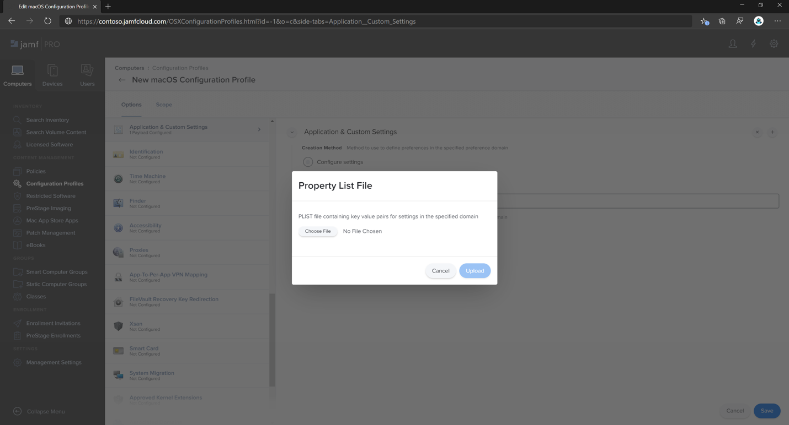
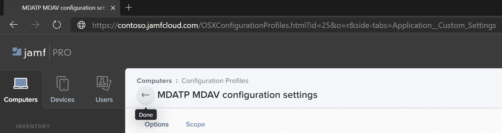
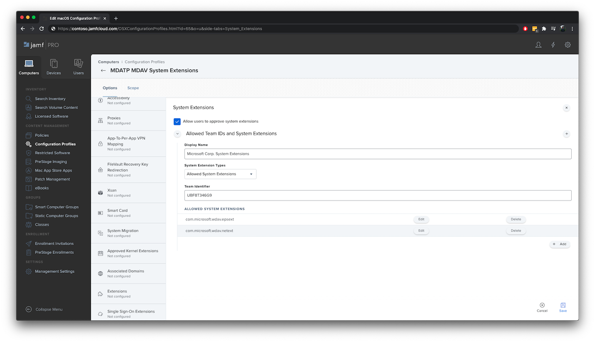

# <a name="set-up-the-microsoft-defender-for-endpoint-on-macos-policies-in-jamf-pro"></a><span data-ttu-id="1a1ef-104">Einrichten der Microsoft Defender for Endpoint für macOS-Richtlinien in Jamf Pro</span><span class="sxs-lookup"><span data-stu-id="1a1ef-104">Set up the Microsoft Defender for Endpoint on macOS policies in Jamf Pro</span></span>

[!INCLUDE [Microsoft 365 Defender rebranding](../../includes/microsoft-defender.md)]


<span data-ttu-id="1a1ef-105">**Gilt für:**</span><span class="sxs-lookup"><span data-stu-id="1a1ef-105">**Applies to:**</span></span>

- [<span data-ttu-id="1a1ef-106">Defender for Endpoint auf Dem Mac</span><span class="sxs-lookup"><span data-stu-id="1a1ef-106">Defender for Endpoint on Mac</span></span>](microsoft-defender-endpoint-mac.md)

<span data-ttu-id="1a1ef-107">Diese Seite führt Sie durch die Schritte, die Sie zum Einrichten von macOS-Richtlinien in Jamf Pro.</span><span class="sxs-lookup"><span data-stu-id="1a1ef-107">This page will guide you through the steps you need to take to set up macOS policies in Jamf Pro.</span></span>

<span data-ttu-id="1a1ef-108">Sie müssen die folgenden Schritte ausführen:</span><span class="sxs-lookup"><span data-stu-id="1a1ef-108">You'll need to take the following steps:</span></span>

1. [<span data-ttu-id="1a1ef-109">Holen Sie sich das Microsoft Defender for Endpoint-Onboardingpaket</span><span class="sxs-lookup"><span data-stu-id="1a1ef-109">Get the Microsoft Defender for Endpoint onboarding package</span></span>](#step-1-get-the-microsoft-defender-for-endpoint-onboarding-package)

2. [<span data-ttu-id="1a1ef-110">Erstellen eines Konfigurationsprofils in Jamf Pro mit dem Onboardingpaket</span><span class="sxs-lookup"><span data-stu-id="1a1ef-110">Create a configuration profile in Jamf Pro using the onboarding package</span></span>](#step-2-create-a-configuration-profile-in-jamf-pro-using-the-onboarding-package)

3. [<span data-ttu-id="1a1ef-111">Konfigurieren von Microsoft Defender für Endpunkteinstellungen</span><span class="sxs-lookup"><span data-stu-id="1a1ef-111">Configure Microsoft Defender for Endpoint settings</span></span>](#step-3-configure-microsoft-defender-for-endpoint-settings)

4. [<span data-ttu-id="1a1ef-112">Konfigurieren von Microsoft Defender for Endpoint-Benachrichtigungseinstellungen</span><span class="sxs-lookup"><span data-stu-id="1a1ef-112">Configure Microsoft Defender for Endpoint notification settings</span></span>](#step-4-configure-notifications-settings)

5. [<span data-ttu-id="1a1ef-113">Konfigurieren von Microsoft AutoUpdate (MAU)</span><span class="sxs-lookup"><span data-stu-id="1a1ef-113">Configure Microsoft AutoUpdate (MAU)</span></span>](#step-5-configure-microsoft-autoupdate-mau)

6. [<span data-ttu-id="1a1ef-114">Gewähren des vollständigen Datenträgerzugriffs auf Microsoft Defender for Endpoint</span><span class="sxs-lookup"><span data-stu-id="1a1ef-114">Grant full disk access to Microsoft Defender for Endpoint</span></span>](#step-6-grant-full-disk-access-to-microsoft-defender-for-endpoint)

7. [<span data-ttu-id="1a1ef-115">Genehmigen der Kernelerweiterung für Microsoft Defender for Endpoint</span><span class="sxs-lookup"><span data-stu-id="1a1ef-115">Approve Kernel extension for Microsoft Defender for Endpoint</span></span>](#step-7-approve-kernel-extension-for-microsoft-defender-for-endpoint)

8. [<span data-ttu-id="1a1ef-116">Genehmigen von Systemerweiterungen für Microsoft Defender for Endpoint</span><span class="sxs-lookup"><span data-stu-id="1a1ef-116">Approve System extensions for Microsoft Defender for Endpoint</span></span>](#step-8-approve-system-extensions-for-microsoft-defender-for-endpoint)

9. [<span data-ttu-id="1a1ef-117">Konfigurieren der Netzwerkerweiterung</span><span class="sxs-lookup"><span data-stu-id="1a1ef-117">Configure Network Extension</span></span>](#step-9-configure-network-extension)

10. [<span data-ttu-id="1a1ef-118">Planen von Scans mit Microsoft Defender for Endpoint unter macOS</span><span class="sxs-lookup"><span data-stu-id="1a1ef-118">Schedule scans with Microsoft Defender for Endpoint on macOS</span></span>](https://docs.microsoft.com/windows/security/threat-protection/microsoft-defender-atp/mac-schedule-scan-atp)

11. [<span data-ttu-id="1a1ef-119">Bereitstellen von Microsoft Defender for Endpoint unter macOS</span><span class="sxs-lookup"><span data-stu-id="1a1ef-119">Deploy Microsoft Defender for Endpoint on macOS</span></span>](#step-11-deploy-microsoft-defender-for-endpoint-on-macos)


## <a name="step-1-get-the-microsoft-defender-for-endpoint-onboarding-package"></a><span data-ttu-id="1a1ef-120">Schritt 1: Erstellen des Microsoft Defender for Endpoint-Onboardingpakets</span><span class="sxs-lookup"><span data-stu-id="1a1ef-120">Step 1: Get the Microsoft Defender for Endpoint onboarding package</span></span>

1. <span data-ttu-id="1a1ef-121">Navigieren [Microsoft Defender Security Center](https://securitycenter.microsoft.com )in diesem Ordner zu **Einstellungen > Onboarding**.</span><span class="sxs-lookup"><span data-stu-id="1a1ef-121">In [Microsoft Defender Security Center](https://securitycenter.microsoft.com ), navigate to **Settings > Onboarding**.</span></span> 

2. <span data-ttu-id="1a1ef-122">Wählen Sie macOS als Betriebssystem und Mobile Device Management /Microsoft Intune als Bereitstellungsmethode aus.</span><span class="sxs-lookup"><span data-stu-id="1a1ef-122">Select macOS as the operating system and Mobile Device Management / Microsoft Intune as the deployment method.</span></span>

    

3. <span data-ttu-id="1a1ef-124">Wählen **Sie Onboardingpaket** herunterladen (WindowsDefenderATPOnboardingPackage.zip).</span><span class="sxs-lookup"><span data-stu-id="1a1ef-124">Select **Download onboarding package** (WindowsDefenderATPOnboardingPackage.zip).</span></span>

4. <span data-ttu-id="1a1ef-125">Extrahieren `WindowsDefenderATPOnboardingPackage.zip` .</span><span class="sxs-lookup"><span data-stu-id="1a1ef-125">Extract `WindowsDefenderATPOnboardingPackage.zip`.</span></span>

5. <span data-ttu-id="1a1ef-126">Kopieren Sie die Datei an Ihren bevorzugten Speicherort.</span><span class="sxs-lookup"><span data-stu-id="1a1ef-126">Copy the file to your preferred location.</span></span> <span data-ttu-id="1a1ef-127">Zum Beispiel: `C:\Users\JaneDoe_or_JohnDoe.contoso\Downloads\WindowsDefenderATPOnboardingPackage_macOS_MDM_contoso\jamf\WindowsDefenderATPOnboarding.plist`.</span><span class="sxs-lookup"><span data-stu-id="1a1ef-127">For example,  `C:\Users\JaneDoe_or_JohnDoe.contoso\Downloads\WindowsDefenderATPOnboardingPackage_macOS_MDM_contoso\jamf\WindowsDefenderATPOnboarding.plist`.</span></span>


## <a name="step-2-create-a-configuration-profile-in-jamf-pro-using-the-onboarding-package"></a><span data-ttu-id="1a1ef-128">Schritt 2: Erstellen eines Konfigurationsprofils in Jamf Pro verwenden des Onboardingpakets</span><span class="sxs-lookup"><span data-stu-id="1a1ef-128">Step 2: Create a configuration profile in Jamf Pro using the onboarding package</span></span>

1. <span data-ttu-id="1a1ef-129">Suchen Sie die `WindowsDefenderATPOnboarding.plist` Datei aus dem vorherigen Abschnitt.</span><span class="sxs-lookup"><span data-stu-id="1a1ef-129">Locate the file `WindowsDefenderATPOnboarding.plist` from the previous section.</span></span>

   

 
2. <span data-ttu-id="1a1ef-131">Wählen Sie im Pro-Dashboard neu **aus.**</span><span class="sxs-lookup"><span data-stu-id="1a1ef-131">In the Jamf Pro dashboard, select **New**.</span></span>

    

3. <span data-ttu-id="1a1ef-133">Geben Sie die folgenden Details ein:</span><span class="sxs-lookup"><span data-stu-id="1a1ef-133">Enter the following details:</span></span>

   <span data-ttu-id="1a1ef-134">**Allgemein**</span><span class="sxs-lookup"><span data-stu-id="1a1ef-134">**General**</span></span>
   - <span data-ttu-id="1a1ef-135">Name: MDATP Onboarding für macOS</span><span class="sxs-lookup"><span data-stu-id="1a1ef-135">Name: MDATP onboarding for macOS</span></span>
   - <span data-ttu-id="1a1ef-136">Beschreibung: MDATP EDR Onboarding für macOS</span><span class="sxs-lookup"><span data-stu-id="1a1ef-136">Description: MDATP EDR onboarding for macOS</span></span>
   - <span data-ttu-id="1a1ef-137">Kategorie: Keine</span><span class="sxs-lookup"><span data-stu-id="1a1ef-137">Category: None</span></span>
   - <span data-ttu-id="1a1ef-138">Verteilungsmethode: Automatisch installieren</span><span class="sxs-lookup"><span data-stu-id="1a1ef-138">Distribution Method: Install Automatically</span></span>
   - <span data-ttu-id="1a1ef-139">Ebene: Computerebene</span><span class="sxs-lookup"><span data-stu-id="1a1ef-139">Level: Computer Level</span></span>

4. <span data-ttu-id="1a1ef-140">Wählen **Sie & Benutzerdefinierte Einstellungen** **Konfigurieren aus.**</span><span class="sxs-lookup"><span data-stu-id="1a1ef-140">In **Application & Custom Settings** select **Configure**.</span></span>

    

5. <span data-ttu-id="1a1ef-142">Wählen **Hochladen Datei (PLIST-Datei)** aus, und geben Sie dann unter **Einstellung Domäne ein:** `com.microsoft.wdav.atp` .</span><span class="sxs-lookup"><span data-stu-id="1a1ef-142">Select **Upload File (PLIST file)** then in **Preference Domain** enter: `com.microsoft.wdav.atp`.</span></span> 

    

    

7. <span data-ttu-id="1a1ef-145">Wählen **Sie Öffnen** aus, und wählen Sie die Onboardingdatei aus.</span><span class="sxs-lookup"><span data-stu-id="1a1ef-145">Select **Open** and select the onboarding file.</span></span>

    

8. <span data-ttu-id="1a1ef-147">Wählen **Sie Hochladen** aus.</span><span class="sxs-lookup"><span data-stu-id="1a1ef-147">Select **Upload**.</span></span> 

    


9. <span data-ttu-id="1a1ef-149">Wählen Sie die **Registerkarte Bereich** aus.</span><span class="sxs-lookup"><span data-stu-id="1a1ef-149">Select the **Scope** tab.</span></span>

    

10. <span data-ttu-id="1a1ef-151">Wählen Sie die Zielcomputer aus.</span><span class="sxs-lookup"><span data-stu-id="1a1ef-151">Select the target computers.</span></span>

    

     

11. <span data-ttu-id="1a1ef-154">Klicken Sie auf **Speichern**.</span><span class="sxs-lookup"><span data-stu-id="1a1ef-154">Select **Save**.</span></span>

    

    

12. <span data-ttu-id="1a1ef-157">Wählen Sie **Fertig** aus.</span><span class="sxs-lookup"><span data-stu-id="1a1ef-157">Select **Done**.</span></span>

    

    

## <a name="step-3-configure-microsoft-defender-for-endpoint-settings"></a><span data-ttu-id="1a1ef-160">Schritt 3: Konfigurieren von Microsoft Defender für Endpunkteinstellungen</span><span class="sxs-lookup"><span data-stu-id="1a1ef-160">Step 3: Configure Microsoft Defender for Endpoint settings</span></span>

1.  <span data-ttu-id="1a1ef-161">Verwenden Sie die folgenden Microsoft Defender for Endpoint-Konfigurationseinstellungen:</span><span class="sxs-lookup"><span data-stu-id="1a1ef-161">Use the following Microsoft Defender for Endpoint configuration settings:</span></span>

    - <span data-ttu-id="1a1ef-162">enableRealTimeProtection</span><span class="sxs-lookup"><span data-stu-id="1a1ef-162">enableRealTimeProtection</span></span>
    - <span data-ttu-id="1a1ef-163">passiveMode</span><span class="sxs-lookup"><span data-stu-id="1a1ef-163">passiveMode</span></span>
    
    >[!NOTE]
    ><span data-ttu-id="1a1ef-164">Nicht standardmäßig aktiviert, wenn Sie planen, einen Av eines Drittanbieters für macOS ausführen zu können, legen Sie ihn auf `true` fest.</span><span class="sxs-lookup"><span data-stu-id="1a1ef-164">Not turned on by default, if you are planning to run a third-party AV for macOS, set it to `true`.</span></span>

    - <span data-ttu-id="1a1ef-165">Ausschlüsse</span><span class="sxs-lookup"><span data-stu-id="1a1ef-165">exclusions</span></span>
    - <span data-ttu-id="1a1ef-166">excludedPath</span><span class="sxs-lookup"><span data-stu-id="1a1ef-166">excludedPath</span></span>
    - <span data-ttu-id="1a1ef-167">excludedFileExtension</span><span class="sxs-lookup"><span data-stu-id="1a1ef-167">excludedFileExtension</span></span>
    - <span data-ttu-id="1a1ef-168">excludedFileName</span><span class="sxs-lookup"><span data-stu-id="1a1ef-168">excludedFileName</span></span>
    - <span data-ttu-id="1a1ef-169">exclusionsMergePolicy</span><span class="sxs-lookup"><span data-stu-id="1a1ef-169">exclusionsMergePolicy</span></span>
    - <span data-ttu-id="1a1ef-170">allowedThreats</span><span class="sxs-lookup"><span data-stu-id="1a1ef-170">allowedThreats</span></span>
    
    >[!NOTE]
    ><span data-ttu-id="1a1ef-171">EICAR befindet sich im Beispiel, wenn Sie einen Proof-of-Concept durchprobieren, entfernen Sie es insbesondere, wenn Sie EICAR testen.</span><span class="sxs-lookup"><span data-stu-id="1a1ef-171">EICAR is on the sample, if you are going through a proof-of-concept, remove it especially if you are testing EICAR.</span></span>
        
    - <span data-ttu-id="1a1ef-172">disallowedThreatActions</span><span class="sxs-lookup"><span data-stu-id="1a1ef-172">disallowedThreatActions</span></span>
    - <span data-ttu-id="1a1ef-173">potentially_unwanted_application</span><span class="sxs-lookup"><span data-stu-id="1a1ef-173">potentially_unwanted_application</span></span>
    - <span data-ttu-id="1a1ef-174">archive_bomb</span><span class="sxs-lookup"><span data-stu-id="1a1ef-174">archive_bomb</span></span>
    - <span data-ttu-id="1a1ef-175">cloudService</span><span class="sxs-lookup"><span data-stu-id="1a1ef-175">cloudService</span></span>
    - <span data-ttu-id="1a1ef-176">automaticSampleSubmission</span><span class="sxs-lookup"><span data-stu-id="1a1ef-176">automaticSampleSubmission</span></span>
    - <span data-ttu-id="1a1ef-177">tags</span><span class="sxs-lookup"><span data-stu-id="1a1ef-177">tags</span></span>
    - <span data-ttu-id="1a1ef-178">hideStatusMenuIcon</span><span class="sxs-lookup"><span data-stu-id="1a1ef-178">hideStatusMenuIcon</span></span>
    
     <span data-ttu-id="1a1ef-179">Weitere Informationen finden Sie unter [Property list for Jamf configuration profile](mac-preferences.md#property-list-for-jamf-configuration-profile).</span><span class="sxs-lookup"><span data-stu-id="1a1ef-179">For information, see [Property list for Jamf configuration profile](mac-preferences.md#property-list-for-jamf-configuration-profile).</span></span>

     ```XML
     <?xml version="1.0" encoding="UTF-8"?>
     <!DOCTYPE plist PUBLIC "-//Apple//DTD PLIST 1.0//EN" "http://www.apple.com/DTDs/PropertyList-1.0.dtd">
     <plist version="1.0">
     <dict>
         <key>antivirusEngine</key>
         <dict>
             <key>enableRealTimeProtection</key>
             <true/>
             <key>passiveMode</key>
             <false/>
             <key>exclusions</key>
             <array>
                 <dict>
                     <key>$type</key>
                     <string>excludedPath</string>
                     <key>isDirectory</key>
                     <false/>
                     <key>path</key>
                     <string>/var/log/system.log</string>
                 </dict>
                 <dict>
                     <key>$type</key>
                     <string>excludedPath</string>
                     <key>isDirectory</key>
                     <true/>
                     <key>path</key>
                     <string>/home</string>
                 </dict>
                 <dict>
                     <key>$type</key>
                     <string>excludedFileExtension</string>
                     <key>extension</key>
                     <string>pdf</string>
                 </dict>
                 <dict>
                     <key>$type</key>
                     <string>excludedFileName</string>
                     <key>name</key>
                     <string>cat</string>
                 </dict>
             </array>
             <key>exclusionsMergePolicy</key>
             <string>merge</string>
             <key>allowedThreats</key>
             <array>
                 <string>EICAR-Test-File (not a virus)</string>
             </array>
             <key>disallowedThreatActions</key>
             <array>
                 <string>allow</string>
                 <string>restore</string>
             </array>
             <key>threatTypeSettings</key>
             <array>
                 <dict>
                     <key>key</key>
                     <string>potentially_unwanted_application</string>
                     <key>value</key>
                     <string>block</string>
                 </dict>
                 <dict>
                     <key>key</key>
                     <string>archive_bomb</string>
                     <key>value</key>
                     <string>audit</string>
                 </dict>
             </array>
             <key>threatTypeSettingsMergePolicy</key>
             <string>merge</string>
         </dict>
         <key>cloudService</key>
         <dict>
             <key>enabled</key>
             <true/>
             <key>diagnosticLevel</key>
             <string>optional</string>
             <key>automaticSampleSubmission</key>
             <true/>
         </dict>
         <key>edr</key>
         <dict>
             <key>tags</key>
             <array>
                 <dict>
                     <key>key</key>
                     <string>GROUP</string>
                     <key>value</key>
                     <string>ExampleTag</string>
                 </dict>
             </array>
         </dict>
         <key>userInterface</key>
         <dict>
             <key>hideStatusMenuIcon</key>
             <false/>
         </dict>
     </dict>
     </plist>
     ```

2. <span data-ttu-id="1a1ef-180">Speichern Sie die Datei unter `MDATP_MDAV_configuration_settings.plist` .</span><span class="sxs-lookup"><span data-stu-id="1a1ef-180">Save the file as `MDATP_MDAV_configuration_settings.plist`.</span></span>


3.  <span data-ttu-id="1a1ef-181">Wählen Sie im Jamf-Pro-Dashboard die Option **Allgemein aus.**</span><span class="sxs-lookup"><span data-stu-id="1a1ef-181">In the Jamf Pro dashboard, select **General**.</span></span>

    

4. <span data-ttu-id="1a1ef-183">Geben Sie die folgenden Details ein:</span><span class="sxs-lookup"><span data-stu-id="1a1ef-183">Enter the following details:</span></span>

    <span data-ttu-id="1a1ef-184">**Allgemein**</span><span class="sxs-lookup"><span data-stu-id="1a1ef-184">**General**</span></span>
    
    - <span data-ttu-id="1a1ef-185">Name: MDATP MDAV-Konfigurationseinstellungen</span><span class="sxs-lookup"><span data-stu-id="1a1ef-185">Name: MDATP MDAV configuration settings</span></span>
    - <span data-ttu-id="1a1ef-186">Beschreibung:\<blank\></span><span class="sxs-lookup"><span data-stu-id="1a1ef-186">Description:\<blank\></span></span>
    - <span data-ttu-id="1a1ef-187">Kategorie: Keine (Standard)</span><span class="sxs-lookup"><span data-stu-id="1a1ef-187">Category: None (default)</span></span>
    - <span data-ttu-id="1a1ef-188">Verteilungsmethode: Automatisch installieren(Standard)</span><span class="sxs-lookup"><span data-stu-id="1a1ef-188">Distribution Method: Install Automatically(default)</span></span>
    - <span data-ttu-id="1a1ef-189">Ebene: Computerebene(Standard)</span><span class="sxs-lookup"><span data-stu-id="1a1ef-189">Level: Computer Level(default)</span></span>

    

5. <span data-ttu-id="1a1ef-191">Wählen **Sie & Benutzerdefinierte Einstellungen** **Konfigurieren aus.**</span><span class="sxs-lookup"><span data-stu-id="1a1ef-191">In **Application & Custom Settings** select **Configure**.</span></span>

    

6. <span data-ttu-id="1a1ef-193">Wählen **Hochladen Datei (PLIST-Datei) aus.**</span><span class="sxs-lookup"><span data-stu-id="1a1ef-193">Select **Upload File (PLIST file)**.</span></span>

    

7. <span data-ttu-id="1a1ef-195">Geben **Sie unter Einstellungsdomäne** `com.microsoft.wdav` die Option ein, und wählen Sie dann Hochladen **PLIST-Datei aus.**</span><span class="sxs-lookup"><span data-stu-id="1a1ef-195">In **Preferences Domain**, enter `com.microsoft.wdav`, then select  **Upload PLIST File**.</span></span>

    

8. <span data-ttu-id="1a1ef-197">Wählen **Sie Datei auswählen aus.**</span><span class="sxs-lookup"><span data-stu-id="1a1ef-197">Select **Choose File**.</span></span>

    

9. <span data-ttu-id="1a1ef-199">Wählen Sie **MDATP_MDAV_configuration_settings.plist** aus, und wählen Sie dann **Öffnen aus.**</span><span class="sxs-lookup"><span data-stu-id="1a1ef-199">Select the **MDATP_MDAV_configuration_settings.plist**, then select **Open**.</span></span>

    

10. <span data-ttu-id="1a1ef-201">Wählen **Sie Hochladen** aus.</span><span class="sxs-lookup"><span data-stu-id="1a1ef-201">Select **Upload**.</span></span>

    

    

    >[!NOTE]
    ><span data-ttu-id="1a1ef-204">Wenn Sie die Intune-Datei hochladen, erhalten Sie den folgenden Fehler:</span><span class="sxs-lookup"><span data-stu-id="1a1ef-204">If you happen to upload the Intune file, you'll get the following error:</span></span><br>
    ><span data-ttu-id="1a1ef-205"></span><span class="sxs-lookup"><span data-stu-id="1a1ef-205"></span></span>


11. <span data-ttu-id="1a1ef-206">Klicken Sie auf **Speichern**.</span><span class="sxs-lookup"><span data-stu-id="1a1ef-206">Select **Save**.</span></span> 

    

12. <span data-ttu-id="1a1ef-208">Die Datei wird hochgeladen.</span><span class="sxs-lookup"><span data-stu-id="1a1ef-208">The file is uploaded.</span></span>

    

    

13. <span data-ttu-id="1a1ef-211">Wählen Sie die **Registerkarte Bereich** aus.</span><span class="sxs-lookup"><span data-stu-id="1a1ef-211">Select the **Scope** tab.</span></span>

    

14. <span data-ttu-id="1a1ef-213">Wählen **Sie Contosos Computergruppe aus.**</span><span class="sxs-lookup"><span data-stu-id="1a1ef-213">Select **Contoso's Machine Group**.</span></span> 

15. <span data-ttu-id="1a1ef-214">Wählen **Sie Hinzufügen** aus, und wählen Sie dann Speichern **aus.**</span><span class="sxs-lookup"><span data-stu-id="1a1ef-214">Select **Add**, then select **Save**.</span></span>

    

    

16. <span data-ttu-id="1a1ef-217">Wählen Sie **Fertig** aus.</span><span class="sxs-lookup"><span data-stu-id="1a1ef-217">Select **Done**.</span></span> <span data-ttu-id="1a1ef-218">Das neue Konfigurationsprofil **wird angezeigt.**</span><span class="sxs-lookup"><span data-stu-id="1a1ef-218">You'll see the new **Configuration profile**.</span></span>

    


## <a name="step-4-configure-notifications-settings"></a><span data-ttu-id="1a1ef-220">Schritt 4: Konfigurieren von Benachrichtigungseinstellungen</span><span class="sxs-lookup"><span data-stu-id="1a1ef-220">Step 4: Configure notifications settings</span></span>

<span data-ttu-id="1a1ef-221">Diese Schritte gelten für macOS 10.15 (Catalina) oder neuer.</span><span class="sxs-lookup"><span data-stu-id="1a1ef-221">These steps are applicable of macOS 10.15 (Catalina) or newer.</span></span>

1. <span data-ttu-id="1a1ef-222">Wählen Sie im Pro-Dashboard **Computer** und dann **Konfigurationsprofile aus.**</span><span class="sxs-lookup"><span data-stu-id="1a1ef-222">In the Jamf Pro dashboard, select **Computers**, then **Configuration Profiles**.</span></span>

2. <span data-ttu-id="1a1ef-223">Klicken **Sie auf Neu,** und geben Sie die folgenden Details für Optionen **ein:**</span><span class="sxs-lookup"><span data-stu-id="1a1ef-223">Click **New**, and enter the following details for **Options**:</span></span>
    
    - <span data-ttu-id="1a1ef-224">Registerkarte **Allgemein**:</span><span class="sxs-lookup"><span data-stu-id="1a1ef-224">Tab **General**:</span></span> 
        - <span data-ttu-id="1a1ef-225">**Name**: MDATP MDAV-Benachrichtigungseinstellungen</span><span class="sxs-lookup"><span data-stu-id="1a1ef-225">**Name**: MDATP MDAV Notification settings</span></span>
        - <span data-ttu-id="1a1ef-226">**Beschreibung**: macOS 10.15 (Catalina) oder neuer</span><span class="sxs-lookup"><span data-stu-id="1a1ef-226">**Description**: macOS 10.15 (Catalina) or newer</span></span>
        - <span data-ttu-id="1a1ef-227">**Kategorie**: Keine *(Standard)*</span><span class="sxs-lookup"><span data-stu-id="1a1ef-227">**Category**: None *(default)*</span></span>
        - <span data-ttu-id="1a1ef-228">**Verteilungsmethode**: Automatisch installieren *(Standardeinstellung)*</span><span class="sxs-lookup"><span data-stu-id="1a1ef-228">**Distribution Method**: Install Automatically *(default)*</span></span>
        - <span data-ttu-id="1a1ef-229">**Ebene**: Computerebene *(Standard)*</span><span class="sxs-lookup"><span data-stu-id="1a1ef-229">**Level**: Computer Level *(default)*</span></span>

        

    - <span data-ttu-id="1a1ef-231">Registerkarte Benachrichtigungen, klicken **Sie auf Hinzufügen**, und geben Sie die folgenden Werte ein:</span><span class="sxs-lookup"><span data-stu-id="1a1ef-231">Tab **Notifications**, click **Add**, and enter the following values:</span></span>
        - <span data-ttu-id="1a1ef-232">**Bundle-ID**: `com.microsoft.wdav.tray`</span><span class="sxs-lookup"><span data-stu-id="1a1ef-232">**Bundle ID**: `com.microsoft.wdav.tray`</span></span>
        - <span data-ttu-id="1a1ef-233">**Kritische Warnungen**: Klicken Sie auf **Deaktivieren.**</span><span class="sxs-lookup"><span data-stu-id="1a1ef-233">**Critical Alerts**: Click **Disable**</span></span>
        - <span data-ttu-id="1a1ef-234">**Benachrichtigungen**: Klicken Sie auf **Aktivieren**</span><span class="sxs-lookup"><span data-stu-id="1a1ef-234">**Notifications**: Click **Enable**</span></span>
        - <span data-ttu-id="1a1ef-235">**Bannerbenachrichtigungstyp**: Wählen **Sie Include** und **Temporary** *(Standard) aus.*</span><span class="sxs-lookup"><span data-stu-id="1a1ef-235">**Banner alert type**: Select **Include** and **Temporary** *(default)*</span></span>
        - <span data-ttu-id="1a1ef-236">**Benachrichtigungen auf dem Sperrbildschirm**: Klicken Sie auf **Ausblenden**</span><span class="sxs-lookup"><span data-stu-id="1a1ef-236">**Notifications on lock screen**: Click **Hide**</span></span>
        - <span data-ttu-id="1a1ef-237">**Benachrichtigungen im Benachrichtigungscenter**: Klicken Sie auf **Anzeigen**</span><span class="sxs-lookup"><span data-stu-id="1a1ef-237">**Notifications in Notification Center**: Click **Display**</span></span>
        - <span data-ttu-id="1a1ef-238">**Symbol der Badge-App**: Klicken Sie auf **Anzeigen**</span><span class="sxs-lookup"><span data-stu-id="1a1ef-238">**Badge app icon**: Click **Display**</span></span>

        

    - <span data-ttu-id="1a1ef-240">Registerkarte **Benachrichtigungen,** klicken **Sie** noch einmal auf Hinzufügen, scrollen Sie nach unten zu Neue **Benachrichtigungen Einstellungen**</span><span class="sxs-lookup"><span data-stu-id="1a1ef-240">Tab **Notifications**, click **Add** one more time, scroll down to **New Notifications Settings**</span></span>
        - <span data-ttu-id="1a1ef-241">**Bundle-ID**: `com.microsoft.autoupdate2`</span><span class="sxs-lookup"><span data-stu-id="1a1ef-241">**Bundle ID**: `com.microsoft.autoupdate2`</span></span>
        - <span data-ttu-id="1a1ef-242">Konfigurieren der restlichen Einstellungen auf die gleichen Werte wie oben</span><span class="sxs-lookup"><span data-stu-id="1a1ef-242">Configure the rest of the settings to the same values as above</span></span>

        

        <span data-ttu-id="1a1ef-244">Beachten Sie, dass Sie jetzt über zwei "Tabellen" mit Benachrichtigungskonfigurationen verfügen, eine für **Bundle-ID: com.microsoft.wdav.tray** und eine weitere für **Bundle-ID: com.microsoft.autoupdate2**.</span><span class="sxs-lookup"><span data-stu-id="1a1ef-244">Note that now you have two 'tables' with notification configurations, one for **Bundle ID: com.microsoft.wdav.tray**, and another for **Bundle ID: com.microsoft.autoupdate2**.</span></span> <span data-ttu-id="1a1ef-245">Während Sie Benachrichtigungseinstellungen nach Ihren Anforderungen konfigurieren können, müssen Bündel-IDs genau die gleichen wie zuvor beschrieben sein, und **die Option** Include muss für Benachrichtigungen **ein** **sein.**</span><span class="sxs-lookup"><span data-stu-id="1a1ef-245">While you can configure alert settings per your requirements, Bundle IDs must be exactly the same as described before, and **Include** switch must be **On** for **Notifications**.</span></span>

3. <span data-ttu-id="1a1ef-246">Wählen Sie die **Registerkarte** Bereich aus, und wählen Sie **dann Hinzufügen aus.**</span><span class="sxs-lookup"><span data-stu-id="1a1ef-246">Select the **Scope** tab, then select **Add**.</span></span>

    

4. <span data-ttu-id="1a1ef-248">Wählen **Sie Contosos Computergruppe aus.**</span><span class="sxs-lookup"><span data-stu-id="1a1ef-248">Select **Contoso's Machine Group**.</span></span> 

5. <span data-ttu-id="1a1ef-249">Wählen **Sie Hinzufügen** aus, und wählen Sie dann Speichern **aus.**</span><span class="sxs-lookup"><span data-stu-id="1a1ef-249">Select **Add**, then select **Save**.</span></span>
    
    
    
    

6. <span data-ttu-id="1a1ef-252">Wählen Sie **Fertig** aus.</span><span class="sxs-lookup"><span data-stu-id="1a1ef-252">Select **Done**.</span></span> <span data-ttu-id="1a1ef-253">Das neue Konfigurationsprofil **wird angezeigt.**</span><span class="sxs-lookup"><span data-stu-id="1a1ef-253">You'll see the new **Configuration profile**.</span></span>
    <span data-ttu-id="1a1ef-254"></span><span class="sxs-lookup"><span data-stu-id="1a1ef-254"></span></span>

## <a name="step-5-configure-microsoft-autoupdate-mau"></a><span data-ttu-id="1a1ef-255">Schritt 5: Konfigurieren von Microsoft AutoUpdate (MAU)</span><span class="sxs-lookup"><span data-stu-id="1a1ef-255">Step 5: Configure Microsoft AutoUpdate (MAU)</span></span>

1. <span data-ttu-id="1a1ef-256">Verwenden Sie die folgenden Microsoft Defender for Endpoint-Konfigurationseinstellungen:</span><span class="sxs-lookup"><span data-stu-id="1a1ef-256">Use the following Microsoft Defender for Endpoint configuration settings:</span></span>

      ```XML
   <?xml version="1.0" encoding="UTF-8"?>
   <!DOCTYPE plist PUBLIC "-//Apple//DTD PLIST 1.0//EN" "http://www.apple.com/DTDs/PropertyList-1.0.dtd">
   <plist version="1.0">
   <dict>
    <key>ChannelName</key>
    <string>Current</string>
    <key>HowToCheck</key>
    <string>AutomaticDownload</string>
    <key>EnableCheckForUpdatesButton</key>
    <true/>
    <key>DisableInsiderCheckbox</key>
    <false/>
    <key>SendAllTelemetryEnabled</key>
    <true/>
   </dict>
   </plist>
   ```

2. <span data-ttu-id="1a1ef-257">Speichern Sie sie unter `MDATP_MDAV_MAU_settings.plist` .</span><span class="sxs-lookup"><span data-stu-id="1a1ef-257">Save it as `MDATP_MDAV_MAU_settings.plist`.</span></span>

3. <span data-ttu-id="1a1ef-258">Wählen Sie im Jamf-Pro-Dashboard die Option **Allgemein aus.**</span><span class="sxs-lookup"><span data-stu-id="1a1ef-258">In the Jamf Pro dashboard, select **General**.</span></span> 

    

4. <span data-ttu-id="1a1ef-260">Geben Sie die folgenden Details ein:</span><span class="sxs-lookup"><span data-stu-id="1a1ef-260">Enter the following details:</span></span>

    <span data-ttu-id="1a1ef-261">**Allgemein**</span><span class="sxs-lookup"><span data-stu-id="1a1ef-261">**General**</span></span> 
    
    - <span data-ttu-id="1a1ef-262">Name: MDATP MDAV MAU-Einstellungen</span><span class="sxs-lookup"><span data-stu-id="1a1ef-262">Name: MDATP MDAV MAU settings</span></span>
    - <span data-ttu-id="1a1ef-263">Beschreibung: Microsoft AutoUpdate-Einstellungen für MDATP für macOS</span><span class="sxs-lookup"><span data-stu-id="1a1ef-263">Description: Microsoft AutoUpdate settings for MDATP for macOS</span></span>
    - <span data-ttu-id="1a1ef-264">Kategorie: Keine (Standard)</span><span class="sxs-lookup"><span data-stu-id="1a1ef-264">Category: None (default)</span></span>
    - <span data-ttu-id="1a1ef-265">Verteilungsmethode: Automatisch installieren(Standard)</span><span class="sxs-lookup"><span data-stu-id="1a1ef-265">Distribution Method: Install Automatically(default)</span></span>
    - <span data-ttu-id="1a1ef-266">Ebene: Computerebene(Standard)</span><span class="sxs-lookup"><span data-stu-id="1a1ef-266">Level: Computer Level(default)</span></span>

5. <span data-ttu-id="1a1ef-267">Wählen **Sie & Benutzerdefinierte Einstellungen** **Konfigurieren aus.**</span><span class="sxs-lookup"><span data-stu-id="1a1ef-267">In **Application & Custom Settings** select **Configure**.</span></span>

    

6. <span data-ttu-id="1a1ef-269">Wählen **Hochladen Datei (PLIST-Datei) aus.**</span><span class="sxs-lookup"><span data-stu-id="1a1ef-269">Select **Upload File (PLIST file)**.</span></span>

      

7. <span data-ttu-id="1a1ef-271">Geben **Sie unter Einstellung Domäne:** ein, und wählen Hochladen `com.microsoft.autoupdate2` **PLIST-Datei aus.**</span><span class="sxs-lookup"><span data-stu-id="1a1ef-271">In **Preference Domain** enter: `com.microsoft.autoupdate2`, then select **Upload PLIST File**.</span></span>

    

8. <span data-ttu-id="1a1ef-273">Wählen **Sie Datei auswählen aus.**</span><span class="sxs-lookup"><span data-stu-id="1a1ef-273">Select **Choose File**.</span></span>

    

9. <span data-ttu-id="1a1ef-275">Wählen **MDATP_MDAV_MAU_settings.plist aus.**</span><span class="sxs-lookup"><span data-stu-id="1a1ef-275">Select **MDATP_MDAV_MAU_settings.plist**.</span></span>

    

10. <span data-ttu-id="1a1ef-277">Wählen **Sie Hochladen** aus.</span><span class="sxs-lookup"><span data-stu-id="1a1ef-277">Select **Upload**.</span></span>
    <span data-ttu-id="1a1ef-278"></span><span class="sxs-lookup"><span data-stu-id="1a1ef-278"></span></span>

    

11. <span data-ttu-id="1a1ef-280">Klicken Sie auf **Speichern**.</span><span class="sxs-lookup"><span data-stu-id="1a1ef-280">Select **Save**.</span></span>

    

12. <span data-ttu-id="1a1ef-282">Wählen Sie die **Registerkarte Bereich** aus.</span><span class="sxs-lookup"><span data-stu-id="1a1ef-282">Select the **Scope** tab.</span></span>
   
     

13. <span data-ttu-id="1a1ef-284">Wählen Sie **Hinzufügen**.</span><span class="sxs-lookup"><span data-stu-id="1a1ef-284">Select **Add**.</span></span>
    
    

    

    

14. <span data-ttu-id="1a1ef-288">Wählen Sie **Fertig** aus.</span><span class="sxs-lookup"><span data-stu-id="1a1ef-288">Select **Done**.</span></span>
    
    

## <a name="step-6-grant-full-disk-access-to-microsoft-defender-for-endpoint"></a><span data-ttu-id="1a1ef-290">Schritt 6: Gewähren des vollständigen Festplattenzugriffs auf Microsoft Defender for Endpoint</span><span class="sxs-lookup"><span data-stu-id="1a1ef-290">Step 6: Grant full disk access to Microsoft Defender for Endpoint</span></span>

1. <span data-ttu-id="1a1ef-291">Wählen Sie im Pro-Dashboard **Konfigurationsprofile aus.**</span><span class="sxs-lookup"><span data-stu-id="1a1ef-291">In the Jamf Pro dashboard, select **Configuration Profiles**.</span></span>

    

2. <span data-ttu-id="1a1ef-293">Wählen Sie **+ Neu aus.**</span><span class="sxs-lookup"><span data-stu-id="1a1ef-293">Select **+ New**.</span></span> 

3. <span data-ttu-id="1a1ef-294">Geben Sie die folgenden Details ein:</span><span class="sxs-lookup"><span data-stu-id="1a1ef-294">Enter the following details:</span></span>

    <span data-ttu-id="1a1ef-295">**Allgemein**</span><span class="sxs-lookup"><span data-stu-id="1a1ef-295">**General**</span></span> 
    - <span data-ttu-id="1a1ef-296">Name: MDATP MDAV – Gewähren des vollständigen Datenträgerzugriffs auf EDR und AV</span><span class="sxs-lookup"><span data-stu-id="1a1ef-296">Name: MDATP MDAV - grant Full Disk Access to EDR and AV</span></span>
    - <span data-ttu-id="1a1ef-297">Beschreibung: Unter macOS Catalina oder neuer wird das neue Richtliniensteuerelement für Datenschutzeinstellungen</span><span class="sxs-lookup"><span data-stu-id="1a1ef-297">Description: On macOS Catalina or newer, the new Privacy Preferences Policy Control</span></span>
    - <span data-ttu-id="1a1ef-298">Kategorie: Keine</span><span class="sxs-lookup"><span data-stu-id="1a1ef-298">Category: None</span></span>
    - <span data-ttu-id="1a1ef-299">Verteilungsmethode: Automatisch installieren</span><span class="sxs-lookup"><span data-stu-id="1a1ef-299">Distribution method: Install Automatically</span></span>
    - <span data-ttu-id="1a1ef-300">Ebene: Computerebene</span><span class="sxs-lookup"><span data-stu-id="1a1ef-300">Level: Computer level</span></span>


    

4. <span data-ttu-id="1a1ef-302">Wählen **Sie unter Richtliniensteuerelement Datenschutzeinstellungen konfigurieren** die Option Konfigurieren **aus.**</span><span class="sxs-lookup"><span data-stu-id="1a1ef-302">In **Configure Privacy Preferences Policy Control** select **Configure**.</span></span>

    

5. <span data-ttu-id="1a1ef-304">Geben **Sie unter Datenschutzeinstellungsrichtliniensteuerung** die folgenden Details ein:</span><span class="sxs-lookup"><span data-stu-id="1a1ef-304">In **Privacy Preferences Policy Control**, enter the following details:</span></span>

    - <span data-ttu-id="1a1ef-305">Bezeichner: `com.microsoft.wdav`</span><span class="sxs-lookup"><span data-stu-id="1a1ef-305">Identifier: `com.microsoft.wdav`</span></span>
    - <span data-ttu-id="1a1ef-306">Bezeichnertyp: Bundle-ID</span><span class="sxs-lookup"><span data-stu-id="1a1ef-306">Identifier Type: Bundle ID</span></span>
    - <span data-ttu-id="1a1ef-307">Codeanforderung: `identifier "com.microsoft.wdav" and anchor apple generic and certificate 1[field.1.2.840.113635.100.6.2.6] /* exists */ and certificate leaf[field.1.2.840.113635.100.6.1.13] /* exists */ and certificate leaf[subject.OU] = UBF8T346G9`</span><span class="sxs-lookup"><span data-stu-id="1a1ef-307">Code Requirement: `identifier "com.microsoft.wdav" and anchor apple generic and certificate 1[field.1.2.840.113635.100.6.2.6] /* exists */ and certificate leaf[field.1.2.840.113635.100.6.1.13] /* exists */ and certificate leaf[subject.OU] = UBF8T346G9`</span></span>


    

6. <span data-ttu-id="1a1ef-309">Wählen Sie **+ Hinzufügen** aus.</span><span class="sxs-lookup"><span data-stu-id="1a1ef-309">Select **+ Add**.</span></span>

    

    - <span data-ttu-id="1a1ef-311">Unter App oder Dienst: Auf **SystemPolicyAllFiles festlegen**</span><span class="sxs-lookup"><span data-stu-id="1a1ef-311">Under App or service: Set to **SystemPolicyAllFiles**</span></span>

    - <span data-ttu-id="1a1ef-312">Unter "Zugriff": Auf Zulassen **festlegen**</span><span class="sxs-lookup"><span data-stu-id="1a1ef-312">Under "access": Set to **Allow**</span></span>

7. <span data-ttu-id="1a1ef-313">Wählen **Sie Speichern** aus (nicht unten rechts).</span><span class="sxs-lookup"><span data-stu-id="1a1ef-313">Select **Save** (not the one at the bottom right).</span></span>

    

8. <span data-ttu-id="1a1ef-315">Klicken Sie auf `+` das Zeichen neben App **Access,** um einen neuen Eintrag hinzuzufügen.</span><span class="sxs-lookup"><span data-stu-id="1a1ef-315">Click the `+` sign next to **App Access** to add a new entry.</span></span>

    

9. <span data-ttu-id="1a1ef-317">Geben Sie die folgenden Details ein:</span><span class="sxs-lookup"><span data-stu-id="1a1ef-317">Enter the following details:</span></span>

    - <span data-ttu-id="1a1ef-318">Bezeichner: `com.microsoft.wdav.epsext`</span><span class="sxs-lookup"><span data-stu-id="1a1ef-318">Identifier: `com.microsoft.wdav.epsext`</span></span>
    - <span data-ttu-id="1a1ef-319">Bezeichnertyp: Bundle-ID</span><span class="sxs-lookup"><span data-stu-id="1a1ef-319">Identifier Type: Bundle ID</span></span>
    - <span data-ttu-id="1a1ef-320">Codeanforderung: `identifier "com.microsoft.wdav.epsext" and anchor apple generic and certificate 1[field.1.2.840.113635.100.6.2.6] /* exists */ and certificate leaf[field.1.2.840.113635.100.6.1.13] /* exists */ and certificate leaf[subject.OU] = UBF8T346G9`</span><span class="sxs-lookup"><span data-stu-id="1a1ef-320">Code Requirement: `identifier "com.microsoft.wdav.epsext" and anchor apple generic and certificate 1[field.1.2.840.113635.100.6.2.6] /* exists */ and certificate leaf[field.1.2.840.113635.100.6.1.13] /* exists */ and certificate leaf[subject.OU] = UBF8T346G9`</span></span>

10. <span data-ttu-id="1a1ef-321">Wählen Sie **+ Hinzufügen** aus.</span><span class="sxs-lookup"><span data-stu-id="1a1ef-321">Select **+ Add**.</span></span>

    

    - <span data-ttu-id="1a1ef-323">Unter App oder Dienst: Auf **SystemPolicyAllFiles festlegen**</span><span class="sxs-lookup"><span data-stu-id="1a1ef-323">Under App or service: Set to **SystemPolicyAllFiles**</span></span>

    - <span data-ttu-id="1a1ef-324">Unter "Zugriff": Auf Zulassen **festlegen**</span><span class="sxs-lookup"><span data-stu-id="1a1ef-324">Under "access": Set to **Allow**</span></span>

11. <span data-ttu-id="1a1ef-325">Wählen **Sie Speichern** aus (nicht unten rechts).</span><span class="sxs-lookup"><span data-stu-id="1a1ef-325">Select **Save** (not the one at the bottom right).</span></span>

    

12. <span data-ttu-id="1a1ef-327">Wählen Sie die **Registerkarte Bereich** aus.</span><span class="sxs-lookup"><span data-stu-id="1a1ef-327">Select the **Scope** tab.</span></span>

    

13. <span data-ttu-id="1a1ef-329">Wählen Sie **+ Hinzufügen** aus.</span><span class="sxs-lookup"><span data-stu-id="1a1ef-329">Select **+ Add**.</span></span>

    

14. <span data-ttu-id="1a1ef-331">Wählen **Sie Computergruppen** > **unter Gruppenname >** Wählen Sie **Contosos MachineGroup aus.**</span><span class="sxs-lookup"><span data-stu-id="1a1ef-331">Select **Computer Groups** > under **Group Name** > select **Contoso's MachineGroup**.</span></span> 

    

15. <span data-ttu-id="1a1ef-333">Wählen Sie **Hinzufügen**.</span><span class="sxs-lookup"><span data-stu-id="1a1ef-333">Select **Add**.</span></span> 

16. <span data-ttu-id="1a1ef-334">Klicken Sie auf **Speichern**.</span><span class="sxs-lookup"><span data-stu-id="1a1ef-334">Select **Save**.</span></span> 
    
17. <span data-ttu-id="1a1ef-335">Wählen Sie **Fertig** aus.</span><span class="sxs-lookup"><span data-stu-id="1a1ef-335">Select **Done**.</span></span>
    
    
    
    

<span data-ttu-id="1a1ef-338">Alternativ können Sie [fulldisk.mobileconfig](https://github.com/microsoft/mdatp-xplat/blob/master/macos/mobileconfig/profiles/fulldisk.mobileconfig) herunterladen und in JAMF-Konfigurationsprofile hochladen, wie unter [Deploying Custom Configuration Profiles using Jamf Pro| Methode 2: Hochladen Konfigurationsprofil in Jamf Pro](https://www.jamf.com/jamf-nation/articles/648/deploying-custom-configuration-profiles-using-jamf-pro).</span><span class="sxs-lookup"><span data-stu-id="1a1ef-338">Alternatively, you can download [fulldisk.mobileconfig](https://github.com/microsoft/mdatp-xplat/blob/master/macos/mobileconfig/profiles/fulldisk.mobileconfig) and upload it to JAMF Configuration Profiles as described in [Deploying Custom Configuration Profiles using Jamf Pro|Method 2: Upload a Configuration Profile to Jamf Pro](https://www.jamf.com/jamf-nation/articles/648/deploying-custom-configuration-profiles-using-jamf-pro).</span></span>

## <a name="step-7-approve-kernel-extension-for-microsoft-defender-for-endpoint"></a><span data-ttu-id="1a1ef-339">Schritt 7: Genehmigen der Kernelerweiterung für Microsoft Defender for Endpoint</span><span class="sxs-lookup"><span data-stu-id="1a1ef-339">Step 7: Approve Kernel extension for Microsoft Defender for Endpoint</span></span>

> [!CAUTION]
> <span data-ttu-id="1a1ef-340">Apple Silicon (M1)-Geräte unterstützen KEXT nicht.</span><span class="sxs-lookup"><span data-stu-id="1a1ef-340">Apple Silicon (M1) devices do not support KEXT.</span></span> <span data-ttu-id="1a1ef-341">Bei der Installation eines Konfigurationsprofils, das aus KEXT-Richtlinien besteht, wird auf diesen Geräten ein Fehler angezeigt.</span><span class="sxs-lookup"><span data-stu-id="1a1ef-341">Installation of a configuration profile consisting KEXT policies will fail on these devices.</span></span>

1. <span data-ttu-id="1a1ef-342">Wählen Sie **in den Konfigurationsprofilen** **+ Neu aus.**</span><span class="sxs-lookup"><span data-stu-id="1a1ef-342">In the **Configuration Profiles**, select **+ New**.</span></span>

    

2. <span data-ttu-id="1a1ef-344">Geben Sie die folgenden Details ein:</span><span class="sxs-lookup"><span data-stu-id="1a1ef-344">Enter the following details:</span></span>

    <span data-ttu-id="1a1ef-345">**Allgemein**</span><span class="sxs-lookup"><span data-stu-id="1a1ef-345">**General**</span></span> 
    
    - <span data-ttu-id="1a1ef-346">Name: MDATP MDAV Kernel Extension</span><span class="sxs-lookup"><span data-stu-id="1a1ef-346">Name: MDATP MDAV Kernel Extension</span></span>
    - <span data-ttu-id="1a1ef-347">Beschreibung: MDATP Kernelerweiterung (kext)</span><span class="sxs-lookup"><span data-stu-id="1a1ef-347">Description: MDATP kernel extension (kext)</span></span>
    - <span data-ttu-id="1a1ef-348">Kategorie: Keine</span><span class="sxs-lookup"><span data-stu-id="1a1ef-348">Category: None</span></span>
    - <span data-ttu-id="1a1ef-349">Verteilungsmethode: Automatisch installieren</span><span class="sxs-lookup"><span data-stu-id="1a1ef-349">Distribution Method: Install Automatically</span></span>
    - <span data-ttu-id="1a1ef-350">Ebene: Computerebene</span><span class="sxs-lookup"><span data-stu-id="1a1ef-350">Level: Computer Level</span></span>

    

3. <span data-ttu-id="1a1ef-352">Wählen **Sie unter Configure Approved Kernel Extensions** die Option Configure **aus.**</span><span class="sxs-lookup"><span data-stu-id="1a1ef-352">In **Configure Approved Kernel Extensions** select **Configure**.</span></span>

    

   
4. <span data-ttu-id="1a1ef-354">Geben **Sie unter Genehmigte Kernelerweiterungen** die folgenden Details ein:</span><span class="sxs-lookup"><span data-stu-id="1a1ef-354">In **Approved Kernel Extensions** Enter the following details:</span></span>

    - <span data-ttu-id="1a1ef-355">Anzeigename: Microsoft Corp.</span><span class="sxs-lookup"><span data-stu-id="1a1ef-355">Display Name: Microsoft Corp.</span></span>
    - <span data-ttu-id="1a1ef-356">Team-ID: UBF8T346G9</span><span class="sxs-lookup"><span data-stu-id="1a1ef-356">Team ID: UBF8T346G9</span></span>

    

5. <span data-ttu-id="1a1ef-358">Wählen Sie die **Registerkarte Bereich** aus.</span><span class="sxs-lookup"><span data-stu-id="1a1ef-358">Select the **Scope** tab.</span></span>

    

6. <span data-ttu-id="1a1ef-360">Wählen Sie **+ Hinzufügen** aus.</span><span class="sxs-lookup"><span data-stu-id="1a1ef-360">Select **+ Add**.</span></span>

7. <span data-ttu-id="1a1ef-361">Wählen **Sie Computergruppen** > **unter Gruppenname >** Computergruppe von Contoso **aus.**</span><span class="sxs-lookup"><span data-stu-id="1a1ef-361">Select **Computer Groups** > under **Group Name** > select **Contoso's Machine Group**.</span></span>

8. <span data-ttu-id="1a1ef-362">Wählen Sie **+ Hinzufügen** aus.</span><span class="sxs-lookup"><span data-stu-id="1a1ef-362">Select **+ Add**.</span></span>

    

9. <span data-ttu-id="1a1ef-364">Klicken Sie auf **Speichern**.</span><span class="sxs-lookup"><span data-stu-id="1a1ef-364">Select **Save**.</span></span>

    

10. <span data-ttu-id="1a1ef-366">Wählen Sie **Fertig** aus.</span><span class="sxs-lookup"><span data-stu-id="1a1ef-366">Select **Done**.</span></span>

    

<span data-ttu-id="1a1ef-368">Alternativ können Sie [kext.mobileconfig](https://github.com/microsoft/mdatp-xplat/blob/master/macos/mobileconfig/profiles/kext.mobileconfig) herunterladen und in JAMF-Konfigurationsprofile hochladen, wie unter [Deploying Custom Configuration Profiles using Jamf Pro| Methode 2: Hochladen Konfigurationsprofil in Jamf Pro](https://www.jamf.com/jamf-nation/articles/648/deploying-custom-configuration-profiles-using-jamf-pro).</span><span class="sxs-lookup"><span data-stu-id="1a1ef-368">Alternatively, you can download [kext.mobileconfig](https://github.com/microsoft/mdatp-xplat/blob/master/macos/mobileconfig/profiles/kext.mobileconfig) and upload it to JAMF Configuration Profiles as described in [Deploying Custom Configuration Profiles using Jamf Pro|Method 2: Upload a Configuration Profile to Jamf Pro](https://www.jamf.com/jamf-nation/articles/648/deploying-custom-configuration-profiles-using-jamf-pro).</span></span>

## <a name="step-8-approve-system-extensions-for-microsoft-defender-for-endpoint"></a><span data-ttu-id="1a1ef-369">Schritt 8: Genehmigen von Systemerweiterungen für Microsoft Defender for Endpoint</span><span class="sxs-lookup"><span data-stu-id="1a1ef-369">Step 8: Approve System extensions for Microsoft Defender for Endpoint</span></span>

1. <span data-ttu-id="1a1ef-370">Wählen Sie **in den Konfigurationsprofilen** **+ Neu aus.**</span><span class="sxs-lookup"><span data-stu-id="1a1ef-370">In the **Configuration Profiles**, select **+ New**.</span></span>

    

2. <span data-ttu-id="1a1ef-372">Geben Sie die folgenden Details ein:</span><span class="sxs-lookup"><span data-stu-id="1a1ef-372">Enter the following details:</span></span>

    <span data-ttu-id="1a1ef-373">**Allgemein**</span><span class="sxs-lookup"><span data-stu-id="1a1ef-373">**General**</span></span>
    
    - <span data-ttu-id="1a1ef-374">Name: MDATP MDAV System Extensions</span><span class="sxs-lookup"><span data-stu-id="1a1ef-374">Name: MDATP MDAV System Extensions</span></span>
    - <span data-ttu-id="1a1ef-375">Beschreibung: MDATP Systemerweiterungen</span><span class="sxs-lookup"><span data-stu-id="1a1ef-375">Description: MDATP system extensions</span></span>
    - <span data-ttu-id="1a1ef-376">Kategorie: Keine</span><span class="sxs-lookup"><span data-stu-id="1a1ef-376">Category: None</span></span>
    - <span data-ttu-id="1a1ef-377">Verteilungsmethode: Automatisch installieren</span><span class="sxs-lookup"><span data-stu-id="1a1ef-377">Distribution Method: Install Automatically</span></span>
    - <span data-ttu-id="1a1ef-378">Ebene: Computerebene</span><span class="sxs-lookup"><span data-stu-id="1a1ef-378">Level: Computer Level</span></span>

    

3. <span data-ttu-id="1a1ef-380">Wählen **Sie in Systemerweiterungen** **Konfigurieren aus.**</span><span class="sxs-lookup"><span data-stu-id="1a1ef-380">In **System Extensions** select **Configure**.</span></span>

   

4. <span data-ttu-id="1a1ef-382">Geben **Sie unter Systemerweiterungen** die folgenden Details ein:</span><span class="sxs-lookup"><span data-stu-id="1a1ef-382">In **System Extensions** enter the following details:</span></span>

   - <span data-ttu-id="1a1ef-383">Anzeigename: Microsoft Corp. SystemErweiterungen</span><span class="sxs-lookup"><span data-stu-id="1a1ef-383">Display Name: Microsoft Corp. System Extensions</span></span>
   - <span data-ttu-id="1a1ef-384">Systemerweiterungstypen: Zulässige Systemerweiterungen</span><span class="sxs-lookup"><span data-stu-id="1a1ef-384">System Extension Types: Allowed System Extensions</span></span>
   - <span data-ttu-id="1a1ef-385">Teambezeichner: UBF8T346G9</span><span class="sxs-lookup"><span data-stu-id="1a1ef-385">Team Identifier: UBF8T346G9</span></span>
   - <span data-ttu-id="1a1ef-386">Zulässige Systemerweiterungen:</span><span class="sxs-lookup"><span data-stu-id="1a1ef-386">Allowed System Extensions:</span></span>
     - <span data-ttu-id="1a1ef-387">**com.microsoft.wdav.epsext**</span><span class="sxs-lookup"><span data-stu-id="1a1ef-387">**com.microsoft.wdav.epsext**</span></span>
     - <span data-ttu-id="1a1ef-388">**com.microsoft.wdav.netext**</span><span class="sxs-lookup"><span data-stu-id="1a1ef-388">**com.microsoft.wdav.netext**</span></span>

    

5. <span data-ttu-id="1a1ef-390">Wählen Sie die **Registerkarte Bereich** aus.</span><span class="sxs-lookup"><span data-stu-id="1a1ef-390">Select the **Scope** tab.</span></span>

    

6. <span data-ttu-id="1a1ef-392">Wählen Sie **+ Hinzufügen** aus.</span><span class="sxs-lookup"><span data-stu-id="1a1ef-392">Select **+ Add**.</span></span>

7. <span data-ttu-id="1a1ef-393">Wählen **Sie Computergruppen** > **unter Gruppenname >** Computergruppe von Contoso **aus.**</span><span class="sxs-lookup"><span data-stu-id="1a1ef-393">Select **Computer Groups** > under **Group Name** > select **Contoso's Machine Group**.</span></span>

8. <span data-ttu-id="1a1ef-394">Wählen Sie **+ Hinzufügen** aus.</span><span class="sxs-lookup"><span data-stu-id="1a1ef-394">Select **+ Add**.</span></span>

   

9. <span data-ttu-id="1a1ef-396">Klicken Sie auf **Speichern**.</span><span class="sxs-lookup"><span data-stu-id="1a1ef-396">Select **Save**.</span></span>

   

10. <span data-ttu-id="1a1ef-398">Wählen Sie **Fertig** aus.</span><span class="sxs-lookup"><span data-stu-id="1a1ef-398">Select **Done**.</span></span>

    

## <a name="step-9-configure-network-extension"></a><span data-ttu-id="1a1ef-400">Schritt 9: Konfigurieren der Netzwerkerweiterung</span><span class="sxs-lookup"><span data-stu-id="1a1ef-400">Step 9: Configure Network Extension</span></span>

<span data-ttu-id="1a1ef-401">Im Rahmen der Funktionen für die Erkennung und Reaktion von Endpunkten prüft Microsoft Defender for Endpoint auf macOS den Socketdatenverkehr und meldet diese Informationen Microsoft Defender Security Center Portal.</span><span class="sxs-lookup"><span data-stu-id="1a1ef-401">As part of the Endpoint Detection and Response capabilities, Microsoft Defender for Endpoint on macOS inspects socket traffic and reports this information to the Microsoft Defender Security Center portal.</span></span> <span data-ttu-id="1a1ef-402">Mit der folgenden Richtlinie kann die Netzwerkerweiterung diese Funktionalität ausführen.</span><span class="sxs-lookup"><span data-stu-id="1a1ef-402">The following policy allows the network extension to perform this functionality.</span></span>

<span data-ttu-id="1a1ef-403">Diese Schritte gelten für macOS 10.15 (Catalina) oder neuer.</span><span class="sxs-lookup"><span data-stu-id="1a1ef-403">These steps are applicable of macOS 10.15 (Catalina) or newer.</span></span>

1. <span data-ttu-id="1a1ef-404">Wählen Sie im Pro-Dashboard **Computer** und dann **Konfigurationsprofile aus.**</span><span class="sxs-lookup"><span data-stu-id="1a1ef-404">In the Jamf Pro dashboard, select **Computers**, then **Configuration Profiles**.</span></span>

2. <span data-ttu-id="1a1ef-405">Klicken **Sie auf Neu,** und geben Sie die folgenden Details für Optionen **ein:**</span><span class="sxs-lookup"><span data-stu-id="1a1ef-405">Click **New**, and enter the following details for **Options**:</span></span>

    - <span data-ttu-id="1a1ef-406">Registerkarte **Allgemein**:</span><span class="sxs-lookup"><span data-stu-id="1a1ef-406">Tab **General**:</span></span> 
        - <span data-ttu-id="1a1ef-407">**Name**: Microsoft Defender ATP Netzwerkerweiterung</span><span class="sxs-lookup"><span data-stu-id="1a1ef-407">**Name**: Microsoft Defender ATP Network Extension</span></span>
        - <span data-ttu-id="1a1ef-408">**Beschreibung**: macOS 10.15 (Catalina) oder neuer</span><span class="sxs-lookup"><span data-stu-id="1a1ef-408">**Description**: macOS 10.15 (Catalina) or newer</span></span>
        - <span data-ttu-id="1a1ef-409">**Kategorie**: Keine *(Standard)*</span><span class="sxs-lookup"><span data-stu-id="1a1ef-409">**Category**: None *(default)*</span></span>
        - <span data-ttu-id="1a1ef-410">**Verteilungsmethode**: Automatisch installieren *(Standardeinstellung)*</span><span class="sxs-lookup"><span data-stu-id="1a1ef-410">**Distribution Method**: Install Automatically *(default)*</span></span>
        - <span data-ttu-id="1a1ef-411">**Ebene**: Computerebene *(Standard)*</span><span class="sxs-lookup"><span data-stu-id="1a1ef-411">**Level**: Computer Level *(default)*</span></span>

    - <span data-ttu-id="1a1ef-412">Registerkarte **Inhaltsfilter**:</span><span class="sxs-lookup"><span data-stu-id="1a1ef-412">Tab **Content Filter**:</span></span>
        - <span data-ttu-id="1a1ef-413">**Filtername**: Microsoft Defender ATP Inhaltsfilter</span><span class="sxs-lookup"><span data-stu-id="1a1ef-413">**Filter Name**: Microsoft Defender ATP Content Filter</span></span>
        - <span data-ttu-id="1a1ef-414">**Bezeichner**: `com.microsoft.wdav`</span><span class="sxs-lookup"><span data-stu-id="1a1ef-414">**Identifier**: `com.microsoft.wdav`</span></span>
        - <span data-ttu-id="1a1ef-415">**Dienstadresse**, **Organisation**, **Benutzername**, **Kennwort**, **Zertifikat** leer lassen (**Include** ist *nicht* ausgewählt)</span><span class="sxs-lookup"><span data-stu-id="1a1ef-415">Leave **Service Address**, **Organization**, **User Name**, **Password**, **Certificate** blank (**Include** is *not* selected)</span></span>
        - <span data-ttu-id="1a1ef-416">**Filterreihenfolge**: Inspector</span><span class="sxs-lookup"><span data-stu-id="1a1ef-416">**Filter Order**: Inspector</span></span>
        - <span data-ttu-id="1a1ef-417">**Socketfilter**: `com.microsoft.wdav.netext`</span><span class="sxs-lookup"><span data-stu-id="1a1ef-417">**Socket Filter**: `com.microsoft.wdav.netext`</span></span>
        - <span data-ttu-id="1a1ef-418">**Festgelegte Anforderung des Socketfilters:**`identifier "com.microsoft.wdav.netext" and anchor apple generic and certificate 1[field.1.2.840.113635.100.6.2.6] /* exists */ and certificate leaf[field.1.2.840.113635.100.6.1.13] /* exists */ and certificate leaf[subject.OU] = UBF8T346G9`</span><span class="sxs-lookup"><span data-stu-id="1a1ef-418">**Socket Filter Designated Requirement**: `identifier "com.microsoft.wdav.netext" and anchor apple generic and certificate 1[field.1.2.840.113635.100.6.2.6] /* exists */ and certificate leaf[field.1.2.840.113635.100.6.1.13] /* exists */ and certificate leaf[subject.OU] = UBF8T346G9`</span></span>
        - <span data-ttu-id="1a1ef-419">Lassen **Sie Netzwerkfilterfelder** leer (**Include** *ist nicht* ausgewählt)</span><span class="sxs-lookup"><span data-stu-id="1a1ef-419">Leave **Network Filter** fields blank (**Include** is *not* selected)</span></span>

        <span data-ttu-id="1a1ef-420">Beachten **Sie, dass Identifier**, **Socket Filter** und Socket Filter **Designated Requirement** genaue Werte wie oben angegeben.</span><span class="sxs-lookup"><span data-stu-id="1a1ef-420">Note that **Identifier**, **Socket Filter** and **Socket Filter Designated Requirement** exact values as specified above.</span></span>

        

3. <span data-ttu-id="1a1ef-422">Wählen Sie die **Registerkarte Bereich** aus.</span><span class="sxs-lookup"><span data-stu-id="1a1ef-422">Select the **Scope** tab.</span></span>

   

4. <span data-ttu-id="1a1ef-424">Wählen Sie **+ Hinzufügen** aus.</span><span class="sxs-lookup"><span data-stu-id="1a1ef-424">Select **+ Add**.</span></span>

5. <span data-ttu-id="1a1ef-425">Wählen **Sie Computergruppen** > **unter Gruppenname >** Computergruppe von Contoso **aus.**</span><span class="sxs-lookup"><span data-stu-id="1a1ef-425">Select **Computer Groups** > under **Group Name** > select **Contoso's Machine Group**.</span></span>

6. <span data-ttu-id="1a1ef-426">Wählen Sie **+ Hinzufügen** aus.</span><span class="sxs-lookup"><span data-stu-id="1a1ef-426">Select **+ Add**.</span></span>

    

7. <span data-ttu-id="1a1ef-428">Klicken Sie auf **Speichern**.</span><span class="sxs-lookup"><span data-stu-id="1a1ef-428">Select **Save**.</span></span>

    

8. <span data-ttu-id="1a1ef-430">Wählen Sie **Fertig** aus.</span><span class="sxs-lookup"><span data-stu-id="1a1ef-430">Select **Done**.</span></span>

    

<span data-ttu-id="1a1ef-432">Alternativ können Sie [netfilter.mobileconfig](https://github.com/microsoft/mdatp-xplat/blob/master/macos/mobileconfig/profiles/netfilter.mobileconfig) herunterladen und in JAMF-Konfigurationsprofile hochladen, wie unter [Deploying Custom Configuration Profiles using Jamf Pro| Methode 2: Hochladen Konfigurationsprofil in Jamf Pro](https://www.jamf.com/jamf-nation/articles/648/deploying-custom-configuration-profiles-using-jamf-pro).</span><span class="sxs-lookup"><span data-stu-id="1a1ef-432">Alternatively, you can download [netfilter.mobileconfig](https://github.com/microsoft/mdatp-xplat/blob/master/macos/mobileconfig/profiles/netfilter.mobileconfig) and upload it to JAMF Configuration Profiles as described in [Deploying Custom Configuration Profiles using Jamf Pro|Method 2: Upload a Configuration Profile to Jamf Pro](https://www.jamf.com/jamf-nation/articles/648/deploying-custom-configuration-profiles-using-jamf-pro).</span></span>


## <a name="step-10-schedule-scans-with-microsoft-defender-for-endpoint-on-macos"></a><span data-ttu-id="1a1ef-433">Schritt 10: Planen von Scans mit Microsoft Defender for Endpoint unter macOS</span><span class="sxs-lookup"><span data-stu-id="1a1ef-433">Step 10: Schedule scans with Microsoft Defender for Endpoint on macOS</span></span>
<span data-ttu-id="1a1ef-434">Befolgen Sie die Anweisungen unter [Planen von Scans mit Microsoft Defender for Endpoint unter macOS](https://docs.microsoft.com/windows/security/threat-protection/microsoft-defender-atp/mac-schedule-scan-atp).</span><span class="sxs-lookup"><span data-stu-id="1a1ef-434">Follow the instructions on [Schedule scans with Microsoft Defender for Endpoint on macOS](https://docs.microsoft.com/windows/security/threat-protection/microsoft-defender-atp/mac-schedule-scan-atp).</span></span>


## <a name="step-11-deploy-microsoft-defender-for-endpoint-on-macos"></a><span data-ttu-id="1a1ef-435">Schritt 11: Bereitstellen von Microsoft Defender for Endpoint unter macOS</span><span class="sxs-lookup"><span data-stu-id="1a1ef-435">Step 11: Deploy Microsoft Defender for Endpoint on macOS</span></span>

1. <span data-ttu-id="1a1ef-436">Navigieren Sie zu dem Ort, an dem Sie gespeichert `wdav.pkg` haben.</span><span class="sxs-lookup"><span data-stu-id="1a1ef-436">Navigate to where you saved `wdav.pkg`.</span></span>

    

2. <span data-ttu-id="1a1ef-438">Benennen Sie ihn in `wdav_MDM_Contoso_200329.pkg` um.</span><span class="sxs-lookup"><span data-stu-id="1a1ef-438">Rename it to `wdav_MDM_Contoso_200329.pkg`.</span></span>

    

3. <span data-ttu-id="1a1ef-440">Öffnen Sie das Jamf Pro Dashboard.</span><span class="sxs-lookup"><span data-stu-id="1a1ef-440">Open the Jamf Pro dashboard.</span></span>

    

4. <span data-ttu-id="1a1ef-442">Wählen Sie Ihren Computer aus, und klicken Sie oben auf das Zahnradsymbol, und wählen Sie **dann Computerverwaltung aus.**</span><span class="sxs-lookup"><span data-stu-id="1a1ef-442">Select your computer and click the gear icon at the top, then select **Computer Management**.</span></span>

    

5. <span data-ttu-id="1a1ef-444">Wählen **Sie unter Pakete**+ Neu **aus.**</span><span class="sxs-lookup"><span data-stu-id="1a1ef-444">In **Packages**, select **+ New**.</span></span> 
    <span data-ttu-id="1a1ef-445"></span><span class="sxs-lookup"><span data-stu-id="1a1ef-445"></span></span>

6. <span data-ttu-id="1a1ef-446">Geben **Sie unter Neues Paket** die folgenden Details ein:</span><span class="sxs-lookup"><span data-stu-id="1a1ef-446">In **New Package** Enter the following details:</span></span>

    <span data-ttu-id="1a1ef-447">**Registerkarte Allgemein**</span><span class="sxs-lookup"><span data-stu-id="1a1ef-447">**General tab**</span></span>
    - <span data-ttu-id="1a1ef-448">Anzeigename: Lassen Sie ihn vorerm leer.</span><span class="sxs-lookup"><span data-stu-id="1a1ef-448">Display Name: Leave it blank for now.</span></span> <span data-ttu-id="1a1ef-449">Da es zurückgesetzt wird, wenn Sie Ihr pkg auswählen.</span><span class="sxs-lookup"><span data-stu-id="1a1ef-449">Because it will be reset when you choose your pkg.</span></span>
    - <span data-ttu-id="1a1ef-450">Kategorie: Keine (Standard)</span><span class="sxs-lookup"><span data-stu-id="1a1ef-450">Category: None (default)</span></span>
    - <span data-ttu-id="1a1ef-451">Filename: Choose File</span><span class="sxs-lookup"><span data-stu-id="1a1ef-451">Filename: Choose File</span></span>

    

    <span data-ttu-id="1a1ef-453">Öffnen Sie die Datei, und zeigen Sie sie auf `wdav.pkg` oder `wdav_MDM_Contoso_200329.pkg` .</span><span class="sxs-lookup"><span data-stu-id="1a1ef-453">Open the file and point it to `wdav.pkg` or `wdav_MDM_Contoso_200329.pkg`.</span></span>
    
    

7. <span data-ttu-id="1a1ef-455">Klicken Sie auf **Öffnen**.</span><span class="sxs-lookup"><span data-stu-id="1a1ef-455">Select **Open**.</span></span> <span data-ttu-id="1a1ef-456">Legen Sie **den Anzeigenamen** auf **Microsoft Defender Advanced Threat Protection und Microsoft Defender Antivirus.**</span><span class="sxs-lookup"><span data-stu-id="1a1ef-456">Set the **Display Name** to **Microsoft Defender Advanced Threat Protection and Microsoft Defender Antivirus**.</span></span>

    <span data-ttu-id="1a1ef-457">**Manifestdatei** ist nicht erforderlich.</span><span class="sxs-lookup"><span data-stu-id="1a1ef-457">**Manifest File** is not required.</span></span> <span data-ttu-id="1a1ef-458">Microsoft Defender for Endpoint funktioniert ohne Manifestdatei.</span><span class="sxs-lookup"><span data-stu-id="1a1ef-458">Microsoft Defender for Endpoint works without Manifest File.</span></span>
    
    <span data-ttu-id="1a1ef-459">**Registerkarte "Optionen"**</span><span class="sxs-lookup"><span data-stu-id="1a1ef-459">**Options tab**</span></span><br> <span data-ttu-id="1a1ef-460">Behalten Sie die Standardwerte bei.</span><span class="sxs-lookup"><span data-stu-id="1a1ef-460">Keep default values.</span></span>

    <span data-ttu-id="1a1ef-461">**Registerkarte "Einschränkungen"**</span><span class="sxs-lookup"><span data-stu-id="1a1ef-461">**Limitations tab**</span></span><br> <span data-ttu-id="1a1ef-462">Behalten Sie die Standardwerte bei.</span><span class="sxs-lookup"><span data-stu-id="1a1ef-462">Keep default values.</span></span>
    
     
   
8. <span data-ttu-id="1a1ef-464">Klicken Sie auf **Speichern**.</span><span class="sxs-lookup"><span data-stu-id="1a1ef-464">Select **Save**.</span></span> <span data-ttu-id="1a1ef-465">Das Paket wird in jamf Pro.</span><span class="sxs-lookup"><span data-stu-id="1a1ef-465">The package is uploaded to Jamf Pro.</span></span> 

   

   <span data-ttu-id="1a1ef-467">Es kann einige Minuten dauern, bis das Paket für die Bereitstellung verfügbar ist.</span><span class="sxs-lookup"><span data-stu-id="1a1ef-467">It can take a few minutes for the package to be available for deployment.</span></span>
   
   

9. <span data-ttu-id="1a1ef-469">Navigieren Sie zur **Seite Richtlinien.**</span><span class="sxs-lookup"><span data-stu-id="1a1ef-469">Navigate to the **Policies** page.</span></span>

    

10. <span data-ttu-id="1a1ef-471">Wählen **Sie + Neu** aus, um eine neue Richtlinie zu erstellen.</span><span class="sxs-lookup"><span data-stu-id="1a1ef-471">Select **+ New** to create a new policy.</span></span>

    


11. <span data-ttu-id="1a1ef-473">Geben **Sie im Allgemeinen** die folgenden Details ein:</span><span class="sxs-lookup"><span data-stu-id="1a1ef-473">In **General** Enter the following details:</span></span>

    - <span data-ttu-id="1a1ef-474">Anzeigename: MDATP Onboarding contoso 200329 v100.86.92 oder höher</span><span class="sxs-lookup"><span data-stu-id="1a1ef-474">Display name: MDATP Onboarding Contoso 200329 v100.86.92 or later</span></span>

    

12. <span data-ttu-id="1a1ef-476">Wählen **Sie Wiederkehrendes Einchecken aus.**</span><span class="sxs-lookup"><span data-stu-id="1a1ef-476">Select **Recurring Check-in**.</span></span> 
    
    

  
13. <span data-ttu-id="1a1ef-478">Klicken Sie auf **Speichern**.</span><span class="sxs-lookup"><span data-stu-id="1a1ef-478">Select **Save**.</span></span> 
 
14. <span data-ttu-id="1a1ef-479">Wählen **Sie Pakete > Konfigurieren aus.**</span><span class="sxs-lookup"><span data-stu-id="1a1ef-479">Select **Packages > Configure**.</span></span>
 
    

15. <span data-ttu-id="1a1ef-481">Wählen Sie **die Schaltfläche** Hinzufügen neben Microsoft Defender Advanced Threat Protection **und Microsoft Defender Antivirus** aus.</span><span class="sxs-lookup"><span data-stu-id="1a1ef-481">Select the **Add** button next to **Microsoft Defender Advanced Threat Protection and Microsoft Defender Antivirus**.</span></span>

    

16. <span data-ttu-id="1a1ef-483">Klicken Sie auf **Speichern**.</span><span class="sxs-lookup"><span data-stu-id="1a1ef-483">Select **Save**.</span></span>

    

17. <span data-ttu-id="1a1ef-485">Wählen Sie die **Registerkarte Bereich** aus.</span><span class="sxs-lookup"><span data-stu-id="1a1ef-485">Select the **Scope** tab.</span></span>  

    

18. <span data-ttu-id="1a1ef-487">Wählen Sie die Zielcomputer aus.</span><span class="sxs-lookup"><span data-stu-id="1a1ef-487">Select the target computers.</span></span>

    

    <span data-ttu-id="1a1ef-489">**Scope**</span><span class="sxs-lookup"><span data-stu-id="1a1ef-489">**Scope**</span></span>
    
    <span data-ttu-id="1a1ef-490">Wählen Sie **Hinzufügen**.</span><span class="sxs-lookup"><span data-stu-id="1a1ef-490">Select **Add**.</span></span>
    
    

    

    <span data-ttu-id="1a1ef-493">**Self-Service**</span><span class="sxs-lookup"><span data-stu-id="1a1ef-493">**Self-Service**</span></span>
    
    

19. <span data-ttu-id="1a1ef-495">Wählen Sie **Fertig** aus.</span><span class="sxs-lookup"><span data-stu-id="1a1ef-495">Select **Done**.</span></span> 

    

    


