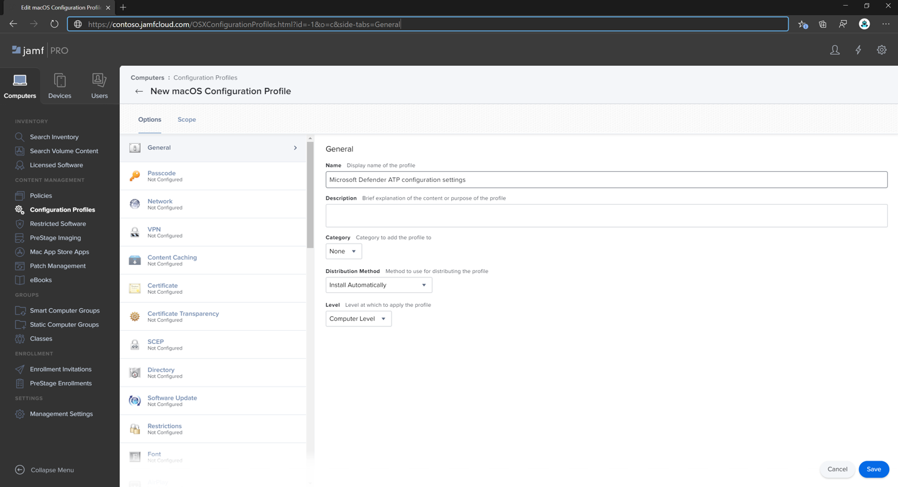
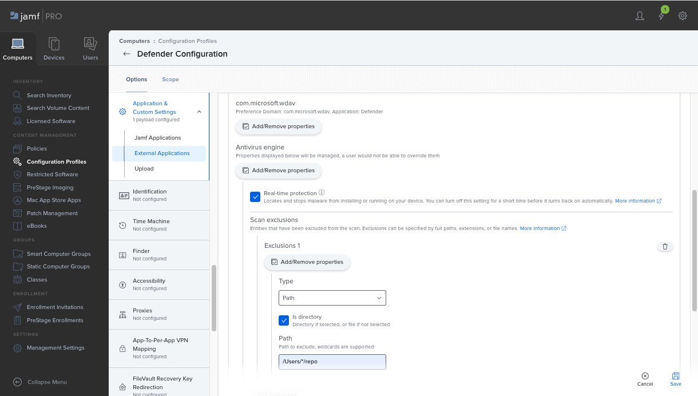
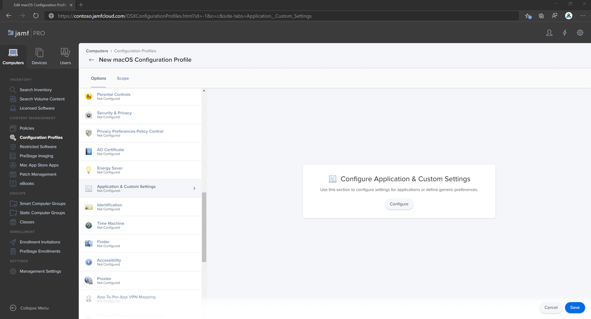
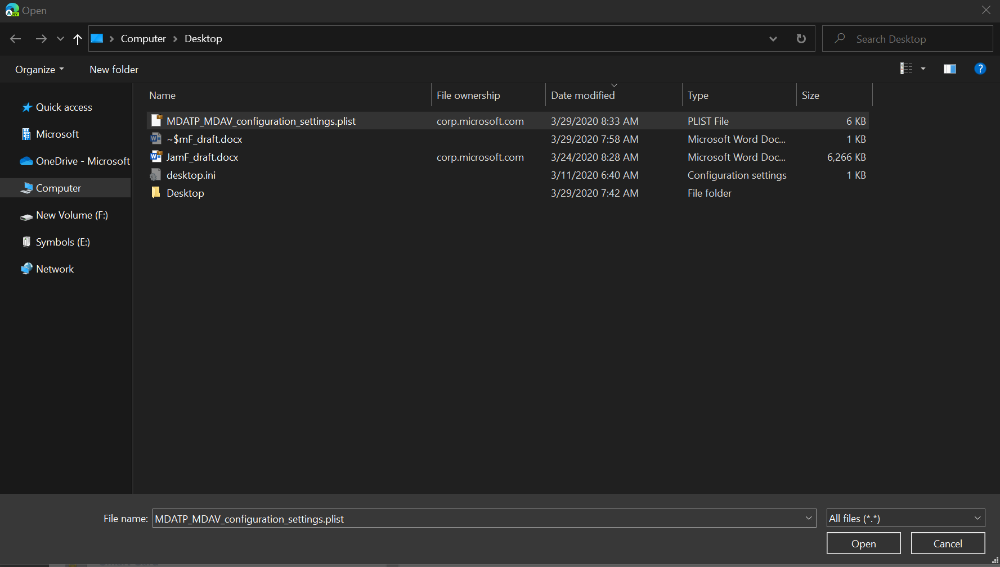
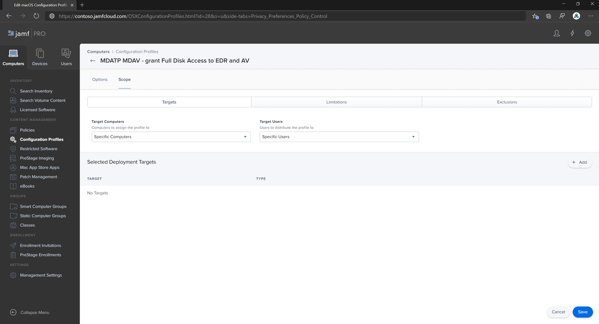
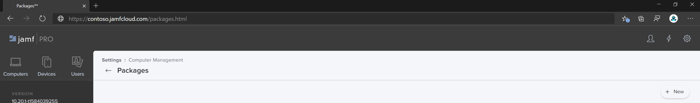

# <a name="set-up-the-microsoft-defender-for-endpoint-on-macos-policies-in-jamf-pro"></a><span data-ttu-id="f3169-104">Einrichten der Microsoft Defender für Endpunkt unter macOS-Richtlinien in Jamf Pro</span><span class="sxs-lookup"><span data-stu-id="f3169-104">Set up the Microsoft Defender for Endpoint on macOS policies in Jamf Pro</span></span>

[!INCLUDE [Microsoft 365 Defender rebranding](../../includes/microsoft-defender.md)]


<span data-ttu-id="f3169-105">**Gilt für:**</span><span class="sxs-lookup"><span data-stu-id="f3169-105">**Applies to:**</span></span>

- [<span data-ttu-id="f3169-106">Defender für Endpunkt auf dem Mac</span><span class="sxs-lookup"><span data-stu-id="f3169-106">Defender for Endpoint on Mac</span></span>](microsoft-defender-endpoint-mac.md)

<span data-ttu-id="f3169-107">Diese Seite führt Sie durch die Schritte, die Sie zum Einrichten von macOS-Richtlinien in Jamf Pro ausführen müssen.</span><span class="sxs-lookup"><span data-stu-id="f3169-107">This page will guide you through the steps you need to take to set up macOS policies in Jamf Pro.</span></span>

<span data-ttu-id="f3169-108">Sie müssen die folgenden Schritte ausführen:</span><span class="sxs-lookup"><span data-stu-id="f3169-108">You'll need to take the following steps:</span></span>

1. [<span data-ttu-id="f3169-109">Abrufen des Microsoft Defender für Endpunkt-Onboarding-Pakets</span><span class="sxs-lookup"><span data-stu-id="f3169-109">Get the Microsoft Defender for Endpoint onboarding package</span></span>](#step-1-get-the-microsoft-defender-for-endpoint-onboarding-package)

2. [<span data-ttu-id="f3169-110">Erstellen eines Konfigurationsprofils in Jamf Pro mithilfe des Onboardingpakets</span><span class="sxs-lookup"><span data-stu-id="f3169-110">Create a configuration profile in Jamf Pro using the onboarding package</span></span>](#step-2-create-a-configuration-profile-in-jamf-pro-using-the-onboarding-package)

3. [<span data-ttu-id="f3169-111">Konfigurieren von Microsoft Defender für Endpunkteinstellungen</span><span class="sxs-lookup"><span data-stu-id="f3169-111">Configure Microsoft Defender for Endpoint settings</span></span>](#step-3-configure-microsoft-defender-for-endpoint-settings)

4. [<span data-ttu-id="f3169-112">Konfigurieren von Microsoft Defender für Endpunkt-Benachrichtigungseinstellungen</span><span class="sxs-lookup"><span data-stu-id="f3169-112">Configure Microsoft Defender for Endpoint notification settings</span></span>](#step-4-configure-notifications-settings)

5. [<span data-ttu-id="f3169-113">Konfigurieren von Microsoft AutoUpdate (MAU)</span><span class="sxs-lookup"><span data-stu-id="f3169-113">Configure Microsoft AutoUpdate (MAU)</span></span>](#step-5-configure-microsoft-autoupdate-mau)

6. [<span data-ttu-id="f3169-114">Gewähren des vollständigen Datenträgerzugriffs auf Microsoft Defender für Endpunkt</span><span class="sxs-lookup"><span data-stu-id="f3169-114">Grant full disk access to Microsoft Defender for Endpoint</span></span>](#step-6-grant-full-disk-access-to-microsoft-defender-for-endpoint)

7. [<span data-ttu-id="f3169-115">Genehmigen der Kernelerweiterung für Microsoft Defender für Endpunkt</span><span class="sxs-lookup"><span data-stu-id="f3169-115">Approve Kernel extension for Microsoft Defender for Endpoint</span></span>](#step-7-approve-kernel-extension-for-microsoft-defender-for-endpoint)

8. [<span data-ttu-id="f3169-116">Genehmigen von Systemerweiterungen für Microsoft Defender für Endpunkt</span><span class="sxs-lookup"><span data-stu-id="f3169-116">Approve System extensions for Microsoft Defender for Endpoint</span></span>](#step-8-approve-system-extensions-for-microsoft-defender-for-endpoint)

9. [<span data-ttu-id="f3169-117">Konfigurieren der Netzwerkerweiterung</span><span class="sxs-lookup"><span data-stu-id="f3169-117">Configure Network Extension</span></span>](#step-9-configure-network-extension)

10. [<span data-ttu-id="f3169-118">Planen von Scans mit Microsoft Defender für Endpunkt unter macOS</span><span class="sxs-lookup"><span data-stu-id="f3169-118">Schedule scans with Microsoft Defender for Endpoint on macOS</span></span>](/windows/security/threat-protection/microsoft-defender-atp/mac-schedule-scan-atp)

11. [<span data-ttu-id="f3169-119">Bereitstellen von Microsoft Defender für Endpunkt unter macOS</span><span class="sxs-lookup"><span data-stu-id="f3169-119">Deploy Microsoft Defender for Endpoint on macOS</span></span>](#step-11-deploy-microsoft-defender-for-endpoint-on-macos)


## <a name="step-1-get-the-microsoft-defender-for-endpoint-onboarding-package"></a><span data-ttu-id="f3169-120">Schritt 1: Abrufen des Microsoft Defender für Endpunkt-Onboarding-Pakets</span><span class="sxs-lookup"><span data-stu-id="f3169-120">Step 1: Get the Microsoft Defender for Endpoint onboarding package</span></span>

1. <span data-ttu-id="f3169-121">Navigieren Sie [in Microsoft Defender Security Center](https://securitycenter.microsoft.com)zu **Einstellungen > Onboarding.**</span><span class="sxs-lookup"><span data-stu-id="f3169-121">In [Microsoft Defender Security Center](https://securitycenter.microsoft.com), navigate to **Settings > Onboarding**.</span></span>

2. <span data-ttu-id="f3169-122">Wählen Sie macOS als Betriebssystem und Verwaltung mobiler Geräte/Microsoft Intune als Bereitstellungsmethode aus.</span><span class="sxs-lookup"><span data-stu-id="f3169-122">Select macOS as the operating system and Mobile Device Management / Microsoft Intune as the deployment method.</span></span>

    

3. <span data-ttu-id="f3169-124">Wählen Sie **"Onboardingpaket herunterladen"** (WindowsDefenderATPOnboardingPackage.zip).</span><span class="sxs-lookup"><span data-stu-id="f3169-124">Select **Download onboarding package** (WindowsDefenderATPOnboardingPackage.zip).</span></span>

4. <span data-ttu-id="f3169-125">Extrahieren `WindowsDefenderATPOnboardingPackage.zip` .</span><span class="sxs-lookup"><span data-stu-id="f3169-125">Extract `WindowsDefenderATPOnboardingPackage.zip`.</span></span>

5. <span data-ttu-id="f3169-126">Kopieren Sie die Datei an Ihren bevorzugten Speicherort.</span><span class="sxs-lookup"><span data-stu-id="f3169-126">Copy the file to your preferred location.</span></span> <span data-ttu-id="f3169-127">Zum Beispiel: `C:\Users\JaneDoe_or_JohnDoe.contoso\Downloads\WindowsDefenderATPOnboardingPackage_macOS_MDM_contoso\jamf\WindowsDefenderATPOnboarding.plist`.</span><span class="sxs-lookup"><span data-stu-id="f3169-127">For example,  `C:\Users\JaneDoe_or_JohnDoe.contoso\Downloads\WindowsDefenderATPOnboardingPackage_macOS_MDM_contoso\jamf\WindowsDefenderATPOnboarding.plist`.</span></span>


## <a name="step-2-create-a-configuration-profile-in-jamf-pro-using-the-onboarding-package"></a><span data-ttu-id="f3169-128">Schritt 2: Erstellen eines Konfigurationsprofils in Jamf Pro mithilfe des Onboardingpakets</span><span class="sxs-lookup"><span data-stu-id="f3169-128">Step 2: Create a configuration profile in Jamf Pro using the onboarding package</span></span>

1. <span data-ttu-id="f3169-129">Suchen Sie die Datei `WindowsDefenderATPOnboarding.plist` aus dem vorherigen Abschnitt.</span><span class="sxs-lookup"><span data-stu-id="f3169-129">Locate the file `WindowsDefenderATPOnboarding.plist` from the previous section.</span></span>

   


2. <span data-ttu-id="f3169-131">Wählen Sie im Jamf Pro-Dashboard **"Neu"** aus.</span><span class="sxs-lookup"><span data-stu-id="f3169-131">In the Jamf Pro dashboard, select **New**.</span></span>

    

3. <span data-ttu-id="f3169-133">Geben Sie die folgenden Details ein:</span><span class="sxs-lookup"><span data-stu-id="f3169-133">Enter the following details:</span></span>

   <span data-ttu-id="f3169-134">**Allgemein**</span><span class="sxs-lookup"><span data-stu-id="f3169-134">**General**</span></span>
   - <span data-ttu-id="f3169-135">Name: MDATP-Onboarding für macOS</span><span class="sxs-lookup"><span data-stu-id="f3169-135">Name: MDATP onboarding for macOS</span></span>
   - <span data-ttu-id="f3169-136">Beschreibung: MDATP EDR Onboarding für macOS</span><span class="sxs-lookup"><span data-stu-id="f3169-136">Description: MDATP EDR onboarding for macOS</span></span>
   - <span data-ttu-id="f3169-137">Kategorie: Keine</span><span class="sxs-lookup"><span data-stu-id="f3169-137">Category: None</span></span>
   - <span data-ttu-id="f3169-138">Verteilungsmethode: Automatische Installation</span><span class="sxs-lookup"><span data-stu-id="f3169-138">Distribution Method: Install Automatically</span></span>
   - <span data-ttu-id="f3169-139">Stufe: Computerebene</span><span class="sxs-lookup"><span data-stu-id="f3169-139">Level: Computer Level</span></span>

4. <span data-ttu-id="f3169-140">**Wählen** Sie in Application & **Custom Einstellungen** configure aus.</span><span class="sxs-lookup"><span data-stu-id="f3169-140">In **Application & Custom Settings** select **Configure**.</span></span>

    

5. <span data-ttu-id="f3169-142">Wählen Sie **Hochladen Datei (PLIST-Datei)** aus, und geben Sie dann in der **Einstellungsdomäne** Folgendes ein: `com.microsoft.wdav.atp` .</span><span class="sxs-lookup"><span data-stu-id="f3169-142">Select **Upload File (PLIST file)** then in **Preference Domain** enter: `com.microsoft.wdav.atp`.</span></span>

    

    

6. <span data-ttu-id="f3169-145">Wählen Sie **"Öffnen"** aus, und wählen Sie die Onboardingdatei aus.</span><span class="sxs-lookup"><span data-stu-id="f3169-145">Select **Open** and select the onboarding file.</span></span>

    

7. <span data-ttu-id="f3169-147">Wählen Sie **Hochladen** aus.</span><span class="sxs-lookup"><span data-stu-id="f3169-147">Select **Upload**.</span></span>

    

8. <span data-ttu-id="f3169-149">Wählen Sie die Registerkarte **Bereich** aus.</span><span class="sxs-lookup"><span data-stu-id="f3169-149">Select the **Scope** tab.</span></span>

    

9. <span data-ttu-id="f3169-151">Wählen Sie die Zielcomputer aus.</span><span class="sxs-lookup"><span data-stu-id="f3169-151">Select the target computers.</span></span>

    

    

10. <span data-ttu-id="f3169-154">Klicken Sie auf **Speichern**.</span><span class="sxs-lookup"><span data-stu-id="f3169-154">Select **Save**.</span></span>

    

    

11. <span data-ttu-id="f3169-157">Wählen Sie **Fertig** aus.</span><span class="sxs-lookup"><span data-stu-id="f3169-157">Select **Done**.</span></span>

    

    

## <a name="step-3-configure-microsoft-defender-for-endpoint-settings"></a><span data-ttu-id="f3169-160">Schritt 3: Konfigurieren von Microsoft Defender für Endpunkteinstellungen</span><span class="sxs-lookup"><span data-stu-id="f3169-160">Step 3: Configure Microsoft Defender for Endpoint settings</span></span>

<span data-ttu-id="f3169-161">Sie können entweder JAMF Pro GUI verwenden, um einzelne Einstellungen der Microsoft Defender-Konfiguration zu bearbeiten, oder die Legacymethode verwenden, indem Sie eine Konfigurations-Plist in einem Text-Editor erstellen und in JAMF Pro hochladen.</span><span class="sxs-lookup"><span data-stu-id="f3169-161">You can either use JAMF Pro GUI to edit individual settings of the Microsoft Defender configuration, or use the legacy method by creating a configuration Plist in a text editor, and uploading it to JAMF Pro.</span></span>

<span data-ttu-id="f3169-162">Beachten Sie, dass Sie genau `com.microsoft.wdav` als **Einstellungsdomäne** verwenden müssen. Microsoft Defender verwendet nur diesen Namen und `com.microsoft.wdav.ext` lädt die verwalteten Einstellungen!</span><span class="sxs-lookup"><span data-stu-id="f3169-162">Note that you must use exact `com.microsoft.wdav` as the **Preference Domain**, Microsoft Defender uses only this name and `com.microsoft.wdav.ext` to load its managed settings!</span></span>

<span data-ttu-id="f3169-163">(Die `com.microsoft.wdav.ext` Version kann in seltenen Fällen verwendet werden, wenn Sie die GUI-Methode bevorzugen, aber auch eine Einstellung konfigurieren müssen, die dem Schema noch nicht hinzugefügt wurde.)</span><span class="sxs-lookup"><span data-stu-id="f3169-163">(The `com.microsoft.wdav.ext` version may be used in rare cases when you prefer to use GUI method, but also need to configure a setting that has not been added to the schema yet.)</span></span>

### <a name="gui-method"></a><span data-ttu-id="f3169-164">GUI-Methode</span><span class="sxs-lookup"><span data-stu-id="f3169-164">GUI method</span></span>

1. <span data-ttu-id="f3169-165">Laden Sie schema.jsaus dem [GitHub-Repository von Defender](https://github.com/microsoft/mdatp-xplat/tree/master/macos/schema) herunter, und speichern Sie sie in einer lokalen Datei:</span><span class="sxs-lookup"><span data-stu-id="f3169-165">Download schema.json file from [Defender's GitHub repository](https://github.com/microsoft/mdatp-xplat/tree/master/macos/schema) and save it to a local file:</span></span>

    ```bash
    curl -o ~/Documents/schema.json https://raw.githubusercontent.com/microsoft/mdatp-xplat/master/macos/schema/schema.json
    ```

2. <span data-ttu-id="f3169-166">Erstellen Sie unter "Computer – > Konfigurationsprofile" ein neues Konfigurationsprofil, und geben Sie die folgenden Details auf der Registerkarte **"Allgemein"** ein:</span><span class="sxs-lookup"><span data-stu-id="f3169-166">Create a new Configuration Profile under Computers -> Configuration Profiles, enter the following details on the **General** tab:</span></span>

    

    - <span data-ttu-id="f3169-168">Name: MDATP MDAV-Konfigurationseinstellungen</span><span class="sxs-lookup"><span data-stu-id="f3169-168">Name: MDATP MDAV configuration settings</span></span>
    - <span data-ttu-id="f3169-169">Beschreibung:\<blank\></span><span class="sxs-lookup"><span data-stu-id="f3169-169">Description:\<blank\></span></span>
    - <span data-ttu-id="f3169-170">Kategorie: Keine (Standard)</span><span class="sxs-lookup"><span data-stu-id="f3169-170">Category: None (default)</span></span>
    - <span data-ttu-id="f3169-171">Stufe: Computerebene (Standard)</span><span class="sxs-lookup"><span data-stu-id="f3169-171">Level: Computer Level (default)</span></span>
    - <span data-ttu-id="f3169-172">Verteilungsmethode: Automatisch installieren (Standard)</span><span class="sxs-lookup"><span data-stu-id="f3169-172">Distribution Method: Install Automatically (default)</span></span>

3. <span data-ttu-id="f3169-173">Scrollen Sie nach unten zur Registerkarte **"Anwendung & Benutzerdefinierte Einstellungen",** wählen Sie **"Externe Anwendungen"** aus, klicken Sie auf **"Benutzerdefiniertes Schema** als Quelle **hinzufügen** und verwenden", um sie für die Bevorzugte Domäne zu verwenden.</span><span class="sxs-lookup"><span data-stu-id="f3169-173">Scroll down to the **Application & Custom Settings** tab, select **External Applications**, click **Add** and use **Custom Schema** as Source to use for the preference domain.</span></span>

    

4. <span data-ttu-id="f3169-175">Geben Sie `com.microsoft.wdav` als Einstellungsdomäne ein, klicken Sie auf **"Schema hinzufügen"** und **Hochladen** die schema.jsauf die Datei, die in Schritt 1 heruntergeladen wurde.</span><span class="sxs-lookup"><span data-stu-id="f3169-175">Enter `com.microsoft.wdav` as the Preference Domain, click on **Add Schema** and **Upload** the schema.json file downloaded on Step 1.</span></span> <span data-ttu-id="f3169-176">Klicken Sie auf **Speichern**.</span><span class="sxs-lookup"><span data-stu-id="f3169-176">Click **Save**.</span></span>

    

5. <span data-ttu-id="f3169-178">Alle unterstützten Microsoft Defender-Konfigurationseinstellungen finden Sie unten unter **Einstellungsdomäneneigenschaften.**</span><span class="sxs-lookup"><span data-stu-id="f3169-178">You can see all supported Microsoft Defender configuration settings below, under **Preference Domain Properties**.</span></span> <span data-ttu-id="f3169-179">Klicken Sie auf **"Eigenschaften hinzufügen/entfernen",** um die Einstellungen auszuwählen, die verwaltet werden sollen, und klicken Sie auf **"Ok",** um die Änderungen zu speichern.</span><span class="sxs-lookup"><span data-stu-id="f3169-179">Click **Add/Remove properties** to select the settings that you want to be managed, and click **Ok** to save your changes.</span></span> <span data-ttu-id="f3169-180">(Einstellungen nicht ausgewählte Nichtauswahl nicht in die verwaltete Konfiguration einbezogen wird, kann ein Endbenutzer diese Einstellungen auf den Computern konfigurieren.)</span><span class="sxs-lookup"><span data-stu-id="f3169-180">(Settings left unselected will not be included into the managed configuration, an end user will be able to configure those settings on their machines.)</span></span>

    

6. <span data-ttu-id="f3169-182">Ändern Sie die Werte der Einstellungen in die gewünschten Werte.</span><span class="sxs-lookup"><span data-stu-id="f3169-182">Change values of the settings to desired values.</span></span> <span data-ttu-id="f3169-183">Sie können auf **"Weitere Informationen"** klicken, um Die Dokumentation für eine bestimmte Einstellung abzurufen.</span><span class="sxs-lookup"><span data-stu-id="f3169-183">You can click **More information** to get documentation for a particular setting.</span></span> <span data-ttu-id="f3169-184">(Sie können auf **die Plist-Vorschau** klicken, um zu überprüfen, wie die Konfigurations-Plist aussieht.</span><span class="sxs-lookup"><span data-stu-id="f3169-184">(You may click **Plist preview** to inspect what the configuration plist will look like.</span></span> <span data-ttu-id="f3169-185">Klicken Sie auf **den Formular-Editor,** um zum visuellen Editor zurückzukehren.)</span><span class="sxs-lookup"><span data-stu-id="f3169-185">Click **Form editor** to return to the visual editor.)</span></span>

    

7. <span data-ttu-id="f3169-187">Wählen Sie die Registerkarte **Bereich** aus.</span><span class="sxs-lookup"><span data-stu-id="f3169-187">Select the **Scope** tab.</span></span>

    

8. <span data-ttu-id="f3169-189">Wählen Sie **die Computergruppe von Contoso** aus.</span><span class="sxs-lookup"><span data-stu-id="f3169-189">Select **Contoso's Machine Group**.</span></span>

9. <span data-ttu-id="f3169-190">Wählen Sie **"Hinzufügen"** und dann **"Speichern"** aus.</span><span class="sxs-lookup"><span data-stu-id="f3169-190">Select **Add**, then select **Save**.</span></span>

    

    

10. <span data-ttu-id="f3169-193">Wählen Sie **Fertig** aus.</span><span class="sxs-lookup"><span data-stu-id="f3169-193">Select **Done**.</span></span> <span data-ttu-id="f3169-194">Das neue Konfigurationsprofil wird **angezeigt.**</span><span class="sxs-lookup"><span data-stu-id="f3169-194">You'll see the new **Configuration profile**.</span></span>

    

<span data-ttu-id="f3169-196">Microsoft Defender fügt im Laufe der Zeit neue Einstellungen hinzu.</span><span class="sxs-lookup"><span data-stu-id="f3169-196">Microsoft Defender adds new settings over time.</span></span> <span data-ttu-id="f3169-197">Diese neuen Einstellungen werden dem Schema hinzugefügt, und eine neue Version wird auf Github veröffentlicht.</span><span class="sxs-lookup"><span data-stu-id="f3169-197">These new settings will be added to the schema, and a new version will be published to Github.</span></span>
<span data-ttu-id="f3169-198">Um Updates zu erhalten, müssen Sie lediglich ein aktualisiertes Schema herunterladen, ein vorhandenes Konfigurationsprofil bearbeiten und das Schema auf der Registerkarte **"Anwendung & Benutzerdefinierte Einstellungen"** **bearbeiten.**</span><span class="sxs-lookup"><span data-stu-id="f3169-198">All you need to do to have updates is to download an updated schema, edit existing configuration profile, and **Edit schema** at the **Application & Custom Settings** tab.</span></span>

### <a name="legacy-method"></a><span data-ttu-id="f3169-199">Legacy-Methode</span><span class="sxs-lookup"><span data-stu-id="f3169-199">Legacy method</span></span>

1. <span data-ttu-id="f3169-200">Verwenden Sie die folgenden Konfigurationseinstellungen für Microsoft Defender für Endpunkt:</span><span class="sxs-lookup"><span data-stu-id="f3169-200">Use the following Microsoft Defender for Endpoint configuration settings:</span></span>

    - <span data-ttu-id="f3169-201">enableRealTimeProtection</span><span class="sxs-lookup"><span data-stu-id="f3169-201">enableRealTimeProtection</span></span>
    - <span data-ttu-id="f3169-202">passiveMode</span><span class="sxs-lookup"><span data-stu-id="f3169-202">passiveMode</span></span>

    >[!NOTE]
    ><span data-ttu-id="f3169-203">Nicht standardmäßig aktiviert, wenn Sie eine AV-Datei eines Drittanbieters für macOS ausführen möchten, legen Sie sie auf `true` .</span><span class="sxs-lookup"><span data-stu-id="f3169-203">Not turned on by default, if you are planning to run a third-party AV for macOS, set it to `true`.</span></span>

    - <span data-ttu-id="f3169-204">Ausschlüsse</span><span class="sxs-lookup"><span data-stu-id="f3169-204">exclusions</span></span>
    - <span data-ttu-id="f3169-205">excludedPath</span><span class="sxs-lookup"><span data-stu-id="f3169-205">excludedPath</span></span>
    - <span data-ttu-id="f3169-206">excludedFileExtension</span><span class="sxs-lookup"><span data-stu-id="f3169-206">excludedFileExtension</span></span>
    - <span data-ttu-id="f3169-207">excludedFileName</span><span class="sxs-lookup"><span data-stu-id="f3169-207">excludedFileName</span></span>
    - <span data-ttu-id="f3169-208">exclusionsMergePolicy</span><span class="sxs-lookup"><span data-stu-id="f3169-208">exclusionsMergePolicy</span></span>
    - <span data-ttu-id="f3169-209">allowedThreats</span><span class="sxs-lookup"><span data-stu-id="f3169-209">allowedThreats</span></span>

    >[!NOTE]
    ><span data-ttu-id="f3169-210">EICAR ist im Beispiel, wenn Sie einen Machbarkeitsstudie durchlaufen, entfernen Sie ihn, insbesondere, wenn Sie EICAR testen.</span><span class="sxs-lookup"><span data-stu-id="f3169-210">EICAR is on the sample, if you are going through a proof-of-concept, remove it especially if you are testing EICAR.</span></span>

    - <span data-ttu-id="f3169-211">disallowedThreatActions</span><span class="sxs-lookup"><span data-stu-id="f3169-211">disallowedThreatActions</span></span>
    - <span data-ttu-id="f3169-212">potentially_unwanted_application</span><span class="sxs-lookup"><span data-stu-id="f3169-212">potentially_unwanted_application</span></span>
    - <span data-ttu-id="f3169-213">archive_bomb</span><span class="sxs-lookup"><span data-stu-id="f3169-213">archive_bomb</span></span>
    - <span data-ttu-id="f3169-214">cloudService</span><span class="sxs-lookup"><span data-stu-id="f3169-214">cloudService</span></span>
    - <span data-ttu-id="f3169-215">automaticSampleSubmission</span><span class="sxs-lookup"><span data-stu-id="f3169-215">automaticSampleSubmission</span></span>
    - <span data-ttu-id="f3169-216">tags</span><span class="sxs-lookup"><span data-stu-id="f3169-216">tags</span></span>
    - <span data-ttu-id="f3169-217">hideStatusMenuIcon</span><span class="sxs-lookup"><span data-stu-id="f3169-217">hideStatusMenuIcon</span></span>

     <span data-ttu-id="f3169-218">Weitere Informationen finden Sie in der [Eigenschaftenliste für jamf-Konfigurationsprofil.](mac-preferences.md#property-list-for-jamf-configuration-profile)</span><span class="sxs-lookup"><span data-stu-id="f3169-218">For information, see [Property list for Jamf configuration profile](mac-preferences.md#property-list-for-jamf-configuration-profile).</span></span>

     ```XML
     <?xml version="1.0" encoding="UTF-8"?>
     <!DOCTYPE plist PUBLIC "-//Apple//DTD PLIST 1.0//EN" "http://www.apple.com/DTDs/PropertyList-1.0.dtd">
     <plist version="1.0">
     <dict>
         <key>antivirusEngine</key>
         <dict>
             <key>enableRealTimeProtection</key>
             <true/>
             <key>passiveMode</key>
             <false/>
             <key>exclusions</key>
             <array>
                 <dict>
                     <key>$type</key>
                     <string>excludedPath</string>
                     <key>isDirectory</key>
                     <false/>
                     <key>path</key>
                     <string>/var/log/system.log</string>
                 </dict>
                 <dict>
                     <key>$type</key>
                     <string>excludedPath</string>
                     <key>isDirectory</key>
                     <true/>
                     <key>path</key>
                     <string>/home</string>
                 </dict>
                 <dict>
                     <key>$type</key>
                     <string>excludedFileExtension</string>
                     <key>extension</key>
                     <string>pdf</string>
                 </dict>
                 <dict>
                     <key>$type</key>
                     <string>excludedFileName</string>
                     <key>name</key>
                     <string>cat</string>
                 </dict>
             </array>
             <key>exclusionsMergePolicy</key>
             <string>merge</string>
             <key>allowedThreats</key>
             <array>
                 <string>EICAR-Test-File (not a virus)</string>
             </array>
             <key>disallowedThreatActions</key>
             <array>
                 <string>allow</string>
                 <string>restore</string>
             </array>
             <key>threatTypeSettings</key>
             <array>
                 <dict>
                     <key>key</key>
                     <string>potentially_unwanted_application</string>
                     <key>value</key>
                     <string>block</string>
                 </dict>
                 <dict>
                     <key>key</key>
                     <string>archive_bomb</string>
                     <key>value</key>
                     <string>audit</string>
                 </dict>
             </array>
             <key>threatTypeSettingsMergePolicy</key>
             <string>merge</string>
         </dict>
         <key>cloudService</key>
         <dict>
             <key>enabled</key>
             <true/>
             <key>diagnosticLevel</key>
             <string>optional</string>
             <key>automaticSampleSubmission</key>
             <true/>
         </dict>
         <key>edr</key>
         <dict>
             <key>tags</key>
             <array>
                 <dict>
                     <key>key</key>
                     <string>GROUP</string>
                     <key>value</key>
                     <string>ExampleTag</string>
                 </dict>
             </array>
         </dict>
         <key>userInterface</key>
         <dict>
             <key>hideStatusMenuIcon</key>
             <false/>
         </dict>
     </dict>
     </plist>
     ```

2. <span data-ttu-id="f3169-219">Speichern Sie die Datei unter `MDATP_MDAV_configuration_settings.plist` .</span><span class="sxs-lookup"><span data-stu-id="f3169-219">Save the file as `MDATP_MDAV_configuration_settings.plist`.</span></span>

3. <span data-ttu-id="f3169-220">Öffnen Sie im Jamf Pro-Dashboard **Computer** und dort **Konfigurationsprofile.**</span><span class="sxs-lookup"><span data-stu-id="f3169-220">In the Jamf Pro dashboard, open **Computers**, and there **Configuration Profiles**.</span></span> <span data-ttu-id="f3169-221">Klicken Sie auf \**Neu(* und wechseln Sie zur Registerkarte **"Allgemein".**</span><span class="sxs-lookup"><span data-stu-id="f3169-221">Click \**New(* and switch to the **General** tab.</span></span>

    

4. <span data-ttu-id="f3169-223">Geben Sie die folgenden Details ein:</span><span class="sxs-lookup"><span data-stu-id="f3169-223">Enter the following details:</span></span>

    <span data-ttu-id="f3169-224">**Allgemein**</span><span class="sxs-lookup"><span data-stu-id="f3169-224">**General**</span></span>

    - <span data-ttu-id="f3169-225">Name: MDATP MDAV-Konfigurationseinstellungen</span><span class="sxs-lookup"><span data-stu-id="f3169-225">Name: MDATP MDAV configuration settings</span></span>
    - <span data-ttu-id="f3169-226">Beschreibung:\<blank\></span><span class="sxs-lookup"><span data-stu-id="f3169-226">Description:\<blank\></span></span>
    - <span data-ttu-id="f3169-227">Kategorie: Keine (Standard)</span><span class="sxs-lookup"><span data-stu-id="f3169-227">Category: None (default)</span></span>
    - <span data-ttu-id="f3169-228">Verteilungsmethode: Automatisch installieren(Standard)</span><span class="sxs-lookup"><span data-stu-id="f3169-228">Distribution Method: Install Automatically(default)</span></span>
    - <span data-ttu-id="f3169-229">Stufe: Computerebene (Standard)</span><span class="sxs-lookup"><span data-stu-id="f3169-229">Level: Computer Level(default)</span></span>

    

5. <span data-ttu-id="f3169-231">**Wählen** Sie in Application & **Custom Einstellungen** configure aus.</span><span class="sxs-lookup"><span data-stu-id="f3169-231">In **Application & Custom Settings** select **Configure**.</span></span>

    

6. <span data-ttu-id="f3169-233">Wählen Sie **Hochladen Datei (PLIST-Datei)** aus.</span><span class="sxs-lookup"><span data-stu-id="f3169-233">Select **Upload File (PLIST file)**.</span></span>

    

7. <span data-ttu-id="f3169-235">Geben Sie in **"Einstellungsdomäne"** `com.microsoft.wdav` Hochladen **PLIST-Datei** ein.</span><span class="sxs-lookup"><span data-stu-id="f3169-235">In **Preferences Domain**, enter `com.microsoft.wdav`, then select  **Upload PLIST File**.</span></span>

    

8. <span data-ttu-id="f3169-237">Wählen Sie **"Datei auswählen"** aus.</span><span class="sxs-lookup"><span data-stu-id="f3169-237">Select **Choose File**.</span></span>

    

9. <span data-ttu-id="f3169-239">Wählen Sie die **MDATP_MDAV_configuration_settings.plist** aus, und wählen Sie dann **"Öffnen"** aus.</span><span class="sxs-lookup"><span data-stu-id="f3169-239">Select the **MDATP_MDAV_configuration_settings.plist**, then select **Open**.</span></span>

    

10. <span data-ttu-id="f3169-241">Wählen Sie **Hochladen** aus.</span><span class="sxs-lookup"><span data-stu-id="f3169-241">Select **Upload**.</span></span>

    

    

    >[!NOTE]
    ><span data-ttu-id="f3169-244">Wenn Sie die Intune-Datei hochladen, erhalten Sie den folgenden Fehler:</span><span class="sxs-lookup"><span data-stu-id="f3169-244">If you happen to upload the Intune file, you'll get the following error:</span></span><br>
    ><span data-ttu-id="f3169-245"></span><span class="sxs-lookup"><span data-stu-id="f3169-245"></span></span>


11. <span data-ttu-id="f3169-246">Klicken Sie auf **Speichern**.</span><span class="sxs-lookup"><span data-stu-id="f3169-246">Select **Save**.</span></span>

    

12. <span data-ttu-id="f3169-248">Die Datei wird hochgeladen.</span><span class="sxs-lookup"><span data-stu-id="f3169-248">The file is uploaded.</span></span>

    

    

13. <span data-ttu-id="f3169-251">Wählen Sie die Registerkarte **Bereich** aus.</span><span class="sxs-lookup"><span data-stu-id="f3169-251">Select the **Scope** tab.</span></span>

    

14. <span data-ttu-id="f3169-253">Wählen Sie **die Computergruppe von Contoso** aus.</span><span class="sxs-lookup"><span data-stu-id="f3169-253">Select **Contoso's Machine Group**.</span></span>

15. <span data-ttu-id="f3169-254">Wählen Sie **"Hinzufügen"** und dann **"Speichern"** aus.</span><span class="sxs-lookup"><span data-stu-id="f3169-254">Select **Add**, then select **Save**.</span></span>

    

    

16. <span data-ttu-id="f3169-257">Wählen Sie **Fertig** aus.</span><span class="sxs-lookup"><span data-stu-id="f3169-257">Select **Done**.</span></span> <span data-ttu-id="f3169-258">Das neue Konfigurationsprofil wird **angezeigt.**</span><span class="sxs-lookup"><span data-stu-id="f3169-258">You'll see the new **Configuration profile**.</span></span>

    

## <a name="step-4-configure-notifications-settings"></a><span data-ttu-id="f3169-260">Schritt 4: Konfigurieren von Benachrichtigungseinstellungen</span><span class="sxs-lookup"><span data-stu-id="f3169-260">Step 4: Configure notifications settings</span></span>

<span data-ttu-id="f3169-261">Diese Schritte gelten für macOS 10.15 (Macintosh) oder höher.</span><span class="sxs-lookup"><span data-stu-id="f3169-261">These steps are applicable of macOS 10.15 (Catalina) or newer.</span></span>

1. <span data-ttu-id="f3169-262">Wählen Sie im Jamf Pro-Dashboard **Computer und** dann **Konfigurationsprofile aus.**</span><span class="sxs-lookup"><span data-stu-id="f3169-262">In the Jamf Pro dashboard, select **Computers**, then **Configuration Profiles**.</span></span>

2. <span data-ttu-id="f3169-263">Klicken Sie auf **Neu,** und geben Sie die folgenden Details für **Optionen** ein:</span><span class="sxs-lookup"><span data-stu-id="f3169-263">Click **New**, and enter the following details for **Options**:</span></span>

    - <span data-ttu-id="f3169-264">**Registerkarte "Allgemein":**</span><span class="sxs-lookup"><span data-stu-id="f3169-264">Tab **General**:</span></span>
        - <span data-ttu-id="f3169-265">**Name:** MDATP-MDAV-Benachrichtigungseinstellungen</span><span class="sxs-lookup"><span data-stu-id="f3169-265">**Name**: MDATP MDAV Notification settings</span></span>
        - <span data-ttu-id="f3169-266">**Beschreibung:** macOS 10.15 (Bild) oder höher</span><span class="sxs-lookup"><span data-stu-id="f3169-266">**Description**: macOS 10.15 (Catalina) or newer</span></span>
        - <span data-ttu-id="f3169-267">**Kategorie:** None *(Standard)*</span><span class="sxs-lookup"><span data-stu-id="f3169-267">**Category**: None *(default)*</span></span>
        - <span data-ttu-id="f3169-268">**Verteilungsmethode:** Automatisch installieren *(Standard)*</span><span class="sxs-lookup"><span data-stu-id="f3169-268">**Distribution Method**: Install Automatically *(default)*</span></span>
        - <span data-ttu-id="f3169-269">**Ebene:** Computerebene *(Standard)*</span><span class="sxs-lookup"><span data-stu-id="f3169-269">**Level**: Computer Level *(default)*</span></span>

        

    - <span data-ttu-id="f3169-271">**Registerkartenbenachrichtigungen,** klicken Sie auf **"Hinzufügen",** und geben Sie die folgenden Werte ein:</span><span class="sxs-lookup"><span data-stu-id="f3169-271">Tab **Notifications**, click **Add**, and enter the following values:</span></span>
        - <span data-ttu-id="f3169-272">**Bundle-ID:**`com.microsoft.wdav.tray`</span><span class="sxs-lookup"><span data-stu-id="f3169-272">**Bundle ID**: `com.microsoft.wdav.tray`</span></span>
        - <span data-ttu-id="f3169-273">**Kritische Warnungen:** Klicken Sie auf **"Deaktivieren".**</span><span class="sxs-lookup"><span data-stu-id="f3169-273">**Critical Alerts**: Click **Disable**</span></span>
        - <span data-ttu-id="f3169-274">**Benachrichtigungen:** Klicken Sie auf **"Aktivieren".**</span><span class="sxs-lookup"><span data-stu-id="f3169-274">**Notifications**: Click **Enable**</span></span>
        - <span data-ttu-id="f3169-275">**Bannerwarnungstyp:** Auswählen **von "Einschließen"** und **"Temporär"** *(Standard)*</span><span class="sxs-lookup"><span data-stu-id="f3169-275">**Banner alert type**: Select **Include** and **Temporary** *(default)*</span></span>
        - <span data-ttu-id="f3169-276">**Benachrichtigungen auf dem Sperrbildschirm:** Klicken Sie auf **"Ausblenden".**</span><span class="sxs-lookup"><span data-stu-id="f3169-276">**Notifications on lock screen**: Click **Hide**</span></span>
        - <span data-ttu-id="f3169-277">**Benachrichtigungen im Info-Center:** Klicken Sie auf **"Anzeigen".**</span><span class="sxs-lookup"><span data-stu-id="f3169-277">**Notifications in Notification Center**: Click **Display**</span></span>
        - <span data-ttu-id="f3169-278">**Symbol der Signal-App:** Klicken Sie auf **"Anzeigen".**</span><span class="sxs-lookup"><span data-stu-id="f3169-278">**Badge app icon**: Click **Display**</span></span>

        

    - <span data-ttu-id="f3169-280">Registerkarte **"Benachrichtigungen",** klicken Sie auf "Noch einmal **hinzufügen",** scrollen Sie nach unten zu **"Neue Benachrichtigungen" Einstellungen**</span><span class="sxs-lookup"><span data-stu-id="f3169-280">Tab **Notifications**, click **Add** one more time, scroll down to **New Notifications Settings**</span></span>
        - <span data-ttu-id="f3169-281">**Bundle-ID:**`com.microsoft.autoupdate2`</span><span class="sxs-lookup"><span data-stu-id="f3169-281">**Bundle ID**: `com.microsoft.autoupdate2`</span></span>
        - <span data-ttu-id="f3169-282">Konfigurieren Sie die restlichen Einstellungen auf dieselben Werte wie oben</span><span class="sxs-lookup"><span data-stu-id="f3169-282">Configure the rest of the settings to the same values as above</span></span>

        

        <span data-ttu-id="f3169-284">Beachten Sie, dass Sie jetzt zwei "Tabellen" mit Benachrichtigungskonfigurationen haben, eine für **die Bundle-ID: com.microsoft.wdav.tray** und eine weitere für **die Bundle-ID: com.microsoft.autoupdate2**.</span><span class="sxs-lookup"><span data-stu-id="f3169-284">Note that now you have two 'tables' with notification configurations, one for **Bundle ID: com.microsoft.wdav.tray**, and another for **Bundle ID: com.microsoft.autoupdate2**.</span></span> <span data-ttu-id="f3169-285">Während Sie Warnungseinstellungen gemäß Ihren Anforderungen konfigurieren können, müssen Bundle-IDs genau die gleichen wie zuvor beschrieben sein, und **die Option "Einschließen"** muss für **Benachrichtigungen** **aktiviert** sein.</span><span class="sxs-lookup"><span data-stu-id="f3169-285">While you can configure alert settings per your requirements, Bundle IDs must be exactly the same as described before, and **Include** switch must be **On** for **Notifications**.</span></span>

3. <span data-ttu-id="f3169-286">Wählen Sie die Registerkarte **"Bereich"** und dann **"Hinzufügen"** aus.</span><span class="sxs-lookup"><span data-stu-id="f3169-286">Select the **Scope** tab, then select **Add**.</span></span>

    

4. <span data-ttu-id="f3169-288">Wählen Sie **die Computergruppe von Contoso** aus.</span><span class="sxs-lookup"><span data-stu-id="f3169-288">Select **Contoso's Machine Group**.</span></span>

5. <span data-ttu-id="f3169-289">Wählen Sie **"Hinzufügen"** und dann **"Speichern"** aus.</span><span class="sxs-lookup"><span data-stu-id="f3169-289">Select **Add**, then select **Save**.</span></span>

    

    

6. <span data-ttu-id="f3169-292">Wählen Sie **Fertig** aus.</span><span class="sxs-lookup"><span data-stu-id="f3169-292">Select **Done**.</span></span> <span data-ttu-id="f3169-293">Das neue Konfigurationsprofil wird **angezeigt.**</span><span class="sxs-lookup"><span data-stu-id="f3169-293">You'll see the new **Configuration profile**.</span></span>
    <span data-ttu-id="f3169-294"></span><span class="sxs-lookup"><span data-stu-id="f3169-294"></span></span>

## <a name="step-5-configure-microsoft-autoupdate-mau"></a><span data-ttu-id="f3169-295">Schritt 5: Konfigurieren von Microsoft AutoUpdate (MAU)</span><span class="sxs-lookup"><span data-stu-id="f3169-295">Step 5: Configure Microsoft AutoUpdate (MAU)</span></span>

1. <span data-ttu-id="f3169-296">Verwenden Sie die folgenden Konfigurationseinstellungen für Microsoft Defender für Endpunkt:</span><span class="sxs-lookup"><span data-stu-id="f3169-296">Use the following Microsoft Defender for Endpoint configuration settings:</span></span>

      ```XML
   <?xml version="1.0" encoding="UTF-8"?>
   <!DOCTYPE plist PUBLIC "-//Apple//DTD PLIST 1.0//EN" "http://www.apple.com/DTDs/PropertyList-1.0.dtd">
   <plist version="1.0">
   <dict>
    <key>ChannelName</key>
    <string>Current</string>
    <key>HowToCheck</key>
    <string>AutomaticDownload</string>
    <key>EnableCheckForUpdatesButton</key>
    <true/>
    <key>DisableInsiderCheckbox</key>
    <false/>
    <key>SendAllTelemetryEnabled</key>
    <true/>
   </dict>
   </plist>
   ```

2. <span data-ttu-id="f3169-297">Speichern Sie es unter `MDATP_MDAV_MAU_settings.plist` .</span><span class="sxs-lookup"><span data-stu-id="f3169-297">Save it as `MDATP_MDAV_MAU_settings.plist`.</span></span>

3. <span data-ttu-id="f3169-298">Wählen Sie im Jamf Pro-Dashboard **"Allgemein"** aus.</span><span class="sxs-lookup"><span data-stu-id="f3169-298">In the Jamf Pro dashboard, select **General**.</span></span>

    

4. <span data-ttu-id="f3169-300">Geben Sie die folgenden Details ein:</span><span class="sxs-lookup"><span data-stu-id="f3169-300">Enter the following details:</span></span>

    <span data-ttu-id="f3169-301">**Allgemein**</span><span class="sxs-lookup"><span data-stu-id="f3169-301">**General**</span></span>

    - <span data-ttu-id="f3169-302">Name: MDATP MDAV MAU settings</span><span class="sxs-lookup"><span data-stu-id="f3169-302">Name: MDATP MDAV MAU settings</span></span>
    - <span data-ttu-id="f3169-303">Beschreibung: Microsoft AutoUpdate-Einstellungen für MDATP für macOS</span><span class="sxs-lookup"><span data-stu-id="f3169-303">Description: Microsoft AutoUpdate settings for MDATP for macOS</span></span>
    - <span data-ttu-id="f3169-304">Kategorie: Keine (Standard)</span><span class="sxs-lookup"><span data-stu-id="f3169-304">Category: None (default)</span></span>
    - <span data-ttu-id="f3169-305">Verteilungsmethode: Automatisch installieren(Standard)</span><span class="sxs-lookup"><span data-stu-id="f3169-305">Distribution Method: Install Automatically(default)</span></span>
    - <span data-ttu-id="f3169-306">Stufe: Computerebene (Standard)</span><span class="sxs-lookup"><span data-stu-id="f3169-306">Level: Computer Level(default)</span></span>

5. <span data-ttu-id="f3169-307">**Wählen** Sie in Application & **Custom Einstellungen** configure aus.</span><span class="sxs-lookup"><span data-stu-id="f3169-307">In **Application & Custom Settings** select **Configure**.</span></span>

    

6. <span data-ttu-id="f3169-309">Wählen Sie **Hochladen Datei (PLIST-Datei)** aus.</span><span class="sxs-lookup"><span data-stu-id="f3169-309">Select **Upload File (PLIST file)**.</span></span>

    

7. <span data-ttu-id="f3169-311">Geben Sie in **der Einstellungsdomäne** Folgendes ein: `com.microsoft.autoupdate2` wählen Sie dann Hochladen **PLIST-Datei** aus.</span><span class="sxs-lookup"><span data-stu-id="f3169-311">In **Preference Domain** enter: `com.microsoft.autoupdate2`, then select **Upload PLIST File**.</span></span>

    

8. <span data-ttu-id="f3169-313">Wählen Sie **"Datei auswählen"** aus.</span><span class="sxs-lookup"><span data-stu-id="f3169-313">Select **Choose File**.</span></span>

    

9. <span data-ttu-id="f3169-315">Wählen Sie **MDATP_MDAV_MAU_settings.plist** aus.</span><span class="sxs-lookup"><span data-stu-id="f3169-315">Select **MDATP_MDAV_MAU_settings.plist**.</span></span>

    

10. <span data-ttu-id="f3169-317">Wählen Sie **Hochladen** aus.</span><span class="sxs-lookup"><span data-stu-id="f3169-317">Select **Upload**.</span></span>
    <span data-ttu-id="f3169-318"></span><span class="sxs-lookup"><span data-stu-id="f3169-318"></span></span>

    

11. <span data-ttu-id="f3169-320">Klicken Sie auf **Speichern**.</span><span class="sxs-lookup"><span data-stu-id="f3169-320">Select **Save**.</span></span>

    

12. <span data-ttu-id="f3169-322">Wählen Sie die Registerkarte **Bereich** aus.</span><span class="sxs-lookup"><span data-stu-id="f3169-322">Select the **Scope** tab.</span></span>

     

13. <span data-ttu-id="f3169-324">Wählen Sie **Hinzufügen**.</span><span class="sxs-lookup"><span data-stu-id="f3169-324">Select **Add**.</span></span>

    

    

    

14. <span data-ttu-id="f3169-328">Wählen Sie **Fertig** aus.</span><span class="sxs-lookup"><span data-stu-id="f3169-328">Select **Done**.</span></span>

    

## <a name="step-6-grant-full-disk-access-to-microsoft-defender-for-endpoint"></a><span data-ttu-id="f3169-330">Schritt 6: Gewähren des vollständigen Datenträgerzugriffs auf Microsoft Defender für Endpunkt</span><span class="sxs-lookup"><span data-stu-id="f3169-330">Step 6: Grant full disk access to Microsoft Defender for Endpoint</span></span>

1. <span data-ttu-id="f3169-331">Wählen Sie im Jamf Pro-Dashboard **Konfigurationsprofile aus.**</span><span class="sxs-lookup"><span data-stu-id="f3169-331">In the Jamf Pro dashboard, select **Configuration Profiles**.</span></span>

    

2. <span data-ttu-id="f3169-333">Wählen Sie **+ Neu** aus.</span><span class="sxs-lookup"><span data-stu-id="f3169-333">Select **+ New**.</span></span>

3. <span data-ttu-id="f3169-334">Geben Sie die folgenden Details ein:</span><span class="sxs-lookup"><span data-stu-id="f3169-334">Enter the following details:</span></span>

    <span data-ttu-id="f3169-335">**Allgemein**</span><span class="sxs-lookup"><span data-stu-id="f3169-335">**General**</span></span>
    - <span data-ttu-id="f3169-336">Name: MDATP MDAV – Gewähren des vollständigen Datenträgerzugriffs auf EDR und AV</span><span class="sxs-lookup"><span data-stu-id="f3169-336">Name: MDATP MDAV - grant Full Disk Access to EDR and AV</span></span>
    - <span data-ttu-id="f3169-337">Beschreibung: Auf macOS- oder neueren Computern wird die neue Richtliniensteuerung für Die Datenschutzeinstellungen</span><span class="sxs-lookup"><span data-stu-id="f3169-337">Description: On macOS Catalina or newer, the new Privacy Preferences Policy Control</span></span>
    - <span data-ttu-id="f3169-338">Kategorie: Keine</span><span class="sxs-lookup"><span data-stu-id="f3169-338">Category: None</span></span>
    - <span data-ttu-id="f3169-339">Verteilungsmethode: Automatische Installation</span><span class="sxs-lookup"><span data-stu-id="f3169-339">Distribution method: Install Automatically</span></span>
    - <span data-ttu-id="f3169-340">Stufe: Computerebene</span><span class="sxs-lookup"><span data-stu-id="f3169-340">Level: Computer level</span></span>


    

4. <span data-ttu-id="f3169-342">Wählen Sie unter **"Datenschutzeinstellungsrichtliniensteuerung** konfigurieren" die Option **"Konfigurieren"** aus.</span><span class="sxs-lookup"><span data-stu-id="f3169-342">In **Configure Privacy Preferences Policy Control** select **Configure**.</span></span>

    

5. <span data-ttu-id="f3169-344">Geben Sie unter **"Datenschutzeinstellungsrichtliniensteuerung"** die folgenden Details ein:</span><span class="sxs-lookup"><span data-stu-id="f3169-344">In **Privacy Preferences Policy Control**, enter the following details:</span></span>

    - <span data-ttu-id="f3169-345">Bezeichner: `com.microsoft.wdav`</span><span class="sxs-lookup"><span data-stu-id="f3169-345">Identifier: `com.microsoft.wdav`</span></span>
    - <span data-ttu-id="f3169-346">Bezeichnertyp: Bundle-ID</span><span class="sxs-lookup"><span data-stu-id="f3169-346">Identifier Type: Bundle ID</span></span>
    - <span data-ttu-id="f3169-347">Codeanforderung: `identifier "com.microsoft.wdav" and anchor apple generic and certificate 1[field.1.2.840.113635.100.6.2.6] /* exists */ and certificate leaf[field.1.2.840.113635.100.6.1.13] /* exists */ and certificate leaf[subject.OU] = UBF8T346G9`</span><span class="sxs-lookup"><span data-stu-id="f3169-347">Code Requirement: `identifier "com.microsoft.wdav" and anchor apple generic and certificate 1[field.1.2.840.113635.100.6.2.6] /* exists */ and certificate leaf[field.1.2.840.113635.100.6.1.13] /* exists */ and certificate leaf[subject.OU] = UBF8T346G9`</span></span>


    

6. <span data-ttu-id="f3169-349">Wählen Sie **+ Hinzufügen** aus.</span><span class="sxs-lookup"><span data-stu-id="f3169-349">Select **+ Add**.</span></span>

    

    - <span data-ttu-id="f3169-351">Unter App oder Dienst: Auf **SystemPolicyAllFiles** festlegen</span><span class="sxs-lookup"><span data-stu-id="f3169-351">Under App or service: Set to **SystemPolicyAllFiles**</span></span>

    - <span data-ttu-id="f3169-352">Unter "Zugriff": Auf **"Zulassen"** festlegen</span><span class="sxs-lookup"><span data-stu-id="f3169-352">Under "access": Set to **Allow**</span></span>

7. <span data-ttu-id="f3169-353">Wählen Sie **"Speichern"** (nicht die unten rechts) aus.</span><span class="sxs-lookup"><span data-stu-id="f3169-353">Select **Save** (not the one at the bottom right).</span></span>

    

8. <span data-ttu-id="f3169-355">Klicken Sie auf das `+` Zeichen neben **App Access,** um einen neuen Eintrag hinzuzufügen.</span><span class="sxs-lookup"><span data-stu-id="f3169-355">Click the `+` sign next to **App Access** to add a new entry.</span></span>

    

9. <span data-ttu-id="f3169-357">Geben Sie die folgenden Details ein:</span><span class="sxs-lookup"><span data-stu-id="f3169-357">Enter the following details:</span></span>

    - <span data-ttu-id="f3169-358">Bezeichner: `com.microsoft.wdav.epsext`</span><span class="sxs-lookup"><span data-stu-id="f3169-358">Identifier: `com.microsoft.wdav.epsext`</span></span>
    - <span data-ttu-id="f3169-359">Bezeichnertyp: Bundle-ID</span><span class="sxs-lookup"><span data-stu-id="f3169-359">Identifier Type: Bundle ID</span></span>
    - <span data-ttu-id="f3169-360">Codeanforderung: `identifier "com.microsoft.wdav.epsext" and anchor apple generic and certificate 1[field.1.2.840.113635.100.6.2.6] /* exists */ and certificate leaf[field.1.2.840.113635.100.6.1.13] /* exists */ and certificate leaf[subject.OU] = UBF8T346G9`</span><span class="sxs-lookup"><span data-stu-id="f3169-360">Code Requirement: `identifier "com.microsoft.wdav.epsext" and anchor apple generic and certificate 1[field.1.2.840.113635.100.6.2.6] /* exists */ and certificate leaf[field.1.2.840.113635.100.6.1.13] /* exists */ and certificate leaf[subject.OU] = UBF8T346G9`</span></span>

10. <span data-ttu-id="f3169-361">Wählen Sie **+ Hinzufügen** aus.</span><span class="sxs-lookup"><span data-stu-id="f3169-361">Select **+ Add**.</span></span>

    

    - <span data-ttu-id="f3169-363">Unter App oder Dienst: Auf **SystemPolicyAllFiles** festlegen</span><span class="sxs-lookup"><span data-stu-id="f3169-363">Under App or service: Set to **SystemPolicyAllFiles**</span></span>

    - <span data-ttu-id="f3169-364">Unter "Zugriff": Auf **"Zulassen"** festlegen</span><span class="sxs-lookup"><span data-stu-id="f3169-364">Under "access": Set to **Allow**</span></span>

11. <span data-ttu-id="f3169-365">Wählen Sie **"Speichern"** (nicht die unten rechts) aus.</span><span class="sxs-lookup"><span data-stu-id="f3169-365">Select **Save** (not the one at the bottom right).</span></span>

    

12. <span data-ttu-id="f3169-367">Wählen Sie die Registerkarte **Bereich** aus.</span><span class="sxs-lookup"><span data-stu-id="f3169-367">Select the **Scope** tab.</span></span>

    

13. <span data-ttu-id="f3169-369">Wählen Sie **+ Hinzufügen** aus.</span><span class="sxs-lookup"><span data-stu-id="f3169-369">Select **+ Add**.</span></span>

    

14. <span data-ttu-id="f3169-371">Wählen Sie unter **"Gruppenname"** > **Computergruppen** > die **Computergruppe von Contoso** aus.</span><span class="sxs-lookup"><span data-stu-id="f3169-371">Select **Computer Groups** > under **Group Name** > select **Contoso's MachineGroup**.</span></span>

    

15. <span data-ttu-id="f3169-373">Wählen Sie **Hinzufügen**.</span><span class="sxs-lookup"><span data-stu-id="f3169-373">Select **Add**.</span></span>

16. <span data-ttu-id="f3169-374">Klicken Sie auf **Speichern**.</span><span class="sxs-lookup"><span data-stu-id="f3169-374">Select **Save**.</span></span>

17. <span data-ttu-id="f3169-375">Wählen Sie **Fertig** aus.</span><span class="sxs-lookup"><span data-stu-id="f3169-375">Select **Done**.</span></span>

    

    

<span data-ttu-id="f3169-378">Alternativ können Sie [fulldisk.mobileconfig](https://github.com/microsoft/mdatp-xplat/blob/master/macos/mobileconfig/profiles/fulldisk.mobileconfig) herunterladen und in JAMF-Konfigurationsprofile hochladen, wie unter ["Deploying Custom Configuration Profiles using Jamf Pro| Methode 2: Hochladen ein Konfigurationsprofil an Jamf Pro](https://www.jamf.com/jamf-nation/articles/648/deploying-custom-configuration-profiles-using-jamf-pro).</span><span class="sxs-lookup"><span data-stu-id="f3169-378">Alternatively, you can download [fulldisk.mobileconfig](https://github.com/microsoft/mdatp-xplat/blob/master/macos/mobileconfig/profiles/fulldisk.mobileconfig) and upload it to JAMF Configuration Profiles as described in [Deploying Custom Configuration Profiles using Jamf Pro|Method 2: Upload a Configuration Profile to Jamf Pro](https://www.jamf.com/jamf-nation/articles/648/deploying-custom-configuration-profiles-using-jamf-pro).</span></span>

## <a name="step-7-approve-kernel-extension-for-microsoft-defender-for-endpoint"></a><span data-ttu-id="f3169-379">Schritt 7: Genehmigen der Kernelerweiterung für Microsoft Defender für Endpunkt</span><span class="sxs-lookup"><span data-stu-id="f3169-379">Step 7: Approve Kernel extension for Microsoft Defender for Endpoint</span></span>

> [!CAUTION]
> <span data-ttu-id="f3169-380">Apple Silicon (M1)-Geräte unterstützen KEXT nicht.</span><span class="sxs-lookup"><span data-stu-id="f3169-380">Apple Silicon (M1) devices do not support KEXT.</span></span> <span data-ttu-id="f3169-381">Die Installation eines Konfigurationsprofils, das aus KEXT-Richtlinien besteht, schlägt auf diesen Geräten fehl.</span><span class="sxs-lookup"><span data-stu-id="f3169-381">Installation of a configuration profile consisting KEXT policies will fail on these devices.</span></span>

1. <span data-ttu-id="f3169-382">Wählen Sie in den **Konfigurationsprofilen** **+Neu** aus.</span><span class="sxs-lookup"><span data-stu-id="f3169-382">In the **Configuration Profiles**, select **+ New**.</span></span>

    

2. <span data-ttu-id="f3169-384">Geben Sie die folgenden Details ein:</span><span class="sxs-lookup"><span data-stu-id="f3169-384">Enter the following details:</span></span>

    <span data-ttu-id="f3169-385">**Allgemein**</span><span class="sxs-lookup"><span data-stu-id="f3169-385">**General**</span></span>

    - <span data-ttu-id="f3169-386">Name: MDATP MDAV Kernel Extension</span><span class="sxs-lookup"><span data-stu-id="f3169-386">Name: MDATP MDAV Kernel Extension</span></span>
    - <span data-ttu-id="f3169-387">Beschreibung: MDATP-Kernelerweiterung (kext)</span><span class="sxs-lookup"><span data-stu-id="f3169-387">Description: MDATP kernel extension (kext)</span></span>
    - <span data-ttu-id="f3169-388">Kategorie: Keine</span><span class="sxs-lookup"><span data-stu-id="f3169-388">Category: None</span></span>
    - <span data-ttu-id="f3169-389">Verteilungsmethode: Automatische Installation</span><span class="sxs-lookup"><span data-stu-id="f3169-389">Distribution Method: Install Automatically</span></span>
    - <span data-ttu-id="f3169-390">Stufe: Computerebene</span><span class="sxs-lookup"><span data-stu-id="f3169-390">Level: Computer Level</span></span>

    

3. <span data-ttu-id="f3169-392">Wählen Sie unter **"Genehmigte Kernelerweiterungen konfigurieren"** die Option **"Konfigurieren"** aus.</span><span class="sxs-lookup"><span data-stu-id="f3169-392">In **Configure Approved Kernel Extensions** select **Configure**.</span></span>

    


4. <span data-ttu-id="f3169-394">Geben Sie in **"Genehmigte Kernelerweiterungen"** die folgenden Details ein:</span><span class="sxs-lookup"><span data-stu-id="f3169-394">In **Approved Kernel Extensions** Enter the following details:</span></span>

    - <span data-ttu-id="f3169-395">Anzeigename: Microsoft Corp.</span><span class="sxs-lookup"><span data-stu-id="f3169-395">Display Name: Microsoft Corp.</span></span>
    - <span data-ttu-id="f3169-396">Team-ID: UBF8T346G9</span><span class="sxs-lookup"><span data-stu-id="f3169-396">Team ID: UBF8T346G9</span></span>

    

5. <span data-ttu-id="f3169-398">Wählen Sie die Registerkarte **Bereich** aus.</span><span class="sxs-lookup"><span data-stu-id="f3169-398">Select the **Scope** tab.</span></span>

    

6. <span data-ttu-id="f3169-400">Wählen Sie **+ Hinzufügen** aus.</span><span class="sxs-lookup"><span data-stu-id="f3169-400">Select **+ Add**.</span></span>

7. <span data-ttu-id="f3169-401">Wählen Sie unter **"Gruppenname"** > **Computergruppen** > **Computergruppe von Contoso** aus.</span><span class="sxs-lookup"><span data-stu-id="f3169-401">Select **Computer Groups** > under **Group Name** > select **Contoso's Machine Group**.</span></span>

8. <span data-ttu-id="f3169-402">Wählen Sie **+ Hinzufügen** aus.</span><span class="sxs-lookup"><span data-stu-id="f3169-402">Select **+ Add**.</span></span>

    

9. <span data-ttu-id="f3169-404">Klicken Sie auf **Speichern**.</span><span class="sxs-lookup"><span data-stu-id="f3169-404">Select **Save**.</span></span>

    

10. <span data-ttu-id="f3169-406">Wählen Sie **Fertig** aus.</span><span class="sxs-lookup"><span data-stu-id="f3169-406">Select **Done**.</span></span>

    

<span data-ttu-id="f3169-408">Alternativ können Sie [kext.mobileconfig](https://github.com/microsoft/mdatp-xplat/blob/master/macos/mobileconfig/profiles/kext.mobileconfig) herunterladen und in JAMF-Konfigurationsprofile hochladen, wie unter ["Deploying Custom Configuration Profiles using Jamf Pro| Methode 2: Hochladen ein Konfigurationsprofil an Jamf Pro](https://www.jamf.com/jamf-nation/articles/648/deploying-custom-configuration-profiles-using-jamf-pro).</span><span class="sxs-lookup"><span data-stu-id="f3169-408">Alternatively, you can download [kext.mobileconfig](https://github.com/microsoft/mdatp-xplat/blob/master/macos/mobileconfig/profiles/kext.mobileconfig) and upload it to JAMF Configuration Profiles as described in [Deploying Custom Configuration Profiles using Jamf Pro|Method 2: Upload a Configuration Profile to Jamf Pro](https://www.jamf.com/jamf-nation/articles/648/deploying-custom-configuration-profiles-using-jamf-pro).</span></span>

## <a name="step-8-approve-system-extensions-for-microsoft-defender-for-endpoint"></a><span data-ttu-id="f3169-409">Schritt 8: Genehmigen von Systemerweiterungen für Microsoft Defender für Endpunkt</span><span class="sxs-lookup"><span data-stu-id="f3169-409">Step 8: Approve System extensions for Microsoft Defender for Endpoint</span></span>

1. <span data-ttu-id="f3169-410">Wählen Sie in den **Konfigurationsprofilen** **+Neu** aus.</span><span class="sxs-lookup"><span data-stu-id="f3169-410">In the **Configuration Profiles**, select **+ New**.</span></span>

    

2. <span data-ttu-id="f3169-412">Geben Sie die folgenden Details ein:</span><span class="sxs-lookup"><span data-stu-id="f3169-412">Enter the following details:</span></span>

    <span data-ttu-id="f3169-413">**Allgemein**</span><span class="sxs-lookup"><span data-stu-id="f3169-413">**General**</span></span>

    - <span data-ttu-id="f3169-414">Name: MDATP MDAV System Extensions</span><span class="sxs-lookup"><span data-stu-id="f3169-414">Name: MDATP MDAV System Extensions</span></span>
    - <span data-ttu-id="f3169-415">Beschreibung: MDATP-Systemerweiterungen</span><span class="sxs-lookup"><span data-stu-id="f3169-415">Description: MDATP system extensions</span></span>
    - <span data-ttu-id="f3169-416">Kategorie: Keine</span><span class="sxs-lookup"><span data-stu-id="f3169-416">Category: None</span></span>
    - <span data-ttu-id="f3169-417">Verteilungsmethode: Automatische Installation</span><span class="sxs-lookup"><span data-stu-id="f3169-417">Distribution Method: Install Automatically</span></span>
    - <span data-ttu-id="f3169-418">Stufe: Computerebene</span><span class="sxs-lookup"><span data-stu-id="f3169-418">Level: Computer Level</span></span>

    

3. <span data-ttu-id="f3169-420">Wählen Sie **in "Systemerweiterungen"** die Option **"Konfigurieren"** aus.</span><span class="sxs-lookup"><span data-stu-id="f3169-420">In **System Extensions** select **Configure**.</span></span>

   

4. <span data-ttu-id="f3169-422">Geben Sie in **Systemerweiterungen** die folgenden Details ein:</span><span class="sxs-lookup"><span data-stu-id="f3169-422">In **System Extensions** enter the following details:</span></span>

   - <span data-ttu-id="f3169-423">Anzeigename: Microsoft Corp. Systemerweiterungen</span><span class="sxs-lookup"><span data-stu-id="f3169-423">Display Name: Microsoft Corp. System Extensions</span></span>
   - <span data-ttu-id="f3169-424">Systemerweiterungstypen: Zulässige Systemerweiterungen</span><span class="sxs-lookup"><span data-stu-id="f3169-424">System Extension Types: Allowed System Extensions</span></span>
   - <span data-ttu-id="f3169-425">Teambezeichner: UBF8T346G9</span><span class="sxs-lookup"><span data-stu-id="f3169-425">Team Identifier: UBF8T346G9</span></span>
   - <span data-ttu-id="f3169-426">Zulässige Systemerweiterungen:</span><span class="sxs-lookup"><span data-stu-id="f3169-426">Allowed System Extensions:</span></span>
     - <span data-ttu-id="f3169-427">**com.microsoft.wdav.epsext**</span><span class="sxs-lookup"><span data-stu-id="f3169-427">**com.microsoft.wdav.epsext**</span></span>
     - <span data-ttu-id="f3169-428">**com.microsoft.wdav.netext**</span><span class="sxs-lookup"><span data-stu-id="f3169-428">**com.microsoft.wdav.netext**</span></span>

    

5. <span data-ttu-id="f3169-430">Wählen Sie die Registerkarte **Bereich** aus.</span><span class="sxs-lookup"><span data-stu-id="f3169-430">Select the **Scope** tab.</span></span>

    

6. <span data-ttu-id="f3169-432">Wählen Sie **+ Hinzufügen** aus.</span><span class="sxs-lookup"><span data-stu-id="f3169-432">Select **+ Add**.</span></span>

7. <span data-ttu-id="f3169-433">Wählen Sie unter **"Gruppenname"** > **Computergruppen** > **Computergruppe von Contoso** aus.</span><span class="sxs-lookup"><span data-stu-id="f3169-433">Select **Computer Groups** > under **Group Name** > select **Contoso's Machine Group**.</span></span>

8. <span data-ttu-id="f3169-434">Wählen Sie **+ Hinzufügen** aus.</span><span class="sxs-lookup"><span data-stu-id="f3169-434">Select **+ Add**.</span></span>

   

9. <span data-ttu-id="f3169-436">Klicken Sie auf **Speichern**.</span><span class="sxs-lookup"><span data-stu-id="f3169-436">Select **Save**.</span></span>

   

10. <span data-ttu-id="f3169-438">Wählen Sie **Fertig** aus.</span><span class="sxs-lookup"><span data-stu-id="f3169-438">Select **Done**.</span></span>

    

## <a name="step-9-configure-network-extension"></a><span data-ttu-id="f3169-440">Schritt 9: Konfigurieren der Netzwerkerweiterung</span><span class="sxs-lookup"><span data-stu-id="f3169-440">Step 9: Configure Network Extension</span></span>

<span data-ttu-id="f3169-441">Als Teil der Funktionen für Endpunkterkennung und -reaktion prüft Microsoft Defender für Endpunkt unter macOS Socketdatenverkehr und meldet diese Informationen an das Microsoft Defender Security Center Portal.</span><span class="sxs-lookup"><span data-stu-id="f3169-441">As part of the Endpoint Detection and Response capabilities, Microsoft Defender for Endpoint on macOS inspects socket traffic and reports this information to the Microsoft Defender Security Center portal.</span></span> <span data-ttu-id="f3169-442">Mit der folgenden Richtlinie kann die Netzwerkerweiterung diese Funktionalität ausführen.</span><span class="sxs-lookup"><span data-stu-id="f3169-442">The following policy allows the network extension to perform this functionality.</span></span>

<span data-ttu-id="f3169-443">Diese Schritte gelten für macOS 10.15 (Macintosh) oder höher.</span><span class="sxs-lookup"><span data-stu-id="f3169-443">These steps are applicable of macOS 10.15 (Catalina) or newer.</span></span>

1. <span data-ttu-id="f3169-444">Wählen Sie im Jamf Pro-Dashboard **Computer und** dann **Konfigurationsprofile aus.**</span><span class="sxs-lookup"><span data-stu-id="f3169-444">In the Jamf Pro dashboard, select **Computers**, then **Configuration Profiles**.</span></span>

2. <span data-ttu-id="f3169-445">Klicken Sie auf **Neu,** und geben Sie die folgenden Details für **Optionen** ein:</span><span class="sxs-lookup"><span data-stu-id="f3169-445">Click **New**, and enter the following details for **Options**:</span></span>

    - <span data-ttu-id="f3169-446">**Registerkarte "Allgemein":**</span><span class="sxs-lookup"><span data-stu-id="f3169-446">Tab **General**:</span></span>
        - <span data-ttu-id="f3169-447">**Name:** Microsoft Defender ATP-Netzwerkerweiterung</span><span class="sxs-lookup"><span data-stu-id="f3169-447">**Name**: Microsoft Defender ATP Network Extension</span></span>
        - <span data-ttu-id="f3169-448">**Beschreibung:** macOS 10.15 (Bild) oder höher</span><span class="sxs-lookup"><span data-stu-id="f3169-448">**Description**: macOS 10.15 (Catalina) or newer</span></span>
        - <span data-ttu-id="f3169-449">**Kategorie:** None *(Standard)*</span><span class="sxs-lookup"><span data-stu-id="f3169-449">**Category**: None *(default)*</span></span>
        - <span data-ttu-id="f3169-450">**Verteilungsmethode:** Automatisch installieren *(Standard)*</span><span class="sxs-lookup"><span data-stu-id="f3169-450">**Distribution Method**: Install Automatically *(default)*</span></span>
        - <span data-ttu-id="f3169-451">**Ebene:** Computerebene *(Standard)*</span><span class="sxs-lookup"><span data-stu-id="f3169-451">**Level**: Computer Level *(default)*</span></span>

    - <span data-ttu-id="f3169-452">**Registerkarteninhaltsfilter:**</span><span class="sxs-lookup"><span data-stu-id="f3169-452">Tab **Content Filter**:</span></span>
        - <span data-ttu-id="f3169-453">**Filtername**: Microsoft Defender ATP-Inhaltsfilter</span><span class="sxs-lookup"><span data-stu-id="f3169-453">**Filter Name**: Microsoft Defender ATP Content Filter</span></span>
        - <span data-ttu-id="f3169-454">**Bezeichner:**`com.microsoft.wdav`</span><span class="sxs-lookup"><span data-stu-id="f3169-454">**Identifier**: `com.microsoft.wdav`</span></span>
        - <span data-ttu-id="f3169-455">**Dienstadresse** verlassen, **Organisation,** **Benutzername,** **Kennwort,** **Zertifikat** leer (**Include** ist *nicht* ausgewählt)</span><span class="sxs-lookup"><span data-stu-id="f3169-455">Leave **Service Address**, **Organization**, **User Name**, **Password**, **Certificate** blank (**Include** is *not* selected)</span></span>
        - <span data-ttu-id="f3169-456">**Filterreihenfolge:** Inspector</span><span class="sxs-lookup"><span data-stu-id="f3169-456">**Filter Order**: Inspector</span></span>
        - <span data-ttu-id="f3169-457">**Socketfilter:**`com.microsoft.wdav.netext`</span><span class="sxs-lookup"><span data-stu-id="f3169-457">**Socket Filter**: `com.microsoft.wdav.netext`</span></span>
        - <span data-ttu-id="f3169-458">**Angegebene Anforderung für Socketfilter:**`identifier "com.microsoft.wdav.netext" and anchor apple generic and certificate 1[field.1.2.840.113635.100.6.2.6] /* exists */ and certificate leaf[field.1.2.840.113635.100.6.1.13] /* exists */ and certificate leaf[subject.OU] = UBF8T346G9`</span><span class="sxs-lookup"><span data-stu-id="f3169-458">**Socket Filter Designated Requirement**: `identifier "com.microsoft.wdav.netext" and anchor apple generic and certificate 1[field.1.2.840.113635.100.6.2.6] /* exists */ and certificate leaf[field.1.2.840.113635.100.6.1.13] /* exists */ and certificate leaf[subject.OU] = UBF8T346G9`</span></span>
        - <span data-ttu-id="f3169-459">**Netzwerkfilterfelder** leer lassen (**Include** ist *nicht* ausgewählt)</span><span class="sxs-lookup"><span data-stu-id="f3169-459">Leave **Network Filter** fields blank (**Include** is *not* selected)</span></span>

        <span data-ttu-id="f3169-460">Beachten Sie, dass **bezeichner,** **Socketfilter** und **Socketfilter angegebene Anforderung** genaue Werte wie oben angegeben.</span><span class="sxs-lookup"><span data-stu-id="f3169-460">Note that **Identifier**, **Socket Filter** and **Socket Filter Designated Requirement** exact values as specified above.</span></span>

        

3. <span data-ttu-id="f3169-462">Wählen Sie die Registerkarte **Bereich** aus.</span><span class="sxs-lookup"><span data-stu-id="f3169-462">Select the **Scope** tab.</span></span>

   

4. <span data-ttu-id="f3169-464">Wählen Sie **+ Hinzufügen** aus.</span><span class="sxs-lookup"><span data-stu-id="f3169-464">Select **+ Add**.</span></span>

5. <span data-ttu-id="f3169-465">Wählen Sie unter **"Gruppenname"** > **Computergruppen** > **Computergruppe von Contoso** aus.</span><span class="sxs-lookup"><span data-stu-id="f3169-465">Select **Computer Groups** > under **Group Name** > select **Contoso's Machine Group**.</span></span>

6. <span data-ttu-id="f3169-466">Wählen Sie **+ Hinzufügen** aus.</span><span class="sxs-lookup"><span data-stu-id="f3169-466">Select **+ Add**.</span></span>

    

7. <span data-ttu-id="f3169-468">Klicken Sie auf **Speichern**.</span><span class="sxs-lookup"><span data-stu-id="f3169-468">Select **Save**.</span></span>

    

8. <span data-ttu-id="f3169-470">Wählen Sie **Fertig** aus.</span><span class="sxs-lookup"><span data-stu-id="f3169-470">Select **Done**.</span></span>

    

<span data-ttu-id="f3169-472">Alternativ können Sie [netfilter.mobileconfig](https://github.com/microsoft/mdatp-xplat/blob/master/macos/mobileconfig/profiles/netfilter.mobileconfig) herunterladen und in JAMF-Konfigurationsprofile hochladen, wie unter ["Deploying Custom Configuration Profiles using Jamf Pro| Methode 2: Hochladen ein Konfigurationsprofil an Jamf Pro](https://www.jamf.com/jamf-nation/articles/648/deploying-custom-configuration-profiles-using-jamf-pro).</span><span class="sxs-lookup"><span data-stu-id="f3169-472">Alternatively, you can download [netfilter.mobileconfig](https://github.com/microsoft/mdatp-xplat/blob/master/macos/mobileconfig/profiles/netfilter.mobileconfig) and upload it to JAMF Configuration Profiles as described in [Deploying Custom Configuration Profiles using Jamf Pro|Method 2: Upload a Configuration Profile to Jamf Pro](https://www.jamf.com/jamf-nation/articles/648/deploying-custom-configuration-profiles-using-jamf-pro).</span></span>


## <a name="step-10-schedule-scans-with-microsoft-defender-for-endpoint-on-macos"></a><span data-ttu-id="f3169-473">Schritt 10: Planen von Scans mit Microsoft Defender für Endpunkt unter macOS</span><span class="sxs-lookup"><span data-stu-id="f3169-473">Step 10: Schedule scans with Microsoft Defender for Endpoint on macOS</span></span>
<span data-ttu-id="f3169-474">Folgen Sie den Anweisungen zum [Planen von Scans mit Microsoft Defender für Endpunkt unter macOS.](/windows/security/threat-protection/microsoft-defender-atp/mac-schedule-scan-atp)</span><span class="sxs-lookup"><span data-stu-id="f3169-474">Follow the instructions on [Schedule scans with Microsoft Defender for Endpoint on macOS](/windows/security/threat-protection/microsoft-defender-atp/mac-schedule-scan-atp).</span></span>


## <a name="step-11-deploy-microsoft-defender-for-endpoint-on-macos"></a><span data-ttu-id="f3169-475">Schritt 11: Bereitstellen von Microsoft Defender für Endpunkt unter macOS</span><span class="sxs-lookup"><span data-stu-id="f3169-475">Step 11: Deploy Microsoft Defender for Endpoint on macOS</span></span>

1. <span data-ttu-id="f3169-476">Navigieren Sie zu dem Speicherort, an dem Sie gespeichert `wdav.pkg` haben.</span><span class="sxs-lookup"><span data-stu-id="f3169-476">Navigate to where you saved `wdav.pkg`.</span></span>

    

2. <span data-ttu-id="f3169-478">Benennen Sie es in `wdav_MDM_Contoso_200329.pkg` .</span><span class="sxs-lookup"><span data-stu-id="f3169-478">Rename it to `wdav_MDM_Contoso_200329.pkg`.</span></span>

    

3. <span data-ttu-id="f3169-480">Öffnen Sie das Jamf Pro-Dashboard.</span><span class="sxs-lookup"><span data-stu-id="f3169-480">Open the Jamf Pro dashboard.</span></span>

    

4. <span data-ttu-id="f3169-482">Wählen Sie Ihren Computer aus, und klicken Sie oben auf das Zahnradsymbol, und wählen Sie dann **"Computerverwaltung"** aus.</span><span class="sxs-lookup"><span data-stu-id="f3169-482">Select your computer and click the gear icon at the top, then select **Computer Management**.</span></span>

    

5. <span data-ttu-id="f3169-484">Wählen Sie in **"Pakete"** **+ "Neu"** aus.</span><span class="sxs-lookup"><span data-stu-id="f3169-484">In **Packages**, select **+ New**.</span></span>
    <span data-ttu-id="f3169-485"></span><span class="sxs-lookup"><span data-stu-id="f3169-485"></span></span>

6. <span data-ttu-id="f3169-486">Geben Sie in **"Neues Paket"** die folgenden Details ein:</span><span class="sxs-lookup"><span data-stu-id="f3169-486">In **New Package** Enter the following details:</span></span>

    <span data-ttu-id="f3169-487">**Registerkarte "Allgemein"**</span><span class="sxs-lookup"><span data-stu-id="f3169-487">**General tab**</span></span>
    - <span data-ttu-id="f3169-488">Anzeigename: Lassen Sie es vorerst leer.</span><span class="sxs-lookup"><span data-stu-id="f3169-488">Display Name: Leave it blank for now.</span></span> <span data-ttu-id="f3169-489">Da sie zurückgesetzt wird, wenn Sie Ihr pkg auswählen.</span><span class="sxs-lookup"><span data-stu-id="f3169-489">Because it will be reset when you choose your pkg.</span></span>
    - <span data-ttu-id="f3169-490">Kategorie: Keine (Standard)</span><span class="sxs-lookup"><span data-stu-id="f3169-490">Category: None (default)</span></span>
    - <span data-ttu-id="f3169-491">Dateiname: Datei auswählen</span><span class="sxs-lookup"><span data-stu-id="f3169-491">Filename: Choose File</span></span>

    

    <span data-ttu-id="f3169-493">Öffnen Sie die Datei, und zeigen Sie sie auf `wdav.pkg` oder `wdav_MDM_Contoso_200329.pkg` .</span><span class="sxs-lookup"><span data-stu-id="f3169-493">Open the file and point it to `wdav.pkg` or `wdav_MDM_Contoso_200329.pkg`.</span></span>

    

7. <span data-ttu-id="f3169-495">Klicken Sie auf **Öffnen**.</span><span class="sxs-lookup"><span data-stu-id="f3169-495">Select **Open**.</span></span> <span data-ttu-id="f3169-496">Legen Sie den **Anzeigenamen** auf **Microsoft Defender Advanced Threat Protection und Microsoft Defender Antivirus** fest.</span><span class="sxs-lookup"><span data-stu-id="f3169-496">Set the **Display Name** to **Microsoft Defender Advanced Threat Protection and Microsoft Defender Antivirus**.</span></span>

    <span data-ttu-id="f3169-497">**Manifestdatei** ist nicht erforderlich.</span><span class="sxs-lookup"><span data-stu-id="f3169-497">**Manifest File** is not required.</span></span> <span data-ttu-id="f3169-498">Microsoft Defender für Endpunkt funktioniert ohne Manifestdatei.</span><span class="sxs-lookup"><span data-stu-id="f3169-498">Microsoft Defender for Endpoint works without Manifest File.</span></span>

    <span data-ttu-id="f3169-499">**Registerkarte "Optionen"**</span><span class="sxs-lookup"><span data-stu-id="f3169-499">**Options tab**</span></span><br> <span data-ttu-id="f3169-500">Behalten Sie standardwerte bei.</span><span class="sxs-lookup"><span data-stu-id="f3169-500">Keep default values.</span></span>

    <span data-ttu-id="f3169-501">**Registerkarte "Einschränkungen"**</span><span class="sxs-lookup"><span data-stu-id="f3169-501">**Limitations tab**</span></span><br> <span data-ttu-id="f3169-502">Behalten Sie standardwerte bei.</span><span class="sxs-lookup"><span data-stu-id="f3169-502">Keep default values.</span></span>

     

8. <span data-ttu-id="f3169-504">Klicken Sie auf **Speichern**.</span><span class="sxs-lookup"><span data-stu-id="f3169-504">Select **Save**.</span></span> <span data-ttu-id="f3169-505">Das Paket wird in Jamf Pro hochgeladen.</span><span class="sxs-lookup"><span data-stu-id="f3169-505">The package is uploaded to Jamf Pro.</span></span>

   

   <span data-ttu-id="f3169-507">Es kann einige Minuten dauern, bis das Paket für die Bereitstellung verfügbar ist.</span><span class="sxs-lookup"><span data-stu-id="f3169-507">It can take a few minutes for the package to be available for deployment.</span></span>

   

9. <span data-ttu-id="f3169-509">Navigieren Sie zur Seite **"Richtlinien".**</span><span class="sxs-lookup"><span data-stu-id="f3169-509">Navigate to the **Policies** page.</span></span>

    

10. <span data-ttu-id="f3169-511">Wählen Sie **+Neu** aus, um eine neue Richtlinie zu erstellen.</span><span class="sxs-lookup"><span data-stu-id="f3169-511">Select **+ New** to create a new policy.</span></span>

    


11. <span data-ttu-id="f3169-513">Geben Sie **im Allgemeinen** die folgenden Details ein:</span><span class="sxs-lookup"><span data-stu-id="f3169-513">In **General** Enter the following details:</span></span>

    - <span data-ttu-id="f3169-514">Anzeigename: MDATP Onboarding Contoso 200329 v100.86.92 oder höher</span><span class="sxs-lookup"><span data-stu-id="f3169-514">Display name: MDATP Onboarding Contoso 200329 v100.86.92 or later</span></span>

    

12. <span data-ttu-id="f3169-516">Wählen Sie **wiederkehrendes Einchecken aus.**</span><span class="sxs-lookup"><span data-stu-id="f3169-516">Select **Recurring Check-in**.</span></span>

    


13. <span data-ttu-id="f3169-518">Klicken Sie auf **Speichern**.</span><span class="sxs-lookup"><span data-stu-id="f3169-518">Select **Save**.</span></span>

14. <span data-ttu-id="f3169-519">Wählen Sie **Pakete aus, > konfigurieren.**</span><span class="sxs-lookup"><span data-stu-id="f3169-519">Select **Packages > Configure**.</span></span>

    

15. <span data-ttu-id="f3169-521">Wählen Sie neben **Microsoft Defender Advanced Threat Protection und Microsoft Defender Antivirus die** Schaltfläche **"Hinzufügen"** aus.</span><span class="sxs-lookup"><span data-stu-id="f3169-521">Select the **Add** button next to **Microsoft Defender Advanced Threat Protection and Microsoft Defender Antivirus**.</span></span>

    

16. <span data-ttu-id="f3169-523">Klicken Sie auf **Speichern**.</span><span class="sxs-lookup"><span data-stu-id="f3169-523">Select **Save**.</span></span>

    

17. <span data-ttu-id="f3169-525">Wählen Sie die Registerkarte **Bereich** aus.</span><span class="sxs-lookup"><span data-stu-id="f3169-525">Select the **Scope** tab.</span></span>

    

18. <span data-ttu-id="f3169-527">Wählen Sie die Zielcomputer aus.</span><span class="sxs-lookup"><span data-stu-id="f3169-527">Select the target computers.</span></span>

    

    <span data-ttu-id="f3169-529">**Scope**</span><span class="sxs-lookup"><span data-stu-id="f3169-529">**Scope**</span></span>

    <span data-ttu-id="f3169-530">Wählen Sie **Hinzufügen**.</span><span class="sxs-lookup"><span data-stu-id="f3169-530">Select **Add**.</span></span>

    

    

    <span data-ttu-id="f3169-533">**Self-Service**</span><span class="sxs-lookup"><span data-stu-id="f3169-533">**Self-Service**</span></span>

    

19. <span data-ttu-id="f3169-535">Wählen Sie **Fertig** aus.</span><span class="sxs-lookup"><span data-stu-id="f3169-535">Select **Done**.</span></span>

    

    


