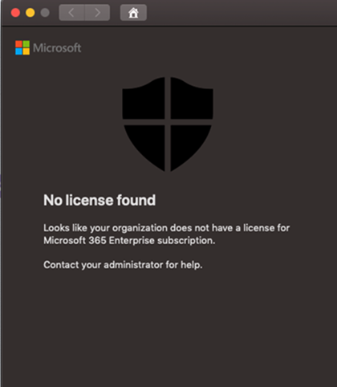

# Behandeln von Lizenzproblemen für Microsoft Defender for Endpoint unter macOS

[!INCLUDE [Microsoft 365 Defender rebranding](../../includes/microsoft-defender.md)]

**Gilt für:**

- [Microsoft Defender für Endpunkt unter Mac OS](microsoft-defender-endpoint-mac.md)
- [Microsoft Defender für Endpunkt](https://go.microsoft.com/fwlink/p/?linkid=2154037)
- [Microsoft 365 Defender](https://go.microsoft.com/fwlink/?linkid=2118804)

> Möchten Sie Microsoft Defender for Endpoint erleben? [Registrieren Sie sich für eine kostenlose Testversion.](https://www.microsoft.com/microsoft-365/windows/microsoft-defender-atp?ocid=docs-wdatp-exposedapis-abovefoldlink)

Während Sie Microsoft Defender for Endpoint auf [macOS](microsoft-defender-endpoint-mac.md) und [manuellen](mac-install-manually.md) Bereitstellungstests oder einem Proof Of Concept (PoC) durch führen, wird möglicherweise der folgende Fehler angezeigt:

**Nachricht:** 

Keine Lizenz gefunden

Es sieht so aus, als verfügt Ihre Organisation nicht über eine Lizenz für Microsoft 365 Enterprise Abonnement.

Weitere Informationen erhalten Sie von Ihrem Administrator.

**Ursache:** 

Sie haben das Microsoft Defender for Endpoint für macOS-Paket ("Installationspaket herunterladen") bereitgestellt und/oder installiert, aber Möglicherweise haben Sie das Konfigurationsskript ("Onboardingpaket herunterladen") ausgeführt, oder Sie haben dem Benutzer keine Lizenz zugewiesen.

**Lösung:**

Befolgen Sie die MicrosoftDefenderATPOnboardingMacOs.py, die hier dokumentiert sind: [Clientkonfiguration](mac-install-manually.md#client-configuration)
