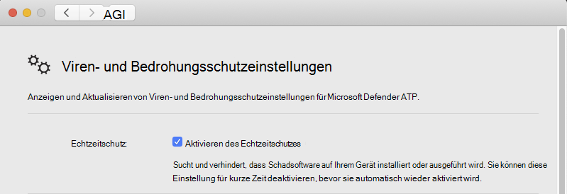

# <a name="troubleshoot-performance-issues-for-microsoft-defender-for-endpoint-on-macos"></a><span data-ttu-id="09dad-104">Behandeln von Leistungsproblemen für Microsoft Defender for Endpoint unter macOS</span><span class="sxs-lookup"><span data-stu-id="09dad-104">Troubleshoot performance issues for Microsoft Defender for Endpoint on macOS</span></span>

[!INCLUDE [Microsoft 365 Defender rebranding](../../includes/microsoft-defender.md)]


<span data-ttu-id="09dad-105">**Gilt für:**</span><span class="sxs-lookup"><span data-stu-id="09dad-105">**Applies to:**</span></span>

- [<span data-ttu-id="09dad-106">Microsoft Defender für Endpunkt unter Mac OS</span><span class="sxs-lookup"><span data-stu-id="09dad-106">Microsoft Defender for Endpoint on macOS</span></span>](microsoft-defender-endpoint-mac.md)
- [<span data-ttu-id="09dad-107">Microsoft Defender für Endpunkt</span><span class="sxs-lookup"><span data-stu-id="09dad-107">Microsoft Defender for Endpoint</span></span>](https://go.microsoft.com/fwlink/p/?linkid=2154037)
- [<span data-ttu-id="09dad-108">Microsoft 365 Defender</span><span class="sxs-lookup"><span data-stu-id="09dad-108">Microsoft 365 Defender</span></span>](https://go.microsoft.com/fwlink/?linkid=2118804)

> <span data-ttu-id="09dad-109">Möchten Sie Microsoft Defender for Endpoint erleben?</span><span class="sxs-lookup"><span data-stu-id="09dad-109">Want to experience Microsoft Defender for Endpoint?</span></span> [<span data-ttu-id="09dad-110">Registrieren Sie sich für eine kostenlose Testversion.</span><span class="sxs-lookup"><span data-stu-id="09dad-110">Sign up for a free trial.</span></span>](https://www.microsoft.com/microsoft-365/windows/microsoft-defender-atp?ocid=docs-wdatp-exposedapis-abovefoldlink)

<span data-ttu-id="09dad-111">Dieses Thema enthält einige allgemeine Schritte, mit deren Unterstützung Leistungsprobleme im Zusammenhang mit Microsoft Defender for Endpoint auf macOS eindr werden können.</span><span class="sxs-lookup"><span data-stu-id="09dad-111">This topic provides some general steps that can be used to narrow down performance issues related to Microsoft Defender for Endpoint on macOS.</span></span>

<span data-ttu-id="09dad-112">Der Echtzeitschutz (Real-Time Protection, RTP) ist ein Feature von Microsoft Defender for Endpoint unter macOS, das Ihr Gerät kontinuierlich überwacht und vor Bedrohungen schützt.</span><span class="sxs-lookup"><span data-stu-id="09dad-112">Real-time protection (RTP) is a feature of Microsoft Defender for Endpoint on macOS that continuously monitors and protects your device against threats.</span></span> <span data-ttu-id="09dad-113">Es besteht aus Datei- und Prozessüberwachung und anderen Heuristiken.</span><span class="sxs-lookup"><span data-stu-id="09dad-113">It consists of file and process monitoring and other heuristics.</span></span>

<span data-ttu-id="09dad-114">Je nach den ausgeführten Anwendungen und den Gerätemerkmalen kann es bei der Ausführung von Microsoft Defender for Endpoint unter macOS zu einer suboptimalen Leistung führen.</span><span class="sxs-lookup"><span data-stu-id="09dad-114">Depending on the applications that you're running and your device characteristics, you may experience suboptimal performance when running Microsoft Defender for Endpoint on macOS.</span></span> <span data-ttu-id="09dad-115">Insbesondere Anwendungen oder Systemprozesse, die über einen kurzen Zeitraum auf viele Ressourcen zugreifen, können zu Leistungsproblemen in Microsoft Defender for Endpoint auf macOS führen.</span><span class="sxs-lookup"><span data-stu-id="09dad-115">In particular, applications or system processes that access many resources over a short timespan can lead to performance issues in Microsoft Defender for Endpoint on macOS.</span></span>

<span data-ttu-id="09dad-116">Die folgenden Schritte können verwendet werden, um diese Probleme zu beheben und zu beheben:</span><span class="sxs-lookup"><span data-stu-id="09dad-116">The following steps can be used to troubleshoot and mitigate these issues:</span></span>

1. <span data-ttu-id="09dad-117">Deaktivieren Sie den Echtzeitschutz mithilfe einer der folgenden Methoden, und beobachten Sie, ob sich die Leistung verbessert.</span><span class="sxs-lookup"><span data-stu-id="09dad-117">Disable real-time protection using one of the following methods and observe whether the performance improves.</span></span> <span data-ttu-id="09dad-118">Dieser Ansatz hilft, die Leistungsprobleme von Microsoft Defender for Endpoint auf macOS zu verengt.</span><span class="sxs-lookup"><span data-stu-id="09dad-118">This approach helps narrow down whether Microsoft Defender for Endpoint on macOS is contributing to the performance issues.</span></span>

      <span data-ttu-id="09dad-119">Wenn Ihr Gerät nicht von Ihrer Organisation verwaltet wird, kann der Echtzeitschutz mithilfe einer der folgenden Optionen deaktiviert werden:</span><span class="sxs-lookup"><span data-stu-id="09dad-119">If your device is not managed by your organization, real-time protection can be disabled using one of the following options:</span></span>

    - <span data-ttu-id="09dad-120">Über die Benutzeroberfläche.</span><span class="sxs-lookup"><span data-stu-id="09dad-120">From the user interface.</span></span> <span data-ttu-id="09dad-121">Öffnen Sie Microsoft Defender for Endpoint unter macOS, und navigieren Sie zu **Einstellungen verwalten.**</span><span class="sxs-lookup"><span data-stu-id="09dad-121">Open Microsoft Defender for Endpoint on macOS and navigate to **Manage settings**.</span></span>

      

    - <span data-ttu-id="09dad-123">Vom Terminal aus.</span><span class="sxs-lookup"><span data-stu-id="09dad-123">From the Terminal.</span></span> <span data-ttu-id="09dad-124">Aus Sicherheitsgründen erfordert dieser Vorgang eine Erhöhung.</span><span class="sxs-lookup"><span data-stu-id="09dad-124">For security purposes, this operation requires elevation.</span></span>

      ```bash
      mdatp config real-time-protection --value disabled
      ```

      <span data-ttu-id="09dad-125">Wenn Ihr Gerät von Ihrer Organisation verwaltet wird, kann der Echtzeitschutz von Ihrem Administrator mithilfe der Anweisungen unter Festlegen von Einstellungen für Microsoft Defender for Endpoint unter [macOS deaktiviert werden.](mac-preferences.md)</span><span class="sxs-lookup"><span data-stu-id="09dad-125">If your device is managed by your organization, real-time protection can be disabled by your administrator using the instructions in [Set preferences for Microsoft Defender for Endpoint on macOS](mac-preferences.md).</span></span>
      
      <span data-ttu-id="09dad-126">Wenn das Leistungsproblem weiterhin besteht, während der Echtzeitschutz deaktiviert ist, könnte der Ursprung des Problems die EDR sein.</span><span class="sxs-lookup"><span data-stu-id="09dad-126">If the performance problem persists while real-time protection is off, the origin of the problem could be the endpoint detection and response component.</span></span> <span data-ttu-id="09dad-127">Wenden Sie sich in diesem Fall an den Kundensupport, um weitere Anweisungen und Gegenmaßnahmen zu erhalten.</span><span class="sxs-lookup"><span data-stu-id="09dad-127">In this case, please contact customer support for further instructions and mitigation.</span></span>

2. <span data-ttu-id="09dad-128">Öffnen Sie finder, und navigieren Sie zu   >  **Anwendungsprogramme**.</span><span class="sxs-lookup"><span data-stu-id="09dad-128">Open Finder and navigate to **Applications** > **Utilities**.</span></span> <span data-ttu-id="09dad-129">Öffnen **Sie Aktivitätsüberwachung,** und analysieren Sie, welche Anwendungen die Ressourcen auf Ihrem System verwenden.</span><span class="sxs-lookup"><span data-stu-id="09dad-129">Open **Activity Monitor** and analyze which applications are using the resources on your system.</span></span> <span data-ttu-id="09dad-130">Typische Beispiele sind Softwareupdater und Compiler.</span><span class="sxs-lookup"><span data-stu-id="09dad-130">Typical examples include software updaters and compilers.</span></span>

1. <span data-ttu-id="09dad-131">Um die Anwendungen zu finden, die die meisten Scans auslösen, können Sie Echtzeitstatistiken verwenden, die von Defender for Endpoint auf Mac gesammelt wurden.</span><span class="sxs-lookup"><span data-stu-id="09dad-131">To find the applications that are triggering the most scans, you can use real-time statistics gathered by Defender for Endpoint on Mac.</span></span>

      > [!NOTE]
      > <span data-ttu-id="09dad-132">Dieses Feature ist in Version 100.90.70 oder neuer verfügbar.</span><span class="sxs-lookup"><span data-stu-id="09dad-132">This feature is available in version 100.90.70 or newer.</span></span>
      <span data-ttu-id="09dad-133">Dieses Feature ist standardmäßig auf den **Kanälen Dogfood** und **InsiderFast** aktiviert.</span><span class="sxs-lookup"><span data-stu-id="09dad-133">This feature is enabled by default on the **Dogfood** and **InsiderFast** channels.</span></span> <span data-ttu-id="09dad-134">Wenn Sie einen anderen Updatekanal verwenden, kann dieses Feature über die Befehlszeile aktiviert werden:</span><span class="sxs-lookup"><span data-stu-id="09dad-134">If you're using a different update channel, this feature can be enabled from the command line:</span></span>
      ```bash
      mdatp config real-time-protection-statistics  --value enabled
      ```

      <span data-ttu-id="09dad-135">Dieses Feature erfordert die Aktivierung des Echtzeitschutzes.</span><span class="sxs-lookup"><span data-stu-id="09dad-135">This feature requires real-time protection to be enabled.</span></span> <span data-ttu-id="09dad-136">Führen Sie den folgenden Befehl aus, um den Status des Echtzeitschutzes zu überprüfen:</span><span class="sxs-lookup"><span data-stu-id="09dad-136">To check the status of real-time protection, run the following command:</span></span>

      ```bash
      mdatp health --field real_time_protection_enabled
      ```

    <span data-ttu-id="09dad-137">Stellen Sie **sicher, real_time_protection_enabled** eintrag true ist.</span><span class="sxs-lookup"><span data-stu-id="09dad-137">Verify that the **real_time_protection_enabled** entry is true.</span></span> <span data-ttu-id="09dad-138">Führen Sie andernfalls den folgenden Befehl aus, um ihn zu aktivieren:</span><span class="sxs-lookup"><span data-stu-id="09dad-138">Otherwise, run the following command to enable it:</span></span>

      ```bash
      mdatp config real-time-protection --value enabled
      ```

      ```output
      Configuration property updated
      ```

      <span data-ttu-id="09dad-139">Führen Sie zum Erfassen aktueller Statistiken aus:</span><span class="sxs-lookup"><span data-stu-id="09dad-139">To collect current statistics, run:</span></span>

      ```bash
      mdatp config real-time-protection --value enabled
      ```

      > [!NOTE]
      > <span data-ttu-id="09dad-140">Die **Verwendung von --output json** (beachten Sie den doppelten Strich) stellt sicher, dass das Ausgabeformat für die Analyse bereit ist.</span><span class="sxs-lookup"><span data-stu-id="09dad-140">Using **--output json** (note the double dash) ensures that the output format is ready for parsing.</span></span>
      <span data-ttu-id="09dad-141">In der Ausgabe dieses Befehls werden alle Prozesse und die zugehörigen Scanaktivitäten angezeigt.</span><span class="sxs-lookup"><span data-stu-id="09dad-141">The output of this command will show all processes and their associated scan activity.</span></span>

1. <span data-ttu-id="09dad-142">Laden Sie auf Ihrem Mac-System den Beispiel-Python-Parser high_cpu_parser.py mit dem Befehl herunter:</span><span class="sxs-lookup"><span data-stu-id="09dad-142">On your Mac system, download the sample Python parser high_cpu_parser.py using the command:</span></span>

    ```bash
    wget -c https://raw.githubusercontent.com/microsoft/mdatp-xplat/master/linux/diagnostic/high_cpu_parser.py
    ```

    <span data-ttu-id="09dad-143">Die Ausgabe dieses Befehls sollte der folgenden ähneln:</span><span class="sxs-lookup"><span data-stu-id="09dad-143">The output of this command should be similar to the following:</span></span>

    ```Output
    --2020-11-14 11:27:27-- https://raw.githubusercontent.com/microsoft.
    mdatp-xplat/master/linus/diagnostic/high_cpu_parser.py
    Resolving raw.githubusercontent.com (raw.githubusercontent.com)... 151.101.xxx.xxx
    Connecting to raw.githubusercontent.com (raw.githubusercontent.com)| 151.101.xxx.xxx| :443... connected.
    HTTP request sent, awaiting response... 200 OK
    Length: 1020 [text/plain]
    Saving to: 'high_cpu_parser.py'
    100%[===========================================>] 1,020    --.-K/s   in 
    0s
    ```

1. <span data-ttu-id="09dad-144">Geben Sie als Nächstes die folgenden Befehle ein:</span><span class="sxs-lookup"><span data-stu-id="09dad-144">Next, type the following commands:</span></span>

      ```bash
        chmod +x high_cpu_parser.py
      ```

      ```bash
        cat real_time_protection.json | python high_cpu_parser.py  > real_time_protection.log
      ```

      <span data-ttu-id="09dad-145">Die Ausgabe der oben genannten Ist eine Liste der größten Mitwirkenden bei Leistungsproblemen.</span><span class="sxs-lookup"><span data-stu-id="09dad-145">The output of the above is a list of the top contributors to performance issues.</span></span> <span data-ttu-id="09dad-146">Die erste Spalte ist die Prozess-ID (PID), die zweite Spalte ist te Prozessname, und die letzte Spalte ist die Anzahl der gescannten Dateien, sortiert nach Auswirkung.</span><span class="sxs-lookup"><span data-stu-id="09dad-146">The first column is the process identifier (PID), the second column is te process name, and the last column is the number of scanned files, sorted by impact.</span></span>

      <span data-ttu-id="09dad-147">Die Ausgabe des Befehls ist z. B. wie folgt:</span><span class="sxs-lookup"><span data-stu-id="09dad-147">For example, the output of the command will be something like the below:</span></span>

      ```output
        ... > python ~/repo/mdatp-xplat/linux/diagnostic/high_cpu_parser.py <~Downloads/output.json | head -n 10
        27432 None 76703
        73467 actool     1249
        73914 xcodebuild 1081
        73873 bash 1050
        27475 None 836
        1    launchd    407
        73468 ibtool     344
        549  telemetryd_v1   325
        4764 None 228
        125  CrashPlanService 164
      ```

      <span data-ttu-id="09dad-148">Um die Leistung von Defender for Endpoint auf Dem Mac zu verbessern, suchen Sie die Datei mit der höchsten Zahl unter der Zeile Gescannte Dateien insgesamt, und fügen Sie einen Ausschluss hinzu.</span><span class="sxs-lookup"><span data-stu-id="09dad-148">To improve the performance of Defender for Endpoint on Mac, locate the one with the highest number under the Total files scanned row and add an exclusion for it.</span></span> <span data-ttu-id="09dad-149">Weitere Informationen finden Sie unter [Configure and validate exclusions for Defender for Endpoint on Linux](linux-exclusions.md).</span><span class="sxs-lookup"><span data-stu-id="09dad-149">For more information, see [Configure and validate exclusions for Defender for Endpoint on Linux](linux-exclusions.md).</span></span>

      > [!NOTE]
      > <span data-ttu-id="09dad-150">Die Anwendung speichert Statistiken im Arbeitsspeicher und verfolgt nur die Dateiaktivität, seit sie gestartet wurde und der Echtzeitschutz aktiviert wurde.</span><span class="sxs-lookup"><span data-stu-id="09dad-150">The application stores statistics in memory and only keeps track of file activity since it was started and real-time protection was enabled.</span></span> <span data-ttu-id="09dad-151">Prozesse, die vor oder während Zeiträumen gestartet wurden, in denen der Echtzeitschutz deaktiviert war, werden nicht gezählt.</span><span class="sxs-lookup"><span data-stu-id="09dad-151">Processes that were launched before or during periods when real time protection was off are not counted.</span></span> <span data-ttu-id="09dad-152">Darüber hinaus werden nur Ereignisse gezählt, die Scans ausgelöst haben.</span><span class="sxs-lookup"><span data-stu-id="09dad-152">Additionally, only events which triggered scans are counted.</span></span>
      > 
1. <span data-ttu-id="09dad-153">Konfigurieren Sie Microsoft Defender for Endpoint unter macOS mit Ausschlüssen für die Prozesse oder Datenträgerspeicherorte, die zu Leistungsproblemen beitragen, und aktivieren Sie den Echtzeitschutz erneut.</span><span class="sxs-lookup"><span data-stu-id="09dad-153">Configure Microsoft Defender for Endpoint on macOS with exclusions for the processes or disk locations that contribute to the performance issues and re-enable real-time protection.</span></span>

     <span data-ttu-id="09dad-154">Weitere Informationen finden Sie unter Configure [and validate exclusions for Microsoft Defender for Endpoint auf macOS.](mac-exclusions.md)</span><span class="sxs-lookup"><span data-stu-id="09dad-154">See [Configure and validate exclusions for Microsoft Defender for Endpoint on macOS](mac-exclusions.md) for details.</span></span>
