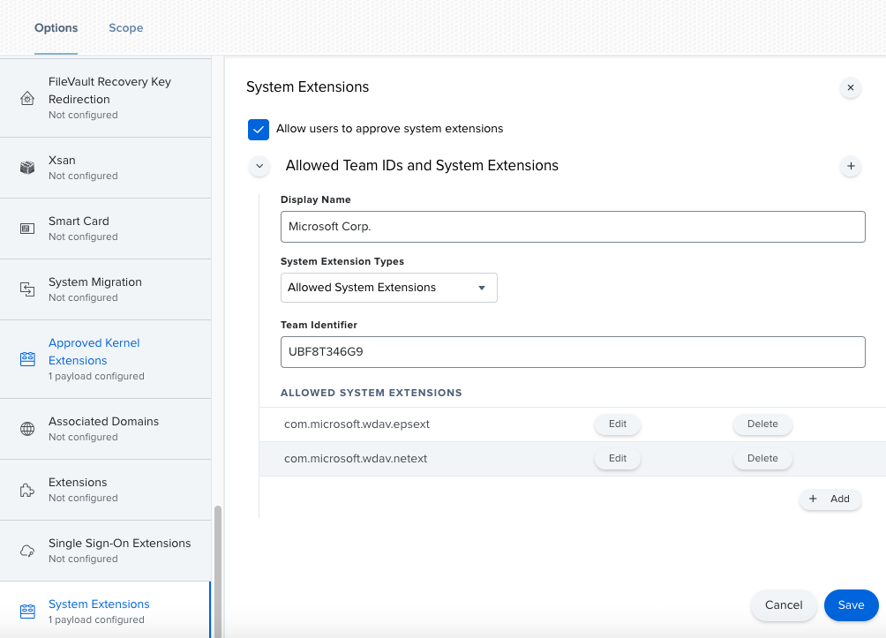

# <a name="new-configuration-profiles-for-macos-catalina-and-newer-versions-of-macos"></a><span data-ttu-id="d80fa-104">Neue Konfigurationsprofile für macOS Catalina und neuere Versionen von macOS</span><span class="sxs-lookup"><span data-stu-id="d80fa-104">New configuration profiles for macOS Catalina and newer versions of macOS</span></span>

[!INCLUDE [Microsoft 365 Defender rebranding](../../includes/microsoft-defender.md)]

<span data-ttu-id="d80fa-105">**Gilt für:**</span><span class="sxs-lookup"><span data-stu-id="d80fa-105">**Applies to:**</span></span>
- [<span data-ttu-id="d80fa-106">Microsoft Defender für Endpunkt</span><span class="sxs-lookup"><span data-stu-id="d80fa-106">Microsoft Defender for Endpoint</span></span>](https://go.microsoft.com/fwlink/p/?linkid=2146631)
- [<span data-ttu-id="d80fa-107">Microsoft 365 Defender</span><span class="sxs-lookup"><span data-stu-id="d80fa-107">Microsoft 365 Defender</span></span>](https://go.microsoft.com/fwlink/?linkid=2118804)

> <span data-ttu-id="d80fa-108">Möchten Sie Microsoft Defender for Endpoint erleben?</span><span class="sxs-lookup"><span data-stu-id="d80fa-108">Want to experience Microsoft Defender for Endpoint?</span></span> [<span data-ttu-id="d80fa-109">Registrieren Sie sich für eine kostenlose Testversion.</span><span class="sxs-lookup"><span data-stu-id="d80fa-109">Sign up for a free trial.</span></span>](https://www.microsoft.com/microsoft-365/windows/microsoft-defender-atp?ocid=docs-wdatp-exposedapis-abovefoldlink)

<span data-ttu-id="d80fa-110">In Übereinstimmung mit der macOS-Weiterentwicklung bereiten wir ein Microsoft Defender for Endpoint für Mac-Update vor, das Systemerweiterungen anstelle von Kernelerweiterungen nutzt.</span><span class="sxs-lookup"><span data-stu-id="d80fa-110">In alignment with macOS evolution, we are preparing a Microsoft Defender for Endpoint for Mac update that leverages system extensions instead of kernel extensions.</span></span> <span data-ttu-id="d80fa-111">Dieses Update gilt nur für macOS Catalina (10.15.4) und neuere Versionen von macOS.</span><span class="sxs-lookup"><span data-stu-id="d80fa-111">This update will only be applicable to macOS Catalina (10.15.4) and newer versions of macOS.</span></span>

<span data-ttu-id="d80fa-112">Wenn Sie Microsoft Defender for Endpoint für Mac in einer verwalteten Umgebung (über JAMF, Intune oder eine andere MDM-Lösung) bereitgestellt haben, müssen Sie neue Konfigurationsprofile bereitstellen.</span><span class="sxs-lookup"><span data-stu-id="d80fa-112">If you have deployed Microsoft Defender for Endpoint for Mac in a managed environment (through JAMF, Intune, or another MDM solution), you must deploy new configuration profiles.</span></span> <span data-ttu-id="d80fa-113">Wenn diese Schritte nicht ausgeführt werden, erhalten Benutzer Genehmigungsaufforderungen zum Ausführen dieser neuen Komponenten.</span><span class="sxs-lookup"><span data-stu-id="d80fa-113">Failure to do these steps will result in users getting approval prompts to run these new components.</span></span>

## <a name="jamf"></a><span data-ttu-id="d80fa-114">JAMF</span><span class="sxs-lookup"><span data-stu-id="d80fa-114">JAMF</span></span>

### <a name="system-extensions-policy"></a><span data-ttu-id="d80fa-115">Systemerweiterungsrichtlinie</span><span class="sxs-lookup"><span data-stu-id="d80fa-115">System Extensions Policy</span></span>

<span data-ttu-id="d80fa-116">Um die Systemerweiterungen zu genehmigen, erstellen Sie die folgende Nutzlast:</span><span class="sxs-lookup"><span data-stu-id="d80fa-116">To approve the system extensions, create the following payload:</span></span>

1. <span data-ttu-id="d80fa-117">Wählen **Sie in > Konfigurationsprofile** Optionen > **Systemerweiterungen aus.**</span><span class="sxs-lookup"><span data-stu-id="d80fa-117">In **Computers > Configuration Profiles** select **Options > System Extensions**.</span></span>
2. <span data-ttu-id="d80fa-118">Wählen **Sie in der** Dropdownliste **Systemerweiterungstypen** zulässige Systemerweiterungen aus.</span><span class="sxs-lookup"><span data-stu-id="d80fa-118">Select **Allowed System Extensions** from the **System Extension Types** drop-down list.</span></span>
3. <span data-ttu-id="d80fa-119">Verwenden **Sie UBF8T346G9** für die Team-ID.</span><span class="sxs-lookup"><span data-stu-id="d80fa-119">Use **UBF8T346G9** for Team Id.</span></span>
4. <span data-ttu-id="d80fa-120">Fügen Sie der Liste zulässige Systemerweiterungen die folgenden **Bündelbezeichner** hinzu:</span><span class="sxs-lookup"><span data-stu-id="d80fa-120">Add the following bundle identifiers to the **Allowed System Extensions** list:</span></span>

    - <span data-ttu-id="d80fa-121">**com.microsoft.wdav.epsext**</span><span class="sxs-lookup"><span data-stu-id="d80fa-121">**com.microsoft.wdav.epsext**</span></span>
    - <span data-ttu-id="d80fa-122">**com.microsoft.wdav.netext**</span><span class="sxs-lookup"><span data-stu-id="d80fa-122">**com.microsoft.wdav.netext**</span></span>

    

### <a name="privacy-preferences-policy-control"></a><span data-ttu-id="d80fa-124">Richtliniensteuerelement für Datenschutzeinstellungen</span><span class="sxs-lookup"><span data-stu-id="d80fa-124">Privacy Preferences Policy Control</span></span>

<span data-ttu-id="d80fa-125">Fügen Sie die folgende JAMF-Nutzlast hinzu, um der Microsoft Defender for Endpoint Endpoint Security Extension vollständigen Festplattenzugriff zu gewähren.</span><span class="sxs-lookup"><span data-stu-id="d80fa-125">Add the following JAMF payload to grant Full Disk Access to the Microsoft Defender for Endpoint Endpoint Security Extension.</span></span> <span data-ttu-id="d80fa-126">Diese Richtlinie ist eine Voraussetzung für die Ausführung der Erweiterung auf Ihrem Gerät.</span><span class="sxs-lookup"><span data-stu-id="d80fa-126">This policy is a pre-requisite for running the extension on your device.</span></span>

1. <span data-ttu-id="d80fa-127">Wählen **Sie Optionen**  >  **Datenschutzeinstellungen Richtliniensteuerelement aus.**</span><span class="sxs-lookup"><span data-stu-id="d80fa-127">Select **Options** > **Privacy Preferences Policy Control**.</span></span>
2. <span data-ttu-id="d80fa-128">Verwenden `com.microsoft.wdav.epsext` Sie als **Bezeichner** und `Bundle ID` als **Bundle-Typ**.</span><span class="sxs-lookup"><span data-stu-id="d80fa-128">Use `com.microsoft.wdav.epsext` as the **Identifier** and `Bundle ID` as **Bundle type**.</span></span>
3. <span data-ttu-id="d80fa-129">Festlegen der Codeanforderung auf `identifier "com.microsoft.wdav.epsext" and anchor apple generic and certificate 1[field.1.2.840.113635.100.6.2.6] /* exists */ and certificate leaf[field.1.2.840.113635.100.6.1.13] /* exists */ and certificate leaf[subject.OU] = UBF8T346G9`</span><span class="sxs-lookup"><span data-stu-id="d80fa-129">Set Code Requirement to `identifier "com.microsoft.wdav.epsext" and anchor apple generic and certificate 1[field.1.2.840.113635.100.6.2.6] /* exists */ and certificate leaf[field.1.2.840.113635.100.6.1.13] /* exists */ and certificate leaf[subject.OU] = UBF8T346G9`</span></span>
4. <span data-ttu-id="d80fa-130">Legen **Sie App oder Dienst auf** **SystemPolicyAllFiles und** Zugriff auf Zulassen **.**</span><span class="sxs-lookup"><span data-stu-id="d80fa-130">Set **App or service** to **SystemPolicyAllFiles** and access to **Allow**.</span></span>

    

### <a name="network-extension-policy"></a><span data-ttu-id="d80fa-132">Netzwerkerweiterungsrichtlinie</span><span class="sxs-lookup"><span data-stu-id="d80fa-132">Network Extension Policy</span></span>

<span data-ttu-id="d80fa-133">Im Rahmen der Endpunkterkennungs- und -reaktionsfunktionen prüft Microsoft Defender for Endpoint für Mac den Socketdatenverkehr und meldet diese Informationen an das Microsoft Defender Security Center-Portal.</span><span class="sxs-lookup"><span data-stu-id="d80fa-133">As part of the Endpoint Detection and Response capabilities, Microsoft Defender for Endpoint for Mac inspects socket traffic and reports this information to the Microsoft Defender Security Center portal.</span></span> <span data-ttu-id="d80fa-134">Mit der folgenden Richtlinie kann die Netzwerkerweiterung diese Funktionalität ausführen.</span><span class="sxs-lookup"><span data-stu-id="d80fa-134">The following policy allows the network extension to perform this functionality.</span></span>

>[!NOTE]
><span data-ttu-id="d80fa-135">JAMF bietet keine integrierte Unterstützung für Inhaltsfilterrichtlinien, die eine Voraussetzung für die Aktivierung der Netzwerkerweiterungen sind, die Microsoft Defender for Endpoint für Mac auf dem Gerät installiert.</span><span class="sxs-lookup"><span data-stu-id="d80fa-135">JAMF doesn’t have built-in support for content filtering policies, which are a pre-requisite for enabling the network extensions that Microsoft Defender for Endpoint for Mac installs on the device.</span></span> <span data-ttu-id="d80fa-136">Darüber hinaus ändert JAMF manchmal den Inhalt der bereitgestellten Richtlinien.</span><span class="sxs-lookup"><span data-stu-id="d80fa-136">Furthermore, JAMF sometimes changes the content of the policies being deployed.</span></span>
><span data-ttu-id="d80fa-137">Daher bieten die folgenden Schritte eine Problemumgehung, bei der das Konfigurationsprofil signiert werden muss.</span><span class="sxs-lookup"><span data-stu-id="d80fa-137">As such, the following steps provide a workaround that involve signing the configuration profile.</span></span>

1. <span data-ttu-id="d80fa-138">Speichern Sie den folgenden Inhalt auf Ihrem Gerät `com.microsoft.network-extension.mobileconfig` mithilfe eines Text-Editors:</span><span class="sxs-lookup"><span data-stu-id="d80fa-138">Save the following content to your device as `com.microsoft.network-extension.mobileconfig` using a text editor:</span></span>

    ```xml
    <?xml version="1.0" encoding="UTF-8"?><!DOCTYPE plist PUBLIC "-//Apple//DTD PLIST 1.0//EN" "http://www.apple.com/DTDs/PropertyList-1.0.dtd">
    <plist version="1">
        <dict>
            <key>PayloadUUID</key>
            <string>DA2CC794-488B-4AFF-89F7-6686A7E7B8AB</string>
            <key>PayloadType</key>
            <string>Configuration</string>
            <key>PayloadOrganization</key>
            <string>Microsoft Corporation</string>
            <key>PayloadIdentifier</key>
            <string>DA2CC794-488B-4AFF-89F7-6686A7E7B8AB</string>
            <key>PayloadDisplayName</key>
            <string>Microsoft Defender ATP Network Extension</string>
            <key>PayloadDescription</key>
            <string/>
            <key>PayloadVersion</key>
            <integer>1</integer>
            <key>PayloadEnabled</key>
            <true/>
            <key>PayloadRemovalDisallowed</key>
            <true/>
            <key>PayloadScope</key>
            <string>System</string>
            <key>PayloadContent</key>
            <array>
                <dict>
                    <key>PayloadUUID</key>
                    <string>2BA070D9-2233-4827-AFC1-1F44C8C8E527</string>
                    <key>PayloadType</key>
                    <string>com.apple.webcontent-filter</string>
                    <key>PayloadOrganization</key>
                    <string>Microsoft Corporation</string>
                    <key>PayloadIdentifier</key>
                    <string>CEBF7A71-D9A1-48BD-8CCF-BD9D18EC155A</string>
                    <key>PayloadDisplayName</key>
                    <string>Approved Network Extension</string>
                    <key>PayloadDescription</key>
                    <string/>
                    <key>PayloadVersion</key>
                    <integer>1</integer>
                    <key>PayloadEnabled</key>
                    <true/>
                    <key>FilterType</key>
                    <string>Plugin</string>
                    <key>UserDefinedName</key>
                    <string>Microsoft Defender ATP Network Extension</string>
                    <key>PluginBundleID</key>
                    <string>com.microsoft.wdav</string>
                    <key>FilterSockets</key>
                    <true/>
                    <key>FilterDataProviderBundleIdentifier</key>
                    <string>com.microsoft.wdav.netext</string>
                    <key>FilterDataProviderDesignatedRequirement</key>
                    <string>identifier "com.microsoft.wdav.netext" and anchor apple generic and certificate 1[field.1.2.840.113635.100.6.2.6] /* exists */ and certificate leaf[field.1.2.840.113635.100.6.1.13] /* exists */ and certificate leaf[subject.OU] = UBF8T346G9</string>
                </dict>
            </array>
        </dict>
    </plist>
    ```

2. <span data-ttu-id="d80fa-139">Stellen Sie sicher, dass die obige Datei ordnungsgemäß kopiert wurde, indem Sie `plutil` das Hilfsprogramm im Terminal ausführen:</span><span class="sxs-lookup"><span data-stu-id="d80fa-139">Verify that the above file was copied correctly by running the `plutil` utility in the Terminal:</span></span>

    ```bash
    $ plutil -lint <PathToFile>/com.microsoft.network-extension.mobileconfig
    ```

    <span data-ttu-id="d80fa-140">Wenn die Datei z. B. in Dokumenten gespeichert wurde:</span><span class="sxs-lookup"><span data-stu-id="d80fa-140">For example, if the file was stored in Documents:</span></span>

    ```bash
    $ plutil -lint ~/Documents/com.microsoft.network-extension.mobileconfig
    ```
    
    <span data-ttu-id="d80fa-141">Stellen Sie sicher, dass der Befehl ausgegeben `OK` wird.</span><span class="sxs-lookup"><span data-stu-id="d80fa-141">Verify that the command outputs `OK`.</span></span>
        
    ```bash
    <PathToFile>/com.microsoft.network-extension.mobileconfig: OK
    ```
    
3. <span data-ttu-id="d80fa-142">Befolgen Sie die Anweisungen [auf dieser Seite,](https://www.jamf.com/jamf-nation/articles/649/creating-a-signing-certificate-using-jamf-pro-s-built-in-certificate-authority) um ein Signaturzertifikat mit der integrierten Zertifizierungsstelle von JAMF zu erstellen.</span><span class="sxs-lookup"><span data-stu-id="d80fa-142">Follow the instructions on [this page](https://www.jamf.com/jamf-nation/articles/649/creating-a-signing-certificate-using-jamf-pro-s-built-in-certificate-authority) to create a signing certificate using JAMF’s built-in certificate authority.</span></span>

4. <span data-ttu-id="d80fa-143">Nachdem das Zertifikat erstellt und auf Ihrem Gerät installiert wurde, führen Sie den folgenden Befehl aus dem Terminal aus, um die Datei zu signieren:</span><span class="sxs-lookup"><span data-stu-id="d80fa-143">After the certificate is created and installed to your device, run the following command from the Terminal to sign the file:</span></span>

    ```bash
    $ security cms -S -N "<CertificateName>" -i <PathToFile>/com.microsoft.network-extension.mobileconfig -o <PathToSignedFile>/com.microsoft.network-extension.signed.mobileconfig
    ```
    
    <span data-ttu-id="d80fa-144">Wenn der Zertifikatname beispielsweise **SigningCertificate** ist und die signierte Datei in Dokumenten gespeichert wird:</span><span class="sxs-lookup"><span data-stu-id="d80fa-144">For example, if the certificate name is **SigningCertificate** and the signed file is going to be stored in Documents:</span></span>
    
    ```bash
    $ security cms -S -N "SigningCertificate" -i ~/Documents/com.microsoft.network-extension.mobileconfig -o ~/Documents/com.microsoft.network-extension.signed.mobileconfig
    ```
    
5. <span data-ttu-id="d80fa-145">Navigieren Sie im JAMF-Portal zu **Konfigurationsprofile,** und klicken Sie auf die **Schaltfläche Hochladen.**</span><span class="sxs-lookup"><span data-stu-id="d80fa-145">From the JAMF portal, navigate to **Configuration Profiles** and click the **Upload** button.</span></span> <span data-ttu-id="d80fa-146">Wählen `com.microsoft.network-extension.signed.mobileconfig` Sie aus, wenn Sie zur Datei aufgefordert werden.</span><span class="sxs-lookup"><span data-stu-id="d80fa-146">Select `com.microsoft.network-extension.signed.mobileconfig` when prompted for the file.</span></span>

## <a name="intune"></a><span data-ttu-id="d80fa-147">Intune</span><span class="sxs-lookup"><span data-stu-id="d80fa-147">Intune</span></span>

### <a name="system-extensions-policy"></a><span data-ttu-id="d80fa-148">Systemerweiterungsrichtlinie</span><span class="sxs-lookup"><span data-stu-id="d80fa-148">System Extensions Policy</span></span>

<span data-ttu-id="d80fa-149">So genehmigen Sie die Systemerweiterungen:</span><span class="sxs-lookup"><span data-stu-id="d80fa-149">To approve the system extensions:</span></span>

1. <span data-ttu-id="d80fa-150">Öffnen Sie in Intune **Die**  >  **Gerätekonfiguration verwalten.**</span><span class="sxs-lookup"><span data-stu-id="d80fa-150">In Intune, open **Manage** > **Device configuration**.</span></span> <span data-ttu-id="d80fa-151">Wählen **Sie Profil** erstellen von  >    >  **Profilen verwalten aus.**</span><span class="sxs-lookup"><span data-stu-id="d80fa-151">Select **Manage** > **Profiles** > **Create Profile**.</span></span>
2. <span data-ttu-id="d80fa-152">Wählen Sie einen Namen für das Profil aus.</span><span class="sxs-lookup"><span data-stu-id="d80fa-152">Choose a name for the profile.</span></span> <span data-ttu-id="d80fa-153">Ändern **Sie Platform=macOS** in **Profile type=Extensions**.</span><span class="sxs-lookup"><span data-stu-id="d80fa-153">Change **Platform=macOS** to **Profile type=Extensions**.</span></span> <span data-ttu-id="d80fa-154">Wählen Sie **Erstellen** aus.</span><span class="sxs-lookup"><span data-stu-id="d80fa-154">Select **Create**.</span></span>
3. <span data-ttu-id="d80fa-155">Geben Sie `Basics` auf der Registerkarte diesem neuen Profil einen Namen.</span><span class="sxs-lookup"><span data-stu-id="d80fa-155">In the `Basics` tab, give a name to this new profile.</span></span>
4. <span data-ttu-id="d80fa-156">Fügen Sie `Configuration settings` auf der Registerkarte die folgenden Einträge im Abschnitt `Allowed system extensions` hinzu:</span><span class="sxs-lookup"><span data-stu-id="d80fa-156">In the `Configuration settings` tab, add the following entries in the `Allowed system extensions` section:</span></span>

    <span data-ttu-id="d80fa-157">Bundle-ID</span><span class="sxs-lookup"><span data-stu-id="d80fa-157">Bundle identifier</span></span>         | <span data-ttu-id="d80fa-158">Team-ID</span><span class="sxs-lookup"><span data-stu-id="d80fa-158">Team identifier</span></span>
    --------------------------|----------------
    <span data-ttu-id="d80fa-159">com.microsoft.wdav.epsext</span><span class="sxs-lookup"><span data-stu-id="d80fa-159">com.microsoft.wdav.epsext</span></span> | <span data-ttu-id="d80fa-160">UBF8T346G9</span><span class="sxs-lookup"><span data-stu-id="d80fa-160">UBF8T346G9</span></span>
    <span data-ttu-id="d80fa-161">com.microsoft.wdav.netext</span><span class="sxs-lookup"><span data-stu-id="d80fa-161">com.microsoft.wdav.netext</span></span> | <span data-ttu-id="d80fa-162">UBF8T346G9</span><span class="sxs-lookup"><span data-stu-id="d80fa-162">UBF8T346G9</span></span>

    

5. <span data-ttu-id="d80fa-164">Weisen Sie `Assignments` auf der Registerkarte dieses Profil allen Benutzern & Allen Geräten **zu.**</span><span class="sxs-lookup"><span data-stu-id="d80fa-164">In the `Assignments` tab, assign this profile to **All Users & All devices**.</span></span>
6. <span data-ttu-id="d80fa-165">Überprüfen und erstellen Sie dieses Konfigurationsprofil.</span><span class="sxs-lookup"><span data-stu-id="d80fa-165">Review and create this configuration profile.</span></span>

### <a name="create-and-deploy-the-custom-configuration-profile"></a><span data-ttu-id="d80fa-166">Erstellen und Bereitstellen des benutzerdefinierten Konfigurationsprofils</span><span class="sxs-lookup"><span data-stu-id="d80fa-166">Create and deploy the Custom Configuration Profile</span></span>

<span data-ttu-id="d80fa-167">Das folgende Konfigurationsprofil aktiviert die Netzwerkerweiterung und gewährt Volldatenträgerzugriff auf die Endpoint Security-Systemerweiterung.</span><span class="sxs-lookup"><span data-stu-id="d80fa-167">The following configuration profile enables the network extension and grants Full Disk Access to the Endpoint Security system extension.</span></span> 

<span data-ttu-id="d80fa-168">Speichern Sie den folgenden Inhalt in einer Datei **namenssysext.xml:**</span><span class="sxs-lookup"><span data-stu-id="d80fa-168">Save the following content to a file named **sysext.xml**:</span></span>

```xml
<?xml version="1.0" encoding="UTF-8"?><!DOCTYPE plist PUBLIC "-//Apple//DTD PLIST 1.0//EN" "http://www.apple.com/DTDs/PropertyList-1.0.dtd">
<plist version="1">
    <dict>
        <key>PayloadUUID</key>
        <string>7E53AC50-B88D-4132-99B6-29F7974EAA3C</string>
        <key>PayloadType</key>
        <string>Configuration</string>
        <key>PayloadOrganization</key>
        <string>Microsoft Corporation</string>
        <key>PayloadIdentifier</key>
        <string>7E53AC50-B88D-4132-99B6-29F7974EAA3C</string>
        <key>PayloadDisplayName</key>
        <string>Microsoft Defender ATP System Extensions</string>
        <key>PayloadDescription</key>
        <string/>
        <key>PayloadVersion</key>
        <integer>1</integer>
        <key>PayloadEnabled</key>
        <true/>
        <key>PayloadRemovalDisallowed</key>
        <true/>
        <key>PayloadScope</key>
        <string>System</string>
        <key>PayloadContent</key>
        <array>
            <dict>
                <key>PayloadUUID</key>
                <string>2BA070D9-2233-4827-AFC1-1F44C8C8E527</string>
                <key>PayloadType</key>
                <string>com.apple.webcontent-filter</string>
                <key>PayloadOrganization</key>
                <string>Microsoft Corporation</string>
                <key>PayloadIdentifier</key>
                <string>CEBF7A71-D9A1-48BD-8CCF-BD9D18EC155A</string>
                <key>PayloadDisplayName</key>
                <string>Approved Network Extension</string>
                <key>PayloadDescription</key>
                <string/>
                <key>PayloadVersion</key>
                <integer>1</integer>
                <key>PayloadEnabled</key>
                <true/>
                <key>FilterType</key>
                <string>Plugin</string>
                <key>UserDefinedName</key>
                <string>Microsoft Defender ATP Network Extension</string>
                <key>PluginBundleID</key>
                <string>com.microsoft.wdav</string>
                <key>FilterSockets</key>
                <true/>
                <key>FilterDataProviderBundleIdentifier</key>
                <string>com.microsoft.wdav.netext</string>
                <key>FilterDataProviderDesignatedRequirement</key>
                <string>identifier &quot;com.microsoft.wdav.netext&quot; and anchor apple generic and certificate 1[field.1.2.840.113635.100.6.2.6] /* exists */ and certificate leaf[field.1.2.840.113635.100.6.1.13] /* exists */ and certificate leaf[subject.OU] = UBF8T346G9</string>
            </dict>
            <dict>
                <key>PayloadUUID</key>
                <string>56105E89-C7C8-4A95-AEE6-E11B8BEA0366</string>
                <key>PayloadType</key>
                <string>com.apple.TCC.configuration-profile-policy</string>
                <key>PayloadOrganization</key>
                <string>Microsoft Corporation</string>
                <key>PayloadIdentifier</key>
                <string>56105E89-C7C8-4A95-AEE6-E11B8BEA0366</string>
                <key>PayloadDisplayName</key>
                <string>Privacy Preferences Policy Control</string>
                <key>PayloadDescription</key>
                <string/>
                <key>PayloadVersion</key>
                <integer>1</integer>
                <key>PayloadEnabled</key>
                <true/>
                <key>Services</key>
                <dict>
                    <key>SystemPolicyAllFiles</key>
                    <array>
                        <dict>
                            <key>Identifier</key>
                            <string>com.microsoft.wdav.epsext</string>
                            <key>CodeRequirement</key>
                            <string>identifier "com.microsoft.wdav.epsext" and anchor apple generic and certificate 1[field.1.2.840.113635.100.6.2.6] /* exists */ and certificate leaf[field.1.2.840.113635.100.6.1.13] /* exists */ and certificate leaf[subject.OU] = UBF8T346G9</string>
                            <key>IdentifierType</key>
                            <string>bundleID</string>
                            <key>StaticCode</key>
                            <integer>0</integer>
                            <key>Allowed</key>
                            <integer>1</integer>
                        </dict>
                    </array>
                </dict>
            </dict>
        </array>
    </dict>
</plist>
```

<span data-ttu-id="d80fa-169">Stellen Sie sicher, dass die obige Datei ordnungsgemäß kopiert wurde.</span><span class="sxs-lookup"><span data-stu-id="d80fa-169">Verify that the above file was copied correctly.</span></span> <span data-ttu-id="d80fa-170">Führen Sie im Terminal den folgenden Befehl aus, und stellen Sie sicher, dass er ausgegeben `OK` wird:</span><span class="sxs-lookup"><span data-stu-id="d80fa-170">From the Terminal, run the following command and verify that it outputs `OK`:</span></span>

```bash
$ plutil -lint sysext.xml
sysext.xml: OK
```

<span data-ttu-id="d80fa-171">So stellen Sie dieses benutzerdefinierte Konfigurationsprofil zur Bereitstellung ein:</span><span class="sxs-lookup"><span data-stu-id="d80fa-171">To deploy this custom configuration profile:</span></span>

1.  <span data-ttu-id="d80fa-172">Öffnen Sie in Intune **Die**  >  **Gerätekonfiguration verwalten.**</span><span class="sxs-lookup"><span data-stu-id="d80fa-172">In Intune, open **Manage** > **Device configuration**.</span></span> <span data-ttu-id="d80fa-173">Wählen **Sie Profil**  >  **erstellen**  >  **aus.**</span><span class="sxs-lookup"><span data-stu-id="d80fa-173">Select **Manage** > **Profiles** > **Create profile**.</span></span>
2. <span data-ttu-id="d80fa-174">Wählen Sie einen Namen für das Profil aus.</span><span class="sxs-lookup"><span data-stu-id="d80fa-174">Choose a name for the profile.</span></span> <span data-ttu-id="d80fa-175">Ändern **von Platform=macOS** und **Profile type=Custom**.</span><span class="sxs-lookup"><span data-stu-id="d80fa-175">Change **Platform=macOS** and **Profile type=Custom**.</span></span> <span data-ttu-id="d80fa-176">Wählen Sie **Konfigurieren** aus.</span><span class="sxs-lookup"><span data-stu-id="d80fa-176">Select **Configure**.</span></span>
3.  <span data-ttu-id="d80fa-177">Öffnen Sie das Konfigurationsprofil, und laden **Siesysext.xml.**</span><span class="sxs-lookup"><span data-stu-id="d80fa-177">Open the configuration profile and upload **sysext.xml**.</span></span> <span data-ttu-id="d80fa-178">Diese Datei wurde im vorherigen Schritt erstellt.</span><span class="sxs-lookup"><span data-stu-id="d80fa-178">This file was created in the preceding step.</span></span>
4.  <span data-ttu-id="d80fa-179">Wählen Sie **OK** aus.</span><span class="sxs-lookup"><span data-stu-id="d80fa-179">Select **OK**.</span></span>

    

5. <span data-ttu-id="d80fa-181">Weisen Sie `Assignments` auf der Registerkarte dieses Profil allen Benutzern & Allen Geräten **zu.**</span><span class="sxs-lookup"><span data-stu-id="d80fa-181">In the `Assignments` tab, assign this profile to **All Users & All devices**.</span></span>
6. <span data-ttu-id="d80fa-182">Überprüfen und erstellen Sie dieses Konfigurationsprofil.</span><span class="sxs-lookup"><span data-stu-id="d80fa-182">Review and create this configuration profile.</span></span>
