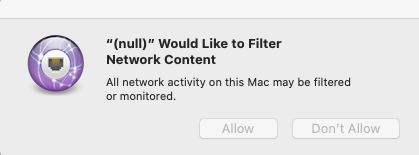

# <a name="microsoft-defender-for-endpoint-on-macos---system-extensions-public-preview"></a>Microsoft Defender for Endpoint unter macOS – öffentliche Vorschau der Systemerweiterungen)

**Gilt für:**
- [Microsoft Defender für Endpunkt](https://go.microsoft.com/fwlink/p/?linkid=2154037)
- [Microsoft 365 Defender](https://go.microsoft.com/fwlink/?linkid=2118804)

> Möchten Sie Microsoft Defender for Endpoint erleben? [Registrieren Sie sich für eine kostenlose Testversion.](https://www.microsoft.com/microsoft-365/windows/microsoft-defender-atp?ocid=docs-wdatp-exposedapis-abovefoldlink)

In Übereinstimmung mit der macOS-Weiterentwicklung bereiten wir ein Defender for Endpoint für Mac-Update vor, das Systemerweiterungen anstelle von Kernelerweiterungen nutzt. Dieses Update gilt nur für macOS Catalina (10.15.4) und spätere Versionen von macOS.

Diese Funktionalität befindet sich derzeit in der öffentlichen Vorschau. In diesem Artikel wird beschrieben, wie Diese Funktionalität auf Ihrem Gerät aktiviert wird. Sie können dieses Feature lokal auf Ihrem eigenen Gerät ausprobieren oder remote über ein Verwaltungstool konfigurieren.

Bei diesen Schritten wird davon ausgegangen, dass Defender for Endpoint bereits auf Ihrem Gerät ausgeführt wird. Weitere Informationen finden Sie auf [dieser Seite](microsoft-defender-endpoint-mac.md).

## <a name="known-issues"></a>Bekannte Probleme

- Wir haben Berichte über die Netzwerkerweiterung erhalten, die die Apple SSO Kerberos-Erweiterung stört.
- Die aktuelle Version des Produkts installiert weiterhin eine Kernelerweiterung. Die Kernelerweiterung wird nur als Ausweichmechanismus verwendet und wird entfernt, bevor dieses Feature die öffentliche Vorschau erreicht.
- Wir arbeiten noch an einer Produktversion, die unter macOS 11 Big Sur ordnungsgemäß bereitgestellt und funktioniert.

## <a name="deployment-prerequisites"></a>Voraussetzungen für die Bereitstellung

- Mindestversion des macOS-Betriebssystems: **10.15.4**
- Minimale Produktversion: **101.03.73**
- Ihr Gerät muss sich im **Insider Fast Update-Kanal .** Sie können den Updatekanal mithilfe des folgenden Befehls überprüfen:

  ```bash
  mdatp health --field release_ring
  ```

  Wenn sich Ihr Gerät noch nicht im Insider Fast Update-Kanal befindet, führen Sie den folgenden Befehl über das Terminal aus. Das Kanalupdate wird wirksam, wenn das Produkt das nächste Mal gestartet wird (wenn das nächste Produktupdate installiert ist oder das Gerät neu gestartet wird).

  ```bash
  defaults write com.microsoft.autoupdate2 ChannelName -string Beta
  ```

  Alternativ können Sie den Updatekanal remote konfigurieren, wenn Sie in einer verwalteten Umgebung (JAMF oder Intune) sind. Weitere Informationen finden Sie unter [Deploy updates for Microsoft Defender ATP for Mac: Set the channel name](mac-updates.md#set-the-channel-name).

## <a name="deployment-steps"></a>Bereitstellungsschritte

Führen Sie die Bereitstellungsschritte aus, die Ihrer Umgebung und Ihrer bevorzugten Methode zum Ausprobieren dieses Features entsprechen.

### <a name="manual-deployment"></a>Manuelle Bereitstellung

#### <a name="approve-the-system-extensions-and-enable-the-network-extension"></a>Genehmigen der Systemerweiterungen und Aktivieren der Netzwerkerweiterung

1. Nachdem alle Voraussetzungen für die Bereitstellung erfüllt sind, starten Sie Ihr Gerät neu, um den Genehmigungs- und Aktivierungsprozess der Systemerweiterung zu starten.

   Es wird eine Reihe von Systemaufforderungen zum Genehmigen der Defender for Endpoint-Systemerweiterungen angezeigt. Sie müssen alle **Aufforderungen** aus der Reihe genehmigen, da macOS eine explizite Genehmigung für jede Erweiterung erfordert, die Defender for Endpoint für Mac auf dem Gerät installiert.
   
   Wählen Sie für jede Genehmigung **die Option Sicherheitseinstellungen** öffnen aus, und wählen Sie dann **Zulassen** aus, um die Ausführung der Systemerweiterung zu ermöglichen.

   > [!IMPORTANT]
   > Sie müssen das Fenster **"Systemeinstellungen** Sicherheit & zwischen  >  **nachfolgenden** Genehmigungen schließen und erneut öffnen. Andernfalls wird in macOS die nächste Genehmigung nicht angezeigt.

   > [!IMPORTANT]
   > Es gibt ein Timeout von einer Minute, bevor das Produkt auf die Kernelerweiterung zurückfällt. Dadurch wird sichergestellt, dass das Gerät geschützt ist.
   >
   > Wenn mehr als eine Minute verstrichen ist, starten Sie den Daemon neu, indem Sie das Gerät neu starten oder den Genehmigungsfluss erneut `sudo killall -9 wdavdaemon` auslösen.

   

   

1. Nachdem die Systemerweiterungen genehmigt wurden, fordert macOS eine Genehmigung zur Filterung des Netzwerkdatenverkehrs auf. Klicken Sie **auf Zulassen**.

   

#### <a name="grant-full-disk-access-to-the-endpoint-security-system-extension"></a>Gewähren des vollständigen Datenträgerzugriffs auf die Endpoint Security-Systemerweiterung

Öffnen Sie **die Registerkarte Systemeinstellungen**  >  **Sicherheit & Datenschutzregisterkarte,** und gewähren Sie  >   **den** vollständigen Datenträgerzugriff auf die **Microsoft Defender Endpoint Security Extension**.


#### <a name="reboot-your-device"></a>Starten Sie Ihr Gerät neu

Damit die Änderungen wirksam werden, müssen Sie Ihr Gerät neu starten.

#### <a name="verify-that-the-system-extensions-are-running"></a>Überprüfen, ob die Systemerweiterungen ausgeführt werden

Führen Sie im Terminal den folgenden Befehl aus:

```bash
mdatp health --field real_time_protection_subsystem
```

Die `endpoint_security_extension` Terminalausgabe gibt an, dass das Produkt die Systemerweiterungsfunktionalität verwendet.

### <a name="managed-deployment"></a>Verwaltete Bereitstellung

Informationen zu den neuen Konfigurationsprofilen, die Sie für dieses neue Feature bereitstellen müssen, finden Sie unter Neue Konfigurationsprofile für macOS Catalina und neuere Versionen von [macOS: JAMF.](mac-sysext-policies.md#jamf)

Stellen Sie zusätzlich zu diesen Profilen sicher, dass sich die Zielgeräte im Insider Fast Update-Kanal enthalten, wie unter [Bereitstellungsvoraussetzungen beschrieben.](#deployment-prerequisites)

Führen Sie auf einem Gerät, auf dem alle Voraussetzungen erfüllt sind und die neuen Konfigurationsprofile bereitgestellt wurden, den folgenden Befehl aus:

```bash
$ mdatp health --field real_time_protection_subsystem
```

Wenn dieser Befehl gedruckt `endpoint_security_extension` wird, verwendet das Produkt die Systemerweiterungsfunktionalität.

## <a name="validate-basic-scenarios"></a>Überprüfen grundlegender Szenarien

1. Testen sie die Erkennung des Europäischen Institute for Computer Antivirus Research (EICAR). Führen Sie in einem Terminalfenster den folgenden Befehl aus:

   ```bash
   curl -o eicar.txt https://secure.eicar.org/eicar.com.txt
   ```

   Stellen Sie sicher, dass die EICAR-Datei isoliert ist. Sie können den Status der Datei auf der Seite Schutzverlauf auf der Benutzeroberfläche oder über eine Befehlszeile mithilfe des folgenden Befehls überprüfen:

    ```bash
    mdatp threat list
    ```

2. Testen Sie das EDR-SZENARIO (Endpoint Detection and Response). Führen Sie in einem Terminalfenster den folgenden Befehl aus:

   ```bash
   curl -o "MDATP MacOS DIY.zip" https://aka.ms/mdatpmacosdiy
   ```

   Überprüfen Sie, ob zwei Warnungen im Portal auf der Computerseite für EICAR- und EDR-HEIMWERKER-Szenarien aufgetaucht sind.

## <a name="frequently-asked-questions"></a>Häufig gestellte Fragen

- F: Warum wird ich immer noch beim `kernel_extension` Ausführen `mdatp health --field real_time_protection_subsystem` gesehen?

    A: Verweisen Sie auf den Abschnitt [Bereitstellungsvoraussetzungen,](#deployment-prerequisites) und überprüfen Sie, ob alle Voraussetzungen erfüllt sind. Wenn alle Voraussetzungen erfüllt sind, starten Sie Ihr Gerät neu, und überprüfen Sie es erneut.

- F: Wann wird macOS 11 Big Sur unterstützt?

    A: Wir arbeiten aktiv an der Unterstützung für macOS 11. Weitere Informationen werden auf der Seite [Neues veröffentlicht.](mac-whatsnew.md)
