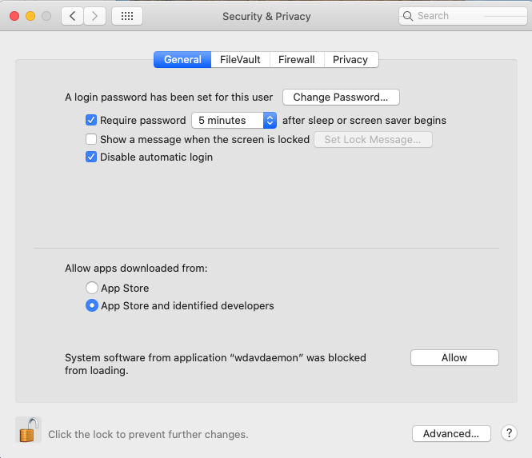

# <a name="microsoft-defender-for-endpoint-on-macos---system-extensions-public-preview"></a><span data-ttu-id="42cec-105">Microsoft Defender for Endpoint unter macOS – öffentliche Vorschau der Systemerweiterungen)</span><span class="sxs-lookup"><span data-stu-id="42cec-105">Microsoft Defender for Endpoint on macOS - system extensions public preview)</span></span>

<span data-ttu-id="42cec-106">**Gilt für:**</span><span class="sxs-lookup"><span data-stu-id="42cec-106">**Applies to:**</span></span>
- [<span data-ttu-id="42cec-107">Microsoft Defender für Endpunkt</span><span class="sxs-lookup"><span data-stu-id="42cec-107">Microsoft Defender for Endpoint</span></span>](https://go.microsoft.com/fwlink/p/?linkid=2154037)
- [<span data-ttu-id="42cec-108">Microsoft 365 Defender</span><span class="sxs-lookup"><span data-stu-id="42cec-108">Microsoft 365 Defender</span></span>](https://go.microsoft.com/fwlink/?linkid=2118804)

> <span data-ttu-id="42cec-109">Möchten Sie Microsoft Defender for Endpoint erleben?</span><span class="sxs-lookup"><span data-stu-id="42cec-109">Want to experience Microsoft Defender for Endpoint?</span></span> [<span data-ttu-id="42cec-110">Registrieren Sie sich für eine kostenlose Testversion.</span><span class="sxs-lookup"><span data-stu-id="42cec-110">Sign up for a free trial.</span></span>](https://www.microsoft.com/microsoft-365/windows/microsoft-defender-atp?ocid=docs-wdatp-exposedapis-abovefoldlink)

<span data-ttu-id="42cec-111">In Übereinstimmung mit der macOS-Weiterentwicklung bereiten wir ein Defender for Endpoint on Mac-Update vor, das Systemerweiterungen anstelle von Kernelerweiterungen nutzt.</span><span class="sxs-lookup"><span data-stu-id="42cec-111">In alignment with macOS evolution, we are preparing a Defender for Endpoint on Mac update that leverages system extensions instead of kernel extensions.</span></span> <span data-ttu-id="42cec-112">Dieses Update gilt nur für macOS Catalina (10.15.4) und spätere Versionen von macOS.</span><span class="sxs-lookup"><span data-stu-id="42cec-112">This update will only apply to macOS Catalina (10.15.4) and later versions of macOS.</span></span>

<span data-ttu-id="42cec-113">Diese Funktionalität befindet sich derzeit in der öffentlichen Vorschau.</span><span class="sxs-lookup"><span data-stu-id="42cec-113">This functionality is currently in public preview.</span></span> <span data-ttu-id="42cec-114">In diesem Artikel wird beschrieben, wie Diese Funktionalität auf Ihrem Gerät aktiviert wird.</span><span class="sxs-lookup"><span data-stu-id="42cec-114">This article describes how to enable this functionality on your device.</span></span> <span data-ttu-id="42cec-115">Sie können dieses Feature lokal auf Ihrem eigenen Gerät ausprobieren oder remote über ein Verwaltungstool konfigurieren.</span><span class="sxs-lookup"><span data-stu-id="42cec-115">You can try out this feature locally on your own device or configure it remotely through a management tool.</span></span>

<span data-ttu-id="42cec-116">Bei diesen Schritten wird davon ausgegangen, dass Defender for Endpoint bereits auf Ihrem Gerät ausgeführt wird.</span><span class="sxs-lookup"><span data-stu-id="42cec-116">These steps assume you already have Defender for Endpoint running on your device.</span></span> <span data-ttu-id="42cec-117">Weitere Informationen finden Sie auf [dieser Seite](microsoft-defender-endpoint-mac.md).</span><span class="sxs-lookup"><span data-stu-id="42cec-117">For more information, see [this page](microsoft-defender-endpoint-mac.md).</span></span>

## <a name="known-issues"></a><span data-ttu-id="42cec-118">Bekannte Probleme</span><span class="sxs-lookup"><span data-stu-id="42cec-118">Known issues</span></span>

- <span data-ttu-id="42cec-119">Wir haben Berichte über die Netzwerkerweiterung erhalten, die die Apple SSO Kerberos-Erweiterung stört.</span><span class="sxs-lookup"><span data-stu-id="42cec-119">We’ve received reports of the network extension interfering with the Apple SSO Kerberos extension.</span></span>
- <span data-ttu-id="42cec-120">Die aktuelle Version des Produkts installiert weiterhin eine Kernelerweiterung.</span><span class="sxs-lookup"><span data-stu-id="42cec-120">The current version of the product still installs a kernel extension.</span></span> <span data-ttu-id="42cec-121">Die Kernelerweiterung wird nur als Ausweichmechanismus verwendet und wird entfernt, bevor dieses Feature die öffentliche Vorschau erreicht.</span><span class="sxs-lookup"><span data-stu-id="42cec-121">The kernel extension is only used as a fallback mechanism and will be removed before this feature reaches public preview.</span></span>
- <span data-ttu-id="42cec-122">Wir arbeiten noch an einer Produktversion, die unter macOS 11 Big Sur ordnungsgemäß bereitgestellt und funktioniert.</span><span class="sxs-lookup"><span data-stu-id="42cec-122">We're still working on a product version that deploys and functions properly on macOS 11 Big Sur.</span></span>

## <a name="deployment-prerequisites"></a><span data-ttu-id="42cec-123">Voraussetzungen für die Bereitstellung</span><span class="sxs-lookup"><span data-stu-id="42cec-123">Deployment prerequisites</span></span>

- <span data-ttu-id="42cec-124">Mindestversion des macOS-Betriebssystems: **10.15.4**</span><span class="sxs-lookup"><span data-stu-id="42cec-124">Minimum macOS operating system version: **10.15.4**</span></span>
- <span data-ttu-id="42cec-125">Minimale Produktversion: **101.03.73**</span><span class="sxs-lookup"><span data-stu-id="42cec-125">Minimum product version: **101.03.73**</span></span>
- <span data-ttu-id="42cec-126">Ihr Gerät muss sich im **Insider Fast Update-Kanal .**</span><span class="sxs-lookup"><span data-stu-id="42cec-126">Your device must be in the **Insider Fast update channel**.</span></span> <span data-ttu-id="42cec-127">Sie können den Updatekanal mithilfe des folgenden Befehls überprüfen:</span><span class="sxs-lookup"><span data-stu-id="42cec-127">You can check the update channel by using the following command:</span></span>

  ```bash
  mdatp health --field release_ring
  ```

  <span data-ttu-id="42cec-128">Wenn sich Ihr Gerät noch nicht im Insider Fast Update-Kanal befindet, führen Sie den folgenden Befehl über das Terminal aus.</span><span class="sxs-lookup"><span data-stu-id="42cec-128">If your device isn't already in the Insider Fast update channel, execute the following command from the Terminal.</span></span> <span data-ttu-id="42cec-129">Das Kanalupdate wird wirksam, wenn das Produkt das nächste Mal gestartet wird (wenn das nächste Produktupdate installiert ist oder das Gerät neu gestartet wird).</span><span class="sxs-lookup"><span data-stu-id="42cec-129">The channel update takes effect the next time the product starts (when the next product update is installed, or when the device is rebooted).</span></span>

  ```bash
  defaults write com.microsoft.autoupdate2 ChannelName -string Beta
  ```

  <span data-ttu-id="42cec-130">Alternativ können Sie den Updatekanal remote konfigurieren, wenn Sie in einer verwalteten Umgebung (JAMF oder Intune) sind.</span><span class="sxs-lookup"><span data-stu-id="42cec-130">Alternatively, if you're in a managed environment (JAMF or Intune), you can configure the update channel remotely.</span></span> <span data-ttu-id="42cec-131">Weitere Informationen finden Sie unter [Deploy updates for Microsoft Defender for Endpoint on Mac: Set the channel name](mac-updates.md#set-the-channel-name).</span><span class="sxs-lookup"><span data-stu-id="42cec-131">For more information, see [Deploy updates for Microsoft Defender for Endpoint on Mac: Set the channel name](mac-updates.md#set-the-channel-name).</span></span>

## <a name="deployment-steps"></a><span data-ttu-id="42cec-132">Bereitstellungsschritte</span><span class="sxs-lookup"><span data-stu-id="42cec-132">Deployment steps</span></span>

<span data-ttu-id="42cec-133">Führen Sie die Bereitstellungsschritte aus, die Ihrer Umgebung und Ihrer bevorzugten Methode zum Ausprobieren dieses Features entsprechen.</span><span class="sxs-lookup"><span data-stu-id="42cec-133">Follow the deployment steps that correspond to your environment and your preferred method of trying out this feature.</span></span>

### <a name="manual-deployment"></a><span data-ttu-id="42cec-134">Manuelle Bereitstellung</span><span class="sxs-lookup"><span data-stu-id="42cec-134">Manual deployment</span></span>

#### <a name="approve-the-system-extensions-and-enable-the-network-extension"></a><span data-ttu-id="42cec-135">Genehmigen der Systemerweiterungen und Aktivieren der Netzwerkerweiterung</span><span class="sxs-lookup"><span data-stu-id="42cec-135">Approve the system extensions and enable the network extension</span></span>

1. <span data-ttu-id="42cec-136">Nachdem alle Voraussetzungen für die Bereitstellung erfüllt sind, starten Sie Ihr Gerät neu, um den Genehmigungs- und Aktivierungsprozess der Systemerweiterung zu starten.</span><span class="sxs-lookup"><span data-stu-id="42cec-136">After all deployment prerequisites are met, restart your device to launch the system extension approval and activation process.</span></span>

   <span data-ttu-id="42cec-137">Es wird eine Reihe von Systemaufforderungen zum Genehmigen der Defender for Endpoint-Systemerweiterungen angezeigt.</span><span class="sxs-lookup"><span data-stu-id="42cec-137">You'll see a series of system prompts to approve the Defender for Endpoint system extensions.</span></span> <span data-ttu-id="42cec-138">Sie müssen alle **Aufforderungen** aus der Reihe genehmigen, da macOS eine explizite Genehmigung für jede Erweiterung erfordert, die Defender for Endpoint auf Dem Mac auf dem Gerät installiert.</span><span class="sxs-lookup"><span data-stu-id="42cec-138">You must approve **all** prompts from the series, because macOS requires an explicit approval for each extension that Defender for Endpoint on Mac installs on the device.</span></span>
   
   <span data-ttu-id="42cec-139">Wählen Sie für jede Genehmigung **die Option Sicherheitseinstellungen** öffnen aus, und wählen Sie dann **Zulassen** aus, um die Ausführung der Systemerweiterung zu ermöglichen.</span><span class="sxs-lookup"><span data-stu-id="42cec-139">For each approval, select **Open Security Preferences** and then select **Allow** to allow the system extension to run.</span></span>

   > [!IMPORTANT]
   > <span data-ttu-id="42cec-140">Sie müssen das Fenster **"Systemeinstellungen** Sicherheit & zwischen  >  **nachfolgenden** Genehmigungen schließen und erneut öffnen.</span><span class="sxs-lookup"><span data-stu-id="42cec-140">You must close and reopen the **System Preferences** > **Security & Privacy** window between subsequent approvals.</span></span> <span data-ttu-id="42cec-141">Andernfalls wird in macOS die nächste Genehmigung nicht angezeigt.</span><span class="sxs-lookup"><span data-stu-id="42cec-141">Otherwise, macOS will not display the next approval.</span></span>

   > [!IMPORTANT]
   > <span data-ttu-id="42cec-142">Es gibt ein Timeout von einer Minute, bevor das Produkt auf die Kernelerweiterung zurückfällt.</span><span class="sxs-lookup"><span data-stu-id="42cec-142">There is a one-minute timeout before the product falls back to the kernel extension.</span></span> <span data-ttu-id="42cec-143">Dadurch wird sichergestellt, dass das Gerät geschützt ist.</span><span class="sxs-lookup"><span data-stu-id="42cec-143">This ensures that the device is protected.</span></span>
   >
   > <span data-ttu-id="42cec-144">Wenn mehr als eine Minute verstrichen ist, starten Sie den Daemon neu, indem Sie das Gerät neu starten oder den Genehmigungsfluss erneut `sudo killall -9 wdavdaemon` auslösen.</span><span class="sxs-lookup"><span data-stu-id="42cec-144">If more than one minute elapses, restart the daemon by rebooting the device or by using `sudo killall -9 wdavdaemon` to trigger the approval flow again.</span></span>

   

   

1. <span data-ttu-id="42cec-147">Nachdem die Systemerweiterungen genehmigt wurden, fordert macOS eine Genehmigung zur Filterung des Netzwerkdatenverkehrs auf.</span><span class="sxs-lookup"><span data-stu-id="42cec-147">After the system extensions are approved, macOS prompts for an approval to allow network traffic to be filtered.</span></span> <span data-ttu-id="42cec-148">Klicken Sie **auf Zulassen**.</span><span class="sxs-lookup"><span data-stu-id="42cec-148">Click **Allow**.</span></span>

   

#### <a name="grant-full-disk-access-to-the-endpoint-security-system-extension"></a><span data-ttu-id="42cec-150">Gewähren des vollständigen Datenträgerzugriffs auf die Endpoint Security-Systemerweiterung</span><span class="sxs-lookup"><span data-stu-id="42cec-150">Grant Full Disk Access to the Endpoint Security system extension</span></span>

<span data-ttu-id="42cec-151">Öffnen Sie **die Registerkarte Systemeinstellungen**  >  **Sicherheit & Datenschutzregisterkarte,** und gewähren Sie  >   **den** vollständigen Datenträgerzugriff auf die **Microsoft Defender Endpoint Security Extension**.</span><span class="sxs-lookup"><span data-stu-id="42cec-151">Open the **System Preferences** > **Security & Privacy** > **Privacy** tab and grant **Full Disk Access** to the **Microsoft Defender Endpoint Security Extension**.</span></span>


#### <a name="reboot-your-device"></a><span data-ttu-id="42cec-153">Starten Sie Ihr Gerät neu</span><span class="sxs-lookup"><span data-stu-id="42cec-153">Reboot your device</span></span>

<span data-ttu-id="42cec-154">Damit die Änderungen wirksam werden, müssen Sie Ihr Gerät neu starten.</span><span class="sxs-lookup"><span data-stu-id="42cec-154">In order for the changes to take effect, you must reboot your device.</span></span>

#### <a name="verify-that-the-system-extensions-are-running"></a><span data-ttu-id="42cec-155">Überprüfen, ob die Systemerweiterungen ausgeführt werden</span><span class="sxs-lookup"><span data-stu-id="42cec-155">Verify that the system extensions are running</span></span>

<span data-ttu-id="42cec-156">Führen Sie im Terminal den folgenden Befehl aus:</span><span class="sxs-lookup"><span data-stu-id="42cec-156">From the Terminal, run the following command:</span></span>

```bash
mdatp health --field real_time_protection_subsystem
```

<span data-ttu-id="42cec-157">Die `endpoint_security_extension` Terminalausgabe gibt an, dass das Produkt die Systemerweiterungsfunktionalität verwendet.</span><span class="sxs-lookup"><span data-stu-id="42cec-157">Terminal output `endpoint_security_extension` indicates the product is using the system extensions functionality.</span></span>

### <a name="managed-deployment"></a><span data-ttu-id="42cec-158">Verwaltete Bereitstellung</span><span class="sxs-lookup"><span data-stu-id="42cec-158">Managed deployment</span></span>

<span data-ttu-id="42cec-159">Informationen zu den neuen Konfigurationsprofilen, die Sie für dieses neue Feature bereitstellen müssen, finden Sie unter Neue Konfigurationsprofile für macOS Catalina und neuere Versionen von [macOS: JAMF.](mac-sysext-policies.md#jamf)</span><span class="sxs-lookup"><span data-stu-id="42cec-159">Refer to [New configuration profiles for macOS Catalina and newer versions of macOS: JAMF](mac-sysext-policies.md#jamf) for the new configuration profiles you must deploy for this new feature.</span></span>

<span data-ttu-id="42cec-160">Stellen Sie zusätzlich zu diesen Profilen sicher, dass sich die Zielgeräte im Insider Fast Update-Kanal enthalten, wie unter [Bereitstellungsvoraussetzungen beschrieben.](#deployment-prerequisites)</span><span class="sxs-lookup"><span data-stu-id="42cec-160">In addition to those profiles, make sure to configure the target devices to be in the Insider Fast update channel, as described in [Deployment prerequisites](#deployment-prerequisites).</span></span>

<span data-ttu-id="42cec-161">Führen Sie auf einem Gerät, auf dem alle Voraussetzungen erfüllt sind und die neuen Konfigurationsprofile bereitgestellt wurden, den folgenden Befehl aus:</span><span class="sxs-lookup"><span data-stu-id="42cec-161">On a device where all prerequisites are met and the new configuration profiles have been deployed, run the following command:</span></span>

```bash
$ mdatp health --field real_time_protection_subsystem
```

<span data-ttu-id="42cec-162">Wenn dieser Befehl gedruckt `endpoint_security_extension` wird, verwendet das Produkt die Systemerweiterungsfunktionalität.</span><span class="sxs-lookup"><span data-stu-id="42cec-162">If this command prints `endpoint_security_extension`, the product is using the system extensions functionality.</span></span>

## <a name="validate-basic-scenarios"></a><span data-ttu-id="42cec-163">Überprüfen grundlegender Szenarien</span><span class="sxs-lookup"><span data-stu-id="42cec-163">Validate basic scenarios</span></span>

1. <span data-ttu-id="42cec-164">Testen sie die Erkennung des Europäischen Institute for Computer Antivirus Research (EICAR).</span><span class="sxs-lookup"><span data-stu-id="42cec-164">Test European Institute for Computer Antivirus Research (EICAR) detection.</span></span> <span data-ttu-id="42cec-165">Führen Sie in einem Terminalfenster den folgenden Befehl aus:</span><span class="sxs-lookup"><span data-stu-id="42cec-165">From a Terminal window, run the following command:</span></span>

   ```bash
   curl -o eicar.txt https://secure.eicar.org/eicar.com.txt
   ```

   <span data-ttu-id="42cec-166">Stellen Sie sicher, dass die EICAR-Datei isoliert ist.</span><span class="sxs-lookup"><span data-stu-id="42cec-166">Verify that the EICAR file is quarantined.</span></span> <span data-ttu-id="42cec-167">Sie können den Status der Datei auf der Seite Schutzverlauf auf der Benutzeroberfläche oder über eine Befehlszeile mithilfe des folgenden Befehls überprüfen:</span><span class="sxs-lookup"><span data-stu-id="42cec-167">You can verify the file's status on the Protection History page in the user interface, or from a command line by using the following command:</span></span>

    ```bash
    mdatp threat list
    ```

2. <span data-ttu-id="42cec-168">Testen Sie das EDR-SZENARIO (Endpoint Detection and Response).</span><span class="sxs-lookup"><span data-stu-id="42cec-168">Test the Endpoint Detection and Response (EDR) DIY scenario.</span></span> <span data-ttu-id="42cec-169">Führen Sie in einem Terminalfenster den folgenden Befehl aus:</span><span class="sxs-lookup"><span data-stu-id="42cec-169">From a terminal window, run the following command:</span></span>

   ```bash
   curl -o "MDATP MacOS DIY.zip" https://aka.ms/mdatpmacosdiy
   ```

   <span data-ttu-id="42cec-170">Überprüfen Sie, ob zwei Warnungen im Portal auf der Computerseite für EICAR- und EDR-HEIMWERKER-Szenarien aufgetaucht sind.</span><span class="sxs-lookup"><span data-stu-id="42cec-170">Validate that two alerts popped up in the portal on the machine page for EICAR and EDR DIY scenarios.</span></span>

## <a name="frequently-asked-questions"></a><span data-ttu-id="42cec-171">Häufig gestellte Fragen</span><span class="sxs-lookup"><span data-stu-id="42cec-171">Frequently asked questions</span></span>

- <span data-ttu-id="42cec-172">F: Warum wird ich immer noch beim `kernel_extension` Ausführen `mdatp health --field real_time_protection_subsystem` gesehen?</span><span class="sxs-lookup"><span data-stu-id="42cec-172">Q: Why am I still seeing `kernel_extension` when I run `mdatp health --field real_time_protection_subsystem`?</span></span>

    <span data-ttu-id="42cec-173">A: Verweisen Sie auf den Abschnitt [Bereitstellungsvoraussetzungen,](#deployment-prerequisites) und überprüfen Sie, ob alle Voraussetzungen erfüllt sind.</span><span class="sxs-lookup"><span data-stu-id="42cec-173">A: Refer back to the [Deployment prerequisites](#deployment-prerequisites) section and double-check that all prerequisites are met.</span></span> <span data-ttu-id="42cec-174">Wenn alle Voraussetzungen erfüllt sind, starten Sie Ihr Gerät neu, und überprüfen Sie es erneut.</span><span class="sxs-lookup"><span data-stu-id="42cec-174">If all prerequisites are met, restart your device and check again.</span></span>

- <span data-ttu-id="42cec-175">F: Wann wird macOS 11 Big Sur unterstützt?</span><span class="sxs-lookup"><span data-stu-id="42cec-175">Q: When will macOS 11 Big Sur be supported?</span></span>

    <span data-ttu-id="42cec-176">A: Wir arbeiten aktiv an der Unterstützung für macOS 11.</span><span class="sxs-lookup"><span data-stu-id="42cec-176">A: We are actively working on adding support for macOS 11.</span></span> <span data-ttu-id="42cec-177">Weitere Informationen werden auf der Seite [Neues veröffentlicht.](mac-whatsnew.md)</span><span class="sxs-lookup"><span data-stu-id="42cec-177">We will post more information to the [What's new](mac-whatsnew.md) page.</span></span>
