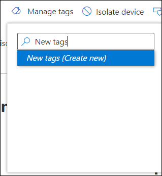

# Erstellen und Verwalten von GerätetagsCreate and manage device tags

[!INCLUDE [Microsoft 365 Defender rebranding](../../includes/microsoft-defender.md)]

**Gilt für:****Applies to:**
- [Microsoft Defender für EndpunktMicrosoft Defender for Endpoint](https://go.microsoft.com/fwlink/p/?linkid=2154037)
- [Microsoft 365 DefenderMicrosoft 365 Defender](https://go.microsoft.com/fwlink/?linkid=2118804)

> Möchten Sie Microsoft Defender for Endpoint erleben?Want to experience Microsoft Defender for Endpoint? [Registrieren Sie sich für eine kostenlose Testversion.Sign up for a free trial.](https://www.microsoft.com/microsoft-365/windows/microsoft-defender-atp?ocid=docs-wdatp-exposedapis-abovefoldlink)

Fügen Sie Tags auf Geräten hinzu, um eine logische Gruppenmitgliedschaft zu erstellen.Add tags on devices to create a logical group affiliation. Gerätetags unterstützen die ordnungsgemäße Zuordnung des Netzwerks, sodass Sie verschiedene Tags anfügen können, um Kontext zu erfassen und dynamische Listenerstellung als Teil eines Vorfalls zu ermöglichen.Device tags support proper mapping of the network, enabling you to attach different tags to capture context and to enable dynamic list creation as part of an incident. Tags können als Filter **in** der Gerätelistenansicht oder zum Gruppieren von Geräten verwendet werden.Tags can be used as a filter in **Devices list** view, or to group devices. Weitere Informationen zur Gerätegruppe finden Sie unter [Create and manage device groups](machine-groups.md).For more information on device grouping, see [Create and manage device groups](machine-groups.md).

Sie können Tags auf Geräten mithilfe der folgenden Methoden hinzufügen:You can add tags on devices using the following ways:

- Verwenden des PortalsUsing the portal
- Festlegen eines RegistrierungsschlüsselwertsSetting a registry key value

> [!NOTE]
> Zwischen dem Hinzufügen eines Tags zu einem Gerät und seiner Verfügbarkeit in der Geräteliste und Geräteseite kann eine gewisse Latenz auftreten.There may be some latency between the time a tag is added to a device and its availability in the devices list and device page.  

Informationen zum Hinzufügen von Gerätetags mithilfe der API finden Sie unter [Add or remove device tags API](add-or-remove-machine-tags.md).To add device tags using API, see [Add or remove device tags API](add-or-remove-machine-tags.md).

## Hinzufügen und Verwalten von Gerätetags mithilfe des PortalsAdd and manage device tags using the portal

1. Wählen Sie das Gerät aus, auf dem Sie Tags verwalten möchten.Select the device that you want to manage tags on. Sie können ein Gerät aus einer der folgenden Ansichten auswählen oder suchen:You can select or search for a device from any of the following views:

   - **Dashboard für Sicherheitsvorgänge:** Wählen Sie den Gerätenamen im Abschnitt Top devices with active alerts aus.**Security operations dashboard** - Select the device name from the Top devices with active alerts section.
   - **Warnungswarteschlange** : Wählen Sie den Gerätenamen neben dem Gerätesymbol aus der Benachrichtigungswarteschlange aus.**Alerts queue** - Select the device name beside the device icon from the alerts queue.
   - **Geräteliste** – Wählen Sie den Gerätenamen aus der Liste der Geräte aus.**Devices list** - Select the device name from the list of devices.
   - **Suchfeld** : Wählen Sie im Dropdownmenü Gerät aus, und geben Sie den Gerätenamen ein.**Search box** - Select Device from the drop-down menu and enter the device name.

     Sie können auch über die Datei- und IP-Ansichten zur Warnungsseite gelangen.You can also get to the alert page through the file and IP views.

2. Wählen **Sie In der** Zeile Reaktionsaktionen die Option Tags verwalten aus.Select **Manage Tags** from the row of Response actions.

    

3. Geben Sie ein, um Tags zu suchen oder zu erstellen.Type to find or create tags

    

Tags werden der Geräteansicht hinzugefügt und werden  auch in der Gerätelistenansicht angezeigt.Tags are added to the device view and will also be reflected on the **Devices list** view. Anschließend können Sie den **Filter Tags verwenden,** um die relevante Liste der Geräte zu sehen.You can then use the **Tags** filter to see the relevant list of devices.

>[!NOTE]
> Die Filterung funktioniert möglicherweise nicht für Tagnamen, die Klammer enthalten.Filtering might not work on tag names that contain parenthesis. 
> Wenn Sie ein neues Tag erstellen, wird eine Liste vorhandener Tags angezeigt.When you create a new tag, a list of existing tags are displayed. In der Liste werden nur Tags angezeigt, die über das Portal erstellt wurden.The list only shows tags created through the portal. Vorhandene Tags, die auf Clientgeräten erstellt wurden, werden nicht angezeigt.Existing tags created from client devices will not be displayed.

Sie können auch Tags aus dieser Ansicht löschen.You can also delete tags from this view.

## Hinzufügen von Gerätetags durch Festlegen eines RegistrierungsschlüsselwertsAdd device tags by setting a registry key value

>[!NOTE]
> Gilt nur auf den folgenden Geräten:Applicable only on the following devices:
>- Windows 10, Version 1709 oder höherWindows 10, version 1709 or later
>- Windows Server, Version 1803 oder höherWindows Server, version 1803 or later
>- Windows Server 2016Windows Server 2016
>- Windows Server 2012 R2Windows Server 2012 R2
>- Windows Server 2008 R2 SP1Windows Server 2008 R2 SP1
>- Windows 8.1Windows 8.1
>- Windows 7 SP1Windows 7 SP1

> [!NOTE] 
> Die maximale Anzahl von Zeichen, die in einem Tag festgelegt werden können, ist 200.The maximum number of characters that can be set in a tag is 200.

Geräte mit ähnlichen Tags können nützlich sein, wenn Sie kontextbezogene Aktionen auf eine bestimmte Liste von Geräten anwenden müssen.Devices with similar tags can be handy when you need to apply contextual action on a specific list of devices.

Verwenden Sie den folgenden Registrierungsschlüsseleintrag, um ein Tag auf einem Gerät hinzuzufügen:Use the following registry key entry to add a tag on a device:

- Registrierungsschlüssel: `HKEY_LOCAL_MACHINE\SOFTWARE\Policies\Microsoft\Windows Advanced Threat Protection\DeviceTagging\`Registry key: `HKEY_LOCAL_MACHINE\SOFTWARE\Policies\Microsoft\Windows Advanced Threat Protection\DeviceTagging\`
- Registrierungsschlüsselwert (REG_SZ): `Group`Registry key value (REG_SZ): `Group`
- Registrierungsschlüsseldaten: `Name of the tag you want to set`Registry key data: `Name of the tag you want to set`

>[!NOTE]
>Das Gerätetag ist Teil des Geräteinformationsberichts, der einmal am Tag generiert wird.The device tag is part of the device information report that's generated once a day. Alternativ können Sie den Endpunkt neu starten, der einen neuen Geräteinformationsbericht übertragen würde.As an alternative, you may choose to restart the endpoint that would transfer a new device information report.
> 
> Wenn Sie ein Tag entfernen müssen, das mit dem obigen Registrierungsschlüssel hinzugefügt wurde, löschen Sie den Inhalt der Registrierungsschlüsseldaten, anstatt den Schlüssel "Gruppe" zu entfernen.If you need to remove a tag that was added using the above Registry key, clear the contents of the Registry key data instead of removing the 'Group' key.
