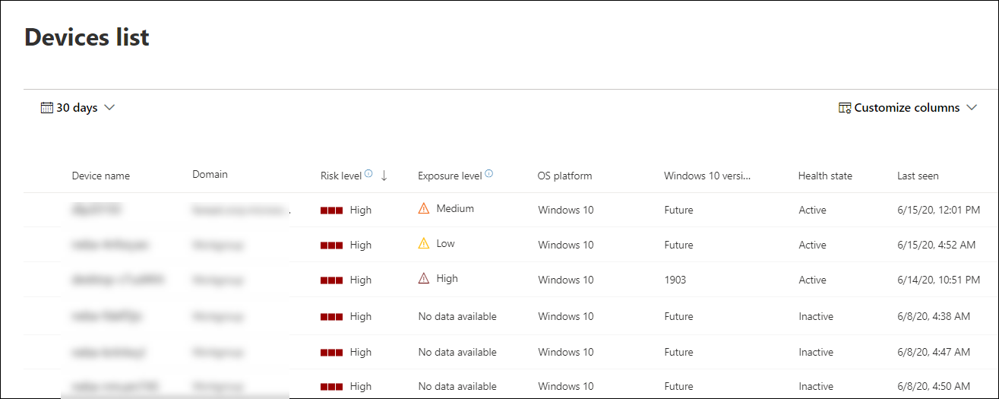

# Anzeigen und Organisieren der Microsoft Defender for Endpoint Devices-Liste

[!INCLUDE [Microsoft 365 Defender rebranding](../../includes/microsoft-defender.md)]

**Gilt für:**
- [Microsoft Defender für Endpunkt](https://go.microsoft.com/fwlink/p/?linkid=2154037)
- [Microsoft 365 Defender](https://go.microsoft.com/fwlink/?linkid=2118804)

> Möchten Sie Defender for Endpoint erleben? [Registrieren Sie sich für eine kostenlose Testversion.](https://www.microsoft.com/microsoft-365/windows/microsoft-defender-atp?ocid=docs-wdatp-machinesview-abovefoldlink)

Die **Liste Geräte** enthält eine Liste der Geräte in Ihrem Netzwerk, auf denen Warnungen generiert wurden. Standardmäßig werden in der Warteschlange Geräte angezeigt, die in den letzten 30 Tagen angezeigt wurden.  

Auf einen Blick werden Informationen wie Domäne, Risikostufe, Betriebssystemplattform und andere Details zur einfachen Identifizierung der am stärksten gefährdeten Geräte angezeigt.

Es stehen mehrere Optionen zur Verfügung, um die Gerätelistenansicht anzupassen. Im oberen Navigationsbereich können Sie:

- Hinzufügen oder Entfernen von Spalten
- Exportieren der gesamten Liste im CSV-Format
- Auswählen der Anzahl der Elemente, die pro Seite angezeigt werden soll
- Anwenden von Filtern

Während des Onboardingprozesses wird die **Liste Geräte** schrittweise mit Geräten aufgefüllt, wenn sie beginnen, Sensordaten zu melden. Verwenden Sie diese Ansicht, um Ihre integrierten Endpunkte zu verfolgen, während sie online sind, oder laden Sie die vollständige Endpunktliste als CSV-Datei für die Offlineanalyse herunter.

>[!NOTE]
> Wenn Sie die Geräteliste exportieren, enthält sie jedes Gerät in Ihrer Organisation. Je nachdem, wie groß Ihre Organisation ist, kann es sehr viel Zeit zum Herunterladen dauern. Beim Exportieren der Liste im CSV-Format werden die Daten ungefiltert angezeigt. Die CSV-Datei enthält alle Geräte in der Organisation, unabhängig davon, ob die Filterung in der Ansicht selbst angewendet wird.

## Sortieren und Filtern der Geräteliste

Sie können die folgenden Filter anwenden, um die Liste der Warnungen zu beschränken und eine fokussierte Ansicht zu erhalten.

### Risikostufe

Die Risikostufe spiegelt die allgemeine Risikobewertung des Geräts basierend auf einer Kombination von Faktoren wider, einschließlich der Typen und des Schweregrads aktiver Warnungen auf dem Gerät. Das Auflösen aktiver Warnungen, das Genehmigen von Korrekturaktivitäten und das Unterdrücken nachfolgender Warnungen können die Risikostufe senken.

### Belichtungsstufe

Die Belichtungsstufe spiegelt die aktuelle Belichtung des Geräts basierend auf den kumulativen Auswirkungen der ausstehenden Sicherheitsempfehlungen wider. Die möglichen Ebenen sind niedrig, mittel und hoch. Niedrige Belichtung bedeutet, dass Ihre Geräte weniger anfällig für die Nutzung sind.

Wenn die Risikostufe "Keine Daten verfügbar" ausdingt, gibt es einige Gründe, warum dies der Fall sein kann:

- Gerät hat die Berichterstellung für mehr als 30 Tage beendet – in diesem Fall gilt es als inaktiv, und die Belichtung wird nicht berechnet.
- Gerätebetriebssystem nicht unterstützt – siehe [Mindestanforderungen für Microsoft Defender for Endpoint](minimum-requirements.md)
- Gerät mit veralteten Agents (sehr unwahrscheinlich)

### Betriebssystemplattform

Wählen Sie nur die Betriebssystemplattformen aus, die Sie untersuchen möchten.

### Integritätsstatus

Filtern sie nach den folgenden Geräteintehzustandszuständen:

- **Aktiv** – Geräte, die aktiv Sensordaten an den Dienst melden.
- **Inaktiv** – Geräte, die das Senden von Signalen für mehr als 7 Tage vollständig beendet haben.
- **Falsch konfiguriert –** Geräte, die die Kommunikation mit dem Dienst beeinträchtigt haben oder keine Sensordaten senden können. Falsch konfigurierte Geräte können weiter wie folgt klassifiziert werden:
  - Keine Sensordaten
  - Beeinträchtigte Kommunikation

  Weitere Informationen zum Beheben von Problemen auf falsch konfigurierten Geräten finden Sie unter [Fix unhealthy sensors](fix-unhealthy-sensors.md).

### Antivirusstatus

Filtern Von Geräten nach Antivirusstatus. Gilt nur für aktive Windows 10-Geräte.

- **Deaktiviert** – & Schutz vor Bedrohungen ist deaktiviert.
- **Keine Berichterstellung** – Virenschutz & wird nicht berichtet.
- **Nicht aktualisiert** – Virenschutz & bedrohungsschutz ist nicht auf dem neuesten Stand.

Weitere Informationen finden Sie unter [View the Threat & Vulnerability Management dashboard](tvm-dashboard-insights.md).

### Status der Bedrohungsminderung

Um Geräte anzuzeigen, die möglicherweise von einer bestimmten Bedrohung betroffen sind, wählen Sie die Bedrohung im Dropdownmenü aus, und wählen Sie dann aus, welcher Sicherheitsrisikoaspekt abgemildert werden muss.

Weitere Informationen zu bestimmten Bedrohungen finden Sie unter [Threat analytics](threat-analytics.md). Informationen zur Risikominderung finden Sie unter [Threat & Vulnerability Management](next-gen-threat-and-vuln-mgt.md).

### Windows 10-Version

Wählen Sie nur die Windows 10-Versionen aus, die Sie untersuchen möchten.

### Tags & Gruppen

Filtern Sie die Liste basierend auf der Gruppierung und Kennzeichnung, die Sie einzelnen Geräten hinzugefügt haben. Weitere [Informationen finden Sie unter Erstellen und Verwalten von Gerätetags](machine-tags.md) und Erstellen und Verwalten von [Gerätegruppen.](machine-groups.md)

## Verwandte Themen

- [Untersuchen von Geräten in der Microsoft Defender for Endpoint Devices-Liste](investigate-machines.md)
