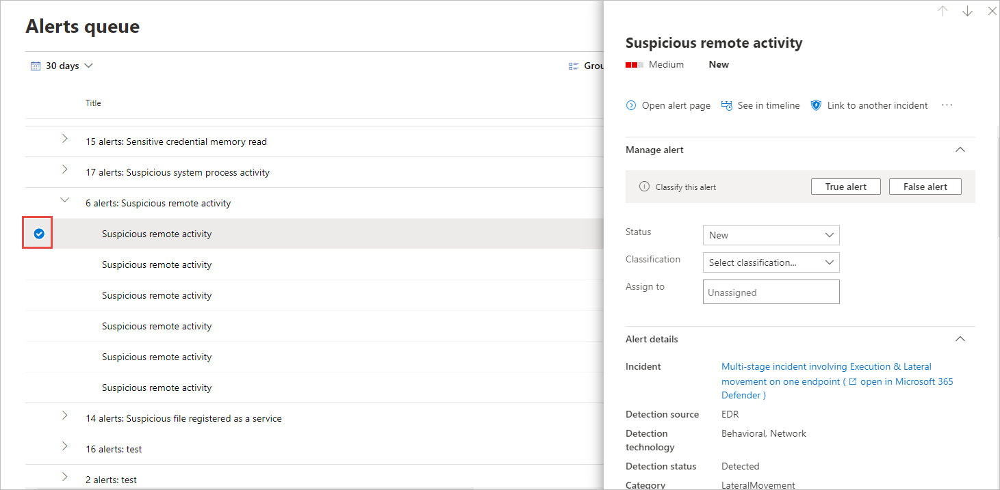

# Verwalten von Microsoft Defender for Endpoint-WarnungenManage Microsoft Defender for Endpoint alerts

[!INCLUDE [Microsoft 365 Defender rebranding](../../includes/microsoft-defender.md)]

**Gilt für:****Applies to:**
- [Microsoft Defender für EndpunktMicrosoft Defender for Endpoint](https://go.microsoft.com/fwlink/p/?linkid=2146631)
- [Microsoft 365 DefenderMicrosoft 365 Defender](https://go.microsoft.com/fwlink/?linkid=2118804)

> Möchten Sie Defender for Endpoint erleben?Want to experience Defender for Endpoint? [Registrieren Sie sich für eine kostenlose Testversion.Sign up for a free trial.](https://www.microsoft.com/microsoft-365/windows/microsoft-defender-atp?ocid=docs-wdatp-managealerts-abovefoldlink)

Defender for Endpoint benachrichtigt Sie über Warnungen über mögliche bösartige Ereignisse, Attribute und Kontextinformationen.Defender for Endpoint notifies you of possible malicious events, attributes, and contextual information through alerts. Eine Zusammenfassung der neuen Warnungen wird im Dashboard für Sicherheitsvorgänge **angezeigt,** und Sie können auf alle Warnungen in der Benachrichtigungswarteschlange **zugreifen.**A summary of new alerts is displayed in the **Security operations dashboard**, and you can access all alerts in the **Alerts queue**.

Sie können Warnungen verwalten, indem Sie eine  Warnung in der Warnungswarteschlange oder auf der Registerkarte Warnungen auf der Seite Gerät für ein einzelnes Gerät auswählen.You can manage alerts by selecting an alert in the **Alerts queue**, or the **Alerts** tab of the Device page for an individual device.

Wenn Sie eine Warnung an einem dieser Orte auswählen, wird der **Bereich Warnungsverwaltung geöffnet.**Selecting an alert in either of those places brings up the **Alert management pane**.

## Link zu einem anderen VorfallLink to another incident
Sie können einen neuen Vorfall aus der Warnung oder einem Link zu einem vorhandenen Vorfall erstellen.You can create a new incident from the alert or link to an existing incident. 

## Zuweisen von WarnungenAssign alerts
Wenn eine Warnung noch nicht zugewiesen ist, können Sie **Zuweisen** für mich auswählen, um die Warnung selbst zuzuordnen.If an alert is not yet assigned, you can select **Assign to me** to assign the alert to yourself.

## Unterdrücken von WarnungenSuppress alerts
Es kann Szenarien gibt, in denen Sie das Anzeigen von Warnungen im Microsoft Defender Security Center unterdrücken müssen.There might be scenarios where you need to suppress alerts from appearing in Microsoft Defender Security Center. Mit Defender for Endpoint können Sie Unterdrückungsregeln für bestimmte Warnungen erstellen, die als harmlos bekannt sind, z. B. bekannte Tools oder Prozesse in Ihrer Organisation.Defender for Endpoint lets you create suppression rules for specific alerts that are known to be innocuous such as known tools or processes in your organization.

Unterdrückungsregeln können aus einer vorhandenen Warnung erstellt werden.Suppression rules can be created from an existing alert. Sie können bei Bedarf deaktiviert und erneut aktiviert werden.They can be disabled and reenabled if needed.

Wenn eine Unterdrückungsregel erstellt wird, wird sie ab dem Zeitpunkt wirksam, an dem die Regel erstellt wird.When a suppression rule is created, it will take effect from the point when the rule is created. Die Regel wirkt sich nicht auf vorhandene Warnungen aus, die sich bereits in der Warteschlange befinden, vor der Regelerstellung.The rule will not affect existing alerts already in the queue, prior to the rule creation. Die Regel wird nur auf Warnungen angewendet, die die bedingungen erfüllen, die nach dem Erstellen der Regel festgelegt wurden.The rule will only be applied on alerts that satisfy the conditions set after the rule is created.

Es gibt zwei Kontexte für eine Unterdrückungsregel, aus der Sie auswählen können:There are two contexts for a suppression rule that you can choose from:

- **Unterdrücken von Warnungen auf diesem Gerät****Suppress alert on this device**
- **Unterdrücken von Warnungen in meiner Organisation****Suppress alert in my organization**

Mit dem Kontext der Regel können Sie anpassen, was im Portal angezeigt wird, und sicherstellen, dass nur echte Sicherheitswarnungen im Portal angezeigt werden.The context of the rule lets you tailor what gets surfaced into the portal and ensure that only real security alerts are surfaced into the portal.

Anhand der Beispiele in der folgenden Tabelle können Sie den Kontext für eine Unterdrückungsregel auswählen:You can use the examples in the following table to help you choose the context for a suppression rule:

| **Context****Context**                           | **Definition****Definition**                                                                                                                                              | **Beispielszenarien****Example scenarios**                                                                                                                                                                                                  |
|:--------------------------------------|:------------------------------------------------------------------------------------------------------------------------------------------------------------|:-----------------------------------------------------------------------------------------------------------------------------------------------------------------------------------------------------------------------|
| **Unterdrücken von Warnungen auf diesem Gerät****Suppress alert on this device**    | Warnungen mit dem gleichen Warnungstitel und nur auf diesem bestimmten Gerät werden unterdrückt.Alerts with the same alert title and on that specific device only will be suppressed.   Alle anderen Warnungen auf diesem Gerät werden nicht unterdrückt.All other alerts on that device will not be suppressed. | <ul><li>Ein Sicherheitsforscher untersucht ein bösartiges Skript, das zum Angriff auf andere Geräte in Ihrer Organisation verwendet wurde.A security researcher is investigating a malicious script that has been used to attack other devices in your organization.</li><li>Ein Entwickler erstellt regelmäßig PowerShell-Skripts für sein Team.A developer regularly creates PowerShell scripts for their team.</li></ul> |
| **Unterdrücken von Warnungen in meiner Organisation****Suppress alert in my organization** | Warnungen mit dem gleichen Warnungstitel auf jedem Gerät werden unterdrückt.Alerts with the same alert title on any device will be suppressed.                                                                                         | <ul><li>Ein gutartiges Verwaltungstool wird von allen in Ihrer Organisation verwendet.A benign administrative tool is used by everyone in your organization.</li></ul>                                                                                                                               |

### Unterdrücken Sie eine Warnung, und erstellen Sie eine neue Unterdrückungsregel:Suppress an alert and create a new suppression rule:
Erstellen Sie benutzerdefinierte Regeln, um zu steuern, wann Warnungen unterdrückt oder aufgelöst werden.Create custom rules to control when alerts are suppressed, or resolved. Sie können den Kontext steuern, für den eine Warnung unterdrückt wird, indem Sie den Warnungstitel, den Kompromissindikator und die Bedingungen angeben.You can control the context for when an alert is suppressed by specifying the alert title, Indicator of compromise, and the conditions. Nachdem Sie den Kontext angegeben haben, können Sie die Aktion und den Bereich für die Warnung konfigurieren.After specifying the context, you’ll be able to configure the action and scope on the alert. 

1. Wählen Sie die Warnung aus, die Sie unterdrücken möchten.Select the alert you'd like to suppress. Dadurch wird der Bereich **Warnungsverwaltung** geöffnet.This brings up the **Alert management** pane.

2.  Wählen **Sie Unterdrückungsregel erstellen aus.**Select **Create a suppression rule**.

    Mit diesen Attributen können Sie eine Unterdrückungsbedingung erstellen.You can create a suppression condition using these attributes. Zwischen jeder Bedingung wird ein AND-Operator angewendet, sodass die Unterdrückung nur erfolgt, wenn alle Bedingungen erfüllt sind.An AND operator is applied between each condition, so suppression occurs only if all conditions are met.
    
    * Datei SHA1File SHA1
    * Dateiname – Platzhalter wird unterstütztFile name - wildcard supported
    * Ordnerpfad – Platzhalter unterstütztFolder path - wildcard supported
    * IP-AdresseIP address
    * URL – Platzhalter unterstütztURL - wildcard supported
    * Befehlszeile – Platzhalter unterstütztCommand line - wildcard supported

3. Wählen Sie **das Auslösende IOC aus.**Select the **Triggering IOC**.
    
4. Geben Sie die Aktion und den Bereich für die Warnung an.Specify the action and scope on the alert.  
   Sie können eine Warnung automatisch auflösen oder im Portal ausblenden.You can automatically resolve an alert or hide it from the portal. Warnungen, die automatisch aufgelöst werden, werden im Abschnitt "Aufgelöst" der Warnungswarteschlange, der Warnungsseite und der Gerätezeitachse angezeigt und werden als in Defender for Endpoint-APIs aufgelöst angezeigt.Alerts that are automatically resolved will appear in the resolved section of the alerts queue, alert page, and device timeline and will appear as resolved across Defender for Endpoint APIs.    Warnungen, die als ausgeblendet markiert sind, werden sowohl für die zugeordneten Warnungen des Geräts als auch über das Dashboard aus dem gesamten System unterdrückt und nicht über Defender for Endpoint-APIs gestreamt.Alerts that are marked as hidden will be suppressed from the entire system, both on the device's associated alerts and from the dashboard and will not be streamed across Defender for Endpoint APIs.

5. Geben Sie einen Regelnamen und einen Kommentar ein.Enter a rule name and a comment.

6. Klicken Sie auf **Speichern**.Click **Save**.

#### Anzeigen der Liste der UnterdrückungsregelnView the list of suppression rules

1. Wählen Sie im Navigationsbereich  >  Einstellungsbenachrichtigungsunterdrückung **aus.**In the navigation pane, select **Settings** > **Alert suppression**.

2. Die Liste der Unterdrückungsregeln zeigt alle Regeln an, die Benutzer in Ihrer Organisation erstellt haben.The list of suppression rules shows all the rules that users in your organization have created.

Weitere Informationen zum Verwalten von Unterdrückungsregeln finden Sie unter [Manage suppression rules](manage-suppression-rules.md)For more information on managing suppression rules, see [Manage suppression rules](manage-suppression-rules.md)

## Ändern des Status einer WarnungChange the status of an alert

Sie können Warnungen (als **Neu,** **In Bearbeitung** oder **Aufgelöst**) kategorisieren, indem Sie ihren Status im Verlauf der Untersuchung ändern.You can categorize alerts (as **New**, **In Progress**, or **Resolved**) by changing their status as your investigation progresses. Auf diese Weise können Sie organisieren und verwalten, wie Ihr Team auf Warnungen reagieren kann.This helps you organize and manage how your team can respond to alerts.

Beispielsweise kann ein Teamleiter  alle neuen Warnungen überprüfen und diese zur weiteren Analyse der **Warteschlange In Bearbeitung** zuweisen.For example, a team leader can review all **New** alerts, and decide to assign them to the **In Progress** queue for further analysis.

Alternativ kann der Teamleiter die  Warnung der Aufgelösten Warteschlange zuweisen, wenn er weiß, dass die Warnung gutartig ist, von einem gerät kommt, das irrelevant ist (z. B. eines, das einem Sicherheitsadministrator gehört) oder über eine frühere Warnung behandelt wird.Alternatively, the team leader might assign the alert to the **Resolved** queue if they know the alert is benign, coming from a device that is irrelevant (such as one belonging to a security administrator), or is being dealt with through an earlier alert.

## WarnungsklassifizierungAlert classification
Sie können keine Klassifizierung festlegen oder angeben, ob es sich bei einer Warnung um eine echte warnung oder um eine falsche Warnung handelt.You can choose not to set a classification, or specify whether an alert is a true alert or a false alert. Es ist wichtig, die Klassifizierung des echten positiven/falsch positiven Werts zu liefern.It's important to provide the classification of true positive/false positive. Diese Klassifizierung wird verwendet, um die Warnungsqualität zu überwachen und Warnungen genauer zu machen.This classification is used to monitor alert quality, and make alerts more accurate. Das Feld "Bestimmung" definiert zusätzliche Genauigkeit für eine "true positive" Klassifizierung.The "determination" field defines additional fidelity for a "true positive" classification. 

## Hinzufügen von Kommentaren und Anzeigen des Verlaufs einer WarnungAdd comments and view the history of an alert
Sie können Kommentare hinzufügen und verlaufshistorische Ereignisse zu einer Warnung anzeigen, um frühere Änderungen an der Warnung zu sehen.You can add comments and view historical events about an alert to see previous changes made to the alert.

Wann immer eine Änderung oder ein Kommentar an einer Warnung vorgenommen wird, wird sie im Abschnitt **Kommentare und Verlauf** aufgezeichnet.Whenever a change or comment is made to an alert, it is recorded in the **Comments and history** section.

Hinzugefügte Kommentare werden sofort in diesem Bereich angezeigt.Added comments instantly appear on the pane.

## Verwandte ThemenRelated topics
- [Verwalten von UnterdrückungsregelnManage suppression rules](manage-suppression-rules.md)
- [Anzeigen und Organisieren der Microsoft Defender for Endpoint Alerts-WarteschlangeView and organize the Microsoft Defender for Endpoint Alerts queue](alerts-queue.md)
- [Untersuchen von Microsoft Defender for Endpoint-WarnungenInvestigate Microsoft Defender for Endpoint alerts](investigate-alerts.md)
- [Untersuchen einer Datei, die einer Microsoft Defender for Endpoint-Warnung zugeordnet istInvestigate a file associated with a Microsoft Defender for Endpoint alert](investigate-files.md)
- [Untersuchen von Geräten in der Microsoft Defender for Endpoint Devices-ListeInvestigate devices in the Microsoft Defender for Endpoint Devices list](investigate-machines.md)
- [Untersuchen einer einer Microsoft Defender for Endpoint-Warnung zugeordneten IP-AdresseInvestigate an IP address associated with a Microsoft Defender for Endpoint alert](investigate-ip.md)
- [Untersuchen einer Domäne, die einer Microsoft Defender for Endpoint-Warnung zugeordnet istInvestigate a domain associated with a Microsoft Defender for Endpoint alert](investigate-domain.md)
- [Untersuchen eines Benutzerkontos in Microsoft Defender for EndpointInvestigate a user account in Microsoft Defender for Endpoint](investigate-user.md)
