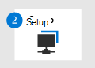

# <a name="migrate-from-mcafee---phase-2-set-up-microsoft-defender-for-endpoint"></a>Migrieren von McAfee – Phase 2: Einrichten von Microsoft Defender for Endpoint

**Gilt für:**
- [Microsoft Defender für Endpunkt](https://go.microsoft.com/fwlink/p/?linkid=2154037)
- [Microsoft 365 Defender](https://go.microsoft.com/fwlink/?linkid=2118804)

|[](mcafee-to-microsoft-defender-prepare.md)<br/>[Phase 1: Vorbereiten](mcafee-to-microsoft-defender-prepare.md) |<br/>Phase 2: Einrichten |[](mcafee-to-microsoft-defender-onboard.md)<br/>[Phase 3: Onboarding](mcafee-to-microsoft-defender-onboard.md) |
|--|--|--|
||*Sie sind hier!* | |

**Willkommen bei der Setupphase der Migration von [McAfee Endpoint Security (McAfee) zu Microsoft Defender for Endpoint](mcafee-to-microsoft-defender-migration.md#the-migration-process)**. Diese Phase umfasst die folgenden Schritte:
1. [Aktivieren Sie Microsoft Defender Antivirus, und bestätigen Sie, dass es sich im passiven Modus befindet.](#enable-microsoft-defender-antivirus-and-confirm-its-in-passive-mode)
2. [Hier finden Sie Updates für Microsoft Defender Antivirus](#get-updates-for-microsoft-defender-antivirus).
3. [Fügen Sie Microsoft Defender for Endpoint der Ausschlussliste für McAfee hinzu.](#add-microsoft-defender-for-endpoint-to-the-exclusion-list-for-mcafee)
4. [Fügen Sie McAfee der Ausschlussliste für Microsoft Defender Antivirus hinzu.](#add-mcafee-to-the-exclusion-list-for-microsoft-defender-antivirus)
5. [Fügen Sie McAfee der Ausschlussliste für Microsoft Defender for Endpoint hinzu.](#add-mcafee-to-the-exclusion-list-for-microsoft-defender-for-endpoint)
6. [Richten Sie Ihre Gerätegruppen, Gerätesammlungen und Organisationseinheiten ein.](#set-up-your-device-groups-device-collections-and-organizational-units)
7. [Konfigurieren von Antischalwarerichtlinien und Echtzeitschutz](#configure-antimalware-policies-and-real-time-protection).

## <a name="enable-microsoft-defender-antivirus-and-confirm-its-in-passive-mode"></a>Aktivieren von Microsoft Defender Antivirus und Bestätigen des passiven Modus

Unter bestimmten Versionen von Windows, z. B. Windows Server, wurde Microsoft Defender Antivirus möglicherweise deinstalliert oder deaktiviert, als Ihre McAfee-Lösung installiert wurde. Dies liegt daran, dass Microsoft Defender Antivirus nicht in den passiven oder deaktivierten Modus wechselt, wenn Sie ein Antivirenprodukt eines Drittanbieters, z. B. McAfee, installieren. (Weitere Informationen dazu finden Sie unter [Microsoft Defender Antivirus-Kompatibilität](microsoft-defender-antivirus-compatibility.md).)

Dieser Schritt des Migrationsprozesses umfasst die folgenden Aufgaben:
- [Festlegen von DisableAntiSpyware auf false unter Windows Server](#set-disableantispyware-to-false-on-windows-server)
- [Erneutes Installieren von Microsoft Defender Antivirus auf Windows Server](#reinstall-microsoft-defender-antivirus-on-windows-server);
- [Festlegen des passiven Modus von Microsoft Defender Antivirus unter Windows Server](#set-microsoft-defender-antivirus-to-passive-mode-on-windows-server)
- [Aktivieren von Microsoft Defender Antivirus auf Ihren Windows-Clientgeräten;](#enable-microsoft-defender-antivirus-on-your-windows-client-devices) und
- [Bestätigen, dass Microsoft Defender Antivirus auf den passiven Modus festgelegt ist.](#confirm-that-microsoft-defender-antivirus-is-in-passive-mode)  

### <a name="set-disableantispyware-to-false-on-windows-server"></a>Festlegen von DisableAntiSpyware auf false unter Windows Server

Der [Registrierungsschlüssel DisableAntiSpyware](/windows-hardware/customize/desktop/unattend/security-malware-windows-defender-disableantispyware) wurde in der Vergangenheit verwendet, um Microsoft Defender Antivirus zu deaktivieren und ein anderes Antivirenprodukt wie McAfee zu bereitstellen. Im Allgemeinen sollte dieser Registrierungsschlüssel nicht auf Ihren #A0 und -Endpunkten vorhanden sein. Wenn Sie jedoch konfiguriert haben, gehen Sie wie hier vor, um den Wert auf `DisableAntiSpyware` false zu setzen:

1. Öffnen Sie auf Ihrem Windows Server-Gerät den Registrierungs-Editor.

2. Navigieren Sie zu `HKEY_LOCAL_MACHINE\SOFTWARE\Policies\Microsoft\Windows Defender`.

3. Suchen Sie in diesem Ordner nach einem DWORD-Eintrag namens **DisableAntiSpyware**.

   - Wenn dieser Eintrag nicht zu sehen ist, sind Sie alle festgelegt.

   - Wenn **DisableAntiSpyware zu sehen ist,** fahren Sie mit Schritt 4 fort.

4. Klicken Sie mit der rechten Maustaste auf disableAntiSpyware DWORD, und wählen Sie dann **Ändern aus.**

5. Legen Sie den Wert auf `0` . (Dadurch wird der Wert des Registrierungsschlüssels auf *false gesetzt.)*

> [!TIP]
> Weitere Informationen zu diesem Registrierungsschlüssel finden Sie unter [DisableAntiSpyware](/windows-hardware/customize/desktop/unattend/security-malware-windows-defender-disableantispyware).

### <a name="reinstall-microsoft-defender-antivirus-on-windows-server"></a>Installieren von Microsoft Defender Antivirus auf Windows Server

> [!NOTE]
> Das folgende Verfahren gilt nur für Endpunkte oder Geräte mit den folgenden Versionen von Windows:
> - Windows Server 2019
> - Windows Server, Version 1803 (nur Kernmodus)
> - Windows Server 2016

1. Öffnen Sie als lokaler Administrator auf dem Endpunkt oder Gerät Windows PowerShell.

2. Führen Sie die folgenden PowerShell-Cmdlets aus: <br/>
   
   `Dism /online /Get-FeatureInfo /FeatureName:Windows-Defender-Features` <br/>
   
   `Dism /online /Get-FeatureInfo /FeatureName:Windows-Defender` <br/>

> [!NOTE]
> Wenn Sie den BEFEHL DISM innerhalb einer Tasksequenz verwenden, in der PS ausgeführt wird, ist der folgende Pfad cmd.exe erforderlich.
> Beispiel:<br/>
> `c:\windows\sysnative\cmd.exe /c Dism /online /Get-FeatureInfo /FeatureName:Windows-Defender-Features`<br/>
> `c:\windows\sysnative\cmd.exe /c Dism /online /Get-FeatureInfo /FeatureName:Windows-Defender`<br/>

3. Verwenden Sie das folgende PowerShell-Cmdlet, um zu überprüfen, ob Microsoft Defender Antivirus ausgeführt wird: <br/>
   
   `Get-Service -Name windefend`

#### <a name="are-you-using-windows-server-2016"></a>Verwenden Sie Windows Server 2016?

Wenn Sie Windows Server 2016 verwenden und Probleme beim Aktivieren von Microsoft Defender Antivirus haben, verwenden Sie das folgende PowerShell-Cmdlet:

`mpcmdrun -wdenable`

> [!TIP]
> Benötigen Sie weitere Hilfe? Weitere [Informationen finden Sie unter Microsoft Defender Antivirus auf Windows Server 2016 und 2019](microsoft-defender-antivirus-on-windows-server.md).

### <a name="set-microsoft-defender-antivirus-to-passive-mode-on-windows-server"></a>Festlegen des passiven Modus von Microsoft Defender Antivirus unter Windows Server

Da Ihre Organisation weiterhin McAfee verwendet, müssen Sie Microsoft Defender Antivirus auf den passiven Modus festlegen. Auf diese Weise können McAfee und Microsoft Defender Antivirus nebeneinander ausgeführt werden, bis Sie das Onboarding für Microsoft Defender for Endpoint abgeschlossen haben.

1. Öffnen Sie den Registrierungs-Editor, und navigieren Sie dann zu <br/>
   `Computer\HKEY_LOCAL_MACHINE\SOFTWARE\Policies\Microsoft\Windows Advanced Threat Protection`.

2. Bearbeiten (oder erstellen) Sie einen DWORD-Eintrag namens **ForcePassiveMode,** und geben Sie die folgenden Einstellungen an:
   
   - Legen Sie den Wert des DWORD auf **1 .**
   
   - Wählen **Sie unter Basis** die Option **Hexadezimal aus.**

> [!NOTE]
> Sie können andere Methoden zum Festlegen des Registrierungsschlüssels verwenden, z. B.:
>- [Gruppenrichtlinieneinstellung](/previous-versions/windows/it-pro/windows-server-2012-R2-and-2012/dn581922(v=ws.11))
>- [Ein Paket im Configuration Manager](/mem/configmgr/apps/deploy-use/packages-and-programs)

### <a name="enable-microsoft-defender-antivirus-on-your-windows-client-devices"></a>Aktivieren von Microsoft Defender Antivirus auf Ihren Windows-Clientgeräten

Da Ihre Organisation McAfee als primäre Antivirenlösung verwendet hat, ist Microsoft Defender Antivirus höchstwahrscheinlich auf den Windows-Geräten Ihrer Organisation deaktiviert. Dieser Schritt des Migrationsprozesses umfasst die Aktivierung von Microsoft Defender Antivirus. 

Um Microsoft Defender Antivirus zu aktivieren, wird die Verwendung von Intune empfohlen. Sie können jedoch eine der Methoden verwenden, die in der folgenden Tabelle aufgeführt sind:

|Methode  |Vorgehensweise  |
|---------|---------|
|[Intune](/mem/intune/fundamentals/tutorial-walkthrough-endpoint-manager) <p>**HINWEIS:** Intune ist jetzt Microsoft Endpoint Manager. |1. Wechseln Sie zum [Microsoft Endpoint Manager Admin Center,](https://go.microsoft.com/fwlink/?linkid=2109431) und melden Sie sich an.<p>2. Wählen Sie  >  **Gerätekonfigurationsprofile** aus, und wählen Sie dann den Profiltyp aus, den Sie konfigurieren möchten. <br/>Wenn Sie noch keinen Profiltyp für Geräteeinschränkungen erstellt haben oder einen neuen erstellen möchten, lesen Sie Konfigurieren von Geräteeinschränkungseinstellungen [in Microsoft Intune](/intune/device-restrictions-configure). <p>3. Wählen Sie **Eigenschaften** aus, und wählen Sie dann **Konfigurationseinstellungen: Bearbeiten aus.**<p>4. Erweitern **Sie Microsoft Defender Antivirus**. <p>5. Aktivieren des **in der Cloud übermittelten Schutzes**.<p>6. Wählen Sie im **Dropdownmenü Benutzer vor der Beispielübermittlung** anforderen die Option **Alle Beispiele automatisch senden aus.**<p>7. Wählen Sie im **Dropdownmenü Potenziell unerwünschte Anwendungen erkennen** die Option **Aktivieren** oder **Überwachen aus.**<p>8. Wählen Sie **Überprüfen + Speichern** aus, und wählen Sie dann Speichern **aus.**<p>Weitere Informationen zu Intune-Geräteprofilen, einschließlich der Erstellung und Konfiguration ihrer Einstellungen, finden Sie unter [Was sind Microsoft Intune-Geräteprofile?](/intune/device-profiles).|
|Systemsteuerung in Windows     |Folgen Sie den Anweisungen hier: [Aktivieren Sie Microsoft Defender Antivirus](/mem/intune/user-help/turn-on-defender-windows). <p>**HINWEIS:** In einigen Versionen von Windows *Windows Defender möglicherweise* ein Antivirus anstelle von Microsoft Defender *Antivirus* angezeigt.        |
|[Erweiterte Gruppenrichtlinienverwaltung](/microsoft-desktop-optimization-pack/agpm/) <br/>oder<br/>[Gruppenrichtlinien-Verwaltungskonsole](use-group-policy-microsoft-defender-antivirus.md)  |1. Wechseln Sie zu `Computer configuration > Administrative templates > Windows components > Microsoft Defender Antivirus` . <p>2. Suchen Sie nach einer Richtlinie namens **Deaktivieren von Microsoft Defender Antivirus**.<br/> <br/>3. Wählen Sie **Richtlinieneinstellung bearbeiten** aus, und stellen Sie sicher, dass die Richtlinie deaktiviert ist. Dadurch wird Microsoft Defender Antivirus aktiviert. <p>**HINWEIS:** In einigen Versionen von Windows *Windows Defender möglicherweise* ein Antivirus anstelle von Microsoft Defender *Antivirus* angezeigt. |

### <a name="confirm-that-microsoft-defender-antivirus-is-in-passive-mode"></a>Bestätigen, dass sich Microsoft Defender Antivirus im passiven Modus befindet

Microsoft Defender Antivirus kann zusammen mit McAfee ausgeführt werden, wenn Sie Microsoft Defender Antivirus auf den passiven Modus festlegen. Sie können entweder die Eingabeaufforderung oder PowerShell verwenden, um diese Aufgabe auszuführen, wie in der folgenden Tabelle beschrieben:

|Methode  |Vorgehensweise  |
|---------|---------|
|Eingabeaufforderung     |1. Öffnen Sie auf einem Windows-Gerät die Eingabeaufforderung als Administrator. <p>2. Geben Sie `sc query windefend` ein , und drücken Sie dann die EINGABETASTE.<p>3. Überprüfen Sie die Ergebnisse, um zu bestätigen, dass Microsoft Defender Antivirus im passiven Modus ausgeführt wird.         |
|PowerShell     |1. Öffnen Sie auf einem Windows-Gerät Windows PowerShell administrator.<p>2. Führen Sie das [Cmdlet Get-MpComputerStatus](/powershell/module/defender/Get-MpComputerStatus) aus. <p>3. Suchen Sie in der Liste der Ergebnisse nach **AMRunningMode: Passive Mode** oder **AMRunningMode: SxS Passive Mode**.|

> [!NOTE]
> In einigen Versionen *von Windows Windows Defender antivirus* anstelle von Microsoft Defender *Antivirus* angezeigt.

## <a name="get-updates-for-microsoft-defender-antivirus"></a>Herunterladen von Updates für Microsoft Defender Antivirus

Microsoft Defender Antivirus auf dem neuesten Stand zu halten, ist wichtig, um sicherzustellen, dass Ihre Geräte über die neuesten Technologien und Features verfügen, die zum Schutz vor neuen Schadsoftware- und Angriffstechniken erforderlich sind, auch wenn Microsoft Defender Antivirus im passiven Modus [ausgeführt wird.](microsoft-defender-antivirus-compatibility.md)

Es gibt zwei Arten von Updates im Zusammenhang mit der Aktualisierung von Microsoft Defender Antivirus:
- Sicherheitsintelligenzupdates
- Produktupdates

Um Ihre Updates zu erhalten, folgen Sie den Anweisungen unter Verwalten von [Microsoft Defender Antivirus-Updates und Anwenden von Baselines](manage-updates-baselines-microsoft-defender-antivirus.md).

## <a name="add-microsoft-defender-for-endpoint-to-the-exclusion-list-for-mcafee"></a>Hinzufügen von Microsoft Defender for Endpoint zur Ausschlussliste für McAfee

Dieser Schritt des Setupprozesses umfasst das Hinzufügen von Microsoft Defender for Endpoint zur Ausschlussliste für McAfee und alle anderen Sicherheitsprodukte, die Ihre Organisation verwendet. 

> [!TIP]
> Hilfe zum Konfigurieren von Ausschlüssen finden Sie in der McAfee-Dokumentation, z. B. im folgenden Artikel: [McAfee Endpoint Security 10.5.0 – Product Guide](https://docs.mcafee.com/bundle/endpoint-security-10.5.0-threat-prevention-product-guide-epolicy-orchestrator-windows/page/GUID-71C5FB4B-A143-43E6-8BF0-8B2C16ABE6DA.html)für das Modul zur Bedrohungsverhütung (McAfee ePolicy Orchestrator) - Windows: Konfigurieren von Ausschlüssen .

Die spezifischen zu konfigurierenden Ausschlüsse hängen davon ab, welche Version von Windows Ihre Endpunkte oder Geräte ausgeführt werden, und sind in der folgenden Tabelle aufgeführt:

|Betriebssystem |Ausschlüsse |
|--|--|
|- Windows 10, [Version 1803](/windows/release-health/status-windows-10-1803) oder höher (Siehe [Windows 10 Release Information](/windows/release-health/release-information))<br/>- Windows 10, Version 1703 oder [1709](/windows/release-health/status-windows-10-1709) mit [installierter KB4493441](https://support.microsoft.com/help/4493441) <br/>- [Windows Server 2019](/windows/release-health/status-windows-10-1809-and-windows-server-2019)<br/>- [Windows Server, Version 1803](/windows-server/get-started/whats-new-in-windows-server-1803) |`C:\Program Files\Windows Defender Advanced Threat Protection\MsSense.exe`<p>`C:\Program Files\Windows Defender Advanced Threat Protection\SenseCncProxy.exe`<p>`C:\Program Files\Windows Defender Advanced Threat Protection\SenseSampleUploader.exe`<p>`C:\Program Files\Windows Defender Advanced Threat Protection\SenseIR.exe`<br/>  |
|- [Windows 8.1](/windows/release-health/status-windows-8.1-and-windows-server-2012-r2) <br/>- [Windows 7](/windows/release-health/status-windows-7-and-windows-server-2008-r2-sp1)<br/>- [Windows Server 2016](/windows/release-health/status-windows-10-1607-and-windows-server-2016)<br/>- [Windows Server 2012 R2](/windows/release-health/status-windows-8.1-and-windows-server-2012-r2)<br/>- [Windows Server 2008 R2 SP1](/windows/release-health/status-windows-7-and-windows-server-2008-r2-sp1) |`C:\Program Files\Microsoft Monitoring Agent\Agent\Health Service State\Monitoring Host Temporary Files 6\45\MsSenseS.exe`<p>**HINWEIS**: Dabei können temporäre Überwachungshostdateien 6\45 unterschiedliche nummerierte Unterordner sein.<p>`C:\Program Files\Microsoft Monitoring Agent\Agent\AgentControlPanel.exe`<p>`C:\Program Files\Microsoft Monitoring Agent\Agent\HealthService.exe`<p>`C:\Program Files\Microsoft Monitoring Agent\Agent\HSLockdown.exe`<p>`C:\Program Files\Microsoft Monitoring Agent\Agent\MOMPerfSnapshotHelper.exe`<p>`C:\Program Files\Microsoft Monitoring Agent\Agent\MonitoringHost.exe`<p>`C:\Program Files\Microsoft Monitoring Agent\Agent\TestCloudConnection.exe` |

## <a name="add-mcafee-to-the-exclusion-list-for-microsoft-defender-antivirus"></a>Hinzufügen von McAfee zur Ausschlussliste für Microsoft Defender Antivirus

In diesem Schritt des Setupprozesses fügen Sie McAfee und Ihre anderen Sicherheitslösungen zur Ausschlussliste von Microsoft Defender Antivirus hinzu. 

Wenn Sie [Ausschlüsse zu Microsoft Defender Antivirus-Scans hinzufügen,](configure-exclusions-microsoft-defender-antivirus.md)sollten Sie Pfad- und Prozessausschlüsse hinzufügen. Beachten Sie die folgenden Punkte:
- Pfadausschlüsse schließen bestimmte Dateien und den Zugriff auf diese Dateien aus.
- Prozessausschlüsse schließen jegliche Berührungen eines Prozesses aus, schließen den Prozess selbst jedoch nicht aus.
- Wenn Sie jede ausführbare Datei (.exe) sowohl als Pfadausschluss als auch als Prozessausschluss auflisten, werden der Prozess und alles, was er berührt, ausgeschlossen.
- Listen Sie Ihre Prozessausschlüsse mithilfe des vollständigen Pfads auf, und nicht nur anhand ihres Namens. (Die Nur-Name-Methode ist weniger sicher.)

Sie können aus mehreren Methoden auswählen, um Ihre Ausschlüsse zu Microsoft Defender Antivirus hinzuzufügen, wie in der folgenden Tabelle aufgeführt:

|Methode | Vorgehensweise|
|--|--|
|[Intune](/mem/intune/fundamentals/tutorial-walkthrough-endpoint-manager) <p>**HINWEIS:** Intune ist jetzt Microsoft Endpoint Manager. |1. Wechseln Sie zum [Microsoft Endpoint Manager Admin Center,](https://go.microsoft.com/fwlink/?linkid=2109431) und melden Sie sich an.<p>2. Wählen Sie  >  **Gerätekonfigurationsprofile** aus, und wählen Sie dann das Profil aus, das Sie konfigurieren möchten.<p>3. Wählen Sie **unter Verwalten** die Option **Eigenschaften aus.** <p>4. Wählen Sie **Konfigurationseinstellungen aus: Bearbeiten**.<p>5. Erweitern **Sie Microsoft Defender Antivirus,** und erweitern Sie **dann Microsoft Defender Antivirus-Ausschlüsse**.<p>6. Geben Sie die Dateien und Ordner, Erweiterungen und Prozesse an, die von Microsoft Defender Antivirus-Scans ausgeschlossen werden. Referenz finden Sie unter [Microsoft Defender Antivirus-Ausschlüsse](/mem/intune/configuration/device-restrictions-windows-10#microsoft-defender-antivirus-exclusions).<p>7. Wählen Sie **Überprüfen + Speichern** aus, und wählen Sie dann Speichern **aus.**  |
|[Microsoft Endpoint Configuration Manager](/mem/configmgr/) |1. Wechseln Sie mit der [Configuration Manager-Konsole](/mem/configmgr/core/servers/manage/admin-console)zu Ressourcen und **Compliance-Endpoint**  >  **Protection-Antischalwarerichtlinien,** und wählen Sie dann die Richtlinie aus, die  >  Sie ändern möchten. <p>2. Geben Sie Ausschlusseinstellungen für Dateien und Ordner, Erweiterungen und Prozesse an, die von Microsoft Defender Antivirus-Scans ausgeschlossen werden. |
|[Gruppenrichtlinienobjekt](/previous-versions/windows/desktop/Policy/group-policy-objects) | 1. Öffnen Sie auf dem Computer für die Gruppenrichtlinienverwaltung die [Gruppenrichtlinienverwaltungskonsole,](https://technet.microsoft.com/library/cc731212.aspx)klicken Sie mit der rechten Maustaste auf das Gruppenrichtlinienobjekt, das Sie konfigurieren möchten, und klicken Sie auf **Bearbeiten**.<p>2. Wechseln Sie im **Gruppenrichtlinienverwaltungs-Editor** zu **Computerkonfiguration,** und klicken Sie auf **Administrative Vorlagen**.<p>3. Erweitern Sie die Struktur auf **Windows-Komponenten > Microsoft Defender Antivirus > Ausschlüssen**.<br/>**HINWEIS:** In einigen Versionen von Windows *Windows Defender möglicherweise* ein Antivirus anstelle von Microsoft Defender *Antivirus* angezeigt.<p>4. Doppelklicken Sie auf die **Einstellung Pfadausschlüsse,** und fügen Sie die Ausschlüsse hinzu.<br/>- Legen Sie die Option auf **Aktiviert .**<br/>- Klicken Sie **im Abschnitt Optionen** auf **Anzeigen...**.<br/>- Geben Sie jeden Ordner in einer eigenen Zeile unter der **Spalte Wertname** an.<br/>– Wenn Sie eine Datei angeben, stellen Sie sicher, dass Sie einen vollqualifizierten Pfad zur Datei eingeben, einschließlich Laufwerkbuchstabe, Ordnerpfad, Dateinamen und Erweiterung. Geben **Sie 0** in die **Spalte Wert** ein.<p>5. Klicken Sie auf **OK**.<p>6. Doppelklicken Sie auf die **Einstellung Erweiterungsausschlüsse,** und fügen Sie die Ausschlüsse hinzu.<br/>- Legen Sie die Option auf **Aktiviert .**<br/>- Klicken Sie **im Abschnitt Optionen** auf **Anzeigen...**.<br/>- Geben Sie jede Dateierweiterung in einer eigenen Zeile unter der **Spalte Wertname** ein.  Geben **Sie 0** in die **Spalte Wert** ein.<p>7. Klicken Sie auf **OK**. |
|Lokales Gruppenrichtlinienobjekt |1. Öffnen Sie auf dem Endpunkt oder Gerät den Editor für lokale Gruppenrichtlinien. <p>2. Wechseln Sie zu **Computerkonfiguration**  >  **Administrative Vorlagen**  >  **Windows-Komponenten** Microsoft Defender  >    >  **Antivirus-Ausschlüsse**. <br/>**HINWEIS:** In einigen Versionen von Windows *Windows Defender möglicherweise* ein Antivirus anstelle von Microsoft Defender *Antivirus* angezeigt.<p>3. Geben Sie Ihre Pfad- und Prozessausschlüsse an. |
|Registrierungsschlüssel |1. Exportieren Sie den folgenden Registrierungsschlüssel: `HKEY_LOCAL_MACHINE\SOFTWARE\Policies\Microsoft\Windows Defender\exclusions` .<p>2. Importieren Sie den Registrierungsschlüssel. Im Folgenden zwei Beispiele:<br/>- Lokaler Pfad: `regedit.exe /s c:\temp\ MDAV_Exclusion.reg` <br/>- Netzwerkfreigabe: `regedit.exe /s \\FileServer\ShareName\MDAV_Exclusion.reg` |

## <a name="add-mcafee-to-the-exclusion-list-for-microsoft-defender-for-endpoint"></a>Hinzufügen von McAfee zur Ausschlussliste für Microsoft Defender for Endpoint

> [!IMPORTANT]
> Im Allgemeinen sollten Sie keine Ausschlüsse für Defender for Endpoint hinzufügen müssen, insbesondere wenn Sie bereits Ausschlüsse für Microsoft Defender Antivirus definiert haben. Wenn jedoch Probleme auftreten, bei denen Microsoft Defender Antivirus nicht im passiven Modus bleibt, führen Sie die folgende Aufgabe aus. Überspringen Sie andernfalls diesen Abschnitt, und fahren Sie mit [Einrichten Ihrer Gerätegruppen, Gerätesammlungen und Organisationseinheiten fort.](#set-up-your-device-groups-device-collections-and-organizational-units)

Zum Hinzufügen von Ausschlüssen zu Microsoft Defender for Endpoint erstellen Sie [Indikatoren](indicator-file.md).

1. Wechseln Sie zum Microsoft Defender Security Center ( [https://aka.ms/MDATPportal](https://aka.ms/MDATPportal) ) und melden Sie sich an.

2. Wählen Sie im Navigationsbereich  >  **Einstellungsregeln**  >  **Indikatoren aus.**

3.  Wählen Sie auf der Registerkarte **Dateihashes** die Option **Indikator hinzufügen aus.**

3. Geben Sie **auf der** Registerkarte Indikator die folgenden Einstellungen an:
   - Dateihash (Benötigen Sie Hilfe? Weitere [Informationen finden Sie unter Suchen eines Dateihashs mithilfe von CMPivot](#find-a-file-hash-using-cmpivot) in diesem Artikel.)
   - Wählen **Sie unter Expires on (UTC)** die Option **Nie aus.**

4. Geben Sie **auf** der Registerkarte Aktion die folgenden Einstellungen an:
   - **Reaktionsaktion**: **Zulassen**
   - Titel und Beschreibung

5. Wählen Sie **auf der** Registerkarte Bereich unter **Gerätegruppen** entweder **Alle Geräte in meinem** Bereich oder **Select from list aus aus.**

6. Überprüfen Sie **auf der** Registerkarte Zusammenfassung die Einstellungen, und klicken Sie dann auf **Speichern**.

### <a name="find-a-file-hash-using-cmpivot"></a>Suchen eines Dateihashs mithilfe von CMPivot

CMPivot ist ein Konsolenprogramm für Configuration Manager. CMPivot bietet Zugriff auf den Echtzeitstatus von Geräten in Ihrer Umgebung. Es führt sofort eine Abfrage auf allen derzeit verbundenen Geräten in der Zielsammlung aus und gibt die Ergebnisse zurück. Weitere Informationen finden Sie unter [CMPivot overview](/mem/configmgr/core/servers/manage/cmpivot-overview).

Führen Sie die folgenden Schritte aus, um CMPivot zum Herunterladen des Dateihashs zu verwenden:

1. Überprüfen Sie [die Voraussetzungen](/mem/configmgr/core/servers/manage/cmpivot#prerequisites).

2. [Starten Sie CMPivot](/mem/configmgr/core/servers/manage/cmpivot#start-cmpivot). 

3. Herstellen einer Verbindung mit Configuration Manager ( `SCCM_ServerName.DomainName.com` ).

4. Wählen Sie die **Registerkarte Abfrage** aus.
 
5. Wählen Sie **in der Liste Gerätesammlung** alle **Systeme (Standard) aus.**

6. Geben Sie im Abfragefeld die folgende Abfrage ein:<br/>

```kusto
File(c:\\windows\\notepad.exe)
| project Hash
```
> [!NOTE]
> Ersetzen Sie in der obigen *Abfragenotepad.exe* durch den Namen des Drittanbieter-Sicherheitsproduktprozesses. 

## <a name="set-up-your-device-groups-device-collections-and-organizational-units"></a>Einrichten von Gerätegruppen, Gerätesammlungen und Organisationseinheiten

| Sammlungstyp | Vorgehensweise |
|--|--|
|[Gerätegruppen](machine-groups.md) (früher als Computergruppen bezeichnet) ermöglichen Ihrem Sicherheitsbetriebsteam die Konfiguration von Sicherheitsfunktionen, z. B. automatisierte Untersuchung und Behebung.<p> Gerätegruppen sind auch hilfreich, um diesen Geräten Zugriff zu zuweisen, damit Ihr Sicherheitsbetriebsteam bei Bedarf Abhilfemaßnahmen ausführen kann. <p>Gerätegruppen werden im Microsoft Defender Security Center erstellt. |1. Wechseln Sie zum Microsoft Defender Security Center ( [https://aka.ms/MDATPportal](https://aka.ms/MDATPportal) ).<p>2. Wählen Sie im Navigationsbereich auf der linken Seite **Einstellungen**  >  **Berechtigungen**  >  **Gerätegruppen aus.**  <p>3. Wählen Sie **+ Gerätegruppe hinzufügen aus.**<p>4. Geben Sie einen Namen und eine Beschreibung für die Gerätegruppe an.<p>5. Wählen Sie in der **Liste Automatisierungsebene** eine Option aus. (Es wird **empfohlen, vollständig – Bedrohungen automatisch zu be behebung.)** Weitere Informationen zu den verschiedenen Automatisierungsebenen finden Sie unter [Wie Bedrohungen behoben werden.](automated-investigations.md#how-threats-are-remediated)<p>6. Geben Sie Bedingungen für eine übereinstimmende Regel an, um zu bestimmen, welche Geräte zur Gerätegruppe gehören. Sie können beispielsweise eine Domäne, Betriebssystemversionen oder sogar [Gerätetags verwenden.](machine-tags.md) <p>7. Geben Sie auf der Registerkarte **Benutzerzugriff** Rollen an, die Zugriff auf die Geräte haben sollen, die in der Gerätegruppe enthalten sind. <p>8. Wählen Sie **Fertig aus.** |
|[Gerätesammlungen](/mem/configmgr/core/clients/manage/collections/introduction-to-collections) ermöglichen Ihrem Sicherheitsbetriebsteam die Verwaltung von Anwendungen, die Bereitstellung von Kompatibilitätseinstellungen oder das Installieren von Softwareupdates auf den Geräten in Ihrer Organisation. <p>Gerätesammlungen werden mithilfe von [Configuration Manager erstellt.](/mem/configmgr/) |Führen Sie die Schritte unter [Create a collection aus.](/mem/configmgr/core/clients/manage/collections/create-collections#bkmk_create) |
|[Mit Organisationseinheiten](/azure/active-directory-domain-services/create-ou) können Sie Objekte wie Benutzerkonten, Dienstkonten oder Computerkonten logisch gruppieren. Anschließend können Sie bestimmten Organisationseinheiten Administratoren zuweisen und Gruppenrichtlinien anwenden, um gezielte Konfigurationseinstellungen zu erzwingen.<p> Organisationseinheiten sind in [Azure Active Directory Domain Services definiert.](/azure/active-directory-domain-services) | Führen Sie die Schritte unter [Erstellen einer Organisationseinheit in einer verwalteten Azure Active Directory Domain Services-Domäne aus.](/azure/active-directory-domain-services/create-ou) |

## <a name="configure-antimalware-policies-and-real-time-protection"></a>Konfigurieren von Antischalwarerichtlinien und Echtzeitschutz

Konfigurieren Sie mithilfe von Configuration Manager und Ihren Gerätesammlungen Die Antischalwarerichtlinien.

- Weitere [Informationen finden Sie unter Create and deploy anmalware policies for Endpoint Protection in Configuration Manager](/mem/configmgr/protect/deploy-use/endpoint-antimalware-policies).

- Während Sie Ihre Antischalwarerichtlinien erstellen und [](/mem/configmgr/protect/deploy-use/endpoint-antimalware-policies#real-time-protection-settings) konfigurieren, überprüfen Sie unbedingt die Echtzeitschutzeinstellungen, und aktivieren Sie blocken Sie [beim ersten Blick.](configure-block-at-first-sight-microsoft-defender-antivirus.md)

> [!TIP]
> Sie können die Richtlinien vor den Geräten Ihrer Organisation auf onboarded bereitstellen.

## <a name="next-step"></a>Nächster Schritt

**Herzlichen Glückwunsch!** Sie haben die Setupphase der [Migration von McAfee zu Microsoft Defender for Endpoint abgeschlossen.](mcafee-to-microsoft-defender-migration.md#the-migration-process)

- [Fahren Sie mit Phase 3: Onboarding zu Microsoft Defender for Endpoint fort.](mcafee-to-microsoft-defender-onboard.md)
