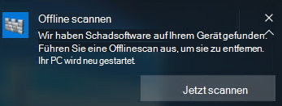

# <a name="run-and-review-the-results-of-a-microsoft-defender-offline-scan"></a>Ausführen und Überprüfen der Ergebnisse eines Microsoft Defender Offline-Scans

[!INCLUDE [Microsoft 365 Defender rebranding](../../includes/microsoft-defender.md)]


**Gilt für:**

- [Microsoft Defender für Endpunkt](/microsoft-365/security/defender-endpoint/)

Microsoft Defender Offline ist ein Antischalwarescantool, mit dem Sie eine Überprüfung aus einer vertrauenswürdigen Umgebung starten und ausführen können. Der Scan wird außerhalb des normalen Windows-Kernels ausgeführt, sodass er auf Schadsoftware zielen kann, die versucht, die Windows-Shell zu umgehen, z. B. Viren und Rootkits, die den Hauptstartdatensatz (Master Boot Record, MBR) infizieren oder überschreiben.

Sie können Microsoft Defender Offline verwenden, wenn Sie eine Schadsoftwareinfektion vermuten oder eine sorgfältige Bereinigung des Endpunkts nach einem Schadsoftwareausbruch bestätigen möchten.

In Windows 10 können Microsoft Defender Offline mit einem Klick direkt aus der app [Windows-Sicherheit werden.](microsoft-defender-security-center-antivirus.md) In früheren Versionen von Windows musste ein Benutzer Microsoft Defender Offline zum Starten von Medien installieren, den Endpunkt neu starten und das startbare Medium laden.

## <a name="prerequisites-and-requirements"></a>Voraussetzungen und Anforderungen

Microsoft Defender Offline in Windows 10 hat die gleichen Hardwareanforderungen wie Windows 10. 

Weitere Informationen zu den Windows 10 finden Sie in den folgenden Themen:

- [Hardware-Mindestanforderungen](/windows-hardware/design/minimum/minimum-hardware-requirements-overview)

- [Hardwarekomponenten-Anleitungen](/windows-hardware/design/component-guidelines/components)

> [!NOTE]
> Microsoft Defender Offline wird nicht auf Computern mit ARM Prozessoren oder auf Windows Server Stock Keeping Units unterstützt.

Zum Ausführen Microsoft Defender Offline vom Endpunkt muss der Benutzer mit Administratorrechten angemeldet sein.
 
## <a name="microsoft-defender-offline-updates"></a>Microsoft Defender Offline Updates

Microsoft Defender Offline verwendet die neuesten auf dem Endpunkt verfügbaren Schutzupdates. sie wird immer dann aktualisiert, Windows Defender Antivirus aktualisiert wird. 

> [!NOTE]
> Bevor Sie einen Offlinescan ausführen, sollten Sie versuchen, den Microsoft Defender AV-Schutz zu aktualisieren. Sie können entweder ein Update mit Gruppenrichtlinien erzwingen oder updates normalerweise auf Endpunkten [bereitstellen,](https://www.microsoft.com/security/portal/definitions/adl.aspx)oder Sie können die neuesten Schutzupdates manuell aus dem Microsoft Center zum Schutz vor Malware.

Weitere Informationen [finden Sie im Thema Microsoft Defender Antivirus Security Intelligence Updates](manage-protection-updates-microsoft-defender-antivirus.md) verwalten.

## <a name="usage-scenarios"></a>Verwendungsszenarien

In Windows 10 Version 1607 können Sie einen Offlinescan manuell erzwingen. Wenn sie Windows Defender, dass Microsoft Defender Offline ausgeführt werden muss, wird der Benutzer auf dem Endpunkt aufgefordert. 

Die Notwendigkeit, eine Offlinescan durchzuführen, wird auch in Microsoft Endpoint Manager, wenn Sie sie zum Verwalten Ihrer Endpunkte verwenden.

Die Eingabeaufforderung kann über eine Benachrichtigung erfolgen, ähnlich der folgenden:



Der Benutzer wird auch innerhalb des Windows Defender benachrichtigt.

In Configuration Manager können Sie den Status von Endpunkten identifizieren, indem Sie zu **Monitoring > Overview > Security > Endpoint Protection Status > System Center Endpoint Protection Status navigieren.** 

Microsoft Defender Offline Überprüfungen werden unter **Malwarebehebungsstatus** als **Offlinescan erforderlich angegeben.**


## <a name="configure-notifications"></a>Konfigurieren von Benachrichtigungen

Microsoft Defender Offline Benachrichtigungen werden in derselben Richtlinieneinstellung wie andere Microsoft Defender AV-Benachrichtigungen konfiguriert.

Weitere Informationen zu Benachrichtigungen in Windows Defender finden Sie im Thema Konfigurieren der Benachrichtigungen, [die auf Endpunkten angezeigt](configure-notifications-microsoft-defender-antivirus.md) werden.

## <a name="run-a-scan"></a>Ausführen eines Scanvorgangs 

> [!IMPORTANT]
> Bevor Sie Microsoft Defender Offline, stellen Sie sicher, dass Sie alle Dateien speichern und ausgeführte Programme herunterfahren. Die Microsoft Defender Offline dauert ca. 15 Minuten. Der Endpunkt wird neu gestartet, wenn die Überprüfung abgeschlossen ist. Die Überprüfung wird außerhalb der üblichen Windows ausgeführt. Die Benutzeroberfläche wird anders angezeigt als eine normale Überprüfung, die von einem Windows Defender. Nach Abschluss der Überprüfung wird der Endpunkt neu gestartet, und Windows wird normal geladen.

Sie können eine Microsoft Defender Offline wie folgt ausführen:

- PowerShell
- Windows-Verwaltungsinstrumentation (WMI)
- Die Windows-Sicherheit App


### <a name="use-powershell-cmdlets-to-run-an-offline-scan"></a>Verwenden von PowerShell-Cmdlets zum Ausführen einer Offlinescan

Verwenden Sie die folgenden Cmdlets:

```PowerShell
Start-MpWDOScan
```

Unter [Verwenden von PowerShell-Cmdlets](use-powershell-cmdlets-microsoft-defender-antivirus.md) zum Konfigurieren und Ausführen von Microsoft Defender Antivirus- und [Defender-Cmdlets](/powershell/module/defender/) finden Sie weitere Informationen zur Verwendung von PowerShell mit Microsoft Defender Antivirus.

### <a name="use-windows-management-instruction-wmi-to-run-an-offline-scan"></a>Verwenden Windows Management Instruction (WMI) zum Ausführen eines Offlinescans

Verwenden [](/previous-versions/windows/desktop/legacy/dn455323(v=vs.85)) Sie die MSFT_MpWDOScan-Klasse, um eine Offlinescan ausführen.

Mit dem folgenden WMI-Skriptausschnitt wird sofort ein Microsoft Defender Offline-Scan ausgeführt, wodurch der Endpunkt neu gestartet, der Offlinescan ausgeführt und anschließend neu gestartet und gestartet Windows.

```console
wmic /namespace:\\root\Microsoft\Windows\Defender path MSFT_MpWDOScan call Start 
```

Weitere Informationen finden Sie im Folgenden:
- [Windows Defender WMIv2-APIs](/previous-versions/windows/desktop/defender/windows-defender-wmiv2-apis-portal)


### <a name="use-the-windows-defender-security-app-to-run-an-offline-scan"></a>Verwenden der Windows Defender-Sicherheits-App zum Ausführen einer Offlinescan

1. Öffnen Sie Windows-Sicherheit App, indem Sie auf das Schildsymbol in der Taskleiste klicken oder im Startmenü nach **Defender suchen.**

2. Klicken Sie **auf &** Kachel "Virenschutz" (oder auf das Schildsymbol auf der linken Menüleiste) und dann auf die **Bezeichnung Erweiterte** Überprüfung:
    
3. Wählen **Microsoft Defender Offline scan aus,** und klicken Sie **auf Jetzt überprüfen**.

    > [!NOTE]
    > In Windows 10 Version 1607 kann die Offlinescan unter **Windows Einstellungen** Update & security Windows Defender oder vom Windows Defender  >    >   ausgeführt werden.


## <a name="review-scan-results"></a>Überprüfen der Scanergebnisse

Microsoft Defender Offline Scanergebnisse werden im Abschnitt [Scanverlauf](microsoft-defender-security-center-antivirus.md)der app Windows-Sicherheit aufgelistet. 


## <a name="related-articles"></a>Verwandte Artikel

- [Anpassen, Initiieren und Überprüfen der Ergebnisse von Scans und Korrekturen](customize-run-review-remediate-scans-microsoft-defender-antivirus.md)
- [Microsoft Defender Antivirus in Windows 10](microsoft-defender-antivirus-in-windows-10.md)