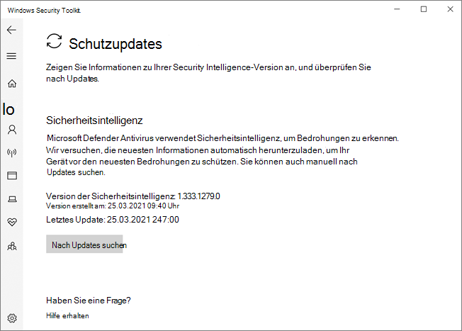

# Microsoft Defender Antivirus in der Windows Security-App

[!INCLUDE [Microsoft 365 Defender rebranding](../../includes/microsoft-defender.md)]

**Gilt für:**

- [Microsoft Defender für Endpunkt](/microsoft-365/security/defender-endpoint/)

In Windows 10, Version 1703 und höher, ist die Windows Defender-App Teil der Windows-Sicherheit.

Einstellungen, die zuvor Teil des Windows Defender-Clients und der wichtigsten Windows-Einstellungen waren, wurden kombiniert und in die neue App verschoben, die standardmäßig als Teil von Windows 10, Version 1703, installiert ist.

> [!IMPORTANT]
> Durch das Deaktivieren des Windows Security Center-Diensts wird Microsoft Defender Antivirus oder die [Windows Defender deaktiviert.](/windows/security/threat-protection/windows-firewall/windows-firewall-with-advanced-security) Diese werden automatisch deaktiviert, wenn ein Antiviren- oder Firewallprodukt eines Drittanbieters installiert und auf dem neuesten Stand gehalten wird.
>
> Wenn Sie den Windows Security Center-Dienst deaktivieren oder die zugehörigen Gruppenrichtlinieneinstellungen so konfigurieren, dass er nicht gestartet oder ausgeführt wird, zeigt die Windows-Sicherheits-App möglicherweise veraltete oder ungenaue Informationen zu Antiviren- oder Firewallprodukten an, die Sie auf dem Gerät installiert haben.
> Es kann auch verhindern, dass sich Microsoft Defender Antivirus selbst aktiviert, wenn Sie über einen alten oder veralteten Antivirenprogramm eines Drittanbieters verfügen oder wenn Sie Antivirenprodukte von Drittanbietern deinstallieren, die Sie möglicherweise zuvor installiert haben.
> Dies verringert den Schutz Ihres Geräts erheblich und kann zu einer Schadsoftwareinfektion führen.

Weitere Informationen [zu anderen Windows-Sicherheitsfeatures,](/windows/threat-protection/windows-defender-security-center/windows-defender-security-center) die in der App überwacht werden können, finden Sie im Artikel windows security.

Die Windows Security-App ist eine Clientschnittstelle unter Windows 10, Version 1703 und höher. Es ist nicht das Microsoft Defender Security Center-Webportal, das zum Überprüfen und Verwalten von [Microsoft Defender for Endpoint verwendet wird.](/microsoft-365/security/defender-endpoint/microsoft-defender-endpoint)

## Überprüfen der Viren- und Bedrohungsschutzeinstellungen in der Windows-Sicherheits-App

1. Öffnen Sie die Windows Security-App, indem Sie auf das Schildsymbol in der Aufgabenleiste klicken oder im Startmenü nach **Defender suchen.**

2. Wählen Sie **die Kachel & Virenschutz** (oder das Schildsymbol auf der linken Menüleiste) aus.
   
In den folgenden Abschnitten wird beschrieben, wie Sie einige der am häufigsten verwendeten Aufgaben beim Überprüfen oder Interagieren mit dem von Microsoft Defender Antivirus in der Windows Security-App bereitgestellten Bedrohungsschutz ausführen.

> [!NOTE]
> Wenn diese Einstellungen mithilfe von Gruppenrichtlinien konfiguriert und bereitgestellt werden, sind die in diesem Abschnitt beschriebenen Einstellungen ausgegraut und für die Verwendung auf einzelnen Endpunkten nicht verfügbar. Änderungen, die über ein Gruppenrichtlinienobjekt vorgenommen werden, müssen zuerst auf einzelnen Endpunkten bereitgestellt werden, bevor die Einstellung in den Windows-Einstellungen aktualisiert wird. Im [Thema Konfigurieren der Endbenutzerinteraktion mit Microsoft Defender Antivirus](configure-end-user-interaction-microsoft-defender-antivirus.md) wird beschrieben, wie Lokale Richtlinienüberschreibungseinstellungen konfiguriert werden können.

## Ausführen einer Überprüfung mit der Windows Security-App

1. Öffnen Sie die Windows Security-App, indem Sie im Startmenü nach **Sicherheit suchen** und **dann Windows Security auswählen.**

2. Wählen Sie **die Kachel & Virenschutz** (oder das Schildsymbol auf der linken Menüleiste) aus.

3. Wählen Sie **Schnellscan aus.** Wenn Sie einen vollständigen Scan ausführen möchten, wählen Sie **Scanoptionen** aus, und wählen Sie dann eine Option aus, z. B. **Vollständige Überprüfung.**

## Überprüfen Sie die Version des Security Intelligence-Updates, und laden Sie die neuesten Updates in der Windows Security App herunter.

1. Öffnen Sie die Windows Security-App, indem Sie im Startmenü nach *Sicherheit suchen* und **dann Windows Security auswählen.**

2. Wählen Sie **die Kachel & Virenschutz** (oder das Schildsymbol auf der linken Menüleiste) aus.

3. Wählen **Sie Virenschutzupdates & Bedrohungsschutz aus.** Die aktuell installierte Version wird zusammen mit einigen Informationen zum Download angezeigt. Sie können Ihre aktuelle Version mit der neuesten Version überprüfen, die für den manuellen Download verfügbar ist, oder das Änderungsprotokoll für diese Version überprüfen. Weitere [Informationen finden Sie unter Security Intelligence updates for Microsoft Defender Antivirus and other Microsoft anmalware](https://www.microsoft.com/en-us/wdsi/defenderupdates).

4. Wählen **Sie Nach Updates suchen aus,** um neue Schutzupdates herunterzuladen (sofern verfügbar).

## Sicherstellen, dass Microsoft Defender Antivirus in der Windows-Sicherheits-App aktiviert ist

1. Öffnen Sie die Windows Security-App, indem Sie im Startmenü nach *Sicherheit suchen* und **dann Windows Security auswählen.**

2. Wählen Sie **die Kachel & Virenschutz** (oder das Schildsymbol auf der linken Menüleiste) aus.

3. Wählen **Sie Virenschutzeinstellungen & Bedrohungsschutz aus.**

4. Umschalten Sie **die Option Echtzeitschutz** auf **Ein**.

    > [!NOTE]
    > Wenn Sie den **Echtzeitschutz deaktivieren,** wird er nach kurzer Verzögerung automatisch wieder aktiviert. Dadurch wird sichergestellt, dass Sie vor Schadsoftware und Bedrohungen geschützt sind.
    > Wenn Sie ein anderes Antivirenprodukt installieren, deaktiviert sich Microsoft Defender Antivirus automatisch selbst und wird als solches in der Windows Security-App angegeben. Es wird eine Einstellung angezeigt, mit der Sie eine eingeschränkte regelmäßige [Überprüfung aktivieren können.](limited-periodic-scanning-microsoft-defender-antivirus.md)

## Hinzufügen von Ausschlüssen für Microsoft Defender Antivirus in der Windows Security-App

1. Öffnen Sie die Windows Security-App, indem Sie im Startmenü nach *Sicherheit suchen* und **dann Windows Security auswählen.**

2. Wählen Sie **die Kachel & Virenschutz** (oder das Schildsymbol auf der linken Menüleiste) aus.

3. Wählen Sie **unter Einstellungen verwalten** die Option **Virenschutz & Bedrohungsschutzeinstellungen aus.**

4. Wählen Sie unter der Einstellung **Ausschlüsse** die Option **Ausschlüsse hinzufügen oder entfernen aus.** 

5. Wählen Sie das Plussymbol ( **+** ) aus, um den Typ auszuwählen und die Optionen für jeden Ausschluss festlegen. 

In der folgenden Tabelle werden Ausschlusstypen und die folgenden Schritte zusammengefasst:

|Ausschlusstyp  |Definiert durch  |Aktionen  |
|---------|---------|---------|
|**Datei** |Speicherort  Beispiel: `c:\sample\sample.test` |Die spezifische Datei wird von Microsoft Defender Antivirus übersprungen. |
|**Folder**    |Speicherort  Beispiel: `c:\test\sample`       |Alle Elemente im angegebenen Ordner werden von Microsoft Defender Antivirus übersprungen.         |
|**Dateityp**   |Dateierweiterung  Beispiel: `.test` |Alle Dateien mit der Erweiterung auf Ihrem `.test` Gerät werden von Microsoft Defender Antivirus übersprungen.         |
|**Prozess**     |Pfad der ausführbaren Datei  Beispiel: `c:\test\process.exe`         |Der spezifische Prozess und alle Dateien, die von diesem Prozess geöffnet werden, werden von Microsoft Defender Antivirus übersprungen.         |

Weitere Informationen hierzu finden Sie in den folgenden Ressourcen:
- [Konfigurieren und Überprüfen von Ausschlüssen basierend auf Dateierweiterung und Ordnerspeicherort](./configure-extension-file-exclusions-microsoft-defender-antivirus.md) 
- [Konfigurieren von Ausschlüssen für Dateien, die von Prozessen geöffnet werden](./configure-process-opened-file-exclusions-microsoft-defender-antivirus.md)

## Überprüfen des Verlaufs der Bedrohungserkennung in Windows Defender Security Center-App

1. Öffnen Sie die Windows Security-App, indem Sie im Startmenü nach *Sicherheit suchen* und **dann Windows Security auswählen.**

2. Wählen Sie **die Kachel & Virenschutz** (oder das Schildsymbol auf der linken Menüleiste) aus.

3. Wählen **Sie Schutzverlauf aus.** Alle zuletzt verwendeten Elemente werden aufgelistet.

## Festlegen von Schutz- und Wiederherstellungsoptionen für Ransomware

1. Öffnen Sie die Windows Security-App, indem Sie im Startmenü nach *Sicherheit suchen* und **dann Windows Security auswählen.**

2. Wählen Sie **die Kachel & Virenschutz** (oder das Schildsymbol auf der linken Menüleiste) aus.

3. Wählen **Sie unter Ransomware-Schutz** die Option **Ransomware-Schutz verwalten aus.**

4. Informationen zum **Ändern der Einstellungen für den kontrollierten** Ordnerzugriff finden Sie unter Schützen wichtiger Ordner mit [kontrolliertem Ordnerzugriff.](/microsoft-365/security/defender-endpoint/controlled-folders)

5. Zum Einrichten von Ransomware-Wiederherstellungsoptionen wählen Sie Unter **Ransomware** Datenwiederherstellung einrichten aus, und folgen Sie den Anweisungen zum Verknüpfen oder Einrichten Ihres #A0 , damit Sie sich problemlos von einem Ransomware-Angriff wiederherstellen können. 

## Siehe auch
- [Microsoft Defender Antivirus](microsoft-defender-antivirus-in-windows-10.md)