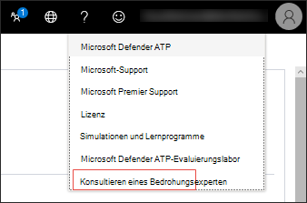

# Microsoft-Bedrohungsexperten

[!INCLUDE [Microsoft 365 Defender rebranding](../../includes/microsoft-defender.md)]

**Gilt für:**
- [Microsoft Defender für Endpunkt](https://go.microsoft.com/fwlink/p/?linkid=2154037)
- [Microsoft 365 Defender](https://go.microsoft.com/fwlink/?linkid=2118804)

> Möchten Sie Microsoft Defender for Endpoint erleben? [Registrieren Sie sich für eine kostenlose Testversion.](https://www.microsoft.com/microsoft-365/windows/microsoft-defender-atp?ocid=docs-wdatp-exposedapis-abovefoldlink)

Microsoft-Bedrohungsexperten ist ein verwalteter Bedrohungssuchedienst, der Ihren Security Operation Centers (SOCs) Überwachung und Analyse auf Expertenebene bietet, um sicherzustellen, dass kritische Bedrohungen in Ihren einzigartigen Umgebungen nicht übersehen werden.
  
Dieser dienst für die Suche nach verwalteten Bedrohungen bietet expertengesteuerte Einblicke und Daten über diese beiden Funktionen: gezielte Angriffsbenachrichtigung und Zugriff auf Experten bei Bedarf.

## Bevor Sie beginnen 
> [!NOTE]
> Besprechen Sie die Berechtigungsanforderungen mit Ihrem Microsoft Technical Service-Anbieter und Ihrem Kontoteam, bevor Sie sich auf den dienst für die Suche nach verwalteten Bedrohungen bewerben.

Wenn Sie Microsoft Defender for Endpoint-Kunde sind, müssen Sie sich für **Microsoft-Bedrohungsexperten – Targeted Attack Notifications** bewerben, um spezielle Einblicke und Analysen zu erhalten, die ihnen helfen, die wichtigsten Bedrohungen in Ihrer Umgebung zu identifizieren, damit Sie schnell darauf reagieren können.

Um sich bei Microsoft-Bedrohungsexperten – Vorteile für gezielte Angriffsbenachrichtigungen zu registrieren, wechseln Sie zu **Einstellungen** Allgemeine erweiterte Features  >    >    >  **Microsoft-Bedrohungsexperten – Benachrichtigungen** für gezielte Angriffe, die angewendet werden sollen. Sobald sie akzeptiert wurden, erhalten Sie die Vorteile von Benachrichtigungen über gezielte Angriffe.

Wenden Sie sich an Ihr Kontoteam oder Ihren Microsoft-Vertreter, um **Microsoft-Bedrohungsexperten – Experten** bei Bedarf zu abonnieren, um sich mit unseren Bedrohungsexperten zu relevanten Erkennungen und Gegnern in Ihrer Organisation zu beraten.

Weitere [Informationen finden Sie unter Configure Microsoft-Bedrohungsexperten capabilities.](https://docs.microsoft.com/microsoft-365/security/defender-endpoint/configure-microsoft-threat-experts#before-you-begin) 

## Microsoft-Bedrohungsexperten – Benachrichtigung über gezielte Angriffe 
Microsoft-Bedrohungsexperten – Die Benachrichtigung über gezielte Angriffe bietet eine proaktive Suche nach den wichtigsten Bedrohungen für Ihr Netzwerk, einschließlich Angriffen von menschlichen Angreifern, Hand-auf-Tastatur-Angriffen oder erweiterten Angriffen wie Cyberspionage. Diese Benachrichtigungen werden als neue Warnung angezeigt. Der verwaltete Suchesdienst umfasst:  
- Überwachung und Analyse von Bedrohungen, Reduzierung der Verweilzeit und des Risikos für das Unternehmen 
- Von Jägern geschulte künstliche Intelligenz zum Ermitteln und Priorisieren bekannter und unbekannter Angriffe  
- Identifizieren der wichtigsten Risiken, die so beitragen, dass SOCs Zeit und Energie maximieren 
- Umfang der Kompromisse und so viel Kontext, wie schnell zugestellt werden kann, um eine schnelle SOC-Antwort zu ermöglichen. 
 
## Microsoft-Bedrohungsexperten – Experten bei Bedarf
Kunden können unsere Sicherheitsexperten direkt innerhalb der Microsoft Defender Security Center für eine zeitnahe und genaue Antwort. Experten bieten Einblicke, die erforderlich sind, um die komplexen Bedrohungen, die Ihre Organisation betreffen, besser zu verstehen, von Warnungsanfragen, potenziell gefährdeten Geräten, der Hauptursache einer verdächtigen Netzwerkverbindung bis zu zusätzlicher Bedrohungsintelligenz im Zusammenhang mit laufenden erweiterten Kampagnen für dauerhafte Bedrohungen. Mit dieser Funktion können Sie:
- Weitere Erläuterungen zu Warnungen, einschließlich der Ursache oder des Umfangs des Vorfalls, erhalten 
- Verschaffen Sie sich Klarheit über das Verhalten verdächtiger Geräte und die nächsten Schritte, wenn sie mit einem erweiterten Angreifer konfrontiert werden  
- Bestimmen des Risikos und des Schutzes von Bedrohungsakteuren, Kampagnen oder neuen Angreifertechniken 

Die Option, **einen Bedrohungsexperten** zu konsultieren, steht an mehreren Stellen im Portal zur Verfügung, sodass Sie im Rahmen Ihrer Untersuchung mit Experten interagieren können:

- <i>**Hilfe- und Supportmenü**</i> 

- <i>**Menü "Geräteseitenaktionen"**</i> 

- <i>**Menü Benachrichtigungen für Seitenaktionen**</i> 

- <i>**Menü "Dateiseitenaktionen"**</i> 

> [!NOTE]
> Wenn Sie den Status Ihrer Experts on Demand-Fälle über Microsoft Services Hub nachverfolgen möchten, erreichen Sie Ihren Technical Account Manager. 

Sehen Sie sich dieses Video an, um einen schnellen Überblick über den Microsoft Services Hub zu erhalten.

>[!VIDEO https://www.microsoft.com/videoplayer/embed/RE4pk9f] 

   
## Verwandtes Thema
- [Konfigurieren Microsoft-Bedrohungsexperten Funktionen](configure-microsoft-threat-experts.md)
