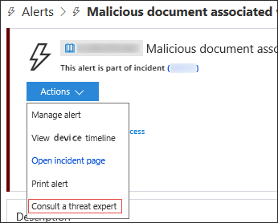
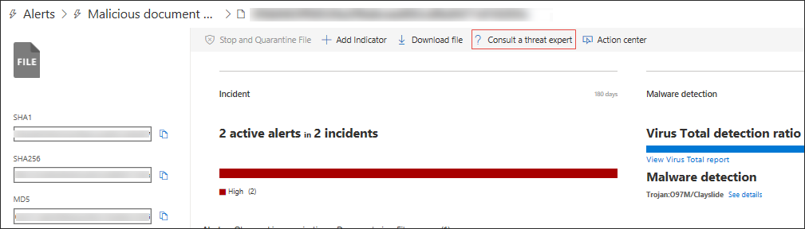

# Microsoft-BedrohungsexpertenMicrosoft Threat Experts

[!INCLUDE [Microsoft 365 Defender rebranding](../../includes/microsoft-defender.md)]

**Gilt für:****Applies to:**
- [Microsoft Defender für EndpunktMicrosoft Defender for Endpoint](https://go.microsoft.com/fwlink/p/?linkid=2154037)
- [Microsoft 365 DefenderMicrosoft 365 Defender](https://go.microsoft.com/fwlink/?linkid=2118804)

> Möchten Sie Microsoft Defender for Endpoint erleben?Want to experience Microsoft Defender for Endpoint? [Registrieren Sie sich für eine kostenlose Testversion.Sign up for a free trial.](https://www.microsoft.com/microsoft-365/windows/microsoft-defender-atp?ocid=docs-wdatp-exposedapis-abovefoldlink)

Microsoft-Bedrohungsexperten ist ein verwalteter Bedrohungssuchedienst, der Ihren Security Operation Centers (SOCs) Überwachung und Analyse auf Expertenebene bietet, um sicherzustellen, dass kritische Bedrohungen in Ihren einzigartigen Umgebungen nicht übersehen werden.Microsoft Threat Experts is a managed threat hunting service that provides your Security Operation Centers (SOCs) with expert level monitoring and analysis to help them ensure that critical threats in your unique environments don’t get missed.
  
Dieser dienst für die Suche nach verwalteten Bedrohungen bietet expertengesteuerte Einblicke und Daten über diese beiden Funktionen: gezielte Angriffsbenachrichtigung und Zugriff auf Experten bei Bedarf.This managed threat hunting service provides expert-driven insights and data through these two capabilities: targeted attack notification and access to experts on demand.

## Bevor Sie beginnenBefore you begin 
> [!NOTE]
> Besprechen Sie die Berechtigungsanforderungen mit Ihrem Microsoft Technical Service-Anbieter und Ihrem Kontoteam, bevor Sie sich auf den dienst für die Suche nach verwalteten Bedrohungen bewerben.Discuss the eligibility requirements with your Microsoft Technical Service provider and account team before you apply to the managed threat hunting service.

Wenn Sie Microsoft Defender for Endpoint-Kunde sind, müssen Sie sich für **Microsoft-Bedrohungsexperten – Targeted Attack Notifications** bewerben, um spezielle Einblicke und Analysen zu erhalten, die ihnen helfen, die wichtigsten Bedrohungen in Ihrer Umgebung zu identifizieren, damit Sie schnell darauf reagieren können.If you're a Microsoft Defender for Endpoint customer, you need to apply for **Microsoft Threat Experts - Targeted Attack Notifications** to get special insights and analysis that help identify the most critical threats in your environment so you can respond to them quickly

Um sich bei Microsoft-Bedrohungsexperten – Vorteile für gezielte Angriffsbenachrichtigungen zu registrieren, wechseln Sie zu **Einstellungen** Allgemeine erweiterte Features  >    >    >  **Microsoft-Bedrohungsexperten – Benachrichtigungen** für gezielte Angriffe, die angewendet werden sollen.To enroll to Microsoft Threat Experts - Targeted Attack Notifications benefits, go to **Settings** > **General** > **Advanced features** > **Microsoft Threat Experts - Targeted Attack Notifications** to apply. Sobald sie akzeptiert wurden, erhalten Sie die Vorteile von Benachrichtigungen über gezielte Angriffe.Once accepted, you will get the benefits of Targeted Attack Notifications.

Wenden Sie sich an Ihr Kontoteam oder Ihren Microsoft-Vertreter, um **Microsoft-Bedrohungsexperten – Experten** bei Bedarf zu abonnieren, um sich mit unseren Bedrohungsexperten zu relevanten Erkennungen und Gegnern in Ihrer Organisation zu beraten.Contact your account team or Microsoft representative to subscribe to **Microsoft Threat Experts - Experts on Demand** to consult with our threat experts on relevant detections and adversaries that your organization is facing.

Weitere [Informationen finden Sie unter Configure Microsoft-Bedrohungsexperten capabilities.](https://docs.microsoft.com/microsoft-365/security/defender-endpoint/configure-microsoft-threat-experts#before-you-begin)See [Configure Microsoft Threat Experts capabilities](https://docs.microsoft.com/microsoft-365/security/defender-endpoint/configure-microsoft-threat-experts#before-you-begin) for details. 

## Microsoft-Bedrohungsexperten – Benachrichtigung über gezielte AngriffeMicrosoft Threat Experts - Targeted attack notification 
Microsoft-Bedrohungsexperten – Die Benachrichtigung über gezielte Angriffe bietet eine proaktive Suche nach den wichtigsten Bedrohungen für Ihr Netzwerk, einschließlich Angriffen von menschlichen Angreifern, Hand-auf-Tastatur-Angriffen oder erweiterten Angriffen wie Cyberspionage.Microsoft Threat Experts - Targeted attack notification provides proactive hunting for the most important threats to your network, including human adversary intrusions, hands-on-keyboard attacks, or advanced attacks like cyber-espionage. Diese Benachrichtigungen werden als neue Warnung angezeigt.These notifications shows up as a new alert. Der verwaltete Suchesdienst umfasst:The managed hunting service includes:  
- Überwachung und Analyse von Bedrohungen, Reduzierung der Verweilzeit und des Risikos für das UnternehmenThreat monitoring and analysis, reducing dwell time and risk to the business 
- Von Jägern geschulte künstliche Intelligenz zum Ermitteln und Priorisieren bekannter und unbekannter AngriffeHunter-trained artificial intelligence to discover and prioritize both known and unknown attacks  
- Identifizieren der wichtigsten Risiken, die so beitragen, dass SOCs Zeit und Energie maximierenIdentifying the most important risks, helping SOCs maximize time and energy 
- Umfang der Kompromisse und so viel Kontext, wie schnell zugestellt werden kann, um eine schnelle SOC-Antwort zu ermöglichen.Scope of compromise and as much context as can be quickly delivered to enable fast SOC response. 
 
## Microsoft-Bedrohungsexperten – Experten bei BedarfMicrosoft Threat Experts - Experts on Demand
Kunden können unsere Sicherheitsexperten direkt innerhalb der Microsoft Defender Security Center für eine zeitnahe und genaue Antwort.Customers can engage our security experts directly from within Microsoft Defender Security Center for timely and accurate response. Experten bieten Einblicke, die erforderlich sind, um die komplexen Bedrohungen, die Ihre Organisation betreffen, besser zu verstehen, von Warnungsanfragen, potenziell gefährdeten Geräten, der Hauptursache einer verdächtigen Netzwerkverbindung bis zu zusätzlicher Bedrohungsintelligenz im Zusammenhang mit laufenden erweiterten Kampagnen für dauerhafte Bedrohungen.Experts provide insights needed to better understand the complex threats affecting your organization, from alert inquiries, potentially compromised devices, root cause of a suspicious network connection, to additional threat intelligence regarding ongoing advanced persistent threat campaigns. Mit dieser Funktion können Sie:With this capability, you can:
- Weitere Erläuterungen zu Warnungen, einschließlich der Ursache oder des Umfangs des Vorfalls, erhaltenGet additional clarification on alerts including root cause or scope of the incident 
- Verschaffen Sie sich Klarheit über das Verhalten verdächtiger Geräte und die nächsten Schritte, wenn sie mit einem erweiterten Angreifer konfrontiert werdenGain clarity into suspicious device behavior and next steps if faced with an advanced attacker  
- Bestimmen des Risikos und des Schutzes von Bedrohungsakteuren, Kampagnen oder neuen AngreifertechnikenDetermine risk and protection regarding threat actors, campaigns, or emerging attacker techniques 

Die Option, **einen Bedrohungsexperten** zu konsultieren, steht an mehreren Stellen im Portal zur Verfügung, sodass Sie im Rahmen Ihrer Untersuchung mit Experten interagieren können:The option to **Consult a threat expert** is available in several places in the portal so you can engage with experts in the context of your investigation:

- <i>**Hilfe- und Supportmenü**</i><i>**Help and support menu**</i> 

- <i>**Menü "Geräteseitenaktionen"**</i><i>**Device page actions menu**</i> 

- <i>**Menü Benachrichtigungen für Seitenaktionen**</i><i>**Alerts page actions menu**</i> 

- <i>**Menü "Dateiseitenaktionen"**</i><i>**File page actions menu**</i> 

> [!NOTE]
> Wenn Sie den Status Ihrer Experts on Demand-Fälle über Microsoft Services Hub nachverfolgen möchten, erreichen Sie Ihren Technical Account Manager.If you would like to track the status of your Experts on Demand cases through Microsoft Services Hub, reach out to your Technical Account Manager. 

Sehen Sie sich dieses Video an, um einen schnellen Überblick über den Microsoft Services Hub zu erhalten.Watch this video for a quick overview of the Microsoft Services Hub.

>[!VIDEO https://www.microsoft.com/videoplayer/embed/RE4pk9f] 

   
## Verwandtes ThemaRelated topic
- [Konfigurieren Microsoft-Bedrohungsexperten FunktionenConfigure Microsoft Threat Experts capabilities](configure-microsoft-threat-experts.md)
