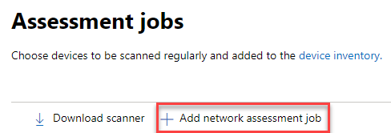

# Netzwerkgeräteerkennung und SicherheitsrisikoverwaltungNetwork device discovery and vulnerability management

[!INCLUDE [Microsoft 365 Defender rebranding](../../includes/microsoft-defender.md)]

**Gilt für:****Applies to:**

- [Microsoft Defender für EndpunktMicrosoft Defender for Endpoint](https://go.microsoft.com/fwlink/?linkid=2154037)
- [Bedrohungs- und SicherheitsrisikoverwaltungThreat and vulnerability management](next-gen-threat-and-vuln-mgt.md)
- [Microsoft 365 DefenderMicrosoft 365 Defender](https://go.microsoft.com/fwlink/?linkid=2118804)

> [!IMPORTANT]
> **Das Scannen und Verwalten von Netzwerkgeräten befindet sich derzeit in der öffentlichen Vorschau.****Scanning and managing network devices is currently in public preview** 
> Diese Vorschauversion wird ohne Vereinbarung zum Servicelevel bereitgestellt und wird für Produktionsworkloads nicht empfohlen.This preview version is provided without a service level agreement, and it's not recommended for production workloads. Bestimmte Features werden möglicherweise nicht unterstützt oder verfügen möglicherweise über eingeschränkte Funktionen.Certain features might not be supported or might have constrained capabilities.
> Weitere Informationen finden Sie unter [Microsoft Defender for Endpoint Preview Features](preview.md).For more information, see [Microsoft Defender for Endpoint preview features](preview.md).

>Möchten Sie Microsoft Defender for Endpoint erleben?Want to experience Microsoft Defender for Endpoint? [Registrieren Sie sich für eine kostenlose Testversion.Sign up for a free trial.](https://www.microsoft.com/microsoft-365/windows/microsoft-defender-atp?ocid=docs-wdatp-portaloverview-abovefoldlink)

Netzwerkerkennungsfunktionen sind im  Abschnitt Gerätebestand des Microsoft 365 Security Center und der Microsoft Defender Security Center-Konsolen verfügbar.Network discovery capabilities are available in the **Device inventory** section of the Microsoft 365 security center and Microsoft Defender Security Center consoles.  

Für jedes Netzwerksegment wird ein bestimmtes Microsoft Defender for Endpoint-Gerät verwendet, um regelmäßig authentifizierte Scans vorkonfigurierter Netzwerkgeräte durchzuführen.A designated Microsoft Defender for Endpoint device will be used on each network segment to perform periodic authenticated scans of preconfigured network devices. Nach dem Entdecken bieten die Bedrohungs- und Sicherheitsmanagementfunktionen von Defender for Endpoint integrierte Workflows, um ermittelte Switches, Router, WLAN-Controller, Firewalls und VPN-Gateways zu sichern.Once discovered, Defender for Endpoint’s threat and vulnerability management capabilities provide integrated workflows to secure discovered switches, routers, WLAN controllers, firewalls, and VPN gateways.  

Sobald die Netzwerkgeräte erkannt und klassifiziert wurden, können Sicherheitsadministratoren die neuesten Sicherheitsempfehlungen erhalten und die kürzlich entdeckten Sicherheitsrisiken für in ihren Organisationen bereitgestellte Netzwerkgeräte überprüfen.Once the network devices are discovered and classified, security administrators will be able to receive the latest security recommendations and review recently discovered vulnerabilities foron network devices deployed across their organizations.

## AnsatzApproach

Netzwerkgeräte werden nicht als Standardendpunkte verwaltet, da Defender for Endpoint keinen Sensor in die Netzwerkgeräte selbst integrierte.Network devices are not managed as standard endpoints since Defender for Endpoint doesn’t have a sensor built into the network devices themselves. Diese Gerätetypen erfordern einen agentlosen Ansatz, bei dem eine Remotescan die erforderlichen Informationen von den Geräten erhält.These types of devices require an agentless approach where a remote scan will obtain the necessary information from the devices. Je nach Netzwerktopologie und -merkmalen führt ein einzelnes Gerät oder einige wenige In Microsoft Defender for Endpoint integrierte Geräte authentifizierte Scans von Netzwerkgeräten mithilfe von SNMP durch (schreibgeschützt).Depending on the network topology and characteristics, a single device or a few devices onboarded to Microsoft Defender for Endpoint will perform authenticated scans of network devices using SNMP (read-only).

Es gibt zwei Arten von Geräten, die Sie beachten sollten:There will be two types of devices to keep in mind:

- **Bewertungsgerät:** Ein Gerät, das bereits onboarded ist, mit dem Sie die Netzwerkgeräte überprüfen.**Assessment device**: A device that's already onboarded that you'll use to scan the network devices.
- **Netzwerkgeräte:** Die Netzwerkgeräte, die Sie überprüfen und onboarden möchten.**Network devices**: The network devices you plan to scan and onboard.

### Sicherheitsrisikoverwaltung für NetzwerkgeräteVulnerability management for network devices 

Sobald die Netzwerkgeräte erkannt und klassifiziert wurden, können Sicherheitsadministratoren die neuesten Sicherheitsempfehlungen erhalten und kürzlich festgestellte Sicherheitsrisiken auf Netzwerkgeräten überprüfen, die in ihren Organisationen bereitgestellt wurden.Once the network devices are discovered and classified, security administrators will be able to receive the latest security recommendations and review recently discovered vulnerabilities on network devices deployed across their organizations.  

## Unterstützte BetriebssystemeOperating systems that are supported

Die folgenden Betriebssysteme werden derzeit unterstützt:The following operating systems are currently supported:

- Cisco IOS, IOS-XE, NX-OSCisco IOS, IOS-XE, NX-OS
- Juniper JUNOSJuniper JUNOS
- HPE ArubaOS, Procurve Switch SoftwareHPE ArubaOS, Procurve Switch Software
- Palo Alto Networks PAN-OSPalo Alto Networks PAN-OS

Weitere Netzwerkanbieter und Betriebssysteme werden im Laufe der Zeit hinzugefügt, basierend auf daten, die aus der Kundennutzung gesammelt werden.More networking vendors and OS will be added over time, based on data gathered from customer usage. Daher wird empfohlen, alle Netzwerkgeräte zu konfigurieren, auch wenn sie nicht in dieser Liste angegeben sind.Therefore, you are encouraged to configure all your network devices, even if they’re not specified in this list.

## Erste SchritteHow to get started

Im ersten Schritt wählen Sie ein Gerät aus, auf dem die authentifizierten Netzwerkscans ausgeführt werden.Your first step is to select a device that will perform the authenticated network scans.

1. Entscheiden Sie sich für ein integriertes Defender for Endpoint-Gerät (Client oder Server), das über eine Netzwerkverbindung zum Verwaltungsport für die Netzwerkgeräte verfügt, die Sie scannen möchten.Decide on a Defender for Endpoint onboarded device (client or server) that has a network connection to the management port for the network devices you plan on scanning. 

2. Der SNMP-Datenverkehr zwischen dem Defender for Endpoint-Bewertungsgerät und den zielgerichteten Netzwerkgeräten muss zulässig sein (z. B. durch die Firewall).SNMP traffic between the Defender for Endpoint assessment device and the targeted network devices must be allowed (for example, by the Firewall).

3. Entscheiden Sie, welche Netzwerkgeräte auf Sicherheitsrisiken geprüft werden (z. B. ein Cisco Switch oder eine Palo Alto Networks-Firewall).Decide which network devices will be assessed for vulnerabilities (for example: a Cisco switch or a Palo Alto Networks firewall).  

4. Stellen Sie sicher, dass SNMP schreibgeschützt auf allen konfigurierten Netzwerkgeräten aktiviert ist, damit das Defender for Endpoint-Bewertungsgerät die konfigurierten Netzwerkgeräte abfragen kann.Make sure SNMP read-only is enabled on all configured network devices to allow the Defender for Endpoint assessment device to query the configured network devices. "SNMP write" ist für die ordnungsgemäße Funktionalität dieses Features nicht erforderlich.‘SNMP write’ isn't needed for the proper functionality of this feature.

5. Rufen Sie die IP-Adressen der zu scannenden Netzwerkgeräte ab (oder die Subnetze, in denen diese Geräte bereitgestellt werden).Obtain the IP addresses of the network devices to be scanned (or the subnets where these devices are deployed).

6. Rufen Sie die SNMP-Anmeldeinformationen der Netzwerkgeräte ab (z. B. Community String, noAuthNoPriv, authNoPriv, authPriv).Obtain the SNMP credentials of the network devices (for example: Community String, noAuthNoPriv, authNoPriv, authPriv). Sie müssen die Anmeldeinformationen beim Konfigurieren eines neuen Bewertungsauftrags angeben.You’ll be required to provide the credentials when configuring a new assessment job.  

7. Proxyclientkonfiguration: Außer den Anforderungen des Defender for Endpoint-Geräteproxys ist keine zusätzliche Konfiguration erforderlich.Proxy client configuration: No extra configuration is required other than the Defender for Endpoint device proxy requirements.

8. Damit der Netzwerkscanner authentifiziert werden kann und ordnungsgemäß funktioniert, müssen Sie unbedingt die folgenden Domänen/URLs hinzufügen:To allow the network scanner to be authenticated and work properly, it's essential that you add the following domains/URLs:

    - login.windows.netlogin.windows.net  
    - \*.securitycenter.windows.com\*.securitycenter.windows.com
    - login.microsoftonline.comlogin.microsoftonline.com
    - *.blob.core.windows.net/networkscannerstable/**.blob.core.windows.net/networkscannerstable/*

    Hinweis: Diese URLs sind nicht in der dokumentierten Liste der zulässigen Datensammlungen von Defender for Endpoint angegeben.Note: These URLs are not specified in the Defender for Endpoint documented list of allowed data collection.

## BerechtigungenPermissions

Zum Konfigurieren von Bewertungsaufträgen ist die folgende Benutzerberechtigungsoption erforderlich: **Verwalten von Sicherheitseinstellungen in Security Center**.To configure assessment jobs, the following user permission option is required: **Manage security settings in Security Center**. Sie können die Berechtigung finden, indem Sie zu **Einstellungen**  >  **Rollen .**You can find the permission by going to **Settings** > **Roles**. Weitere Informationen finden Sie unter [Erstellen und Verwalten von Rollen für die rollenbasierte Zugriffssteuerung.](user-roles.md)For more information, see [Create and manage roles for role-based access control](user-roles.md)

## Installieren des NetzwerkscannersInstall the network scanner

1. Wechseln Sie **zu Microsoft 365 Security**  >  **Settings**  >  **Endpoints**  >  **Assessment jobs** (under 'Network assessments').Go to **Microsoft 365 security** > **Settings** > **Endpoints** > **Assessment jobs** (under 'Network assessments').
    1. Wechseln Sie im Microsoft Defender Security Center zur Seite Einstellungen > Bewertungsaufträge.In the Microsoft Defender Security Center, go to Settings > Assessment jobs page.

2. Laden Sie den Netzwerkscanner herunter, und installieren Sie ihn auf dem dafür vorgesehenen Defender for Endpoint-Bewertungsgerät.Download the network scanner and install it on the designated Defender for Endpoint assessment device.

## Netzwerkscannerinstallation & RegistrierungNetwork scanner installation & registration

Der Anmeldungsprozess kann auf dem festgelegten Bewertungsgerät selbst oder auf einem anderen Gerät (z. B. Ihrem persönlichen Clientgerät) abgeschlossen werden.The signing-in process can be completed on the designated assessment device itself or any other device (for example, your personal client device).

So führen Sie den Registrierungsprozess für Netzwerkscanner aus:To complete the network scanner registration process:

1. Kopieren Und folgen Sie der URL, die in der Befehlszeile angezeigt wird, und verwenden Sie den bereitgestellten Installationscode, um den Registrierungsprozess abzuschließen.Copy and follow the URL that appears on the command line and use the provided installation code to complete the registration process.
    - Hinweis: Möglicherweise müssen Sie die Eingabeaufforderungseinstellungen ändern, um die URL kopieren zu können.Note: You may need to change Command Prompt settings to be able to copy the URL.

2. Geben Sie den Code ein, und melden Sie sich mit einem Microsoft-Konto an, das die Defender for Endpoint-Berechtigung "Sicherheitseinstellungen in Security Center verwalten" besitzt.Enter the code and sign in using a Microsoft account that has the Defender for Endpoint permission called "Manage security settings in Security Center."

3. Wenn Sie fertig sind, sollte eine Meldung angezeigt werden, in der Sie bestätigen, dass Sie sich angemeldet haben.When finished, you should see a message confirming you have signed in.

## Konfigurieren eines neuen BewertungsauftragsConfigure a new assessment job  

Wählen Sie auf der Seite Bewertungsaufträge unter **Einstellungen** die Option **Netzwerkbewertungsauftrag hinzufügen aus.**In the Assessment jobs page in **Settings**, select **Add network assessment job**. Führen Sie den Einrichtungsvorgang aus, um Netzwerkgeräte zu wählen, die regelmäßig überprüft und dem Gerätebestand hinzugefügt werden sollen.Follow the set-up process to choose network devices to be scanned regularly and added to the device inventory.

Stellen Sie sicher, dass jede IP-Adresse nur einmal auf mehreren Bewertungsgeräten konfiguriert ist, um eine Geräteduplizierung im Netzwerkgerätebestand zu verhindern.To prevent device duplication in the network device inventory, make sure each IP address is configured only once across multiple assessment devices.

Hinzufügen eines Auftrags zur Netzwerkbewertung:Adding a network assessment job steps:

1. Wählen Sie den Namen "Bewertungsauftrag" und das "Bewertungsgerät", auf dem der Netzwerkscanner installiert wurde.Choose an ‘Assessment job’ name and the ‘Assessment device’ on which the network scanner was installed. Dieses Gerät führt die regelmäßig authentifizierten Scans aus.This device will perform the periodic authenticated scans. 
2. Fügen Sie IP-Adressen der zu scannenden Zielnetzwerkgeräte (oder der Subnetze, in denen diese Geräte bereitgestellt werden) hinzu.Add IP addresses of target network devices to be scanned (or the subnets where these devices are deployed). 
3. Fügen Sie erforderliche SNMP-Anmeldeinformationen der Zielnetzwerkgeräte hinzu.Add required SNMP credentials of the target network devices. 
4. Speichern Sie den neu konfigurierten Netzwerkbewertungsauftrag, um die regelmäßige Netzwerkprüfung zu starten.Save the newly configured network assessment job to start the periodic network scan. 

### Überprüfen und Hinzufügen von NetzwerkgerätenScan and add network devices

Während des Einrichtungsprozesses können Sie eine einmal durchgeführte Testprüfung durchführen, um zu überprüfen, dass:During the set-up process, you can perform a one time test scan to verify that:

- Es besteht eine Verbindung zwischen dem Defender for Endpoint-Bewertungsgerät und den konfigurierten Zielnetzwerkgeräten.There is connectivity between the Defender for Endpoint assessment device and the configured target network devices.
- Die konfigurierten SNMP-Anmeldeinformationen sind richtig.The configured SNMP credentials are correct.

Jedes Bewertungsgerät kann bis zu 1.500 erfolgreiche ÜBERPRÜFUNGen von IP-Adressen unterstützen.Each assessment device can support up to 1,500 successful IP addresses scan. Wenn Sie beispielsweise 10 verschiedene Subnetze überprüfen, in denen nur 100 IP-Adressen erfolgreiche Ergebnisse zurückgeben, können Sie 1.400 ZUSÄTZLICHE IP-Adressen aus anderen Subnetzen auf demselben Bewertungsgerät überprüfen.For example, if you scan 10 different subnets where only 100 IP addresses return successful results, you will be able to scan 1,400 IP additional addresses from other subnets on the same assessment device.  

Wenn mehrere IP-Adressbereiche/Subnetze zu überprüfen sind, dauert es einige Minuten, bis die Testscanergebnisse angezeigt werden.If there are multiple IP address ranges/subnets to scan, the test scan results will take several minutes to show up. Ein Testscan ist für bis zu 1.024 Adressen verfügbar.A test scan will be available for up to 1,024 addresses.

Sobald die Ergebnisse angezeigt werden, können Sie auswählen, welche Geräte in die regelmäßige Überprüfung einbezogen werden sollen.Once the results show up, you can choose which devices will be included in the periodic scan. Wenn Sie die Anzeige der Scanergebnisse überspringen, werden alle konfigurierten IP-Adressen dem Netzwerkbewertungsauftrag hinzugefügt (unabhängig von der Antwort des Geräts).If you skip viewing the scan results, all configured IP addresses will be added to the network assessment job (regardless of the device’s response). Die Scanergebnisse können auch exportiert werden.The scan results can also be exported.

## GeräteübersichtDevice inventory

Neu ermittelte Geräte werden  auf der Seite Geräteinventar unter der Registerkarte Neue **Netzwerkgeräte** angezeigt.Newly discovered devices will be shown under the new **Network devices** tab in the **Device inventory** page. Es kann bis zu zwei Stunden nach dem Hinzufügen eines Bewertungsauftrags dauern, bis die Geräte aktualisiert wurden.It may take up to two hours after adding an assessment job until the devices are updated.

## ProblembehandlungTroubleshooting

### Fehler bei der Installation von NetzwerkscannernNetwork scanner installation has failed

Stellen Sie sicher, dass die erforderlichen URLs den zulässigen Domänen in den Firewalleinstellungen hinzugefügt werden.Verify that the required URLs are added to the allowed domains in your firewall settings. Stellen Sie außerdem sicher, dass Proxyeinstellungen wie unter Konfigurieren von Geräteproxy- und [Internetkonnektivitätseinstellungen beschrieben konfiguriert sind.](configure-proxy-internet.md)Also, make sure proxy settings are configured as described in [Configure device proxy and Internet connectivity settings](configure-proxy-internet.md)

### Die Microsoft.com/devicelogin webseite wurde nicht angezeigtThe Microsoft.com/devicelogin web page did not show up

Stellen Sie sicher, dass die erforderlichen URLs den zulässigen Domänen in Ihrer Firewall hinzugefügt werden.Verify that the required URLs are added to the allowed domains in your firewall. Stellen Sie außerdem sicher, dass Proxyeinstellungen wie unter Konfigurieren von Geräteproxy- und [Internetkonnektivitätseinstellungen beschrieben konfiguriert sind.](configure-proxy-internet.md)Also, make sure proxy settings are configured as described in [Configure device proxy and Internet connectivity settings](configure-proxy-internet.md).

### Netzwerkgeräte werden nach mehreren Stunden nicht im Gerätebestand angezeigtNetwork devices are not shown in the device inventory after several hours

Die Scanergebnisse sollten einige Stunden nach der ersten Überprüfung aktualisiert werden, die nach Abschluss der Konfiguration des Bewertungsauftrags stattgefunden hat.The scan results should be updated a few hours after the initial scan that took place after completing the assessment job configuration.

Wenn geräte weiterhin nicht angezeigt werden, überprüfen Sie, ob der Dienst "MdatpNetworkScanService" auf Ihren Bewertungsgeräten ausgeführt wird, auf denen Sie den Netzwerkscanner installiert haben, und führen Sie in der entsprechenden Bewertungsauftragskonfiguration einen "Scan ausführen" aus.If devices are still not shown, verify that the service ‘MdatpNetworkScanService’ is running on your assessment devices, on which you installed the network scanner, and perform a “Run scan” in the relevant assessment job configuration.  

Wenn Sie nach 5 Minuten immer noch keine Ergebnisse erhalten, starten Sie den Dienst neu.If you still don’t get results after 5 minutes, restart the service.  

### Geräte, die zuletzt gesehen wurden, sind länger als 24 StundenDevices last seen time is longer than 24 hours

Überprüfen Sie, ob der Scanner ordnungsgemäß ausgeführt wird.Validate that the scanner is running properly. Wechseln Sie dann zur Scandefinition, und wählen Sie "Test ausführen" aus.Then go to the scan definition and select “Run test.” Überprüfen Sie, welche Fehlermeldungen von den relevanten IP-Adressen zurückgegeben werden.Check what error messages are returning from the relevant IP addresses.

### Erforderliche Benutzerberechtigung für die Bedrohungs- und SicherheitsrisikoverwaltungRequired threat and vulnerability management user permission

Die Registrierung wurde mit einem Fehler abgeschlossen: "Es sieht so aus, als ob Sie nicht über ausreichende Berechtigungen zum Hinzufügen eines neuen Agents verfügen.Registration finished with an error: "It looks like you don't have sufficient permissions for adding a new agent. Die erforderliche Berechtigung ist 'Sicherheitseinstellungen in Security Center verwalten'."The required permission is 'Manage security settings in Security Center'."

Drücken Sie eine beliebige Taste, um zu beenden.Press any key to exit.

Bitten Sie Ihren Systemadministrator, Ihnen die erforderlichen Berechtigungen zu erteilen.Ask your system administrator to assign you the required permissions. Bitten Sie ein anderes relevantes Mitglied, Ihnen beim Anmeldevorgang zu helfen, indem Sie ihnen den Anmeldecode und den Link bereitstellen.Alternately, ask another relevant member to help you with the sign-in process by providing them with the sign-in code and link.

### Registrierungsprozess schlägt fehl, wenn der bereitgestellte Link in der Befehlszeile beim Registrierungsprozess verwendet wirdRegistration process fails using provided link in the command line in registration process

Probieren Sie einen anderen Browser aus, oder kopieren Sie den Anmeldelink und den Code auf ein anderes Gerät.Try a different browser or copy the sign-in link and code to a different device.

### Text zu klein oder kann keinen Text aus der Befehlszeile kopierenText too small or can’t copy text from command line

Ändern Sie die Befehlszeileneinstellungen auf Ihrem Gerät, um das Kopieren und Ändern der Textgröße zu ermöglichen.Change command-line settings on your device to allow copying and change text size.

## Verwandte ArtikelRelated articles

- [GeräteinventarDevice inventory](machines-view-overview.md)
- [Konfigurieren erweiterter FunktionenConfigure advanced features](advanced-features.md)
