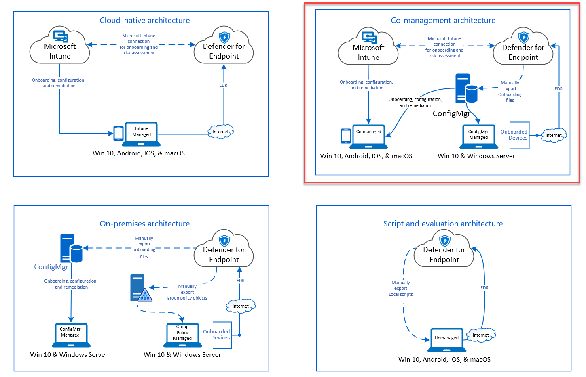
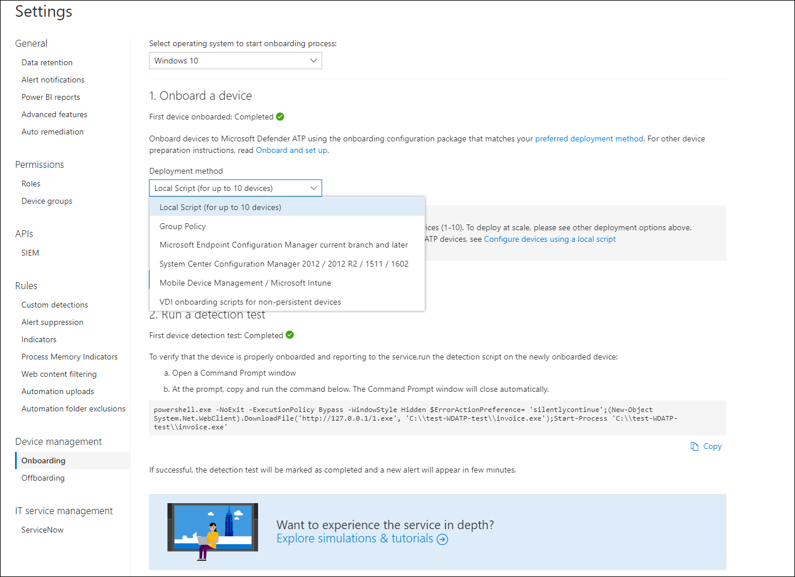
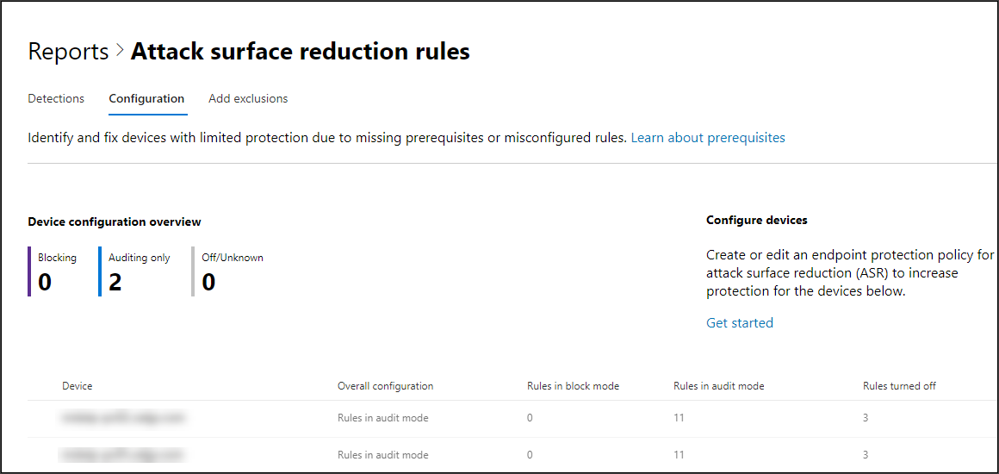

# Onboarding mithilfe des Microsoft Endpoint Configuration Manager

[!INCLUDE [Microsoft 365 Defender rebranding](../../includes/microsoft-defender.md)]

**Gilt für:**
- [Microsoft Defender für Endpunkt](https://go.microsoft.com/fwlink/p/?linkid=2154037)
- [Microsoft 365 Defender](https://go.microsoft.com/fwlink/?linkid=2118804)

> Möchten Sie Microsoft Defender for Endpoint erleben? [Registrieren Sie sich für eine kostenlose Testversion.](https://www.microsoft.com/microsoft-365/windows/microsoft-defender-atp?ocid=docs-wdatp-exposedapis-abovefoldlink)

Dieser Artikel ist Teil des Bereitstellungshandbuchs und dient als Beispiel für ein Onboarding. 

Im Thema [Planning](deployment-strategy.md) wurden verschiedene Methoden zum Onboarding von Geräten in den Dienst bereitgestellt. In diesem Thema wird die Architektur der gemeinsamen Verwaltung behandelt. 

 *Diagramm der Umgebungsarchitekturen*

Während Defender for Endpoint das Onboarding verschiedener Endpunkte und Tools unterstützt, werden diese in diesem Artikel nicht behandelt. Informationen zum allgemeinen Onboarding mit anderen unterstützten Bereitstellungstools und -methoden finden Sie unter [Onboarding overview](onboarding.md).

In diesem Thema werden Benutzer in den themen:
- Schritt 1: Onboarding Windows Geräte in den Dienst 
- Schritt 2: Konfigurieren von Defender for Endpoint-Funktionen

In diesem Onboardingleitfaden werden Sie durch die folgenden grundlegenden Schritte bei der Verwendung von Microsoft Endpoint Configuration Manager:
- **Erstellen einer Auflistung in Microsoft Endpoint Configuration Manager**
- **Konfigurieren von Microsoft Defender for Endpoint-Funktionen mithilfe Microsoft Endpoint Configuration Manager**

>[!NOTE]
>Nur Windows werden in dieser Beispielbereitstellung behandelt. 

## Schritt 1: Onboarding Windows Geräte mithilfe Microsoft Endpoint Configuration Manager

### Sammlungserstellung
Zum Onboarding Windows 10 geräte mit Microsoft Endpoint Configuration Manager kann die Bereitstellung auf eine vorhandene Auflistung oder eine neue Sammlung zu Testzwecken erstellt werden. 

Beim Onboarding mithilfe von Tools wie Gruppenrichtlinien oder manuellen Methoden wird kein Agent auf dem System installiert. 

Innerhalb der Microsoft Endpoint Configuration Manager wird der Onboardingprozess als Teil der Kompatibilitätseinstellungen in der Konsole konfiguriert.

Jedes System, das diese erforderliche Konfiguration empfängt, wird diese Konfiguration beibehalten, solange der Configuration Manager-Client diese Richtlinie weiterhin vom Verwaltungspunkt empfängt. 

Führen Sie die folgenden Schritte aus, um Endpunkte mithilfe von Microsoft Endpoint Configuration Manager.

1. Navigieren Microsoft Endpoint Configuration Manager Konsole zu **Assets and Compliance Overview Device \> \> Collections**.            

    

2. Klicken Sie mit **der rechten Maustaste auf Gerätesammlung,** und wählen Sie **Gerätesammlung erstellen aus.**

    

3. Geben Sie **einen Namen und** eine **Einschränkende Auflistung an,** und wählen Sie dann **Weiter aus.**

    

4. Wählen **Sie Regel hinzufügen** aus, und wählen Sie **Abfrageregel aus.**

    

5.  Klicken **Sie im** Assistenten für direkte **Mitgliedschaft** auf Weiter, und klicken Sie auf **Abfrageanweisung bearbeiten.**

     

6. Wählen **Sie Kriterien** aus, und wählen Sie dann das Sternsymbol aus.

     

7. Halten Sie den Kriterientyp als einfachen **Wert,** wählen  Sie als Betriebssystem **- Buildnummer**, Operator, größer oder gleich und Wert **14393** aus, und klicken Sie auf **OK**.

    

8. Wählen **Sie Weiter** und Schließen **aus.**

    

9. Wählen Sie **Weiter** aus.

    

Nachdem Sie diese Aufgabe abgeschlossen haben, verfügen Sie nun über eine Gerätesammlung mit allen Windows 10 endpunkten in der Umgebung. 

## Schritt 2: Konfigurieren von Microsoft Defender for Endpoint-Funktionen 
In diesem Abschnitt werden Sie beim Konfigurieren der folgenden Funktionen mithilfe von Microsoft Endpoint Configuration Manager auf Windows unterstützt:

- [**Erkennung und Reaktion am Endpunkt**](#endpoint-detection-and-response)
- [**Schutzlösungen der nächsten Generation**](#next-generation-protection)
- [**Reduzierung der Angriffsfläche**](#attack-surface-reduction)

### Erkennung und Reaktion am Endpunkt
#### Windows 10
Innerhalb der Microsoft Defender Security Center ist es möglich, die Richtlinie ".onboarding" herunterzuladen, mit der die Richtlinie in System Center Configuration Manager erstellt und auf Windows 10 bereitgestellt werden kann.

1. Wählen Sie Microsoft Defender Security Center Portal Einstellungen [und dann Onboarding aus.](https://securitycenter.windows.com/preferences2/onboarding)

2. Wählen Sie unter Bereitstellungsmethode die unterstützte Version von **Microsoft Endpoint Configuration Manager**.

    

3. Wählen **Sie Paket herunterladen aus.**

    

4. Speichern Sie das Paket an einem barrierefreien Speicherort.
5. Navigieren Microsoft Endpoint Configuration Manager zu: Assets **and Compliance > Overview > Endpoint Protection > Microsoft Defender ATP Policies**.

6. Klicken Sie mit **der rechten Microsoft Defender ATP auf Richtlinien,** und wählen Sie Microsoft Defender ATP Erstellen **aus.**

    

7. Geben Sie den Namen und die Beschreibung ein, überprüfen Sie, ob **onboarding** ausgewählt ist, und wählen Sie dann **Weiter aus.**

    

8. Klicken Sie auf **Durchsuchen**.

9. Navigieren Sie aus Schritt 4 oben zum Speicherort der heruntergeladenen Datei.

10. Klicken Sie auf **Weiter**.
11. Konfigurieren Sie den Agent mit den entsprechenden Beispielen (**Keine** oder **Alle Dateitypen**).

    

12. Wählen Sie die entsprechende Telemetrie (**Normal** oder **Expedited**) aus, und klicken Sie dann auf **Weiter**.

    

14. Überprüfen Sie die Konfiguration, und klicken Sie dann auf **Weiter**.

     

15. Klicken **Sie auf Schließen,** wenn der Assistent abgeschlossen ist.

16.  Klicken Sie Microsoft Endpoint Configuration Manager mit der rechten Maustaste auf die gerade erstellte Defender for Endpoint-Richtlinie, und wählen Sie **Bereitstellen aus.**

     

17. Wählen Sie im rechten Bereich die zuvor erstellte Auflistung aus, und klicken Sie auf **OK**.

    

#### Frühere Versionen von Windows Client (Windows 7 und Windows 8.1)
Führen Sie die folgenden Schritte aus, um die Defender for Endpoint Workspace ID und den Arbeitsbereichsschlüssel zu identifizieren, die für das Onboarding früherer Versionen von Windows.

1. Wählen Sie Microsoft Defender Security Center Portal Einstellungen > **Onboarding aus.**

2. Wählen Sie unter Betriebssystem **Windows 7 SP1 und 8.1 aus.**

3. Kopieren Sie **die Arbeitsbereichs-ID** und **den Arbeitsbereichsschlüssel,** und speichern Sie sie. Sie werden später im Prozess verwendet.

    

4. Installieren Sie Microsoft Monitoring Agent (MMA).  
    MMA wird derzeit (ab Januar 2019) auf den folgenden Betriebssystemen Windows unterstützt:

    -   Server-SKUs: Windows Server 2008 SP1 oder neuer

    -   Client-SKUs: Windows 7 SP1 und höher

    Der MMA-Agent muss auf Windows installiert werden. Zum Installieren des Agents müssen einige Systeme das [Update](https://support.microsoft.com/help/3080149/update-for-customer-experience-and-diagnostic-telemetry) für die Benutzererfahrung und die Diagnosetelemetrie herunterladen, um die Daten mit MMA zu erfassen. Diese Systemversionen umfassen u. U. folgende Versionen:

    -   Windows 8.1

    -   Windows 7

    -   Windows Server 2016

    -   Windows Server 2012 R2

    -   Windows Server 2008 R2

    Insbesondere für Windows 7 SP1 müssen die folgenden Patches installiert werden:

    -   Installieren [von KB4074598](https://support.microsoft.com/help/4074598/windows-7-update-kb4074598)

    -   Installieren Sie [.NET Framework 4.5](https://www.microsoft.com/download/details.aspx?id=30653) (oder höher) **oder** 
         [KB3154518](https://support.microsoft.com/help/3154518/support-for-tls-system-default-versions-included-in-the-net-framework).
        Installieren Sie beide nicht auf demselben System.

5. Wenn Sie einen Proxy zum Herstellen einer Verbindung mit dem Internet verwenden, lesen Sie den Abschnitt Konfigurieren von Proxyeinstellungen.

Sobald sie abgeschlossen sind, sollten integrierte Endpunkte innerhalb einer Stunde im Portal angezeigt werden.

### Schutz der nächsten Generation 
Microsoft Defender Antivirus ist eine integrierte Lösung zur Bekämpfung von Schadsoftware, die Schutz der nächsten Generation für Desktops, tragbare Computer und Server bietet.

1. Navigieren Sie Microsoft Endpoint Configuration Manager in der Konsole zu Ressourcen und **\> Complianceübersicht \> Endpoint Protection \> Antischalwarerichtlinien,** und wählen Sie **Antischalwarerichtlinie erstellen aus.**

    

2. Wählen **Sie Geplante Scans**, **Scaneinstellungen**, **Standardaktionen**, **Echtzeitschutz** **,** Ausschlusseinstellungen , **Erweitert**, **Bedrohungsüberschreibungen**, Cloud **Protection Service-** und **Security Intelligence-Updates aus,** und wählen Sie **OK aus.**

    

    In bestimmten Branchen oder einigen ausgewählten Unternehmenskunden können bestimmte Anforderungen an die Konfiguration von Antivirus erfüllt sein.

  
    [Schnellscan im Vergleich zu vollständiger Überprüfung und benutzerdefinierter Überprüfung](https://docs.microsoft.com/windows/security/threat-protection/microsoft-defender-antivirus/scheduled-catch-up-scans-microsoft-defender-antivirus#quick-scan-versus-full-scan-and-custom-scan)

    Weitere Informationen finden Sie unter [Windows-Sicherheit Configuration Framework](https://docs.microsoft.com/windows/security/threat-protection/windows-security-configuration-framework/windows-security-configuration-framework)
  
    

    

    

    

    

    

    

    

3. Klicken Sie mit der rechten Maustaste auf die neu erstellte Antischalwarerichtlinie, und wählen Sie **Bereitstellen aus.**

    

4. Wählen Sie die neue Antischalwarerichtlinie auf Ihre Windows 10 aus, und klicken Sie auf **OK**.

     

Nachdem Sie diese Aufgabe abgeschlossen haben, haben Sie die Windows Defender Antivirus.

### Verringerung der Angriffsfläche
Die Angriffsflächenreduzierungssäule von Defender for Endpoint umfasst den Funktionssatz, der unter Exploit Guard verfügbar ist. Attack Surface Reduction (ASR)-Regeln, kontrollierter Ordnerzugriff, Netzwerkschutz und Exploit-Schutz. 

Alle diese Features bieten einen Überwachungsmodus und einen Blockmodus. Im Überwachungsmodus gibt es keine Auswirkungen auf endbenutzer. Es werden nur zusätzliche Telemetriedaten gesammelt und in der Microsoft Defender Security Center. Das Ziel einer Bereitstellung besteht in der schrittweisen Bewegung von Sicherheitssteuerelementen in den Blockmodus.

So legen Sie ASR-Regeln im Überwachungsmodus ein:

1. Navigieren Sie Microsoft Endpoint Configuration Manager in der Konsole zu Ressourcen und **\> Complianceübersicht \> Endpoint Protection Windows Defender Exploit \> Guard,** und wählen Sie **Exploit Guard-Richtlinie erstellen aus.**

   

2.  Wählen Sie **Attack Surface Reduction aus.**
   

3. Legen Sie Regeln auf **Überwachung** und klicken Sie auf **Weiter**.

    

4. Bestätigen Sie die neue Exploit Guard-Richtlinie, indem Sie auf **Weiter klicken.**

    

    
5. Klicken Sie nach dem Erstellen der Richtlinie auf **Schließen**.

    

    
   

6.  Klicken Sie mit der rechten Maustaste auf die neu erstellte Richtlinie, und wählen Sie **Bereitstellen aus.**
    
    

7. Zielen Sie die Richtlinie auf die neu erstellte Windows 10, und klicken Sie auf **OK**.

    

Nachdem Sie diese Aufgabe abgeschlossen haben, haben Sie jetzt erfolgreich DIE REGELN im Überwachungsmodus konfiguriert.  
  
Im Folgenden finden Sie weitere Schritte, um zu überprüfen, ob DIE REGELN ordnungsgemäß auf Endpunkte angewendet werden. (Dies kann einige Minuten dauern)

1. Navigieren Sie in einem Webbrowser zu <https://securitycenter.windows.com> .

2.  Wählen **Sie im linken** Menü Konfigurationsverwaltung aus.

3. Klicken **Sie im Bereich Angriffsoberflächenverwaltung** auf Gehe, um die Oberflächenverwaltung zu attackieren. 
    
    

4. Klicken **Sie auf der** Registerkarte Konfiguration in Berichten zu Attack surface reduction rules. Es zeigt eine Übersicht über die Konfiguration von ASR-Regeln und den Status von ASR-Regeln auf jedem Gerät.

    

5. Klicken Sie auf jedes Gerät, um Konfigurationsdetails der ASR-Regeln anzuzeigen.

    

Weitere Informationen finden Sie unter [Optimize ASR rule deployment and detections.](https://docs.microsoft.com/microsoft-365/security/defender-endpoint/configure-machines-asr)  

#### Festlegen von Netzwerkschutzregeln im Überwachungsmodus:
1. Navigieren Sie Microsoft Endpoint Configuration Manager in der Konsole zu Ressourcen und **\> Complianceübersicht \> Endpoint Protection Windows Defender Exploit \> Guard,** und wählen Sie **Exploit Guard-Richtlinie erstellen aus.**

    

2. Wählen Sie **Netzwerkschutz aus.**

3. Legen Sie die Einstellung auf **Überwachung** und klicken Sie auf **Weiter**. 

    

4. Bestätigen Sie die neue Exploit Guard-Richtlinie, indem Sie auf **Weiter klicken.**
    
    

5. Klicken Sie nach dem Erstellen der Richtlinie auf **Schließen**.

    

6. Klicken Sie mit der rechten Maustaste auf die neu erstellte Richtlinie, und wählen Sie **Bereitstellen aus.**

    

7. Wählen Sie die Richtlinie für die neu erstellte Windows 10 aus, und wählen Sie **OK aus.**

    

Nachdem Sie diese Aufgabe abgeschlossen haben, haben Sie Network Protection im Überwachungsmodus erfolgreich konfiguriert.

#### So legen Sie Regeln für den kontrollierten Ordnerzugriff im Überwachungsmodus ein:

1. Navigieren Sie Microsoft Endpoint Configuration Manager in der Konsole zu Ressourcen und **\> Complianceübersicht \> Endpoint Protection Windows Defender Exploit \> Guard,** und wählen Sie **Exploit Guard-Richtlinie erstellen aus.**

    

2. Wählen **Sie Kontrollierter Ordnerzugriff aus.**
    
3. Legen Sie die Konfiguration auf **Überwachung und** klicken Sie auf **Weiter**.

        
    
4. Bestätigen Sie die neue Exploit Guard-Richtlinie, indem Sie auf **Weiter klicken.**

    

5. Klicken Sie nach dem Erstellen der Richtlinie auf **Schließen**.

    

6. Klicken Sie mit der rechten Maustaste auf die neu erstellte Richtlinie, und wählen Sie **Bereitstellen aus.**

    

7.  Zielen Sie die Richtlinie auf die neu erstellte Windows 10, und klicken Sie auf **OK**.

    

Sie haben nun den kontrollierten Ordnerzugriff im Überwachungsmodus erfolgreich konfiguriert.

## Verwandtes Thema
- [Onboarding mithilfe des Microsoft Endpoint Manager](onboarding-endpoint-manager.md)
