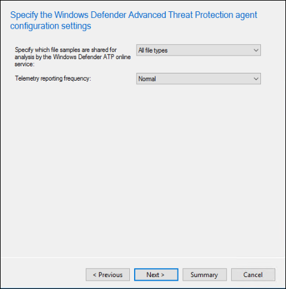

# Onboarding mit Microsoft Endpoint Configuration ManagerOnboarding using Microsoft Endpoint Configuration Manager

[!INCLUDE [Microsoft 365 Defender rebranding](../../includes/microsoft-defender.md)]

**Gilt für:****Applies to:**
- [Microsoft Defender für EndpunktMicrosoft Defender for Endpoint](https://go.microsoft.com/fwlink/p/?linkid=2154037)
- [Microsoft 365 DefenderMicrosoft 365 Defender](https://go.microsoft.com/fwlink/?linkid=2118804)

> Möchten Sie Microsoft Defender for Endpoint erleben?Want to experience Microsoft Defender for Endpoint? [Registrieren Sie sich für eine kostenlose Testversion.Sign up for a free trial.](https://www.microsoft.com/microsoft-365/windows/microsoft-defender-atp?ocid=docs-wdatp-exposedapis-abovefoldlink)

Dieser Artikel ist Teil des Bereitstellungshandbuchs und dient als Beispiel für ein Onboarding.This article is part of the Deployment guide and acts as an example onboarding method. 

Im Thema [Planning](deployment-strategy.md) wurden verschiedene Methoden zum Onboarding von Geräten in den Dienst bereitgestellt.In the [Planning](deployment-strategy.md) topic, there were several methods provided to onboard devices to the service. In diesem Thema wird die Architektur der gemeinsamen Verwaltung behandelt.This topic covers the co-management architecture. 

 *Diagramm der Umgebungsarchitekturen*
*Diagram of environment architectures*

Während Defender for Endpoint das Onboarding verschiedener Endpunkte und Tools unterstützt, werden diese in diesem Artikel nicht behandelt.While Defender for Endpoint supports onboarding of various endpoints and tools, this article does not cover them. Informationen zum allgemeinen Onboarding mit anderen unterstützten Bereitstellungstools und -methoden finden Sie unter [Onboarding overview](onboarding.md).For information on general onboarding using other supported deployment tools and methods, see [Onboarding overview](onboarding.md).

In diesem Thema werden Benutzer in den themen:This topic guides users in:
- Schritt 1: Onboarding von Windows-Geräten in den DienstStep 1: Onboarding Windows devices to the service 
- Schritt 2: Konfigurieren von Defender for Endpoint-FunktionenStep 2: Configuring Defender for Endpoint capabilities

In diesem Onboardingleitfaden werden Sie durch die folgenden grundlegenden Schritte geleitet, die Sie bei der Verwendung von Microsoft Endpoint Configuration Manager ausführen müssen:This onboarding guidance will walk you through the following basic steps that you need to take when using Microsoft Endpoint Configuration Manager:
- **Erstellen einer Auflistung in Microsoft Endpoint Configuration Manager****Creating a collection in Microsoft Endpoint Configuration Manager**
- **Konfigurieren von Microsoft Defender for Endpoint-Funktionen mithilfe von Microsoft Endpoint Configuration Manager****Configuring Microsoft Defender for Endpoint capabilities using Microsoft Endpoint Configuration Manager**

>[!NOTE]
>In dieser Beispielbereitstellung werden nur Windows-Geräte behandelt.Only Windows devices are covered in this example deployment. 

## Schritt 1: Onboarding von Windows-Geräten mit Microsoft Endpoint Configuration ManagerStep 1: Onboard Windows devices using Microsoft Endpoint Configuration Manager

### SammlungserstellungCollection creation
Um Windows 10-Geräte mit Microsoft Endpoint Configuration Manager zu integrieren, kann die Bereitstellung auf eine vorhandene Auflistung oder eine neue Auflistung für Tests verwendet werden.To onboard Windows 10 devices with Microsoft Endpoint Configuration Manager, the deployment can target an existing collection or a new collection can be created for testing. 

Beim Onboarding mithilfe von Tools wie Gruppenrichtlinien oder manuellen Methoden wird kein Agent auf dem System installiert.Onboarding using tools such as Group policy or manual method does not install any agent on the system. 

In der Microsoft Endpoint Configuration Manager-Konsole wird der Onboardingprozess als Teil der Kompatibilitätseinstellungen in der Konsole konfiguriert.Within the Microsoft Endpoint Configuration Manager console the onboarding process will be configured as part of the compliance settings within the console.

Jedes System, das diese erforderliche Konfiguration empfängt, wird diese Konfiguration beibehalten, solange der Configuration Manager-Client diese Richtlinie weiterhin vom Verwaltungspunkt empfängt.Any system that receives this required configuration will maintain that configuration for as long as the Configuration Manager client continues to receive this policy from the management point. 

Führen Sie die folgenden Schritte aus, um Endpunkte mithilfe von Microsoft Endpoint Configuration Manager zu integrieren.Follow the steps below to onboard endpoints using Microsoft Endpoint Configuration Manager.

1. Navigieren Sie in der Microsoft Endpoint Configuration Manager-Konsole zu **Assets and Compliance Overview Device \> \> Collections**.In Microsoft Endpoint Configuration Manager console, navigate to **Assets and Compliance \> Overview \> Device Collections**.            

    

2. Klicken Sie mit **der rechten Maustaste auf Gerätesammlung,** und wählen Sie **Gerätesammlung erstellen aus.**Right Click **Device Collection** and select **Create Device Collection**.

    

3. Geben Sie **einen Namen und** eine **Einschränkende Auflistung an,** und wählen Sie dann **Weiter aus.**Provide a **Name** and **Limiting Collection**, then select **Next**.

    

4. Wählen **Sie Regel hinzufügen** aus, und wählen Sie **Abfrageregel aus.**Select **Add Rule** and choose **Query Rule**.

    

5.  Klicken **Sie im** Assistenten für direkte **Mitgliedschaft** auf Weiter, und klicken Sie auf **Abfrageanweisung bearbeiten.**Click **Next** on the **Direct Membership Wizard** and click on **Edit Query Statement**.

     

6. Wählen **Sie Kriterien** aus, und wählen Sie dann das Sternsymbol aus.Select **Criteria** and then choose the star icon.

     

7. Halten Sie den Kriterientyp als einfachen **Wert,** wählen  Sie als Betriebssystem **- Buildnummer**, Operator, größer oder gleich und Wert **14393** aus, und klicken Sie auf **OK**.Keep criterion type as **simple value**, choose where as **Operating System - build number**, operator as **is greater than or equal to** and value **14393** and click on **OK**.

    

8. Wählen **Sie Weiter** und Schließen **aus.**Select **Next** and **Close**.

    

9. Wählen Sie **Weiter** aus.Select **Next**.

    

Nachdem Sie diese Aufgabe abgeschlossen haben, verfügen Sie nun über eine Gerätesammlung mit allen Windows 10-Endpunkten in der Umgebung.After completing this task, you now have a device collection with all the Windows 10 endpoints in the environment. 

## Schritt 2: Konfigurieren von Microsoft Defender for Endpoint-FunktionenStep 2: Configure Microsoft Defender for Endpoint capabilities 
In diesem Abschnitt werden Sie beim Konfigurieren der folgenden Funktionen mithilfe von Microsoft Endpoint Configuration Manager auf Windows-Geräten unterstützt:This section guides you in configuring the following capabilities using Microsoft Endpoint Configuration Manager on Windows devices:

- [**Endpunkterkennung und -antwort****Endpoint detection and response**](#endpoint-detection-and-response)
- [**Schutz der nächsten Generation****Next-generation protection**](#next-generation-protection)
- [**Reduzierung der Angriffsfläche****Attack surface reduction**](#attack-surface-reduction)

### Erkennung und Reaktion am EndpunktEndpoint detection and response
#### Windows 10Windows 10
Im Microsoft Defender Security Center können Sie die Richtlinie ".onboarding" herunterladen, mit der die Richtlinie im System Center Configuration Manager erstellt und auf Windows 10-Geräten bereitgestellt werden kann.From within the Microsoft Defender Security Center it is possible to download the '.onboarding' policy that can be used to create the policy in System Center Configuration Manager and deploy that policy to Windows 10 devices.

1. Wählen Sie in einem Microsoft Defender Security Center-Portal [Einstellungen und dann Onboarding aus.](https://securitycenter.windows.com/preferences2/onboarding)From a Microsoft Defender Security Center Portal, select [Settings and then Onboarding](https://securitycenter.windows.com/preferences2/onboarding).

2. Wählen Sie unter Bereitstellungsmethode die unterstützte Version von **Microsoft Endpoint Configuration Manager aus.**Under Deployment method select the supported version of **Microsoft Endpoint Configuration Manager**.

    

3. Wählen **Sie Paket herunterladen aus.**Select **Download package**.

    

4. Speichern Sie das Paket an einem barrierefreien Speicherort.Save the package to an accessible location.
5. Navigieren Sie in Microsoft Endpoint Configuration Manager zu: **Assets and Compliance > Overview > Endpoint Protection > Microsoft Defender ATP Policies**.In  Microsoft Endpoint Configuration Manager, navigate to: **Assets and Compliance > Overview > Endpoint Protection > Microsoft Defender ATP Policies**.

6. Klicken Sie mit der rechten **Maustaste auf Microsoft Defender ATP-Richtlinien,** und wählen Sie Microsoft Defender **ATP-Richtlinie erstellen aus.**Right-click **Microsoft Defender ATP Policies** and select **Create Microsoft Defender ATP Policy**.

    

7. Geben Sie den Namen und die Beschreibung ein, überprüfen Sie, ob **onboarding** ausgewählt ist, und wählen Sie dann **Weiter aus.**Enter the name and description, verify **Onboarding** is selected, then select **Next**.

    

8. Klicken Sie auf **Durchsuchen**.Click **Browse**.

9. Navigieren Sie aus Schritt 4 oben zum Speicherort der heruntergeladenen Datei.Navigate to the location of the downloaded file from step 4 above.

10. Klicken Sie auf **Weiter**.Click **Next**.
11. Konfigurieren Sie den Agent mit den entsprechenden Beispielen (**Keine** oder **Alle Dateitypen**).Configure the Agent with the appropriate samples (**None** or **All file types**).

    

12. Wählen Sie die entsprechende Telemetrie (**Normal** oder **Expedited**) aus, und klicken Sie dann auf **Weiter**.Select the appropriate telemetry (**Normal** or **Expedited**) then click **Next**.

    

14. Überprüfen Sie die Konfiguration, und klicken Sie dann auf **Weiter**.Verify the configuration, then click **Next**.

     

15. Klicken **Sie auf Schließen,** wenn der Assistent abgeschlossen ist.Click **Close** when the Wizard completes.

16.  Klicken Sie in der Microsoft Endpoint Configuration Manager-Konsole mit der rechten Maustaste auf die gerade erstellte Defender for Endpoint-Richtlinie, und wählen Sie **Bereitstellen aus.**In the Microsoft Endpoint Configuration Manager console, right-click the Defender for Endpoint policy you just created and select **Deploy**.

     

17. Wählen Sie im rechten Bereich die zuvor erstellte Auflistung aus, und klicken Sie auf **OK**.On the right panel, select the previously created collection and click **OK**.

    

#### Frühere Versionen von Windows Client (Windows 7 und Windows 8.1)Previous versions of Windows Client (Windows 7 and Windows 8.1)
Führen Sie die folgenden Schritte aus, um die Defender for Endpoint Workspace ID und den Arbeitsbereichsschlüssel zu identifizieren, die für das Onboarding früherer Versionen von Windows erforderlich sind.Follow the steps below to identify the Defender for Endpoint Workspace ID and Workspace Key, that will be required for the onboarding of previous versions of Windows.

1. Wählen Sie in einem Microsoft Defender Security Center-Portal Einstellungen **> Onboarding aus.**From a Microsoft Defender Security Center Portal, select **Settings > Onboarding**.

2. Wählen Sie unter Betriebssystem **Windows 7 SP1 und 8.1 aus.**Under operating system choose **Windows 7 SP1 and 8.1**.

3. Kopieren Sie **die Arbeitsbereichs-ID** und **den Arbeitsbereichsschlüssel,** und speichern Sie sie.Copy the **Workspace ID** and **Workspace Key** and save them. Sie werden später im Prozess verwendet.They will be used later in the process.

    

4. Installieren Sie den Microsoft Monitoring Agent (MMA).Install the Microsoft Monitoring Agent (MMA).  
    MMA wird derzeit (ab Januar 2019) unter den folgenden Windows-Betriebssystemen unterstützt:MMA is currently (as of January 2019) supported on the following Windows Operating Systems:

    -   Server-SKUs: Windows Server 2008 SP1 oder neuerServer SKUs: Windows Server 2008 SP1 or Newer

    -   Client-SKUs: Windows 7 SP1 und höherClient SKUs: Windows 7 SP1 and later

    Der MMA-Agent muss auf Windows-Geräten installiert werden.The MMA agent will need to be installed on Windows devices. Zum Installieren des Agents müssen einige Systeme das [Update](https://support.microsoft.com/help/3080149/update-for-customer-experience-and-diagnostic-telemetry) für die Benutzererfahrung und die Diagnosetelemetrie herunterladen, um die Daten mit MMA zu erfassen.To install the agent, some systems will need to download the [Update for customer experience and diagnostic telemetry](https://support.microsoft.com/help/3080149/update-for-customer-experience-and-diagnostic-telemetry) in order to collect the data with MMA. Diese Systemversionen umfassen u. U. folgende Versionen:These system versions include but may not be limited to:

    -   Windows 8.1Windows 8.1

    -   Windows 7Windows 7

    -   Windows Server 2016Windows Server 2016

    -   Windows Server 2012 R2Windows Server 2012 R2

    -   Windows Server 2008 R2Windows Server 2008 R2

    Insbesondere für Windows 7 SP1 müssen die folgenden Patches installiert werden:Specifically, for Windows 7 SP1, the following patches must be installed:

    -   Installieren [von KB4074598](https://support.microsoft.com/help/4074598/windows-7-update-kb4074598)Install [KB4074598](https://support.microsoft.com/help/4074598/windows-7-update-kb4074598)

    -   Installieren Sie [.NET Framework 4.5](https://www.microsoft.com/download/details.aspx?id=30653) (oder höher) **oder** 
         [KB3154518](https://support.microsoft.com/help/3154518/support-for-tls-system-default-versions-included-in-the-net-framework).Install either [.NET Framework 4.5](https://www.microsoft.com/download/details.aspx?id=30653) (or later) **or**
        [KB3154518](https://support.microsoft.com/help/3154518/support-for-tls-system-default-versions-included-in-the-net-framework).
        Installieren Sie beide nicht auf demselben System.Do not install both on the same system.

5. Wenn Sie einen Proxy zum Herstellen einer Verbindung mit dem Internet verwenden, lesen Sie den Abschnitt Konfigurieren von Proxyeinstellungen.If you're using a proxy to connect to the Internet see the Configure proxy settings section.

Sobald sie abgeschlossen sind, sollten integrierte Endpunkte innerhalb einer Stunde im Portal angezeigt werden.Once completed, you should see onboarded endpoints in the portal within an hour.

### Schutz der nächsten GenerationNext generation protection 
Microsoft Defender Antivirus ist eine integrierte Lösung zur Bekämpfung von Schadsoftware, die Schutz der nächsten Generation für Desktops, tragbare Computer und Server bietet.Microsoft Defender Antivirus is a built-in antimalware solution that provides next generation protection for desktops, portable computers, and servers.

1. Navigieren Sie in der Microsoft Endpoint Configuration Manager-Konsole zu **Assets and Compliance Overview Endpoint Protection \> \> \> Anmalware Polices,** und wählen Sie **Antischalwarerichtlinie erstellen aus.**In the Microsoft Endpoint Configuration Manager console, navigate to **Assets and Compliance \> Overview \> Endpoint Protection \> Antimalware Polices** and choose **Create Antimalware Policy**.

    

2. Wählen **Sie Geplante Scans**, **Scaneinstellungen**, **Standardaktionen**, **Echtzeitschutz** **,** Ausschlusseinstellungen , **Erweitert**, **Bedrohungsüberschreibungen**, Cloud **Protection Service-** und **Security Intelligence-Updates aus,** und wählen Sie **OK aus.**Select **Scheduled scans**, **Scan settings**, **Default actions**, **Real-time protection**, **Exclusion settings**, **Advanced**, **Threat overrides**, **Cloud Protection Service** and **Security intelligence   updates** and choose **OK**.

    

    In bestimmten Branchen oder einigen ausgewählten Unternehmenskunden können bestimmte Anforderungen an die Konfiguration von Antivirus erfüllt sein.In certain industries or some select enterprise customers might have specific needs on how Antivirus is configured.

  
    [Schnellscan im Vergleich zu vollständiger Überprüfung und benutzerdefinierter ÜberprüfungQuick scan versus full scan and custom scan](https://docs.microsoft.com/windows/security/threat-protection/microsoft-defender-antivirus/scheduled-catch-up-scans-microsoft-defender-antivirus#quick-scan-versus-full-scan-and-custom-scan)

    Weitere Informationen finden Sie unter [Windows Security Configuration Framework](https://docs.microsoft.com/windows/security/threat-protection/windows-security-configuration-framework/windows-security-configuration-framework)For more details, see [Windows Security configuration framework](https://docs.microsoft.com/windows/security/threat-protection/windows-security-configuration-framework/windows-security-configuration-framework)
  
    

    

    

    

    

    

    

    

3. Klicken Sie mit der rechten Maustaste auf die neu erstellte Antischalwarerichtlinie, und wählen Sie **Bereitstellen aus.**Right-click on the newly created antimalware policy and select **Deploy**.

    

4. Wählen Sie die neue Antischalwarerichtlinie auf Ihre Windows 10-Auflistung aus, und klicken Sie auf **OK**.Target the new antimalware policy to your Windows 10 collection and click **OK**.

     

Nachdem Sie diese Aufgabe abgeschlossen haben, haben Sie die Antivirus-Windows Defender konfiguriert.After completing this task, you now have successfully configured Windows Defender Antivirus.

### Angriffsfläche verringernAttack surface reduction
Die Angriffsflächenreduzierungssäule von Defender for Endpoint umfasst den Funktionssatz, der unter Exploit Guard verfügbar ist.The attack surface reduction pillar of Defender for Endpoint includes the feature set that is available under Exploit Guard. Attack Surface Reduction (ASR)-Regeln, kontrollierter Ordnerzugriff, Netzwerkschutz und Exploit-Schutz.Attack surface reduction (ASR) rules, Controlled Folder Access, Network Protection and Exploit Protection. 

Alle diese Features bieten einen Überwachungsmodus und einen Blockmodus.All these features provide an audit mode and a block mode. Im Überwachungsmodus gibt es keine Auswirkungen auf endbenutzer.In audit mode there is no end-user impact. Sie sammelt nur zusätzliche Telemetrie und stellt sie im Microsoft Defender Security Center zur Verfügung.All it does is collect additional telemetry and make it available in the Microsoft Defender Security Center. Das Ziel einer Bereitstellung besteht in der schrittweisen Bewegung von Sicherheitssteuerelementen in den Blockmodus.The goal with a deployment is to step-by-step move security controls into block mode.

So legen Sie ASR-Regeln im Überwachungsmodus ein:To set ASR rules in Audit mode:

1. Navigieren Sie in der Microsoft Endpoint Configuration Manager-Konsole zu **Assets and Compliance Overview Endpoint Protection Windows Defender Exploit \> \> \> Guard,** und wählen Sie **Exploit Guard-Richtlinie erstellen aus.**In the Microsoft Endpoint Configuration Manager console, navigate to **Assets and Compliance \> Overview \> Endpoint Protection \> Windows Defender Exploit Guard** and choose **Create Exploit Guard Policy**.

   

2.  Wählen Sie **Attack Surface Reduction aus.**Select **Attack Surface Reduction**.
   

3. Legen Sie Regeln auf **Überwachung** und klicken Sie auf **Weiter**.Set rules to **Audit** and click **Next**.

    

4. Bestätigen Sie die neue Exploit Guard-Richtlinie, indem Sie auf **Weiter klicken.**Confirm the new Exploit Guard policy by clicking on **Next**.

    

    
5. Klicken Sie nach dem Erstellen der Richtlinie auf **Schließen**.Once the policy is created click **Close**.

    

    
   

6.  Klicken Sie mit der rechten Maustaste auf die neu erstellte Richtlinie, und wählen Sie **Bereitstellen aus.**Right-click on the newly created policy and choose **Deploy**.
    
    

7. Zielen Sie die Richtlinie auf die neu erstellte Windows 10-Auflistung ab, und klicken Sie auf **OK**.Target the policy to the newly created Windows 10 collection and click **OK**.

    

Nachdem Sie diese Aufgabe abgeschlossen haben, haben Sie jetzt erfolgreich DIE REGELN im Überwachungsmodus konfiguriert.After completing this task, you now have successfully configured ASR rules in audit mode.  
  
Im Folgenden finden Sie weitere Schritte, um zu überprüfen, ob DIE REGELN ordnungsgemäß auf Endpunkte angewendet werden.Below are additional steps to verify whether ASR rules are correctly applied to endpoints. (Dies kann einige Minuten dauern)(This may take few minutes)

1. Navigieren Sie in einem Webbrowser zu <https://securitycenter.windows.com> .From a web browser, navigate to <https://securitycenter.windows.com>.

2.  Wählen **Sie im linken** Menü Konfigurationsverwaltung aus.Select **Configuration management** from left side menu.

3. Klicken **Sie im Bereich Angriffsoberflächenverwaltung** auf Gehe, um die Oberflächenverwaltung zu attackieren.Click **Go to attack surface management** in the Attack surface management panel. 
    
    

4. Klicken **Sie auf der** Registerkarte Konfiguration in Berichten zu Attack surface reduction rules.Click **Configuration** tab in Attack surface reduction rules reports. Es zeigt eine Übersicht über die Konfiguration von ASR-Regeln und den Status von ASR-Regeln auf jedem Gerät.It shows ASR rules configuration overview and ASR rules status on each devices.

    

5. Klicken Sie auf jedes Gerät, um Konfigurationsdetails der ASR-Regeln anzuzeigen.Click each device shows configuration details of ASR rules.

    

Weitere Informationen finden Sie unter [Optimize ASR rule deployment and detections.](https://docs.microsoft.com/microsoft-365/security/defender-endpoint/configure-machines-asr)See [Optimize ASR rule deployment and detections](https://docs.microsoft.com/microsoft-365/security/defender-endpoint/configure-machines-asr)   for more details.  

#### Festlegen von Netzwerkschutzregeln im Überwachungsmodus:Set Network Protection rules in Audit mode:
1. Navigieren Sie in der Microsoft Endpoint Configuration Manager-Konsole zu **Assets and Compliance Overview Endpoint Protection Windows Defender Exploit \> \> \> Guard,** und wählen Sie **Exploit Guard-Richtlinie erstellen aus.**In the Microsoft Endpoint Configuration Manager console, navigate to **Assets and  Compliance \> Overview \> Endpoint Protection \> Windows Defender Exploit Guard** and choose **Create Exploit Guard Policy**.

    

2. Wählen Sie **Netzwerkschutz aus.**Select **Network protection**.

3. Legen Sie die Einstellung auf **Überwachung** und klicken Sie auf **Weiter**.Set the setting to **Audit** and click **Next**. 

    

4. Bestätigen Sie die neue Exploit Guard-Richtlinie, indem Sie auf **Weiter klicken.**Confirm the new Exploit Guard Policy by clicking **Next**.
    
    

5. Klicken Sie nach dem Erstellen der Richtlinie auf **Schließen**.Once the policy is created click on **Close**.

    

6. Klicken Sie mit der rechten Maustaste auf die neu erstellte Richtlinie, und wählen Sie **Bereitstellen aus.**Right-click on the newly created policy and choose **Deploy**.

    

7. Wählen Sie die Richtlinie für die neu erstellte Windows 10-Auflistung aus, und wählen Sie **OK aus.**Select the policy to the newly created Windows 10 collection and choose **OK**.

    

Nachdem Sie diese Aufgabe abgeschlossen haben, haben Sie Network Protection im Überwachungsmodus erfolgreich konfiguriert.After completing this task, you now have successfully configured Network Protection in audit mode.

#### So legen Sie Regeln für den kontrollierten Ordnerzugriff im Überwachungsmodus ein:To set Controlled Folder Access rules in Audit mode:

1. Navigieren Sie in der Microsoft Endpoint Configuration Manager-Konsole zu **Assets and Compliance Overview Endpoint Protection Windows Defender Exploit \> \> \> Guard,** und wählen Sie **Exploit Guard-Richtlinie erstellen aus.**In the Microsoft Endpoint Configuration Manager console, navigate to **Assets and Compliance \> Overview \> Endpoint Protection \> Windows Defender Exploit Guard** and choose **Create Exploit Guard Policy**.

    

2. Wählen **Sie Kontrollierter Ordnerzugriff aus.**Select **Controlled folder access**.
    
3. Legen Sie die Konfiguration auf **Überwachung und** klicken Sie auf **Weiter**.Set the configuration to **Audit** and click **Next**.

        
    
4. Bestätigen Sie die neue Exploit Guard-Richtlinie, indem Sie auf **Weiter klicken.**Confirm the new Exploit Guard Policy by clicking on **Next**.

    

5. Klicken Sie nach dem Erstellen der Richtlinie auf **Schließen**.Once the policy is created click on **Close**.

    

6. Klicken Sie mit der rechten Maustaste auf die neu erstellte Richtlinie, und wählen Sie **Bereitstellen aus.**Right-click on the newly created policy and choose **Deploy**.

    

7.  Zielen Sie die Richtlinie auf die neu erstellte Windows 10-Auflistung ab, und klicken Sie auf **OK**.Target the policy to the newly created Windows 10 collection and click **OK**.

    

Sie haben nun den kontrollierten Ordnerzugriff im Überwachungsmodus erfolgreich konfiguriert.You have now successfully configured Controlled folder access in audit mode.

## Verwandtes ThemaRelated topic
- [Onboarding mit Microsoft Endpoint ManagerOnboarding using Microsoft Endpoint Manager](onboarding-endpoint-manager.md)
