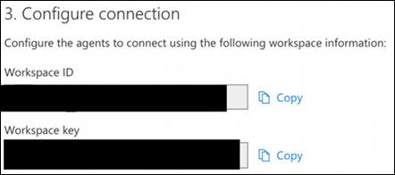
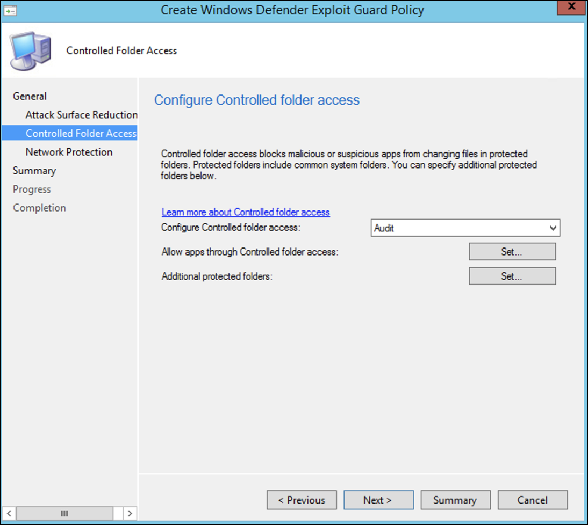

# Onboarding mithilfe des Microsoft Endpoint Configuration Manager

[!INCLUDE [Microsoft 365 Defender rebranding](../../includes/microsoft-defender.md)]

**Gilt für:**
- [Microsoft Defender für Endpunkt](https://go.microsoft.com/fwlink/p/?linkid=2154037)
- [Microsoft 365 Defender](https://go.microsoft.com/fwlink/?linkid=2118804)

> Möchten Sie Microsoft Defender für Endpunkt erleben? [Registrieren Sie sich für eine kostenlose Testversion.](https://www.microsoft.com/microsoft-365/windows/microsoft-defender-atp?ocid=docs-wdatp-exposedapis-abovefoldlink)

Dieser Artikel ist Teil des Bereitstellungshandbuchs und dient als Beispiel für eine Onboardingmethode. 

Im [Thema "Planung"](deployment-strategy.md) wurden verschiedene Methoden zum Onboarding von Geräten in den Dienst bereitgestellt. In diesem Thema wird die Co-Management-Architektur behandelt. 

 *(Diagramm der Umgebungsarchitekturen)*

Während Defender für Endpunkt das Onboarding verschiedener Endpunkte und Tools unterstützt, werden diese in diesem Artikel nicht behandelt. Informationen zum allgemeinen Onboarding mit anderen unterstützten Bereitstellungstools und -methoden finden Sie in der [Onboarding-Übersicht.](onboarding.md)

In diesem Thema werden Benutzer zu folgenden Themen geleitet:
- Schritt 1: Onboarding Windows Geräte in den Dienst 
- Schritt 2: Konfigurieren von Defender für Endpunkt-Funktionen

Dieser Onboardingleitfaden führt Sie durch die folgenden grundlegenden Schritte, die Sie bei der Verwendung von Microsoft Endpoint Configuration Manager ausführen müssen:
- **Erstellen einer Sammlung in Microsoft Endpoint Configuration Manager**
- **Konfigurieren von Microsoft Defender für Endpunktfunktionen mit Microsoft Endpoint Configuration Manager**

>[!NOTE]
>In dieser Beispielbereitstellung werden nur Windows Geräte behandelt. 

## Schritt 1: Onboarding von Windows Geräten mit Microsoft Endpoint Configuration Manager

### Sammlungserstellung
Um Windows 10 Geräte mit Microsoft Endpoint Configuration Manager zu integrieren, kann die Bereitstellung auf eine vorhandene Sammlung abzielen, oder eine neue Sammlung kann zu Testzwecken erstellt werden. 

Beim Onboarding mit Tools wie Gruppenrichtlinien oder manuellen Methoden wird kein Agent auf dem System installiert. 

Innerhalb der Microsoft Endpoint Configuration Manager Konsole wird der Onboardingprozess als Teil der Complianceeinstellungen innerhalb der Konsole konfiguriert.

Jedes System, das diese erforderliche Konfiguration empfängt, behält diese Konfiguration so lange bei, wie der Configuration Manager-Client diese Richtlinie weiterhin vom Verwaltungspunkt erhält. 

Führen Sie die folgenden Schritte aus, um Endpunkte mithilfe von Microsoft Endpoint Configuration Manager zu integrieren.

1. Navigieren Sie in Microsoft Endpoint Configuration Manager Konsole zu **\> \> Gerätesammlungen für Objekte und Kompatibilitätsübersicht.**            

    

2. Klicken Sie mit der rechten Maustaste auf **"Gerätesammlung",** und wählen **Sie "Gerätesammlung erstellen" aus.**

    

3. Geben Sie einen **Namen** und eine **begrenzende Auflistung** an, und wählen Sie dann **Weiter** aus.

    

4. Wählen Sie **"Regel hinzufügen"** und dann **"Abfrageregel"** aus.

    

5.  Klicken Sie im **Assistenten für** direkte Mitgliedschaft auf **"Weiter",** und klicken Sie auf **"Abfrage-Anweisung bearbeiten".**

     

6. Wählen Sie **Kriterien** aus, und wählen Sie dann das Sternsymbol aus.

     

7. Behalten Sie den Kriterientyp als **einfachen Wert** bei, wählen Sie aus, wo als **Betriebssystem – Buildnummer**, Operator größer als oder gleich und Wert **14393** **ist,** und klicken Sie auf **OK**.

    

8. Wählen Sie **"Weiter"** und **"Schließen"** aus.

    

9. Klicken Sie auf **Weiter**.

    

Nach Abschluss dieser Aufgabe verfügen Sie nun über eine Gerätesammlung mit allen Windows 10 Endpunkten in der Umgebung. 

## Schritt 2: Konfigurieren der Microsoft Defender für Endpunkt-Funktionen 
In diesem Abschnitt werden Die folgenden Funktionen mithilfe von Microsoft Endpoint Configuration Manager auf Windows Geräten konfiguriert:

- [**Erkennung und Reaktion am Endpunkt**](#endpoint-detection-and-response)
- [**Schutzlösungen der nächsten Generation**](#next-generation-protection)
- [**Verringerung der Angriffsfläche**](#attack-surface-reduction)

### Erkennung und Reaktion am Endpunkt
#### Windows 10
Innerhalb der Microsoft Defender Security Center ist es möglich, die Richtlinie ".onboarding" herunterzuladen, mit der die Richtlinie in System Center Configuration Manager erstellt und auf Windows 10 Geräten bereitgestellt werden kann.

1. Wählen Sie in einem Microsoft Defender Security Center-Portal [Einstellungen und dann Onboarding](https://securitycenter.windows.com/preferences2/onboarding)aus.

2. Wählen Sie unter "Bereitstellungsmethode" die unterstützte Version von **Microsoft Endpoint Configuration Manager** aus.

    

3. Wählen Sie **"Paket herunterladen" aus.**

    

4. Speichern Sie das Paket an einem zugänglichen Speicherort.
5. Navigieren Sie in Microsoft Endpoint Configuration Manager zu: **Assets and Compliance > Overview > Endpoint Protection > Microsoft Defender ATP Policies**.

6. Klicken Sie mit der rechten Maustaste auf **Microsoft Defender ATP Richtlinien,** und wählen **Sie Microsoft Defender ATP Richtlinie erstellen** aus.

    

7. Geben Sie den Namen und die Beschreibung ein, überprüfen Sie, ob **das Onboarding** ausgewählt ist, und wählen Sie dann **"Weiter"** aus.

    

8. Klicken Sie auf **Durchsuchen**.

9. Navigieren Sie zum Speicherort der heruntergeladenen Datei aus Schritt 4 oben.

10. Klicken Sie auf **Weiter**.
11. Konfigurieren Sie den Agent mit den entsprechenden Beispielen (**Keine** oder **alle Dateitypen).**

    

12. Wählen Sie die entsprechende Telemetrie (**Normal** oder **beschleunigt)** aus, und klicken Sie dann auf **"Weiter".**

    

14. Überprüfen Sie die Konfiguration, und klicken Sie dann auf **"Weiter".**

     

15. Klicken Sie auf **"Schließen",** wenn der Assistent abgeschlossen ist.

16.  Klicken Sie in der konsole Microsoft Endpoint Configuration Manager mit der rechten Maustaste auf die soeben erstellte Defender für Endpunkt-Richtlinie, und wählen Sie **"Bereitstellen" aus.**

     

17. Wählen Sie im rechten Bereich die zuvor erstellte Sammlung aus, und klicken Sie auf **"OK".**

    

#### Frühere Versionen von Windows Client (Windows 7 und Windows 8.1)
Führen Sie die folgenden Schritte aus, um die Defender für Endpunkt-Arbeitsbereichs-ID und den Arbeitsbereichsschlüssel zu identifizieren, die für das Onboarding früherer Versionen von Windows erforderlich sind.

1. Wählen Sie in einem Microsoft Defender Security Center-Portal **Einstellungen > Onboarding** aus.

2. Wählen Sie unter Betriebssystem **Windows 7 SP1 und 8.1** aus.

3. Kopieren Sie die **Arbeitsbereichs-ID** und den **Arbeitsbereichsschlüssel,** und speichern Sie sie. Sie werden später im Prozess verwendet.

    

4. Installieren Sie die Microsoft Monitoring Agent (MMA).  
    MMA wird derzeit (ab Januar 2019) unter den folgenden Windows Betriebssystemen unterstützt:

    -   Server-SKUs: Windows Server 2008 SP1 oder höher

    -   Client-SKUs: Windows 7 SP1 und höher

    Der MMA-Agent muss auf Windows Geräten installiert werden. Um den Agent zu installieren, müssen einige Systeme das [Update für Kundenerfahrung und Diagnosetelemetrie](https://support.microsoft.com/help/3080149/update-for-customer-experience-and-diagnostic-telemetry) herunterladen, um die Daten mit MMA zu sammeln. Diese Systemversionen umfassen unter anderem Folgendes:

    -   Windows 8.1

    -   Windows 7

    -   Windows Server 2016

    -   Windows Server 2012 R2

    -   Windows Server 2008 R2

    Insbesondere für Windows 7 SP1 müssen die folgenden Patches installiert werden:

    -   Installieren von [KB4074598](https://support.microsoft.com/help/4074598/windows-7-update-kb4074598)

    -   Installieren Sie entweder [.NET Framework 4.5](https://www.microsoft.com/download/details.aspx?id=30653) (oder höher) **oder** 
         [KB3154518.](https://support.microsoft.com/help/3154518/support-for-tls-system-default-versions-included-in-the-net-framework)
        Installieren Sie nicht beide auf demselben System.

5. Wenn Sie einen Proxy zum Herstellen einer Verbindung mit dem Internet verwenden, lesen Sie den Abschnitt "Proxyeinstellungen konfigurieren".

Nach Abschluss des Vorgangs sollten innerhalb einer Stunde integrierte Endpunkte im Portal angezeigt werden.

### Schutz der nächsten Generation 
Microsoft Defender Antivirus ist eine integrierte Lösung zur Bekämpfung von Schadsoftware, die Schutz der nächsten Generation für Desktops, tragbare Computer und Server bietet.

1. Navigieren Sie in der konsole Microsoft Endpoint Configuration Manager zu **Ressourcen und \> Complianceübersicht Endpoint Protection \> \> Antischadsoftwarerichtlinien,** und wählen **Sie "Antischadsoftwarerichtlinie erstellen"** aus.

    

2. Wählen Sie **geplante Scans**, **Scaneinstellungen**, **Standardaktionen**, **Echtzeitschutz**, **Ausschlusseinstellungen**, **Erweitert**, **Außerkraftsetzungen von Bedrohungen**, **Cloud Protection Service** und Security **Intelligence-Updates** aus, und wählen Sie **OK** aus.

    

    In bestimmten Branchen oder einigen ausgewählten Unternehmen haben Kunden möglicherweise bestimmte Anforderungen an die Konfiguration von Antivirus.

  
    [Schnellscan im Vergleich zum vollständigen Scan und benutzerdefinierter Scan](/windows/security/threat-protection/microsoft-defender-antivirus/scheduled-catch-up-scans-microsoft-defender-antivirus#quick-scan-versus-full-scan-and-custom-scan)

    Weitere Informationen finden Sie unter [Windows-Sicherheit Konfigurationsframework.](/windows/security/threat-protection/windows-security-configuration-framework/windows-security-configuration-framework)
  
    

    

    

    

    

    

    

    

3. Klicken Sie mit der rechten Maustaste auf die neu erstellte Antischadsoftwarerichtlinie, und wählen Sie **"Bereitstellen" aus.**

    

4. Richten Sie die neue Antischadsoftwarerichtlinie an Ihre Windows 10-Sammlung aus, und klicken Sie auf **"OK".**

     

Nachdem Sie diese Aufgabe abgeschlossen haben, haben Sie nun Windows Defender Antivirus erfolgreich konfiguriert.

### Verringerung der Angriffsfläche
Die Attack Surface Reduction-Säule von Defender für Endpunkt umfasst den Featuresatz, der unter Exploit Guard verfügbar ist. Attack Surface Reduction (ASR)-Regeln, kontrollierter Ordnerzugriff, Netzwerkschutz und Exploit-Schutz. 

Alle diese Features bieten einen Überwachungsmodus und einen Blockierungsmodus. Im Überwachungsmodus gibt es keine Auswirkungen auf endbenutzer. Sie sammeln nur zusätzliche Telemetriedaten und stellen sie im Microsoft Defender Security Center zur Verfügung. Das Ziel bei einer Bereitstellung ist das schrittweise Verschieben von Sicherheitssteuerelementen in den Blockierungsmodus.

So legen Sie ASR-Regeln im Überwachungsmodus fest:

1. Navigieren Sie in der konsole Microsoft Endpoint Configuration Manager zu **Ressourcen und \> Complianceübersicht Endpoint Protection Windows Defender Exploit \> \> Guard,** und wählen **Sie Exploit Guard-Richtlinie erstellen** aus.

   

2.  Wählen Sie **Attack Surface Reduction aus.**
   

3. Legen Sie Regeln zum **Überwachen fest,** und klicken Sie auf **"Weiter".**

    

4. Bestätigen Sie die neue Exploit Guard-Richtlinie, indem Sie auf **"Weiter"** klicken.

    

    
5. Nachdem die Richtlinie erstellt wurde, klicken Sie auf **"Schließen".**

    

    
   

6.  Klicken Sie mit der rechten Maustaste auf die neu erstellte Richtlinie, und wählen Sie **"Bereitstellen" aus.**
    
    

7. Legen Sie die Richtlinie auf die neu erstellte Windows 10 sammlung fest, und klicken Sie auf **"OK".**

    

Nachdem Sie diese Aufgabe abgeschlossen haben, haben Sie die ASR-Regeln jetzt erfolgreich im Überwachungsmodus konfiguriert.  
  
Nachfolgend finden Sie zusätzliche Schritte, um zu überprüfen, ob ASR-Regeln korrekt auf Endpunkte angewendet werden. (Dies kann einige Minuten dauern.)

1. Navigieren Sie in einem Webbrowser zu <https://securitycenter.windows.com> .

2.  Wählen Sie im linken Menü die **Option "Konfigurationsverwaltung"** aus.

3. Klicken Sie im Verwaltungsbereich "Angriffsoberfläche" auf **"Zur Angriffsflächenverwaltung** wechseln". 
    
    

4. Klicken Sie auf die Registerkarte **"Konfiguration"** in den Berichten zu Attack Surface Reduction-Regeln. Es enthält eine Übersicht über die ASR-Regelkonfiguration und den ASR-Regelstatus auf jedem Gerät.

    

5. Klicken Sie auf jedes Gerät, um Konfigurationsdetails der ASR-Regeln anzuzeigen.

    

Weitere Informationen finden Sie unter Optimieren der [BEREITSTELLUNG und Erkennung von ASR-Regeln.](/microsoft-365/security/defender-endpoint/configure-machines-asr)  

#### Festlegen von Netzwerkschutzregeln im Überwachungsmodus:
1. Navigieren Sie in der konsole Microsoft Endpoint Configuration Manager zu **Assets and Compliance Overview Endpoint Protection Windows Defender Exploit \> \> \> Guard,** und wählen **Sie Exploit Guard-Richtlinie erstellen** aus.

    

2. Wählen Sie **"Netzwerkschutz"** aus.

3. Legen Sie die Einstellung auf **"Überwachen"** fest, und klicken Sie auf **"Weiter".** 

    

4. Bestätigen Sie die neue Exploit Guard-Richtlinie, indem Sie auf **"Weiter"** klicken.
    
    

5. Klicken Sie nach dem Erstellen der Richtlinie auf **"Schließen".**

    

6. Klicken Sie mit der rechten Maustaste auf die neu erstellte Richtlinie, und wählen Sie **"Bereitstellen" aus.**

    

7. Wählen Sie die Richtlinie für die neu erstellte Windows 10 sammlung aus, und wählen Sie **OK** aus.

    

Nachdem Sie diese Aufgabe abgeschlossen haben, haben Sie den Netzwerkschutz jetzt erfolgreich im Überwachungsmodus konfiguriert.

#### So legen Sie regeln für den kontrollierten Ordnerzugriff im Überwachungsmodus fest:

1. Navigieren Sie in der konsole Microsoft Endpoint Configuration Manager zu **Ressourcen und \> Complianceübersicht Endpoint Protection Windows Defender Exploit \> \> Guard,** und wählen **Sie Exploit Guard-Richtlinie erstellen** aus.

    

2. Wählen Sie **den kontrollierten Ordnerzugriff aus.**
    
3. Legen Sie die Konfiguration auf **"Überwachen"** fest, und klicken Sie auf **"Weiter".**

        
    
4. Bestätigen Sie die neue Exploit Guard-Richtlinie, indem Sie auf **"Weiter"** klicken.

    

5. Klicken Sie nach dem Erstellen der Richtlinie auf **"Schließen".**

    

6. Klicken Sie mit der rechten Maustaste auf die neu erstellte Richtlinie, und wählen Sie **"Bereitstellen" aus.**

    

7.  Legen Sie die Richtlinie auf die neu erstellte Windows 10 sammlung fest, und klicken Sie auf **"OK".**

    

Sie haben nun den kontrollierten Ordnerzugriff im Überwachungsmodus erfolgreich konfiguriert.

## Verwandtes Thema
- [Onboarding mithilfe des Microsoft Endpoint Manager](onboarding-endpoint-manager.md)
