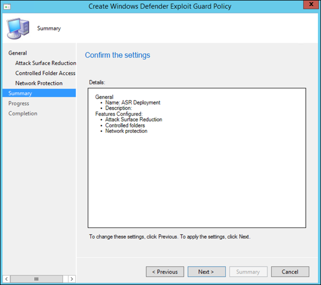

# Onboarding mithilfe des Microsoft Endpoint Configuration ManagerOnboarding using Microsoft Endpoint Configuration Manager

[!INCLUDE [Microsoft 365 Defender rebranding](../../includes/microsoft-defender.md)]

**Gilt für:****Applies to:**
- [Microsoft Defender für EndpunktMicrosoft Defender for Endpoint](https://go.microsoft.com/fwlink/p/?linkid=2154037)
- [Microsoft 365 DefenderMicrosoft 365 Defender](https://go.microsoft.com/fwlink/?linkid=2118804)

> Möchten Sie Microsoft Defender für Endpunkt erleben?Want to experience Microsoft Defender for Endpoint? [Registrieren Sie sich für eine kostenlose Testversion.Sign up for a free trial.](https://www.microsoft.com/microsoft-365/windows/microsoft-defender-atp?ocid=docs-wdatp-exposedapis-abovefoldlink)

Dieser Artikel ist Teil des Bereitstellungshandbuchs und dient als Beispiel für eine Onboardingmethode.This article is part of the Deployment guide and acts as an example onboarding method. 

Im [Thema "Planung"](deployment-strategy.md) wurden verschiedene Methoden zum Onboarding von Geräten in den Dienst bereitgestellt.In the [Planning](deployment-strategy.md) topic, there were several methods provided to onboard devices to the service. In diesem Thema wird die Co-Management-Architektur behandelt.This topic covers the co-management architecture. 

 *(Diagramm der Umgebungsarchitekturen)*
*Diagram of environment architectures*

Während Defender für Endpunkt das Onboarding verschiedener Endpunkte und Tools unterstützt, werden diese in diesem Artikel nicht behandelt.While Defender for Endpoint supports onboarding of various endpoints and tools, this article does not cover them. Informationen zum allgemeinen Onboarding mit anderen unterstützten Bereitstellungstools und -methoden finden Sie in der [Onboarding-Übersicht.](onboarding.md)For information on general onboarding using other supported deployment tools and methods, see [Onboarding overview](onboarding.md).

In diesem Thema werden Benutzer zu folgenden Themen geleitet:This topic guides users in:
- Schritt 1: Onboarding Windows Geräte in den DienstStep 1: Onboarding Windows devices to the service 
- Schritt 2: Konfigurieren von Defender für Endpunkt-FunktionenStep 2: Configuring Defender for Endpoint capabilities

Dieser Onboardingleitfaden führt Sie durch die folgenden grundlegenden Schritte, die Sie bei der Verwendung von Microsoft Endpoint Configuration Manager ausführen müssen:This onboarding guidance will walk you through the following basic steps that you need to take when using Microsoft Endpoint Configuration Manager:
- **Erstellen einer Sammlung in Microsoft Endpoint Configuration Manager****Creating a collection in Microsoft Endpoint Configuration Manager**
- **Konfigurieren von Microsoft Defender für Endpunktfunktionen mit Microsoft Endpoint Configuration Manager****Configuring Microsoft Defender for Endpoint capabilities using Microsoft Endpoint Configuration Manager**

>[!NOTE]
>In dieser Beispielbereitstellung werden nur Windows Geräte behandelt.Only Windows devices are covered in this example deployment. 

## Schritt 1: Onboarding von Windows Geräten mit Microsoft Endpoint Configuration ManagerStep 1: Onboard Windows devices using Microsoft Endpoint Configuration Manager

### SammlungserstellungCollection creation
Um Windows 10 Geräte mit Microsoft Endpoint Configuration Manager zu integrieren, kann die Bereitstellung auf eine vorhandene Sammlung abzielen, oder eine neue Sammlung kann zu Testzwecken erstellt werden.To onboard Windows 10 devices with Microsoft Endpoint Configuration Manager, the deployment can target an existing collection or a new collection can be created for testing. 

Beim Onboarding mit Tools wie Gruppenrichtlinien oder manuellen Methoden wird kein Agent auf dem System installiert.Onboarding using tools such as Group policy or manual method does not install any agent on the system. 

Innerhalb der Microsoft Endpoint Configuration Manager Konsole wird der Onboardingprozess als Teil der Complianceeinstellungen innerhalb der Konsole konfiguriert.Within the Microsoft Endpoint Configuration Manager console the onboarding process will be configured as part of the compliance settings within the console.

Jedes System, das diese erforderliche Konfiguration empfängt, behält diese Konfiguration so lange bei, wie der Configuration Manager-Client diese Richtlinie weiterhin vom Verwaltungspunkt erhält.Any system that receives this required configuration will maintain that configuration for as long as the Configuration Manager client continues to receive this policy from the management point. 

Führen Sie die folgenden Schritte aus, um Endpunkte mithilfe von Microsoft Endpoint Configuration Manager zu integrieren.Follow the steps below to onboard endpoints using Microsoft Endpoint Configuration Manager.

1. Navigieren Sie in Microsoft Endpoint Configuration Manager Konsole zu **\> \> Gerätesammlungen für Objekte und Kompatibilitätsübersicht.**In Microsoft Endpoint Configuration Manager console, navigate to **Assets and Compliance \> Overview \> Device Collections**.            

    

2. Klicken Sie mit der rechten Maustaste auf **"Gerätesammlung",** und wählen **Sie "Gerätesammlung erstellen" aus.**Right Click **Device Collection** and select **Create Device Collection**.

    

3. Geben Sie einen **Namen** und eine **begrenzende Auflistung** an, und wählen Sie dann **Weiter** aus.Provide a **Name** and **Limiting Collection**, then select **Next**.

    

4. Wählen Sie **"Regel hinzufügen"** und dann **"Abfrageregel"** aus.Select **Add Rule** and choose **Query Rule**.

    

5.  Klicken Sie im **Assistenten für** direkte Mitgliedschaft auf **"Weiter",** und klicken Sie auf **"Abfrage-Anweisung bearbeiten".**Click **Next** on the **Direct Membership Wizard** and click on **Edit Query Statement**.

     

6. Wählen Sie **Kriterien** aus, und wählen Sie dann das Sternsymbol aus.Select **Criteria** and then choose the star icon.

     

7. Behalten Sie den Kriterientyp als **einfachen Wert** bei, wählen Sie aus, wo als **Betriebssystem – Buildnummer**, Operator größer als oder gleich und Wert **14393** **ist,** und klicken Sie auf **OK**.Keep criterion type as **simple value**, choose where as **Operating System - build number**, operator as **is greater than or equal to** and value **14393** and click on **OK**.

    

8. Wählen Sie **"Weiter"** und **"Schließen"** aus.Select **Next** and **Close**.

    

9. Klicken Sie auf **Weiter**.Select **Next**.

    

Nach Abschluss dieser Aufgabe verfügen Sie nun über eine Gerätesammlung mit allen Windows 10 Endpunkten in der Umgebung.After completing this task, you now have a device collection with all the Windows 10 endpoints in the environment. 

## Schritt 2: Konfigurieren der Microsoft Defender für Endpunkt-FunktionenStep 2: Configure Microsoft Defender for Endpoint capabilities 
In diesem Abschnitt werden Die folgenden Funktionen mithilfe von Microsoft Endpoint Configuration Manager auf Windows Geräten konfiguriert:This section guides you in configuring the following capabilities using Microsoft Endpoint Configuration Manager on Windows devices:

- [**Erkennung und Reaktion am Endpunkt****Endpoint detection and response**](#endpoint-detection-and-response)
- [**Schutzlösungen der nächsten Generation****Next-generation protection**](#next-generation-protection)
- [**Verringerung der Angriffsfläche****Attack surface reduction**](#attack-surface-reduction)

### Erkennung und Reaktion am EndpunktEndpoint detection and response
#### Windows 10Windows 10
Innerhalb der Microsoft Defender Security Center ist es möglich, die Richtlinie ".onboarding" herunterzuladen, mit der die Richtlinie in System Center Configuration Manager erstellt und auf Windows 10 Geräten bereitgestellt werden kann.From within the Microsoft Defender Security Center it is possible to download the '.onboarding' policy that can be used to create the policy in System Center Configuration Manager and deploy that policy to Windows 10 devices.

1. Wählen Sie in einem Microsoft Defender Security Center-Portal [Einstellungen und dann Onboarding](https://securitycenter.windows.com/preferences2/onboarding)aus.From a Microsoft Defender Security Center Portal, select [Settings and then Onboarding](https://securitycenter.windows.com/preferences2/onboarding).

2. Wählen Sie unter "Bereitstellungsmethode" die unterstützte Version von **Microsoft Endpoint Configuration Manager** aus.Under Deployment method select the supported version of **Microsoft Endpoint Configuration Manager**.

    

3. Wählen Sie **"Paket herunterladen" aus.**Select **Download package**.

    

4. Speichern Sie das Paket an einem zugänglichen Speicherort.Save the package to an accessible location.
5. Navigieren Sie in Microsoft Endpoint Configuration Manager zu: **Assets and Compliance > Overview > Endpoint Protection > Microsoft Defender ATP Policies**.In  Microsoft Endpoint Configuration Manager, navigate to: **Assets and Compliance > Overview > Endpoint Protection > Microsoft Defender ATP Policies**.

6. Klicken Sie mit der rechten Maustaste auf **Microsoft Defender ATP Richtlinien,** und wählen **Sie Microsoft Defender ATP Richtlinie erstellen** aus.Right-click **Microsoft Defender ATP Policies** and select **Create Microsoft Defender ATP Policy**.

    

7. Geben Sie den Namen und die Beschreibung ein, überprüfen Sie, ob **das Onboarding** ausgewählt ist, und wählen Sie dann **"Weiter"** aus.Enter the name and description, verify **Onboarding** is selected, then select **Next**.

    

8. Klicken Sie auf **Durchsuchen**.Click **Browse**.

9. Navigieren Sie zum Speicherort der heruntergeladenen Datei aus Schritt 4 oben.Navigate to the location of the downloaded file from step 4 above.

10. Klicken Sie auf **Weiter**.Click **Next**.
11. Konfigurieren Sie den Agent mit den entsprechenden Beispielen (**Keine** oder **alle Dateitypen).**Configure the Agent with the appropriate samples (**None** or **All file types**).

    

12. Wählen Sie die entsprechende Telemetrie (**Normal** oder **beschleunigt)** aus, und klicken Sie dann auf **"Weiter".**Select the appropriate telemetry (**Normal** or **Expedited**) then click **Next**.

    

14. Überprüfen Sie die Konfiguration, und klicken Sie dann auf **"Weiter".**Verify the configuration, then click **Next**.

     

15. Klicken Sie auf **"Schließen",** wenn der Assistent abgeschlossen ist.Click **Close** when the Wizard completes.

16.  Klicken Sie in der konsole Microsoft Endpoint Configuration Manager mit der rechten Maustaste auf die soeben erstellte Defender für Endpunkt-Richtlinie, und wählen Sie **"Bereitstellen" aus.**In the Microsoft Endpoint Configuration Manager console, right-click the Defender for Endpoint policy you just created and select **Deploy**.

     

17. Wählen Sie im rechten Bereich die zuvor erstellte Sammlung aus, und klicken Sie auf **"OK".**On the right panel, select the previously created collection and click **OK**.

    

#### Frühere Versionen von Windows Client (Windows 7 und Windows 8.1)Previous versions of Windows Client (Windows 7 and Windows 8.1)
Führen Sie die folgenden Schritte aus, um die Defender für Endpunkt-Arbeitsbereichs-ID und den Arbeitsbereichsschlüssel zu identifizieren, die für das Onboarding früherer Versionen von Windows erforderlich sind.Follow the steps below to identify the Defender for Endpoint Workspace ID and Workspace Key, that will be required for the onboarding of previous versions of Windows.

1. Wählen Sie in einem Microsoft Defender Security Center-Portal **Einstellungen > Onboarding** aus.From a Microsoft Defender Security Center Portal, select **Settings > Onboarding**.

2. Wählen Sie unter Betriebssystem **Windows 7 SP1 und 8.1** aus.Under operating system choose **Windows 7 SP1 and 8.1**.

3. Kopieren Sie die **Arbeitsbereichs-ID** und den **Arbeitsbereichsschlüssel,** und speichern Sie sie.Copy the **Workspace ID** and **Workspace Key** and save them. Sie werden später im Prozess verwendet.They will be used later in the process.

    

4. Installieren Sie die Microsoft Monitoring Agent (MMA).Install the Microsoft Monitoring Agent (MMA).  
    MMA wird derzeit (ab Januar 2019) unter den folgenden Windows Betriebssystemen unterstützt:MMA is currently (as of January 2019) supported on the following Windows Operating Systems:

    -   Server-SKUs: Windows Server 2008 SP1 oder höherServer SKUs: Windows Server 2008 SP1 or Newer

    -   Client-SKUs: Windows 7 SP1 und höherClient SKUs: Windows 7 SP1 and later

    Der MMA-Agent muss auf Windows Geräten installiert werden.The MMA agent will need to be installed on Windows devices. Um den Agent zu installieren, müssen einige Systeme das [Update für Kundenerfahrung und Diagnosetelemetrie](https://support.microsoft.com/help/3080149/update-for-customer-experience-and-diagnostic-telemetry) herunterladen, um die Daten mit MMA zu sammeln.To install the agent, some systems will need to download the [Update for customer experience and diagnostic telemetry](https://support.microsoft.com/help/3080149/update-for-customer-experience-and-diagnostic-telemetry) in order to collect the data with MMA. Diese Systemversionen umfassen unter anderem Folgendes:These system versions include but may not be limited to:

    -   Windows 8.1Windows 8.1

    -   Windows 7Windows 7

    -   Windows Server 2016Windows Server 2016

    -   Windows Server 2012 R2Windows Server 2012 R2

    -   Windows Server 2008 R2Windows Server 2008 R2

    Insbesondere für Windows 7 SP1 müssen die folgenden Patches installiert werden:Specifically, for Windows 7 SP1, the following patches must be installed:

    -   Installieren von [KB4074598](https://support.microsoft.com/help/4074598/windows-7-update-kb4074598)Install [KB4074598](https://support.microsoft.com/help/4074598/windows-7-update-kb4074598)

    -   Installieren Sie entweder [.NET Framework 4.5](https://www.microsoft.com/download/details.aspx?id=30653) (oder höher) **oder** 
         [KB3154518.](https://support.microsoft.com/help/3154518/support-for-tls-system-default-versions-included-in-the-net-framework)Install either [.NET Framework 4.5](https://www.microsoft.com/download/details.aspx?id=30653) (or later) **or**
        [KB3154518](https://support.microsoft.com/help/3154518/support-for-tls-system-default-versions-included-in-the-net-framework).
        Installieren Sie nicht beide auf demselben System.Do not install both on the same system.

5. Wenn Sie einen Proxy zum Herstellen einer Verbindung mit dem Internet verwenden, lesen Sie den Abschnitt "Proxyeinstellungen konfigurieren".If you're using a proxy to connect to the Internet see the Configure proxy settings section.

Nach Abschluss des Vorgangs sollten innerhalb einer Stunde integrierte Endpunkte im Portal angezeigt werden.Once completed, you should see onboarded endpoints in the portal within an hour.

### Schutz der nächsten GenerationNext generation protection 
Microsoft Defender Antivirus ist eine integrierte Lösung zur Bekämpfung von Schadsoftware, die Schutz der nächsten Generation für Desktops, tragbare Computer und Server bietet.Microsoft Defender Antivirus is a built-in antimalware solution that provides next generation protection for desktops, portable computers, and servers.

1. Navigieren Sie in der konsole Microsoft Endpoint Configuration Manager zu **Ressourcen und \> Complianceübersicht Endpoint Protection \> \> Antischadsoftwarerichtlinien,** und wählen **Sie "Antischadsoftwarerichtlinie erstellen"** aus.In the Microsoft Endpoint Configuration Manager console, navigate to **Assets and Compliance \> Overview \> Endpoint Protection \> Antimalware Polices** and choose **Create Antimalware Policy**.

    

2. Wählen Sie **geplante Scans**, **Scaneinstellungen**, **Standardaktionen**, **Echtzeitschutz**, **Ausschlusseinstellungen**, **Erweitert**, **Außerkraftsetzungen von Bedrohungen**, **Cloud Protection Service** und Security **Intelligence-Updates** aus, und wählen Sie **OK** aus.Select **Scheduled scans**, **Scan settings**, **Default actions**, **Real-time protection**, **Exclusion settings**, **Advanced**, **Threat overrides**, **Cloud Protection Service** and **Security intelligence   updates** and choose **OK**.

    

    In bestimmten Branchen oder einigen ausgewählten Unternehmen haben Kunden möglicherweise bestimmte Anforderungen an die Konfiguration von Antivirus.In certain industries or some select enterprise customers might have specific needs on how Antivirus is configured.

  
    [Schnellscan im Vergleich zum vollständigen Scan und benutzerdefinierter ScanQuick scan versus full scan and custom scan](/windows/security/threat-protection/microsoft-defender-antivirus/scheduled-catch-up-scans-microsoft-defender-antivirus#quick-scan-versus-full-scan-and-custom-scan)

    Weitere Informationen finden Sie unter [Windows-Sicherheit Konfigurationsframework.](/windows/security/threat-protection/windows-security-configuration-framework/windows-security-configuration-framework)For more details, see [Windows Security configuration framework](/windows/security/threat-protection/windows-security-configuration-framework/windows-security-configuration-framework)
  
    

    

    

    

    

    

    

    

3. Klicken Sie mit der rechten Maustaste auf die neu erstellte Antischadsoftwarerichtlinie, und wählen Sie **"Bereitstellen" aus.**Right-click on the newly created antimalware policy and select **Deploy**.

    

4. Richten Sie die neue Antischadsoftwarerichtlinie an Ihre Windows 10-Sammlung aus, und klicken Sie auf **"OK".**Target the new antimalware policy to your Windows 10 collection and click **OK**.

     

Nachdem Sie diese Aufgabe abgeschlossen haben, haben Sie nun Windows Defender Antivirus erfolgreich konfiguriert.After completing this task, you now have successfully configured Windows Defender Antivirus.

### Verringerung der AngriffsflächeAttack surface reduction
Die Attack Surface Reduction-Säule von Defender für Endpunkt umfasst den Featuresatz, der unter Exploit Guard verfügbar ist.The attack surface reduction pillar of Defender for Endpoint includes the feature set that is available under Exploit Guard. Attack Surface Reduction (ASR)-Regeln, kontrollierter Ordnerzugriff, Netzwerkschutz und Exploit-Schutz.Attack surface reduction (ASR) rules, Controlled Folder Access, Network Protection and Exploit Protection. 

Alle diese Features bieten einen Überwachungsmodus und einen Blockierungsmodus.All these features provide an audit mode and a block mode. Im Überwachungsmodus gibt es keine Auswirkungen auf endbenutzer.In audit mode there is no end-user impact. Sie sammeln nur zusätzliche Telemetriedaten und stellen sie im Microsoft Defender Security Center zur Verfügung.All it does is collect additional telemetry and make it available in the Microsoft Defender Security Center. Das Ziel bei einer Bereitstellung ist das schrittweise Verschieben von Sicherheitssteuerelementen in den Blockierungsmodus.The goal with a deployment is to step-by-step move security controls into block mode.

So legen Sie ASR-Regeln im Überwachungsmodus fest:To set ASR rules in Audit mode:

1. Navigieren Sie in der konsole Microsoft Endpoint Configuration Manager zu **Ressourcen und \> Complianceübersicht Endpoint Protection Windows Defender Exploit \> \> Guard,** und wählen **Sie Exploit Guard-Richtlinie erstellen** aus.In the Microsoft Endpoint Configuration Manager console, navigate to **Assets and Compliance \> Overview \> Endpoint Protection \> Windows Defender Exploit Guard** and choose **Create Exploit Guard Policy**.

   

2.  Wählen Sie **Attack Surface Reduction aus.**Select **Attack Surface Reduction**.
   

3. Legen Sie Regeln zum **Überwachen fest,** und klicken Sie auf **"Weiter".**Set rules to **Audit** and click **Next**.

    

4. Bestätigen Sie die neue Exploit Guard-Richtlinie, indem Sie auf **"Weiter"** klicken.Confirm the new Exploit Guard policy by clicking on **Next**.

    

    
5. Nachdem die Richtlinie erstellt wurde, klicken Sie auf **"Schließen".**Once the policy is created click **Close**.

    

    
   

6.  Klicken Sie mit der rechten Maustaste auf die neu erstellte Richtlinie, und wählen Sie **"Bereitstellen" aus.**Right-click on the newly created policy and choose **Deploy**.
    
    

7. Legen Sie die Richtlinie auf die neu erstellte Windows 10 sammlung fest, und klicken Sie auf **"OK".**Target the policy to the newly created Windows 10 collection and click **OK**.

    

Nachdem Sie diese Aufgabe abgeschlossen haben, haben Sie die ASR-Regeln jetzt erfolgreich im Überwachungsmodus konfiguriert.After completing this task, you now have successfully configured ASR rules in audit mode.  
  
Nachfolgend finden Sie zusätzliche Schritte, um zu überprüfen, ob ASR-Regeln korrekt auf Endpunkte angewendet werden.Below are additional steps to verify whether ASR rules are correctly applied to endpoints. (Dies kann einige Minuten dauern.)(This may take few minutes)

1. Navigieren Sie in einem Webbrowser zu <https://securitycenter.windows.com> .From a web browser, navigate to <https://securitycenter.windows.com>.

2.  Wählen Sie im linken Menü die **Option "Konfigurationsverwaltung"** aus.Select **Configuration management** from left side menu.

3. Klicken Sie im Verwaltungsbereich "Angriffsoberfläche" auf **"Zur Angriffsflächenverwaltung** wechseln".Click **Go to attack surface management** in the Attack surface management panel. 
    
    

4. Klicken Sie auf die Registerkarte **"Konfiguration"** in den Berichten zu Attack Surface Reduction-Regeln.Click **Configuration** tab in Attack surface reduction rules reports. Es enthält eine Übersicht über die ASR-Regelkonfiguration und den ASR-Regelstatus auf jedem Gerät.It shows ASR rules configuration overview and ASR rules status on each devices.

    

5. Klicken Sie auf jedes Gerät, um Konfigurationsdetails der ASR-Regeln anzuzeigen.Click each device shows configuration details of ASR rules.

    

Weitere Informationen finden Sie unter Optimieren der [BEREITSTELLUNG und Erkennung von ASR-Regeln.](/microsoft-365/security/defender-endpoint/configure-machines-asr)See [Optimize ASR rule deployment and detections](/microsoft-365/security/defender-endpoint/configure-machines-asr)   for more details.  

#### Festlegen von Netzwerkschutzregeln im Überwachungsmodus:Set Network Protection rules in Audit mode:
1. Navigieren Sie in der konsole Microsoft Endpoint Configuration Manager zu **Assets and Compliance Overview Endpoint Protection Windows Defender Exploit \> \> \> Guard,** und wählen **Sie Exploit Guard-Richtlinie erstellen** aus.In the Microsoft Endpoint Configuration Manager console, navigate to **Assets and  Compliance \> Overview \> Endpoint Protection \> Windows Defender Exploit Guard** and choose **Create Exploit Guard Policy**.

    

2. Wählen Sie **"Netzwerkschutz"** aus.Select **Network protection**.

3. Legen Sie die Einstellung auf **"Überwachen"** fest, und klicken Sie auf **"Weiter".**Set the setting to **Audit** and click **Next**. 

    

4. Bestätigen Sie die neue Exploit Guard-Richtlinie, indem Sie auf **"Weiter"** klicken.Confirm the new Exploit Guard Policy by clicking **Next**.
    
    

5. Klicken Sie nach dem Erstellen der Richtlinie auf **"Schließen".**Once the policy is created click on **Close**.

    

6. Klicken Sie mit der rechten Maustaste auf die neu erstellte Richtlinie, und wählen Sie **"Bereitstellen" aus.**Right-click on the newly created policy and choose **Deploy**.

    

7. Wählen Sie die Richtlinie für die neu erstellte Windows 10 sammlung aus, und wählen Sie **OK** aus.Select the policy to the newly created Windows 10 collection and choose **OK**.

    

Nachdem Sie diese Aufgabe abgeschlossen haben, haben Sie den Netzwerkschutz jetzt erfolgreich im Überwachungsmodus konfiguriert.After completing this task, you now have successfully configured Network Protection in audit mode.

#### So legen Sie regeln für den kontrollierten Ordnerzugriff im Überwachungsmodus fest:To set Controlled Folder Access rules in Audit mode:

1. Navigieren Sie in der konsole Microsoft Endpoint Configuration Manager zu **Ressourcen und \> Complianceübersicht Endpoint Protection Windows Defender Exploit \> \> Guard,** und wählen **Sie Exploit Guard-Richtlinie erstellen** aus.In the Microsoft Endpoint Configuration Manager console, navigate to **Assets and Compliance \> Overview \> Endpoint Protection \> Windows Defender Exploit Guard** and choose **Create Exploit Guard Policy**.

    

2. Wählen Sie **den kontrollierten Ordnerzugriff aus.**Select **Controlled folder access**.
    
3. Legen Sie die Konfiguration auf **"Überwachen"** fest, und klicken Sie auf **"Weiter".**Set the configuration to **Audit** and click **Next**.

        
    
4. Bestätigen Sie die neue Exploit Guard-Richtlinie, indem Sie auf **"Weiter"** klicken.Confirm the new Exploit Guard Policy by clicking on **Next**.

    

5. Klicken Sie nach dem Erstellen der Richtlinie auf **"Schließen".**Once the policy is created click on **Close**.

    

6. Klicken Sie mit der rechten Maustaste auf die neu erstellte Richtlinie, und wählen Sie **"Bereitstellen" aus.**Right-click on the newly created policy and choose **Deploy**.

    

7.  Legen Sie die Richtlinie auf die neu erstellte Windows 10 sammlung fest, und klicken Sie auf **"OK".**Target the policy to the newly created Windows 10 collection and click **OK**.

    

Sie haben nun den kontrollierten Ordnerzugriff im Überwachungsmodus erfolgreich konfiguriert.You have now successfully configured Controlled folder access in audit mode.

## Verwandtes ThemaRelated topic
- [Onboarding mithilfe des Microsoft Endpoint ManagerOnboarding using Microsoft Endpoint Manager](onboarding-endpoint-manager.md)
