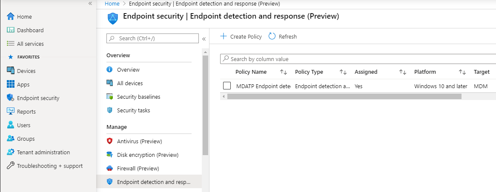

# Onboarding mit Microsoft Endpoint ManagerOnboarding using Microsoft Endpoint Manager

[!INCLUDE [Microsoft 365 Defender rebranding](../../includes/microsoft-defender.md)]

**Gilt für:****Applies to:**
- [Microsoft Defender für EndpunktMicrosoft Defender for Endpoint](https://go.microsoft.com/fwlink/p/?linkid=2146631)
- [Microsoft 365 DefenderMicrosoft 365 Defender](https://go.microsoft.com/fwlink/?linkid=2118804)

> Möchten Sie Microsoft Defender for Endpoint erleben?Want to experience Microsoft Defender for Endpoint? [Registrieren Sie sich für eine kostenlose Testversion.Sign up for a free trial.](https://www.microsoft.com/microsoft-365/windows/microsoft-defender-atp?ocid=docs-wdatp-exposedapis-abovefoldlink)

Dieser Artikel ist Teil des Bereitstellungshandbuchs und dient als Beispiel für ein Onboarding.This article is part of the Deployment guide and acts as an example onboarding method. 

Im Thema [Planning](deployment-strategy.md) wurden verschiedene Methoden zum Onboarding von Geräten in den Dienst bereitgestellt.In the [Planning](deployment-strategy.md) topic, there were several methods provided to onboard devices to the service. In diesem Thema wird die cloudeigene Architektur behandelt.This topic covers the cloud-native architecture. 

 *Diagramm der Umgebungsarchitekturen*
*Diagram of environment architectures*

Während Defender for Endpoint das Onboarding verschiedener Endpunkte und Tools unterstützt, werden diese in diesem Artikel nicht behandelt.While Defender for Endpoint supports onboarding of various endpoints and tools, this article does not cover them. Informationen zum allgemeinen Onboarding mit anderen unterstützten Bereitstellungstools und -methoden finden Sie unter [Onboarding overview](onboarding.md).For information on general onboarding using other supported deployment tools and methods, see [Onboarding overview](onboarding.md).

[Microsoft Endpoint Manager](https://docs.microsoft.com/mem/endpoint-manager-overview) ist eine Lösungsplattform, die mehrere Dienste vereint.[Microsoft Endpoint Manager](https://docs.microsoft.com/mem/endpoint-manager-overview) is a solution platform that unifies several services. Es umfasst [Microsoft Intune](https://docs.microsoft.com/mem/intune/fundamentals/what-is-intune) für die cloudbasierte Geräteverwaltung.It includes [Microsoft Intune](https://docs.microsoft.com/mem/intune/fundamentals/what-is-intune) for cloud-based device management.

In diesem Thema werden Benutzer in den themen:This topic guides users in:
- Schritt 1: Onboarding von Geräten in den Dienst durch Erstellen einer Gruppe im Microsoft Endpoint Manager (MEM) zum Zuweisen von Konfigurationen fürStep 1: Onboarding devices to the service by creating a group in Microsoft Endpoint Manager (MEM) to assign configurations on
- Schritt 2: Konfigurieren von Defender for Endpoint-Funktionen mithilfe von Microsoft Endpoint ManagerStep 2: Configuring Defender for Endpoint capabilities using Microsoft Endpoint Manager

In diesem Onboardingleitfaden werden Sie durch die folgenden grundlegenden Schritte geleitet, die Sie bei der Verwendung von Microsoft Endpoint Manager ausführen müssen:This onboarding guidance will walk you through the following basic steps that you need to take when using Microsoft Endpoint Manager:

-   [Identifizieren von Zielgeräten oder BenutzernIdentifying target devices or users](#identify-target-devices-or-users)

    -   Erstellen einer Azure Active Directory-Gruppe (Benutzer oder Gerät)Creating an Azure Active Directory group (User or Device)

-   [Erstellen eines KonfigurationsprofilsCreating a Configuration Profile](#step-2-create-configuration-policies-to-configure-microsoft-defender-for-endpoint-capabilities)

    -   In Microsoft Endpoint Manager führen wir Sie beim Erstellen einer separaten Richtlinie für jede Funktion.In Microsoft Endpoint Manager, we'll guide you in creating a separate policy for each capability.

## RessourcenResources

Hier sind die Links, die Sie für den Rest des Prozesses benötigen:Here are the links you'll need for the rest of the process:

-   [MEM-PortalMEM portal](https://aka.ms/memac)

-   [Security CenterSecurity Center](https://securitycenter.windows.com/)

-   [Intune-SicherheitsgrundwerteIntune Security baselines](https://docs.microsoft.com/mem/intune/protect/security-baseline-settings-defender-atp#microsoft-defender)

Weitere Informationen zu Microsoft Endpoint Manager finden Sie in den folgenden Ressourcen:For more information about Microsoft Endpoint Manager, check out these resources:
- [Microsoft Endpoint Manager-SeiteMicrosoft Endpoint Manager page](https://docs.microsoft.com/mem/)
- [Blogbeitrag zur Konvergenz von Intune und ConfigMgrBlog post on convergence of Intune and ConfigMgr](https://www.microsoft.com/microsoft-365/blog/2019/11/04/use-the-power-of-cloud-intelligence-to-simplify-and-accelerate-it-and-the-move-to-a-modern-workplace/)
- [Einführungsvideo zu MEMIntroduction video on MEM](https://www.microsoft.com/microsoft-365/blog/2019/11/04/use-the-power-of-cloud-intelligence-to-simplify-and-accelerate-it-and-the-move-to-a-modern-workplace)

## Schritt 1: Onboarding von Geräten durch Erstellen einer Gruppe in MEM zum Zuweisen von Konfigurationen fürStep 1: Onboard devices by creating a group in MEM to assign configurations on
### Identifizieren von Zielgeräten oder BenutzernIdentify target devices or users
In diesem Abschnitt erstellen wir eine Testgruppe zum Zuweisen Ihrer Konfigurationen.In this section, we will create a test group to assign your configurations on.

>[!NOTE]
>Intune verwendet Azure Active Directory (Azure AD)-Gruppen zum Verwalten von Geräten und Benutzern.Intune uses Azure Active Directory (Azure AD) groups to manage devices and users. Als Intune-Administrator können Sie Gruppen entsprechend Ihren Organisatorischen Anforderungen einrichten.As an Intune admin, you can set up groups to suit your organizational needs. 
Weitere Informationen finden Sie unter [Hinzufügen von Gruppen zum Organisieren von Benutzern und Geräten.](https://docs.microsoft.com/mem/intune/fundamentals/groups-add)For more information, see [Add groups to organize users and devices](https://docs.microsoft.com/mem/intune/fundamentals/groups-add).

### Erstellen einer GruppeCreate a group

1.  Öffnen Sie das MEM-Portal.Open the MEM portal.

2.  Öffnen **Sie Gruppen > Neue Gruppe**.Open **Groups > New Group**.

    > [!div class="mx-imgBorder"]
    > 

3.  Geben Sie Details ein, und erstellen Sie eine neue Gruppe.Enter details and create a new group.

    > [!div class="mx-imgBorder"]
    > 

4.  Fügen Sie Ihren Testbenutzer oder Ihr Gerät hinzu.Add your test user or device.

5.  Öffnen Sie **im Bereich > Alle Gruppen** ihre neue Gruppe.From the **Groups > All groups** pane, open your new group.

6.  Wählen **Sie Mitglieder > Mitglieder hinzufügen aus.**Select  **Members > Add members**.

7.  Suchen Sie Den Testbenutzer oder Ihr Gerät, und wählen Sie ihn aus.Find your test user or device and select it.

    > [!div class="mx-imgBorder"]
    > 

8.  Ihre Testgruppe hat nun ein Mitglied zum Testen.Your testing group now has a member to test.

## Schritt 2: Erstellen von Konfigurationsrichtlinien zum Konfigurieren von Microsoft Defender for Endpoint-FunktionenStep 2: Create configuration policies to configure Microsoft Defender for Endpoint capabilities
Im folgenden Abschnitt erstellen Sie eine Reihe von Konfigurationsrichtlinien.In the following section, you'll create a number of configuration policies.

Zunächst wird eine Konfigurationsrichtlinie verwendet, um auszuwählen, welche Benutzergruppen oder Geräte in Defender for Endpoint onboarded werden:First is a configuration policy to select which groups of users or devices will be onboarded to Defender for Endpoint:

- [Endpunkterkennung und -antwortEndpoint detection and response](#endpoint-detection-and-response) 

Anschließend erstellen Sie verschiedene Arten von Endpunktsicherheitsrichtlinien:Then you will continue by creating several different types of endpoint security policies:

- [Schutz der nächsten GenerationNext-generation protection](#next-generation-protection)
- [Reduzierung der AngriffsflächeAttack surface reduction](#attack-surface-reduction--attack-surface-reduction-rules)

### Erkennung und Reaktion am EndpunktEndpoint detection and response

1.  Öffnen Sie das MEM-Portal.Open the MEM portal.

2.  Navigieren Sie **zu Endpoint security > Endpoint detection and response**.Navigate to **Endpoint security > Endpoint detection and response**. Klicken Sie auf **Profil erstellen**.Click on **Create Profile**.

    > [!div class="mx-imgBorder"]
    > 

3.  Wählen **Sie unter Plattform windows 10 und höher Profil – Endpunkterkennung und -antwort > Erstellen aus.**Under **Platform, select Windows 10 and Later, Profile - Endpoint detection and response > Create**.

4.  Geben Sie einen Namen und eine Beschreibung ein, und wählen Sie dann **Weiter aus.**Enter a name and description, then select  **Next**.

    > [!div class="mx-imgBorder"]
    > 

5.  Wählen Sie die Einstellungen nach Bedarf aus, und wählen Sie dann **Weiter aus.**Select settings as required, then select  **Next**.

    > [!div class="mx-imgBorder"]
    > 

    > [!NOTE]
    > In dieser Instanz wurde dies automatisch aufgefüllt, da Defender for Endpoint bereits in Intune integriert wurde.In this instance, this has been auto populated as Defender for Endpoint has already been integrated with Intune. Weitere Informationen zur Integration finden Sie unter [Enable Microsoft Defender for Endpoint in Intune](https://docs.microsoft.com/mem/intune/protect/advanced-threat-protection-configure#to-enable-microsoft-defender-atp).For more information on the integration, see [Enable Microsoft Defender for Endpoint in Intune](https://docs.microsoft.com/mem/intune/protect/advanced-threat-protection-configure#to-enable-microsoft-defender-atp).
    > 
    > Die folgende Abbildung ist ein Beispiel dafür, was Sie sehen werden, wenn Microsoft Defender for Endpoint NICHT in Intune integriert ist:The following image is an example of what you'll see when Microsoft Defender for Endpoint is NOT integrated with Intune:
    >
    > 

6.  Fügen Sie bei Bedarf Bereichstags hinzu, und wählen Sie dann **Weiter aus.**Add scope tags if necessary, then select  **Next**.

    > [!div class="mx-imgBorder"]
    > 

7.  Fügen Sie test group hinzu, indem Sie **auf** Gruppen auswählen klicken, um Ihre Gruppe hinzuzufügen und auszuwählen, und wählen Sie dann **Weiter aus.**Add test group by clicking on **Select groups to include** and choose your group, then select  **Next**.

    > [!div class="mx-imgBorder"]
    > 

8.  Überprüfen und akzeptieren Sie, und wählen Sie **dann Erstellen aus.**Review and accept, then select  **Create**.

    > [!div class="mx-imgBorder"]
    > 

9.  Sie können ihre abgeschlossene Richtlinie anzeigen.You can view your completed policy.

    > [!div class="mx-imgBorder"]
    > 

### Schutz der nächsten GenerationNext-generation protection

1.  Öffnen Sie das MEM-Portal.Open the MEM portal.

2.  Navigieren Sie **zu Endpoint security > Antivirus > Create Policy**.Navigate to **Endpoint security > Antivirus > Create Policy**.

    > [!div class="mx-imgBorder"]
    > 

3.  Wählen **Sie Plattform – Windows 10 und höher – Windows und Profil – Microsoft Defender Antivirus > Erstellen aus.**Select **Platform - Windows 10 and Later - Windows and Profile – Microsoft Defender Antivirus > Create**.

4.  Geben Sie Namen und Beschreibung ein, und wählen Sie dann **Weiter aus.**Enter name and description, then select  **Next**.

    > [!div class="mx-imgBorder"]
    > 

5.  Auf der **Seite Konfigurationseinstellungen:** Legen Sie die für Microsoft Defender Antivirus (Cloud Protection, Exclusions, Real-Time Protection und Remediation) benötigten Konfigurationen festgelegt.In the **Configuration settings page**: Set the configurations you require for Microsoft Defender Antivirus (Cloud Protection, Exclusions, Real-Time Protection, and Remediation).

    > [!div class="mx-imgBorder"]
    > 

6.  Fügen Sie bei Bedarf Bereichstags hinzu, und wählen Sie dann **Weiter aus.**Add scope tags if necessary, then select  **Next**.

    > [!div class="mx-imgBorder"]
    > 

7.  Wählen Sie Gruppen aus, die sie enthalten soll, weisen Sie ihrer Testgruppe zu, und wählen Sie dann **Weiter aus.**Select groups to include, assign to your test group, then select  **Next**.

    > [!div class="mx-imgBorder"]
    > 

8.  Überprüfen und erstellen, und wählen Sie **dann Erstellen aus.**Review and create, then select  **Create**.

    > [!div class="mx-imgBorder"]
    > 

9.  Sie sehen die von Ihnen erstellte Konfigurationsrichtlinie.You'll see the configuration policy you created.

    > [!div class="mx-imgBorder"]
    > 

### Attack Surface Reduction – Regeln zur Reduzierung der AngriffsflächeAttack Surface Reduction – Attack surface reduction rules

1.  Öffnen Sie das MEM-Portal.Open the MEM portal.

2.  Navigieren Sie **zu Endpoint security > Attack surface reduction**.Navigate to **Endpoint security > Attack surface reduction**.

3.  Wählen **Sie Richtlinie erstellen aus.**Select  **Create Policy**.

4.  Wählen **Sie Plattform – Windows 10 und höher – Profil – Attack surface reduction rules > Create aus.**Select **Platform - Windows 10 and Later – Profile - Attack surface reduction rules > Create**.

    > [!div class="mx-imgBorder"]
    > 

5.  Geben Sie einen Namen und eine Beschreibung ein, und wählen Sie dann **Weiter aus.**Enter a name and description, then select  **Next**.

    > [!div class="mx-imgBorder"]
    > 

6.  Wählen Sie **auf der Seite Konfigurationseinstellungen**: Festlegen der Konfigurationen, die Sie für Attack surface reduction rules benötigen, dann **Weiter aus.**In the **Configuration settings page**: Set the configurations you require for Attack surface reduction rules, then select  **Next**.

    > [!NOTE]
    > Wir konfigurieren alle Attack surface reduction-Regeln auf Audit.We will be configuring all of the Attack surface reduction rules to Audit.
    > 
    > Weitere Informationen finden Sie unter [Attack surface reduction rules](attack-surface-reduction.md).For more information, see [Attack surface reduction rules](attack-surface-reduction.md).

    > [!div class="mx-imgBorder"]
    > 

7.  Fügen Sie Bereichstags nach Bedarf hinzu, und wählen Sie dann **Weiter aus.**Add Scope Tags as required, then select  **Next**.

    > [!div class="mx-imgBorder"]
    > 

8.  Wählen Sie Gruppen aus, die einer Testgruppe zugewiesen werden, und wählen Sie dann **Weiter aus.**Select groups to include and assign to test group, then select  **Next**.

    > [!div class="mx-imgBorder"]
    > 

9. Überprüfen Sie die Details, und wählen Sie **dann Erstellen aus.**Review the details, then select  **Create**.

    > [!div class="mx-imgBorder"]
    > 

10. Anzeigen der Richtlinie.View the policy.

    > [!div class="mx-imgBorder"]
    > 

### Attack Surface Reduction – Web ProtectionAttack Surface Reduction – Web Protection

1.  Öffnen Sie das MEM-Portal.Open the MEM portal.

2.  Navigieren Sie **zu Endpoint security > Attack surface reduction**.Navigate to **Endpoint security > Attack surface reduction**.

3.  Wählen **Sie Richtlinie erstellen aus.**Select  **Create Policy**.

4.  Wählen **Sie Windows 10 und höher – Webschutz > Erstellen aus.**Select **Windows 10 and Later – Web protection > Create**.

    > [!div class="mx-imgBorder"]
    > 

5.  Geben Sie einen Namen und eine Beschreibung ein, und wählen Sie dann **Weiter aus.**Enter a name and description, then select  **Next**.

    > [!div class="mx-imgBorder"]
    > 

6.  Wählen Sie **auf der Seite Konfigurationseinstellungen**: Legen Sie die für Web Protection benötigten Konfigurationen ein, und wählen Sie **dann Weiter aus.**In the **Configuration settings page**: Set the configurations you require for Web Protection, then select  **Next**.

    > [!NOTE]
    > Wir konfigurieren Web Protection so, dass es blockiert wird.We are configuring Web Protection to Block.
    > 
    > Weitere Informationen finden Sie unter [Web Protection](web-protection-overview.md).For more information, see [Web Protection](web-protection-overview.md).

    > [!div class="mx-imgBorder"]
    > 

7.  Fügen **Sie Bereichstags wie erforderlich > Next hinzu.**Add **Scope Tags as required > Next**.

    > [!div class="mx-imgBorder"]
    > 

8.  Wählen **Sie Zuweisen zu Testgruppen > Weiter aus.**Select **Assign to test group > Next**.

    > [!div class="mx-imgBorder"]
    > 

9.  Wählen **Sie Überprüfen und Erstellen > Erstellen aus.**Select **Review and Create > Create**.

    > [!div class="mx-imgBorder"]
    > 

10. Anzeigen der Richtlinie.View the policy.

    > [!div class="mx-imgBorder"]
    > 

## Überprüfen von KonfigurationseinstellungenValidate configuration settings

### Bestätigen, dass Richtlinien angewendet wurdenConfirm Policies have been applied

Nachdem die Konfigurationsrichtlinie zugewiesen wurde, dauert es einige Zeit, bis sie angewendet wurde.Once the Configuration policy has been assigned, it will take some time to apply.

Informationen zum Timing finden Sie unter [Intune-Konfigurationsinformationen](https://docs.microsoft.com/mem/intune/configuration/device-profile-troubleshoot#how-long-does-it-take-for-devices-to-get-a-policy-profile-or-app-after-they-are-assigned).For information on timing, see [Intune configuration information](https://docs.microsoft.com/mem/intune/configuration/device-profile-troubleshoot#how-long-does-it-take-for-devices-to-get-a-policy-profile-or-app-after-they-are-assigned).

Führen Sie den folgenden Prozess für jede Konfigurationsrichtlinie aus, um zu bestätigen, dass die Konfigurationsrichtlinie auf Ihr Testgerät angewendet wurde.To confirm that the configuration policy has been applied to your test device, follow the following process for each configuration policy.

1.  Öffnen Sie das MEM-Portal, und navigieren Sie zu der relevanten Richtlinie, wie in den obigen Schritten gezeigt.Open the MEM portal and navigate to the relevant policy as shown in the steps above. Das folgende Beispiel zeigt die Schutzeinstellungen der nächsten Generation.The following example shows the next generation protection settings.

    > [!div class="mx-imgBorder"]
    > 

2.  Wählen Sie die **Konfigurationsrichtlinie aus,** um den Richtlinienstatus anzeigen zu können.Select  the **Configuration Policy** to view the policy status.

    > [!div class="mx-imgBorder"]
    > 

3.  Wählen  **Sie Gerätestatus aus,** um den Status zu sehen.Select  **Device Status** to see the status.

    > [!div class="mx-imgBorder"]
    > 

4.  Wählen  **Sie Benutzerstatus aus,** um den Status zu sehen.Select  **User Status** to see the status.

    > [!div class="mx-imgBorder"]
    > 

5.  Wählen  **Sie Status pro Einstellung aus,** um den Status zu sehen.Select  **Per-setting status** to see the status.

    >[!TIP]
    >Diese Ansicht ist sehr nützlich, um Einstellungen zu identifizieren, die mit einer anderen Richtlinie in Konflikt stehen.This view is very useful to identify any settings that conflict with another policy.

    > [!div class="mx-imgBorder"]
    > 

### Erkennung und Reaktion am EndpunktEndpoint detection and response

1.  Vor dem Anwenden der Konfiguration sollte der Defender for Endpoint Protection-Dienst nicht gestartet werden.Before applying the configuration, the Defender for Endpoint Protection service should not be started.

    > [!div class="mx-imgBorder"]
    > 

2.  Nachdem die Konfiguration angewendet wurde, sollte der Defender for Endpoint Protection Service gestartet werden.After the configuration has been applied, the Defender for Endpoint Protection Service should be started.

    > [!div class="mx-imgBorder"]
    > 

3.  Nachdem die Dienste auf dem Gerät ausgeführt wurden, wird das Gerät im Microsoft Defender Security Center angezeigt.After the services are running on the device, the device appears in Microsoft Defender Security Center.

    > [!div class="mx-imgBorder"]
    > 

### Schutz der nächsten GenerationNext-generation protection

1.  Bevor Sie die Richtlinie auf ein Testgerät anwenden, sollten Sie die Einstellungen wie unten gezeigt manuell verwalten können.Before applying the policy on a test device, you should be able to manually manage the settings as shown below.

    > [!div class="mx-imgBorder"]
    > 

2.  Nachdem die Richtlinie angewendet wurde, sollten Sie die Einstellungen nicht manuell verwalten können.After the policy has been applied, you should not be able to manually manage the settings.

    > [!NOTE]
    > In der folgenden Abbildung **werden der in der Cloud** übermittelte Schutz und der **Echtzeitschutz** aktivieren als verwaltet angezeigt.In the following image **Turn on cloud-delivered protection** and **Turn on real-time protection** are being shown as managed.

    > [!div class="mx-imgBorder"]
    > 

### Attack Surface Reduction – Regeln zur Reduzierung der AngriffsflächeAttack Surface Reduction – Attack surface reduction rules

1.  Bevor Sie die Richtlinie auf ein Testgerät anwenden, geben Sie ein PowerShell-Fenster ein, und geben Sie ein `Get-MpPreference` .Before applying the policy on a test device, pen a PowerShell Window and type `Get-MpPreference`.

2.  Dies sollte mit den folgenden Zeilen ohne Inhalt antworten:This should respond with the following lines with no content:

    > AttackSurfaceReductionOnlyExclusions:AttackSurfaceReductionOnlyExclusions:
    > 
    > AttackSurfaceReductionRules_Actions:AttackSurfaceReductionRules_Actions:
    > 
    > AttackSurfaceReductionRules_Ids:AttackSurfaceReductionRules_Ids:

    

3.  Öffnen Sie nach dem Anwenden der Richtlinie auf ein Testgerät ein PowerShell-Windows, und geben Sie `Get-MpPreference` ein.After applying the policy on a test device, open a PowerShell Windows and type `Get-MpPreference`.

4.  Dies sollte mit den folgenden Zeilen mit Inhalten wie unten gezeigt reagieren:This should respond with the following lines with content as shown below:

    

### Attack Surface Reduction – Web ProtectionAttack Surface Reduction – Web Protection

1.  Öffnen Sie auf dem Testgerät ein PowerShell-Windows, und geben Sie `(Get-MpPreference).EnableNetworkProtection` ein.On the test device, open a PowerShell Windows and type `(Get-MpPreference).EnableNetworkProtection`.

2.  Dies sollte wie unten gezeigt mit 0 antworten.This should respond with a 0 as shown below.

    

3.  Öffnen Sie nach dem Anwenden der Richtlinie ein PowerShell-Windows, und geben Sie `(Get-MpPreference).EnableNetworkProtection` ein.After applying the policy, open a PowerShell Windows and type `(Get-MpPreference).EnableNetworkProtection`.

4.  Dies sollte wie unten gezeigt mit 1 antworten.This should respond with a 1 as shown below.

    
