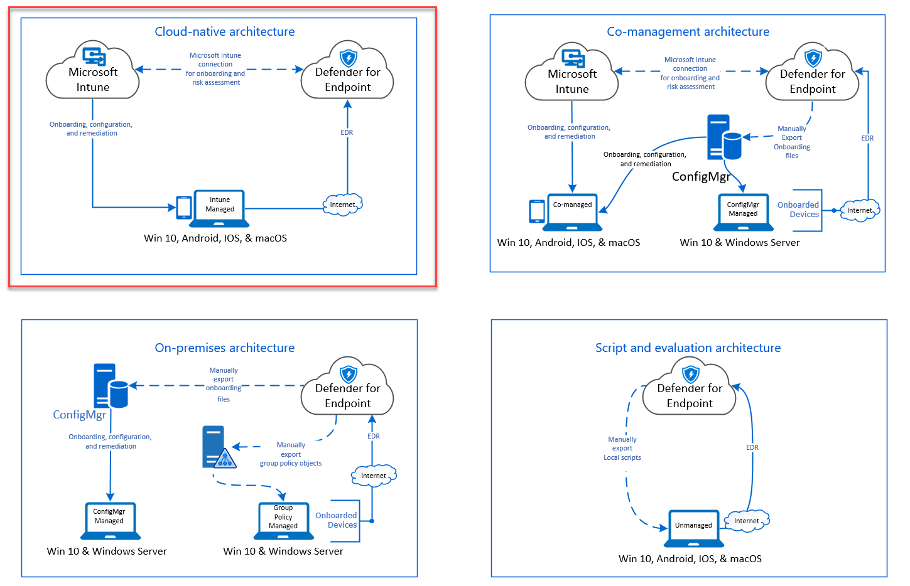
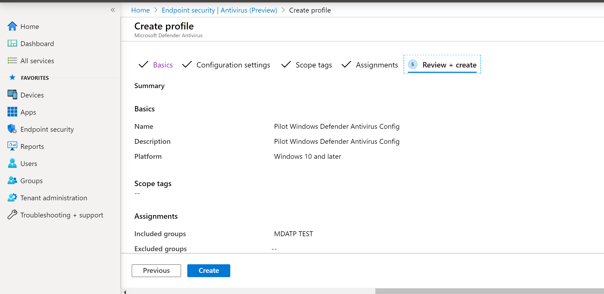
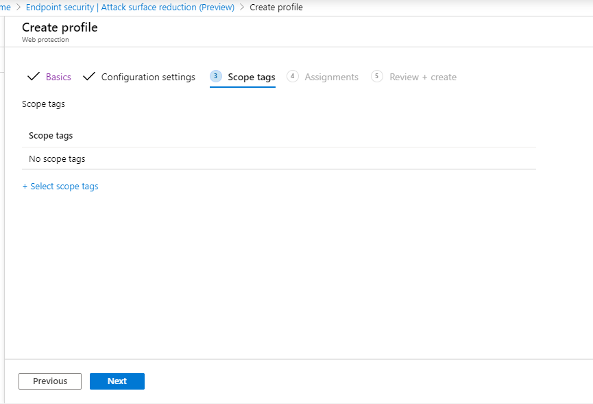
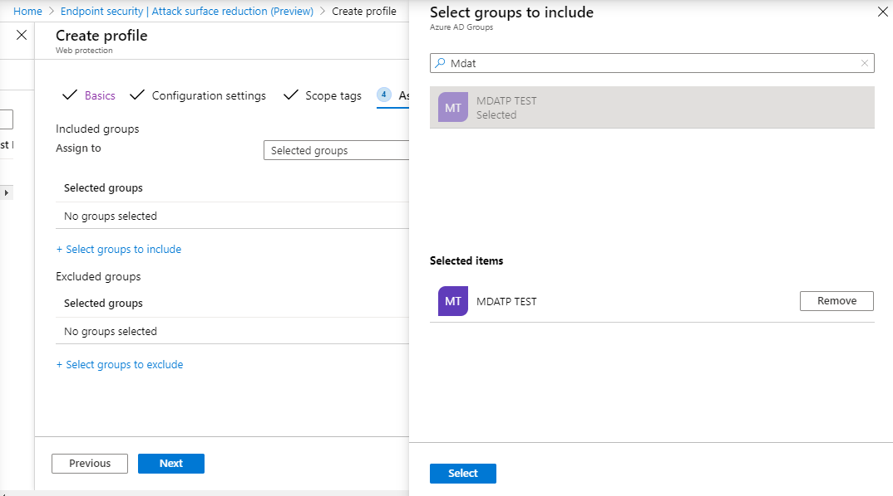
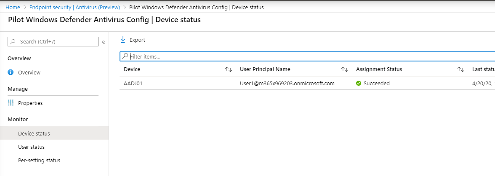
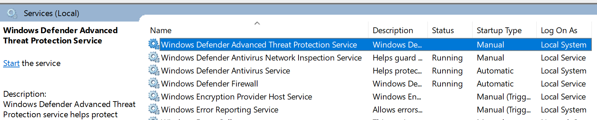

# Onboarding mithilfe des Microsoft Endpoint ManagerOnboarding using Microsoft Endpoint Manager

[!INCLUDE [Microsoft 365 Defender rebranding](../../includes/microsoft-defender.md)]

**Gilt für:****Applies to:**
- [Microsoft Defender für EndpunktMicrosoft Defender for Endpoint](https://go.microsoft.com/fwlink/p/?linkid=2154037)
- [Microsoft 365 DefenderMicrosoft 365 Defender](https://go.microsoft.com/fwlink/?linkid=2118804)

> Möchten Sie Microsoft Defender für Endpunkt erleben?Want to experience Microsoft Defender for Endpoint? [Registrieren Sie sich für eine kostenlose TestversionSign up for a free trial.](https://www.microsoft.com/microsoft-365/windows/microsoft-defender-atp?ocid=docs-wdatp-exposedapis-abovefoldlink)

Dieser Artikel ist Teil des Bereitstellungshandbuchs und dient als Beispiel für eine Onboardingmethode.This article is part of the Deployment guide and acts as an example onboarding method.

Im [Thema "Planung"](deployment-strategy.md) wurden verschiedene Methoden zum Onboarding von Geräten in den Dienst bereitgestellt.In the [Planning](deployment-strategy.md) topic, there were several methods provided to onboard devices to the service. In diesem Thema wird die cloudeigene Architektur behandelt.This topic covers the cloud-native architecture.

 *(Diagramm der Umgebungsarchitekturen)*
*Diagram of environment architectures*

Während Defender für Endpunkt das Onboarding verschiedener Endpunkte und Tools unterstützt, werden diese in diesem Artikel nicht behandelt.While Defender for Endpoint supports onboarding of various endpoints and tools, this article does not cover them. Informationen zum allgemeinen Onboarding mit anderen unterstützten Bereitstellungstools und -methoden finden Sie in der [Onboarding-Übersicht.](onboarding.md)For information on general onboarding using other supported deployment tools and methods, see [Onboarding overview](onboarding.md).

[Microsoft Endpoint Manager](/mem/endpoint-manager-overview) ist eine Lösungsplattform, die mehrere Dienste vereinheitlicht.[Microsoft Endpoint Manager](/mem/endpoint-manager-overview) is a solution platform that unifies several services. Es enthält [Microsoft Intune](/mem/intune/fundamentals/what-is-intune) für die cloudbasierte Geräteverwaltung.It includes [Microsoft Intune](/mem/intune/fundamentals/what-is-intune) for cloud-based device management.

In diesem Thema werden Benutzer zu folgenden Themen geleitet:This topic guides users in:

- Schritt 1: Onboarding von Geräten in den Dienst durch Erstellen einer Gruppe in Microsoft Endpoint Manager (MEM) zum Zuweisen von KonfigurationenStep 1: Onboarding devices to the service by creating a group in Microsoft Endpoint Manager (MEM) to assign configurations on
- Schritt 2: Konfigurieren von Defender für Endpunkt-Funktionen mit Microsoft Endpoint ManagerStep 2: Configuring Defender for Endpoint capabilities using Microsoft Endpoint Manager

Dieser Onboardingleitfaden führt Sie durch die folgenden grundlegenden Schritte, die Sie bei der Verwendung von Microsoft Endpoint Manager ausführen müssen:This onboarding guidance will walk you through the following basic steps that you need to take when using Microsoft Endpoint Manager:

- [Identifizieren von Zielgeräten oder BenutzernIdentifying target devices or users](#identify-target-devices-or-users)
  - Erstellen einer Azure Active Directory Gruppe (Benutzer oder Gerät)Creating an Azure Active Directory group (User or Device)
- [Erstellen eines KonfigurationsprofilsCreating a Configuration Profile](#step-2-create-configuration-policies-to-configure-microsoft-defender-for-endpoint-capabilities)
  - In Microsoft Endpoint Manager führen wir Sie beim Erstellen einer separaten Richtlinie für jede Funktion.In Microsoft Endpoint Manager, we'll guide you in creating a separate policy for each capability.

## RessourcenResources

Hier sind die Links, die Sie für den Rest des Prozesses benötigen:Here are the links you'll need for the rest of the process:

- [MEM-PortalMEM portal](https://aka.ms/memac)
- [SicherheitscenterSecurity Center](https://securitycenter.windows.com/)
- [Intune-SicherheitsgrundwerteIntune Security baselines](/mem/intune/protect/security-baseline-settings-defender-atp#microsoft-defender)

Weitere Informationen zu Microsoft Endpoint Manager finden Sie in den folgenden Ressourcen:For more information about Microsoft Endpoint Manager, check out these resources:

- [Microsoft Endpoint Manager SeiteMicrosoft Endpoint Manager page](/mem/)
- [Blogbeitrag zur Konvergenz von Intune und ConfigMgrBlog post on convergence of Intune and ConfigMgr](https://www.microsoft.com/microsoft-365/blog/2019/11/04/use-the-power-of-cloud-intelligence-to-simplify-and-accelerate-it-and-the-move-to-a-modern-workplace/)
- [Einführungsvideo zu MEMIntroduction video on MEM](https://www.microsoft.com/microsoft-365/blog/2019/11/04/use-the-power-of-cloud-intelligence-to-simplify-and-accelerate-it-and-the-move-to-a-modern-workplace)

## Schritt 1: Onboarding von Geräten durch Erstellen einer Gruppe in MEM zum Zuweisen von KonfigurationenStep 1: Onboard devices by creating a group in MEM to assign configurations on

### Identifizieren von Zielgeräten oder BenutzernIdentify target devices or users

In diesem Abschnitt erstellen wir eine Testgruppe zum Zuweisen Ihrer Konfigurationen.In this section, we will create a test group to assign your configurations on.

> [!NOTE]
> Intune verwendet Azure Active Directory (Azure AD)-Gruppen zum Verwalten von Geräten und Benutzern.Intune uses Azure Active Directory (Azure AD) groups to manage devices and users. Als Intune-Administrator können Sie Gruppen für Ihre Organisatorischen Anforderungen einrichten.As an Intune admin, you can set up groups to suit your organizational needs.
>
> Weitere Informationen finden Sie unter [Hinzufügen von Gruppen zum Organisieren von Benutzern und Geräten.](/mem/intune/fundamentals/groups-add)For more information, see [Add groups to organize users and devices](/mem/intune/fundamentals/groups-add).

### Erstellen einer GruppeCreate a group

1. Öffnen Sie das MEM-Portal.Open the MEM portal.

2. Öffnen **Sie Gruppen > neue Gruppe.**Open **Groups > New Group**.

    > [!div class="mx-imgBorder"]
    > 

3. Geben Sie Details ein, und erstellen Sie eine neue Gruppe.Enter details and create a new group.

    > [!div class="mx-imgBorder"]
    > 

4. Fügen Sie Ihren Testbenutzer oder Ihr Testgerät hinzu.Add your test user or device.

5. Öffnen Sie im Bereich **"Gruppen > Alle Gruppen"** die neue Gruppe.From the **Groups > All groups** pane, open your new group.

6. Wählen Sie  **Mitglieder > Mitglieder hinzufügen** aus.Select  **Members > Add members**.

7. Suchen Sie Den Testbenutzer oder das Testgerät, und wählen Sie es aus.Find your test user or device and select it.

    > [!div class="mx-imgBorder"]
    > 

8. Ihre Testgruppe verfügt nun über ein Mitglied zum Testen.Your testing group now has a member to test.

## Schritt 2: Erstellen von Konfigurationsrichtlinien zum Konfigurieren von Microsoft Defender für EndpunktfunktionenStep 2: Create configuration policies to configure Microsoft Defender for Endpoint capabilities

Im folgenden Abschnitt erstellen Sie eine Reihe von Konfigurationsrichtlinien.In the following section, you'll create a number of configuration policies.

Zunächst ist eine Konfigurationsrichtlinie zum Auswählen der Gruppen von Benutzern oder Geräten, die in Defender für Endpunkt integriert werden:First is a configuration policy to select which groups of users or devices will be onboarded to Defender for Endpoint:

- [Erkennung und Reaktion am EndpunktEndpoint detection and response](#endpoint-detection-and-response)

Anschließend erstellen Sie mehrere verschiedene Arten von Endpunktsicherheitsrichtlinien:Then you will continue by creating several different types of endpoint security policies:

- [Schutz der nächsten GenerationNext-generation protection](#next-generation-protection)
- [Verringerung der AngriffsflächeAttack surface reduction](#attack-surface-reduction--attack-surface-reduction-rules)

### Erkennung und Reaktion am EndpunktEndpoint detection and response

1. Öffnen Sie das MEM-Portal.Open the MEM portal.

2. Navigieren Sie zu **Endpunktsicherheit > Endpunkterkennung und -antwort.**Navigate to **Endpoint security > Endpoint detection and response**. Klicken Sie auf **Profil erstellen.**Click on **Create Profile**.

    > [!div class="mx-imgBorder"]
    > 

3. Wählen Sie unter **Plattform Windows 10 und höher, Profil – Endpunkterkennung und -antwort > Erstellen** aus.Under **Platform, select Windows 10 and Later, Profile - Endpoint detection  and response > Create**.

4. Geben Sie einen Namen und eine Beschreibung ein, und wählen Sie dann  **"Weiter"** aus.Enter a name and description, then select  **Next**.

    > [!div class="mx-imgBorder"]
    > 

5. Wählen Sie nach Bedarf Einstellungen aus, und wählen Sie dann  **Weiter** aus.Select settings as required, then select  **Next**.

    > [!div class="mx-imgBorder"]
    > 

    > [!NOTE]
    > In diesem Fall wurde dies automatisch ausgefüllt, da Defender für Endpunkt bereits in Intune integriert wurde.In this instance, this has been auto populated as Defender for Endpoint has already been integrated with Intune. Weitere Informationen zur Integration finden Sie unter [Aktivieren von Microsoft Defender für Endpunkt in Intune.](/mem/intune/protect/advanced-threat-protection-configure#to-enable-microsoft-defender-atp)For more information on the integration, see [Enable Microsoft Defender for Endpoint in Intune](/mem/intune/protect/advanced-threat-protection-configure#to-enable-microsoft-defender-atp).
    >
    > Die folgende Abbildung ist ein Beispiel dafür, was Sie sehen werden, wenn Microsoft Defender für Endpunkt NICHT in Intune integriert ist:The following image is an example of what you'll see when Microsoft Defender for Endpoint is NOT integrated with Intune:
    >
    > 

6. Fügen Sie bei Bedarf Bereichstags hinzu, und wählen Sie dann  **"Weiter"** aus.Add scope tags if necessary, then select  **Next**.

    > [!div class="mx-imgBorder"]
    > 

7. Fügen Sie eine Testgruppe hinzu, indem Sie auf "Gruppen auswählen" klicken, um ihre Gruppe **einzuschließen** und auszuwählen, und wählen Sie dann  **"Weiter"** aus.Add test group by clicking on **Select groups to include** and choose your group, then select  **Next**.

    > [!div class="mx-imgBorder"]
    > 

8. Überprüfen und akzeptieren Sie, und wählen Sie dann  **Erstellen** aus.Review and accept, then select  **Create**.

    > [!div class="mx-imgBorder"]
    > 

9. Sie können die abgeschlossene Richtlinie anzeigen.You can view your completed policy.

    > [!div class="mx-imgBorder"]
    > 

### Schutzlösungen der nächsten GenerationNext-generation protection

1. Öffnen Sie das MEM-Portal.Open the MEM portal.

2. Navigieren Sie zu **Endpunktsicherheit > Antivirus > Richtlinie erstellen.**Navigate to **Endpoint security > Antivirus > Create Policy**.

    > [!div class="mx-imgBorder"]
    > 

3. Plattform auswählen **– Windows 10 und höher – Windows und Profil – Microsoft Defender Antivirus > Erstellen**.Select **Platform - Windows 10 and Later - Windows and Profile – Microsoft  Defender Antivirus > Create**.

4. Geben Sie Den Namen und die Beschreibung ein, und wählen Sie dann  **Weiter** aus.Enter name and description, then select  **Next**.

    > [!div class="mx-imgBorder"]
    > 

5. Legen Sie auf der **Seite "Konfigurationseinstellungen"** die Konfigurationen fest, die Sie für Microsoft Defender Antivirus (CloudSchutz, Ausschlüsse, Real-Time Schutz und Wartung) benötigen.In the **Configuration settings page**: Set the configurations you require for  Microsoft Defender Antivirus (Cloud Protection, Exclusions, Real-Time  Protection, and Remediation).

    > [!div class="mx-imgBorder"]
    > 

6. Fügen Sie bei Bedarf Bereichstags hinzu, und wählen Sie dann  **"Weiter"** aus.Add scope tags if necessary, then select  **Next**.

    > [!div class="mx-imgBorder"]
    > 

7. Wählen Sie Die einzuschließenden Gruppen aus, weisen Sie sie Ihrer Testgruppe zu, und wählen Sie dann  **"Weiter"** aus.Select groups to include, assign to your test group, then select  **Next**.

    > [!div class="mx-imgBorder"]
    > 

8. Überprüfen und erstellen Sie, und wählen Sie dann  **"Erstellen"** aus.Review and create, then select  **Create**.

    > [!div class="mx-imgBorder"]
    > 

9. Die von Ihnen erstellte Konfigurationsrichtlinie wird angezeigt.You'll see the configuration policy you created.

    > [!div class="mx-imgBorder"]
    > 

### Attack Surface Reduction – Regeln zur Verringerung der AngriffsflächeAttack Surface Reduction – Attack surface reduction rules

1. Öffnen Sie das MEM-Portal.Open the MEM portal.

2. Navigieren Sie zu **Endpunktsicherheit > Attack Surface Reduction.**Navigate to **Endpoint security > Attack surface reduction**.

3. Wählen Sie  **"Richtlinie erstellen"** aus.Select  **Create Policy**.

4. Select **Platform – Windows 10 and later – Profile – Attack Surface Reduction rules > Create**.Select **Platform - Windows 10 and Later – Profile - Attack surface reduction  rules > Create**.

    > [!div class="mx-imgBorder"]
    > 

5. Geben Sie einen Namen und eine Beschreibung ein, und wählen Sie dann  **"Weiter"** aus.Enter a name and description, then select  **Next**.

    > [!div class="mx-imgBorder"]
    > 

6. Auf der **Seite "Konfigurationseinstellungen":** Legen Sie die Konfigurationen fest, die Sie für Attack Surface Reduction-Regeln benötigen, und wählen Sie dann  **"Weiter"** aus.In the **Configuration settings page**: Set the configurations you require for  Attack surface reduction rules, then select  **Next**.

    > [!NOTE]
    > Wir werden alle Attack Surface Reduction-Regeln für die Überwachung konfigurieren.We will be configuring all of the Attack surface reduction rules to Audit.
    >
    > Weitere Informationen finden Sie unter [Attack Surface Reduction-Regeln.](attack-surface-reduction.md)For more information, see [Attack surface reduction rules](attack-surface-reduction.md).

    > [!div class="mx-imgBorder"]
    > 

7. Fügen Sie bereichsbezogene Tags nach Bedarf hinzu, und wählen Sie dann  **"Weiter"** aus.Add Scope Tags as required, then select  **Next**.

    > [!div class="mx-imgBorder"]
    > 

8. Wählen Sie Gruppen aus, die der Testgruppe zugeordnet werden sollen, und wählen Sie dann  **"Weiter"** aus.Select groups to include and assign to test group, then select  **Next**.

    > [!div class="mx-imgBorder"]
    > 

9. Überprüfen Sie die Details, und  **wählen** Sie dann erstellen aus.Review the details, then select  **Create**.

    > [!div class="mx-imgBorder"]
    > 

10. Zeigen Sie die Richtlinie an.View the policy.

    > [!div class="mx-imgBorder"]
    > 

### Attack Surface Reduction – WebschutzAttack Surface Reduction – Web Protection

1. Öffnen Sie das MEM-Portal.Open the MEM portal.

2. Navigieren Sie zu **Endpunktsicherheit > Attack Surface Reduction.**Navigate to **Endpoint security > Attack surface reduction**.

3. Wählen Sie  **"Richtlinie erstellen"** aus.Select  **Create Policy**.

4. Wählen Sie **Windows 10 und höher – Webschutz > Erstellen** aus.Select **Windows 10 and Later – Web protection > Create**.

    > [!div class="mx-imgBorder"]
    > 

5. Geben Sie einen Namen und eine Beschreibung ein, und wählen Sie dann  **"Weiter"** aus.Enter a name and description, then select  **Next**.

    > [!div class="mx-imgBorder"]
    > 

6. Auf der **Seite "Konfigurationseinstellungen":** Legen Sie die Konfigurationen fest, die Sie für Webschutz benötigen, und wählen Sie dann  **"Weiter"** aus.In the **Configuration settings page**: Set the configurations you require for Web Protection, then select  **Next**.

    > [!NOTE]
    > Wir konfigurieren Webschutz so, dass er blockiert wird.We are configuring Web Protection to Block.
    >
    > Weitere Informationen finden Sie unter [Webschutz.](web-protection-overview.md)For more information, see [Web Protection](web-protection-overview.md).

    > [!div class="mx-imgBorder"]
    > 

7. Fügen Sie **> Nächsten nach Bedarf Bereichstags** hinzu.Add **Scope Tags as required > Next**.

    > [!div class="mx-imgBorder"]
    > 

8. Wählen Sie **"Zu Testgruppe zuweisen" > "Weiter"** aus.Select **Assign to test group > Next**.

    > [!div class="mx-imgBorder"]
    > 

9. Wählen Sie **"Überprüfen" und "Erstellen > Erstellen"** aus.Select **Review and Create > Create**.

    > [!div class="mx-imgBorder"]
    > 

10. Zeigen Sie die Richtlinie an.View the policy.

    > [!div class="mx-imgBorder"]
    > 

## Überprüfen von KonfigurationseinstellungenValidate configuration settings

### Bestätigen, dass Richtlinien angewendet wurdenConfirm Policies have been applied

Nachdem die Konfigurationsrichtlinie zugewiesen wurde, dauert es einige Zeit, bis sie angewendet wurde.Once the Configuration policy has been assigned, it will take some time to apply.

Informationen zum Timing finden Sie unter [Intune-Konfigurationsinformationen.](/mem/intune/configuration/device-profile-troubleshoot#how-long-does-it-take-for-devices-to-get-a-policy-profile-or-app-after-they-are-assigned)For information on timing, see [Intune configuration information](/mem/intune/configuration/device-profile-troubleshoot#how-long-does-it-take-for-devices-to-get-a-policy-profile-or-app-after-they-are-assigned).

Um zu bestätigen, dass die Konfigurationsrichtlinie auf Ihr Testgerät angewendet wurde, führen Sie den folgenden Prozess für jede Konfigurationsrichtlinie aus.To confirm that the configuration policy has been applied to your test device, follow the following process for each configuration policy.

1. Öffnen Sie das MEM-Portal, und navigieren Sie zur entsprechenden Richtlinie, wie in den obigen Schritten gezeigt.Open the MEM portal and navigate to the relevant policy as shown in the steps above. Das folgende Beispiel zeigt die Schutzeinstellungen der nächsten Generation.The following example shows the next generation protection settings.

    > [!div class="mx-imgBorder"]
    > 

2. Wählen Sie die **Konfigurationsrichtlinie** aus, um den Richtlinienstatus anzuzeigen.Select  the **Configuration Policy** to view the policy status.

    > [!div class="mx-imgBorder"]
    > 

3. Wählen Sie  **"Gerätestatus"** aus, um den Status anzuzeigen.Select  **Device Status** to see the status.

    > [!div class="mx-imgBorder"]
    > 

4. Wählen Sie  **"Benutzerstatus"** aus, um den Status anzuzeigen.Select  **User Status** to see the status.

    > [!div class="mx-imgBorder"]
    > 

5. Wählen Sie  **"Status pro Einstellung"** aus, um den Status anzuzeigen.Select  **Per-setting status** to see the status.

    > [!TIP]
    > Diese Ansicht ist sehr nützlich, um Einstellungen zu identifizieren, die mit einer anderen Richtlinie in Konflikt stehen.This view is very useful to identify any settings that conflict with another policy.

    > [!div class="mx-imgBorder"]
    > 

### Erkennung und Reaktion am EndpunktEndpoint detection and response

1. Vor dem Anwenden der Konfiguration sollte der Defender für Endpoint Protection-Dienst nicht gestartet werden.Before applying the configuration, the Defender for Endpoint  Protection service should not be started.

    > [!div class="mx-imgBorder"]
    > 

2. Nachdem die Konfiguration angewendet wurde, sollte der Defender für Endpoint Protection-Dienst gestartet werden.After the configuration has been applied, the Defender for Endpoint  Protection Service should be started.

    > [!div class="mx-imgBorder"]
    > 

3. Nachdem die Dienste auf dem Gerät ausgeführt wurden, wird das Gerät im Microsoft Defender Security Center angezeigt.After the services are running on the device, the device appears in Microsoft  Defender Security Center.

    > [!div class="mx-imgBorder"]
    > 

### Schutzlösungen der nächsten GenerationNext-generation protection

1. Bevor Sie die Richtlinie auf ein Testgerät anwenden, sollten Sie in der Lage sein, die Einstellungen wie unten dargestellt manuell zu verwalten.Before applying the policy on a test device, you should be able to manually  manage the settings as shown below.

    > [!div class="mx-imgBorder"]
    > 

2. Nachdem die Richtlinie angewendet wurde, sollten Sie die Einstellungen nicht manuell verwalten können.After the policy has been applied, you should not be able to manually manage  the settings.

    > [!NOTE]
    > In der folgenden Abbildung wird das Aktivieren des über die **Cloud bereitgestellten Schutzes** und das Aktivieren des **Echtzeitschutzes** als verwaltet angezeigt.In the following image **Turn on cloud-delivered protection** and **Turn on real-time protection** are being shown as managed.

    > [!div class="mx-imgBorder"]
    > 

### Attack Surface Reduction – Regeln zur Verringerung der AngriffsflächeAttack Surface Reduction – Attack surface reduction rules

1. Bevor Sie die Richtlinie auf ein Testgerät anwenden, stiften Sie ein PowerShell-Fenster, und geben Sie `Get-MpPreference` ein.Before applying the policy on a test device, pen a PowerShell Window and type `Get-MpPreference`.

2. Dies sollte mit den folgenden Zeilen ohne Inhalt antworten:This should respond with the following lines with no content:

    > AttackSurfaceReductionOnlyExclusions:AttackSurfaceReductionOnlyExclusions:
    >
    > AttackSurfaceReductionRules_Actions:AttackSurfaceReductionRules_Actions:
    >
    > AttackSurfaceReductionRules_Ids:AttackSurfaceReductionRules_Ids:

    

3. Öffnen Sie nach dem Anwenden der Richtlinie auf einem Testgerät ein PowerShell-Windows und geben Sie `Get-MpPreference` .After applying the policy on a test device, open a PowerShell Windows and type `Get-MpPreference`.

4. Dies sollte mit den folgenden Zeilen mit Inhalt wie unten dargestellt antworten:This should respond with the following lines with content as shown below:

    

### Attack Surface Reduction – WebschutzAttack Surface Reduction – Web Protection

1. Öffnen Sie auf dem Testgerät eine PowerShell-Windows und geben Sie `(Get-MpPreference).EnableNetworkProtection` .On the test device, open a PowerShell Windows and type  `(Get-MpPreference).EnableNetworkProtection`.

2. Dies sollte mit einer 0 wie unten dargestellt antworten.This should respond with a 0 as shown below.

    

3. Öffnen Sie nach dem Anwenden der Richtlinie eine PowerShell-Windows und geben Sie `(Get-MpPreference).EnableNetworkProtection` .After applying the policy, open a PowerShell Windows and type  `(Get-MpPreference).EnableNetworkProtection`.

4. Dies sollte mit einer 1 antworten, wie unten dargestellt.This should respond with a 1 as shown below.

    
