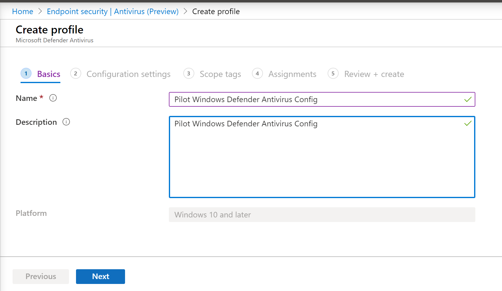

# Onboarding mithilfe des Microsoft Endpoint Manager

[!INCLUDE [Microsoft 365 Defender rebranding](../../includes/microsoft-defender.md)]

**Gilt für:**
- [Microsoft Defender für Endpunkt](https://go.microsoft.com/fwlink/p/?linkid=2154037)
- [Microsoft 365 Defender](https://go.microsoft.com/fwlink/?linkid=2118804)

> Möchten Sie Microsoft Defender für Endpunkt erleben? [Registrieren Sie sich für eine kostenlose Testversion](https://www.microsoft.com/microsoft-365/windows/microsoft-defender-atp?ocid=docs-wdatp-exposedapis-abovefoldlink)

Dieser Artikel ist Teil des Bereitstellungshandbuchs und dient als Beispiel für eine Onboardingmethode.

Im [Thema "Planung"](deployment-strategy.md) wurden verschiedene Methoden zum Onboarding von Geräten in den Dienst bereitgestellt. In diesem Thema wird die cloudeigene Architektur behandelt.

 *(Diagramm der Umgebungsarchitekturen)*

Während Defender für Endpunkt das Onboarding verschiedener Endpunkte und Tools unterstützt, werden diese in diesem Artikel nicht behandelt. Informationen zum allgemeinen Onboarding mit anderen unterstützten Bereitstellungstools und -methoden finden Sie in der [Onboarding-Übersicht.](onboarding.md)

[Microsoft Endpoint Manager](/mem/endpoint-manager-overview) ist eine Lösungsplattform, die mehrere Dienste vereinheitlicht. Es enthält [Microsoft Intune](/mem/intune/fundamentals/what-is-intune) für die cloudbasierte Geräteverwaltung.

In diesem Thema werden Benutzer zu folgenden Themen geleitet:

- Schritt 1: Onboarding von Geräten in den Dienst durch Erstellen einer Gruppe in Microsoft Endpoint Manager (MEM) zum Zuweisen von Konfigurationen
- Schritt 2: Konfigurieren von Defender für Endpunkt-Funktionen mit Microsoft Endpoint Manager

Dieser Onboardingleitfaden führt Sie durch die folgenden grundlegenden Schritte, die Sie bei der Verwendung von Microsoft Endpoint Manager ausführen müssen:

- [Identifizieren von Zielgeräten oder Benutzern](#identify-target-devices-or-users)
  - Erstellen einer Azure Active Directory Gruppe (Benutzer oder Gerät)
- [Erstellen eines Konfigurationsprofils](#step-2-create-configuration-policies-to-configure-microsoft-defender-for-endpoint-capabilities)
  - In Microsoft Endpoint Manager führen wir Sie beim Erstellen einer separaten Richtlinie für jede Funktion.

## Ressourcen

Hier sind die Links, die Sie für den Rest des Prozesses benötigen:

- [MEM-Portal](https://aka.ms/memac)
- [Sicherheitscenter](https://securitycenter.windows.com/)
- [Intune-Sicherheitsgrundwerte](/mem/intune/protect/security-baseline-settings-defender-atp#microsoft-defender)

Weitere Informationen zu Microsoft Endpoint Manager finden Sie in den folgenden Ressourcen:

- [Microsoft Endpoint Manager Seite](/mem/)
- [Blogbeitrag zur Konvergenz von Intune und ConfigMgr](https://www.microsoft.com/microsoft-365/blog/2019/11/04/use-the-power-of-cloud-intelligence-to-simplify-and-accelerate-it-and-the-move-to-a-modern-workplace/)
- [Einführungsvideo zu MEM](https://www.microsoft.com/microsoft-365/blog/2019/11/04/use-the-power-of-cloud-intelligence-to-simplify-and-accelerate-it-and-the-move-to-a-modern-workplace)

## Schritt 1: Onboarding von Geräten durch Erstellen einer Gruppe in MEM zum Zuweisen von Konfigurationen

### Identifizieren von Zielgeräten oder Benutzern

In diesem Abschnitt erstellen wir eine Testgruppe zum Zuweisen Ihrer Konfigurationen.

> [!NOTE]
> Intune verwendet Azure Active Directory (Azure AD)-Gruppen zum Verwalten von Geräten und Benutzern. Als Intune-Administrator können Sie Gruppen für Ihre Organisatorischen Anforderungen einrichten.
>
> Weitere Informationen finden Sie unter [Hinzufügen von Gruppen zum Organisieren von Benutzern und Geräten.](/mem/intune/fundamentals/groups-add)

### Erstellen einer Gruppe

1. Öffnen Sie das MEM-Portal.

2. Öffnen **Sie Gruppen > neue Gruppe.**

    > [!div class="mx-imgBorder"]
    > 

3. Geben Sie Details ein, und erstellen Sie eine neue Gruppe.

    > [!div class="mx-imgBorder"]
    > 

4. Fügen Sie Ihren Testbenutzer oder Ihr Testgerät hinzu.

5. Öffnen Sie im Bereich **"Gruppen > Alle Gruppen"** die neue Gruppe.

6. Wählen Sie  **Mitglieder > Mitglieder hinzufügen** aus.

7. Suchen Sie Den Testbenutzer oder das Testgerät, und wählen Sie es aus.

    > [!div class="mx-imgBorder"]
    > 

8. Ihre Testgruppe verfügt nun über ein Mitglied zum Testen.

## Schritt 2: Erstellen von Konfigurationsrichtlinien zum Konfigurieren von Microsoft Defender für Endpunktfunktionen

Im folgenden Abschnitt erstellen Sie eine Reihe von Konfigurationsrichtlinien.

Zunächst ist eine Konfigurationsrichtlinie zum Auswählen der Gruppen von Benutzern oder Geräten, die in Defender für Endpunkt integriert werden:

- [Erkennung und Reaktion am Endpunkt](#endpoint-detection-and-response)

Anschließend erstellen Sie mehrere verschiedene Arten von Endpunktsicherheitsrichtlinien:

- [Schutz der nächsten Generation](#next-generation-protection)
- [Verringerung der Angriffsfläche](#attack-surface-reduction--attack-surface-reduction-rules)

### Erkennung und Reaktion am Endpunkt

1. Öffnen Sie das MEM-Portal.

2. Navigieren Sie zu **Endpunktsicherheit > Endpunkterkennung und -antwort.** Klicken Sie auf **Profil erstellen.**

    > [!div class="mx-imgBorder"]
    > 

3. Wählen Sie unter **Plattform Windows 10 und höher, Profil – Endpunkterkennung und -antwort > Erstellen** aus.

4. Geben Sie einen Namen und eine Beschreibung ein, und wählen Sie dann  **"Weiter"** aus.

    > [!div class="mx-imgBorder"]
    > 

5. Wählen Sie nach Bedarf Einstellungen aus, und wählen Sie dann  **Weiter** aus.

    > [!div class="mx-imgBorder"]
    > 

    > [!NOTE]
    > In diesem Fall wurde dies automatisch ausgefüllt, da Defender für Endpunkt bereits in Intune integriert wurde. Weitere Informationen zur Integration finden Sie unter [Aktivieren von Microsoft Defender für Endpunkt in Intune.](/mem/intune/protect/advanced-threat-protection-configure#to-enable-microsoft-defender-atp)
    >
    > Die folgende Abbildung ist ein Beispiel dafür, was Sie sehen werden, wenn Microsoft Defender für Endpunkt NICHT in Intune integriert ist:
    >
    > 

6. Fügen Sie bei Bedarf Bereichstags hinzu, und wählen Sie dann  **"Weiter"** aus.

    > [!div class="mx-imgBorder"]
    > 

7. Fügen Sie eine Testgruppe hinzu, indem Sie auf "Gruppen auswählen" klicken, um ihre Gruppe **einzuschließen** und auszuwählen, und wählen Sie dann  **"Weiter"** aus.

    > [!div class="mx-imgBorder"]
    > 

8. Überprüfen und akzeptieren Sie, und wählen Sie dann  **Erstellen** aus.

    > [!div class="mx-imgBorder"]
    > 

9. Sie können die abgeschlossene Richtlinie anzeigen.

    > [!div class="mx-imgBorder"]
    > 

### Schutzlösungen der nächsten Generation

1. Öffnen Sie das MEM-Portal.

2. Navigieren Sie zu **Endpunktsicherheit > Antivirus > Richtlinie erstellen.**

    > [!div class="mx-imgBorder"]
    > 

3. Plattform auswählen **– Windows 10 und höher – Windows und Profil – Microsoft Defender Antivirus > Erstellen**.

4. Geben Sie Den Namen und die Beschreibung ein, und wählen Sie dann  **Weiter** aus.

    > [!div class="mx-imgBorder"]
    > 

5. Legen Sie auf der **Seite "Konfigurationseinstellungen"** die Konfigurationen fest, die Sie für Microsoft Defender Antivirus (CloudSchutz, Ausschlüsse, Real-Time Schutz und Wartung) benötigen.

    > [!div class="mx-imgBorder"]
    > 

6. Fügen Sie bei Bedarf Bereichstags hinzu, und wählen Sie dann  **"Weiter"** aus.

    > [!div class="mx-imgBorder"]
    > 

7. Wählen Sie Die einzuschließenden Gruppen aus, weisen Sie sie Ihrer Testgruppe zu, und wählen Sie dann  **"Weiter"** aus.

    > [!div class="mx-imgBorder"]
    > 

8. Überprüfen und erstellen Sie, und wählen Sie dann  **"Erstellen"** aus.

    > [!div class="mx-imgBorder"]
    > 

9. Die von Ihnen erstellte Konfigurationsrichtlinie wird angezeigt.

    > [!div class="mx-imgBorder"]
    > 

### Attack Surface Reduction – Regeln zur Verringerung der Angriffsfläche

1. Öffnen Sie das MEM-Portal.

2. Navigieren Sie zu **Endpunktsicherheit > Attack Surface Reduction.**

3. Wählen Sie  **"Richtlinie erstellen"** aus.

4. Select **Platform – Windows 10 and later – Profile – Attack Surface Reduction rules > Create**.

    > [!div class="mx-imgBorder"]
    > 

5. Geben Sie einen Namen und eine Beschreibung ein, und wählen Sie dann  **"Weiter"** aus.

    > [!div class="mx-imgBorder"]
    > 

6. Auf der **Seite "Konfigurationseinstellungen":** Legen Sie die Konfigurationen fest, die Sie für Attack Surface Reduction-Regeln benötigen, und wählen Sie dann  **"Weiter"** aus.

    > [!NOTE]
    > Wir werden alle Attack Surface Reduction-Regeln für die Überwachung konfigurieren.
    >
    > Weitere Informationen finden Sie unter [Attack Surface Reduction-Regeln.](attack-surface-reduction.md)

    > [!div class="mx-imgBorder"]
    > 

7. Fügen Sie bereichsbezogene Tags nach Bedarf hinzu, und wählen Sie dann  **"Weiter"** aus.

    > [!div class="mx-imgBorder"]
    > 

8. Wählen Sie Gruppen aus, die der Testgruppe zugeordnet werden sollen, und wählen Sie dann  **"Weiter"** aus.

    > [!div class="mx-imgBorder"]
    > 

9. Überprüfen Sie die Details, und  **wählen** Sie dann erstellen aus.

    > [!div class="mx-imgBorder"]
    > 

10. Zeigen Sie die Richtlinie an.

    > [!div class="mx-imgBorder"]
    > 

### Attack Surface Reduction – Webschutz

1. Öffnen Sie das MEM-Portal.

2. Navigieren Sie zu **Endpunktsicherheit > Attack Surface Reduction.**

3. Wählen Sie  **"Richtlinie erstellen"** aus.

4. Wählen Sie **Windows 10 und höher – Webschutz > Erstellen** aus.

    > [!div class="mx-imgBorder"]
    > 

5. Geben Sie einen Namen und eine Beschreibung ein, und wählen Sie dann  **"Weiter"** aus.

    > [!div class="mx-imgBorder"]
    > 

6. Auf der **Seite "Konfigurationseinstellungen":** Legen Sie die Konfigurationen fest, die Sie für Webschutz benötigen, und wählen Sie dann  **"Weiter"** aus.

    > [!NOTE]
    > Wir konfigurieren Webschutz so, dass er blockiert wird.
    >
    > Weitere Informationen finden Sie unter [Webschutz.](web-protection-overview.md)

    > [!div class="mx-imgBorder"]
    > 

7. Fügen Sie **> Nächsten nach Bedarf Bereichstags** hinzu.

    > [!div class="mx-imgBorder"]
    > 

8. Wählen Sie **"Zu Testgruppe zuweisen" > "Weiter"** aus.

    > [!div class="mx-imgBorder"]
    > 

9. Wählen Sie **"Überprüfen" und "Erstellen > Erstellen"** aus.

    > [!div class="mx-imgBorder"]
    > 

10. Zeigen Sie die Richtlinie an.

    > [!div class="mx-imgBorder"]
    > 

## Überprüfen von Konfigurationseinstellungen

### Bestätigen, dass Richtlinien angewendet wurden

Nachdem die Konfigurationsrichtlinie zugewiesen wurde, dauert es einige Zeit, bis sie angewendet wurde.

Informationen zum Timing finden Sie unter [Intune-Konfigurationsinformationen.](/mem/intune/configuration/device-profile-troubleshoot#how-long-does-it-take-for-devices-to-get-a-policy-profile-or-app-after-they-are-assigned)

Um zu bestätigen, dass die Konfigurationsrichtlinie auf Ihr Testgerät angewendet wurde, führen Sie den folgenden Prozess für jede Konfigurationsrichtlinie aus.

1. Öffnen Sie das MEM-Portal, und navigieren Sie zur entsprechenden Richtlinie, wie in den obigen Schritten gezeigt. Das folgende Beispiel zeigt die Schutzeinstellungen der nächsten Generation.

    > [!div class="mx-imgBorder"]
    > 

2. Wählen Sie die **Konfigurationsrichtlinie** aus, um den Richtlinienstatus anzuzeigen.

    > [!div class="mx-imgBorder"]
    > 

3. Wählen Sie  **"Gerätestatus"** aus, um den Status anzuzeigen.

    > [!div class="mx-imgBorder"]
    > 

4. Wählen Sie  **"Benutzerstatus"** aus, um den Status anzuzeigen.

    > [!div class="mx-imgBorder"]
    > 

5. Wählen Sie  **"Status pro Einstellung"** aus, um den Status anzuzeigen.

    > [!TIP]
    > Diese Ansicht ist sehr nützlich, um Einstellungen zu identifizieren, die mit einer anderen Richtlinie in Konflikt stehen.

    > [!div class="mx-imgBorder"]
    > 

### Erkennung und Reaktion am Endpunkt

1. Vor dem Anwenden der Konfiguration sollte der Defender für Endpoint Protection-Dienst nicht gestartet werden.

    > [!div class="mx-imgBorder"]
    > 

2. Nachdem die Konfiguration angewendet wurde, sollte der Defender für Endpoint Protection-Dienst gestartet werden.

    > [!div class="mx-imgBorder"]
    > 

3. Nachdem die Dienste auf dem Gerät ausgeführt wurden, wird das Gerät im Microsoft Defender Security Center angezeigt.

    > [!div class="mx-imgBorder"]
    > 

### Schutzlösungen der nächsten Generation

1. Bevor Sie die Richtlinie auf ein Testgerät anwenden, sollten Sie in der Lage sein, die Einstellungen wie unten dargestellt manuell zu verwalten.

    > [!div class="mx-imgBorder"]
    > 

2. Nachdem die Richtlinie angewendet wurde, sollten Sie die Einstellungen nicht manuell verwalten können.

    > [!NOTE]
    > In der folgenden Abbildung wird das Aktivieren des über die **Cloud bereitgestellten Schutzes** und das Aktivieren des **Echtzeitschutzes** als verwaltet angezeigt.

    > [!div class="mx-imgBorder"]
    > 

### Attack Surface Reduction – Regeln zur Verringerung der Angriffsfläche

1. Bevor Sie die Richtlinie auf ein Testgerät anwenden, stiften Sie ein PowerShell-Fenster, und geben Sie `Get-MpPreference` ein.

2. Dies sollte mit den folgenden Zeilen ohne Inhalt antworten:

    > AttackSurfaceReductionOnlyExclusions:
    >
    > AttackSurfaceReductionRules_Actions:
    >
    > AttackSurfaceReductionRules_Ids:

    

3. Öffnen Sie nach dem Anwenden der Richtlinie auf einem Testgerät ein PowerShell-Windows und geben Sie `Get-MpPreference` .

4. Dies sollte mit den folgenden Zeilen mit Inhalt wie unten dargestellt antworten:

    

### Attack Surface Reduction – Webschutz

1. Öffnen Sie auf dem Testgerät eine PowerShell-Windows und geben Sie `(Get-MpPreference).EnableNetworkProtection` .

2. Dies sollte mit einer 0 wie unten dargestellt antworten.

    

3. Öffnen Sie nach dem Anwenden der Richtlinie eine PowerShell-Windows und geben Sie `(Get-MpPreference).EnableNetworkProtection` .

4. Dies sollte mit einer 1 antworten, wie unten dargestellt.

    
